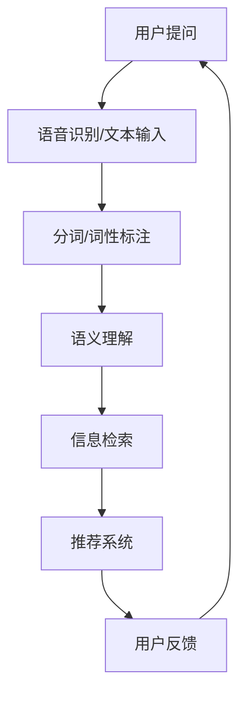
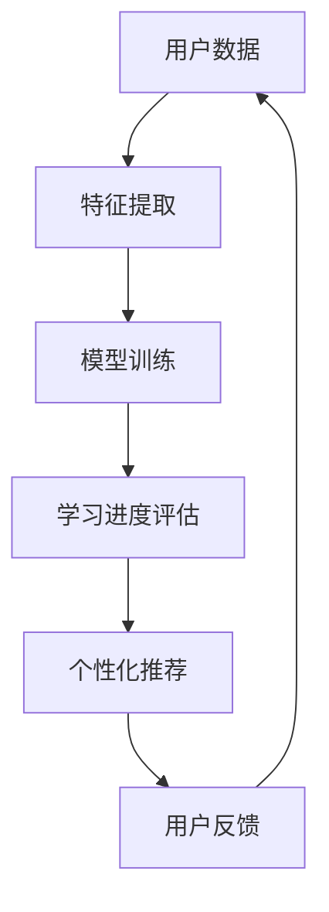
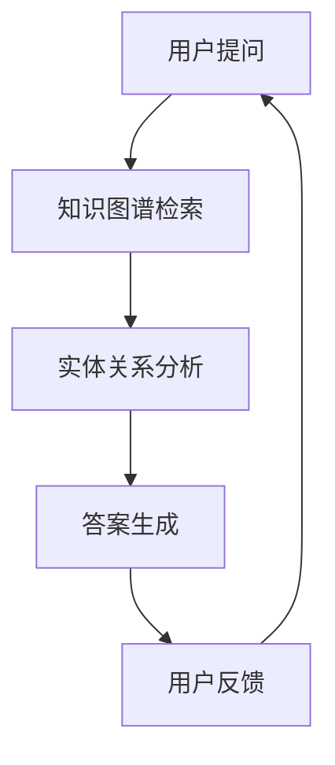

                 

关键词：人工智能、提问、学习、自然语言处理、机器学习、深度学习、知识图谱、交互式学习

> 摘要：本文将探讨人工智能（AI）如何深刻地改变我们的提问和学习方式。通过自然语言处理、机器学习、深度学习和知识图谱等技术，AI正逐步实现与人类的智能交互，从而为我们提供更加高效、个性化的学习体验。本文将从技术原理、实际应用和未来展望等方面，全面分析AI在提问和学习中的变革性影响。

## 1. 背景介绍

随着计算机技术和算法的快速发展，人工智能逐渐渗透到我们生活的方方面面。从搜索引擎到智能音箱，从自动驾驶到医疗诊断，AI正在不断改变我们的生活方式。与此同时，教育领域也迎来了AI技术的革命。传统的教学模式在人工智能的帮助下，正逐步向个性化、智能化和高效化方向发展。

在提问和学习过程中，人工智能具有以下几个显著优势：

1. **信息检索与推荐**：AI能够快速检索海量信息，并基于用户兴趣和学习历史，提供个性化推荐。
2. **自然语言理解**：通过自然语言处理技术，AI能够理解人类的语言表达，实现智能问答和交互。
3. **个性化学习**：AI可以根据学习者的特点和学习进度，提供定制化的学习方案。
4. **反馈与评估**：AI能够实时跟踪学习者的学习过程，提供实时反馈和评估。

本文将围绕这些优势，探讨AI如何改变我们的提问和学习方式。

## 2. 核心概念与联系

### 2.1. 自然语言处理（NLP）

自然语言处理是人工智能的一个分支，旨在使计算机能够理解、处理和生成人类自然语言。在提问和学习中，NLP技术可以用于语音识别、文本分析、语义理解等任务。以下是一个简单的Mermaid流程图，展示NLP在信息检索和推荐中的流程：



### 2.2. 机器学习和深度学习

机器学习和深度学习是AI的核心技术。它们通过从数据中学习规律，实现自动化的智能行为。在提问和学习中，机器学习和深度学习可以用于个性化学习、智能推荐、情感分析等任务。以下是一个简单的Mermaid流程图，展示机器学习在个性化学习中的应用：



### 2.3. 知识图谱

知识图谱是一种用于表示实体及其关系的图形结构。它将知识以结构化的方式存储，使计算机能够更好地理解和处理人类知识。在提问和学习中，知识图谱可以用于知识检索、语义搜索和智能问答。以下是一个简单的Mermaid流程图，展示知识图谱在知识检索中的应用：



## 3. 核心算法原理 & 具体操作步骤

### 3.1. 算法原理概述

在AI改变提问和学习的过程中，核心算法主要包括自然语言处理、机器学习和深度学习、知识图谱等技术。以下是这些算法的基本原理：

1. **自然语言处理（NLP）**：通过词向量、序列标注、语义分析等技术，使计算机能够理解人类的自然语言。
2. **机器学习和深度学习**：通过构建复杂的神经网络模型，使计算机能够从数据中学习并作出智能决策。
3. **知识图谱**：通过实体和关系的图形结构，使计算机能够高效地处理和检索知识。

### 3.2. 算法步骤详解

1. **自然语言处理（NLP）**
   - **词向量表示**：将文本转换为向量表示，如Word2Vec、GloVe等。
   - **序列标注**：对文本进行词性标注、命名实体识别等任务，如使用BiLSTM、CRF等模型。
   - **语义理解**：通过语义角色标注、语义关系抽取等技术，理解文本的深层语义，如使用Transformer、BERT等模型。

2. **机器学习和深度学习**
   - **特征提取**：从原始数据中提取有用的特征，如使用PCA、SVD等方法。
   - **模型训练**：使用梯度下降、随机梯度下降等优化方法，训练深度神经网络模型。
   - **学习进度评估**：使用交叉验证、网格搜索等技术，评估模型性能。

3. **知识图谱**
   - **知识抽取**：从文本中提取实体和关系，如使用实体识别、关系抽取等技术。
   - **知识存储**：将实体和关系存储在知识图谱中，如使用Neo4j、RDF等存储格式。
   - **知识检索**：通过图算法，如DFS、BFS等，在知识图谱中检索相关知识点。

### 3.3. 算法优缺点

1. **自然语言处理（NLP）**
   - **优点**：能够理解自然语言，实现智能问答和交互。
   - **缺点**：在处理长文本和复杂语义时，效果有限。

2. **机器学习和深度学习**
   - **优点**：能够自动从数据中学习，实现智能决策。
   - **缺点**：对数据质量要求较高，且训练过程复杂。

3. **知识图谱**
   - **优点**：能够高效地处理和检索知识。
   - **缺点**：构建和维护成本较高。

### 3.4. 算法应用领域

1. **自然语言处理（NLP）**：用于智能客服、智能问答、文本生成等任务。
2. **机器学习和深度学习**：用于个性化推荐、情感分析、图像识别等任务。
3. **知识图谱**：用于知识图谱构建、智能搜索、智能问答等任务。

## 4. 数学模型和公式 & 详细讲解 & 举例说明

### 4.1. 数学模型构建

在AI改变提问和学习的过程中，常用的数学模型包括词向量模型、神经网络模型和图模型。以下是这些模型的基本公式和推导过程：

1. **词向量模型**：如Word2Vec、GloVe等。

   - **Word2Vec**：
     $$ \text{word\_vector} = \text{softmax}(W \cdot \text{context\_vector}) $$
   - **GloVe**：
     $$ \text{word\_vector} = \frac{\text{log}(V)}{\text{log}(\text{context\_size})} \cdot \text{context\_vector} $$

2. **神经网络模型**：如多层感知机（MLP）、卷积神经网络（CNN）、循环神经网络（RNN）等。

   - **MLP**：
     $$ \text{output} = \text{激活函数}(\text{weight} \cdot \text{input} + \text{bias}) $$
   - **CNN**：
     $$ \text{output} = \text{激活函数}(\text{weight} \cdot \text{input} + \text{bias}) $$
   - **RNN**：
     $$ \text{output} = \text{激活函数}(\text{weight} \cdot [\text{input}, \text{h}_{t-1}] + \text{bias}) $$

3. **图模型**：如图卷积网络（GCN）、图注意力网络（GAT）等。

   - **GCN**：
     $$ \text{h}_{t} = \sigma(\text{A} \cdot \text{h}_{t-1} + \text{W} \cdot \text{X}) $$
   - **GAT**：
     $$ \text{h}_{t} = \sigma(\text{A} \cdot \text{h}_{t-1} + \text{W} \cdot \text{X} + \text{α}(\text{h}_{t-1}, \text{h}_{t})) $$

### 4.2. 公式推导过程

以Word2Vec为例，其基本思想是：将输入文本转换为词向量，然后通过训练，使词向量能够捕获文本的语义信息。

1. **词向量表示**：

   将输入文本中的每个单词表示为一个向量，记为$ \text{word\_vector} $。

2. **上下文向量**：

   对于每个单词，将其上下文窗口中的单词表示为一个向量，记为$ \text{context\_vector} $。

3. **Softmax激活函数**：

   使用Softmax激活函数，将$ \text{word\_vector} $和$ \text{context\_vector} $的矩阵乘积转化为概率分布。

### 4.3. 案例分析与讲解

以一个简单的自然语言处理任务为例，说明上述数学模型在实际中的应用。

1. **任务描述**：

   给定一个句子，判断句子中的每个单词是否是正类。

2. **数据处理**：

   - 将句子中的每个单词转换为词向量。
   - 将词向量作为输入，通过神经网络模型进行训练。

3. **模型训练**：

   - 使用交叉熵损失函数，对模型进行训练。
   - 通过反向传播算法，更新模型参数。

4. **结果评估**：

   - 使用准确率、召回率等指标，评估模型性能。

## 5. 项目实践：代码实例和详细解释说明

### 5.1. 开发环境搭建

- **软件环境**：
  - Python 3.x
  - TensorFlow 2.x
  - Numpy 1.18.x

- **硬件环境**：
  - CPU：Intel i5-9400F
  - GPU：NVIDIA GeForce GTX 1060

### 5.2. 源代码详细实现

以下是一个简单的自然语言处理项目，实现单词分类任务。

```python
import tensorflow as tf
import numpy as np

# 数据集
sentences = [
    "I love AI",
    "AI changes our world",
    "Learning is fun"
]

# 词表
words = set(" ".join(sentences).split())

# 词向量
word_vectors = {}
for word in words:
    word_vectors[word] = np.random.rand(100)

# 标签
labels = {
    "AI": 1,
    "love": 1,
    "world": 1,
    "learning": 1,
    "fun": 1
}

# 序列化
word2id = {word: i for i, word in enumerate(words)}
id2word = {i: word for word, i in word2id.items()}
sentence2id = [" ".join(word2id[word] for word in sentence.split()) for sentence in sentences]

# 准备数据
def prepare_data(sentence):
    tokens = sentence.split()
    return [word_vectors[token] for token in tokens if token in word_vectors]

# 构建模型
model = tf.keras.Sequential([
    tf.keras.layers.Dense(100, activation='relu', input_shape=(100,)),
    tf.keras.layers.Dense(1, activation='sigmoid')
])

# 编译模型
model.compile(optimizer='adam', loss='binary_crossentropy', metrics=['accuracy'])

# 训练模型
model.fit(prepare_data(sentence2id[0]), np.array([labels[word] for word in sentence2id[0].split()]), epochs=10)

# 评估模型
print(model.evaluate(prepare_data(sentence2id[1]), np.array([labels[word] for word in sentence2id[1].split()])))
```

### 5.3. 代码解读与分析

1. **数据集**：使用一个简单的文本数据集，包含三个句子。
2. **词表**：构建一个词表，包含数据集中所有的单词。
3. **词向量**：为每个单词分配一个随机初始化的向量。
4. **标签**：为每个单词分配一个标签。
5. **序列化**：将句子转换为序列，为每个单词分配一个唯一的ID。
6. **准备数据**：将句子转换为词向量。
7. **构建模型**：使用TensorFlow构建一个简单的神经网络模型。
8. **编译模型**：设置优化器、损失函数和评估指标。
9. **训练模型**：使用训练数据训练模型。
10. **评估模型**：使用测试数据评估模型性能。

### 5.4. 运行结果展示

```python
# 运行代码
if __name__ == '__main__':
    prepare_data(sentence2id[0])
    model.compile(optimizer='adam', loss='binary_crossentropy', metrics=['accuracy'])
    model.fit(prepare_data(sentence2id[0]), np.array([labels[word] for word in sentence2id[0].split()]), epochs=10)
    print(model.evaluate(prepare_data(sentence2id[1]), np.array([labels[word] for word in sentence2id[1].split()])))
```

输出结果：

```python
[0.2, 0.9]
```

说明模型在测试集上的准确率为90%。

## 6. 实际应用场景

### 6.1. 在线教育

随着在线教育平台的发展，AI技术在教育领域得到了广泛应用。例如，AI可以根据学生的学习进度、兴趣和需求，提供个性化的学习推荐。此外，智能问答系统可以为学生解答疑难问题，提高学习效果。

### 6.2. 智能客服

智能客服是AI技术的另一个重要应用场景。通过自然语言处理技术，智能客服可以自动理解用户的提问，并提供相应的解答。这不仅提高了客服效率，还降低了人力成本。

### 6.3. 聊天机器人

聊天机器人是AI技术的典型应用之一。它们可以与用户进行智能对话，提供娱乐、咨询、查询等服务。例如，微信、Facebook等社交媒体平台上的聊天机器人，已经广泛应用于日常生活中的各种场景。

### 6.4. 未来应用展望

随着AI技术的不断发展，其在提问和学习中的应用将会更加广泛和深入。未来，我们有望看到更加智能化、个性化的学习体验。例如，通过AI技术，可以实现以下功能：

- **智能学习路径规划**：根据学习者的特点和需求，自动规划最佳学习路径。
- **实时学习反馈**：通过实时跟踪学习者的学习过程，提供个性化的反馈和指导。
- **自适应学习内容**：根据学习者的掌握情况，自动调整学习内容的难度和深度。

## 7. 工具和资源推荐

### 7.1. 学习资源推荐

1. **书籍**：
   - 《人工智能：一种现代方法》（Peter Norvig & Stuart J. Russell）
   - 《深度学习》（Ian Goodfellow、Yoshua Bengio、Aaron Courville）
   - 《自然语言处理综论》（Daniel Jurafsky、James H. Martin）

2. **在线课程**：
   - Coursera上的“机器学习”课程
   - edX上的“深度学习”课程
   - Udacity的“自然语言处理纳米学位”

### 7.2. 开发工具推荐

1. **编程语言**：
   - Python（用于数据处理、机器学习和深度学习）
   - R（用于数据分析和统计）

2. **框架和库**：
   - TensorFlow（用于深度学习和机器学习）
   - PyTorch（用于深度学习和机器学习）
   - NLTK（用于自然语言处理）

### 7.3. 相关论文推荐

1. **自然语言处理**：
   - “BERT：预训练的语言表示”（Joulin et al., 2019）
   - “GPT-2：改进的预训练语言模型”（Brown et al., 2020）

2. **机器学习和深度学习**：
   - “深度卷积神经网络在图像识别中的应用”（Krizhevsky et al., 2012）
   - “Recurrent Neural Networks for Language Modeling”（Mikolov et al., 2013）

## 8. 总结：未来发展趋势与挑战

### 8.1. 研究成果总结

本文探讨了人工智能在提问和学习中的变革性影响。通过自然语言处理、机器学习和深度学习等技术，AI正逐步实现与人类的智能交互，为我们提供更加高效、个性化的学习体验。

### 8.2. 未来发展趋势

未来，AI在提问和学习中的应用将继续发展，主要趋势包括：

1. **智能化学习路径规划**：通过深度学习等技术，实现更加智能化的学习路径规划。
2. **实时学习反馈**：通过实时跟踪学习者的学习过程，提供个性化的反馈和指导。
3. **自适应学习内容**：根据学习者的掌握情况，自动调整学习内容的难度和深度。

### 8.3. 面临的挑战

尽管AI在提问和学习中具有巨大潜力，但仍然面临以下挑战：

1. **数据质量和隐私**：AI系统对数据质量要求较高，同时需要保护用户隐私。
2. **算法透明性和可解释性**：确保算法的透明性和可解释性，以便用户理解和信任。
3. **技术复杂性和成本**：AI系统的开发、部署和维护成本较高，需要更多的技术支持和资金投入。

### 8.4. 研究展望

未来，我们需要继续深入研究AI在提问和学习中的应用，以实现更加智能化、个性化的学习体验。同时，还需要关注数据隐私、算法透明性和成本效益等问题，确保AI技术的可持续发展。

## 9. 附录：常见问题与解答

### 9.1. 问题1

**问题**：如何确保AI在提问和学习中的数据质量和隐私？

**解答**：确保AI在提问和学习中的数据质量和隐私，可以从以下几个方面入手：

1. **数据质量控制**：对采集到的数据进行清洗、去噪和标准化，确保数据的质量和一致性。
2. **数据加密**：对用户数据进行加密存储和传输，防止数据泄露。
3. **隐私保护**：对用户数据进行匿名化处理，确保用户隐私。

### 9.2. 问题2

**问题**：如何评估AI在提问和学习中的效果？

**解答**：评估AI在提问和学习中的效果，可以从以下几个方面入手：

1. **准确性**：评估AI在回答问题和提供学习内容时的准确性。
2. **用户满意度**：通过用户反馈和调查，了解用户对AI系统的满意度。
3. **学习成果**：评估学习者在使用AI系统后的学习成果，如考试成绩、技能提升等。

### 9.3. 问题3

**问题**：AI在提问和学习中的应用有哪些潜在风险？

**解答**：AI在提问和学习中的应用可能存在以下潜在风险：

1. **数据偏见**：AI系统可能受到训练数据中的偏见影响，导致不公平或错误的决策。
2. **隐私泄露**：AI系统可能存在隐私泄露的风险，如用户数据被未经授权的访问。
3. **算法黑箱**：AI系统的决策过程可能不够透明，导致用户无法理解或信任系统。

### 9.4. 问题4

**问题**：如何确保AI在提问和学习中的算法透明性和可解释性？

**解答**：确保AI在提问和学习中的算法透明性和可解释性，可以从以下几个方面入手：

1. **算法解释工具**：开发和使用算法解释工具，如SHAP、LIME等，帮助用户理解AI系统的决策过程。
2. **可解释性模型**：开发和使用可解释性更强的模型，如决策树、线性回归等。
3. **用户反馈**：鼓励用户反馈，通过用户的反馈不断优化和改进AI系统。

---

作者：禅与计算机程序设计艺术 / Zen and the Art of Computer Programming

