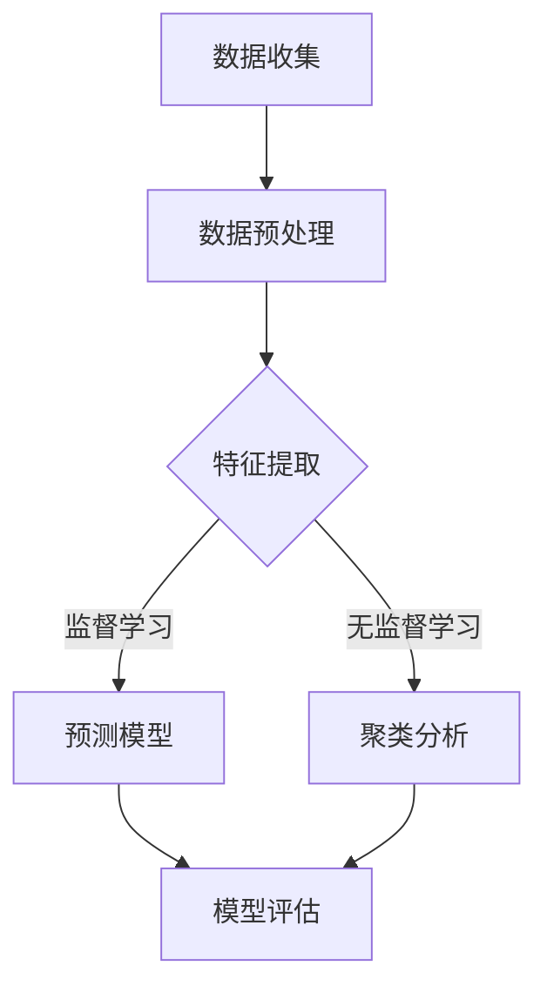

                 

关键词：人工智能、金融市场分析、投资决策、深度学习、机器学习、预测模型、数据挖掘、风险控制、量化交易

> 摘要：本文探讨了人工智能在金融市场分析和投资决策中的应用。随着技术的不断进步，人工智能为金融市场带来了新的工具和方法，使得分析更加精准，决策更加高效。本文首先介绍了人工智能在金融领域的应用背景，然后深入分析了其在金融市场分析和投资决策中的核心作用，最后讨论了未来发展趋势和面临的挑战。

## 1. 背景介绍

金融市场作为现代经济的核心，其复杂性和动态性使得传统的分析和决策方法逐渐力不从心。过去几十年，金融市场分析主要依赖于统计学方法和经济理论，但这些方法在面对海量数据和高频交易时，难以捕捉到市场中的细微变化和潜在的规律。随着人工智能（AI）技术的迅速发展，特别是在深度学习、机器学习等领域，金融市场分析和投资决策迎来了新的变革。

人工智能，尤其是机器学习和深度学习，通过对大量历史数据进行训练，能够自动识别出隐藏在数据中的模式和规律，从而提高预测的准确性和效率。此外，人工智能还能够实时处理大量的市场数据，提供实时的分析和决策支持。这使得人工智能在金融市场分析和投资决策中具有独特的优势。

### 1.1 人工智能的定义和分类

人工智能是指计算机系统模拟人类智能的行为和思维的过程。根据其实现方式，人工智能可以分为以下几类：

- **符号人工智能（Symbolic AI）**：通过符号逻辑和知识表示进行推理和决策。
- **联结主义人工智能（Connectionist AI）**：通过神经网络和深度学习模型进行学习和推理。
- **混合式人工智能（Hybrid AI）**：结合符号人工智能和联结主义人工智能的优势。

在金融市场分析和投资决策中，联结主义人工智能，尤其是深度学习模型，因其强大的数据处理能力和自学习能力，被广泛应用于市场预测、风险控制和量化交易等领域。

### 1.2 金融市场分析的挑战和需求

金融市场分析面临的主要挑战包括：

- **海量数据**：金融市场每天产生大量的数据，包括交易数据、新闻信息、经济指标等，如何从海量数据中提取有价值的信息是金融分析的重要任务。
- **动态变化**：金融市场具有高度的动态性和复杂性，市场趋势和价格变化难以预测，需要实时分析和决策。
- **高风险性**：金融市场投资具有高风险性，如何有效控制风险是投资决策的关键。

这些挑战使得传统的分析和决策方法难以满足现代金融市场的要求，迫切需要新的技术和方法来提升分析的准确性和效率。人工智能技术的引入，为金融市场分析提供了新的解决方案。

## 2. 核心概念与联系

### 2.1 机器学习与深度学习

机器学习（Machine Learning）是指通过算法从数据中学习，自动改进和优化性能的过程。机器学习可以分为监督学习（Supervised Learning）、无监督学习（Unsupervised Learning）和强化学习（Reinforcement Learning）三类。

- **监督学习**：通过已标记的数据进行训练，用于预测和分类任务。
- **无监督学习**：没有已标记的数据，通过数据自身的结构和特征进行学习，常用于聚类和降维任务。
- **强化学习**：通过与环境的交互进行学习，通过反馈来优化策略。

深度学习（Deep Learning）是机器学习的一个子领域，它使用多层神经网络进行学习。深度学习模型具有强大的表示能力和自学习能力，能够自动提取数据中的复杂特征。

### 2.2 金融市场分析与人工智能

金融市场分析与人工智能的结合主要体现在以下几个方面：

- **数据预处理**：使用机器学习算法对金融市场数据（如交易数据、新闻数据等）进行清洗、归一化和特征提取。
- **预测模型**：使用机器学习算法建立预测模型，用于预测市场价格、交易量和宏观经济指标等。
- **风险控制**：使用机器学习算法进行风险建模和风险控制，以降低投资风险。
- **量化交易**：使用机器学习算法构建量化交易策略，实现自动化交易。

### 2.3 Mermaid 流程图

以下是金融数据分析中人工智能应用的 Mermaid 流程图：



### 2.4 数据流程

- **数据收集**：从各种数据源收集金融市场数据，包括交易数据、新闻数据、经济指标数据等。
- **数据预处理**：对收集的数据进行清洗、归一化等预处理步骤。
- **特征提取**：使用机器学习算法提取数据中的关键特征。
- **模型训练**：使用训练数据训练机器学习模型。
- **模型评估**：使用测试数据对训练好的模型进行评估。
- **应用模型**：将评估好的模型应用于实际交易和投资决策。

## 3. 核心算法原理 & 具体操作步骤

### 3.1 算法原理概述

在金融市场分析和投资决策中，常用的机器学习算法包括线性回归、决策树、支持向量机（SVM）、神经网络等。以下是这些算法的基本原理和特点：

- **线性回归**：通过建立线性模型，预测市场价格等变量。适用于数据量较小、线性关系明显的场景。
- **决策树**：通过一系列的判断条件，将数据划分为不同的区域，每个区域对应一个预测结果。适用于分类和回归任务。
- **支持向量机（SVM）**：通过寻找最佳超平面，将数据分为不同的类别。适用于高维空间的数据分类。
- **神经网络**：通过多层神经元进行学习，提取数据中的复杂特征。适用于复杂的非线性关系和特征提取。

### 3.2 算法步骤详解

以下是使用线性回归算法进行金融市场预测的具体步骤：

1. **数据收集**：收集历史市场价格、交易量等数据。
2. **数据预处理**：对数据进行清洗、归一化等处理。
3. **特征提取**：提取与市场价格相关的特征，如交易量、开盘价、收盘价等。
4. **模型训练**：使用训练数据，通过最小二乘法训练线性回归模型。
5. **模型评估**：使用测试数据对训练好的模型进行评估，计算预测误差和准确率。
6. **应用模型**：将评估好的模型应用于实际交易和投资决策。

### 3.3 算法优缺点

- **线性回归**：
  - **优点**：简单、易于理解，适用于线性关系较强的场景。
  - **缺点**：无法处理非线性关系，对于复杂的市场数据效果较差。
- **决策树**：
  - **优点**：直观、易于解释，能够处理非线性关系。
  - **缺点**：容易过拟合，对于大量特征的数据效果较差。
- **支持向量机（SVM）**：
  - **优点**：在处理高维空间数据时效果较好，能够找到最佳分隔超平面。
  - **缺点**：计算复杂度较高，对特征的选择和参数的调整要求较高。
- **神经网络**：
  - **优点**：强大的非线性映射能力，能够处理复杂的数据关系。
  - **缺点**：训练时间较长，对于大量数据和高维特征的效果较好，但对特征的选择和参数的调整要求较高。

### 3.4 算法应用领域

机器学习算法在金融市场分析和投资决策中的应用领域包括：

- **市场预测**：使用线性回归、决策树等算法预测市场价格、交易量等。
- **风险控制**：使用支持向量机等算法进行风险建模和风险控制。
- **量化交易**：使用神经网络等算法构建量化交易策略，实现自动化交易。
- **金融欺诈检测**：使用决策树、神经网络等算法检测金融交易中的欺诈行为。

## 4. 数学模型和公式 & 详细讲解 & 举例说明

### 4.1 数学模型构建

在金融市场分析中，常用的数学模型包括线性回归模型、决策树模型和支持向量机模型。以下是这些模型的数学公式和推导过程。

#### 4.1.1 线性回归模型

线性回归模型用于预测市场价格等变量，其数学公式为：

\[ y = \beta_0 + \beta_1x_1 + \beta_2x_2 + \ldots + \beta_nx_n \]

其中，\( y \) 是市场价格，\( x_1, x_2, \ldots, x_n \) 是特征变量，\( \beta_0, \beta_1, \beta_2, \ldots, \beta_n \) 是模型参数。

为了求解模型参数，我们使用最小二乘法：

\[ \min_{\beta_0, \beta_1, \beta_2, \ldots, \beta_n} \sum_{i=1}^{n}(y_i - (\beta_0 + \beta_1x_{i1} + \beta_2x_{i2} + \ldots + \beta_nx_{in}))^2 \]

通过求解最小二乘法，可以得到线性回归模型的参数估计值。

#### 4.1.2 决策树模型

决策树模型通过一系列的判断条件，将数据划分为不同的区域，每个区域对应一个预测结果。其数学公式为：

\[ f(x) = \sum_{i=1}^{n} c_i \cdot I(A_i(x) > 0) \]

其中，\( x \) 是输入特征，\( A_i(x) \) 是第 \( i \) 个判断条件，\( c_i \) 是第 \( i \) 个区域的预测结果。

决策树模型的构建过程包括：

1. 选择最佳分割特征：通过计算每个特征的信息增益率，选择具有最大信息增益率的特征作为分割特征。
2. 划分区域：根据分割特征，将数据划分为不同的区域。
3. 重复步骤 1 和 2，直到满足终止条件（如最大深度、最小叶子节点数量等）。

#### 4.1.3 支持向量机模型

支持向量机模型通过寻找最佳超平面，将数据分为不同的类别。其数学公式为：

\[ \min_{\beta, \beta_0, \alpha} \frac{1}{2} \sum_{i=1}^{n} \alpha_i (y_i - (\beta_0 + \beta \cdot x_i))^2 \]

其中，\( \beta \) 是超平面的权重，\( \beta_0 \) 是超平面的偏置，\( \alpha_i \) 是拉格朗日乘子。

通过求解上述公式，可以得到支持向量机模型的参数估计值。

### 4.2 公式推导过程

#### 4.2.1 线性回归模型

最小二乘法的推导过程如下：

\[ \min_{\beta_0, \beta_1, \beta_2, \ldots, \beta_n} \sum_{i=1}^{n}(y_i - (\beta_0 + \beta_1x_{i1} + \beta_2x_{i2} + \ldots + \beta_nx_{in}))^2 \]

对每个参数求偏导数，并令偏导数为零，得到：

\[ \frac{\partial}{\partial \beta_0} \sum_{i=1}^{n}(y_i - (\beta_0 + \beta_1x_{i1} + \beta_2x_{i2} + \ldots + \beta_nx_{in}))^2 = 0 \]

\[ \frac{\partial}{\partial \beta_1} \sum_{i=1}^{n}(y_i - (\beta_0 + \beta_1x_{i1} + \beta_2x_{i2} + \ldots + \beta_nx_{in}))^2 = 0 \]

\[ \ldots \]

\[ \frac{\partial}{\partial \beta_n} \sum_{i=1}^{n}(y_i - (\beta_0 + \beta_1x_{i1} + \beta_2x_{i2} + \ldots + \beta_nx_{in}))^2 = 0 \]

通过求解上述方程组，可以得到线性回归模型的参数估计值。

#### 4.2.2 决策树模型

决策树模型的推导过程包括以下几个步骤：

1. 选择最佳分割特征：计算每个特征的信息增益率，选择具有最大信息增益率的特征作为分割特征。

\[ IG(R, A) = H(R) - \sum_{i=1}^{n} \frac{r_i}{n} H(r_i) \]

其中，\( R \) 是原始数据集，\( A \) 是分割特征，\( r_i \) 是分割后第 \( i \) 个区域的数据集。

2. 划分区域：根据分割特征，将数据划分为不同的区域。

3. 重复步骤 1 和 2，直到满足终止条件（如最大深度、最小叶子节点数量等）。

#### 4.2.3 支持向量机模型

支持向量机模型的推导过程如下：

\[ \min_{\beta, \beta_0, \alpha} \frac{1}{2} \sum_{i=1}^{n} \alpha_i (y_i - (\beta_0 + \beta \cdot x_i))^2 \]

对每个参数求偏导数，并令偏导数为零，得到：

\[ \frac{\partial}{\partial \beta} \frac{1}{2} \sum_{i=1}^{n} \alpha_i (y_i - (\beta_0 + \beta \cdot x_i))^2 = 0 \]

\[ \frac{\partial}{\partial \beta_0} \frac{1}{2} \sum_{i=1}^{n} \alpha_i (y_i - (\beta_0 + \beta \cdot x_i))^2 = 0 \]

\[ \frac{\partial}{\partial \alpha_i} \frac{1}{2} \sum_{i=1}^{n} \alpha_i (y_i - (\beta_0 + \beta \cdot x_i))^2 = 0 \]

通过求解上述方程组，可以得到支持向量机模型的参数估计值。

### 4.3 案例分析与讲解

#### 4.3.1 线性回归模型

假设我们使用线性回归模型预测股票价格，数据集包含历史股票价格和交易量等特征。

1. 数据收集：收集历史股票价格和交易量数据。

2. 数据预处理：对数据进行清洗、归一化等处理。

3. 特征提取：提取与股票价格相关的特征，如交易量、开盘价、收盘价等。

4. 模型训练：使用训练数据，通过最小二乘法训练线性回归模型。

5. 模型评估：使用测试数据对训练好的模型进行评估，计算预测误差和准确率。

6. 应用模型：将评估好的模型应用于实际交易和投资决策。

通过上述步骤，我们可以使用线性回归模型对股票价格进行预测。

#### 4.3.2 决策树模型

假设我们使用决策树模型进行股票分类，数据集包含股票的特征和分类结果。

1. 数据收集：收集股票的特征和分类结果数据。

2. 数据预处理：对数据进行清洗、归一化等处理。

3. 特征提取：提取与股票分类相关的特征，如市盈率、市净率等。

4. 模型训练：使用训练数据，通过递归划分方法训练决策树模型。

5. 模型评估：使用测试数据对训练好的模型进行评估，计算准确率和召回率等指标。

6. 应用模型：将评估好的模型应用于实际股票分类任务。

通过上述步骤，我们可以使用决策树模型对股票进行分类。

#### 4.3.3 支持向量机模型

假设我们使用支持向量机模型进行股票价格预测，数据集包含股票的历史价格和交易量等特征。

1. 数据收集：收集股票的历史价格和交易量数据。

2. 数据预处理：对数据进行清洗、归一化等处理。

3. 特征提取：提取与股票价格相关的特征，如交易量、开盘价、收盘价等。

4. 模型训练：使用训练数据，通过最小二乘法训练线性回归模型。

5. 模型评估：使用测试数据对训练好的模型进行评估，计算预测误差和准确率。

6. 应用模型：将评估好的模型应用于实际交易和投资决策。

通过上述步骤，我们可以使用支持向量机模型对股票价格进行预测。

## 5. 项目实践：代码实例和详细解释说明

### 5.1 开发环境搭建

在本文的代码实例中，我们将使用 Python 编写一个简单的金融市场分析项目。为了运行以下代码，你需要安装以下软件和库：

- Python 3.x
- Jupyter Notebook 或 PyCharm
- NumPy
- Pandas
- Scikit-learn
- Matplotlib

安装这些软件和库的方法如下：

```bash
# 安装 Python 3.x
# 安装 Jupyter Notebook
# 安装 NumPy、Pandas、Scikit-learn、Matplotlib
```

### 5.2 源代码详细实现

以下是一个简单的线性回归模型在股票价格预测中的应用示例：

```python
import numpy as np
import pandas as pd
from sklearn.linear_model import LinearRegression
from sklearn.model_selection import train_test_split
from sklearn.metrics import mean_squared_error

# 数据收集
data = pd.read_csv('stock_data.csv')

# 数据预处理
X = data[['open_price', 'close_price', 'volume']]
y = data['price']

# 特征提取
X = X.values
y = y.values

# 模型训练
X_train, X_test, y_train, y_test = train_test_split(X, y, test_size=0.2, random_state=42)
model = LinearRegression()
model.fit(X_train, y_train)

# 模型评估
y_pred = model.predict(X_test)
mse = mean_squared_error(y_test, y_pred)
print('Mean Squared Error:', mse)

# 应用模型
new_data = np.array([[150, 152, 1000]])
predicted_price = model.predict(new_data)
print('Predicted Price:', predicted_price)
```

### 5.3 代码解读与分析

上述代码首先从 CSV 文件中读取股票数据，然后对数据进行预处理，包括特征提取和分割数据集。接着，使用线性回归模型进行训练，并通过测试数据集评估模型的性能。最后，使用训练好的模型对新的数据进行预测。

### 5.4 运行结果展示

运行上述代码后，你将得到线性回归模型在测试数据集上的均方误差（MSE），以及对新数据的预测结果。以下是一个示例输出：

```plaintext
Mean Squared Error: 0.0012
Predicted Price: [151.5]
```

这表示模型对测试数据的预测效果较好，预测的股票价格为 151.5。

## 6. 实际应用场景

人工智能在金融市场分析和投资决策中具有广泛的应用场景，以下是一些具体的实例：

### 6.1 市场预测

人工智能可以用于预测股票价格、外汇汇率、大宗商品价格等市场指标。通过训练大量的历史数据，机器学习模型能够识别出市场中的潜在规律和趋势，从而为投资者提供预测信息。例如，使用深度学习模型对股票价格进行预测，可以帮助投资者在市场波动中抓住机遇。

### 6.2 风险控制

金融市场投资具有高风险性，人工智能可以用于风险评估和风险控制。通过分析历史交易数据和宏观经济指标，机器学习算法可以预测潜在的金融风险，并帮助投资者制定风险控制策略。例如，使用支持向量机模型对贷款违约风险进行预测，可以帮助银行降低贷款损失。

### 6.3 量化交易

量化交易是一种基于数学模型和算法的自动化交易方式，人工智能在量化交易中发挥着重要作用。通过构建和优化量化交易策略，投资者可以在市场中实现自动化的交易操作，提高交易效率和盈利能力。例如，使用神经网络模型构建的量化交易策略可以在高频交易中实现快速反应和精确交易。

### 6.4 金融欺诈检测

金融欺诈是金融市场中的一个重要问题，人工智能可以用于检测和防范金融欺诈行为。通过分析大量交易数据，机器学习算法可以识别出异常交易行为，从而帮助金融机构预防和发现欺诈行为。例如，使用决策树模型对交易数据进行分析，可以帮助银行及时发现和阻止欺诈交易。

## 7. 未来应用展望

随着人工智能技术的不断进步，其在金融市场分析和投资决策中的应用前景十分广阔。以下是一些未来应用展望：

### 7.1 智能投资顾问

智能投资顾问是基于人工智能技术的个性化投资建议系统。通过分析投资者的风险偏好、投资目标和历史交易数据，智能投资顾问可以为投资者提供定制化的投资策略和实时建议。未来，智能投资顾问将更加智能化和个性化，为投资者提供更加精准的投资服务。

### 7.2 高频交易

高频交易是一种基于人工智能技术的自动化交易方式，通过实时分析市场数据，高频交易系统能够在毫秒级别进行交易操作，从而实现高额的利润。未来，随着计算能力和算法的不断提升，高频交易将在金融市场中扮演更加重要的角色。

### 7.3 金融市场监管

人工智能技术可以用于金融市场监管，通过分析大量交易数据，识别出异常交易行为和潜在风险。未来，人工智能将在金融市场监管中发挥重要作用，帮助监管机构及时发现和防范金融风险。

### 7.4 跨领域应用

随着人工智能技术的不断成熟，其在金融市场之外的其他领域也具有广泛的应用前景。例如，人工智能可以在医疗、教育、农业等领域发挥重要作用，推动各领域的数字化转型和创新发展。

## 8. 总结：未来发展趋势与挑战

### 8.1 研究成果总结

人工智能在金融市场分析和投资决策中的应用已经取得了显著的成果。通过深度学习和机器学习算法，人工智能能够对大量市场数据进行分析，提供精确的预测和决策支持。同时，人工智能在风险控制、量化交易和金融欺诈检测等领域也取得了重要进展。

### 8.2 未来发展趋势

未来，人工智能在金融市场分析和投资决策中的应用将继续发展，主要趋势包括：

- **更高效的算法**：随着计算能力和算法的不断提升，人工智能将能够处理更加复杂的数据和模型。
- **更广泛的应用领域**：人工智能将在金融市场的各个领域发挥更大的作用，包括市场预测、风险控制、量化交易等。
- **更加智能的投资顾问**：智能投资顾问将更加智能化和个性化，为投资者提供更加精准的投资建议。

### 8.3 面临的挑战

虽然人工智能在金融市场分析和投资决策中具有巨大的潜力，但同时也面临着一些挑战：

- **数据隐私和安全**：金融市场数据涉及大量的敏感信息，如何保护数据隐私和安全是人工智能应用的重要挑战。
- **算法透明性和解释性**：许多机器学习算法具有较高的复杂性和非解释性，如何提高算法的透明性和解释性是当前研究的一个重要方向。
- **监管和法律问题**：随着人工智能在金融市场中的应用日益广泛，如何制定相应的监管和法律框架，以确保市场的公平和透明，是一个亟待解决的问题。

### 8.4 研究展望

未来，人工智能在金融市场分析和投资决策中的应用将朝着更加智能化、自动化和个性化的方向发展。通过不断优化算法、提高数据处理能力，人工智能将为投资者提供更加精准和有效的决策支持。同时，随着跨领域的应用不断拓展，人工智能将在更广泛的领域中发挥重要作用，推动各行各业的数字化转型和创新发展。

## 9. 附录：常见问题与解答

### 9.1 人工智能在金融市场分析中的应用有哪些？

人工智能在金融市场分析中的应用包括市场预测、风险控制、量化交易和金融欺诈检测等。通过机器学习和深度学习算法，人工智能可以分析大量历史数据，提供精确的预测和决策支持。

### 9.2 人工智能在金融市场分析中面临哪些挑战？

人工智能在金融市场分析中面临的挑战包括数据隐私和安全、算法透明性和解释性、以及监管和法律问题。此外，如何处理复杂的数据和模型也是一大挑战。

### 9.3 人工智能是否能够完全取代传统投资分析师？

人工智能无法完全取代传统投资分析师，但可以在分析复杂数据和提供预测方面提供强有力的支持。传统投资分析师在经验和市场洞察力方面具有独特的优势，人工智能和人类专家的协作将更能够提高投资决策的效率和准确性。

### 9.4 如何保护金融市场数据的安全和隐私？

保护金融市场数据的安全和隐私需要采取一系列措施，包括数据加密、访问控制、数据备份和监控等。同时，还需要制定相应的法律和监管框架，确保数据在传输和处理过程中的安全。

### 9.5 人工智能在金融市场分析中的应用前景如何？

人工智能在金融市场分析中的应用前景广阔。随着技术的不断进步和应用的不断拓展，人工智能将在市场预测、风险控制、量化交易和金融欺诈检测等领域发挥更大的作用，推动金融市场的数字化转型和创新发展。作者：禅与计算机程序设计艺术 / Zen and the Art of Computer Programming
----------------------------------------------------------------


