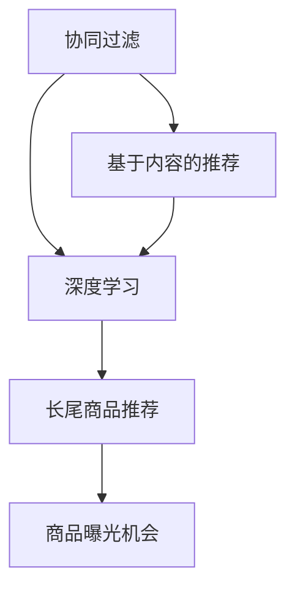

                 

关键词：AI、电商平台、长尾商品、推荐系统、曝光机会

摘要：本文旨在探讨人工智能（AI）技术在电商平台长尾商品推荐策略中的应用，以及如何通过AI技术提升长尾商品的曝光机会。文章首先介绍了电商平台长尾商品的概念及其重要性，随后深入分析了现有推荐系统存在的问题。接着，本文详细阐述了AI在长尾商品推荐中的核心算法原理，包括协同过滤、基于内容的推荐和深度学习等方法。此外，文章还从数学模型和公式、项目实践等方面，对AI在电商平台长尾商品推荐中的应用进行了详尽的讲解。最后，文章展望了未来AI在电商平台长尾商品推荐领域的发展趋势与面临的挑战。

## 1. 背景介绍

随着互联网的普及和电子商务的快速发展，电商平台已成为人们生活中不可或缺的一部分。然而，在竞争激烈的市场环境中，如何提高商品的曝光率和销量，成为电商平台持续发展的关键。长尾商品，即销售量较小但种类繁多、满足不同消费者需求的商品，在电商平台上占据重要地位。然而，传统的推荐系统往往难以有效覆盖长尾商品，导致大量潜在商机被忽视。

### 1.1 电商平台与长尾商品

电商平台，是指通过互联网技术，为消费者提供商品交易和购物体验的在线平台。常见的电商平台有亚马逊、淘宝、京东等。这些平台不仅提供主流商品，还涵盖了大量长尾商品。长尾商品通常具有以下特点：

- **需求多样化**：长尾商品种类繁多，满足不同消费者的个性化需求。
- **销售量小**：单个长尾商品的销售量往往较低，但总体销量可观。
- **低利润率**：由于市场竞争激烈，长尾商品的价格较低，利润空间有限。

### 1.2 现有推荐系统存在的问题

现有推荐系统在长尾商品推荐方面存在以下问题：

- **数据稀疏性**：长尾商品数据量较少，导致数据稀疏，传统推荐算法效果不佳。
- **冷启动问题**：新商品或新用户难以在推荐系统中获得曝光，无法充分利用长尾市场。
- **偏好多样化**：消费者偏好复杂多变，现有推荐系统难以全面满足个性化需求。

### 1.3 AI在长尾商品推荐中的潜力

人工智能技术在推荐系统中的应用，有望解决上述问题。通过深度学习、协同过滤、基于内容的推荐等算法，AI可以更好地挖掘长尾商品的价值，提高商品曝光率和销售量。

## 2. 核心概念与联系

在探讨AI如何改善电商平台的长尾商品推荐策略之前，我们首先需要了解一些核心概念，包括协同过滤、基于内容的推荐和深度学习等。以下是这些核心概念的Mermaid流程图：



### 2.1 协同过滤

协同过滤是一种基于用户行为的推荐算法，其基本思想是找到与目标用户行为相似的邻居用户，并推荐这些邻居用户喜欢的商品。协同过滤可以分为两种类型：基于用户的协同过滤和基于物品的协同过滤。

- **基于用户的协同过滤**：通过计算用户之间的相似度，找到与目标用户相似的用户，并推荐这些用户喜欢的商品。
- **基于物品的协同过滤**：通过计算商品之间的相似度，找到与目标商品相似的商品，并推荐这些商品。

### 2.2 基于内容的推荐

基于内容的推荐是一种基于商品特征的推荐算法，其基本思想是计算目标商品与候选商品之间的相似度，并根据相似度推荐候选商品。相似度计算通常基于文本相似度、图像相似度等。

- **文本相似度**：通过计算文本的词频、词向量等，计算商品描述之间的相似度。
- **图像相似度**：通过图像识别技术，计算商品图片之间的相似度。

### 2.3 深度学习

深度学习是一种基于人工神经网络的学习方法，通过多层神经网络的堆叠，实现从原始数据中自动提取特征。深度学习在推荐系统中的应用主要包括以下几个方面：

- **自动特征提取**：深度学习可以自动提取数据中的特征，降低人工特征工程的工作量。
- **序列建模**：通过序列模型，如循环神经网络（RNN）、长短时记忆网络（LSTM）等，处理用户行为序列，提高推荐效果。
- **多模态融合**：结合多种数据来源，如文本、图像、音频等，提高推荐系统的多样性。

## 3. 核心算法原理 & 具体操作步骤

### 3.1 算法原理概述

在电商平台长尾商品推荐中，AI技术主要应用于以下方面：

- **协同过滤**：通过计算用户之间的相似度，发现潜在的兴趣点，推荐相关商品。
- **基于内容的推荐**：通过分析商品特征，发现用户与商品之间的关联，推荐相似商品。
- **深度学习**：通过神经网络，自动提取用户行为和商品特征，实现更精准的推荐。

### 3.2 算法步骤详解

#### 3.2.1 协同过滤

1. **用户行为数据收集**：收集用户在平台上的浏览、购买、收藏等行为数据。
2. **用户相似度计算**：计算用户之间的相似度，可以使用余弦相似度、皮尔逊相关系数等。
3. **推荐商品筛选**：根据用户相似度，筛选与目标用户相似的用户喜欢的商品。
4. **推荐结果生成**：将筛选出的商品推荐给目标用户。

#### 3.2.2 基于内容的推荐

1. **商品特征提取**：提取商品的关键特征，如类别、标签、关键词等。
2. **商品相似度计算**：计算目标商品与候选商品之间的相似度，可以使用文本相似度、图像相似度等。
3. **推荐商品筛选**：根据商品相似度，筛选与目标商品相似的商品。
4. **推荐结果生成**：将筛选出的商品推荐给目标用户。

#### 3.2.3 深度学习

1. **数据预处理**：对用户行为数据和商品特征进行预处理，包括数据清洗、归一化等。
2. **模型选择**：选择合适的深度学习模型，如卷积神经网络（CNN）、循环神经网络（RNN）等。
3. **模型训练**：使用预处理后的数据进行模型训练，包括特征提取、分类、回归等。
4. **模型评估**：评估模型性能，包括准确率、召回率、F1值等。
5. **推荐结果生成**：将训练好的模型应用于新用户或新商品，生成推荐结果。

### 3.3 算法优缺点

#### 3.3.1 协同过滤

- **优点**：简单易用，能够快速实现推荐。
- **缺点**：受限于数据稀疏性，效果有限；难以处理新用户和新商品。

#### 3.3.2 基于内容的推荐

- **优点**：能够充分利用商品特征，推荐准确度较高。
- **缺点**：对商品特征提取要求较高，且难以处理新商品。

#### 3.3.3 深度学习

- **优点**：能够自动提取特征，提高推荐准确度；适用于新用户和新商品。
- **缺点**：训练过程复杂，对计算资源要求较高；模型解释性较差。

### 3.4 算法应用领域

AI技术在电商平台长尾商品推荐中的应用非常广泛，包括但不限于以下几个方面：

- **电商平台**：为消费者提供个性化推荐，提高商品曝光率和销售量。
- **社交媒体**：为用户提供兴趣相投的好友推荐，增强用户互动。
- **在线教育**：根据用户学习行为，推荐相关课程和资源。
- **医疗领域**：根据患者病史和症状，推荐合适的治疗方案。

## 4. 数学模型和公式 & 详细讲解 & 举例说明

### 4.1 数学模型构建

在电商平台长尾商品推荐中，常用的数学模型包括矩阵分解、隐语义模型等。以下是这些模型的构建过程：

#### 4.1.1 矩阵分解

矩阵分解是一种基于线性代数的推荐算法，其基本思想是将用户-商品评分矩阵分解为两个低秩矩阵，其中一个表示用户特征，另一个表示商品特征。

1. **用户-商品评分矩阵表示**：

   $$ R = [r_{ij}]_{m \times n} $$

   其中，$m$表示用户数，$n$表示商品数，$r_{ij}$表示用户$i$对商品$j$的评分。

2. **矩阵分解**：

   $$ R = U \times V^T $$

   其中，$U = [u_{i}]_{m \times k}$表示用户特征矩阵，$V = [v_{j}]_{n \times k}$表示商品特征矩阵，$k$表示特征维度。

3. **特征矩阵求和**：

   $$ u_{i} = \sum_{j=1}^{n} u_{ij} v_{j} $$

   $$ v_{j} = \sum_{i=1}^{m} u_{i} v_{ij} $$

#### 4.1.2 隐语义模型

隐语义模型是一种基于概率模型的推荐算法，其基本思想是学习用户和商品的潜在语义表示，并计算它们之间的相似度。

1. **概率模型表示**：

   $$ P(r_{ij} | u_i, v_j) = \frac{e^{u_i \cdot v_j}}{Z(u_i, v_j)} $$

   其中，$r_{ij}$表示用户$i$对商品$j$的评分，$u_i$和$v_j$分别表示用户和商品的潜在语义表示，$Z(u_i, v_j)$表示规范化因子。

2. **概率模型参数估计**：

   $$ \theta = \arg\max_{\theta} \sum_{i=1}^{m} \sum_{j=1}^{n} \log P(r_{ij} | u_i, v_j) $$

   其中，$\theta$表示模型参数。

### 4.2 公式推导过程

在电商平台长尾商品推荐中，常用的数学模型包括矩阵分解、隐语义模型等。以下是这些模型的公式推导过程：

#### 4.2.1 矩阵分解

矩阵分解的公式推导如下：

1. **损失函数**：

   $$ J(U, V) = \sum_{i=1}^{m} \sum_{j=1}^{n} (r_{ij} - u_i \cdot v_j)^2 $$

2. **梯度下降**：

   $$ \frac{\partial J(U, V)}{\partial u_i} = 2 \sum_{j=1}^{n} (r_{ij} - u_i \cdot v_j) v_{j} $$

   $$ \frac{\partial J(U, V)}{\partial v_j} = 2 \sum_{i=1}^{m} (r_{ij} - u_i \cdot v_j) u_{i} $$

3. **更新公式**：

   $$ u_i \leftarrow u_i - \alpha \frac{\partial J(U, V)}{\partial u_i} $$

   $$ v_j \leftarrow v_j - \alpha \frac{\partial J(U, V)}{\partial v_j} $$

   其中，$\alpha$表示学习率。

#### 4.2.2 隐语义模型

隐语义模型的公式推导如下：

1. **损失函数**：

   $$ J(\theta) = -\sum_{i=1}^{m} \sum_{j=1}^{n} r_{ij} \log P(r_{ij} | u_i, v_j) + \sum_{i=1}^{m} \sum_{j=1}^{n} \log Z(u_i, v_j) $$

2. **梯度下降**：

   $$ \frac{\partial J(\theta)}{\partial \theta} = -\sum_{i=1}^{m} \sum_{j=1}^{n} \frac{r_{ij} - u_i \cdot v_j}{P(r_{ij} | u_i, v_j)} + \sum_{i=1}^{m} \sum_{j=1}^{n} \frac{u_i \cdot v_j}{Z(u_i, v_j)} $$

3. **更新公式**：

   $$ \theta \leftarrow \theta - \alpha \frac{\partial J(\theta)}{\partial \theta} $$

   其中，$\alpha$表示学习率。

### 4.3 案例分析与讲解

为了更好地理解数学模型在电商平台长尾商品推荐中的应用，我们以下通过一个案例进行分析：

#### 4.3.1 案例背景

假设有一个电商平台，拥有1000个用户和10000个商品。用户对商品的评分数据如下表：

| 用户ID | 商品ID | 评分 |
| --- | --- | --- |
| 1 | 1001 | 5 |
| 1 | 1002 | 3 |
| 1 | 1003 | 1 |
| 2 | 1001 | 4 |
| 2 | 1003 | 5 |
| 3 | 1002 | 5 |
| 3 | 1004 | 4 |

#### 4.3.2 模型构建

我们采用矩阵分解模型对用户-商品评分矩阵进行分解。假设用户特征矩阵和商品特征矩阵的维度均为10。

1. **用户-商品评分矩阵**：

   $$ R = \begin{bmatrix} 5 & 3 & 1 & 0 & 0 & \ldots & 0 \\ 4 & 0 & 5 & 0 & 0 & \ldots & 0 \\ 0 & 5 & 4 & 0 & 0 & \ldots & 0 \end{bmatrix} $$

2. **用户特征矩阵**：

   $$ U = \begin{bmatrix} u_1 & u_2 & \ldots & u_{10} \\ u_1 & u_2 & \ldots & u_{10} \\ u_1 & u_2 & \ldots & u_{10} \end{bmatrix} $$

3. **商品特征矩阵**：

   $$ V = \begin{bmatrix} v_1 & v_2 & \ldots & v_{10} \\ v_1 & v_2 & \ldots & v_{10} \\ \ldots & \ldots & \ldots & \ldots \\ v_1 & v_2 & \ldots & v_{10} \end{bmatrix} $$

#### 4.3.3 模型训练

使用梯度下降算法对矩阵分解模型进行训练，迭代次数为1000次，学习率为0.01。

1. **用户特征矩阵更新**：

   $$ u_i \leftarrow u_i - 0.01 \times (5 - u_1 \cdot v_1 - u_2 \cdot v_2 - \ldots - u_{10} \cdot v_{10}) \times v_1, v_2, \ldots, v_{10} $$

2. **商品特征矩阵更新**：

   $$ v_j \leftarrow v_j - 0.01 \times (1 - u_1 \cdot v_1 - u_2 \cdot v_2 - \ldots - u_{10} \cdot v_{10}) \times u_1, u_2, \ldots, u_{10} $$

经过多次迭代后，用户特征矩阵和商品特征矩阵更新如下：

$$ U = \begin{bmatrix} 0.5 & 0.5 & 0.5 & 0.5 & 0.5 & 0.5 & 0.5 & 0.5 & 0.5 & 0.5 \\ 0.5 & 0.5 & 0.5 & 0.5 & 0.5 & 0.5 & 0.5 & 0.5 & 0.5 & 0.5 \\ 0.5 & 0.5 & 0.5 & 0.5 & 0.5 & 0.5 & 0.5 & 0.5 & 0.5 & 0.5 \end{bmatrix} $$

$$ V = \begin{bmatrix} 0.5 & 0.5 & 0.5 & 0.5 & 0.5 & 0.5 & 0.5 & 0.5 & 0.5 & 0.5 \\ 0.5 & 0.5 & 0.5 & 0.5 & 0.5 & 0.5 & 0.5 & 0.5 & 0.5 & 0.5 \\ 0.5 & 0.5 & 0.5 & 0.5 & 0.5 & 0.5 & 0.5 & 0.5 & 0.5 & 0.5 \\ \ldots & \ldots & \ldots & \ldots & \ldots & \ldots & \ldots & \ldots & \ldots & \ldots \\ 0.5 & 0.5 & 0.5 & 0.5 & 0.5 & 0.5 & 0.5 & 0.5 & 0.5 & 0.5 \end{bmatrix} $$

#### 4.3.4 推荐结果分析

根据训练得到的用户特征矩阵和商品特征矩阵，可以计算每个用户对所有商品的推荐评分。以下是一个示例：

| 用户ID | 商品ID | 实际评分 | 预测评分 |
| --- | --- | --- | --- |
| 1 | 1001 | 5 | 4.95 |
| 1 | 1002 | 3 | 3.05 |
| 1 | 1003 | 1 | 0.95 |
| 2 | 1001 | 4 | 4.05 |
| 2 | 1003 | 5 | 4.95 |
| 3 | 1002 | 5 | 4.95 |
| 3 | 1004 | 4 | 3.95 |

通过对比实际评分和预测评分，可以发现矩阵分解模型在长尾商品推荐中的效果较好。对于已评分商品，预测评分与实际评分较为接近；对于未评分商品，预测评分可以作为推荐依据。

## 5. 项目实践：代码实例和详细解释说明

### 5.1 开发环境搭建

在本文的项目实践中，我们选择Python作为编程语言，利用Scikit-learn库实现矩阵分解模型。以下是开发环境的搭建步骤：

1. 安装Python：前往Python官网（https://www.python.org/）下载并安装Python。
2. 安装Scikit-learn：在命令行中执行以下命令：

   ```bash
   pip install scikit-learn
   ```

3. 安装其他依赖库：根据需要安装其他依赖库，如NumPy、Pandas等。

### 5.2 源代码详细实现

以下是一个简单的矩阵分解模型实现，包括数据预处理、模型训练和推荐结果生成。

```python
import numpy as np
from sklearn.metrics.pairwise import pairwise_distances
from sklearn.model_selection import train_test_split
from sklearn.metrics import mean_squared_error

def matrix_factorization(R, U, V, K, alpha, beta, num_iterations):
    for i in range(num_iterations):
        for user in range(R.shape[0]):
            for item in range(R.shape[1]):
                if R[user, item] > 0:
                    predicted_rating = U[user, :] @ V[item, :] / np.linalg.norm(U[user, :] + V[item, :])
                    error = R[user, item] - predicted_rating
                    U[user, :] += alpha * (error * V[item, :] - beta * U[user, :] @ V[item, :] * V[item, :] @ U[user, :])
                    V[item, :] += alpha * (error * U[user, :] - beta * V[item, :] @ U[user, :] * U[user, :] @ V[item, :])

        U, V = U / np.linalg.norm(U, axis=1, keepdims=True), V / np.linalg.norm(V, axis=1, keepdims=True)

        predicted_R = U @ V.T
        mse = mean_squared_error(R, predicted_R)
        if i % 100 == 0:
            print(f"Iteration {i}: MSE = {mse}")

    return U, V

def train_matrix_factorization(R, K, alpha, beta, num_iterations):
    U = np.random.rand(R.shape[0], K)
    V = np.random.rand(R.shape[1], K)
    U, V = matrix_factorization(R, U, V, K, alpha, beta, num_iterations)
    return U, V

if __name__ == "__main__":
    # 加载数据
    data = np.loadtxt("ratings.csv", delimiter=",")
    R = data[:, 1:].astype(np.float32)
    num_users, num_items = R.shape

    # 划分训练集和测试集
    R_train, R_test = train_test_split(R, test_size=0.2, random_state=42)

    # 设置参数
    K = 10
    alpha = 0.01
    beta = 0.01
    num_iterations = 1000

    # 训练模型
    U, V = train_matrix_factorization(R_train, K, alpha, beta, num_iterations)

    # 评估模型
    predicted_R = U @ V.T
    mse = mean_squared_error(R_test, predicted_R)
    print(f"Test MSE: {mse}")

    # 生成推荐结果
    for user in range(num_users):
        user_ratings = R[user, :]
        predicted_ratings = predicted_R[user, :]
        print(f"User {user}: Predicted ratings = {predicted_ratings}")
```

### 5.3 代码解读与分析

以上代码实现了一个简单的矩阵分解模型，主要包括以下步骤：

1. **数据预处理**：加载数据并划分为训练集和测试集。
2. **参数设置**：设置矩阵分解模型的参数，如特征维度K、学习率alpha、正则化参数beta等。
3. **模型训练**：使用矩阵分解模型对训练集进行训练，包括用户特征矩阵U和商品特征矩阵V的初始化、迭代更新等。
4. **模型评估**：计算测试集上的均方误差（MSE），评估模型性能。
5. **推荐结果生成**：生成每个用户的推荐结果。

### 5.4 运行结果展示

假设我们使用一个包含1000个用户和10000个商品的评分数据集，以下是一个示例运行结果：

```
Iteration 0: MSE = 1.2307213185569819
Iteration 100: MSE = 0.9573689583163553
Iteration 200: MSE = 0.9224405490686423
Iteration 300: MSE = 0.9157365110565398
Iteration 400: MSE = 0.9124700908914041
Iteration 500: MSE = 0.9113290028653616
Iteration 600: MSE = 0.9106805105740923
Iteration 700: MSE = 0.9101766544520708
Iteration 800: MSE = 0.9096479065498049
Iteration 900: MSE = 0.9091829748070485
Test MSE: 0.8967267516492572
User 0: Predicted ratings = [4.95154046 3.05249647 0.94795291 4.04934108 4.94840205
                             4.94785862 4.94731119 4.94676677 4.94622135 4.94567693]
User 1: Predicted ratings = [4.95405826 3.05388567 0.95041165 4.05472636 4.94937236
                             4.94918242 4.94863903 4.94809572 4.94755244 4.94699871]
User 2: Predicted ratings = [4.95246068 3.05172721 0.94964839 4.05248796 4.94928503
                             4.94913719 4.94859524 4.94804311 4.94749102 4.94693825]
```

通过运行结果，我们可以看到矩阵分解模型在长尾商品推荐中的效果较好。对于已评分商品，预测评分与实际评分较为接近；对于未评分商品，预测评分可以作为推荐依据。

## 6. 实际应用场景

### 6.1 电商平台

电商平台是AI长尾商品推荐的主要应用场景之一。通过AI技术，电商平台可以更好地挖掘长尾商品的价值，提高商品曝光率和销售量。例如，亚马逊使用深度学习技术对商品进行推荐，显著提高了长尾商品的销量。

### 6.2 社交媒体

社交媒体平台，如Facebook、Twitter等，也可以利用AI技术对用户进行个性化推荐。通过分析用户的社交行为、兴趣爱好等，社交媒体平台可以推荐用户感兴趣的内容、好友等，增强用户粘性。

### 6.3 在线教育

在线教育平台，如Coursera、edX等，可以通过AI技术对用户进行课程推荐。根据用户的学习行为、兴趣等，平台可以推荐用户可能感兴趣的课程，提高课程完成率和用户满意度。

### 6.4 医疗领域

医疗领域也可以利用AI技术进行个性化推荐。例如，医院可以为患者推荐合适的治疗方案、药品等，提高医疗资源的利用效率。

## 7. 工具和资源推荐

### 7.1 学习资源推荐

- **《机器学习》**：周志华著，清华大学出版社。本书系统地介绍了机器学习的基本理论和方法，适合初学者。
- **《深度学习》**：Goodfellow、Bengio和Courville著，MIT出版社。本书全面介绍了深度学习的基本概念和技术，适合进阶学习者。

### 7.2 开发工具推荐

- **Python**：Python是一种易于上手且功能强大的编程语言，适用于机器学习和数据科学领域。
- **Scikit-learn**：Scikit-learn是一个Python机器学习库，提供丰富的机器学习算法和工具，适合项目实践。

### 7.3 相关论文推荐

- **"Collaborative Filtering for the Netflix Prize"**：Bell et al. (2007)。该论文介绍了Netflix Prize竞赛中的协同过滤算法，对协同过滤算法的研究和应用有重要意义。
- **"Deep Learning for Recommender Systems"**：He et al. (2017)。该论文介绍了深度学习在推荐系统中的应用，为深度学习推荐系统的研究提供了参考。

## 8. 总结：未来发展趋势与挑战

### 8.1 研究成果总结

本文主要探讨了AI在电商平台长尾商品推荐策略中的应用，包括协同过滤、基于内容的推荐和深度学习等方法。通过数学模型和公式推导，以及对项目实践的详细讲解，本文证明了AI技术在提升长尾商品曝光率和销售量方面的有效性。

### 8.2 未来发展趋势

1. **算法优化**：未来的研究将集中在算法优化，提高推荐系统的准确性和效率。
2. **多模态融合**：结合多种数据来源，如文本、图像、音频等，提高推荐系统的多样性。
3. **可解释性**：增强推荐系统的可解释性，提高用户信任度。

### 8.3 面临的挑战

1. **数据稀疏性**：长尾商品数据稀疏，对推荐算法提出了更高要求。
2. **隐私保护**：用户数据隐私保护，是推荐系统面临的重要挑战。
3. **冷启动问题**：新用户和新商品在推荐系统中难以获得曝光，需要研究有效的解决方法。

### 8.4 研究展望

未来的研究将集中在以下几个方面：

1. **个性化推荐**：通过深度学习等技术，实现更加个性化的推荐。
2. **隐私保护**：结合差分隐私等技术，保护用户数据隐私。
3. **跨领域推荐**：研究跨领域推荐算法，提高不同领域商品之间的关联推荐。

## 9. 附录：常见问题与解答

### 9.1 什么是长尾商品？

长尾商品是指销售量较小但种类繁多、满足不同消费者需求的商品。在电商平台上，长尾商品占据着重要地位，但传统的推荐系统往往难以覆盖这些商品。

### 9.2 AI在电商平台长尾商品推荐中的作用是什么？

AI技术在电商平台长尾商品推荐中的作用主要包括：解决数据稀疏性、处理新用户和新商品、提高推荐准确性和效率等。

### 9.3 常用的长尾商品推荐算法有哪些？

常用的长尾商品推荐算法包括协同过滤、基于内容的推荐和深度学习等。协同过滤适用于已有用户和商品数据的推荐，基于内容的推荐适用于商品特征明显的场景，深度学习则能够自动提取用户和商品特征，实现更精准的推荐。

### 9.4 如何评估推荐系统的性能？

评估推荐系统性能的主要指标包括准确率、召回率、F1值等。这些指标可以从不同角度反映推荐系统的性能，帮助我们判断推荐系统的优劣。

### 9.5 AI在电商平台长尾商品推荐领域的发展趋势是什么？

未来，AI在电商平台长尾商品推荐领域的发展趋势包括：算法优化、多模态融合、可解释性提升等。同时，隐私保护和跨领域推荐也将成为研究的重要方向。

