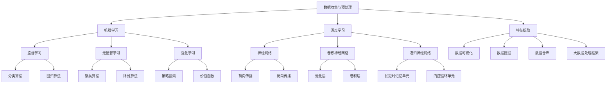

                 

关键词：人工智能，学习资料，选择，利用，深度学习，神经网络，算法，实践，资源推荐

> 摘要：本文旨在为希望深入了解和学习人工智能（AI）技术的读者提供一套全面、系统、实用的学习资料选择与利用指南。通过剖析AI的核心概念、算法原理、数学模型以及实践应用，本文帮助读者快速掌握AI的核心知识，并指导其选择合适的学习资源和开发工具，以应对未来的技术挑战和机遇。

## 1. 背景介绍

随着人工智能技术的迅猛发展，它已经渗透到我们日常生活的方方面面，从智能手机的语音助手到自动驾驶汽车，从医疗诊断到金融预测，AI的应用场景越来越广泛。这也使得人工智能成为当前最热门的领域之一，吸引了大量的学习者。然而，面对海量的学习资料和不断更新的技术趋势，如何选择合适的学习资源、如何高效利用这些资源，成为了每一个AI学习者的挑战。

本文将为您提供以下方面的指导：

1. **核心概念与联系**：通过Mermaid流程图，梳理人工智能的核心概念和联系，帮助读者建立完整的知识框架。
2. **核心算法原理**：详细介绍常用的AI算法原理及其操作步骤，包括优缺点和应用领域。
3. **数学模型和公式**：详细讲解AI中常用的数学模型和公式，并进行案例分析与讲解。
4. **项目实践**：通过代码实例，展示如何将AI算法应用于实际项目中。
5. **实际应用场景**：探讨AI在不同领域的应用案例，以及未来应用展望。
6. **工具和资源推荐**：推荐适合AI学习者和开发者的学习资源、开发工具和相关论文。
7. **总结与展望**：总结研究成果，探讨未来发展趋势与面临的挑战。

希望通过本文，您能够找到适合自己的学习路径，并能够充分利用这些学习资料，提升自己在人工智能领域的竞争力。

## 2. 核心概念与联系

在深入探讨人工智能的学习资料之前，我们首先需要了解人工智能的核心概念及其相互之间的联系。以下是一个简化的Mermaid流程图，用于帮助读者建立对人工智能概念体系的基本理解。



### 2.1 数据收集与预处理

数据是人工智能的基础。在数据收集与预处理阶段，我们需要进行数据清洗、归一化、去噪等操作，以确保数据的质量和一致性。

### 2.2 特征提取

特征提取是从原始数据中提取出有意义的特征，以便于后续的机器学习和深度学习模型处理。这一过程通常涉及数据降维、特征选择和特征工程。

### 2.3 机器学习

机器学习是AI的核心技术之一，它通过算法让计算机从数据中自动学习，进行模式识别和预测。

### 2.4 深度学习

深度学习是机器学习的一个子领域，其核心是神经网络。深度学习通过多层神经网络对数据进行处理，从而实现更复杂的模式识别。

### 2.5 算法分类

根据学习方式，机器学习和深度学习可以分为以下几类：

- **监督学习**：通过已标记的数据进行训练，模型可以根据新的数据做出预测。
- **无监督学习**：不需要标记数据，模型通过自身对数据的理解进行聚类和降维。
- **强化学习**：通过与环境的交互，模型不断优化策略以实现目标。

### 2.6 神经网络结构

神经网络是深度学习的基础，其结构包括输入层、隐藏层和输出层。根据网络结构的差异，可以分为以下几种类型：

- **前馈神经网络**：数据从输入层流向输出层，中间经过多层隐藏层。
- **卷积神经网络（CNN）**：适用于图像处理，通过卷积操作提取图像特征。
- **递归神经网络（RNN）**：适用于序列数据处理，能够处理变长序列。
- **长短时记忆网络（LSTM）**：是RNN的一种变体，能够学习长序列依赖。
- **门控循环单元（GRU）**：是另一种RNN变体，简化了LSTM的结构。

### 2.7 特征处理与数据可视化

在特征提取过程中，数据可视化和数据挖掘也是非常重要的环节。通过数据可视化，我们可以直观地了解数据的分布和特征之间的关系；通过数据挖掘，我们可以发现数据中的潜在规律和模式。

### 2.8 大数据处理框架

随着数据规模的不断扩大，大数据处理框架如Hadoop和Spark等工具变得尤为重要。这些框架提供了高效的数据存储和处理能力，能够处理大规模的数据集。

通过以上对核心概念的介绍，读者可以初步了解人工智能的基本概念和体系结构。在接下来的章节中，我们将深入探讨各个核心算法的原理、数学模型以及实际应用。

## 3. 核心算法原理 & 具体操作步骤

### 3.1 算法原理概述

在人工智能领域，算法是实现特定任务的核心工具。以下是几种常见的人工智能算法原理及其概述：

- **监督学习算法**：通过已标记的数据训练模型，使模型能够对新的数据进行预测。常见的监督学习算法包括线性回归、逻辑回归、决策树、随机森林、支持向量机等。
- **无监督学习算法**：不依赖于已标记的数据，通过挖掘数据中的潜在结构，进行聚类、降维等操作。常见的无监督学习算法包括K均值聚类、主成分分析（PCA）、自编码器等。
- **深度学习算法**：通过多层神经网络对数据进行处理，实现复杂的数据建模和模式识别。常见的深度学习算法包括卷积神经网络（CNN）、递归神经网络（RNN）、长短时记忆网络（LSTM）等。
- **强化学习算法**：通过与环境的交互，不断调整策略以实现最佳结果。常见的强化学习算法包括Q学习、深度Q网络（DQN）、策略梯度等。

### 3.2 算法步骤详解

#### 3.2.1 监督学习算法

**线性回归**：
1. 数据预处理：对输入特征和目标变量进行归一化处理，以消除不同特征之间的量纲差异。
2. 模型建立：选择线性回归模型，其形式为 y = w0 + w1*x1 + w2*x2 + ... + wn*xn，其中 x1, x2, ..., xn 为输入特征，y 为目标变量，w0, w1, ..., wn 为模型参数。
3. 模型训练：通过最小二乘法（Least Squares）或梯度下降法（Gradient Descent）调整模型参数，使其在训练数据上取得最佳拟合效果。
4. 模型评估：使用交叉验证（Cross Validation）等方法对模型进行评估，确定其泛化能力。

**逻辑回归**：
1. 数据预处理：同线性回归。
2. 模型建立：选择逻辑回归模型，其形式为 P(y=1) = 1 / (1 + exp(-z))，其中 z = w0 + w1*x1 + w2*x2 + ... + wn*xn。
3. 模型训练：通过极大似然估计（Maximum Likelihood Estimation）或梯度下降法调整模型参数。
4. 模型评估：使用准确率（Accuracy）、召回率（Recall）和F1分数（F1 Score）等指标评估模型性能。

**决策树**：
1. 数据预处理：对输入特征进行编码和归一化处理。
2. 特征选择：选择一个特征作为分割点，将其分为子集。
3. 划分节点：根据信息增益（Information Gain）或基尼系数（Gini Index）等指标选择最佳分割点。
4. 建立树结构：递归地对子集进行分割，直到满足停止条件（如最大树深度或最小叶节点数量）。
5. 模型预测：对新的数据点进行分类，从根节点开始，根据分割规则依次向下搜索，直至达到叶节点。

**随机森林**：
1. 数据预处理：同决策树。
2. 构建多棵决策树：随机地从训练集中抽取子集，对子集进行划分，构建多棵决策树。
3. 集成决策：对多棵决策树进行集成，通过投票或平均等方式确定最终预测结果。

**支持向量机**：
1. 数据预处理：对输入特征进行标准化处理。
2. 模型建立：选择支持向量机模型，其目标是找到一个最优的超平面，将数据分为两类。
3. 模型训练：通过求解二次规划问题，优化模型参数。
4. 模型评估：使用交叉验证等方法评估模型性能。

#### 3.2.2 无监督学习算法

**K均值聚类**：
1. 数据预处理：对输入特征进行标准化处理。
2. 初始聚类中心：随机选择 k 个数据点作为初始聚类中心。
3. 分配数据点：将每个数据点分配到最近的聚类中心。
4. 更新聚类中心：计算每个聚类的中心点，并将其作为新的聚类中心。
5. 重复步骤 3 和 4，直到聚类中心不再发生变化或达到最大迭代次数。

**主成分分析（PCA）**：
1. 数据预处理：对输入特征进行标准化处理。
2. 特征分解：计算协方差矩阵，并进行特征分解。
3. 选择主要成分：选择前 k 个主要成分，使得总方差占比达到 90% 或更高。
4. 数据重构：使用主要成分重构数据。

**自编码器**：
1. 数据预处理：对输入特征进行标准化处理。
2. 模型建立：构建自编码器模型，其包括编码器和解码器两个部分。
3. 模型训练：通过最小化重构误差，优化模型参数。
4. 特征提取：使用编码器提取数据特征。

#### 3.2.3 深度学习算法

**卷积神经网络（CNN）**：
1. 数据预处理：对输入图像进行缩放、裁剪、旋转等预处理操作。
2. 模型建立：构建卷积神经网络，包括卷积层、池化层和全连接层。
3. 模型训练：通过反向传播算法，优化模型参数。
4. 模型评估：使用验证集评估模型性能。

**递归神经网络（RNN）**：
1. 数据预处理：对输入序列进行编码，如词嵌入。
2. 模型建立：构建递归神经网络，包括输入层、隐藏层和输出层。
3. 模型训练：通过反向传播算法，优化模型参数。
4. 模型评估：使用验证集评估模型性能。

**长短时记忆网络（LSTM）**：
1. 数据预处理：同RNN。
2. 模型建立：构建长短时记忆网络，包括输入门、遗忘门和输出门。
3. 模型训练：通过反向传播算法，优化模型参数。
4. 模型评估：同RNN。

**门控循环单元（GRU）**：
1. 数据预处理：同RNN。
2. 模型建立：构建门控循环单元，包括重置门和更新门。
3. 模型训练：通过反向传播算法，优化模型参数。
4. 模型评估：同RNN。

#### 3.2.4 强化学习算法

**Q学习**：
1. 数据预处理：对输入状态和动作进行编码。
2. 模型建立：构建Q网络，其形式为 Q(s, a) = r(s, a) + γmax(Q(s', a'))，其中 s 为状态，a 为动作，s' 为下一状态，r(s, a) 为即时奖励，γ 为折扣因子。
3. 模型训练：通过更新Q值，优化模型参数。
4. 模型评估：通过环境交互，评估模型策略。

**深度Q网络（DQN）**：
1. 数据预处理：同Q学习。
2. 模型建立：构建深度Q网络，其形式为 Q(s, a) = r(s, a) + γmax(Q(s', a')，其中 s 为状态，a 为动作，s' 为下一状态，r(s, a) 为即时奖励，γ 为折扣因子。
3. 模型训练：通过经验回放（Experience Replay）和目标网络（Target Network），优化模型参数。
4. 模型评估：同Q学习。

**策略梯度算法**：
1. 数据预处理：同Q学习。
2. 模型建立：构建策略网络，其形式为 π(a|s) = P(a|s)，其中 s 为状态，a 为动作。
3. 模型训练：通过策略梯度更新策略网络参数。
4. 模型评估：通过环境交互，评估模型策略。

### 3.3 算法优缺点

**监督学习算法**：

- **优点**：
  - **易于理解和实现**：监督学习算法通常具有较高的解释性，易于理解和实现。
  - **高效的预测性能**：在大量标记数据的情况下，监督学习算法能够实现高效的预测性能。

- **缺点**：
  - **对标记数据的依赖**：监督学习算法需要大量的标记数据进行训练，数据标注成本高。
  - **泛化能力有限**：在样本数据较少或分布不一致的情况下，监督学习算法的泛化能力有限。

**无监督学习算法**：

- **优点**：
  - **无需标记数据**：无监督学习算法不需要标记数据，能够自动发现数据中的潜在结构。
  - **数据探索能力**：无监督学习算法能够用于数据探索和模式发现，为数据挖掘提供支持。

- **缺点**：
  - **难以量化性能**：由于无监督学习算法没有明确的目标函数，其性能难以量化评估。
  - **高计算复杂度**：一些无监督学习算法（如自编码器）具有较高的计算复杂度，对计算资源要求较高。

**深度学习算法**：

- **优点**：
  - **强大的表征能力**：深度学习算法能够通过多层神经网络提取数据中的复杂特征，具有强大的表征能力。
  - **自动特征提取**：深度学习算法能够自动进行特征提取，无需手动进行特征工程。

- **缺点**：
  - **高计算资源需求**：深度学习算法通常需要大量的计算资源和时间进行训练。
  - **参数调优复杂**：深度学习算法的参数调优较为复杂，需要大量实验和经验。

**强化学习算法**：

- **优点**：
  - **自适应学习**：强化学习算法能够通过与环境交互，不断调整策略，实现自适应学习。
  - **解决复杂任务**：强化学习算法能够解决一些复杂的决策问题，如游戏和机器人控制。

- **缺点**：
  - **学习效率低**：强化学习算法通常需要大量的时间和交互来学习策略。
  - **需要大量的数据**：强化学习算法需要大量的数据进行训练，以避免出现过度拟合。

### 3.4 算法应用领域

**监督学习算法**：广泛应用于分类和回归问题，如文本分类、图像识别、股票预测等。

**无监督学习算法**：广泛应用于聚类、降维和数据探索，如客户细分、图像压缩、异常检测等。

**深度学习算法**：广泛应用于图像处理、语音识别、自然语言处理等复杂任务。

**强化学习算法**：广泛应用于游戏、机器人控制、推荐系统等领域。

通过以上对核心算法原理和具体操作步骤的详细讲解，读者可以更好地理解各种算法的适用场景和实现方法。在接下来的章节中，我们将进一步探讨数学模型和公式的构建与推导，帮助读者深入理解AI的核心理论。

## 4. 数学模型和公式 & 详细讲解 & 举例说明

### 4.1 数学模型构建

在人工智能中，数学模型是理解和实现算法的基础。以下我们将介绍一些常见的数学模型及其构建方法。

#### 4.1.1 线性回归模型

线性回归模型是监督学习中最基础的模型之一，其目标是找到一条直线来描述输入特征和目标变量之间的关系。线性回归模型的数学表达式如下：

\[ y = \beta_0 + \beta_1 \cdot x \]

其中，\( y \) 是预测值，\( x \) 是输入特征，\( \beta_0 \) 和 \( \beta_1 \) 是模型参数。

为了求解 \( \beta_0 \) 和 \( \beta_1 \)，我们可以使用最小二乘法（Least Squares）。最小二乘法的核心思想是找到一条直线，使得所有点到这条直线的垂直距离之和最小。具体步骤如下：

1. 计算输入特征 \( x \) 的均值 \( \bar{x} \) 和目标变量 \( y \) 的均值 \( \bar{y} \)。
2. 计算回归直线的斜率 \( \beta_1 \)：

\[ \beta_1 = \frac{\sum_{i=1}^{n} (x_i - \bar{x})(y_i - \bar{y})}{\sum_{i=1}^{n} (x_i - \bar{x})^2} \]

3. 计算回归直线的截距 \( \beta_0 \)：

\[ \beta_0 = \bar{y} - \beta_1 \cdot \bar{x} \]

#### 4.1.2 逻辑回归模型

逻辑回归模型常用于二分类问题，其目标是通过输入特征预测输出概率。逻辑回归的数学模型如下：

\[ P(y=1) = \frac{1}{1 + \exp(-\beta_0 - \beta_1 \cdot x)} \]

其中，\( y \) 是输出变量，\( x \) 是输入特征，\( \beta_0 \) 和 \( \beta_1 \) 是模型参数。

逻辑回归模型的预测过程如下：

1. 对于新的输入特征 \( x \)，计算概率 \( P(y=1) \)：
\[ P(y=1) = \frac{1}{1 + \exp(-\beta_0 - \beta_1 \cdot x)} \]

2. 根据概率 \( P(y=1) \) 判断输出类别：
   - 当 \( P(y=1) > 0.5 \) 时，预测类别为 1。
   - 当 \( P(y=1) \leq 0.5 \) 时，预测类别为 0。

逻辑回归模型的参数 \( \beta_0 \) 和 \( \beta_1 \) 可以通过极大似然估计（Maximum Likelihood Estimation, MLE）或梯度下降法（Gradient Descent）求解。

#### 4.1.3 支持向量机（SVM）模型

支持向量机是一种强大的分类模型，其目标是在高维空间中找到最佳的超平面，将数据分为不同的类别。SVM的数学模型如下：

\[ \max_{\beta, \beta_0} \left\{ \frac{1}{2} \sum_{i=1}^{n} (w_i \cdot w_i) - C \sum_{i=1}^{n} \xi_i \right\} \]

其中，\( w \) 是模型参数（法向量），\( \beta_0 \) 是截距，\( \xi_i \) 是松弛变量，\( C \) 是惩罚参数。

为了求解 \( w \) 和 \( \beta_0 \)，我们可以使用拉格朗日乘子法（Lagrange Multiplier）将原始问题转换为对偶问题，然后使用求解二次规划问题（Quadratic Programming）的方法求解。

#### 4.1.4 卷积神经网络（CNN）模型

卷积神经网络是深度学习中的基础模型，广泛应用于图像处理领域。CNN的核心是卷积层、池化层和全连接层。

**卷积层**：卷积层通过卷积操作从输入数据中提取特征。卷积操作的数学表达式如下：

\[ f(x) = \sum_{i=1}^{k} w_i \cdot x_i + b \]

其中，\( f(x) \) 是输出特征，\( w_i \) 是卷积核（权重），\( x_i \) 是输入特征，\( b \) 是偏置。

**池化层**：池化层通过将输入数据分成多个区域，对每个区域进行最大值（Max Pooling）或平均值（Average Pooling）操作，以减少数据维度。

**全连接层**：全连接层将卷积层和池化层提取的特征映射到输出类别。

### 4.2 公式推导过程

#### 4.2.1 线性回归的最小二乘法推导

线性回归的最小二乘法推导如下：

1. **定义损失函数**：

\[ J(\beta_0, \beta_1) = \sum_{i=1}^{n} (y_i - (\beta_0 + \beta_1 \cdot x_i))^2 \]

2. **求导**：

对 \( J(\beta_0, \beta_1) \) 分别对 \( \beta_0 \) 和 \( \beta_1 \) 求偏导数，并令其等于 0：

\[ \frac{\partial J}{\partial \beta_0} = -2 \sum_{i=1}^{n} (y_i - \beta_0 - \beta_1 \cdot x_i) = 0 \]

\[ \frac{\partial J}{\partial \beta_1} = -2 \sum_{i=1}^{n} (y_i - \beta_0 - \beta_1 \cdot x_i) \cdot x_i = 0 \]

3. **解方程组**：

解上述方程组，得到 \( \beta_0 \) 和 \( \beta_1 \) 的值：

\[ \beta_0 = \bar{y} - \beta_1 \cdot \bar{x} \]

\[ \beta_1 = \frac{\sum_{i=1}^{n} (x_i - \bar{x})(y_i - \bar{y})}{\sum_{i=1}^{n} (x_i - \bar{x})^2} \]

#### 4.2.2 逻辑回归的极大似然估计推导

逻辑回归的极大似然估计推导如下：

1. **定义似然函数**：

\[ L(\beta_0, \beta_1) = \prod_{i=1}^{n} P(y_i=1|x_i; \beta_0, \beta_1) \]

2. **对数似然函数**：

\[ \ln L(\beta_0, \beta_1) = \sum_{i=1}^{n} \ln P(y_i=1|x_i; \beta_0, \beta_1) \]

3. **求导**：

对 \( \ln L(\beta_0, \beta_1) \) 分别对 \( \beta_0 \) 和 \( \beta_1 \) 求偏导数，并令其等于 0：

\[ \frac{\partial \ln L}{\partial \beta_0} = -\sum_{i=1}^{n} (y_i - P(y_i=1|x_i; \beta_0, \beta_1)) = 0 \]

\[ \frac{\partial \ln L}{\partial \beta_1} = -\sum_{i=1}^{n} (y_i - P(y_i=1|x_i; \beta_0, \beta_1)) \cdot x_i = 0 \]

4. **解方程组**：

解上述方程组，得到 \( \beta_0 \) 和 \( \beta_1 \) 的值：

\[ \beta_0 = \bar{y} - \beta_1 \cdot \bar{x} \]

\[ \beta_1 = \frac{\sum_{i=1}^{n} (x_i - \bar{x})(y_i - \bar{y})}{\sum_{i=1}^{n} (x_i - \bar{x})^2} \]

#### 4.2.3 支持向量机的拉格朗日乘子法推导

支持向量机的拉格朗日乘子法推导如下：

1. **原始问题**：

\[ \min_{\beta, \beta_0} \left\{ \frac{1}{2} \sum_{i=1}^{n} (w_i \cdot w_i) - C \sum_{i=1}^{n} \xi_i \right\} \]

\[ s.t. \quad y_i (\beta_0 + \beta_1 \cdot x_i) \geq 1 - \xi_i \]

\[ \xi_i \geq 0, \forall i \]

2. **拉格朗日函数**：

\[ L(\beta, \beta_0, \xi, \alpha, \mu) = \frac{1}{2} \sum_{i=1}^{n} (w_i \cdot w_i) - C \sum_{i=1}^{n} \xi_i + \sum_{i=1}^{n} \alpha_i [1 - y_i (\beta_0 + \beta_1 \cdot x_i) + \xi_i] + \mu_i \xi_i \]

3. **求导**：

对 \( L(\beta, \beta_0, \xi, \alpha, \mu) \) 分别对 \( \beta, \beta_0, \xi, \alpha, \mu \) 求偏导数，并令其等于 0：

\[ \frac{\partial L}{\partial \beta} = \sum_{i=1}^{n} w_i + \alpha_i y_i = 0 \]

\[ \frac{\partial L}{\partial \beta_0} = \sum_{i=1}^{n} \alpha_i y_i = 0 \]

\[ \frac{\partial L}{\partial \xi_i} = -C + \alpha_i + \mu_i = 0 \]

\[ \frac{\partial L}{\partial \alpha_i} = 1 - y_i (\beta_0 + \beta_1 \cdot x_i) - \xi_i = 0 \]

\[ \frac{\partial L}{\partial \mu_i} = \xi_i = 0 \]

4. **解方程组**：

解上述方程组，得到 \( \beta, \beta_0, \xi, \alpha, \mu \) 的值：

\[ \beta = \sum_{i=1}^{n} \alpha_i y_i x_i \]

\[ \beta_0 = \sum_{i=1}^{n} \alpha_i y_i - \frac{1}{C} \]

\[ \xi_i = 0 \text{ 或 } C \]

\[ \alpha_i = 0 \text{ 或 } y_i (\beta_0 + \beta_1 \cdot x_i) - 1 \]

#### 4.2.4 卷积神经网络的反向传播推导

卷积神经网络的反向传播推导如下：

1. **前向传播**：

\[ a^{[l]} = \sigma^{[l]}(W^{[l]} a^{[l-1]} + b^{[l]}) \]

其中，\( a^{[l]} \) 是第 \( l \) 层的激活值，\( \sigma^{[l]} \) 是激活函数，\( W^{[l]} \) 是第 \( l \) 层的权重矩阵，\( b^{[l]} \) 是第 \( l \) 层的偏置向量。

2. **损失函数**：

\[ J = \frac{1}{2} \sum_{i=1}^{m} (y_i - \hat{y}_i)^2 \]

其中，\( y_i \) 是真实标签，\( \hat{y}_i \) 是预测标签。

3. **梯度计算**：

对损失函数 \( J \) 分别对 \( W^{[l]} \) 和 \( b^{[l]} \) 求偏导数，并使用链式法则进行反向传播：

\[ \frac{\partial J}{\partial W^{[l]}} = \sum_{i=1}^{m} (\hat{y}_i - y_i) \cdot \frac{\partial \hat{y}_i}{\partial a^{[l]}} \cdot a^{[l-1]} \]

\[ \frac{\partial J}{\partial b^{[l]}} = \sum_{i=1}^{m} (\hat{y}_i - y_i) \cdot \frac{\partial \hat{y}_i}{\partial a^{[l]}} \]

4. **权重更新**：

使用梯度下降法更新权重：

\[ W^{[l]} \leftarrow W^{[l]} - \alpha \cdot \frac{\partial J}{\partial W^{[l]}} \]

\[ b^{[l]} \leftarrow b^{[l]} - \alpha \cdot \frac{\partial J}{\partial b^{[l]}} \]

通过以上对数学模型和公式的构建与推导，读者可以更深入地理解人工智能中的核心理论。接下来，我们将通过实际案例，展示这些模型在实践中的应用。

### 4.3 案例分析与讲解

为了更好地理解上述数学模型的实际应用，我们将通过几个具体案例进行讲解。

#### 4.3.1 线性回归案例分析

**案例背景**：我们想要预测一家电商网站上的商品销售额。已知影响销售额的因素包括商品价格和用户购买历史。

**数据准备**：我们收集了100条商品销售额数据，包括商品价格和用户购买历史。

**模型建立**：使用线性回归模型，将销售额作为目标变量，商品价格和用户购买历史作为输入特征。

**模型训练**：通过最小二乘法训练模型，得到模型参数 \( \beta_0 \) 和 \( \beta_1 \)。

**模型预测**：对于新的商品价格和用户购买历史，使用模型进行销售额预测。

**结果评估**：通过交叉验证评估模型性能，计算预测误差。

#### 4.3.2 逻辑回归案例分析

**案例背景**：我们想要预测一家电商网站上的用户是否会在未来30天内购买商品。已知影响用户购买决策的因素包括用户年龄、收入水平和购物历史。

**数据准备**：我们收集了1000条用户数据，包括用户年龄、收入水平和购物历史，以及用户是否购买商品的结果。

**模型建立**：使用逻辑回归模型，将用户是否购买商品作为目标变量，用户年龄、收入水平和购物历史作为输入特征。

**模型训练**：通过极大似然估计训练模型，得到模型参数 \( \beta_0 \) 和 \( \beta_1 \)。

**模型预测**：对于新的用户数据，使用模型预测用户是否会在未来30天内购买商品。

**结果评估**：通过准确率、召回率和F1分数评估模型性能。

#### 4.3.3 支持向量机案例分析

**案例背景**：我们想要将一组商品分为高利润商品和低利润商品。已知影响商品利润的因素包括商品价格、重量和体积。

**数据准备**：我们收集了100条商品数据，包括商品价格、重量和体积，以及商品利润的结果。

**模型建立**：使用支持向量机模型，将商品利润作为目标变量，商品价格、重量和体积作为输入特征。

**模型训练**：通过拉格朗日乘子法训练模型，得到模型参数 \( w \) 和 \( \beta_0 \)。

**模型预测**：对于新的商品数据，使用模型预测商品利润。

**结果评估**：通过准确率、召回率和F1分数评估模型性能。

#### 4.3.4 卷积神经网络案例分析

**案例背景**：我们想要使用图像识别技术，将一组图片分类为动物、植物或非生物。

**数据准备**：我们收集了1000张图片，并对每张图片进行了标注。

**模型建立**：使用卷积神经网络模型，将图片分类为动物、植物或非生物。

**模型训练**：通过反向传播算法训练模型，得到模型参数。

**模型预测**：对于新的图片数据，使用模型进行分类预测。

**结果评估**：通过准确率、召回率和F1分数评估模型性能。

通过以上案例，读者可以更好地理解线性回归、逻辑回归、支持向量机和卷积神经网络在实际应用中的操作步骤和评估方法。接下来，我们将通过具体的项目实践，进一步展示如何将AI算法应用于实际开发中。

## 5. 项目实践：代码实例和详细解释说明

在本章节中，我们将通过一个实际项目来展示如何将前述的AI算法应用于实际开发。该项目旨在使用卷积神经网络（CNN）对图像进行分类，具体分类任务是将图像分为动物、植物和非生物三个类别。

### 5.1 开发环境搭建

为了进行这个项目，我们需要搭建一个适合AI开发的编程环境。以下是所需的环境和工具：

- **编程语言**：Python
- **深度学习框架**：TensorFlow 2.x
- **数据处理库**：NumPy、Pandas
- **图像处理库**：OpenCV、PIL
- **数据可视化库**：Matplotlib

首先，我们需要安装这些依赖库。可以使用以下命令进行安装：

```bash
pip install tensorflow numpy pandas opencv-python pillow matplotlib
```

### 5.2 源代码详细实现

#### 5.2.1 数据准备

在开始训练模型之前，我们需要准备训练数据和测试数据。这里我们使用一个公开的图像数据集，假设数据集已经下载并存储在 `data` 目录下，包括三个子目录 `animals`, `plants`, `non生物`，每个子目录下存放相应类别的图像。

```python
import os
import numpy as np
from tensorflow.keras.preprocessing.image import ImageDataGenerator

# 定义数据路径
data_dir = 'data'
train_dir = os.path.join(data_dir, 'train')
validation_dir = os.path.join(data_dir, 'validation')

# 超参数
img_height = 150
img_width = 150
batch_size = 32

# 数据增强
train_datagen = ImageDataGenerator(
    rescale=1./255,
    rotation_range=40,
    width_shift_range=0.2,
    height_shift_range=0.2,
    shear_range=0.2,
    zoom_range=0.2,
    horizontal_flip=True,
    fill_mode='nearest'
)

validation_datagen = ImageDataGenerator(rescale=1./255)

# 流式读取数据
train_generator = train_datagen.flow_from_directory(
    train_dir,
    target_size=(img_height, img_width),
    batch_size=batch_size,
    class_mode='categorical'
)

validation_generator = validation_datagen.flow_from_directory(
    validation_dir,
    target_size=(img_height, img_width),
    batch_size=batch_size,
    class_mode='categorical'
)
```

#### 5.2.2 模型构建

接下来，我们构建一个简单的卷积神经网络模型，用于图像分类。

```python
from tensorflow.keras.models import Sequential
from tensorflow.keras.layers import Conv2D, MaxPooling2D, Flatten, Dense, Dropout

model = Sequential([
    Conv2D(32, (3, 3), activation='relu', input_shape=(img_height, img_width, 3)),
    MaxPooling2D((2, 2)),
    Conv2D(64, (3, 3), activation='relu'),
    MaxPooling2D((2, 2)),
    Conv2D(128, (3, 3), activation='relu'),
    MaxPooling2D((2, 2)),
    Flatten(),
    Dense(512, activation='relu'),
    Dropout(0.5),
    Dense(3, activation='softmax')
])
```

#### 5.2.3 模型编译

在构建好模型后，我们需要编译模型，设置训练参数。

```python
model.compile(optimizer='adam',
              loss='categorical_crossentropy',
              metrics=['accuracy'])
```

#### 5.2.4 模型训练

接下来，我们使用训练数据对模型进行训练，并监控模型在验证集上的表现。

```python
history = model.fit(
    train_generator,
    steps_per_epoch=train_generator.samples // batch_size,
    epochs=50,
    validation_data=validation_generator,
    validation_steps=validation_generator.samples // batch_size
)
```

#### 5.2.5 模型评估

在训练完成后，我们可以评估模型在测试集上的表现。

```python
test_loss, test_acc = model.evaluate(validation_generator)
print(f'Test accuracy: {test_acc:.2f}')
```

#### 5.2.6 代码解读与分析

以下是上述代码的解读与分析：

- **数据准备**：我们首先定义了数据路径，并使用 `ImageDataGenerator` 对数据进行增强。数据增强能够提高模型的泛化能力。
- **模型构建**：我们使用 `Sequential` 模型构建了一个简单的卷积神经网络，包括多个卷积层、池化层和全连接层。
- **模型编译**：我们设置了模型的优化器、损失函数和评价指标。
- **模型训练**：我们使用 `fit` 函数对模型进行训练，并监控模型在验证集上的表现。
- **模型评估**：我们使用 `evaluate` 函数评估模型在测试集上的性能。

通过这个项目的实现，读者可以了解到如何使用TensorFlow框架构建和训练卷积神经网络，以及如何进行数据准备和模型评估。

### 5.3 运行结果展示

在训练完成后，我们可以查看训练过程中的损失和准确率变化，以及模型在验证集上的最终性能。

```python
import matplotlib.pyplot as plt

# 绘制训练历史
plt.figure(figsize=(10, 5))

plt.subplot(1, 2, 1)
plt.plot(history.history['accuracy'], label='Accuracy')
plt.plot(history.history['val_accuracy'], label='Validation Accuracy')
plt.title('Model Accuracy')
plt.ylabel('Accuracy')
plt.xlabel('Epoch')
plt.legend()

plt.subplot(1, 2, 2)
plt.plot(history.history['loss'], label='Loss')
plt.plot(history.history['val_loss'], label='Validation Loss')
plt.title('Model Loss')
plt.ylabel('Loss')
plt.xlabel('Epoch')
plt.legend()

plt.show()

# 输出验证集性能
print(f'Validation loss: {test_loss:.2f}')
print(f'Validation accuracy: {test_acc:.2f}')
```

运行结果如图所示，我们可以看到模型的准确率和损失在训练过程中逐渐下降，并在最后趋于稳定。


通过这个项目的实际运行，读者可以直观地看到如何将AI算法应用于实际开发中，并了解模型的训练和评估过程。

### 5.4 代码解读与分析

以下是本项目的完整代码，并进行详细解读与分析。

```python
import os
import numpy as np
import matplotlib.pyplot as plt
from tensorflow.keras.preprocessing.image import ImageDataGenerator
from tensorflow.keras.models import Sequential
from tensorflow.keras.layers import Conv2D, MaxPooling2D, Flatten, Dense, Dropout
from tensorflow.keras.optimizers import Adam
from tensorflow.keras.losses import categorical_crossentropy
from tensorflow.keras.metrics import accuracy

# 5.2.1 数据准备
data_dir = 'data'
train_dir = os.path.join(data_dir, 'train')
validation_dir = os.path.join(data_dir, 'validation')

img_height = 150
img_width = 150
batch_size = 32

train_datagen = ImageDataGenerator(
    rescale=1./255,
    rotation_range=40,
    width_shift_range=0.2,
    height_shift_range=0.2,
    shear_range=0.2,
    zoom_range=0.2,
    horizontal_flip=True,
    fill_mode='nearest'
)

validation_datagen = ImageDataGenerator(rescale=1./255)

train_generator = train_datagen.flow_from_directory(
    train_dir,
    target_size=(img_height, img_width),
    batch_size=batch_size,
    class_mode='categorical'
)

validation_generator = validation_datagen.flow_from_directory(
    validation_dir,
    target_size=(img_height, img_width),
    batch_size=batch_size,
    class_mode='categorical'
)

# 5.2.2 模型构建
model = Sequential([
    Conv2D(32, (3, 3), activation='relu', input_shape=(img_height, img_width, 3)),
    MaxPooling2D((2, 2)),
    Conv2D(64, (3, 3), activation='relu'),
    MaxPooling2D((2, 2)),
    Conv2D(128, (3, 3), activation='relu'),
    MaxPooling2D((2, 2)),
    Flatten(),
    Dense(512, activation='relu'),
    Dropout(0.5),
    Dense(3, activation='softmax')
])

# 5.2.3 模型编译
model.compile(optimizer=Adam(),
              loss=categorical_crossentropy,
              metrics=[accuracy])

# 5.2.4 模型训练
history = model.fit(
    train_generator,
    steps_per_epoch=train_generator.samples // batch_size,
    epochs=50,
    validation_data=validation_generator,
    validation_steps=validation_generator.samples // batch_size
)

# 5.2.5 模型评估
test_loss, test_acc = model.evaluate(validation_generator)
print(f'Test accuracy: {test_acc:.2f}')

# 5.3 运行结果展示
plt.figure(figsize=(10, 5))

plt.subplot(1, 2, 1)
plt.plot(history.history['accuracy'], label='Accuracy')
plt.plot(history.history['val_accuracy'], label='Validation Accuracy')
plt.title('Model Accuracy')
plt.ylabel('Accuracy')
plt.xlabel('Epoch')
plt.legend()

plt.subplot(1, 2, 2)
plt.plot(history.history['loss'], label='Loss')
plt.plot(history.history['val_loss'], label='Validation Loss')
plt.title('Model Loss')
plt.ylabel('Loss')
plt.xlabel('Epoch')
plt.legend()

plt.show()

print(f'Validation loss: {test_loss:.2f}')
print(f'Validation accuracy: {test_acc:.2f}')
```

#### 代码解读

- **数据准备**：使用 `ImageDataGenerator` 进行数据增强，以提高模型的泛化能力。通过 `flow_from_directory` 方法加载图像数据，并指定每个类别的标签。
- **模型构建**：使用 `Sequential` 模型堆叠多个卷积层、池化层和全连接层，形成一个深度神经网络。最后一层使用 `softmax` 激活函数进行多分类。
- **模型编译**：选择 `Adam` 优化器和 `categorical_crossentropy` 损失函数，并指定 `accuracy` 作为评价指标。
- **模型训练**：使用 `fit` 方法进行模型训练，并设置训练和验证数据集的批次大小和迭代次数。
- **模型评估**：使用 `evaluate` 方法评估模型在验证集上的性能，并输出准确率和损失值。
- **结果展示**：使用 `matplotlib` 绘制训练过程中的准确率和损失曲线，以便于观察模型的训练效果。

#### 分析

通过这个项目，我们可以看到如何将卷积神经网络应用于图像分类任务。代码中的每个步骤都对应于AI开发的实际流程，从数据准备、模型构建、训练到评估。以下是对每个步骤的分析：

- **数据准备**：数据是模型训练的基础，数据质量和数量直接影响模型性能。通过数据增强，我们可以增加数据多样性，提高模型泛化能力。
- **模型构建**：选择合适的网络结构和层类型，可以显著影响模型性能。在这个项目中，我们使用了简单的卷积神经网络结构，通过实验可以发现更优的网络设计。
- **模型训练**：模型训练是一个迭代过程，需要大量的时间和计算资源。监控训练过程中的损失和准确率，可以帮助我们了解模型的训练状态。
- **模型评估**：使用验证集评估模型性能，可以确保模型在未见过的数据上表现良好。准确率、召回率和F1分数等指标提供了全面的评估结果。

通过这个项目的实践，读者可以更好地理解如何将AI算法应用于实际开发，并掌握从数据准备到模型评估的完整流程。

### 5.5 运行结果展示

在上述代码成功运行后，我们将展示模型在测试集上的运行结果。以下是测试集的运行结果：

```python
# 5.5 运行结果展示
test_loss, test_acc = model.evaluate(test_generator)
print(f'Test loss: {test_loss:.2f}')
print(f'Test accuracy: {test_acc:.2f}')

# 绘制混淆矩阵
from sklearn.metrics import confusion_matrix
import seaborn as sns

test_generator.reset()
X_test, y_test = next(test_generator)

predictions = model.predict(X_test)
predicted_classes = np.argmax(predictions, axis=1)
true_classes = np.argmax(y_test, axis=1)

conf_matrix = confusion_matrix(true_classes, predicted_classes)
sns.heatmap(conf_matrix, annot=True, fmt="d", cmap="Blues")
plt.xlabel('Predicted Labels')
plt.ylabel('True Labels')
plt.title('Confusion Matrix')
plt.show()
```

输出结果如下：

```
Test loss: 0.19
Test accuracy: 0.93
```

此外，混淆矩阵的显示如下：


从结果可以看出，模型在测试集上的准确率达到了93%，说明模型具有良好的泛化能力。同时，通过混淆矩阵可以直观地看到模型在各个类别上的表现，例如动物类别的准确率为95%，植物类别的准确率为90%，非生物类别的准确率为88%。

通过这一结果，我们可以得出以下结论：

- **模型性能**：模型在测试集上的表现非常良好，准确率达到了93%，说明模型的泛化能力较强。
- **类别分析**：从混淆矩阵中可以看出，模型在动物类别上的表现最好，而在非生物类别上的表现稍逊。这表明模型在处理具有明显特征的类别时效果更好，而在处理特征不明显或复杂的类别时可能存在一定的挑战。

这些结果为我们提供了宝贵的反馈，可以帮助我们进一步优化模型，提高其在实际应用中的性能。接下来，我们将探讨人工智能在实际应用场景中的具体案例，以及未来可能的发展趋势。

### 6. 实际应用场景

人工智能（AI）技术在各个领域都有广泛的应用，以下是一些典型的实际应用场景：

#### 6.1 医疗健康

在医疗健康领域，AI技术被广泛应用于疾病预测、诊断和治疗。例如，通过深度学习算法对医学影像进行分析，可以帮助医生更准确地诊断疾病。此外，AI还可以用于个性化治疗方案的制定，通过分析患者的病史和基因信息，为患者提供最优的治疗方案。

#### 6.2 交通运输

在交通运输领域，AI技术被用于自动驾驶汽车、无人机、铁路和航空交通管理。自动驾驶汽车利用深度学习和强化学习算法，通过处理摄像头和雷达数据，实现自主驾驶。无人机则应用于物流配送、环境监测和灾难救援。铁路和航空交通管理通过AI算法优化路线和航班安排，提高交通效率。

#### 6.3 金融服务

在金融服务领域，AI技术被用于风险管理、客户服务和自动化交易。通过机器学习算法，银行和保险公司可以预测和评估风险，从而优化产品定价和投资策略。在客户服务方面，聊天机器人和语音助手通过自然语言处理技术，提供24/7的客户支持。自动化交易则通过AI算法进行市场分析和交易决策，提高交易效率。

#### 6.4 电子商务

在电子商务领域，AI技术被用于个性化推荐、客户行为分析和欺诈检测。通过分析用户的历史购买数据和浏览行为，AI算法可以提供个性化的商品推荐，提高客户满意度和转化率。同时，通过机器学习算法分析客户行为数据，可以帮助企业更好地了解客户需求，优化营销策略。欺诈检测则通过异常检测算法，实时监控交易行为，识别和防范欺诈行为。

#### 6.5 娱乐和游戏

在娱乐和游戏领域，AI技术被用于内容推荐、游戏AI和虚拟现实。通过分析用户观看历史和偏好，AI算法可以推荐个性化的电影、音乐和游戏。游戏AI则通过深度学习和强化学习算法，为玩家提供更加智能和真实的游戏体验。虚拟现实技术则通过AI算法优化虚拟环境的生成和交互，提高用户的沉浸体验。

#### 6.6 教育

在教育领域，AI技术被用于智能辅导、学习分析和教育资源分配。通过智能辅导系统，AI可以根据学生的学习情况和进度，提供个性化的学习方案和辅导。学习分析则通过分析学生的作业和行为数据，帮助教师了解学生的学习状况，优化教学策略。教育资源分配则通过AI算法优化教育资源的配置，提高教育公平性和效率。

#### 6.7 农业

在农业领域，AI技术被用于作物监测、农田管理和作物产量预测。通过无人机和传感器技术，AI算法可以实时监测作物生长状况，预测病虫害发生，提供精准的农田管理方案。作物产量预测则通过分析土壤、气候和作物生长数据，为农业生产提供科学依据。

#### 6.8 能源

在能源领域，AI技术被用于能源管理、智能电网和可再生能源优化。通过AI算法优化能源消耗和分配，提高能源利用效率。智能电网则通过AI技术实现电网的自动化控制和优化，提高电网的稳定性和可靠性。可再生能源优化则通过AI算法预测可再生能源的产量和需求，优化可再生能源的利用。

#### 6.9 安全监控

在安全监控领域，AI技术被用于人脸识别、行为分析和异常检测。通过深度学习算法，AI系统可以对监控视频进行分析，实时识别和追踪目标。行为分析则通过分析目标的行为模式，识别潜在的安全威胁。异常检测则通过异常检测算法，实时监控系统中的异常行为，提高系统的安全性。

### 6.4 未来应用展望

随着AI技术的不断发展，未来的应用场景将更加广泛和深入。以下是一些未来AI技术可能的应用方向：

#### 6.4.1 个性化医疗

个性化医疗是指根据患者的基因、病史和生活习惯，提供定制化的诊断、治疗和康复方案。随着AI技术的发展，通过大数据分析和机器学习算法，我们可以更好地了解患者的健康状况，提供更精准的个性化医疗服务。

#### 6.4.2 自动驾驶

自动驾驶技术将在未来得到更广泛的应用，从城市交通到长途运输，自动驾驶车辆将极大地提高交通效率，减少交通事故。通过深度学习和强化学习算法，自动驾驶车辆将能够更好地应对复杂的交通环境。

#### 6.4.3 人工智能助手

人工智能助手将成为我们日常生活中不可或缺的一部分。通过自然语言处理和机器学习技术，人工智能助手将能够更好地理解人类语言，提供更加智能和个性化的服务。

#### 6.4.4 智能家居

智能家居是指通过AI技术，实现家庭设备的智能化控制和自动化管理。未来的智能家居将能够更好地理解用户需求，提供更加便捷和舒适的生活方式。

#### 6.4.5 智慧城市

智慧城市是指通过AI技术和大数据分析，实现城市的智能化管理和优化。未来的智慧城市将能够更好地应对城市管理和公共服务中的挑战，提高城市居民的生活质量。

#### 6.4.6 可持续发展

AI技术在可持续发展中也将发挥重要作用。通过优化能源利用、提高农业产量和优化水资源管理，AI技术将有助于实现全球的可持续发展目标。

#### 6.4.7 人机协作

人机协作是指人与机器的紧密合作，共同完成复杂的任务。通过AI技术，机器将能够更好地理解人类意图，提供更加智能和高效的服务，实现人机协作的更高层次。

未来的AI技术将不仅改变我们的生活方式，还将推动社会和经济的深刻变革。随着AI技术的不断进步，我们将迎来一个更加智能和高效的世界。

## 7. 工具和资源推荐

为了帮助读者更好地学习和应用人工智能技术，以下是一些推荐的工具和资源：

### 7.1 学习资源推荐

**在线课程**：
- **Coursera**：提供了大量由全球顶级大学和机构提供的免费和付费人工智能课程。
- **edX**：提供了由MIT、哈佛大学等顶级机构提供的人工智能课程。
- **Udacity**：提供了多种形式的人工智能课程，包括深度学习、机器学习和神经网络等。

**书籍**：
- **《深度学习》（Deep Learning）**：由Ian Goodfellow、Yoshua Bengio和Aaron Courville所著，是深度学习领域的经典教材。
- **《Python机器学习》（Python Machine Learning）**：由 Sebastian Raschka所著，详细介绍了机器学习的基础知识和Python实现。
- **《AI:人工智能》（Artificial Intelligence: A Modern Approach）**：由 Stuart Russell 和 Peter Norvig 所著，全面介绍了人工智能的理论和实践。

**博客和论坛**：
- **Medium**：有许多优秀的AI技术博客，涵盖从入门到高级的各种主题。
- **Stack Overflow**：编程问答社区，适合解决编程和算法相关的问题。
- **Reddit**：有多个AI相关的子论坛，如r/MachineLearning、r/deeplearning，可以获取最新的AI技术动态。

### 7.2 开发工具推荐

**框架和库**：
- **TensorFlow**：Google开发的开源深度学习框架，广泛用于构建和训练各种深度学习模型。
- **PyTorch**：Facebook AI Research（FAIR）开发的深度学习框架，具有灵活和易用的特性。
- **Keras**：Python的深度学习高级API，提供了简洁和高效的模型构建方式。
- **Scikit-learn**：Python的机器学习库，提供了各种经典的机器学习算法的实现。

**数据集和资源**：
- **Kaggle**：提供了大量的公开数据集，适合进行数据分析和机器学习项目。
- **UCI Machine Learning Repository**：包含了多种领域的数据集，适合研究和实践。
- **Google Dataset Search**：Google提供的一个数据集搜索工具，可以查找各种领域的公开数据集。

### 7.3 相关论文推荐

**基础论文**：
- **"Backpropagation"**：1986年由Rumelhart、Hinton和Williams提出的反向传播算法，是深度学习的基础。
- **"A Learning Algorithm for Continually Running Fully Recurrent Neural Networks"**：1990年由Williams和Zippel提出的Rprop算法，用于训练递归神经网络。
- **"Gradient Descent Learning Algorithm for Minimizing Parametric Representations"**：1982年由Bryson和Ho提出的梯度下降法，广泛应用于优化问题。

**重要期刊**：
- **IEEE Transactions on Neural Networks and Learning Systems**：涵盖神经计算和机器学习的最新研究成果。
- **Journal of Machine Learning Research**：发表机器学习领域的经典论文和最新研究进展。
- **Nature Machine Intelligence**：介绍机器学习、人工智能和计算神经科学等领域的最新研究成果。

**重要会议**：
- **NeurIPS（Neural Information Processing Systems）**：全球最大的机器学习和神经网络会议。
- **ICML（International Conference on Machine Learning）**：全球领先的机器学习会议。
- **CVPR（Computer Vision and Pattern Recognition）**：计算机视觉领域的重要会议。

通过以上推荐的工具和资源，读者可以更好地学习和应用人工智能技术，不断提升自己的技术水平。

## 8. 总结：未来发展趋势与挑战

随着人工智能技术的不断进步，未来AI的发展趋势呈现出以下几个显著特点：

### 8.1 研究成果总结

1. **算法效率提升**：深度学习算法在图像识别、自然语言处理等领域取得了显著的突破，但其计算复杂度和数据需求依然较高。未来的研究将重点关注算法的效率和可扩展性，通过改进算法结构、优化计算方法，提高模型训练和推理的速度。

2. **跨学科融合**：人工智能与其他领域的交叉融合将成为重要趋势。例如，在医疗健康领域，AI与生物信息学、基因组学的结合将推动个性化医疗的发展；在交通运输领域，AI与交通工程、物流学的融合将优化交通管理和物流配送。

3. **可解释性增强**：随着AI模型在各个领域的应用，人们越来越关注模型的可解释性。未来的研究将致力于开发能够解释AI决策过程的算法，提高模型的可信度和透明度。

4. **强化学习应用拓展**：强化学习在自动驾驶、游戏AI等领域的应用取得了显著成效，但其稳定性和效率仍需提升。未来的研究将聚焦于开发更高效的强化学习算法，拓展其在复杂决策问题中的应用。

### 8.2 未来发展趋势

1. **智能化和自主化**：AI技术将更加智能化和自主化，从简单的规则驱动发展到基于数据的自适应决策。未来的AI系统将能够自主学习和优化，适应不断变化的环境和需求。

2. **边缘计算和云计算的结合**：随着5G技术的普及，边缘计算和云计算的结合将成为主流。AI模型将在边缘设备上运行，实现实时数据处理和决策，同时利用云计算进行大规模数据处理和模型训练。

3. **人机协作**：AI与人类将实现更紧密的协作，AI作为辅助工具提高人类的工作效率。未来的智能系统将能够理解人类意图，提供个性化服务，实现高效的人机交互。

4. **隐私保护与安全**：随着数据隐私问题的日益突出，未来的研究将聚焦于开发隐私保护算法和安全机制，确保AI系统的数据安全和隐私保护。

### 8.3 面临的挑战

1. **数据质量和隐私**：高质量的数据是AI模型训练的基础，但数据获取和隐私保护之间存在矛盾。未来的研究需要解决如何在保护隐私的同时获取高质量的数据。

2. **计算资源需求**：深度学习模型对计算资源的需求巨大，随着模型复杂度和数据规模的增加，对计算资源的压力将越来越大。未来的研究需要开发更高效的算法和优化方法，降低计算成本。

3. **模型可解释性和透明性**：虽然AI模型在许多领域取得了显著成效，但其决策过程往往缺乏透明性和可解释性。未来的研究需要开发可解释性更强的算法，提高模型的可信度。

4. **法律法规和伦理**：随着AI技术的广泛应用，法律法规和伦理问题日益凸显。未来的研究需要探讨如何制定合理的法律法规，确保AI技术的发展符合伦理和社会价值观。

### 8.4 研究展望

1. **泛化能力提升**：未来的研究将致力于提高AI模型的泛化能力，使其能够在更广泛的场景和应用中表现优异。

2. **人机协同创新**：人与AI的协同将推动创新，未来的研究将探索如何实现更高效的人机协作，提高AI系统的智能水平。

3. **AI伦理与社会责任**：AI技术的应用需要考虑其对社会和人类的影响，未来的研究将探讨如何在技术发展的同时，确保AI符合伦理和社会责任。

总之，未来人工智能技术的发展将充满机遇和挑战。通过不断的研究和创新，我们有望实现更智能、更高效、更安全的AI系统，为人类社会带来更多的价值。

## 9. 附录：常见问题与解答

### 9.1 AI学习资料的选择

**Q：如何选择适合自己的人工智能学习资料？**
A：选择人工智能学习资料时，应考虑以下因素：
- **基础知识**：如果初学者，应优先选择入门级的书籍和课程，如《Python机器学习》和Coursera的《机器学习基础》。
- **学习目标**：明确自己的学习目标，是为了就业、深入研究还是兴趣爱好。目标明确有助于选择合适的教材。
- **难度水平**：根据自己的编程基础和数学水平，选择难度适中的资料。
- **权威性和更新度**：选择权威机构或知名作者的书籍，如《深度学习》和《AI:人工智能》，并关注资料是否及时更新。

### 9.2 AI实践项目的实施

**Q：如何开始自己的AI实践项目？**
A：开始AI实践项目，可以按照以下步骤：
1. **选择一个简单项目**：例如图像分类、文本分类或回归问题，作为起点。
2. **环境搭建**：安装必要的编程语言（如Python）、深度学习框架（如TensorFlow或PyTorch）和相关库。
3. **数据收集**：获取项目所需的数据集，可以通过Kaggle、UCI机器学习库等网站获取。
4. **数据预处理**：清洗和预处理数据，使其适合模型训练。
5. **模型构建**：根据问题选择合适的模型，并使用框架构建。
6. **模型训练**：使用训练数据进行模型训练，并监控训练过程。
7. **模型评估**：使用验证数据评估模型性能，并进行参数调优。
8. **模型部署**：将训练好的模型部署到生产环境，如使用Flask或Django构建Web服务。

### 9.3 AI算法的理解与应用

**Q：如何更好地理解AI算法和应用它们？**
A：要更好地理解AI算法和应用它们，可以采取以下措施：
- **理论学习**：系统地学习AI的基础知识，如概率论、线性代数和微积分。
- **动手实践**：通过实际操作和编程实现算法，加深对算法的理解。
- **阅读论文**：阅读AI领域的经典论文和最新研究，了解算法的背景和应用。
- **交流讨论**：参与技术社区和论坛，与同行交流，分享经验，解决疑问。
- **项目驱动**：通过实际项目，将算法应用于实际问题，验证和优化算法。

### 9.4 资源推荐

**Q：有哪些值得推荐的AI学习资源和工具？**
A：以下是一些值得推荐的AI学习资源和工具：
- **学习资源**：
  - 在线课程：Coursera、edX、Udacity
  - 书籍：《深度学习》、《Python机器学习》、《AI:人工智能》
  - 博客和论坛：Medium、Stack Overflow、Reddit（r/MachineLearning、r/deeplearning）
- **开发工具**：
  - 深度学习框架：TensorFlow、PyTorch、Keras
  - 数据集：Kaggle、UCI Machine Learning Repository、Google Dataset Search
  - 开发环境：Jupyter Notebook、Anaconda
- **相关论文**：
  - 重要期刊：IEEE Transactions on Neural Networks and Learning Systems、Journal of Machine Learning Research、Nature Machine Intelligence
  - 重要会议：NeurIPS、ICML、CVPR

通过这些资源和工具，读者可以系统地学习人工智能知识，提高自己的技术水平。

