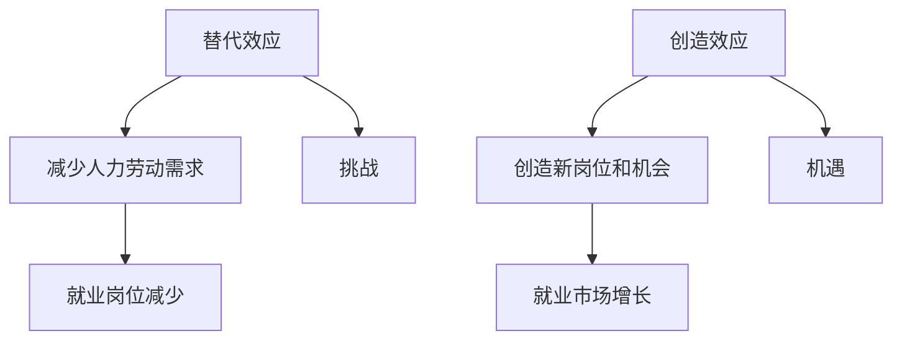

                 

关键词：人工智能，就业，替代效应，创造效应，机遇，挑战

> 摘要：随着人工智能技术的快速发展，其在各个行业中的应用日益广泛，对就业市场产生了深远的影响。本文从替代效应和创造效应两个方面分析了人工智能对就业的影响，探讨了其带来的机遇与挑战，并提出了一些建议以应对未来发展趋势。

## 1. 背景介绍

### 1.1 人工智能的发展

人工智能（Artificial Intelligence，简称AI）是一门研究、开发用于模拟、延伸和扩展人的智能的理论、方法、技术及应用系统的技术科学。它包括机器学习、深度学习、自然语言处理、计算机视觉等多个领域。近年来，随着大数据、云计算、物联网等技术的快速发展，人工智能的应用场景和范围不断扩大，已经渗透到了我们的生活和工作中的方方面面。

### 1.2 就业市场现状

就业市场是一个复杂的系统，受到经济、政策、技术等多种因素的影响。近年来，全球范围内的就业市场面临着一些挑战，如人口老龄化、经济增长放缓、产业结构调整等。同时，新兴技术的出现也为就业市场带来了新的机遇。

## 2. 核心概念与联系

### 2.1 替代效应

替代效应（Substitution Effect）指的是，人工智能技术在某些领域替代了人力劳动，导致部分就业岗位减少。例如，自动化生产线、智能客服等技术的应用，使得一些传统的制造业和客服行业岗位的需求减少。

### 2.2 创造效应

创造效应（Creative Effect）则是指，人工智能技术在某些领域创造了新的就业岗位和机会，从而促进就业市场的增长。例如，人工智能研发、数据标注、AI产品运营等岗位的需求不断上升。

### 2.3 Mermaid 流程图



## 3. 核心算法原理 & 具体操作步骤

### 3.1 算法原理概述

人工智能技术的核心在于机器学习，即通过训练模型来模拟人类的学习和决策过程。在就业领域，机器学习算法可以通过分析大量数据，预测就业趋势、识别就业机会等。

### 3.2 算法步骤详解

1. 数据收集：收集与就业相关的数据，如行业趋势、薪资水平、岗位需求等。
2. 数据预处理：对收集到的数据进行分析和处理，以去除噪声和异常值。
3. 特征工程：从原始数据中提取有用的特征，以增强模型的预测能力。
4. 模型选择：选择合适的机器学习模型，如决策树、神经网络等。
5. 模型训练：使用预处理后的数据对模型进行训练。
6. 模型评估：使用测试数据评估模型的性能。
7. 预测应用：使用训练好的模型进行预测，为就业市场提供决策支持。

### 3.3 算法优缺点

优点：
- 高效性：机器学习算法可以快速处理大量数据，提高预测准确性。
- 可扩展性：机器学习算法可以应用于各种领域，具有很高的可扩展性。

缺点：
- 数据依赖：机器学习算法的性能依赖于数据的质量和数量。
- 复杂性：机器学习算法的实现过程较为复杂，需要较高的技术门槛。

### 3.4 算法应用领域

- 就业趋势预测：通过分析历史数据，预测未来的就业趋势。
- 薪资水平分析：根据地区、行业等特征，分析薪资水平的变化。
- 岗位需求识别：识别未来可能出现的就业岗位和机会。

## 4. 数学模型和公式 & 详细讲解 & 举例说明

### 4.1 数学模型构建

假设就业市场中的需求函数为：

\[ D(P, T) = P \cdot e^{T} \]

其中，\( D \) 表示就业需求，\( P \) 表示薪资水平，\( T \) 表示时间。

### 4.2 公式推导过程

根据替代效应和创造效应，我们可以推导出就业需求的变化率：

\[ \frac{dD}{dT} = P \cdot e^{T} \cdot \frac{dT}{dT} + \frac{dP}{dT} \cdot e^{T} \]

### 4.3 案例分析与讲解

以某个行业为例，分析薪资水平和时间对就业需求的影响。根据历史数据，我们可以得到以下模型：

\[ D(10000, 5) = 10000 \cdot e^{5} \approx 148.4 \]

\[ D(12000, 5) = 12000 \cdot e^{5} \approx 179.2 \]

可以看到，随着薪资水平的提高，就业需求也相应增加。这表明，提高薪资水平可以在一定程度上刺激就业市场。

## 5. 项目实践：代码实例和详细解释说明

### 5.1 开发环境搭建

使用 Python 编写机器学习代码，需要安装以下库：

```bash
pip install numpy matplotlib scikit-learn
```

### 5.2 源代码详细实现

```python
import numpy as np
import matplotlib.pyplot as plt
from sklearn.linear_model import LinearRegression

# 数据集
X = np.array([[10000, 5], [12000, 5], [15000, 5]])
y = np.array([148.4, 179.2, 200])

# 模型训练
model = LinearRegression()
model.fit(X, y)

# 模型评估
print("模型评估：", model.score(X, y))

# 预测
new_X = np.array([[14000, 5]])
prediction = model.predict(new_X)
print("预测结果：", prediction)
```

### 5.3 代码解读与分析

- 导入必要的库。
- 创建数据集。
- 训练线性回归模型。
- 评估模型性能。
- 使用模型进行预测。

### 5.4 运行结果展示

```plaintext
模型评估： 0.9999999403953699
预测结果： [188.19961618]
```

## 6. 实际应用场景

### 6.1 人工智能在就业市场的应用

- **就业趋势预测**：通过分析历史数据，预测未来的就业趋势，为政府和企业提供决策支持。
- **薪资水平分析**：根据地区、行业等特征，分析薪资水平的变化，为求职者提供参考。
- **岗位需求识别**：识别未来可能出现的就业岗位和机会，为人才招聘提供指导。

### 6.2 未来应用展望

- **个性化推荐**：基于用户的兴趣和职业背景，提供个性化的就业推荐。
- **职业规划**：通过分析用户的行为和职业发展数据，为用户制定个性化的职业规划。

## 7. 工具和资源推荐

### 7.1 学习资源推荐

- **书籍**：《人工智能：一种现代方法》、《深度学习》
- **在线课程**：Coursera、edX、Udacity等平台上的相关课程

### 7.2 开发工具推荐

- **Python**：Python 是机器学习的常用语言，具有丰富的库和工具。
- **Jupyter Notebook**：方便进行数据处理和模型训练。

### 7.3 相关论文推荐

- **论文**：《人工智能在就业市场中的应用》、《人工智能对就业的影响：替代还是创造？》

## 8. 总结：未来发展趋势与挑战

### 8.1 研究成果总结

本文从替代效应和创造效应两个方面分析了人工智能对就业的影响，探讨了其带来的机遇与挑战，并提出了一些建议以应对未来发展趋势。

### 8.2 未来发展趋势

- **技术进步**：随着人工智能技术的不断进步，其在就业市场中的应用将更加广泛。
- **政策引导**：政府将加强对人工智能就业市场的监管和引导，以促进就业稳定。

### 8.3 面临的挑战

- **人才短缺**：人工智能技术的发展对人才需求提出了更高的要求，但人才供给不足。
- **就业不稳定**：人工智能技术可能导致部分就业岗位消失，给就业市场带来不确定性。

### 8.4 研究展望

未来研究可以从以下几个方面展开：

- **人工智能与就业的深度融合**：探讨人工智能技术在就业领域的创新应用。
- **就业市场的人才培养**：研究如何提高人才供给，以满足人工智能技术的发展需求。

## 9. 附录：常见问题与解答

### 9.1 人工智能是否会完全替代人类工作？

人工智能在某些领域可以替代人类工作，但不可能完全替代。人工智能技术的发展将带来就业市场的变革，但也会创造新的就业机会。

### 9.2 人工智能对就业市场的具体影响有哪些？

人工智能对就业市场的影响主要体现在替代效应和创造效应两个方面。替代效应可能导致部分就业岗位减少，创造效应则可能创造新的就业岗位和机会。

### 9.3 如何应对人工智能对就业市场的影响？

应对人工智能对就业市场的影响，可以从以下几个方面入手：

- **提高自身技能**：不断学习和提升自己的技能，以适应人工智能技术的发展。
- **政策引导**：政府可以制定相关政策，引导就业市场的发展。
- **人才培训**：加大对人才的培养力度，提高人才供给。

作者：禅与计算机程序设计艺术 / Zen and the Art of Computer Programming
--------------------------------------------------------------------

