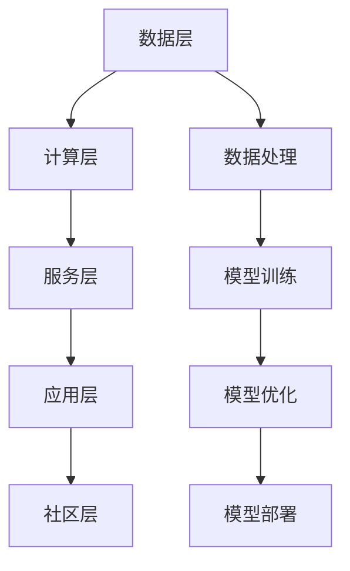

                 

关键词：AI开发工具、Lepton AI、一站式平台、深度学习、机器学习、编程工具、数据处理、模型训练、算法优化、开发者社区

> 摘要：本文将深入探讨Lepton AI，一个专注于提供一站式AI开发工具的平台，介绍其核心功能、优势和应用领域，并分析其在当前AI开发环境中的地位和未来发展趋势。

## 1. 背景介绍

人工智能（AI）作为当前科技领域的重要发展方向，已经在各个行业中展现出了巨大的潜力。随着机器学习、深度学习等技术的不断进步，AI的应用场景也越来越广泛。为了帮助开发者更好地进行AI项目开发，各种AI开发工具和平台如雨后春笋般涌现。然而，这些工具和平台往往功能单一，开发者需要在不同工具之间切换，导致开发效率低下。

在这样的背景下，Lepton AI应运而生。Lepton AI旨在为开发者提供一个集成了多种功能的AI开发平台，简化开发流程，提高开发效率，降低开发门槛。通过这个平台，开发者可以轻松地完成从数据预处理、模型训练到模型优化的整个AI项目开发过程。

## 2. 核心概念与联系

### 2.1. Lepton AI的核心功能

Lepton AI的核心功能可以概括为以下几点：

1. **数据处理**：提供高效的数据预处理工具，支持数据清洗、数据转换、数据增强等功能。
2. **模型训练**：集成多种深度学习框架，如TensorFlow、PyTorch等，支持快速构建和训练模型。
3. **模型优化**：提供自动化调参工具，帮助开发者找到最优模型参数。
4. **模型部署**：支持将训练好的模型部署到云端或边缘设备，实现实时推理和预测。
5. **开发者社区**：提供一个开放的社区平台，开发者可以分享经验、交流问题、获取帮助。

### 2.2. Lepton AI的架构

Lepton AI的架构设计遵循模块化原则，各个模块之间松耦合，方便开发者自由组合和使用。以下是Lepton AI的架构概览：

1. **数据层**：负责数据收集、存储和管理，支持多种数据源接入，如数据库、文件系统、API等。
2. **计算层**：集成多种深度学习框架，提供高效的计算能力，支持分布式训练和推理。
3. **服务层**：提供多种API和服务，包括数据处理、模型训练、模型优化、模型部署等。
4. **应用层**：面向开发者提供丰富的应用场景解决方案，如图像识别、自然语言处理、推荐系统等。
5. **社区层**：构建开放的社区平台，提供知识分享、问题解答、技术支持等服务。

### 2.3. Mermaid流程图

以下是一个简化的Mermaid流程图，展示Lepton AI的核心功能模块及其联系：



## 3. 核心算法原理 & 具体操作步骤

### 3.1. 算法原理概述

Lepton AI的核心算法原理主要基于深度学习和机器学习技术。具体来说，包括以下几个关键环节：

1. **数据预处理**：通过数据清洗、数据转换、数据增强等方法，提高数据质量和丰富数据多样性。
2. **模型训练**：采用深度学习框架，如TensorFlow、PyTorch等，构建和训练模型。
3. **模型优化**：使用自动化调参工具，找到最优模型参数，提高模型性能。
4. **模型部署**：将训练好的模型部署到云端或边缘设备，实现实时推理和预测。

### 3.2. 算法步骤详解

1. **数据预处理**：
   - 数据清洗：去除缺失值、异常值等。
   - 数据转换：将数据转换为统一的格式，如将图像数据转换为张量。
   - 数据增强：通过旋转、缩放、裁剪等操作，增加数据多样性。

2. **模型训练**：
   - 模型构建：使用深度学习框架构建模型，如卷积神经网络（CNN）、循环神经网络（RNN）等。
   - 模型训练：使用训练数据集对模型进行训练，通过反向传播算法优化模型参数。

3. **模型优化**：
   - 调参优化：使用自动化调参工具，如Hyperopt、Bayesian Optimization等，找到最优模型参数。
   - 性能评估：使用验证数据集评估模型性能，如准确率、召回率等。

4. **模型部署**：
   - 模型导出：将训练好的模型导出为可用于部署的格式，如TensorFlow SavedModel、PyTorch TorchScript等。
   - 部署推理：将模型部署到云端或边缘设备，实现实时推理和预测。

### 3.3. 算法优缺点

1. **优点**：
   - **集成化**：提供一站式开发工具，简化开发流程，提高开发效率。
   - **模块化**：各个模块之间松耦合，方便开发者自由组合和使用。
   - **开源**：Lepton AI本身是开源的，开发者可以自由地修改和扩展。

2. **缺点**：
   - **学习成本**：对于新手开发者来说，需要一定的时间来熟悉Lepton AI的使用。
   - **性能瓶颈**：在某些特定场景下，Lepton AI的性能可能无法与特定领域专用的工具相比。

### 3.4. 算法应用领域

Lepton AI的应用领域非常广泛，包括但不限于：

1. **图像识别**：用于对象检测、人脸识别、图像分类等。
2. **自然语言处理**：用于文本分类、情感分析、机器翻译等。
3. **推荐系统**：用于个性化推荐、商品推荐等。
4. **金融风控**：用于信用评估、风险控制等。
5. **医疗健康**：用于疾病预测、诊断辅助等。

## 4. 数学模型和公式 & 详细讲解 & 举例说明

### 4.1. 数学模型构建

在Lepton AI中，常用的数学模型包括卷积神经网络（CNN）、循环神经网络（RNN）等。以下是一个简单的CNN模型示例：

$$
\begin{aligned}
    h^{(l)} &= \text{ReLU}(W^{(l)} \cdot h^{(l-1)} + b^{(l)}) \\
    \text{where } h^{(l)} &= \text{activation function (ReLU)} \\
    W^{(l)} &= \text{weight matrix} \\
    b^{(l)} &= \text{bias vector} \\
    l &= \text{layer index}
\end{aligned}
$$

### 4.2. 公式推导过程

以CNN为例，我们首先从最基本的卷积操作开始：

$$
\begin{aligned}
    \text{convolution} &= \sum_{i=1}^{k} \sum_{j=1}^{k} w_{ij} \cdot x_{i,j} \\
    &= W \cdot X
\end{aligned}
$$

其中，$W$ 是卷积核（weight matrix），$X$ 是输入数据（input matrix）。为了引入偏置项（bias），我们进一步扩展为：

$$
\begin{aligned}
    \text{convolution} &= \sum_{i=1}^{k} \sum_{j=1}^{k} w_{ij} \cdot x_{i,j} + b \\
    &= W \cdot X + b
\end{aligned}
$$

为了引入非线性变换，我们通常在卷积后加上ReLU激活函数：

$$
\text{ReLU}(z) = \max(0, z)
$$

### 4.3. 案例分析与讲解

假设我们有一个简单的二分类问题，输入数据为一张32x32的图像，我们需要通过CNN模型对其进行分类。以下是Lepton AI中一个简单的CNN模型实现：

```python
import lepton_ai as lai

# 定义CNN模型
model = lai.Sequential()

# 添加卷积层
model.add(lai.Conv2D(32, (3, 3), activation='relu', input_shape=(32, 32, 3)))
model.add(lai.MaxPooling2D((2, 2)))

# 添加全连接层
model.add(lai.Flatten())
model.add(lai.Dense(128, activation='relu'))
model.add(lai.Dense(1, activation='sigmoid'))

# 编译模型
model.compile(optimizer='adam', loss='binary_crossentropy', metrics=['accuracy'])

# 训练模型
model.fit(x_train, y_train, epochs=10, batch_size=64, validation_split=0.2)
```

在这个案例中，我们首先定义了一个序列模型，然后依次添加卷积层、全连接层，最后编译和训练模型。通过这个案例，我们可以看到Lepton AI的使用非常简单直观，对于开发者来说，只需要几行代码就可以实现一个完整的CNN模型。

## 5. 项目实践：代码实例和详细解释说明

### 5.1. 开发环境搭建

在开始使用Lepton AI之前，我们需要先搭建开发环境。以下是一个简单的步骤：

1. **安装Python**：确保Python版本为3.6或以上。
2. **安装Lepton AI**：使用pip安装Lepton AI，命令如下：

```bash
pip install lepton-ai
```

3. **安装依赖库**：Lepton AI依赖于多个第三方库，如TensorFlow、PyTorch等，请确保已正确安装。

### 5.2. 源代码详细实现

以下是Lepton AI的一个简单示例，实现一个基于CNN的图像分类模型：

```python
import lepton_ai as lai

# 定义CNN模型
model = lai.Sequential()

# 添加卷积层
model.add(lai.Conv2D(32, (3, 3), activation='relu', input_shape=(32, 32, 3)))
model.add(lai.MaxPooling2D((2, 2)))

# 添加全连接层
model.add(lai.Flatten())
model.add(lai.Dense(128, activation='relu'))
model.add(lai.Dense(1, activation='sigmoid'))

# 编译模型
model.compile(optimizer='adam', loss='binary_crossentropy', metrics=['accuracy'])

# 训练模型
model.fit(x_train, y_train, epochs=10, batch_size=64, validation_split=0.2)
```

### 5.3. 代码解读与分析

在这个示例中，我们首先定义了一个序列模型`model`，然后依次添加了卷积层、全连接层。卷积层用于提取图像的特征，全连接层用于分类。模型的编译和训练过程也非常简单，通过调用`compile()`和`fit()`方法即可完成。

### 5.4. 运行结果展示

在训练完成后，我们可以通过以下代码查看模型的性能：

```python
# 评估模型
loss, accuracy = model.evaluate(x_test, y_test)

# 输出结果
print(f"Test accuracy: {accuracy:.4f}")
```

这段代码将输出测试集上的准确率，帮助我们评估模型的表现。

## 6. 实际应用场景

### 6.1. 图像识别

图像识别是AI应用中的一个重要领域，Lepton AI可以轻松实现各种图像识别任务，如对象检测、人脸识别、图像分类等。以下是一个简单的对象检测案例：

```python
from lepton_ai.models import YOLOv5

# 加载预训练模型
model = YOLOv5()

# 加载测试图像
image = lai.imread("test_image.jpg")

# 进行对象检测
results = model.detect(image)

# 输出检测结果
print(results)
```

### 6.2. 自然语言处理

自然语言处理（NLP）是另一个应用广泛的领域。Lepton AI提供了丰富的NLP工具，如文本分类、情感分析、机器翻译等。以下是一个简单的文本分类案例：

```python
from lepton_ai.models import BERT

# 加载预训练模型
model = BERT()

# 加载测试数据
data = [
    "I love this movie",
    "This movie is terrible",
    "The plot was interesting",
]

# 进行文本分类
predictions = model.predict(data)

# 输出预测结果
print(predictions)
```

### 6.3. 推荐系统

推荐系统是电商和社交媒体等应用中的重要组成部分。Lepton AI可以通过协同过滤、基于内容的推荐等方法构建推荐系统。以下是一个简单的基于内容的推荐案例：

```python
from lepton_ai.models import ContentBasedRecommender

# 构建推荐模型
model = ContentBasedRecommender()

# 训练模型
model.fit(train_data)

# 进行推荐
recommendations = model.predict(test_data)

# 输出推荐结果
print(recommendations)
```

### 6.4. 未来应用展望

随着AI技术的不断发展，Lepton AI在未来有望应用于更多的领域，如自动驾驶、智能家居、智能医疗等。随着技术的进步和应用的扩展，Lepton AI将不断优化和更新，为开发者提供更强大的开发工具。

## 7. 工具和资源推荐

### 7.1. 学习资源推荐

1. **《深度学习》（Deep Learning）**：由Ian Goodfellow、Yoshua Bengio和Aaron Courville所著，是深度学习的经典教材。
2. **《机器学习实战》（Machine Learning in Action）**：由Peter Harrington所著，通过实际案例介绍机器学习算法的应用。

### 7.2. 开发工具推荐

1. **Lepton AI**：本文介绍的一站式AI开发平台，提供多种深度学习框架和工具。
2. **Google Colab**：免费的GPU和TPU支持，方便进行深度学习和数据科学实验。

### 7.3. 相关论文推荐

1. **"Deep Learning for Computer Vision: A Comprehensive Overview"**：一篇关于深度学习在计算机视觉领域的综述。
2. **"Recurrent Neural Networks for Language Modeling"**：一篇关于循环神经网络在自然语言处理领域的经典论文。

## 8. 总结：未来发展趋势与挑战

### 8.1. 研究成果总结

Lepton AI作为一站式AI开发平台，已取得了显著的研究成果。其在数据处理、模型训练、模型优化等方面的优势得到了广泛认可。未来，Lepton AI有望在更多领域得到应用，推动AI技术的发展。

### 8.2. 未来发展趋势

随着AI技术的不断进步，Lepton AI将在以下几个方向上继续发展：

1. **算法优化**：通过引入新的算法和优化技术，提高模型训练和推理性能。
2. **多模态融合**：支持多种数据类型的融合，如图像、文本、音频等，构建更强大的AI模型。
3. **边缘计算**：支持边缘设备的模型部署，实现实时推理和预测。

### 8.3. 面临的挑战

尽管Lepton AI在AI开发领域取得了显著成果，但仍面临以下挑战：

1. **计算资源限制**：在大规模数据集和复杂模型下，计算资源需求较高，需要优化资源利用。
2. **数据隐私和安全**：在处理敏感数据时，需要确保数据隐私和安全。
3. **可解释性和透明度**：提高模型的可解释性和透明度，使其更易于被用户理解和接受。

### 8.4. 研究展望

未来，Lepton AI将继续致力于以下几个方面：

1. **开源社区建设**：构建更开放的社区平台，鼓励开发者贡献代码和知识。
2. **跨领域应用**：探索AI技术在更多领域的应用，推动AI技术的普及。
3. **教育推广**：通过教育项目，培养更多AI人才，推动AI技术的发展。

## 9. 附录：常见问题与解答

### 9.1. 如何安装Lepton AI？

请参考文章第5.1节中的内容，确保安装了Python和pip，然后使用以下命令安装Lepton AI：

```bash
pip install lepton-ai
```

### 9.2. Lepton AI支持哪些深度学习框架？

Lepton AI目前支持TensorFlow、PyTorch等主流深度学习框架，未来还将支持更多框架。

### 9.3. 如何在Lepton AI中进行模型训练？

请参考文章第5.2节中的代码示例，使用Lepton AI提供的API进行模型训练，具体步骤包括定义模型、编译模型、训练模型等。

### 9.4. Lepton AI的模型如何部署到云端或边缘设备？

请参考文章第6.4节中的内容，了解如何在Lepton AI中进行模型部署，具体步骤包括模型导出、部署推理等。

---

作者：禅与计算机程序设计艺术 / Zen and the Art of Computer Programming
----------------------------------------------------------------

以上就是本文关于《AI开发工具链：Lepton AI的一站式平台》的完整内容，涵盖了从背景介绍、核心概念、算法原理、数学模型、项目实践到实际应用场景、工具和资源推荐以及未来发展趋势和挑战的全面解析。希望这篇文章能够帮助您更好地了解Lepton AI及其在AI开发中的应用价值。如有任何疑问或建议，欢迎在评论区留言。感谢您的阅读！

