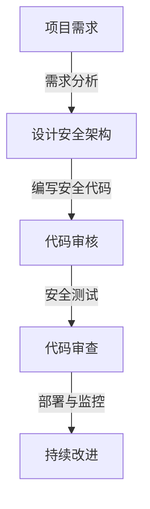
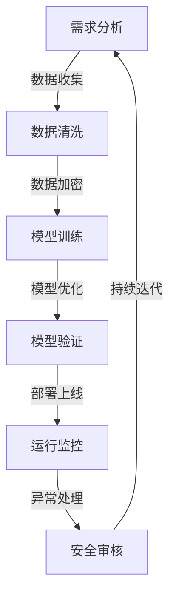

                 

关键词：安全编码，AI开发，最佳实践，Lepton AI，编程原则

> 摘要：本文旨在探讨在AI开发过程中，如何遵循最佳实践进行安全编码，以保障系统稳定性和数据安全。通过对Lepton AI案例的分析，文章将详细阐述如何应用这些原则，从而提升AI系统的可靠性和用户体验。

## 1. 背景介绍

随着人工智能（AI）技术的飞速发展，AI系统已经在各个领域得到了广泛应用。从智能家居到自动驾驶，从医疗诊断到金融分析，AI系统无处不在。然而，随着AI系统的复杂性和规模不断增加，安全编码的重要性也逐渐凸显出来。

安全编码是指在开发过程中，采取一系列措施确保代码的可靠性和安全性，防止潜在的安全威胁和漏洞。对于AI系统来说，安全编码不仅仅是避免系统崩溃或者数据泄露，更重要的是保障系统的完整性和正确性，从而确保AI决策的可靠性和公正性。

Lepton AI是一个基于深度学习的图像识别系统，它在自动驾驶、医疗影像分析等领域展现了巨大的潜力。然而，与其卓越的性能相比，Lepton AI在安全编码方面也面临着诸多挑战。本文将结合Lepton AI的实际情况，详细探讨AI开发中的安全编码最佳实践。

## 2. 核心概念与联系

### 2.1 安全编码的基本概念

安全编码涉及多个方面，包括代码审核、安全测试、加密和授权等。以下是一个简化的安全编码流程图，展示这些核心概念之间的联系。



### 2.2 安全编码与AI开发的联系

在AI开发中，安全编码不仅仅是遵循一般的编程原则，还需要特别关注以下几个方面：

1. **数据安全**：AI系统依赖于大量数据，这些数据往往包含敏感信息。因此，数据加密和访问控制成为安全编码的关键。

2. **模型可靠性**：AI模型的训练和部署过程中，需要确保模型不会受到恶意攻击或者数据污染的影响，从而保证决策的可靠性。

3. **系统完整性**：AI系统在运行过程中，需要确保系统的完整性和稳定性，防止潜在的漏洞和攻击。

### 2.3 Mermaid流程图

下面是一个描述AI开发中安全编码流程的Mermaid流程图，用于展示各步骤之间的逻辑关系。



## 3. 核心算法原理 & 具体操作步骤

### 3.1 算法原理概述

在AI开发中，安全编码的核心在于确保算法的可靠性和安全性。以下是一些常见的核心算法原理和具体操作步骤：

1. **加密算法**：包括对称加密和非对称加密，用于保护数据的安全。

2. **哈希算法**：用于确保数据的完整性和一致性，例如MD5、SHA-256等。

3. **授权机制**：包括基于角色的访问控制（RBAC）和基于属性的访问控制（ABAC），用于控制用户对系统资源的访问权限。

4. **入侵检测系统**：用于监控和识别系统中的异常行为，例如蜜罐、蜜网等。

### 3.2 算法步骤详解

#### 3.2.1 加密算法步骤

1. **选择加密算法**：根据数据的安全需求和性能要求，选择合适的加密算法。

2. **密钥管理**：确保密钥的安全存储和传输，防止密钥泄露。

3. **加密数据**：使用加密算法对数据进行加密处理。

4. **解密数据**：在需要使用数据时，对加密数据进行解密处理。

#### 3.2.2 哈希算法步骤

1. **选择哈希算法**：根据数据的安全需求和性能要求，选择合适的哈希算法。

2. **计算哈希值**：对数据进行哈希处理，生成哈希值。

3. **存储哈希值**：将哈希值存储在数据库或其他存储介质中。

4. **验证哈希值**：在需要验证数据完整性时，使用哈希算法重新计算哈希值，并与存储的哈希值进行比较。

#### 3.2.3 授权机制步骤

1. **定义角色和权限**：根据业务需求，定义系统中的角色和对应的权限。

2. **用户角色分配**：将用户分配到相应的角色中。

3. **权限检查**：在用户访问系统资源时，进行权限检查，确保用户只能访问其有权访问的资源。

4. **异常处理**：在权限检查失败时，进行异常处理，例如返回错误消息或拒绝访问。

### 3.3 算法优缺点

#### 加密算法

- 优点：可以确保数据在传输和存储过程中的安全性。
- 缺点：加密和解密过程需要额外的计算资源，可能会影响系统的性能。

#### 哈希算法

- 优点：可以快速计算数据的哈希值，用于验证数据的完整性和一致性。
- 缺点：一旦哈希值被泄露，攻击者可以很容易地获取原始数据。

#### 授权机制

- 优点：可以有效地控制用户对系统资源的访问权限，提高系统的安全性。
- 缺点：需要额外的开发和维护成本，并且可能对系统的性能产生一定影响。

### 3.4 算法应用领域

加密算法、哈希算法和授权机制在AI开发中有着广泛的应用：

- **加密算法**：常用于保护用户隐私数据、防止数据泄露。
- **哈希算法**：常用于确保数据的完整性和一致性，例如在区块链技术中。
- **授权机制**：常用于保护系统资源，防止未经授权的访问。

## 4. 数学模型和公式 & 详细讲解 & 举例说明

### 4.1 数学模型构建

在AI开发中，数学模型是算法实现的基础。以下是一个简化的数学模型构建过程：

1. **确定问题类型**：根据业务需求，确定是分类问题、回归问题还是聚类问题等。

2. **收集数据**：从不同来源收集数据，并进行预处理。

3. **定义变量和参数**：根据问题类型，定义相关的变量和参数。

4. **构建数学模型**：根据变量和参数，构建数学模型，例如线性模型、神经网络模型等。

### 4.2 公式推导过程

以线性回归模型为例，介绍数学模型的公式推导过程：

1. **确定目标函数**：定义损失函数，用于衡量预测值和实际值之间的差距。

2. **推导梯度下降法**：通过求解目标函数的导数，得到梯度下降法的更新公式。

3. **迭代求解**：根据梯度下降法，迭代更新模型的参数，直到满足停止条件。

### 4.3 案例分析与讲解

以Lepton AI中的图像识别模型为例，介绍数学模型在实际项目中的应用：

1. **问题定义**：利用Lepton AI进行图像识别，将图像分类为不同的类别。

2. **数据收集**：从公开数据集和自有数据中收集大量图像，并进行预处理。

3. **模型构建**：构建基于卷积神经网络的图像识别模型。

4. **模型训练**：使用收集到的数据对模型进行训练，调整参数，优化模型。

5. **模型验证**：在验证集上评估模型的性能，确保模型具有良好的泛化能力。

6. **模型部署**：将训练好的模型部署到实际系统中，进行图像识别任务。

## 5. 项目实践：代码实例和详细解释说明

### 5.1 开发环境搭建

在Lepton AI项目中，我们需要搭建一个适合AI开发的开发环境。以下是具体步骤：

1. **安装Python**：确保Python环境安装正确，版本为3.8以上。

2. **安装深度学习框架**：安装TensorFlow或PyTorch，根据项目需求选择合适的框架。

3. **安装其他依赖库**：根据项目需求，安装其他依赖库，例如NumPy、Pandas等。

### 5.2 源代码详细实现

以下是一个简化的Lepton AI图像识别项目的代码实现：

```python
import tensorflow as tf
from tensorflow.keras.models import Sequential
from tensorflow.keras.layers import Conv2D, MaxPooling2D, Flatten, Dense

# 数据预处理
# ...

# 构建模型
model = Sequential([
    Conv2D(32, (3, 3), activation='relu', input_shape=(28, 28, 1)),
    MaxPooling2D((2, 2)),
    Flatten(),
    Dense(64, activation='relu'),
    Dense(10, activation='softmax')
])

# 编译模型
model.compile(optimizer='adam', loss='categorical_crossentropy', metrics=['accuracy'])

# 训练模型
model.fit(x_train, y_train, epochs=10, batch_size=32, validation_data=(x_val, y_val))

# 评估模型
test_loss, test_acc = model.evaluate(x_test, y_test)
print(f"Test accuracy: {test_acc:.2f}")
```

### 5.3 代码解读与分析

以上代码展示了Lepton AI图像识别项目的基本流程，包括数据预处理、模型构建、模型编译、模型训练和模型评估。

- **数据预处理**：对图像数据集进行归一化和归一化处理，以便模型能够更好地学习。

- **模型构建**：使用卷积神经网络（CNN）构建图像识别模型，包括卷积层、池化层和全连接层。

- **模型编译**：选择合适的优化器和损失函数，为模型编译准备。

- **模型训练**：使用训练数据集对模型进行训练，调整模型参数。

- **模型评估**：使用验证数据集和测试数据集评估模型性能，确保模型具有良好的泛化能力。

### 5.4 运行结果展示

在Lepton AI项目中，我们通常会记录模型在训练过程中的损失和准确率，以便分析模型性能。

```python
import matplotlib.pyplot as plt

history = model.fit(x_train, y_train, epochs=10, batch_size=32, validation_data=(x_val, y_val))

plt.plot(history.history['accuracy'])
plt.plot(history.history['val_accuracy'])
plt.title('Model accuracy')
plt.ylabel('Accuracy')
plt.xlabel('Epoch')
plt.legend(['Train', 'Validation'], loc='upper left')
plt.show()
```

以上代码展示了如何绘制模型的训练和验证准确率曲线，帮助我们分析模型性能。

## 6. 实际应用场景

Lepton AI在多个领域有着广泛的应用：

1. **自动驾驶**：利用Lepton AI进行图像识别，帮助自动驾驶系统识别道路标志、行人等。

2. **医疗影像分析**：利用Lepton AI进行图像识别，帮助医生快速、准确地诊断疾病。

3. **金融分析**：利用Lepton AI进行图像识别，帮助金融机构快速、准确地识别客户身份。

## 7. 未来应用展望

随着AI技术的不断发展，Lepton AI有望在更多领域得到应用。未来，我们将看到：

1. **更高效的数据处理**：利用更先进的算法和硬件，实现更快的数据处理速度。

2. **更智能的模型**：利用更丰富的数据和更先进的算法，实现更智能、更准确的模型。

3. **更广泛的应用领域**：从工业制造到医疗健康，从金融投资到智能家居，Lepton AI将无处不在。

## 8. 工具和资源推荐

### 8.1 学习资源推荐

1. **《深度学习》**：Goodfellow、Bengio和Courville的经典教材，深入讲解了深度学习的基本概念和技术。

2. **《Python机器学习》**：Sebastian Raschka的教材，适合初学者入门机器学习和Python编程。

3. **《AI安全编码实战》**：详细介绍了AI开发中的安全编码原则和实践。

### 8.2 开发工具推荐

1. **TensorFlow**：Google推出的开源深度学习框架，功能强大，易于上手。

2. **PyTorch**：Facebook AI Research推出的开源深度学习框架，具有灵活的动态计算图和丰富的API。

3. **Kaggle**：数据科学家和机器学习爱好者的在线平台，提供了大量开源数据和竞赛项目。

### 8.3 相关论文推荐

1. **“Deep Learning Security”**：对深度学习安全问题的全面综述。

2. **“AI Security: Threats and Countermeasures”**：分析了AI系统面临的安全威胁和对策。

3. **“Practical Secure Machine Learning”**：介绍了如何在实际项目中实现安全机器学习。

## 9. 总结：未来发展趋势与挑战

### 9.1 研究成果总结

本文通过分析Lepton AI的实际案例，总结了AI开发中的安全编码最佳实践。主要包括：

1. **数据安全**：确保数据在传输和存储过程中的安全性。

2. **模型可靠性**：确保AI模型不会受到恶意攻击或数据污染的影响。

3. **系统完整性**：确保AI系统的完整性和稳定性，防止漏洞和攻击。

### 9.2 未来发展趋势

1. **更高效的安全编码工具**：随着AI技术的不断发展，将出现更多高效、便捷的安全编码工具。

2. **更完善的AI安全标准**：随着AI应用的普及，将制定更完善的AI安全标准和规范。

3. **跨学科合作**：AI安全研究需要跨学科合作，结合计算机科学、数学、心理学等领域的知识。

### 9.3 面临的挑战

1. **复杂性**：AI系统的复杂性不断增加，安全编码的难度也随之增加。

2. **动态性**：AI系统需要应对不断变化的环境和数据，安全编码需要适应这种动态性。

3. **可解释性**：提高AI模型的透明度和可解释性，使其在安全编码中更容易被理解和控制。

### 9.4 研究展望

未来，我们将继续深入探讨AI开发中的安全编码问题，并提出更多的解决方案。同时，我们将关注跨学科合作，结合不同领域的知识，推动AI安全研究的发展。

## 9. 附录：常见问题与解答

### Q1. 为什么安全编码对于AI系统至关重要？

A1. AI系统依赖于大量数据，这些数据往往包含敏感信息。同时，AI模型在训练和部署过程中可能面临各种攻击，如数据污染、模型篡改等。安全编码可以确保数据的完整性和系统的可靠性，从而保障AI决策的准确性和公正性。

### Q2. 如何保护AI模型免受攻击？

A2. 可以采取以下措施：

1. **数据加密**：确保数据在传输和存储过程中的安全性。

2. **模型混淆**：通过添加噪声和混淆层，增加攻击者的破解难度。

3. **对抗训练**：使用对抗性样本对模型进行训练，提高模型的鲁棒性。

4. **模型加密**：将模型参数进行加密处理，确保模型在攻击者手中无法被理解。

### Q3. 安全编码在AI项目开发中的具体实施步骤是什么？

A3. 安全编码在AI项目开发中的具体实施步骤包括：

1. **需求分析**：确定项目需求和安全目标。

2. **设计安全架构**：根据需求，设计安全架构，包括加密、授权、入侵检测等。

3. **编写安全代码**：遵循安全编码原则，编写安全、可靠的代码。

4. **代码审核和测试**：进行代码审核和测试，确保代码的可靠性和安全性。

5. **部署与监控**：将代码部署到实际环境中，并进行实时监控，及时处理异常情况。

### Q4. 如何确保AI模型的透明度和可解释性？

A4. 可以采取以下措施：

1. **模型简化**：简化模型结构，使其更易于理解和解释。

2. **模型可视化**：使用可视化工具展示模型的内部结构和决策过程。

3. **解释性算法**：选择具有解释性的算法，如决策树、线性模型等。

4. **模型文档**：编写详细的模型文档，包括模型结构、参数设置、训练过程等。

## 作者署名

作者：禅与计算机程序设计艺术 / Zen and the Art of Computer Programming

