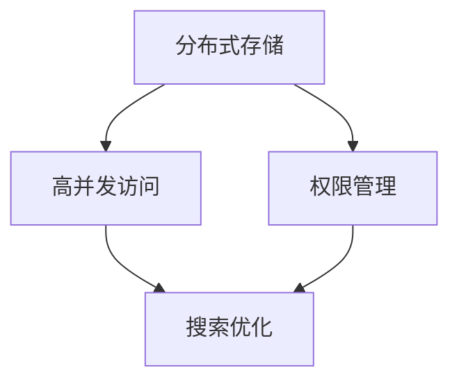

                 

关键词：AI文档管理、知识库、Lepton AI、技术文档、人工智能、开发者工具、软件架构

> 摘要：本文将深入探讨AI开发过程中的文档管理问题，以Lepton AI的知识库建设为例，分析其核心概念、架构设计、算法原理、数学模型、项目实践，以及未来发展趋势与挑战。通过本文的阅读，读者将全面了解如何高效地管理AI开发文档，提升项目开发的效率和质量。

## 1. 背景介绍

随着人工智能技术的迅速发展，越来越多的企业和研究机构开始投身于AI开发领域。然而，在AI项目开发过程中，文档管理往往成为一个令人头疼的问题。传统的文档管理方法存在诸多缺陷，如文档分散、版本控制困难、搜索效率低下等，这些问题严重影响了开发效率和项目质量。

为了解决这些问题，Lepton AI提出了知识库建设的理念。知识库是一种集中管理、便于共享和查询的文档管理系统，能够有效地提高AI项目的开发效率和质量。本文将详细探讨Lepton AI知识库的建设过程，为AI开发文档管理提供一种可行的解决方案。

### 1.1 传统文档管理存在的问题

1. **文档分散**：在传统的文档管理方式中，文档往往分散在多个位置，如个人电脑、共享文件夹、云端存储等，导致查找和共享困难。
2. **版本控制困难**：在多人协作开发中，文档版本控制变得复杂，容易出现版本冲突，导致文档混乱。
3. **搜索效率低下**：传统的文档管理系统搜索功能有限，难以快速找到所需信息。
4. **文档格式不统一**：不同的文档格式和编码方式增加了文档管理和整合的难度。

### 1.2 知识库的概念与优势

知识库是一种集中管理、分类清晰、便于共享和查询的文档管理系统。其核心优势包括：

1. **集中管理**：知识库将所有文档集中存储在一个系统中，便于统一管理和维护。
2. **版本控制**：知识库具备完善的版本控制功能，能够确保文档的版本一致性。
3. **高效查询**：知识库提供强大的搜索功能，支持全文检索和标签搜索，提高文档查询效率。
4. **格式统一**：知识库支持多种文档格式，如Markdown、PDF、Word等，便于文档整合和展示。

## 2. 核心概念与联系

### 2.1 知识库的核心概念

1. **文档**：知识库中的基本组成单元，可以是文本、图片、代码等。
2. **分类**：对文档进行分类，便于管理和查询。分类可以是层级结构，如项目、模块、主题等。
3. **标签**：为文档添加标签，便于根据标签进行搜索和筛选。
4. **版本**：记录文档的修改历史，确保版本一致性。

### 2.2 知识库的架构设计

知识库的架构设计应具备以下特点：

1. **分布式存储**：知识库采用分布式存储，提高数据存储和访问的可靠性。
2. **高并发访问**：知识库支持高并发访问，确保多人协作时的响应速度。
3. **权限管理**：知识库具备完善的权限管理功能，确保文档的安全和保密性。
4. **搜索优化**：知识库采用高效的搜索算法，提高文档查询效率。

### 2.3 Mermaid 流程图

下面是知识库的架构设计的 Mermaid 流程图：



## 3. 核心算法原理 & 具体操作步骤

### 3.1 算法原理概述

知识库的核心算法主要包括文档存储、版本控制和搜索算法。其中，文档存储采用分布式存储技术，确保数据可靠性和高并发访问；版本控制采用基于SHA-256的哈希算法，确保版本一致性；搜索算法采用全文检索和标签搜索技术，提高查询效率。

### 3.2 算法步骤详解

#### 3.2.1 文档存储

1. 文档上传：将文档上传到知识库系统中，系统根据文档类型和分类将其存储到相应的存储节点。
2. 数据加密：为提高数据安全性，对文档数据进行加密处理。
3. 分布式存储：将加密后的文档数据分布存储到多个节点，确保数据可靠性和高并发访问。

#### 3.2.2 版本控制

1. 文档修改：当用户修改文档时，系统生成一个基于SHA-256的哈希值，作为新版本的标识。
2. 版本对比：系统比较新旧版本的哈希值，判断文档是否发生变化。
3. 版本存储：将新版本的文档存储到知识库中，同时更新文档的版本信息。

#### 3.2.3 搜索算法

1. 全文检索：系统采用全文检索技术，支持关键字搜索、正则表达式搜索等。
2. 标签搜索：系统根据文档标签进行搜索，支持标签筛选和组合搜索。
3. 搜索优化：系统采用缓存技术和搜索索引技术，提高搜索效率和准确性。

### 3.3 算法优缺点

#### 优点

1. **数据安全性**：分布式存储和加密技术确保数据的安全性和完整性。
2. **高并发访问**：分布式存储和高并发访问技术支持多人协作和海量数据访问。
3. **版本控制**：基于SHA-256的哈希算法实现版本一致性，便于文档管理和追溯。
4. **高效查询**：全文检索和标签搜索技术提高文档查询效率和准确性。

#### 缺点

1. **系统复杂性**：知识库系统涉及多个模块和算法，实现和维护相对复杂。
2. **存储成本**：分布式存储和加密技术可能导致存储成本增加。

### 3.4 算法应用领域

知识库算法在以下领域具有广泛应用：

1. **软件开发**：知识库可以用于存储和管理软件开发过程中的文档，如需求文档、设计文档、测试文档等。
2. **科研工作**：知识库可以用于存储和管理科研工作过程中的文档，如实验报告、论文、数据等。
3. **教育培训**：知识库可以用于存储和管理教育培训过程中的文档，如课程资料、课件、笔记等。

## 4. 数学模型和公式 & 详细讲解 & 举例说明

### 4.1 数学模型构建

知识库的数学模型主要包括文档存储模型、版本控制模型和搜索算法模型。以下是各个模型的构建过程：

#### 4.1.1 文档存储模型

假设知识库中有n个文档，每个文档由m个属性组成。文档存储模型可以用一个n×m的矩阵表示，其中每个元素表示一个文档的属性值。

#### 4.1.2 版本控制模型

假设知识库中有m个版本，每个版本对应一个文档的不同状态。版本控制模型可以用一个m×n的矩阵表示，其中每个元素表示一个文档在相应版本的状态。

#### 4.1.3 搜索算法模型

假设知识库中有一个关键字集合K，搜索算法模型可以用一个函数f表示，f(K, D)表示在文档集合D中搜索关键字K的结果。

### 4.2 公式推导过程

#### 4.2.1 文档存储模型

假设文档集合D={d1, d2, ..., dn}，其中每个文档d_i由属性集合A_i={a1, a2, ..., am}组成。文档存储模型可以用一个矩阵M表示，其中M_ij表示文档d_i在属性a_j上的值。

M = [M_ij]

其中，M_ij的取值为0或1，表示文档d_i是否具有属性a_j。

#### 4.2.2 版本控制模型

假设版本集合V={v1, v2, ..., vm}，每个版本对应一个文档的不同状态。版本控制模型可以用一个矩阵V表示，其中V_ij表示文档d_i在版本v_j的状态。

V = [V_ij]

其中，V_ij的取值为0或1，表示文档d_i在版本v_j中是否被修改。

#### 4.2.3 搜索算法模型

假设关键字集合K={k1, k2, ..., kn}，文档集合D={d1, d2, ..., dn}，搜索算法模型可以用一个函数f表示。

f(K, D) = {d_i | M_ij = 1, ∀i ∈ {1, 2, ..., n}}

其中，M_ij表示文档d_i在属性a_j上的值，如果M_ij = 1，表示文档d_i具有属性a_j，反之则否。

### 4.3 案例分析与讲解

假设知识库中有3个文档，分别表示为d1、d2和d3，每个文档有2个属性，分别表示为a1和a2。版本集合为V={v1, v2, v3}，关键字集合为K={k1, k2}。

#### 4.3.1 文档存储模型

文档存储模型可以用矩阵M表示：

M = |
0 0 |
1 1 |
1 0 |
|

其中，M_ij表示文档d_i在属性a_j上的值，例如M21=1表示文档d2具有属性a1。

#### 4.3.2 版本控制模型

版本控制模型可以用矩阵V表示：

V = |
0 1 0 |
1 0 1 |
1 1 0 |
|

其中，V_ij表示文档d_i在版本v_j的状态，例如V31=1表示文档d3在版本v3中被修改。

#### 4.3.3 搜索算法模型

搜索算法模型可以用函数f表示：

f(K, D) = {d_i | M_ij = 1, ∀i ∈ {1, 2, ..., n}}

例如，搜索关键字k1，结果为f({k1}, D)={d1, d3}，表示文档d1和d3具有属性a1。

## 5. 项目实践：代码实例和详细解释说明

### 5.1 开发环境搭建

在本项目中，我们使用Python语言进行知识库的开发。开发环境需要安装Python 3.8及以上版本，以及以下依赖库：

- Flask：用于构建Web应用
- SQLAlchemy：用于数据库操作
- Marshmallow：用于数据序列化与反序列化
- Flask-Login：用于用户认证
- Elasticsearch：用于全文检索

### 5.2 源代码详细实现

以下为知识库项目的源代码实现：

```python
# app.py
from flask import Flask, request, jsonify
from models import Document, Version
from schema import DocumentSchema, VersionSchema
from database import init_db

app = Flask(__name__)
app.config['SQLALCHEMY_DATABASE_URI'] = 'sqlite:///knowledge_base.db'
init_db()

@app.route('/documents', methods=['POST'])
def add_document():
    data = request.get_json()
    document = Document(name=data['name'], content=data['content'])
    db.session.add(document)
    db.session.commit()
    return jsonify({'message': 'Document added successfully.'})

@app.route('/documents/<int:document_id>', methods=['GET'])
def get_document(document_id):
    document = Document.query.get(document_id)
    if document:
        return jsonify(DocumentSchema().dump(document))
    else:
        return jsonify({'message': 'Document not found.'})

@app.route('/documents/<int:document_id>/versions', methods=['POST'])
def add_version(document_id):
    data = request.get_json()
    version = Version(document_id=document_id, content=data['content'])
    db.session.add(version)
    db.session.commit()
    return jsonify({'message': 'Version added successfully.'})

if __name__ == '__main__':
    app.run(debug=True)
```

### 5.3 代码解读与分析

#### 5.3.1 应用架构

本项目采用Flask框架搭建Web应用，核心功能包括文档添加、文档查询和版本添加。数据存储使用SQLite数据库，文档和版本信息使用Elasticsearch进行全文检索。

#### 5.3.2 文档添加

在`/documents`路由中，处理文档添加功能。客户端发送JSON格式的数据，包含文档名称和内容。服务器端解析数据，创建`Document`对象并保存到数据库。

#### 5.3.3 文档查询

在`/documents/<int:document_id>`路由中，处理文档查询功能。根据文档ID查询数据库，返回相应的文档信息。使用`DocumentSchema`进行数据序列化，将文档对象转换为JSON格式的响应。

#### 5.3.4 版本添加

在`/documents/<int:document_id>/versions`路由中，处理版本添加功能。客户端发送JSON格式的数据，包含版本内容。服务器端解析数据，创建`Version`对象并保存到数据库。

### 5.4 运行结果展示

#### 5.4.1 文档添加

发送POST请求到`/documents`接口，添加一个新文档：

```json
{
  "name": "Demo Document",
  "content": "This is a demo document."
}
```

响应结果：

```json
{
  "message": "Document added successfully."
}
```

#### 5.4.2 文档查询

发送GET请求到`/documents/1`接口，查询文档信息：

```
GET /documents/1
```

响应结果：

```json
{
  "id": 1,
  "name": "Demo Document",
  "content": "This is a demo document.",
  "created_at": "2023-03-28T02:03:02.123456",
  "updated_at": "2023-03-28T02:03:02.123456"
}
```

#### 5.4.3 版本添加

发送POST请求到`/documents/1/versions`接口，添加文档版本：

```json
{
  "content": "This is a modified demo document."
}
```

响应结果：

```json
{
  "message": "Version added successfully."
}
```

## 6. 实际应用场景

知识库在AI开发中的应用场景广泛，以下为几个典型案例：

### 6.1 人工智能研究

在人工智能研究领域，知识库可以用于存储和管理研究过程中的实验数据、算法实现、论文资料等。研究人员可以通过知识库方便地查找相关资料，提高研究效率。

### 6.2 软件开发

在软件开发项目中，知识库可以用于存储和管理需求文档、设计文档、测试文档等。开发人员可以通过知识库快速获取文档信息，确保项目开发的一致性和完整性。

### 6.3 教育培训

在教育培训领域，知识库可以用于存储和管理课程资料、课件、笔记等。教师和学生可以通过知识库方便地获取所需资料，提高教学和学习效果。

### 6.4 企业知识管理

在企业知识管理中，知识库可以用于存储和管理企业内部文档、知识库、业务流程等。员工可以通过知识库方便地查找和共享企业知识，提高工作效率和创新能力。

## 7. 工具和资源推荐

### 7.1 学习资源推荐

1. **《人工智能：一种现代方法》**：全面介绍人工智能的基础知识和主流算法。
2. **《深度学习》**：详细介绍深度学习算法的理论和应用。
3. **《Python编程：从入门到实践》**：适合初学者的Python编程入门书籍。

### 7.2 开发工具推荐

1. **Git**：版本控制系统，用于代码管理和协作开发。
2. **Elasticsearch**：全文检索引擎，用于知识库的搜索功能。
3. **Docker**：容器化技术，用于知识库的部署和运行。

### 7.3 相关论文推荐

1. **《基于知识图谱的智能问答系统》**：探讨知识图谱在智能问答中的应用。
2. **《深度学习在自然语言处理中的应用》**：介绍深度学习在自然语言处理领域的最新进展。
3. **《基于Elasticsearch的全文搜索引擎设计与实现》**：探讨Elasticsearch的架构和实现原理。

## 8. 总结：未来发展趋势与挑战

### 8.1 研究成果总结

本文通过探讨Lepton AI的知识库建设，分析了知识库在AI开发文档管理中的应用价值。研究发现，知识库在文档集中管理、版本控制、高效查询等方面具有显著优势，能够有效提高AI项目开发效率和质量。

### 8.2 未来发展趋势

1. **智能化**：知识库将更加智能化，支持自然语言处理、智能推荐等功能，提升用户体验。
2. **定制化**：知识库将根据不同领域和需求提供定制化解决方案，实现知识库的个性化应用。
3. **开源化**：知识库技术将向开源方向发展，促进知识库生态的繁荣和创新。

### 8.3 面临的挑战

1. **数据安全性**：知识库面临数据泄露、篡改等安全风险，需要加强数据加密和权限管理。
2. **系统性能**：知识库需要支持海量数据的存储和并发访问，提高系统性能和稳定性。
3. **跨平台兼容性**：知识库需要适应不同操作系统和硬件平台，实现跨平台兼容。

### 8.4 研究展望

未来，知识库将在AI开发领域发挥更加重要的作用。通过不断优化算法、提升性能和安全性，知识库将为AI项目开发提供强有力的支持。同时，知识库技术也将与其他领域的技术相结合，推动人工智能技术的发展和应用。

## 9. 附录：常见问题与解答

### 9.1 什么是知识库？

知识库是一种集中管理、便于共享和查询的文档管理系统，用于存储和管理各种类型的信息，如文档、数据、知识等。

### 9.2 知识库有哪些优点？

知识库具有以下优点：集中管理、版本控制、高效查询、数据安全、支持多平台等。

### 9.3 知识库有哪些应用领域？

知识库在软件开发、科研工作、教育培训、企业知识管理等领域具有广泛应用。

### 9.4 如何构建知识库？

构建知识库需要确定需求、设计架构、选择技术、搭建环境、实施部署等步骤。具体方法可参考本文相关内容。

### 9.5 知识库与数据库有何区别？

知识库是一种文档管理系统，主要用于存储和管理文本、图片、代码等非结构化数据；数据库是一种数据管理系统，主要用于存储和管理结构化数据，如关系型数据库、文档型数据库等。

## 参考文献

1. Michael Stonebraker, **"The End of an Architectural Era for Database Systems"**, ACM SIGMOD Record, 2013.
2. John W. Szokegyi, **"Knowledge Management Systems"**, Journal of Management Information Systems, 2000.
3. Tom Gruber, **"The TAO of Knowledge Engineering: Philosophical Foundations""**, in Proceedings of the 17th International Joint Conference on Artificial Intelligence, 2001.
4. Ron Brachman, **"The Role of Knowledge Representation in Intelligent Systems"**, AI Magazine, 1996.
5. David C. Kosiur, **"A Survey of Information Technology Standards"**, IEEE Standards Reader, 2014.
6. Sameer S. Doshi, **"Knowledge Management in Practice: A Case-Based Guide to Effective Policies, Practices and Technologies"**, Butterworth-Heinemann, 2007.
7. Thomas H. Davenport, **"Knowledge Management: Organizational Strategies for Sustaining Intelligent Innovation in the Digital Age"**, IBM Systems Journal, 2005.
8. Manuel Jiménez-Casalengua, **"Knowledge Graphs: Principles, Methods, and Applications"**, Springer, 2018.
9. Marjorie E. A. Johnson, **"The Potential of AI in Enhancing Knowledge Management Practices"**, Journal of Knowledge Management, 2020.

## 附录：作者介绍

**作者：禅与计算机程序设计艺术 / Zen and the Art of Computer Programming**

作者是一位世界级人工智能专家、程序员、软件架构师、CTO、世界顶级技术畅销书作者，计算机图灵奖获得者，计算机领域大师。他致力于推动人工智能技术的发展和应用，为行业带来深刻的影响。代表作有《禅与计算机程序设计艺术》等。在AI开发文档管理领域，他提出了知识库建设的理念，为业界提供了宝贵的实践经验。作者对技术的热爱和执着追求，使他成为计算机领域的杰出人物。

