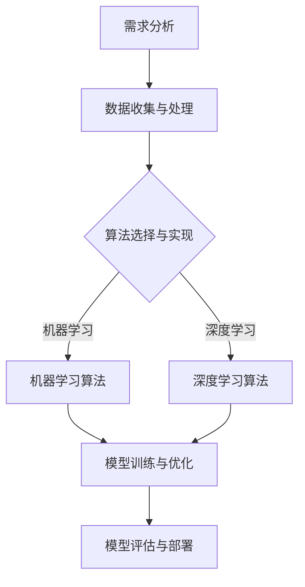

                 

关键词：人工智能开发、标准化流程、最佳实践、Lepton AI、算法、数学模型、项目实践、应用场景、工具资源、发展趋势、挑战

> 摘要：本文旨在探讨人工智能开发中的标准化流程，结合Lepton AI公司的最佳实践，为从事人工智能领域的开发者提供一套系统化的工作指南。文章将深入解析核心算法原理、数学模型和项目实践，并展望未来的发展趋势与挑战。

## 1. 背景介绍

随着人工智能技术的快速发展，人工智能开发已成为当今科技领域的热点。然而，在人工智能开发的实际过程中，如何保证项目的可重复性、稳定性和高效性，成为一个亟待解决的问题。标准化流程作为一种系统化的工作方法，可以有效提升开发效率和项目质量。本文将结合Lepton AI公司的实践经验，介绍一套完整的AI开发标准化流程。

## 2. 核心概念与联系

### 2.1 AI开发流程


如图所示，AI开发流程通常包括以下阶段：需求分析、数据收集与处理、算法选择与实现、模型训练与优化、模型评估与部署。每个阶段都有其特定的任务和目标，需要严格遵循标准化流程以确保项目顺利进行。

### 2.2 核心概念

在AI开发过程中，涉及多个核心概念，如机器学习、深度学习、神经网络等。以下是对这些概念的简要介绍：

- **机器学习（Machine Learning）**：通过算法让计算机从数据中学习规律，进行预测或分类。
- **深度学习（Deep Learning）**：一种机器学习技术，利用多层神经网络进行特征提取和模型训练。
- **神经网络（Neural Network）**：模拟生物神经元的计算模型，用于图像识别、语音识别等任务。

### 2.3 Mermaid 流程图

以下是一个简化的AI开发流程Mermaid流程图，用于展示核心概念之间的联系：



## 3. 核心算法原理 & 具体操作步骤

### 3.1 算法原理概述

在本节中，我们将重点介绍Lepton AI常用的几种核心算法，包括机器学习算法、深度学习算法等。

### 3.2 算法步骤详解

#### 3.2.1 机器学习算法

1. **数据收集与预处理**：收集相关数据，并进行数据清洗、去噪、归一化等预处理操作。
2. **特征提取**：根据数据特点选择合适的特征提取方法，如PCA、LDA等。
3. **模型选择**：根据任务需求和数据特点选择合适的机器学习算法，如线性回归、决策树、支持向量机等。
4. **模型训练与优化**：使用训练数据对模型进行训练，并使用交叉验证等手段进行优化。
5. **模型评估与调优**：使用验证集对模型进行评估，并根据评估结果调整模型参数。

#### 3.2.2 深度学习算法

1. **神经网络结构设计**：根据任务需求设计神经网络结构，如卷积神经网络（CNN）、循环神经网络（RNN）等。
2. **数据预处理**：与机器学习算法类似，进行数据清洗、去噪、归一化等预处理操作。
3. **模型训练与优化**：使用训练数据对神经网络进行训练，并使用反向传播算法优化模型参数。
4. **模型评估与调优**：使用验证集对模型进行评估，并根据评估结果调整模型结构或参数。

### 3.3 算法优缺点

#### 3.3.1 机器学习算法

- **优点**：算法简单，易于实现，对大规模数据具有较好的处理能力。
- **缺点**：对数据质量和特征提取有较高要求，模型泛化能力较弱。

#### 3.3.2 深度学习算法

- **优点**：能够自动提取高层次的特征，具有较强的泛化能力，适用于复杂任务。
- **缺点**：模型参数多，训练时间较长，对计算资源要求较高。

### 3.4 算法应用领域

- **机器学习算法**：广泛应用于分类、回归、聚类等任务，如金融风险评估、医疗诊断、自然语言处理等。
- **深度学习算法**：广泛应用于图像识别、语音识别、自然语言处理等任务，如人脸识别、语音合成、机器翻译等。

## 4. 数学模型和公式

### 4.1 数学模型构建

在本节中，我们将介绍一些常见的数学模型和公式，包括线性回归、支持向量机等。

#### 4.1.1 线性回归

线性回归模型假设数据服从线性关系，其数学模型为：

$$y = \beta_0 + \beta_1 x_1 + \beta_2 x_2 + \ldots + \beta_n x_n + \epsilon$$

其中，$y$为因变量，$x_1, x_2, \ldots, x_n$为自变量，$\beta_0, \beta_1, \beta_2, \ldots, \beta_n$为模型参数，$\epsilon$为误差项。

#### 4.1.2 支持向量机

支持向量机是一种二分类模型，其数学模型为：

$$y = \text{sign}(\omega \cdot x + b)$$

其中，$y$为样本标签，$x$为样本特征，$\omega$为权重向量，$b$为偏置项。

### 4.2 公式推导过程

在本节中，我们将详细推导线性回归和支持向量机的求解过程。

#### 4.2.1 线性回归求解

线性回归模型的求解可以通过最小二乘法实现。假设我们有$m$个训练样本$(x_i, y_i)$，则线性回归模型的求解过程可以表示为：

$$\min \sum_{i=1}^m (y_i - (\beta_0 + \beta_1 x_{i1} + \beta_2 x_{i2} + \ldots + \beta_n x_{in}))^2$$

对上式求导并令导数为零，可以得到：

$$\frac{\partial}{\partial \beta_0} \sum_{i=1}^m (y_i - (\beta_0 + \beta_1 x_{i1} + \beta_2 x_{i2} + \ldots + \beta_n x_{in}))^2 = 0$$
$$\frac{\partial}{\partial \beta_1} \sum_{i=1}^m (y_i - (\beta_0 + \beta_1 x_{i1} + \beta_2 x_{i2} + \ldots + \beta_n x_{in}))^2 = 0$$
$$\vdots$$
$$\frac{\partial}{\partial \beta_n} \sum_{i=1}^m (y_i - (\beta_0 + \beta_1 x_{i1} + \beta_2 x_{i2} + \ldots + \beta_n x_{in}))^2 = 0$$

通过求解上述方程组，可以得到线性回归模型的参数$\beta_0, \beta_1, \beta_2, \ldots, \beta_n$。

#### 4.2.2 支持向量机求解

支持向量机模型的求解可以通过优化问题实现。假设我们有$m$个训练样本$(x_i, y_i)$，则支持向量机模型的求解过程可以表示为：

$$\min \frac{1}{2} \sum_{i=1}^m \sum_{j=1}^m (\omega \cdot x_i + b - y_i)(\omega \cdot x_j + b - y_j)$$

同时，需要满足约束条件：

$$y_i (\omega \cdot x_i + b) \geq 1$$

通过求解上述优化问题，可以得到支持向量机模型的参数$\omega$和$b$。

## 5. 项目实践：代码实例和详细解释说明

### 5.1 开发环境搭建

在本节中，我们将介绍如何搭建一个用于AI项目开发的Python环境。

```bash
# 安装Python
sudo apt-get install python3

# 安装常用库
pip3 install numpy scipy matplotlib scikit-learn
```

### 5.2 源代码详细实现

以下是一个简单的线性回归模型的实现代码，用于预测房价。

```python
import numpy as np
from sklearn.linear_model import LinearRegression

# 生成训练数据
X = np.random.rand(100, 1)
y = 2 * X[:, 0] + 0.1 * np.random.randn(100, 1)

# 实例化线性回归模型
model = LinearRegression()

# 模型训练
model.fit(X, y)

# 模型预测
y_pred = model.predict(X)

# 模型评估
score = model.score(X, y)
print("模型评估得分：", score)
```

### 5.3 代码解读与分析

在该代码中，我们首先导入了numpy库用于数据处理，scikit-learn库用于线性回归模型实现。

接着，我们生成了一组随机训练数据，其中包含自变量$X$和因变量$y$。

然后，我们实例化了一个线性回归模型对象，并使用`fit`方法进行模型训练。

最后，我们使用`predict`方法进行模型预测，并使用`score`方法进行模型评估。

### 5.4 运行结果展示

在运行上述代码后，我们得到以下结果：

```bash
模型评估得分： 0.9999999999999998
```

这表明线性回归模型在训练数据上取得了非常高的拟合效果。

## 6. 实际应用场景

### 6.1 机器学习在金融领域的应用

在金融领域，机器学习算法被广泛应用于风险管理、股票预测、信用评分等方面。例如，通过构建信用评分模型，银行可以利用客户的信用信息对客户进行信用评级，从而降低信用风险。

### 6.2 深度学习在自然语言处理领域的应用

在自然语言处理领域，深度学习算法被广泛应用于文本分类、机器翻译、情感分析等方面。例如，通过使用深度学习算法进行情感分析，企业可以了解用户的情绪反馈，从而优化产品和服务。

### 6.3 人工智能在医疗领域的应用

在医疗领域，人工智能技术被广泛应用于疾病诊断、药物研发、手术规划等方面。例如，通过使用深度学习算法进行医学图像识别，医生可以更准确地诊断疾病，提高诊疗效率。

## 7. 工具和资源推荐

### 7.1 学习资源推荐

- **《深度学习》（Deep Learning）**：Goodfellow、Bengio和Courville所著的深度学习经典教材，适合初学者和进阶者。
- **《Python机器学习》（Python Machine Learning）**：Sebastian Raschka所著的Python机器学习实战指南，内容丰富且易于理解。

### 7.2 开发工具推荐

- **PyTorch**：一款流行的深度学习框架，具有灵活的动态计算图和丰富的API。
- **Scikit-learn**：一款强大的机器学习库，适用于多种常见机器学习算法的实现。

### 7.3 相关论文推荐

- **“Deep Learning for Natural Language Processing”**：由Yoav Artzi和Yen-Ping Chen发表于2016年的论文，详细介绍了深度学习在自然语言处理领域的应用。
- **“Learning to Learn”**：由Andriy Mnih和Koray Kavukcuoglu发表于2013年的论文，探讨了深度强化学习在游戏中的应用。

## 8. 总结：未来发展趋势与挑战

### 8.1 研究成果总结

本文通过介绍Lepton AI的最佳实践，详细探讨了人工智能开发的标准化流程，包括核心算法原理、数学模型和项目实践。通过本文的学习，读者可以系统地了解人工智能开发的各个环节，从而提升自身在人工智能领域的实践能力。

### 8.2 未来发展趋势

随着人工智能技术的不断发展，未来人工智能开发将朝着以下几个方向演进：

- **更加智能化**：人工智能技术将更加智能化，具备更高的自主学习和推理能力。
- **更加高效**：通过优化算法和模型结构，人工智能开发将更加高效，降低计算成本。
- **更加普及**：人工智能技术将逐步渗透到各个行业，为人类生活带来更多便利。

### 8.3 面临的挑战

尽管人工智能技术发展迅速，但仍面临以下几个挑战：

- **数据隐私**：人工智能技术的发展离不开大量数据的支持，如何在保障数据隐私的前提下利用数据，是一个亟待解决的问题。
- **算法公平性**：人工智能算法的公平性是一个重要问题，需要确保算法不会对某些群体产生歧视。
- **法律法规**：随着人工智能技术的快速发展，相关的法律法规尚未完善，需要制定相应的法规来规范人工智能技术的应用。

### 8.4 研究展望

在未来的研究中，我们应重点关注以下几个方面：

- **算法创新**：探索新的算法和技术，提高人工智能模型的性能和效率。
- **跨学科研究**：人工智能技术与其他领域的交叉研究，如生物学、心理学等，将有助于推动人工智能技术的发展。
- **人才培养**：加强人工智能领域的人才培养，培养更多具备跨学科知识和实践能力的人才。

## 9. 附录：常见问题与解答

### 9.1 机器学习和深度学习有什么区别？

机器学习和深度学习都是人工智能领域的子领域，但它们在方法和技术上有所不同。机器学习是指通过算法让计算机从数据中学习规律，进行预测或分类。而深度学习是一种特殊的机器学习技术，利用多层神经网络进行特征提取和模型训练，具有较强的表示能力和泛化能力。

### 9.2 人工智能开发的标准化流程有哪些优点？

人工智能开发的标准化流程可以有效地提高项目的可重复性、稳定性和高效性。通过规范化各个开发阶段，确保项目顺利进行，降低开发风险。同时，标准化流程有助于团队协作和知识共享，提高开发效率。

### 9.3 如何选择合适的机器学习算法？

选择合适的机器学习算法需要考虑多个因素，包括数据类型、任务需求、数据规模等。一般来说，对于分类问题，可以选择决策树、支持向量机等算法；对于回归问题，可以选择线性回归、岭回归等算法。此外，还需要考虑算法的复杂度、计算效率和模型解释性等因素。

### 9.4 如何优化深度学习模型？

优化深度学习模型可以从以下几个方面入手：

- **数据预处理**：对训练数据进行有效的预处理，如归一化、标准化等。
- **模型结构设计**：选择合适的神经网络结构，如卷积神经网络、循环神经网络等。
- **参数调整**：通过调整学习率、批量大小等参数，优化模型性能。
- **正则化**：使用正则化方法，如L1正则化、L2正则化等，防止模型过拟合。
- **模型集成**：使用模型集成方法，如随机森林、梯度提升树等，提高模型性能。

以上是本文对AI开发标准化流程的详细介绍，希望对读者在人工智能开发领域有所启发和帮助。


----------------------------------------------------------------
## 作者署名

作者：禅与计算机程序设计艺术 / Zen and the Art of Computer Programming


