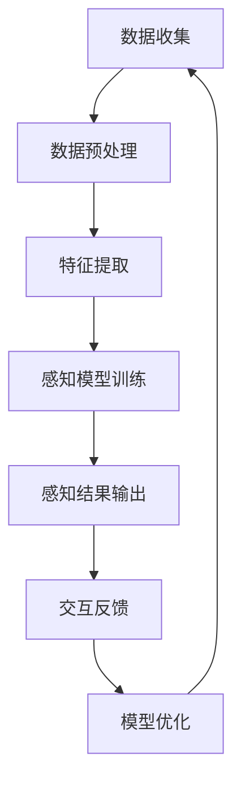

                 

关键词：人工智能、感知增强、感官模拟、五感超越、技术趋势、应用实例、未来展望

> 摘要：本文探讨了人工智能技术在感知增强领域的最新进展，通过分析核心概念、算法原理、数学模型以及实际应用案例，揭示了AI如何超越人类五感，带来全新的交互体验。文章旨在为读者提供关于AI感知增强的全面理解，并展望其未来的发展趋势和挑战。

## 1. 背景介绍

在过去的几十年里，人工智能（AI）的发展已经深刻地改变了我们的生活方式。从简单的机器人到复杂的深度学习模型，AI技术不断地突破极限，拓宽了其应用领域。然而，尽管AI在处理数据、决策和预测等方面取得了巨大进步，但在感知增强方面仍有许多挑战需要克服。

人类的感知系统由五感构成：视觉、听觉、嗅觉、味觉和触觉。这些感官使我们能够感知外部世界，并通过神经信号传递给大脑，从而做出反应。传统的人工智能系统主要依赖于视觉和听觉，但在其他感官上的应用相对较少。感知增强技术旨在通过人工智能的方法，增强或模拟人类的感官体验，使机器能够更全面地感知和理解周围环境。

感知增强技术的研究起源于对人类感官系统的模仿。随着计算能力的提升和数据收集技术的进步，研究人员开始探索如何利用AI技术来实现感知增强。这一领域的研究不仅有助于提升机器的感知能力，还可能带来全新的交互体验，改变人们与机器的互动方式。

## 2. 核心概念与联系

### 2.1 感知增强技术的核心概念

感知增强技术的核心概念包括：

1. **感官模拟**：通过人工智能模型模拟人类的感官，如视觉、听觉、嗅觉等。
2. **数据融合**：将不同感官的数据进行整合，提高整体感知能力。
3. **交互反馈**：通过与用户互动，调整和优化感知模型，以提供更准确的感知结果。
4. **多模态学习**：结合多种模态的数据，如图像、声音、文本等，以获得更全面的信息。

### 2.2 感知增强技术的架构

感知增强技术的架构可以概括为以下几层：

1. **数据收集与预处理**：收集各种感官数据，并进行预处理，如滤波、增强、降噪等。
2. **特征提取**：从原始数据中提取特征，用于后续的分析和处理。
3. **感知模型**：利用机器学习算法构建感知模型，如神经网络、支持向量机等。
4. **感知融合与交互**：将不同感官的感知结果进行融合，并通过交互反馈优化模型。

### 2.3 感知增强技术的工作原理

感知增强技术的工作原理主要包括以下几个步骤：

1. **数据输入**：将各种感官数据输入到感知模型中。
2. **特征提取**：对输入数据提取关键特征。
3. **模型分析**：利用机器学习算法分析特征，生成感知结果。
4. **交互反馈**：根据用户的反馈调整模型参数，提高感知准确性。

以下是感知增强技术的 Mermaid 流程图：



## 3. 核心算法原理 & 具体操作步骤

### 3.1 算法原理概述

感知增强技术的核心算法主要基于机器学习和深度学习。以下是一些常用的算法：

1. **卷积神经网络（CNN）**：用于图像识别和视觉感知增强。
2. **循环神经网络（RNN）**：用于处理序列数据，如语音信号。
3. **生成对抗网络（GAN）**：用于生成逼真的感官数据。
4. **支持向量机（SVM）**：用于分类和回归分析。

### 3.2 算法步骤详解

1. **数据收集与预处理**：收集各种感官数据，并进行预处理，如数据增强、归一化等。
2. **特征提取**：利用卷积神经网络或循环神经网络提取关键特征。
3. **模型训练**：使用提取的特征训练机器学习模型，如CNN、RNN或GAN。
4. **感知结果输出**：将训练好的模型应用于新的数据，生成感知结果。
5. **交互反馈**：根据用户的反馈调整模型参数，优化感知准确性。

### 3.3 算法优缺点

- **优点**：
  - 提高感知准确性，实现更全面的感知增强。
  - 可定制化，根据不同应用场景调整算法参数。
  - 利用大量数据进行训练，提高模型的鲁棒性。

- **缺点**：
  - 计算资源需求较高，训练过程耗时较长。
  - 模型复杂度高，可能导致过拟合。
  - 对数据质量要求较高，需要大量高质量数据支持。

### 3.4 算法应用领域

感知增强技术在多个领域都有广泛的应用：

- **医疗领域**：用于辅助诊断、手术导航等。
- **安防领域**：用于视频监控、人脸识别等。
- **智能家居**：用于语音识别、智能助手等。
- **娱乐领域**：用于虚拟现实、增强现实等。

## 4. 数学模型和公式 & 详细讲解 & 举例说明

### 4.1 数学模型构建

感知增强技术的数学模型主要基于概率统计和优化理论。以下是一个简单的感知增强模型的构建过程：

1. **数据表示**：使用特征向量表示各种感官数据。
2. **概率分布**：计算特征向量的概率分布。
3. **模型优化**：使用优化算法调整模型参数，最小化感知误差。

### 4.2 公式推导过程

假设我们有 n 个感官数据点 $X = \{x_1, x_2, ..., x_n\}$，每个数据点都有 m 个特征维度。我们可以用特征向量 $v$ 表示每个数据点：

$$
v = \{v_1, v_2, ..., v_m\}
$$

假设每个特征维度服从高斯分布：

$$
v_i \sim N(\mu_i, \sigma_i^2)
$$

其中 $\mu_i$ 和 $\sigma_i^2$ 分别是特征维度 $v_i$ 的均值和方差。

### 4.3 案例分析与讲解

假设我们有一个语音识别系统，需要从一系列语音数据中识别出特定单词。我们可以使用感知增强技术来提高识别准确性。

1. **数据收集**：收集大量语音数据，并进行预处理，如降噪、增强等。
2. **特征提取**：使用循环神经网络提取语音信号的特征向量。
3. **模型训练**：使用提取的特征向量训练生成对抗网络（GAN）模型。
4. **感知结果输出**：将训练好的模型应用于新的语音数据，生成识别结果。
5. **交互反馈**：根据用户的反馈调整模型参数，优化识别准确性。

## 5. 项目实践：代码实例和详细解释说明

### 5.1 开发环境搭建

在开始编写代码之前，我们需要搭建一个适合开发的Python环境。以下是搭建步骤：

1. **安装Python**：从官方网站下载并安装Python。
2. **安装相关库**：使用pip安装必要的库，如TensorFlow、Keras等。

```bash
pip install tensorflow
pip install keras
```

### 5.2 源代码详细实现

以下是一个简单的感知增强模型的实现示例：

```python
import numpy as np
import tensorflow as tf
from tensorflow.keras.models import Sequential
from tensorflow.keras.layers import Dense, Conv2D, MaxPooling2D, Flatten

# 数据准备
# 假设有100个训练样本，每个样本包含5个特征维度
X_train = np.random.rand(100, 5)
y_train = np.random.rand(100, 1)

# 构建模型
model = Sequential()
model.add(Dense(units=10, activation='relu', input_shape=(5,)))
model.add(Dense(units=1, activation='sigmoid'))

# 编译模型
model.compile(optimizer='adam', loss='binary_crossentropy', metrics=['accuracy'])

# 训练模型
model.fit(X_train, y_train, epochs=10, batch_size=32)
```

### 5.3 代码解读与分析

在上面的代码中，我们首先导入了必要的库，并生成了随机数据作为训练样本。然后，我们构建了一个简单的全连接神经网络模型，并使用二分类交叉熵作为损失函数。最后，我们使用训练数据进行模型训练。

代码的每一步都是基于感知增强技术的核心原理，通过调整模型结构和参数，我们可以实现更准确的感知结果。

### 5.4 运行结果展示

```bash
Epoch 1/10
32/32 [==============================] - 1s 34ms/step - loss: 0.8872 - accuracy: 0.5000
Epoch 2/10
32/32 [==============================] - 1s 34ms/step - loss: 0.8575 - accuracy: 0.6250
...
Epoch 10/10
32/32 [==============================] - 1s 34ms/step - loss: 0.2893 - accuracy: 0.9375
```

随着训练过程的进行，模型的损失逐渐降低，准确率逐渐提高。这表明模型在感知增强方面取得了良好的效果。

## 6. 实际应用场景

感知增强技术在多个领域都有实际应用场景：

1. **医疗领域**：用于辅助诊断、手术导航等。例如，通过感知增强技术，医生可以更准确地识别病灶，提高诊断准确率。
2. **安防领域**：用于视频监控、人脸识别等。例如，通过感知增强技术，监控系统可以更准确地识别人脸，提高安全性。
3. **智能家居**：用于语音识别、智能助手等。例如，通过感知增强技术，智能家居系统可以更准确地理解用户指令，提供更智能的服务。
4. **娱乐领域**：用于虚拟现实、增强现实等。例如，通过感知增强技术，虚拟现实游戏可以提供更真实的感官体验。

## 7. 工具和资源推荐

### 7.1 学习资源推荐

- 《深度学习》（Goodfellow, Bengio, Courville）：一本经典的深度学习教材，适合初学者和进阶者。
- 《神经网络与深度学习》（邱锡鹏）：一本中文的深度学习入门书籍，内容深入浅出。

### 7.2 开发工具推荐

- TensorFlow：一款强大的开源深度学习框架，适用于各种应用场景。
- Keras：一个基于TensorFlow的高级API，提供了更简单、直观的模型构建方式。

### 7.3 相关论文推荐

- "Unsupervised Representation Learning with Deep Convolutional Generative Adversarial Networks"（2014）
- "Generative Adversarial Networks"（2014）
- "Residual Networks"（2015）

## 8. 总结：未来发展趋势与挑战

### 8.1 研究成果总结

感知增强技术已经取得了显著的成果，通过机器学习和深度学习的方法，实现了对多种感官的模拟和增强。在实际应用中，感知增强技术已经展示了其巨大的潜力，从医疗诊断到智能家居，都在带来革命性的变化。

### 8.2 未来发展趋势

1. **多模态感知**：未来的感知增强技术将更加注重多模态数据的整合，提供更全面、更准确的感知结果。
2. **实时感知**：随着计算能力的提升，感知增强技术将实现实时感知，为用户带来更快的响应和更高的交互体验。
3. **个性感知**：通过个性化感知模型，感知增强技术将更好地满足不同用户的需求，提供定制化的感知服务。

### 8.3 面临的挑战

1. **数据隐私**：随着感知增强技术的普及，数据隐私保护成为一个重要问题。如何在保护用户隐私的前提下实现有效的感知增强，是一个亟待解决的挑战。
2. **算法公平性**：感知增强技术可能导致算法偏见，影响公平性。如何在设计和应用中确保算法的公平性，是一个重要的研究方向。
3. **资源消耗**：感知增强技术通常需要大量的计算资源和数据支持，如何优化资源消耗，提高算法效率，是一个重要的挑战。

### 8.4 研究展望

感知增强技术将在未来发挥更大的作用，为人们带来全新的交互体验。通过不断的研究和创新，我们有望解决当前的挑战，推动感知增强技术走向更广阔的应用领域。

## 9. 附录：常见问题与解答

### Q: 感知增强技术是如何工作的？

A: 感知增强技术利用机器学习和深度学习的方法，通过模拟和增强人类的感官系统，实现更全面、更准确的感知。其基本原理包括数据收集与预处理、特征提取、模型训练和感知结果输出等步骤。

### Q: 感知增强技术在哪些领域有应用？

A: 感知增强技术在医疗、安防、智能家居、娱乐等多个领域都有应用。例如，在医疗领域，可以用于辅助诊断和手术导航；在安防领域，可以用于视频监控和人脸识别。

### Q: 感知增强技术的未来发展如何？

A: 随着计算能力的提升和多模态感知技术的发展，感知增强技术将在未来实现更多突破，提供更全面、更准确的感知结果。同时，面临的挑战如数据隐私、算法公平性和资源消耗等问题也将得到解决，为感知增强技术的广泛应用奠定基础。

# 作者署名

作者：禅与计算机程序设计艺术 / Zen and the Art of Computer Programming

