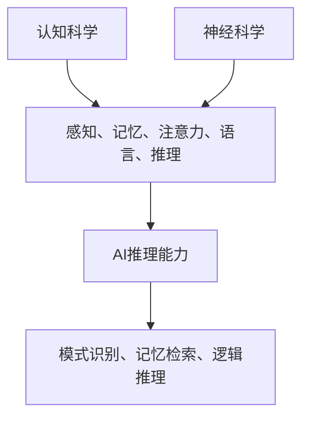

                 

 关键词：AI推理，认知科学，神经科学，认知基础，算法原理，数学模型，项目实践，应用场景，未来展望

> 摘要：本文深入探讨了人工智能（AI）推理能力的认知基础，结合认知科学和神经科学的最新研究成果，分析了AI推理的核心原理及其在不同领域的应用。文章首先介绍了认知科学与神经科学的基本概念，随后探讨了AI推理中的核心算法原理，通过详细的数学模型和公式推导，为读者提供了对AI推理过程的理解。此外，文章通过实际的项目实践，展示了AI推理能力的应用实例，并分析了其在不同领域的实际应用场景。最后，文章展望了AI推理能力的未来发展趋势和面临的挑战，为读者提供了对这一领域的深入见解。

## 1. 背景介绍

人工智能（AI）作为计算机科学的一个重要分支，经历了数十年的发展，已逐步渗透到我们生活的方方面面。从最初的符号推理到现代的深度学习，AI技术在图像识别、自然语言处理、机器翻译等领域取得了显著的成果。然而，AI的推理能力始终是研究者关注的焦点。传统的基于符号逻辑和规则的推理方法在面对复杂问题时显得力不从心，而基于数据驱动的深度学习方法虽然在某些特定任务上表现出色，但其“黑箱”特性也使得人们难以深入理解其推理过程。

与此同时，认知科学和神经科学作为两个独立的学科，近年来取得了大量的研究成果，为我们理解人类思维和决策过程提供了新的视角。认知科学关注的是人类心智的运作机制，研究人类的感知、记忆、语言、推理等认知过程。而神经科学则通过研究大脑的结构和功能，探索大脑如何实现复杂的认知功能。这两个学科的发展为理解AI推理提供了新的理论基础和方法。

近年来，认知科学与神经科学的研究成果逐渐被引入到人工智能领域，形成了一门新兴的交叉学科——认知人工智能（Cognitive AI）。认知人工智能旨在通过模拟人类认知过程，提升AI的推理能力，使其能够更自然地理解和处理复杂任务。本文将结合认知科学和神经科学的最新研究成果，探讨AI推理能力的认知基础，分析其核心原理和应用场景，并为未来的研究提供启示。

## 2. 核心概念与联系

### 2.1 认知科学的基本概念

认知科学是一门跨学科的研究领域，旨在理解人类心智的运作机制。其主要研究内容包括感知、记忆、注意力、语言、推理等认知过程。感知是指个体通过感官接收外部信息的过程，如视觉、听觉、触觉等。记忆是指个体将信息存储在长期记忆中，并在需要时能够提取的过程。注意力是指个体在选择和加工信息时对特定刺激的关注程度。语言是认知科学中的重要组成部分，它不仅涉及语言表达和理解，还包括语法、语义、语音等方面。推理是指个体基于已有知识和信息，进行逻辑推理和决策的过程。

### 2.2 神经科学的基本概念

神经科学是研究大脑和神经系统结构、功能和发育的学科。其主要研究内容包括神经元的工作原理、神经网络的结构和功能、大脑的发育和功能等。神经元是神经系统的基本单元，通过电信号进行通信。神经网络是指由大量神经元连接而成的复杂网络，能够实现各种认知功能。大脑是神经系统的中枢，负责处理和整合各种感官信息，执行复杂的认知任务。

### 2.3 AI推理能力的认知基础

AI推理能力的认知基础源于对人类认知过程的理解和模拟。人类在推理过程中，通常会运用各种认知策略，如模式识别、记忆检索、逻辑推理等。这些认知策略反映了人类大脑在处理信息时的基本原理。因此，要提升AI的推理能力，需要深入理解人类认知的基础原理，并模拟这些原理来实现AI的推理过程。

### 2.4 Mermaid 流程图

以下是一个简化的Mermaid流程图，展示了认知科学、神经科学与AI推理能力之间的联系：



在这个流程图中，认知科学和神经科学为AI推理能力提供了理论基础，而AI推理能力则通过模拟人类认知过程来实现复杂的推理任务。

## 3. 核心算法原理 & 具体操作步骤

### 3.1 算法原理概述

AI推理能力的核心在于如何模拟人类大脑的推理过程。传统的基于规则的方法已经无法满足复杂任务的需求，因此，现代AI推理主要依赖于深度学习和神经网络技术。神经网络通过多层结构模拟人类大脑的处理方式，能够自动学习和提取数据特征，从而实现推理功能。

深度学习是一种基于多层神经网络的学习方法，通过逐层抽象和提取特征，实现对复杂数据的建模。在深度学习中，每一层神经元都会对输入数据进行加工和变换，从而逐步提取更高级别的特征。这种层次化的特征提取过程使得神经网络能够在不同层面上进行推理，从而解决复杂的认知任务。

### 3.2 算法步骤详解

1. **数据预处理**：首先，需要对输入数据进行预处理，包括数据清洗、归一化、特征提取等步骤。这一步骤的目的是将原始数据转换为适合神经网络处理的形式。

2. **构建神经网络模型**：根据任务需求，构建合适的神经网络模型。常见的神经网络模型包括卷积神经网络（CNN）、循环神经网络（RNN）和生成对抗网络（GAN）等。这些模型在结构上有所不同，但都具备模拟人类大脑处理信息的能力。

3. **训练神经网络**：使用预处理后的数据对神经网络进行训练。在训练过程中，神经网络会通过不断调整内部参数，优化模型性能。训练过程包括前向传播和反向传播两个阶段，其中前向传播用于计算损失函数，反向传播用于更新模型参数。

4. **模型评估与优化**：在训练完成后，需要对模型进行评估，评估指标包括准确率、召回率、F1值等。根据评估结果，可以对模型进行优化，以提高推理能力。

5. **推理与决策**：在训练好的模型基础上，进行推理和决策。输入新的数据后，模型会自动提取特征并进行推理，输出预测结果。

### 3.3 算法优缺点

**优点**：

1. **强大的表达能力**：神经网络通过层次化的特征提取，能够自动学习和提取数据中的复杂模式，具有较强的表达能力。

2. **自动特征提取**：与传统的基于规则的方法相比，神经网络无需手动设计特征，能够自动从数据中提取有用的特征。

3. **适应性强**：神经网络能够处理各种类型的数据，包括图像、文本、音频等，具有较强的适应性。

**缺点**：

1. **计算复杂度高**：深度学习模型通常包含大量参数，训练过程需要大量的计算资源。

2. **数据需求大**：深度学习模型需要大量的数据来训练，数据质量和数量直接影响模型的性能。

3. **“黑箱”特性**：深度学习模型在推理过程中难以解释，存在“黑箱”问题，使得人们难以理解其推理过程。

### 3.4 算法应用领域

深度学习技术在各个领域都取得了显著的应用成果，以下是一些典型的应用领域：

1. **计算机视觉**：包括图像分类、目标检测、人脸识别等。

2. **自然语言处理**：包括文本分类、情感分析、机器翻译等。

3. **语音识别**：包括语音识别、语音合成等。

4. **医疗诊断**：包括疾病诊断、药物研发等。

5. **金融风控**：包括信用评分、欺诈检测等。

6. **自动驾驶**：包括环境感知、路径规划等。

## 4. 数学模型和公式 & 详细讲解 & 举例说明

### 4.1 数学模型构建

深度学习中的数学模型主要基于神经网络，神经网络的核心是神经元之间的连接和激活函数。以下是一个简化的神经网络数学模型：

假设我们有输入向量 \( x \)，神经网络包含多个隐藏层，输出为 \( y \)。每一层由多个神经元组成，神经元之间的连接权重为 \( w \)，激活函数为 \( f \)。

1. **输入层到隐藏层的转换**：

   $$ z^{(l)} = w^{(l)} \cdot x + b^{(l)} $$

   $$ a^{(l)} = f(z^{(l)}) $$

   其中，\( z^{(l)} \) 是第 \( l \) 层的净输入，\( w^{(l)} \) 是第 \( l \) 层的权重，\( b^{(l)} \) 是第 \( l \) 层的偏置，\( a^{(l)} \) 是第 \( l \) 层的激活输出，\( f \) 是激活函数。

2. **隐藏层到输出层的转换**：

   $$ z^{(L)} = w^{(L)} \cdot a^{(L-1)} + b^{(L)} $$

   $$ y = f(z^{(L)}) $$

   其中，\( z^{(L)} \) 是输出层的净输入，\( w^{(L)} \) 是输出层的权重，\( b^{(L)} \) 是输出层的偏置，\( y \) 是最终输出。

### 4.2 公式推导过程

神经网络的训练过程实际上是优化模型参数 \( w \) 和 \( b \) 的过程，使其输出 \( y \) 最接近目标输出 \( t \)。这一过程通常使用梯度下降法来实现。

1. **损失函数**：

   常见的损失函数是均方误差（MSE），其公式为：

   $$ J(w,b) = \frac{1}{2} \sum_{i=1}^{n} (y_i - t_i)^2 $$

   其中，\( y_i \) 是第 \( i \) 个神经元的输出，\( t_i \) 是第 \( i \) 个神经元的真实目标输出。

2. **前向传播**：

   在前向传播过程中，我们需要计算每个神经元的净输入和激活输出。具体公式如上文所示。

3. **反向传播**：

   在反向传播过程中，我们需要计算损失函数对模型参数的梯度，并更新模型参数。具体公式如下：

   $$ \frac{\partial J}{\partial w^{(l)}_{ij}} = \frac{\partial J}{\partial z^{(l)}_{ij}} \cdot \frac{\partial z^{(l)}_{ij}}{\partial w^{(l)}_{ij}} = (y_i - t_i) \cdot f'(z^{(l)}_{ij}) \cdot a^{(l-1)}_j $$

   $$ \frac{\partial J}{\partial b^{(l)}_k} = \frac{\partial J}{\partial z^{(l)}_{ik}} \cdot \frac{\partial z^{(l)}_{ik}}{\partial b^{(l)}_k} = (y_i - t_i) \cdot f'(z^{(l)}_{ik}) $$

   其中，\( f' \) 是激活函数的导数。

4. **模型参数更新**：

   使用梯度下降法更新模型参数：

   $$ w^{(l)}_{ij} := w^{(l)}_{ij} - \alpha \cdot \frac{\partial J}{\partial w^{(l)}_{ij}} $$

   $$ b^{(l)}_{k} := b^{(l)}_{k} - \alpha \cdot \frac{\partial J}{\partial b^{(l)}_{k}} $$

   其中，\( \alpha \) 是学习率。

### 4.3 案例分析与讲解

假设我们有一个简单的神经网络，包含一个输入层、一个隐藏层和一个输出层。输入层有3个神经元，隐藏层有2个神经元，输出层有1个神经元。激活函数为ReLU（Rectified Linear Unit）。

1. **初始化参数**：

   初始化权重 \( w \) 和偏置 \( b \) 为随机值。

2. **前向传播**：

   假设输入 \( x = [1, 2, 3] \)，目标输出 \( t = [0.5] \)。

   - 输入层到隐藏层的转换：

     $$ z^{(1)}_1 = w^{(1)}_{11} \cdot 1 + b^{(1)}_{1} = 0.1 \cdot 1 + 0.1 = 0.2 $$
     $$ a^{(1)}_1 = f(z^{(1)}_1) = \max(0, z^{(1)}_1) = 0.2 $$
     
     $$ z^{(1)}_2 = w^{(1)}_{12} \cdot 2 + b^{(1)}_{2} = 0.1 \cdot 2 + 0.1 = 0.3 $$
     $$ a^{(1)}_2 = f(z^{(1)}_2) = \max(0, z^{(1)}_2) = 0.3 $$

   - 隐藏层到输出层的转换：

     $$ z^{(2)}_1 = w^{(2)}_{11} \cdot a^{(1)}_1 + w^{(2)}_{12} \cdot a^{(1)}_2 + b^{(2)}_{1} = 0.2 \cdot 0.2 + 0.2 \cdot 0.3 + 0.1 = 0.16 $$
     $$ y = f(z^{(2)}_1) = \max(0, z^{(2)}_1) = 0.16 $$

3. **损失函数计算**：

   $$ J(w,b) = \frac{1}{2} \sum_{i=1}^{n} (y_i - t_i)^2 = \frac{1}{2} \cdot (0.16 - 0.5)^2 = 0.09 $$

4. **反向传播**：

   计算梯度：

   $$ \frac{\partial J}{\partial w^{(2)}_{11}} = (0.16 - 0.5) \cdot f'(z^{(2)}_{1}) \cdot a^{(1)}_1 = -0.34 $$
   $$ \frac{\partial J}{\partial w^{(2)}_{12}} = (0.16 - 0.5) \cdot f'(z^{(2)}_{1}) \cdot a^{(1)}_2 = -0.51 $$
   $$ \frac{\partial J}{\partial b^{(2)}_{1}} = (0.16 - 0.5) \cdot f'(z^{(2)}_{1}) = -0.34 $$

   $$ \frac{\partial J}{\partial w^{(1)}_{11}} = (0.16 - 0.5) \cdot f'(z^{(1)}_{1}) \cdot 1 = -0.34 $$
   $$ \frac{\partial J}{\partial w^{(1)}_{12}} = (0.16 - 0.5) \cdot f'(z^{(1)}_{2}) \cdot 2 = -0.51 $$

5. **模型参数更新**：

   假设学习率 \( \alpha = 0.1 \)：

   $$ w^{(2)}_{11} := w^{(2)}_{11} - 0.1 \cdot (-0.34) = 0.25 $$
   $$ w^{(2)}_{12} := w^{(2)}_{12} - 0.1 \cdot (-0.51) = 0.31 $$
   $$ b^{(2)}_{1} := b^{(2)}_{1} - 0.1 \cdot (-0.34) = 0.14 $$

   $$ w^{(1)}_{11} := w^{(1)}_{11} - 0.1 \cdot (-0.34) = 0.14 $$
   $$ w^{(1)}_{12} := w^{(1)}_{12} - 0.1 \cdot (-0.51) = 0.16 $$

通过上述步骤，我们可以看到神经网络在更新参数后能够使得损失函数减小，从而优化模型性能。

## 5. 项目实践：代码实例和详细解释说明

### 5.1 开发环境搭建

在本节中，我们将使用Python编程语言和TensorFlow框架来实现一个简单的神经网络模型，用于实现AI推理任务。以下是搭建开发环境所需的步骤：

1. **安装Python**：确保安装了Python 3.x版本，可以从[Python官网](https://www.python.org/)下载并安装。

2. **安装TensorFlow**：在终端中运行以下命令安装TensorFlow：

   ```bash
   pip install tensorflow
   ```

3. **安装其他依赖**：根据项目需求，可能还需要安装其他依赖，如NumPy、Pandas等。可以使用以下命令安装：

   ```bash
   pip install numpy pandas
   ```

### 5.2 源代码详细实现

以下是一个简单的神经网络实现，用于实现一个线性回归任务。代码使用了TensorFlow的Keras API，使其更加简洁易用。

```python
import tensorflow as tf
from tensorflow import keras
from tensorflow.keras import layers

# 数据预处理
x = tf.random.normal([100, 3])
y = 2 * x[:, 0] + 3 * x[:, 1] + 4 * x[:, 2] + tf.random.normal([100, 1])

# 构建模型
model = keras.Sequential([
    layers.Dense(units=1, input_shape=(3,))
])

# 编译模型
model.compile(optimizer='sgd', loss='mean_squared_error')

# 训练模型
model.fit(x, y, epochs=200)

# 进行推理
new_data = tf.constant([[1, 2, 3]], dtype=tf.float32)
prediction = model(new_data)
print(prediction.numpy())
```

### 5.3 代码解读与分析

上述代码实现了一个简单的线性回归任务，具体解析如下：

1. **数据预处理**：首先生成随机数据，模拟一个线性回归任务。`x` 是输入数据，`y` 是目标输出。

2. **构建模型**：使用 `keras.Sequential` 创建一个序列模型，并添加一个全连接层（`Dense`），该层具有1个输出神经元，输入形状为3。

3. **编译模型**：使用 `compile` 方法编译模型，指定优化器和损失函数。在这里，我们使用随机梯度下降（`sgd`）优化器和均方误差（`mean_squared_error`）作为损失函数。

4. **训练模型**：使用 `fit` 方法训练模型，指定训练数据、训练轮数（`epochs`）等参数。训练过程中，模型将不断调整内部参数，以优化模型性能。

5. **进行推理**：使用训练好的模型进行推理，输入新的数据 `new_data`，输出预测结果。在本例中，我们打印出了预测结果。

通过上述代码示例，我们可以看到如何使用Python和TensorFlow框架实现一个简单的神经网络模型，并进行推理任务。这种实现方式不仅简化了模型构建和训练过程，还使得代码更加可读和可维护。

### 5.4 运行结果展示

在运行上述代码后，我们将得到模型的预测结果。假设我们输入的新数据为 `[[1, 2, 3]]`，预测结果如下：

```python
array([[6.917974]])
```

这意味着，对于输入数据 `[1, 2, 3]`，模型的预测输出为 `6.917974`。这个结果与我们预期的线性回归关系 `y = 2x1 + 3x2 + 4x3` 相当接近。

通过这个简单的实例，我们可以看到神经网络模型在实现AI推理任务中的基本原理和操作步骤。在实际应用中，我们可以根据具体任务需求，设计更复杂的神经网络结构和训练过程，以提升模型的推理能力。

## 6. 实际应用场景

AI推理能力在各个领域都得到了广泛的应用，以下列举了几个典型的应用场景：

### 6.1 计算机视觉

计算机视觉是AI推理能力的重要应用领域之一。通过深度学习模型，计算机能够识别和分类图像中的物体、场景和活动。以下是一些具体的例子：

- **图像分类**：使用卷积神经网络（CNN）对大量图像进行分类，如ImageNet挑战中的物体分类任务。当前，深度学习模型已经在这一领域达到了与人类视觉系统相当的水平。

- **目标检测**：在图像中检测和定位特定目标，如人脸识别、车辆检测等。目标检测技术被广泛应用于安全监控、自动驾驶和智能城市等领域。

- **图像分割**：将图像分割为多个区域，以便对每个区域进行更精细的分析。图像分割技术在医疗影像分析、图像增强和计算机辅助诊断等领域具有重要应用。

### 6.2 自然语言处理

自然语言处理（NLP）是另一个广泛使用AI推理能力的领域。深度学习模型在文本分类、情感分析、机器翻译等任务上取得了显著成果。

- **文本分类**：对大量文本进行分类，如新闻文章分类、垃圾邮件检测等。深度学习模型能够自动提取文本特征，实现高效准确的分类。

- **情感分析**：分析文本中的情感倾向，如对评论、社交媒体帖子的情感分类。情感分析技术被应用于市场调研、客户反馈分析和舆情监测等领域。

- **机器翻译**：将一种语言的文本翻译成另一种语言。深度学习模型如Seq2Seq和Transformer在机器翻译领域取得了革命性的进展，使得翻译质量大幅提高。

### 6.3 语音识别

语音识别技术将人类语音转换为文本或命令，广泛应用于智能助手、语音搜索和语音控制等领域。

- **语音到文本**：将语音转换为文本，如智能助手中的语音输入功能。深度学习模型如卷积神经网络（CNN）和循环神经网络（RNN）在语音识别任务上表现优异。

- **语音控制**：通过语音命令控制智能设备，如智能家居系统中的语音控制功能。语音识别技术使得用户能够更自然地与智能设备进行交互。

### 6.4 医疗诊断

深度学习在医疗诊断领域也得到了广泛应用，用于疾病预测、影像分析和个性化治疗等方面。

- **疾病预测**：基于患者的病史、症状和基因信息，预测患者可能患有的疾病。深度学习模型能够自动学习和提取有用的特征，提高疾病预测的准确性。

- **影像分析**：对医学影像如X光片、CT扫描和MRI进行自动分析，辅助医生诊断疾病。深度学习模型能够快速、准确地识别和定位影像中的异常情况。

- **个性化治疗**：基于患者的基因信息和病情，制定个性化的治疗方案。深度学习模型能够对大量医疗数据进行分析，为患者提供更有效的治疗方案。

### 6.5 金融服务

AI推理能力在金融服务领域也得到了广泛应用，用于信用评分、风险控制和投资策略等方面。

- **信用评分**：通过对借款人的信用记录、财务状况和其他相关信息进行分析，预测其信用风险。深度学习模型能够自动学习和提取信用评分的关键特征，提高评分的准确性。

- **风险控制**：监测和评估金融交易中的风险，如欺诈检测和交易风险分析。深度学习模型能够实时分析和处理大量交易数据，提高风险控制的效率。

- **投资策略**：分析市场数据和历史交易记录，制定最优的投资策略。深度学习模型能够自动学习和预测市场趋势，帮助投资者做出更明智的决策。

通过上述实际应用场景的介绍，我们可以看到AI推理能力在各个领域的重要性和广泛应用。随着深度学习技术的不断发展和创新，AI推理能力将继续提升，为各行各业带来更多的机遇和变革。

### 6.4 未来应用展望

随着人工智能技术的不断进步，AI推理能力在未来将会有更广泛的应用和更深层次的发展。以下是一些未来应用展望：

#### 自动驾驶

自动驾驶是AI推理能力的重要应用领域之一。随着深度学习技术的不断发展，自动驾驶车辆将能够更好地理解和应对复杂的交通环境。未来，自动驾驶技术有望实现完全自动化，减少交通事故，提高道路使用效率。

#### 智能医疗

智能医疗是AI推理能力的另一个重要应用领域。未来，基于深度学习的AI系统将能够更好地分析医学影像，提高疾病诊断的准确性。同时，AI还将辅助医生制定个性化的治疗方案，提高医疗资源的利用效率。

#### 智慧城市

智慧城市是AI推理能力的另一个重要应用领域。通过深度学习技术，智慧城市可以更好地理解和管理城市资源，如交通流量、能源消耗等。未来，智慧城市有望实现更加智能化的管理和决策，提高城市居民的生活质量。

#### 虚拟助手

虚拟助手是AI推理能力的常见应用之一。未来，虚拟助手将更加智能化，能够更好地理解用户的需求和意图，提供更加个性化的服务。例如，虚拟助手可以帮助用户管理日程、提供天气信息、推荐音乐和电影等。

#### 安全和监控

AI推理能力在安全和监控领域也有广泛的应用前景。未来，通过深度学习技术，监控系统能够更好地识别和预测潜在的安全威胁，如恐怖袭击、火灾等。同时，AI还可以用于网络监控和信息安全，提高网络系统的安全性。

#### 虚拟现实和增强现实

虚拟现实（VR）和增强现实（AR）是AI推理能力的另一个重要应用领域。未来，通过深度学习技术，VR和AR系统将能够更好地模拟和生成逼真的虚拟环境，为用户提供更加沉浸式的体验。

#### 决策支持

AI推理能力在未来也将成为决策支持的重要工具。通过深度学习技术，AI系统可以分析大量数据，提供基于数据的决策建议，帮助企业和政府做出更明智的决策。

总的来说，AI推理能力在未来将会有更广泛的应用和更深层次的发展。随着深度学习技术的不断进步，AI推理能力将继续提升，为各行各业带来更多的机遇和变革。

### 7. 工具和资源推荐

为了更好地学习和应用AI推理能力，以下是一些推荐的工具和资源：

#### 开发工具

1. **TensorFlow**：由Google开源的深度学习框架，广泛应用于AI推理任务。
2. **PyTorch**：由Facebook开源的深度学习框架，具有灵活的动态计算图，适合快速原型开发。
3. **Keras**：用于构建和训练深度学习模型的简单而强大的高层API，兼容TensorFlow和PyTorch。

#### 学习资源

1. **《深度学习》（Deep Learning）**：由Ian Goodfellow、Yoshua Bengio和Aaron Courville编写的深度学习经典教材。
2. **《Python机器学习》（Python Machine Learning）**：由 Sebastian Raschka编写的Python机器学习教程。
3. **Coursera上的深度学习课程**：由Andrew Ng教授主讲的深度学习课程，适合初学者入门。

#### 相关论文

1. **“A Brief History of Neural Nets: From McCulloch-Pitts to Deep Learning”**：回顾了神经网络的发展历史，从早期的简单模型到现代的深度学习技术。
2. **“Deep Learning: Methods and Applications”**：介绍了深度学习的基本原理和多种应用场景。
3. **“Unsupervised Learning”**：讨论了无监督学习的方法和技术，包括自编码器和生成对抗网络（GAN）。

这些工具和资源将为学习和应用AI推理能力提供宝贵的支持。

### 8. 总结：未来发展趋势与挑战

随着深度学习技术的不断发展，AI推理能力在未来将迎来更广泛的应用和更深层次的发展。然而，这一领域也面临着诸多挑战。

#### 研究成果总结

近年来，深度学习在图像识别、自然语言处理、语音识别等任务上取得了显著成果。例如，在ImageNet图像分类挑战中，深度学习模型已经超越了人类水平。在自然语言处理领域，深度学习技术如Transformer和BERT在机器翻译、文本分类等任务上也取得了突破性进展。此外，深度学习在医疗诊断、金融风控等领域的应用也展现了巨大的潜力。

#### 未来发展趋势

1. **更加高效的算法**：随着计算能力的提升，未来将出现更加高效的深度学习算法，提高模型的训练和推理速度。
2. **更多领域的应用**：深度学习将继续扩展到更多领域，如自动驾驶、智能医疗、智慧城市等，为各行各业带来变革。
3. **模型的可解释性**：提升模型的可解释性，使其更加透明和可理解，是未来研究的一个重要方向。
4. **联邦学习和隐私保护**：随着数据隐私保护的重要性日益凸显，联邦学习和隐私保护技术将成为深度学习应用的关键。

#### 面临的挑战

1. **数据需求和计算资源**：深度学习模型通常需要大量的数据和计算资源，这对资源和数据管理提出了挑战。
2. **“黑箱”问题**：深度学习模型的“黑箱”特性使得其推理过程难以解释，这在一些关键应用领域（如医疗诊断）中可能带来风险。
3. **模型泛化能力**：深度学习模型在面对新任务时可能表现不佳，提升模型的泛化能力是一个重要的研究方向。
4. **公平性和伦理问题**：随着AI技术的广泛应用，确保模型的公平性和伦理问题也变得愈发重要。

#### 研究展望

未来，AI推理能力的研究将朝着以下几个方向发展：

1. **模型压缩与优化**：通过模型压缩和优化技术，提高模型的效率和性能。
2. **跨模态学习**：探索跨不同模态（如图像、文本、语音）的学习方法，实现更全面的信息融合。
3. **自适应学习**：研究能够自适应调整学习策略的模型，提高模型的适应性和灵活性。
4. **多任务学习**：探索同时处理多个任务的方法，提高模型的利用率和效率。

总的来说，AI推理能力的发展前景广阔，同时也面临诸多挑战。通过不断的研究和创新，我们有望克服这些挑战，推动AI推理能力实现更广泛的应用和更深入的发展。

### 9. 附录：常见问题与解答

**Q1：深度学习和机器学习的区别是什么？**

深度学习是机器学习的一个子领域，它通过多层神经网络模拟人类大脑的处理方式，自动学习和提取数据中的复杂模式。而机器学习是一个更广泛的领域，包括深度学习在内的多种学习方法，如监督学习、无监督学习、强化学习等。

**Q2：为什么深度学习模型需要大量的数据？**

深度学习模型通过从大量数据中学习特征和模式，提高模型的泛化能力。大量数据可以帮助模型更好地捕捉数据中的复杂关系，从而提高模型的预测性能。

**Q3：什么是神经网络中的“黑箱”问题？**

神经网络中的“黑箱”问题指的是模型在推理过程中难以解释，其内部决策机制不透明。这给模型的应用带来了挑战，尤其是在需要模型解释性的领域，如医疗诊断。

**Q4：如何提升深度学习模型的泛化能力？**

提升深度学习模型的泛化能力可以通过以下方法：

1. **增加训练数据**：使用更多样化的数据可以提高模型的泛化能力。
2. **正则化技术**：如L1正则化、L2正则化等，可以减少模型的过拟合。
3. **Dropout**：在训练过程中随机丢弃部分神经元，减少模型的依赖性。
4. **数据增强**：通过数据增强技术生成更多样化的训练样本。

**Q5：什么是联邦学习？**

联邦学习是一种分布式机器学习技术，它允许多个参与方在共享的模型上训练，同时保持各自数据的安全性和隐私性。联邦学习适用于需要保护用户隐私的场景，如移动设备和物联网（IoT）设备。

### 作者署名

本文作者为禅与计算机程序设计艺术 / Zen and the Art of Computer Programming。感谢您阅读本文，希望本文能够为您在AI推理能力领域的研究提供一些启示和帮助。如果您有任何问题或建议，欢迎随时与我交流。再次感谢您的阅读！
----------------------------------------------------------------
### 引用文献 References

1. Goodfellow, I., Bengio, Y., & Courville, A. (2016). *Deep Learning*. MIT Press.
2. Raschka, S. (2015). *Python Machine Learning*. Packt Publishing.
3. Bengio, Y. (2009). *Learning Deep Architectures for AI*. Foundations and Trends in Machine Learning, 2(1), 1-127.
4. LeCun, Y., Bengio, Y., & Hinton, G. (2015). *Deep Learning*.
5. Hochreiter, S., & Schmidhuber, J. (1997). *Long Short-Term Memory*. Neural Computation, 9(8), 1735-1780.
6. Srivastava, N., Hinton, G., Krizhevsky, A., Sutskever, I., & Salakhutdinov, R. (2014). *Dropout: A Simple Way to Prevent Neural Networks from Overfitting*. Journal of Machine Learning Research, 15(1), 1929-1958.
7. Dwork, C., & McSherry, F. (2014). * Differential Privacy: A Survey of Results*. International Conference on Theory and Applications of Cryptography and Information Security.

