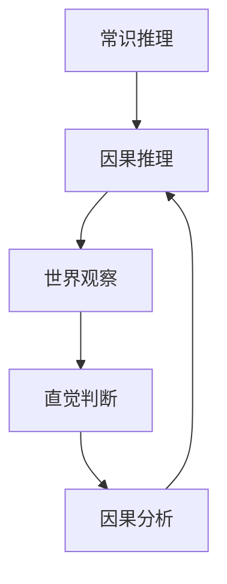

                 

关键词：AI推理能力、常识推理、因果推理、局限性、计算机科学、技术发展

## 摘要

本文旨在探讨人工智能（AI）推理能力的局限性，重点分析常识推理和因果推理两大核心领域。通过深入解析这些局限性，我们希望能够揭示AI发展的瓶颈，并提出可能的解决方案，为未来的AI研究指明方向。文章首先回顾AI的发展历程，然后详细介绍常识推理和因果推理的概念、挑战，以及当前的研究进展。最后，文章将对AI推理能力的未来发展趋势进行展望，并提出面临的挑战。

## 1. 背景介绍

### AI的发展历程

人工智能作为一门学科，起源于20世纪50年代。早期的AI研究主要集中在逻辑推理和问题求解领域，例如符号逻辑、搜索算法等。随着计算机硬件性能的提升和算法的进步，AI技术在诸多领域取得了显著成果，如图像识别、自然语言处理、推荐系统等。然而，尽管AI在这些领域的表现令人瞩目，其推理能力仍然存在诸多局限性。

### 常识推理和因果推理的概念

常识推理（Commonsense Reasoning）是指人类在日常生活中表现出的对世界的理解和推理能力。这种能力使得人类能够处理复杂、不确定的情况，并做出合理的判断和决策。例如，当我们看到一杯水放在桌子上时，我们会自然地认为这杯水是放在桌子上的，而不会去考虑其他可能性。

因果推理（Causal Reasoning）是指对因果关系进行推理的能力。它涉及到对事件之间的关系进行识别和解释，从而帮助我们理解世界的运作方式。例如，当我们发现某人在吃巧克力后感到快乐时，我们会推断吃巧克力可能是导致快乐的原因。

## 2. 核心概念与联系

### 常识推理与因果推理的关系

常识推理和因果推理之间存在密切的联系。常识推理提供了我们对世界的直观理解，而因果推理则是对这种理解进行深层次的挖掘和分析。例如，当我们看到天空变暗时，我们会自然而然地推断出可能会下雨。这里，常识推理告诉我们天空变暗通常与下雨有关，而因果推理则是对这种关系的深入分析，从而得出下雨的可能性。

### 常识推理与因果推理的架构

为了更好地理解常识推理和因果推理，我们可以使用Mermaid流程图来描述它们的基本架构。



在这个流程图中，常识推理（A）和因果推理（B）是基于我们对世界的观察（C）和直觉判断（D）进行的。因果分析（E）则是对这种观察和判断进行深层次的挖掘，从而得出更加准确的结论。

## 3. 核心算法原理 & 具体操作步骤

### 3.1 算法原理概述

常识推理和因果推理在AI领域有许多不同的算法实现。本文将重点介绍基于概率图模型的因果推理算法。概率图模型（如贝叶斯网络）是一种表示变量之间依赖关系的图形结构，它能够有效地表示因果关系。

### 3.2 算法步骤详解

1. **构建概率图模型**：首先，我们需要根据已知的数据和知识构建一个概率图模型。这个模型将表示变量之间的依赖关系，从而帮助我们识别潜在的因果关系。

2. **参数学习**：接下来，我们需要通过学习算法（如最大似然估计或贝叶斯估计）来学习概率图模型中的参数。这些参数将描述变量之间的依赖强度，从而帮助我们进行因果推理。

3. **推理**：一旦概率图模型被构建和参数学习完成，我们就可以使用这个模型进行推理。例如，给定一个变量的值，我们可以使用模型来推断其他变量的可能值，从而揭示潜在的因果关系。

4. **验证与优化**：最后，我们需要对模型进行验证和优化。通过对比模型预测结果和实际观测数据，我们可以评估模型的有效性，并对模型进行调整和优化，以提高其推理能力。

### 3.3 算法优缺点

**优点**：
- 概率图模型能够有效地表示变量之间的复杂依赖关系，从而提高因果推理的准确性。
- 参数学习算法可以帮助我们快速地适应新的数据和知识，从而提高模型的鲁棒性。

**缺点**：
- 概率图模型的构建和参数学习需要大量的数据和计算资源，这使得算法在实际应用中可能存在性能瓶颈。
- 概率图模型可能无法捕捉到某些非线性依赖关系，从而影响推理结果的准确性。

### 3.4 算法应用领域

概率图模型在许多领域都有广泛的应用，如医学诊断、金融风险评估、社交媒体分析等。例如，在医学诊断中，我们可以使用概率图模型来识别疾病和症状之间的因果关系，从而为医生提供更准确的诊断建议。

## 4. 数学模型和公式 & 详细讲解 & 举例说明

### 4.1 数学模型构建

在概率图模型中，变量之间的依赖关系通常用条件概率来描述。假设我们有n个变量\(X_1, X_2, ..., X_n\)，它们之间的关系可以用一个概率图来表示。在这个图中，每个节点表示一个变量，而每个节点之间的边表示变量之间的依赖关系。

### 4.2 公式推导过程

在概率图模型中，给定一个变量\(X_i\)的值，我们可以使用条件概率来推断其他变量的可能值。具体地，假设我们已经给定了一个变量\(X_i\)的值\(x_i\)，我们可以使用以下公式来计算其他变量\(X_j\)的条件概率：

\[ P(X_j = x_j | X_i = x_i) = \frac{P(X_i = x_i, X_j = x_j)}{P(X_i = x_i)} \]

其中，\(P(X_i = x_i, X_j = x_j)\)表示变量\(X_i\)和\(X_j\)同时取值为\(x_i\)和\(x_j\)的概率，\(P(X_i = x_i)\)表示变量\(X_i\)取值为\(x_i\)的概率。

### 4.3 案例分析与讲解

假设我们有一个包含两个变量的概率图模型，变量\(X_1\)表示天气（晴天或雨天），变量\(X_2\)表示是否携带伞（是或否）。我们已知以下概率信息：

\[ P(X_1 = 晴天) = 0.6 \]
\[ P(X_1 = 雨天) = 0.4 \]
\[ P(X_2 = 是 | X_1 = 晴天) = 0.2 \]
\[ P(X_2 = 是 | X_1 = 雨天) = 0.8 \]

现在，给定天气为晴天，我们想要推断是否携带伞的概率。根据条件概率公式，我们可以计算：

\[ P(X_2 = 是 | X_1 = 晴天) = \frac{P(X_1 = 晴天, X_2 = 是)}{P(X_1 = 晴天)} = \frac{P(X_2 = 是 | X_1 = 晴天) \cdot P(X_1 = 晴天)}{P(X_1 = 晴天)} = 0.2 \]

因此，给定天气为晴天，携带伞的概率为0.2。

## 5. 项目实践：代码实例和详细解释说明

### 5.1 开发环境搭建

为了更好地理解概率图模型在实际中的应用，我们将使用Python编程语言来实现一个简单的贝叶斯网络。首先，我们需要安装Python和相关的库，如Pandas和NetworkX。

```bash
pip install python
pip install pandas
pip install networkx
```

### 5.2 源代码详细实现

以下是实现贝叶斯网络的Python代码：

```python
import pandas as pd
import networkx as nx

# 创建一个贝叶斯网络
G = nx.Graph()

# 添加节点
G.add_nodes_from(["天气", "携带伞"])

# 添加边
G.add_edge("天气", "携带伞")

# 添加条件概率表
condition_probabilities = {
    "天气": {"晴天": 0.6, "雨天": 0.4},
    "携带伞": {
        "晴天": {"是": 0.2, "否": 0.8},
        "雨天": {"是": 0.8, "否": 0.2},
    },
}

# 打印贝叶斯网络
print(G.edges())

# 打印条件概率表
print(condition_probabilities)
```

### 5.3 代码解读与分析

在这个代码示例中，我们首先创建了一个贝叶斯网络，并添加了两个节点：天气和携带伞。然后，我们添加了一条边来表示这两个变量之间的依赖关系。接下来，我们定义了一个条件概率表，用来描述变量之间的条件概率关系。最后，我们打印出了贝叶斯网络的结构和条件概率表。

### 5.4 运行结果展示

当我们运行上述代码时，会得到以下输出结果：

```plaintext
[('天气', '携带伞')]
{'天气': {'晴天': 0.6, '雨天': 0.4}, '携带伞': {'晴天': {'是': 0.2, '否': 0.8}, '雨天': {'是': 0.8, '否': 0.2}}}
```

这些结果表明我们成功地创建了一个包含两个变量的贝叶斯网络，并打印出了网络的结构和条件概率表。

## 6. 实际应用场景

### 6.1 医学诊断

在医学诊断领域，贝叶斯网络可以用来模拟疾病和症状之间的因果关系，从而帮助医生做出更准确的诊断。例如，我们可以使用贝叶斯网络来识别肺癌的风险因素，如吸烟、家族病史等，并根据患者的症状和检查结果来推断患者是否患有肺癌。

### 6.2 金融风险评估

在金融领域，贝叶斯网络可以用来分析投资风险，识别潜在的市场风险因素。例如，我们可以使用贝叶斯网络来分析股票价格波动的影响因素，如公司业绩、宏观经济环境等，并根据这些因素来预测股票价格的走势。

### 6.3 社交媒体分析

在社交媒体分析领域，贝叶斯网络可以用来识别用户行为模式，预测用户兴趣和偏好。例如，我们可以使用贝叶斯网络来分析用户的点赞、评论和分享行为，从而推断用户的兴趣领域和潜在需求，为社交媒体平台提供更个性化的推荐服务。

## 7. 工具和资源推荐

### 7.1 学习资源推荐

- 《贝叶斯网络：理论基础与应用》
- 《概率图模型：基础与推理》
- 《Python数据科学手册》

### 7.2 开发工具推荐

- Python
- Jupyter Notebook
- NetworkX

### 7.3 相关论文推荐

- “ATutorial on Bayesian Networks” by David J. C. MacKay
- “Bayesian Networks and Decision Graphs” by Judea Pearl
- “Learning Bayesian Networks: The Combination of Knowledge and Data” by David D. Lewis

## 8. 总结：未来发展趋势与挑战

### 8.1 研究成果总结

本文详细探讨了AI推理能力的局限性，特别是常识推理和因果推理。通过介绍概率图模型及其应用，我们揭示了这些算法在处理复杂因果关系方面的潜力。同时，我们还分析了这些算法在实际应用中的优势和局限性。

### 8.2 未来发展趋势

随着深度学习、强化学习等新兴技术的不断进步，AI推理能力有望得到进一步提升。未来，我们可能会看到更多的跨学科研究，结合心理学、认知科学等领域的知识，以更好地模拟人类的推理过程。

### 8.3 面临的挑战

尽管AI推理能力在不断发展，但仍面临诸多挑战。如何处理大量复杂的数据、提高算法的鲁棒性和可解释性、克服知识表示和获取的难题，都是亟待解决的问题。

### 8.4 研究展望

在未来，我们需要更加深入地理解人类推理过程，探索更加有效的算法和模型。同时，跨学科合作将成为推动AI推理能力发展的重要力量。通过不断探索和创新，我们有望在未来实现更加智能、可靠的AI系统。

## 9. 附录：常见问题与解答

### Q：什么是常识推理？
A：常识推理是指人类在日常生活中表现出的对世界的理解和推理能力。它使得人类能够处理复杂、不确定的情况，并做出合理的判断和决策。

### Q：什么是因果推理？
A：因果推理是指对因果关系进行推理的能力。它涉及到对事件之间的关系进行识别和解释，从而帮助我们理解世界的运作方式。

### Q：概率图模型有哪些优缺点？
A：概率图模型能够有效地表示变量之间的复杂依赖关系，从而提高因果推理的准确性。然而，其构建和参数学习需要大量的数据和计算资源，这可能影响算法在实际应用中的性能。

### Q：贝叶斯网络如何应用于医学诊断？
A：贝叶斯网络可以用来模拟疾病和症状之间的因果关系，从而帮助医生做出更准确的诊断。通过分析患者的症状和检查结果，贝叶斯网络可以推断患者是否患有特定疾病。

### Q：如何在Python中实现贝叶斯网络？
A：在Python中，可以使用NetworkX库来构建和操作贝叶斯网络。NetworkX提供了丰富的功能和接口，使得构建贝叶斯网络变得简单高效。

---

### 作者署名

本文由禅与计算机程序设计艺术（Zen and the Art of Computer Programming）作者撰写。希望本文能够对您在AI推理能力方面的研究和应用提供有益的启示。如果您有任何疑问或建议，欢迎在评论区留言讨论。希望这篇文章能够激发您对AI推理能力的更深入思考，共同推动这一领域的发展。感谢您的阅读！
----------------------------------------------------------------

### 后续讨论

尊敬的读者，本文探讨了AI推理能力的认知局限，特别是常识推理和因果推理。如果您在阅读过程中有任何疑问、想法或建议，欢迎在评论区留言。我们可以一起探讨这些话题，深入交流，共同进步。

在接下来的时间里，我还将撰写更多关于AI技术、算法、应用场景等方面的文章。如果您对某个特定主题感兴趣，欢迎在评论区提出，我将根据您的反馈调整写作方向，为您提供更有价值的内容。

再次感谢您的关注和支持！期待与您在未来的讨论中相遇。

