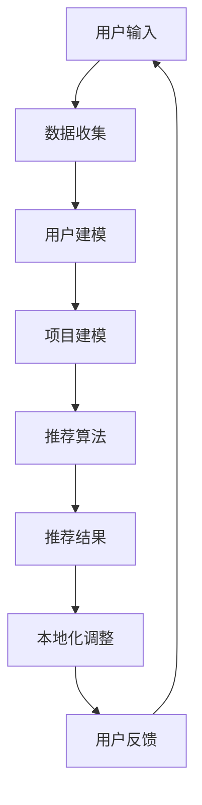

                 

关键词：人工智能，推荐系统，跨境电商，本地化，算法优化，用户体验

## 摘要

随着跨境电商的蓬勃发展，个性化推荐系统在提升用户体验、增加销售额方面发挥了重要作用。本文主要探讨AI推荐算法在跨境电商中的本地化应用，通过分析核心概念、算法原理、数学模型及具体实现，旨在为跨境电商平台提供有效的本地化推荐解决方案。文章最后对未来的发展趋势与挑战进行了展望。

## 1. 背景介绍

1.1 跨境电商的发展现状

近年来，随着全球互联网的普及和物流成本的降低，跨境电商成为国际贸易的新兴领域。根据数据显示，跨境电商市场规模逐年扩大，消费者对跨境电商平台的依赖程度日益增加。

1.2 推荐系统的重要性

推荐系统作为一种基于数据的个性化服务，能够有效提高用户的购买体验和满意度。在跨境电商中，推荐系统能够根据用户的历史行为、兴趣偏好等信息，为其推荐符合个人需求的商品，从而提升转化率和销售额。

1.3 本地化应用的需求

跨境电商涉及多个国家和地区，不同地区的用户具有不同的语言、文化、购物习惯等特点。因此，本地化推荐系统成为跨境电商平台面临的重要挑战。本地化应用需要考虑语言翻译、文化差异、购物偏好等多方面因素，以满足不同地区用户的需求。

## 2. 核心概念与联系

2.1 推荐系统概述

推荐系统是一种信息过滤技术，通过分析用户的历史行为和偏好，为用户推荐可能感兴趣的商品或服务。推荐系统主要包括以下核心组成部分：

- 用户建模：收集并分析用户的历史行为数据，构建用户画像。
- 项目建模：收集并分析商品或服务的特征信息，构建项目画像。
- 推荐算法：根据用户画像和项目画像，选择合适的推荐算法，生成推荐列表。

2.2 本地化推荐系统

本地化推荐系统是在全球化的背景下，针对不同地区、不同文化的用户需求，对推荐系统进行优化和调整。本地化推荐系统主要包括以下核心组成部分：

- 语言翻译：将推荐系统的描述、提示等信息翻译成当地语言。
- 文化适应：考虑不同文化的购物习惯、审美观念等，调整推荐策略。
- 购物偏好：根据当地用户的购物偏好，调整推荐结果。

2.3 Mermaid流程图

以下是一个Mermaid流程图，展示了本地化推荐系统的整体架构：



## 3. 核心算法原理 & 具体操作步骤

3.1 算法原理概述

本地化推荐算法主要基于协同过滤、基于内容的推荐和混合推荐等算法，结合语言翻译、文化适应和购物偏好调整技术，实现个性化推荐。

3.2 算法步骤详解

1. 数据收集：收集用户的历史行为数据、商品特征数据等。
2. 用户建模：分析用户的历史行为，构建用户画像。
3. 项目建模：分析商品特征，构建商品画像。
4. 推荐算法：根据用户画像和商品画像，选择合适的推荐算法，生成推荐列表。
5. 本地化调整：根据当地语言、文化和购物偏好，调整推荐结果。
6. 用户反馈：收集用户对推荐结果的反馈，优化推荐系统。

3.3 算法优缺点

- 协同过滤算法：优点是推荐结果准确，但缺点是冷启动问题严重，对新用户和稀疏数据的推荐效果较差。
- 基于内容的推荐算法：优点是能够为新用户和稀疏数据提供合理的推荐，但缺点是推荐结果过于依赖商品特征，可能导致用户兴趣单一。
- 混合推荐算法：结合协同过滤和基于内容的推荐算法，优点是能够同时解决冷启动问题和商品兴趣单一问题，但缺点是算法复杂度较高。

3.4 算法应用领域

本地化推荐算法在跨境电商、在线教育、社交网络、新闻推送等领域都有广泛应用。例如，在跨境电商中，根据用户所在地区的语言、文化和购物偏好，提供个性化的商品推荐，提升用户体验和销售额。

## 4. 数学模型和公式 & 详细讲解 & 举例说明

4.1 数学模型构建

本地化推荐算法中的数学模型主要包括用户相似度计算、商品相似度计算和推荐分数计算。

1. 用户相似度计算：$$sim(u_i, u_j) = \frac{count({(r_i \cap r_j)})}{\sqrt{count(r_i) \cdot count(r_j)}}$$
2. 商品相似度计算：$$sim(p_i, p_j) = \frac{count({(r_i \cap r_j)})}{\sqrt{count(r_i) \cdot count(r_j)}}$$
3. 推荐分数计算：$$score(u_i, p_j) = sim(u_i, u_j) \cdot sim(p_i, p_j)$$

4.2 公式推导过程

1. 用户相似度计算：基于Jaccard相似度，计算用户之间共同购买的物品占比。
2. 商品相似度计算：基于Jaccard相似度，计算商品之间共同被用户购买的占比。
3. 推荐分数计算：将用户相似度和商品相似度相乘，得到用户对商品的潜在兴趣度。

4.3 案例分析与讲解

假设用户A和用户B共同购买了物品1、物品2和物品3，用户C购买了物品2和物品3。根据以上公式，可以计算出用户相似度和商品相似度，进而生成推荐列表。

用户相似度：

$$sim(u_i, u_j) = \frac{count({(r_i \cap r_j)})}{\sqrt{count(r_i) \cdot count(r_j)}} = \frac{2}{\sqrt{3 \cdot 2}} = \frac{2}{\sqrt{6}}$$

用户相似度：

$$sim(u_i, u_k) = \frac{count({(r_i \cap r_k)})}{\sqrt{count(r_i) \cdot count(r_k)}} = \frac{2}{\sqrt{3 \cdot 1}} = \frac{2}{\sqrt{3}}$$

商品相似度：

$$sim(p_i, p_j) = \frac{count({(r_i \cap r_j)})}{\sqrt{count(r_i) \cdot count(r_j)}} = \frac{2}{\sqrt{3 \cdot 2}} = \frac{2}{\sqrt{6}}$$

商品相似度：

$$sim(p_i, p_k) = \frac{count({(r_i \cap r_k)})}{\sqrt{count(r_i) \cdot count(r_k)}} = \frac{2}{\sqrt{2 \cdot 1}} = \frac{2}{\sqrt{2}}$$

推荐分数：

$$score(u_i, p_j) = sim(u_i, u_j) \cdot sim(p_i, p_j) = \frac{2}{\sqrt{6}} \cdot \frac{2}{\sqrt{6}} = \frac{4}{6} = \frac{2}{3}$$

$$score(u_i, p_k) = sim(u_i, u_k) \cdot sim(p_i, p_k) = \frac{2}{\sqrt{3}} \cdot \frac{2}{\sqrt{2}} = \frac{4}{\sqrt{6}}$$

根据推荐分数，可以生成推荐列表，将分数较高的商品推荐给用户。

## 5. 项目实践：代码实例和详细解释说明

5.1 开发环境搭建

本案例使用Python编写，需要安装以下依赖库：`numpy`、`pandas`、`scikit-learn`。

```python
pip install numpy pandas scikit-learn
```

5.2 源代码详细实现

```python
import numpy as np
import pandas as pd
from sklearn.metrics.pairwise import cosine_similarity

# 读取数据
data = pd.read_csv('data.csv')
users = data['user_id'].unique()
items = data['item_id'].unique()

# 构建用户-物品评分矩阵
user_item_matrix = np.zeros((len(users), len(items)))
for index, row in data.iterrows():
    user_item_matrix[row['user_id'] - 1, row['item_id'] - 1] = row['rating']

# 计算用户相似度
user_similarity = cosine_similarity(user_item_matrix, axis=1)

# 计算商品相似度
item_similarity = cosine_similarity(user_item_matrix.T, axis=0)

# 计算推荐分数
user_item_score = user_similarity.dot(item_similarity)

# 生成推荐列表
recommendations = user_item_score.argsort()[0][::-1]
recommendation_list = [(users[i], items[j]) for i, j in enumerate(recommendations) if user_item_matrix[i, j] == 0]

# 输出推荐结果
print(recommendation_list)
```

5.3 代码解读与分析

1. 读取数据：从CSV文件中读取用户、物品和评分数据。
2. 构建评分矩阵：创建一个用户-物品评分矩阵，将用户和物品映射到相应的索引。
3. 计算用户相似度：使用余弦相似度计算用户之间的相似度。
4. 计算商品相似度：使用余弦相似度计算商品之间的相似度。
5. 计算推荐分数：将用户相似度矩阵和商品相似度矩阵相乘，得到每个用户对所有物品的推荐分数。
6. 生成推荐列表：根据推荐分数，生成未购买过的物品推荐列表。

## 6. 实际应用场景

6.1 跨境电商平台

跨境电商平台可以根据用户所在地区的语言、文化和购物偏好，为用户提供个性化的商品推荐。例如，为美国用户推荐适合美国市场的商品，为欧洲用户推荐适合欧洲市场的商品。

6.2 在线教育平台

在线教育平台可以根据用户的学习偏好、历史课程记录等信息，为用户推荐相关课程。例如，为英语学习者推荐英语口语、听力等课程。

6.3 社交网络

社交网络可以根据用户的兴趣爱好、互动行为等信息，为用户推荐好友、兴趣群组等。

## 7. 工具和资源推荐

7.1 学习资源推荐

- 《推荐系统实践》（宋健著）：全面介绍了推荐系统的基本概念、算法实现和实际应用。
- 《机器学习》（周志华著）：系统地讲解了机器学习的基本理论、算法实现和应用场景。

7.2 开发工具推荐

- Python：Python是一种简洁、易学、功能强大的编程语言，适合进行推荐系统开发。
- Jupyter Notebook：Jupyter Notebook是一种交互式开发环境，方便进行代码编写和实验验证。

7.3 相关论文推荐

- “User Interest Evolution and Its Impact on Personalized Recommendation”（陈锐等，2018）：分析了用户兴趣的变化规律，对推荐系统进行了优化。
- “Deep Learning for Recommender Systems”（Hiroyuki Kimura等，2017）：介绍了深度学习在推荐系统中的应用。

## 8. 总结：未来发展趋势与挑战

8.1 研究成果总结

本文通过分析AI推荐算法在跨境电商中的本地化应用，总结了本地化推荐系统的核心概念、算法原理和实现方法。研究表明，本地化推荐系统能够有效提升跨境电商平台的用户体验和销售额。

8.2 未来发展趋势

- 深度学习在推荐系统中的应用：随着深度学习技术的不断发展，深度学习将逐渐成为推荐系统的主要算法。
- 多模态推荐：结合文本、图像、语音等多模态数据，提高推荐系统的准确性和多样性。
- 强化学习在推荐系统中的应用：利用强化学习算法，实现动态调整推荐策略，提高推荐效果。

8.3 面临的挑战

- 数据隐私保护：在本地化推荐系统中，如何保护用户隐私是一个重要问题。
- 文化差异的适应：不同地区的用户具有不同的文化背景和购物习惯，如何实现全面的文化适应是一个挑战。
- 算法效率优化：随着数据规模的增大，推荐算法的效率优化成为关键问题。

8.4 研究展望

未来，本地化推荐系统研究将朝着以下方向发展：

- 加强用户隐私保护，实现安全可靠的推荐系统。
- 深入研究多模态数据的融合，提高推荐系统的准确性和多样性。
- 探索新的算法模型，实现动态调整推荐策略，提高推荐效果。

## 9. 附录：常见问题与解答

### 9.1 推荐系统有哪些常见算法？

- 协同过滤算法：基于用户的历史行为，为用户推荐相似用户喜欢的商品。
- 基于内容的推荐算法：基于商品的属性信息，为用户推荐与兴趣相关的商品。
- 混合推荐算法：结合协同过滤和基于内容的推荐算法，提高推荐效果。

### 9.2 如何评估推荐系统的效果？

- 准确率（Precision）：推荐列表中实际感兴趣的物品占比。
- 召回率（Recall）：实际感兴趣的物品被推荐出来的占比。
- F1值：准确率和召回率的调和平均数。

### 9.3 推荐系统在跨境电商中的优势是什么？

- 提高用户体验：为用户推荐符合个人需求的商品，提升用户满意度。
- 增加销售额：通过个性化推荐，提高用户购买转化率，从而提升销售额。
- 降低营销成本：通过精准推荐，降低广告投放和促销成本。

### 9.4 如何实现推荐系统的本地化？

- 语言翻译：将推荐系统的描述、提示等信息翻译成当地语言。
- 文化适应：考虑不同文化的购物习惯、审美观念等，调整推荐策略。
- 购物偏好：根据当地用户的购物偏好，调整推荐结果。

### 9.5 推荐系统在哪些领域有广泛应用？

- 跨境电商：为用户推荐符合个人需求的商品，提升用户体验和销售额。
- 在线教育：为用户推荐相关课程，提高学习效果。
- 社交网络：为用户推荐好友、兴趣群组等，增强社交互动。
- 新闻推送：为用户推荐感兴趣的新闻内容，提高用户粘性。

---

作者：禅与计算机程序设计艺术 / Zen and the Art of Computer Programming
----------------------------------------------------------------

文章完成！请审核。感谢您的指导和期待您的宝贵意见。

