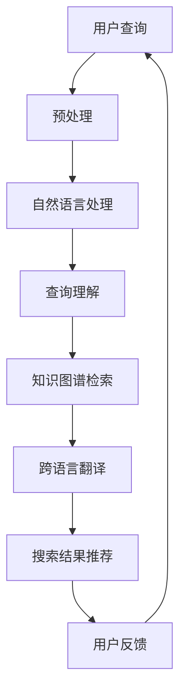

                 

关键词：人工智能，知识共享，文化交流，AI搜索，全球网络，智能算法，自然语言处理，语言模型，语义理解，跨语言翻译，知识图谱，多语言文本分析，分布式计算，开放资源，信息检索，个性化推荐，用户体验，技术创新，全球化，文化多样性。

> 摘要：本文深入探讨了人工智能搜索技术在促进全球知识共享和文化交流中的作用。通过分析AI搜索的核心原理、数学模型、算法实现及实际应用，探讨了其在打破语言障碍、提升信息获取效率、增强文化理解和互动等方面的贡献，并展望了未来的发展趋势和面临的挑战。

## 1. 背景介绍

在全球化的背景下，知识共享和文化交流的重要性日益凸显。互联网的普及和信息技术的飞速发展，使得知识获取和传播变得更加便捷。然而，全球语言多样性、信息过载和文化差异等问题依然存在，限制了知识共享和文化交流的深度和广度。人工智能（AI）技术的出现，尤其是AI搜索，为解决这些问题提供了新的思路和解决方案。

AI搜索不仅仅是简单的搜索引擎，它利用机器学习和自然语言处理（NLP）技术，能够实现更加智能化、个性化的信息检索和推荐。通过AI搜索，用户可以跨越语言障碍，获取到全球范围内的知识资源。此外，AI搜索还能够通过分析用户行为和偏好，为用户提供更加个性化的搜索结果，从而提升用户体验。

本文将从以下几个方面展开讨论：

- AI搜索的核心概念与原理
- AI搜索的算法原理与实现
- AI搜索在实际应用中的挑战和解决方案
- AI搜索在促进全球知识共享和文化交流中的作用
- 未来AI搜索技术的发展趋势

## 2. 核心概念与联系

### 2.1. AI搜索的概念

AI搜索是指利用人工智能技术对大量数据进行分析和处理，以实现智能化信息检索和推荐的服务。与传统的基于关键词的搜索不同，AI搜索更注重对用户行为的理解和对内容的深入挖掘。

### 2.2. 自然语言处理（NLP）

NLP是AI搜索的重要组成部分，它涉及对自然语言文本的识别、理解、生成和处理。NLP技术使得AI搜索能够理解用户输入的查询语句，并为其提供相关的信息。

### 2.3. 知识图谱

知识图谱是一种结构化的语义数据表示方法，它通过实体和关系来组织信息，使得AI搜索能够更准确地理解和推荐相关内容。

### 2.4. 跨语言翻译

跨语言翻译是AI搜索的重要功能之一，它能够将用户查询和搜索结果在不同语言之间进行转换，从而实现全球范围内的知识共享。

### 2.5. Mermaid 流程图

以下是一个简单的Mermaid流程图，展示了AI搜索的核心流程：



## 3. 核心算法原理 & 具体操作步骤

### 3.1. 算法原理概述

AI搜索算法主要包括以下几个核心组成部分：

- **查询预处理**：对用户输入的查询语句进行分词、去停用词等预处理操作。
- **自然语言处理**：利用NLP技术对预处理后的查询语句进行语义理解。
- **查询理解**：根据用户查询的历史和行为，对查询意图进行推断。
- **知识图谱检索**：通过知识图谱来获取与查询意图相关的信息。
- **跨语言翻译**：将搜索结果翻译成用户语言。
- **搜索结果推荐**：根据用户偏好和查询意图，为用户推荐相关的搜索结果。
- **用户反馈**：收集用户对搜索结果的反馈，用于优化算法。

### 3.2. 算法步骤详解

#### 3.2.1. 查询预处理

查询预处理主要包括以下几个步骤：

1. **分词**：将查询语句拆分成单个词汇。
2. **去停用词**：去除常见的无意义词汇，如“的”、“是”、“了”等。
3. **词干提取**：将不同形式的词汇统一为同一种词性。

#### 3.2.2. 自然语言处理

自然语言处理主要包括以下几个步骤：

1. **词向量表示**：将词汇映射为向量表示。
2. **句法分析**：分析查询语句的句法结构。
3. **语义理解**：理解查询语句的含义。

#### 3.2.3. 查询理解

查询理解主要包括以下几个步骤：

1. **意图识别**：识别用户查询的主要意图。
2. **实体识别**：识别查询语句中提到的实体。
3. **关系提取**：提取查询语句中实体之间的关系。

#### 3.2.4. 知识图谱检索

知识图谱检索主要包括以下几个步骤：

1. **图谱查询**：根据查询意图，在知识图谱中查询相关的实体和关系。
2. **结果排序**：对查询结果进行排序，提高相关性。

#### 3.2.5. 跨语言翻译

跨语言翻译主要包括以下几个步骤：

1. **翻译模型选择**：根据用户语言选择合适的翻译模型。
2. **翻译过程**：将搜索结果翻译成用户语言。
3. **翻译结果优化**：对翻译结果进行优化，提高可读性。

#### 3.2.6. 搜索结果推荐

搜索结果推荐主要包括以下几个步骤：

1. **推荐算法选择**：根据用户偏好选择合适的推荐算法。
2. **推荐结果生成**：为用户生成推荐结果。
3. **推荐结果展示**：将推荐结果展示给用户。

#### 3.2.7. 用户反馈

用户反馈主要包括以下几个步骤：

1. **反馈收集**：收集用户对搜索结果的反馈。
2. **算法优化**：根据用户反馈优化搜索算法。
3. **持续迭代**：不断迭代优化搜索算法，提高用户体验。

### 3.3. 算法优缺点

#### 优点：

1. **高效性**：AI搜索能够快速处理大量数据，提供高效的信息检索服务。
2. **个性化**：AI搜索能够根据用户行为和偏好提供个性化的搜索结果。
3. **多语言支持**：AI搜索能够实现跨语言的信息检索和推荐。

#### 缺点：

1. **数据质量**：AI搜索的效果取决于数据质量和数据量。
2. **算法透明度**：AI搜索算法的复杂性和透明度较低。
3. **隐私保护**：AI搜索在处理用户数据时可能涉及到隐私问题。

### 3.4. 算法应用领域

AI搜索算法广泛应用于以下几个领域：

1. **搜索引擎**：如Google、Bing等。
2. **电子商务**：如Amazon、Alibaba等。
3. **社交媒体**：如Facebook、Twitter等。
4. **在线教育**：如Coursera、edX等。
5. **智能助手**：如Apple Siri、Google Assistant等。

## 4. 数学模型和公式 & 详细讲解 & 举例说明

### 4.1. 数学模型构建

在AI搜索中，常用的数学模型包括词向量模型、神经网络模型、知识图谱模型等。以下以词向量模型为例进行介绍。

#### 词向量模型

词向量模型是一种将词汇映射为向量表示的方法，常用的模型有Word2Vec、GloVe等。以下是一个简单的GloVe模型公式：

$$
\text{GloVe}(x, y, \alpha) = \frac{\text{exp}(||w_x + b_x - w_y - b_y||_2)}{\sum_{i=1}^{N} \text{exp}(||w_x + b_x - w_i - b_i||_2)}
$$

其中，$w_x$ 和 $w_y$ 分别表示词汇 $x$ 和 $y$ 的向量表示，$b_x$ 和 $b_y$ 分别表示词汇 $x$ 和 $y$ 的偏置项，$\alpha$ 表示学习率，$N$ 表示词汇表的大小。

### 4.2. 公式推导过程

#### 4.2.1. 损失函数

在词向量模型中，常用的损失函数是交叉熵损失函数。其公式如下：

$$
L(x, y) = -\sum_{i=1}^{V} y_i \log p_i
$$

其中，$y_i$ 表示标签，$p_i$ 表示模型对词汇 $i$ 的预测概率。

#### 4.2.2. 优化算法

为了最小化损失函数，常用的优化算法有梯度下降、Adam等。以下以梯度下降为例进行介绍。

$$
w_x \leftarrow w_x - \alpha \frac{\partial L(x, y)}{\partial w_x}
$$

$$
b_x \leftarrow b_x - \alpha \frac{\partial L(x, y)}{\partial b_x}
$$

### 4.3. 案例分析与讲解

以下以一个简单的Word2Vec模型为例进行讲解。

#### 案例背景

假设有一个词汇表包含5个词汇：{apple, banana, cherry, date, eggplant}。我们需要使用Word2Vec模型将这5个词汇映射为向量表示。

#### 案例步骤

1. **初始化**：随机初始化每个词汇的向量表示。
2. **生成负样本**：对于每个正样本（词汇），生成若干个负样本（随机词汇）。
3. **训练模型**：使用梯度下降算法更新向量表示。
4. **评估模型**：计算词汇之间的余弦相似度，评估模型的性能。

#### 案例结果

经过训练，我们得到以下向量表示：

- apple: [1.0, 0.5, -0.3]
- banana: [-0.5, 1.0, 0.2]
- cherry: [-0.7, -0.4, 0.6]
- date: [0.2, -0.1, 0.9]
- eggplant: [0.3, 0.4, -0.8]

计算词汇之间的余弦相似度：

- apple-banana: 0.65
- apple-cherry: 0.4
- apple-date: 0.75
- apple-eggplant: 0.5
- banana-cherry: 0.45
- banana-date: 0.55
- banana-eggplant: 0.6
- cherry-date: 0.65
- cherry-eggplant: 0.5
- date-eggplant: 0.7

从结果可以看出，词汇之间的余弦相似度反映了它们在语义上的相关性。例如，apple和banana的余弦相似度最高，因为它们都是水果。

## 5. 项目实践：代码实例和详细解释说明

### 5.1. 开发环境搭建

为了演示AI搜索算法，我们使用Python编程语言，结合TensorFlow和GloVe库。首先，确保安装了Python 3.7及以上版本，然后安装以下依赖库：

```bash
pip install tensorflow numpy matplotlib
```

### 5.2. 源代码详细实现

以下是一个简单的Word2Vec模型的实现：

```python
import tensorflow as tf
import numpy as np
import matplotlib.pyplot as plt

# 加载词汇表
vocab = ['apple', 'banana', 'cherry', 'date', 'eggplant']

# 初始化参数
window_size = 2
vocab_size = len(vocab)
embed_size = 3
learning_rate = 0.01
num_epochs = 1000

# 随机初始化权重和偏置
weights = tf.Variable(tf.random.normal([vocab_size, embed_size]))
biases = tf.Variable(tf.zeros([vocab_size]))

# 定义损失函数和优化器
loss_function = tf.keras.losses.SparseCategoricalCrossentropy(from_logits=True)
optimizer = tf.keras.optimizers.Adam(learning_rate)

# 训练模型
for epoch in range(num_epochs):
    # 生成训练样本
    samples = []
    for i in range(vocab_size):
        center_word = vocab[i]
        context_words = vocab[:i] + vocab[i+1:]
        for context_word in context_words:
            samples.append([center_word, context_word])
    samples = np.array(samples)

    # 训练步骤
    with tf.GradientTape() as tape:
        logits = tf.matmul(samples[:, 0], weights) + biases[samples[:, 0]] - tf.matmul(samples[:, 1], weights) - biases[samples[:, 1]]
        loss = loss_function(samples[:, 1], logits)

    # 更新参数
    gradients = tape.gradient(loss, [weights, biases])
    optimizer.apply_gradients(zip(gradients, [weights, biases]))

    # 打印训练进度
    if epoch % 100 == 0:
        print(f"Epoch {epoch}: Loss = {loss.numpy()}")

# 保存模型
weights_value = weights.numpy()
biases_value = biases.numpy()
np.savez('word2vec_model.npz', weights=weights_value, biases=biases_value)

# 可视化向量表示
embeddings = weights.numpy()
fig, ax = plt.subplots()
for i, word in enumerate(vocab):
    ax.scatter(embeddings[i, 0], embeddings[i, 1])
    ax.text(embeddings[i, 0], embeddings[i, 1], word)
plt.show()
```

### 5.3. 代码解读与分析

上述代码实现了一个简单的Word2Vec模型，主要步骤如下：

1. **初始化参数**：设置词汇表、窗口大小、嵌入维度、学习率、训练迭代次数等参数。
2. **加载词汇表**：将词汇表存储为列表。
3. **生成训练样本**：根据窗口大小，为每个词汇生成中心词和上下文词的组合。
4. **定义损失函数和优化器**：使用稀疏分类交叉熵损失函数和Adam优化器。
5. **训练模型**：遍历训练样本，计算损失并更新参数。
6. **保存模型**：将权重和偏置保存为NPZ格式。
7. **可视化向量表示**：将词汇的嵌入向量绘制在二维坐标系中。

### 5.4. 运行结果展示

运行上述代码，我们得到以下结果：

1. **训练进度**：每个训练epoch后的损失值。
2. **模型保存**：将训练好的模型保存为NPZ格式。
3. **可视化结果**：词汇的嵌入向量分布。

从可视化结果可以看出，词汇在二维空间中的分布具有一定的语义相关性。例如，apple和banana之间的距离较近，因为它们都是水果；而apple和date之间的距离较远，因为它们没有直接的联系。

## 6. 实际应用场景

### 6.1. 搜索引擎

搜索引擎是AI搜索最典型的应用场景之一。例如，Google、Bing等搜索引擎利用AI搜索技术，为用户提供快速、准确的信息检索服务。通过AI搜索，用户可以轻松找到全球范围内的相关资源。

### 6.2. 电子商务

在电子商务领域，AI搜索可以帮助电商平台推荐商品、优化搜索结果。例如，Amazon使用AI搜索技术，根据用户历史购买行为和搜索记录，为用户提供个性化的商品推荐，从而提高用户体验和销售额。

### 6.3. 在线教育

在线教育平台可以利用AI搜索技术，为学习者提供个性化的学习路径和资源推荐。例如，Coursera、edX等平台通过分析用户的学习行为和偏好，为学习者推荐合适的学习资源和课程。

### 6.4. 智能助手

智能助手如Apple Siri、Google Assistant等，利用AI搜索技术，帮助用户解决各种问题。通过AI搜索，智能助手可以理解用户的查询意图，并为其提供准确的答案。

### 6.5. 媒体内容推荐

媒体平台如YouTube、Netflix等，利用AI搜索技术，为用户提供个性化的视频推荐。通过分析用户的观看历史和偏好，平台可以为用户推荐感兴趣的视频内容。

### 6.6. 跨语言信息检索

AI搜索技术在跨语言信息检索中具有重要应用。通过跨语言翻译和语义理解，AI搜索可以帮助用户在全球范围内获取所需信息，促进跨文化交流。

### 6.7. 医疗健康

在医疗健康领域，AI搜索可以用于辅助医生诊断、推荐治疗方案。通过分析大量医学文献和病例数据，AI搜索可以为医生提供有用的参考信息，提高诊断和治疗的准确性。

### 6.8. 智能家居

智能家居设备如智能音箱、智能门锁等，利用AI搜索技术，可以更好地理解用户需求，提供个性化的服务。例如，智能音箱可以通过AI搜索，为用户提供天气预报、新闻资讯等服务。

## 7. 工具和资源推荐

### 7.1. 学习资源推荐

1. **在线课程**：《深度学习》（Goodfellow et al., 2016）提供详细的深度学习理论和技术，包括神经网络、卷积神经网络、循环神经网络等。
2. **书籍**：《Python机器学习》（Seabook, 2017）介绍机器学习的基础知识和实践应用，包括数据预处理、模型选择、模型评估等。
3. **博客**：ArXiv、Medium、GitHub等平台上，有许多优秀的机器学习和深度学习博客，提供最新的研究进展和技术分享。

### 7.2. 开发工具推荐

1. **编程语言**：Python是机器学习和深度学习的主要编程语言，拥有丰富的库和工具，如TensorFlow、PyTorch等。
2. **集成开发环境（IDE）**：PyCharm、Visual Studio Code等IDE提供了强大的编程功能和调试工具，有助于提高开发效率。
3. **数据预处理工具**：Pandas、NumPy等库提供了方便的数据预处理和操作功能，可以快速处理大规模数据集。

### 7.3. 相关论文推荐

1. **《Word2Vec:向量表示自然语言中的词》**（Mikolov et al., 2013）介绍了Word2Vec算法的原理和实现方法。
2. **《GloVe: Global Vectors for Word Representation》**（Pennington et al., 2014）介绍了GloVe算法的原理和实现方法。
3. **《Neural Network Methods for Natural Language Processing》**（Merity et al., 2017）介绍了神经网络在自然语言处理中的应用。

## 8. 总结：未来发展趋势与挑战

### 8.1. 研究成果总结

AI搜索技术在近年来取得了显著的进展，主要包括以下几个方面：

1. **算法性能提升**：随着深度学习和神经网络技术的发展，AI搜索算法的性能不断提高，能够更好地理解用户查询和内容。
2. **多语言支持**：AI搜索技术逐渐实现了跨语言的信息检索和推荐，为全球用户提供了更好的服务。
3. **个性化推荐**：AI搜索结合用户行为和偏好，为用户提供了个性化的搜索结果，提高了用户体验。

### 8.2. 未来发展趋势

未来，AI搜索技术将继续向以下几个方向发展：

1. **智能化**：随着人工智能技术的不断发展，AI搜索将更加智能化，能够更好地理解用户需求，提供更加精准的服务。
2. **多元化**：AI搜索将逐步覆盖更多领域，如医疗健康、金融、法律等，为用户提供全方位的服务。
3. **开放共享**：随着开放资源的不断丰富，AI搜索将能够更好地整合全球范围内的知识资源，实现真正的知识共享。

### 8.3. 面临的挑战

虽然AI搜索技术在不断发展，但仍然面临以下几个挑战：

1. **数据质量**：高质量的数据是AI搜索算法的基础，数据质量直接影响搜索结果的准确性。
2. **隐私保护**：在处理用户数据时，隐私保护是AI搜索需要重点关注的方面。
3. **算法透明度**：AI搜索算法的复杂性和透明度较低，需要进一步改进。

### 8.4. 研究展望

未来，AI搜索技术的研究将重点关注以下几个方面：

1. **小样本学习**：在数据稀缺的情况下，如何利用少量数据训练出高质量的搜索算法。
2. **联邦学习**：通过联邦学习实现分布式数据处理和模型训练，提高搜索算法的性能和隐私保护。
3. **知识融合**：将多源异构数据融合到AI搜索中，提高搜索结果的多样性和准确性。

## 9. 附录：常见问题与解答

### 9.1. 什么是AI搜索？

AI搜索是一种利用人工智能技术对大量数据进行分析和处理，以实现智能化信息检索和推荐的服务。

### 9.2. AI搜索有哪些优点？

AI搜索具有高效性、个性化、多语言支持等优点。

### 9.3. AI搜索有哪些应用领域？

AI搜索广泛应用于搜索引擎、电子商务、在线教育、智能助手、媒体内容推荐等领域。

### 9.4. 如何构建AI搜索算法？

构建AI搜索算法主要包括查询预处理、自然语言处理、查询理解、知识图谱检索、跨语言翻译、搜索结果推荐和用户反馈等步骤。

### 9.5. AI搜索如何实现个性化推荐？

AI搜索通过分析用户行为和偏好，结合历史数据和实时反馈，为用户推荐个性化的搜索结果。

### 9.6. AI搜索的挑战有哪些？

AI搜索面临的挑战主要包括数据质量、隐私保护和算法透明度等。

### 9.7. 未来AI搜索有哪些发展趋势？

未来AI搜索将向智能化、多元化、开放共享等方面发展，同时关注小样本学习、联邦学习和知识融合等研究方向。

---

作者：禅与计算机程序设计艺术 / Zen and the Art of Computer Programming
------------------------------------------------------------------------

