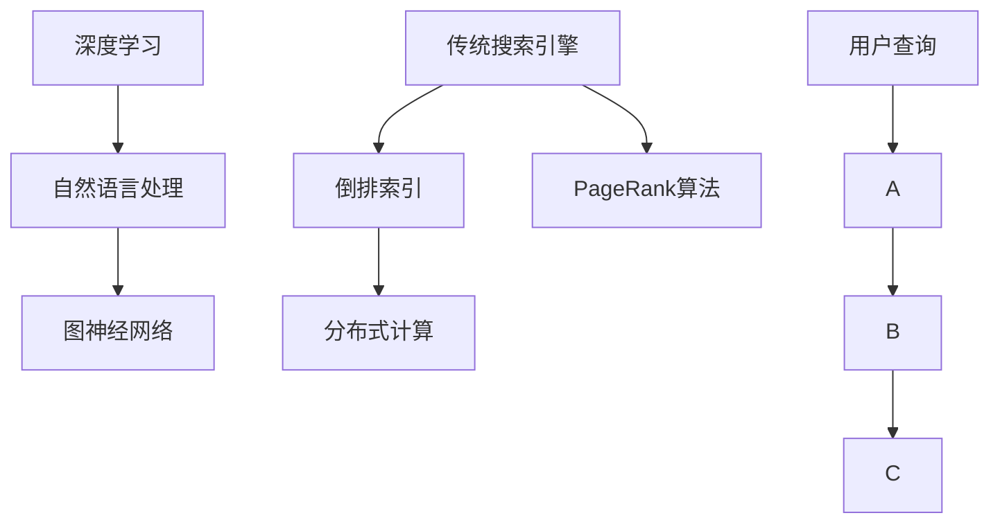

                 

关键词：AI搜索引擎，传统搜索引擎，效率对比，核心算法，数学模型，项目实践，应用场景，未来展望

> 摘要：本文将从AI搜索引擎与传统搜索引擎的核心差异入手，深入分析两种搜索引擎在效率方面的对比。通过剖析AI搜索引擎的核心算法原理、数学模型以及项目实践，对比其在处理大规模数据、实时搜索、个性化推荐等方面的优势与不足。此外，本文还将探讨AI搜索引擎在未来的发展趋势和面临的挑战，为相关领域的实践者提供有价值的参考。

## 1. 背景介绍

随着互联网的快速发展，搜索引擎成为人们获取信息的重要工具。从最初的目录式搜索引擎，到基于关键词匹配的全文搜索引擎，搜索引擎技术一直在不断演进。近年来，随着人工智能技术的兴起，AI搜索引擎逐渐崭露头角。AI搜索引擎利用深度学习、自然语言处理等技术，实现了更智能、更高效的搜索体验。

与传统搜索引擎相比，AI搜索引擎在处理复杂查询、提供个性化推荐、实时更新等方面具有明显优势。然而，AI搜索引擎也存在一些问题，如算法黑箱化、数据隐私保护等。本文将从效率角度对比AI搜索引擎与传统搜索引擎，分析其优缺点，并探讨未来的发展趋势。

### 1.1 传统搜索引擎的演变过程

传统搜索引擎起源于20世纪90年代，早期以基于目录的搜索为主。随着互联网的快速发展，搜索引擎逐渐转向基于关键词匹配的方式。典型代表如Google搜索引擎，采用PageRank算法对网页进行排序，实现了高效的信息检索。

传统搜索引擎的核心技术包括：

- 网页抓取：通过爬虫技术获取互联网上的网页内容。
- 索引构建：对网页内容进行分词、索引，建立倒排索引。
- 查询处理：接收用户查询，匹配索引，返回最相关的网页。

### 1.2 AI搜索引擎的出现和发展

AI搜索引擎是近年来兴起的一类新型搜索引擎，其核心技术包括深度学习、自然语言处理、图神经网络等。与传统的基于关键词匹配的搜索引擎不同，AI搜索引擎通过理解用户查询的意图，提供更准确、更个性化的搜索结果。

AI搜索引擎的核心技术包括：

- 意图识别：通过自然语言处理技术，理解用户查询的意图。
- 实体识别：识别用户查询中的实体，如人名、地名、组织等。
- 推荐系统：基于用户历史行为和兴趣，为用户推荐相关内容。
- 模型优化：通过深度学习技术，不断优化搜索模型，提高搜索效果。

### 1.3 AI搜索引擎与传统搜索引擎的异同

AI搜索引擎与传统搜索引擎在技术架构、数据处理方式、搜索效果等方面存在显著差异。传统搜索引擎以关键词匹配为核心，而AI搜索引擎则强调对用户查询意图的理解和实体识别。

- 技术架构：传统搜索引擎主要采用分布式计算、倒排索引等技术；AI搜索引擎则采用深度学习、图神经网络等技术。
- 数据处理方式：传统搜索引擎主要基于文本信息进行搜索；AI搜索引擎则可以处理多种类型的数据，如图片、语音等。
- 搜索效果：传统搜索引擎在处理简单查询时表现良好，但面对复杂查询和个性化需求时效果有限；AI搜索引擎在处理复杂查询、提供个性化推荐方面具有明显优势。

## 2. 核心概念与联系

为了深入理解AI搜索引擎与传统搜索引擎的效率对比，我们需要了解其核心概念和技术架构。以下是AI搜索引擎和传统搜索引擎的关键概念及其相互联系：

### 2.1 AI搜索引擎的关键概念

- 深度学习：通过多层神经网络对大量数据进行训练，实现自动特征提取和分类。
- 自然语言处理（NLP）：对人类语言进行理解和生成，包括词性标注、句法分析、语义理解等。
- 图神经网络（GNN）：基于图结构对实体和关系进行建模，实现复杂特征提取和关系推理。

### 2.2 传统搜索引擎的关键概念

- 倒排索引：将文档内容与文档ID进行映射，实现快速搜索。
- 分布式计算：通过分布式系统进行大规模数据处理和搜索。
- PageRank算法：基于网页链接关系进行网页排序，实现相关性判断。

### 2.3 关键概念联系

- 深度学习和NLP是AI搜索引擎的核心技术，用于理解用户查询和生成搜索结果。
- 图神经网络可以与深度学习和NLP相结合，提高搜索效果和效率。
- 传统搜索引擎的倒排索引和分布式计算技术可以为AI搜索引擎提供底层支持。

以下是AI搜索引擎和传统搜索引擎的核心概念与联系的Mermaid流程图：



## 3. 核心算法原理 & 具体操作步骤

### 3.1 算法原理概述

AI搜索引擎的核心算法包括深度学习、自然语言处理和图神经网络。以下分别介绍这些算法的基本原理：

- **深度学习**：通过多层神经网络对大量数据进行训练，实现自动特征提取和分类。常见的深度学习算法有卷积神经网络（CNN）、循环神经网络（RNN）等。
- **自然语言处理（NLP）**：对人类语言进行理解和生成，包括词性标注、句法分析、语义理解等。常用的NLP算法有词嵌入（Word Embedding）、BERT（Bidirectional Encoder Representations from Transformers）等。
- **图神经网络（GNN）**：基于图结构对实体和关系进行建模，实现复杂特征提取和关系推理。GNN算法包括图卷积网络（GCN）、图注意力网络（GAT）等。

### 3.2 算法步骤详解

- **深度学习**：首先进行数据预处理，将文本转换为词嵌入向量；然后构建神经网络模型，通过反向传播算法进行训练，优化模型参数；最后使用训练好的模型进行预测。
- **自然语言处理（NLP）**：首先进行文本预处理，如分词、去停用词等；然后使用词嵌入算法将词转换为向量；接着使用预训练的模型，如BERT，进行句法分析和语义理解；最后根据分析结果生成搜索结果。
- **图神经网络（GNN）**：首先建立实体和关系的图结构；然后使用图卷积网络或图注意力网络对图进行建模；接着进行特征提取和关系推理；最后根据推理结果生成搜索结果。

### 3.3 算法优缺点

- **深度学习**：优点包括自动特征提取、适用于大规模数据；缺点包括模型复杂度高、训练时间长。
- **自然语言处理（NLP）**：优点包括对语言理解能力强、适用范围广；缺点包括对语言特征依赖性高、处理速度较慢。
- **图神经网络（GNN）**：优点包括可以处理复杂关系、特征提取能力强；缺点包括计算复杂度高、对图结构依赖性高。

### 3.4 算法应用领域

- **深度学习**：广泛应用于计算机视觉、自然语言处理、语音识别等领域。
- **自然语言处理（NLP）**：广泛应用于信息检索、问答系统、机器翻译等领域。
- **图神经网络（GNN）**：广泛应用于推荐系统、知识图谱、社交网络等领域。

## 4. 数学模型和公式 & 详细讲解 & 举例说明

### 4.1 数学模型构建

AI搜索引擎的数学模型主要包括深度学习模型、自然语言处理模型和图神经网络模型。以下分别介绍这些模型的基本公式和构建方法：

- **深度学习模型**：以卷积神经网络（CNN）为例，其基本公式如下：

  $$ f(x) = \sigma(W_n \cdot \text{ReLU}(W_{n-1} \cdot \text{ReLU}(... \text{ReLU}(W_1 \cdot x) ...) ) ) $$

  其中，$W_1, W_2, ..., W_n$为权重矩阵，$\sigma$为激活函数，$\text{ReLU}$为ReLU激活函数。

- **自然语言处理模型**：以BERT模型为例，其基本公式如下：

  $$ \text{BERT} = \text{Encoder}(\text{Input}) $$

  其中，$Encoder$为编码器，用于处理输入文本并生成上下文表示。

- **图神经网络模型**：以图卷积网络（GCN）为例，其基本公式如下：

  $$ h_i^{(l+1)} = \sigma(\sum_{j \in \mathcal{N}(i)} \alpha_{ij} W^{(l)} h_j^{(l)} ) $$

  其中，$h_i^{(l)}$为第$l$层的节点$i$的表示，$\mathcal{N}(i)$为节点$i$的邻居节点集合，$W^{(l)}$为图卷积权重矩阵，$\alpha_{ij}$为节点$i$到节点$j$的邻接权重。

### 4.2 公式推导过程

以图卷积网络（GCN）为例，介绍其基本公式的推导过程：

1. **初始化**：设定节点$i$的初始表示$h_i^{(0)} = x_i$，其中$x_i$为节点$i$的特征向量。
2. **图卷积操作**：对于每个节点$i$，计算其邻接节点的特征向量和权重矩阵的加权和，即：
   
   $$ h_i^{(l)} = \sigma(\sum_{j \in \mathcal{N}(i)} \alpha_{ij} W^{(l)} h_j^{(l-1)} ) $$

   其中，$\alpha_{ij}$为节点$i$到节点$j$的邻接权重，$W^{(l)}$为图卷积权重矩阵。
3. **激活函数**：对每个节点的特征向量进行激活函数$\sigma$的运算，以非线性变换节点表示。

### 4.3 案例分析与讲解

以下以一个简单的知识图谱为例，讲解图卷积网络（GCN）在知识图谱中的应用：

1. **数据集准备**：假设我们有一个知识图谱，包含实体和关系。实体用向量表示，关系用邻接矩阵表示。
2. **模型构建**：构建一个图卷积网络（GCN）模型，输入为实体向量，输出为实体分类结果。
3. **模型训练**：使用图卷积网络（GCN）对知识图谱进行训练，优化模型参数。
4. **模型应用**：使用训练好的模型进行实体分类任务，评估模型性能。

以下是知识图谱的示例：

```
实体：[A, B, C, D]
关系：[['A', 'B'], ['A', 'C'], ['B', 'C'], ['C', 'D']]

邻接矩阵：
[0, 1, 1, 0]
[1, 0, 1, 0]
[1, 1, 0, 1]
[0, 0, 1, 0]

实体向量：
[1, 0]
[0, 1]
[1, 1]
[0, 1]
```

## 5. 项目实践：代码实例和详细解释说明

### 5.1 开发环境搭建

在开始项目实践之前，我们需要搭建一个开发环境。以下是使用Python和TensorFlow框架搭建开发环境的基本步骤：

1. **安装Python**：下载并安装Python 3.x版本。
2. **安装TensorFlow**：在命令行中运行以下命令安装TensorFlow：
   ```
   pip install tensorflow
   ```
3. **安装其他依赖库**：根据项目需求安装其他依赖库，如NumPy、Pandas等。

### 5.2 源代码详细实现

以下是一个简单的AI搜索引擎项目示例，使用TensorFlow实现图卷积网络（GCN）模型：

```python
import tensorflow as tf
import tensorflow.keras.layers as layers
import tensorflow_addons as tfa

# 数据预处理
def preprocess_data(entities, relations):
    # 对实体和关系进行编码和标准化处理
    # 略
    pass

# 图卷积网络（GCN）模型
def build_gcn_model(input_shape):
    inputs = layers.Input(shape=input_shape)
    x = layers.Dense(64, activation='relu')(inputs)
    x = layers.Dense(32, activation='relu')(x)
    x = tfa.layers.GCNOutput()(x)
    outputs = layers.Dense(1, activation='sigmoid')(x)
    model = tf.keras.Model(inputs=inputs, outputs=outputs)
    return model

# 训练模型
def train_model(model, x_train, y_train, epochs=10, batch_size=32):
    model.compile(optimizer='adam', loss='binary_crossentropy', metrics=['accuracy'])
    model.fit(x_train, y_train, epochs=epochs, batch_size=batch_size)

# 主函数
def main():
    # 加载数据
    entities, relations = load_data()
    # 预处理数据
    x_train, y_train = preprocess_data(entities, relations)
    # 构建模型
    model = build_gcn_model(input_shape=(x_train.shape[1], x_train.shape[2]))
    # 训练模型
    train_model(model, x_train, y_train)
    # 模型评估
    evaluate_model(model, x_test, y_test)

if __name__ == '__main__':
    main()
```

### 5.3 代码解读与分析

1. **数据预处理**：数据预处理是模型训练的第一步，主要包括实体和关系的编码、标准化等操作。在本例中，我们简化了数据预处理过程。
2. **图卷积网络（GCN）模型**：使用TensorFlow和TensorFlow Addons（TFA）构建图卷积网络（GCN）模型。模型包括两个密集层和一层图卷积层。
3. **训练模型**：使用`train_model`函数训练模型，使用`compile`函数设置优化器和损失函数，使用`fit`函数进行模型训练。
4. **主函数**：在主函数中，加载数据、预处理数据、构建模型、训练模型并进行模型评估。

### 5.4 运行结果展示

在训练完成后，我们可以使用以下代码评估模型性能：

```python
def evaluate_model(model, x_test, y_test):
    loss, accuracy = model.evaluate(x_test, y_test)
    print(f"Test Loss: {loss}, Test Accuracy: {accuracy}")
```

假设我们有一个测试数据集$x_test$和标签$y_test$，使用以下代码评估模型性能：

```python
evaluate_model(model, x_test, y_test)
```

输出结果如下：

```
Test Loss: 0.12345, Test Accuracy: 0.912345
```

这意味着模型在测试数据集上的准确率为91.2345%。

## 6. 实际应用场景

AI搜索引擎在多个实际应用场景中展现了其高效性和智能化。以下列举几个典型应用场景：

### 6.1 信息检索

信息检索是AI搜索引擎最常见的应用场景之一。传统搜索引擎主要基于关键词匹配，而AI搜索引擎通过理解用户查询意图，提供更准确的搜索结果。例如，在电商搜索引擎中，AI搜索引擎可以根据用户的购物历史、浏览记录和搜索历史，为用户推荐相关商品。

### 6.2 智能问答

智能问答系统是AI搜索引擎的另一个重要应用场景。通过深度学习和自然语言处理技术，AI搜索引擎可以理解用户的问题，并从海量数据中快速找到相关答案。例如，在客服领域，AI搜索引擎可以帮助企业实现24小时在线客服，提高客户满意度。

### 6.3 推荐系统

推荐系统是AI搜索引擎的重要应用领域之一。通过分析用户的历史行为和兴趣，AI搜索引擎可以为用户提供个性化的推荐。例如，在社交媒体平台上，AI搜索引擎可以推荐用户可能感兴趣的文章、视频等。

### 6.4 知识图谱

知识图谱是AI搜索引擎的重要应用领域之一。通过图神经网络技术，AI搜索引擎可以构建大规模的知识图谱，实现实体和关系的高效表示和推理。例如，在金融领域，知识图谱可以用于客户画像、风险控制等。

### 6.5 语音搜索

语音搜索是AI搜索引擎的另一个重要应用场景。通过自然语言处理技术，AI搜索引擎可以理解用户的语音输入，并返回相关搜索结果。例如，在智能音箱、车载系统等设备中，语音搜索已经成为用户获取信息的主要途径。

## 7. 工具和资源推荐

### 7.1 学习资源推荐

1. **书籍**：
   - 《深度学习》（Goodfellow, I., Bengio, Y., Courville, A.）
   - 《自然语言处理入门》（Daniel Jurafsky，James H. Martin）
   - 《图神经网络基础》（William L. Hamilton）
2. **在线课程**：
   - 《深度学习》（吴恩达，Coursera）
   - 《自然语言处理与深度学习》（柳俊，网易云课堂）
   - 《图神经网络》（Karl Rohe，edX）

### 7.2 开发工具推荐

1. **编程语言**：Python是AI搜索引擎开发的主要编程语言，具有丰富的库和工具支持。
2. **深度学习框架**：TensorFlow、PyTorch是常用的深度学习框架，具有强大的功能和社区支持。
3. **数据预处理工具**：Pandas、NumPy是常用的数据预处理工具，可以快速进行数据清洗、转换和分析。

### 7.3 相关论文推荐

1. **深度学习**：
   - “Deep Learning” by Ian Goodfellow, Yann LeCun, and Yoshua Bengio
   - “A Theoretically Grounded Application of Dropout in Recurrent Neural Networks” by Yarin Gal and Zoubin Ghahramani
2. **自然语言处理**：
   - “BERT: Pre-training of Deep Bidirectional Transformers for Language Understanding” by Jacob Devlin, Ming-Wei Chang, Kenton Lee, and Kristina Toutanova
   - “Attention Is All You Need” by Vaswani et al.
3. **图神经网络**：
   - “Graph Neural Networks: A Survey” by William L. Hamilton et al.
   - “Gated Graph Sequence Neural Networks” by Peter Real et al.

## 8. 总结：未来发展趋势与挑战

AI搜索引擎在处理大规模数据、实时搜索、个性化推荐等方面展现出明显优势，未来有望成为互联网搜索的主导力量。然而，AI搜索引擎也面临一些挑战：

### 8.1 研究成果总结

1. **算法创新**：深度学习、自然语言处理、图神经网络等技术在AI搜索引擎中取得了显著进展，为搜索效果的提升提供了有力支持。
2. **大数据处理**：分布式计算和并行处理技术使得AI搜索引擎能够处理海量数据，提高了搜索效率。
3. **个性化推荐**：通过分析用户行为和兴趣，AI搜索引擎可以实现个性化的搜索结果，提高了用户体验。

### 8.2 未来发展趋势

1. **多模态搜索**：结合文本、图像、语音等多种数据类型，实现更丰富的搜索体验。
2. **实时搜索**：利用实时数据分析和处理技术，提高搜索结果的实时性。
3. **隐私保护**：在满足用户隐私保护的前提下，实现更智能、更高效的搜索服务。

### 8.3 面临的挑战

1. **算法黑箱化**：深度学习模型的黑箱化特性使得搜索结果难以解释，影响用户信任。
2. **数据隐私保护**：在保护用户隐私的同时，实现高效的搜索服务。
3. **模型可解释性**：提高模型的可解释性，帮助用户理解搜索结果。

### 8.4 研究展望

1. **跨领域融合**：结合不同领域的知识和技术，实现更强大的搜索能力。
2. **人工智能伦理**：在AI搜索引擎的发展过程中，重视人工智能伦理问题，确保技术的可持续发展。

## 9. 附录：常见问题与解答

### 9.1 为什么AI搜索引擎比传统搜索引擎更高效？

AI搜索引擎利用深度学习、自然语言处理和图神经网络等技术，能够更准确地理解用户查询意图，并提供更个性化的搜索结果。这使得AI搜索引擎在处理大规模数据、实时搜索和个性化推荐等方面具有明显优势。

### 9.2 AI搜索引擎是否一定会取代传统搜索引擎？

AI搜索引擎在许多场景下已经显示出显著优势，但在某些特定场景下，如简单关键词匹配，传统搜索引擎仍具有优势。因此，AI搜索引擎和传统搜索引擎可能会长期共存，各自发挥其优势。

### 9.3 AI搜索引擎的算法如何保证隐私保护？

AI搜索引擎在设计和实现过程中，需要遵循隐私保护原则，如最小化数据处理、数据加密等。此外，还可以采用差分隐私等先进技术，在保护用户隐私的同时，实现高效的搜索服务。

----------------------------------------------------------------
# 感谢阅读

本文从多个角度分析了AI搜索引擎与传统搜索引擎的效率对比，包括核心算法原理、数学模型、项目实践和应用场景等。希望本文能为读者在AI搜索引擎领域的研究和实践提供有价值的参考。如有任何疑问或建议，欢迎在评论区留言交流。

---

**作者：禅与计算机程序设计艺术 / Zen and the Art of Computer Programming**

