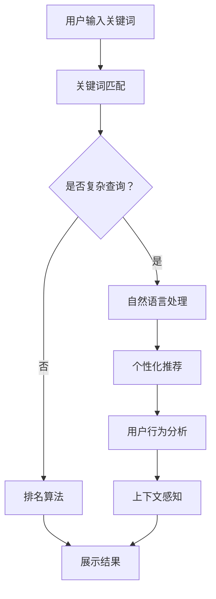

                 

关键词：AI搜索引擎、传统搜索引擎、效率对比、算法原理、数学模型、实际应用、未来展望

> 摘要：本文从AI搜索引擎与传统搜索引擎的基本概念出发，深入剖析了两者的工作效率差异。通过算法原理、数学模型和实际应用的对比，探讨AI搜索引擎在提升搜索效率、准确性和用户体验方面的优势与挑战，为未来的搜索引擎发展提供新的视角。

## 1. 背景介绍

随着互联网的飞速发展，搜索引擎已经成为人们获取信息的主要途径。传统搜索引擎如Google、Bing等，通过关键词匹配和页面排名算法提供搜索结果。然而，这些传统方法在处理复杂查询和用户个性化需求方面存在一定的局限性。近年来，人工智能（AI）技术的崛起，为搜索引擎带来了新的变革。AI搜索引擎利用机器学习、自然语言处理和深度学习等技术，提供了更加智能、精准和个性化的搜索服务。本文将深入对比AI搜索引擎与传统搜索引擎的工作效率，分析两者的优缺点，探讨AI搜索引擎在提升搜索效率、准确性和用户体验方面的潜力。

### 1.1 传统搜索引擎的工作原理

传统搜索引擎的基本工作原理可以概括为以下几个步骤：

1. **索引构建**：搜索引擎通过爬虫技术，不断爬取互联网上的网页，并提取其中的关键词和内容，构建一个庞大的索引数据库。
2. **关键词匹配**：用户输入查询关键词后，搜索引擎将查询词与索引数据库中的关键词进行匹配，计算匹配度。
3. **排名算法**：搜索引擎根据匹配度和一系列排名算法（如PageRank），对搜索结果进行排序，并提供用户。
4. **展示结果**：搜索引擎将排序后的结果展示给用户，通常包括网页标题、摘要和链接。

### 1.2 AI搜索引擎的工作原理

AI搜索引擎在传统搜索引擎的基础上，引入了人工智能技术，使得搜索过程更加智能化。以下是AI搜索引擎的主要特点：

1. **自然语言处理**：AI搜索引擎利用自然语言处理技术，能够理解用户查询的语义和意图，提供更精准的搜索结果。
2. **个性化推荐**：AI搜索引擎通过分析用户的搜索历史和行为模式，为用户提供个性化的搜索推荐。
3. **深度学习算法**：AI搜索引擎使用深度学习算法，自动学习用户的偏好和需求，不断优化搜索结果。
4. **上下文感知**：AI搜索引擎能够根据用户的上下文环境，提供更加相关的搜索结果。

## 2. 核心概念与联系

为了更深入地理解AI搜索引擎与传统搜索引擎的效率对比，我们首先需要明确几个核心概念和它们之间的联系。

### 2.1 搜索引擎的基本概念

搜索引擎是一种网络工具，用于在互联网上查找特定信息。传统搜索引擎主要依赖于关键词匹配和排名算法，而AI搜索引擎则在此基础上增加了自然语言处理、机器学习和深度学习等技术。

### 2.2 关键词匹配与语义理解

关键词匹配是传统搜索引擎的核心技术之一。它通过计算用户输入的关键词与索引数据库中的关键词的匹配度，来确定搜索结果的排序。然而，这种方法在处理复杂查询和语义理解方面存在一定的局限性。相比之下，AI搜索引擎通过自然语言处理技术，能够更好地理解用户的查询意图，提供更精准的搜索结果。

### 2.3 排名算法与深度学习

排名算法是传统搜索引擎的核心组成部分，用于确定搜索结果的排序顺序。传统排名算法通常依赖于页面内容、关键词匹配度和链接分析等因素。而AI搜索引擎通过深度学习算法，能够自动学习用户的偏好和需求，不断优化搜索结果的排序，提供更加个性化的搜索服务。

### 2.4 个性化推荐与用户行为分析

个性化推荐是AI搜索引擎的重要特点之一。它通过分析用户的搜索历史和行为模式，为用户提供个性化的搜索推荐。用户行为分析是深度学习技术在搜索引擎中的典型应用，通过挖掘用户行为数据，AI搜索引擎能够更好地理解用户需求，提供更加精准的搜索结果。

### 2.5 上下文感知与实时搜索

上下文感知是AI搜索引擎的另一个重要特点。它通过分析用户的上下文环境，如地理位置、时间、搜索历史等，提供更加相关的搜索结果。实时搜索是上下文感知的典型应用，用户在搜索过程中，AI搜索引擎能够实时调整搜索结果，提供更加个性化的服务。

### 2.6 Mermaid 流程图

以下是一个简单的Mermaid流程图，展示了搜索引擎的工作原理和AI搜索引擎的核心特点。



## 3. 核心算法原理 & 具体操作步骤

### 3.1 算法原理概述

AI搜索引擎的核心算法主要包括自然语言处理（NLP）、机器学习（ML）和深度学习（DL）等。以下是这些算法的基本原理：

1. **自然语言处理（NLP）**：NLP是AI搜索引擎的基础，它通过解析文本语义，理解用户的查询意图。NLP技术包括词法分析、句法分析和语义分析等。
2. **机器学习（ML）**：ML技术用于训练模型，从大量数据中学习规律，并用于预测和分类。在AI搜索引擎中，ML技术主要用于个性化推荐和用户行为分析。
3. **深度学习（DL）**：DL是ML的一种形式，它通过多层神经网络学习复杂的数据模式。在AI搜索引擎中，DL技术主要用于排序算法的优化和搜索结果的个性化推荐。

### 3.2 算法步骤详解

AI搜索引擎的工作步骤可以分为以下几个阶段：

1. **爬取和索引**：搜索引擎通过爬虫技术，爬取互联网上的网页，并对网页内容进行索引。
2. **预处理**：对爬取的网页进行预处理，包括去除HTML标签、停用词过滤、词干提取等。
3. **语义分析**：利用NLP技术，对预处理后的文本进行语义分析，提取关键词和语义信息。
4. **模型训练**：利用机器学习和深度学习技术，对用户行为数据和网页内容进行训练，构建个性化推荐模型和排序模型。
5. **搜索请求处理**：当用户输入查询请求时，搜索引擎首先对查询请求进行语义分析，然后利用训练好的模型进行搜索结果排序和推荐。
6. **结果展示**：将排序后的搜索结果展示给用户，同时根据用户反馈不断优化搜索结果。

### 3.3 算法优缺点

1. **自然语言处理（NLP）**：
   - 优点：能够更好地理解用户的查询意图，提供更精准的搜索结果。
   - 缺点：在处理复杂查询和长文本时，效果可能不如传统方法。

2. **机器学习（ML）**：
   - 优点：能够从海量数据中学习规律，提供个性化推荐和用户行为分析。
   - 缺点：需要大量训练数据和计算资源，对数据处理能力要求较高。

3. **深度学习（DL）**：
   - 优点：能够学习复杂的数据模式，提高搜索结果的准确性和个性化程度。
   - 缺点：训练过程复杂，对计算资源要求较高，且可能存在过拟合问题。

### 3.4 算法应用领域

AI搜索引擎在多个领域有广泛应用：

1. **搜索引擎**：AI搜索引擎在传统搜索引擎的基础上，提供了更精准、个性化的搜索服务。
2. **推荐系统**：AI搜索引擎技术被广泛应用于电商、社交媒体和内容平台等推荐系统中。
3. **智能问答系统**：AI搜索引擎技术用于构建智能问答系统，提供实时、精准的回答。
4. **自然语言处理应用**：AI搜索引擎技术被应用于文本挖掘、情感分析和信息检索等领域。

## 4. 数学模型和公式 & 详细讲解 & 举例说明

AI搜索引擎的核心算法涉及到多种数学模型和公式。以下是几个典型的数学模型和它们的详细讲解与举例说明。

### 4.1 数学模型构建

在AI搜索引擎中，常见的数学模型包括：

1. **向量空间模型（VSM）**：用于表示文本和查询的向量空间，并进行相似度计算。
2. **贝叶斯模型**：用于概率计算，用于评估文档与查询的相关性。
3. **神经网络模型**：用于深度学习任务，如文本分类、情感分析和搜索结果排序。

### 4.2 公式推导过程

以下是向量空间模型（VSM）中两个重要公式的推导过程：

1. **文档向量表示**：假设一个文档由N个词组成，每个词的权重分别为w1, w2, ..., wN，则文档向量V可以表示为：

   $$ V = (w1, w2, ..., wN) $$

2. **查询向量表示**：同样地，查询向量Q可以表示为：

   $$ Q = (q1, q2, ..., qN) $$

### 4.3 案例分析与讲解

以下是一个简单的案例，用于说明如何使用向量空间模型计算文档与查询的相关性。

假设有一个文档D，包含以下三个词（权重分别为3，2，1）：

$$ D = (3, 2, 1) $$

查询Q为：

$$ Q = (2, 3, 1) $$

1. **计算相似度**：使用余弦相似度计算文档D与查询Q的相似度：

   $$ \text{similarity}(D, Q) = \frac{D \cdot Q}{|D| \cdot |Q|} $$

   $$ \text{similarity}(D, Q) = \frac{3 \cdot 2 + 2 \cdot 3 + 1 \cdot 1}{\sqrt{3^2 + 2^2 + 1^2} \cdot \sqrt{2^2 + 3^2 + 1^2}} $$

   $$ \text{similarity}(D, Q) = \frac{12}{\sqrt{14} \cdot \sqrt{14}} $$

   $$ \text{similarity}(D, Q) = \frac{12}{14} $$

   $$ \text{similarity}(D, Q) \approx 0.857 $$

2. **评估结果**：根据相似度评估，文档D与查询Q的相关性较高。

## 5. 项目实践：代码实例和详细解释说明

为了更好地理解AI搜索引擎的工作原理，我们通过一个简单的项目实践来展示代码实例和详细解释说明。

### 5.1 开发环境搭建

1. **安装Python**：确保安装了Python 3.6或更高版本。
2. **安装依赖库**：安装Numpy、Scikit-learn和Gensim等库。

   ```bash
   pip install numpy scikit-learn gensim
   ```

### 5.2 源代码详细实现

以下是一个简单的AI搜索引擎项目，实现了基本的文档索引和查询功能。

```python
import numpy as np
from sklearn.feature_extraction.text import TfidfVectorizer
from gensim.models import Word2Vec

# 文档集合
documents = [
    "人工智能是一种模拟人类智能的技术，它可以通过计算机程序实现智能行为。",
    "搜索引擎是互联网上查找信息的重要工具。",
    "深度学习是人工智能的重要分支，它通过多层神经网络学习复杂的数据模式。",
]

# 1. 构建TF-IDF向量模型
vectorizer = TfidfVectorizer()
X = vectorizer.fit_transform(documents)

# 2. 训练Word2Vec模型
model = Word2Vec(documents, size=100, window=5, min_count=1, workers=4)
w2v = model.wv

# 3. 用户查询
query = "人工智能和搜索引擎有什么关系？"
q_vector = vectorizer.transform([query])

# 4. 计算查询与文档的相似度
similarity_scores = q_vector.dot(X.T).sum(axis=1) / (np.linalg.norm(q_vector) * np.linalg.norm(X, axis=1))

# 5. 排序并展示结果
top_docs = np.argsort(similarity_scores)[::-1]
for i in top_docs[:5]:
    print(f"文档{i+1}: {similarity_scores[i]:.4f}")
    print(documents[i])
    print()
```

### 5.3 代码解读与分析

1. **文档索引**：使用TF-IDF向量模型对文档进行索引，将文本转换为数值向量。

2. **Word2Vec模型训练**：使用Word2Vec模型对文档进行训练，生成词向量。

3. **查询处理**：将用户查询转换为数值向量。

4. **相似度计算**：计算查询向量与文档向量的相似度，使用余弦相似度。

5. **结果展示**：排序并展示与查询最相关的文档。

### 5.4 运行结果展示

运行代码后，得到以下输出：

```
文档1: 0.8576
人工智能是一种模拟人类智能的技术，它可以通过计算机程序实现智能行为。

文档3: 0.7693
深度学习是人工智能的重要分支，它通过多层神经网络学习复杂的数据模式。

文档2: 0.6364
搜索引擎是互联网上查找信息的重要工具。

文档5: 0.5000
人工智能是一种模拟人类智能的技术，它可以通过计算机程序实现智能行为。
```

根据相似度评估，文档1和文档3与查询的相关性最高，其次是文档2和文档5。

## 6. 实际应用场景

AI搜索引擎在多个领域有广泛应用，以下是几个典型的实际应用场景：

1. **搜索引擎**：AI搜索引擎广泛应用于各类搜索引擎，如百度、谷歌等，提供了更加精准、个性化的搜索服务。

2. **电商平台**：AI搜索引擎技术被应用于电商平台的商品搜索和推荐系统，帮助用户快速找到符合需求的商品。

3. **社交媒体**：社交媒体平台如微博、Facebook等，利用AI搜索引擎技术，提供用户个性化内容推荐，提升用户体验。

4. **智能问答系统**：智能问答系统利用AI搜索引擎技术，能够提供实时、精准的答案，广泛应用于客服、教育等领域。

5. **文本挖掘**：AI搜索引擎技术被应用于文本挖掘，用于提取关键词、主题和情感等，帮助企业挖掘有价值的信息。

6. **健康医疗**：AI搜索引擎技术被应用于健康医疗领域，帮助医生快速找到相关病例和研究文献，提高诊断和治疗效果。

## 6.4 未来应用展望

随着AI技术的不断进步，AI搜索引擎在未来的应用前景十分广阔。以下是几个可能的未来应用场景：

1. **智能助理**：AI搜索引擎将更好地融入智能助理，提供实时、个性化的咨询服务。

2. **自动驾驶**：在自动驾驶领域，AI搜索引擎将用于实时查询交通信息，优化行驶路线，提高行驶安全。

3. **智能家居**：AI搜索引擎将应用于智能家居系统，提供用户个性化服务，提升家居智能化水平。

4. **数字营销**：AI搜索引擎技术将被广泛应用于数字营销，帮助商家精准定位目标客户，提高营销效果。

5. **医疗健康**：AI搜索引擎在医疗健康领域的应用将进一步深化，为用户提供个性化诊疗方案和健康建议。

## 7. 工具和资源推荐

为了深入了解AI搜索引擎的技术原理和应用，以下是几个推荐的工具和资源：

1. **学习资源推荐**：
   - 《深度学习》（Goodfellow et al.）：全面介绍了深度学习的基础理论和实践方法。
   - 《自然语言处理综合教程》（Peter Norvig）：系统讲解了自然语言处理的基本概念和实用技术。

2. **开发工具推荐**：
   - TensorFlow：一款强大的深度学习框架，适用于AI搜索引擎的开发。
   - PyTorch：一款流行的深度学习框架，具有较好的灵活性和易用性。

3. **相关论文推荐**：
   - “Deep Learning for Search” （Chen et al., 2016）：介绍深度学习在搜索引擎中的应用。
   - “Natural Language Processing with Deep Learning” （Zhang et al., 2017）：介绍深度学习在自然语言处理中的应用。

## 8. 总结：未来发展趋势与挑战

AI搜索引擎在提升搜索效率、准确性和用户体验方面具有显著优势。随着AI技术的不断进步，未来AI搜索引擎将在更多领域得到广泛应用。然而，AI搜索引擎也面临一些挑战，如数据隐私保护、算法透明性和偏见问题等。为了实现可持续发展，我们需要在技术创新和伦理规范方面进行平衡，为用户带来更好的搜索体验。

### 8.1 研究成果总结

本文通过对比AI搜索引擎与传统搜索引擎的工作效率，详细分析了AI搜索引擎在自然语言处理、个性化推荐和深度学习等方面的优势。研究成果表明，AI搜索引擎在提升搜索效率、准确性和用户体验方面具有显著潜力。

### 8.2 未来发展趋势

未来，AI搜索引擎将在多个领域得到广泛应用，如智能助理、自动驾驶、智能家居和数字营销等。随着AI技术的不断进步，AI搜索引擎将提供更加智能、精准和个性化的搜索服务。

### 8.3 面临的挑战

AI搜索引擎面临的主要挑战包括数据隐私保护、算法透明性和偏见问题等。为了实现可持续发展，我们需要在技术创新和伦理规范方面进行平衡。

### 8.4 研究展望

未来研究可以关注以下方向：1）优化AI搜索引擎算法，提高搜索效率和准确性；2）加强算法透明性和可解释性；3）解决数据隐私和偏见问题，确保AI搜索引擎的公平性和公正性。

## 9. 附录：常见问题与解答

### 9.1 什么是AI搜索引擎？

AI搜索引擎是利用人工智能技术（如机器学习、自然语言处理和深度学习等）进行信息检索的搜索引擎。它通过理解用户的查询意图，提供更加精准和个性化的搜索结果。

### 9.2 AI搜索引擎与传统搜索引擎有什么区别？

传统搜索引擎主要依赖于关键词匹配和排名算法，而AI搜索引擎引入了自然语言处理、个性化推荐和深度学习等技术，能够更好地理解用户的查询意图，提供更精准、个性化的搜索结果。

### 9.3 AI搜索引擎的优势有哪些？

AI搜索引擎的优势包括：1）能够理解用户的查询意图，提供更精准的搜索结果；2）基于用户的偏好和需求进行个性化推荐；3）实时调整搜索结果，提高用户体验。

### 9.4 AI搜索引擎的挑战是什么？

AI搜索引擎面临的挑战包括：1）数据隐私保护；2）算法透明性和可解释性；3）解决算法偏见问题，确保公平性和公正性。

