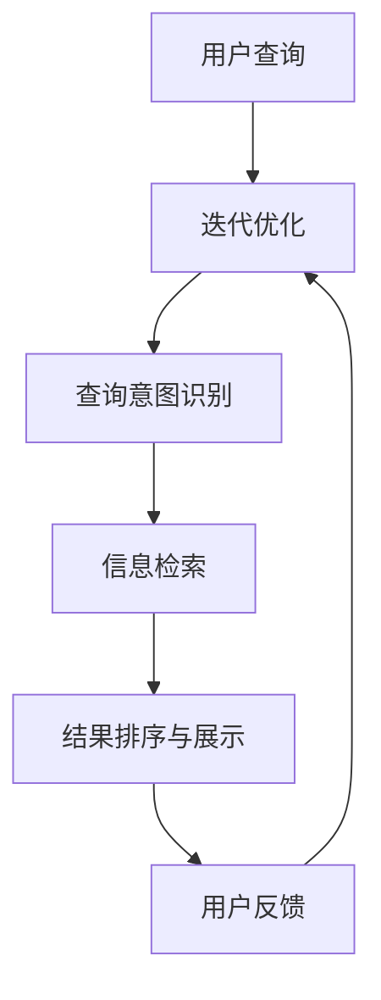

                 

关键词：AI搜索引擎，医疗健康，大数据，自然语言处理，深度学习，智能诊断，个性化治疗，临床辅助，药物研发，数据隐私

> 摘要：随着人工智能技术的发展，AI搜索引擎在医疗健康领域的应用正日益广泛。本文将探讨AI搜索引擎在医疗健康领域的应用前景，包括智能诊断、个性化治疗、临床辅助、药物研发等方面，并分析其面临的挑战和未来发展趋势。

## 1. 背景介绍

医疗健康行业一直以来都是信息技术的重要应用领域。随着大数据、云计算、物联网和人工智能技术的快速发展，医疗健康行业正面临着前所未有的变革。传统的医疗信息系统已经无法满足现代医疗的需求，而AI搜索引擎作为一种强大的信息处理工具，正逐渐成为医疗健康领域的重要辅助工具。

AI搜索引擎能够高效地处理海量医疗数据，提供精准的搜索结果，有助于医生和研究人员快速获取所需的信息，提高工作效率和诊断准确性。同时，AI搜索引擎还可以根据患者的个体差异提供个性化的治疗建议，为个性化医疗提供有力支持。

## 2. 核心概念与联系

### 2.1. AI搜索引擎的定义与原理

AI搜索引擎是一种基于人工智能技术构建的搜索引擎，能够理解用户的查询意图，并提供与查询意图高度相关的结果。它通常包含以下几个核心组成部分：

- **自然语言处理（NLP）**：用于理解和处理自然语言，包括文本分析、情感分析、实体识别等。
- **机器学习算法**：用于从数据中学习模式和规律，包括深度学习、强化学习等。
- **信息检索**：用于根据用户的查询返回最相关的结果。
- **推荐系统**：用于根据用户的历史行为和偏好推荐相关信息。

### 2.2. 医疗健康领域与AI搜索引擎的联系

医疗健康领域的数据类型多样，包括结构化数据（如电子病历、医学影像等）和非结构化数据（如医学论文、临床报告等）。AI搜索引擎能够处理这些数据，为医疗健康领域提供以下价值：

- **快速获取信息**：医生和研究人员可以通过AI搜索引擎快速获取与疾病、药物、治疗方案等相关信息。
- **智能诊断辅助**：AI搜索引擎可以根据患者的病史、检查结果等数据，提供可能的诊断建议。
- **个性化治疗**：AI搜索引擎可以根据患者的基因信息、生活习惯等，提供个性化的治疗建议。
- **药物研发**：AI搜索引擎可以帮助研究人员快速筛选和评估药物候选物，提高药物研发效率。

### 2.3. Mermaid流程图



## 3. 核心算法原理 & 具体操作步骤

### 3.1. 算法原理概述

AI搜索引擎在医疗健康领域的核心算法包括自然语言处理、机器学习、信息检索和推荐系统。以下分别介绍这些算法的原理：

- **自然语言处理（NLP）**：NLP算法用于理解用户的查询意图，通常包括词性标注、命名实体识别、句法分析等步骤。
- **机器学习算法**：机器学习算法用于从数据中学习模式和规律，常见的算法包括决策树、支持向量机、神经网络等。
- **信息检索**：信息检索算法用于根据用户的查询返回最相关的结果，常见的算法包括基于向量空间的检索、基于模型的检索等。
- **推荐系统**：推荐系统算法用于根据用户的历史行为和偏好推荐相关信息，常见的算法包括协同过滤、基于内容的推荐等。

### 3.2. 算法步骤详解

1. **自然语言处理**：
   - **文本预处理**：对用户的查询进行分词、去停用词、词性标注等操作，将自然语言转化为计算机可处理的格式。
   - **查询意图识别**：利用NLP算法对预处理后的查询进行语义分析，识别用户的查询意图。

2. **信息检索**：
   - **索引构建**：将医疗健康领域的海量数据构建成索引，以便快速检索。
   - **查询处理**：根据用户的查询意图，在索引中检索相关信息，并计算相关度得分。

3. **结果排序与展示**：
   - **结果排序**：根据相关度得分对检索结果进行排序，确保最相关的结果排在前面。
   - **结果展示**：将排序后的结果以易于理解的形式展示给用户。

4. **推荐系统**：
   - **用户偏好分析**：分析用户的历史行为和偏好，构建用户偏好模型。
   - **推荐生成**：根据用户偏好模型，为用户推荐相关信息。

### 3.3. 算法优缺点

**优点**：
- **高效性**：AI搜索引擎能够快速处理海量医疗数据，提供准确的搜索结果。
- **个性化**：AI搜索引擎可以根据用户的查询意图和偏好提供个性化的信息推荐。
- **智能化**：AI搜索引擎能够不断学习和优化，提高搜索结果的准确性和用户体验。

**缺点**：
- **数据隐私**：医疗数据涉及患者隐私，如何保护数据隐私是AI搜索引擎在医疗健康领域面临的重要挑战。
- **算法偏见**：AI搜索引擎可能因为数据偏差而导致搜索结果存在偏见，影响诊断和治疗的准确性。

### 3.4. 算法应用领域

AI搜索引擎在医疗健康领域的应用非常广泛，包括但不限于以下几个方面：

- **智能诊断**：AI搜索引擎可以根据患者的病史、检查结果等数据，提供可能的诊断建议。
- **个性化治疗**：AI搜索引擎可以根据患者的基因信息、生活习惯等，提供个性化的治疗建议。
- **临床辅助**：AI搜索引擎可以为医生提供临床决策支持，提高诊断和治疗的准确性。
- **药物研发**：AI搜索引擎可以帮助研究人员快速筛选和评估药物候选物，提高药物研发效率。

## 4. 数学模型和公式 & 详细讲解 & 举例说明

### 4.1. 数学模型构建

在AI搜索引擎中，常用的数学模型包括自然语言处理模型、机器学习模型和信息检索模型。以下分别介绍这些模型的构建方法。

#### 4.1.1. 自然语言处理模型

自然语言处理模型通常基于深度学习，常用的模型包括循环神经网络（RNN）、长短时记忆网络（LSTM）和变换器（Transformer）。以下是一个基于Transformer的自然语言处理模型的数学模型构建：

```latex
\begin{equation}
    E(x) = \text{Embedding}(x)
\end{equation}
```

其中，\(E(x)\) 表示输入的词向量表示，\(\text{Embedding}\) 表示词向量化过程。

#### 4.1.2. 机器学习模型

机器学习模型通常用于分类、回归和聚类等任务。以下是一个基于支持向量机（SVM）的机器学习模型的数学模型构建：

```latex
\begin{equation}
    f(x) = \text{sign}(\sum_{i=1}^{n} \alpha_i y_i K(x_i, x) + b)
\end{equation}
```

其中，\(f(x)\) 表示模型的预测输出，\(\alpha_i, y_i, x_i\) 表示支持向量的权重、标签和特征，\(K(x_i, x)\) 表示核函数，\(b\) 表示偏置。

#### 4.1.3. 信息检索模型

信息检索模型通常基于向量空间模型，常用的模型包括余弦相似度模型和点积模型。以下是一个基于点积的信息检索模型的数学模型构建：

```latex
\begin{equation}
    \text{similarity}(q, d) = q^T d
\end{equation}
```

其中，\(\text{similarity}(q, d)\) 表示查询 \(q\) 和文档 \(d\) 的相似度，\(q^T d\) 表示点积。

### 4.2. 公式推导过程

以下分别介绍自然语言处理模型、机器学习模型和信息检索模型的公式推导过程。

#### 4.2.1. 自然语言处理模型

基于Transformer的自然语言处理模型的公式推导如下：

1. **词向量化**：

   词向量化过程是将自然语言转化为计算机可处理的格式。假设词表中有 \(V\) 个词，词向量化矩阵为 \(W\)，输入词向量为 \(x\)，则有：

   ```latex
   \begin{equation}
       E(x) = Wx
   \end{equation}
   ```

2. **多头注意力**：

   多头注意力机制用于计算查询和键值对的相似度。假设有 \(h\) 个头，每个头的权重矩阵为 \(A_h\)，则有：

   ```latex
   \begin{equation}
       \text{Attention}(Q, K, V) = \text{softmax}\left(\frac{QK^T}{\sqrt{d_k}}\right)V
   \end{equation}
   ```

3. **前馈网络**：

   前馈网络用于对注意力结果进行非线性变换。假设前馈网络的激活函数为 \(f()\)，则有：

   ```latex
   \begin{equation}
       O = f(W_2 \cdot \text{Attention}(Q, K, V) + W_1)
   \end{equation}
   ```

#### 4.2.2. 机器学习模型

基于支持向量机（SVM）的机器学习模型的公式推导如下：

1. **优化目标**：

   优化目标是最小化损失函数，损失函数通常为平方损失函数，则有：

   ```latex
   \begin{equation}
       J(\theta) = \frac{1}{2} \sum_{i=1}^{n} (y_i - \theta^T x_i)^2
   \end{equation}
   ```

2. **拉格朗日乘子法**：

   使用拉格朗日乘子法求解优化问题，则有：

   ```latex
   \begin{equation}
       L(\theta, \alpha) = J(\theta) - \sum_{i=1}^{n} \alpha_i (y_i - \theta^T x_i)
   \end{equation}
   ```

3. **KKT条件**：

   根据KKT条件，得到最优解为：

   ```latex
   \begin{equation}
       \theta^* = \sum_{i=1}^{n} \alpha_i y_i x_i
   \end{equation}
   ```

#### 4.2.3. 信息检索模型

基于点积的信息检索模型的公式推导如下：

1. **点积计算**：

   点积计算用于计算查询和文档的相似度，则有：

   ```latex
   \begin{equation}
       \text{similarity}(q, d) = q^T d
   \end{equation}
   ```

2. **余弦相似度**：

   余弦相似度用于计算查询和文档的相似度，则有：

   ```latex
   \begin{equation}
       \text{cosine}(q, d) = \frac{q^T d}{\|q\| \|d\|}
   \end{equation}
   ```

### 4.3. 案例分析与讲解

以下通过一个简单的案例，介绍AI搜索引擎在医疗健康领域的实际应用。

#### 4.3.1. 案例背景

某医院希望利用AI搜索引擎为医生提供智能诊断辅助。医院收集了大量的电子病历数据，包括患者的病史、检查结果、治疗记录等。医院希望通过AI搜索引擎快速找到与某病症状相似的病例，为医生提供参考。

#### 4.3.2. 案例步骤

1. **数据预处理**：

   对电子病历数据进行清洗、去重和标准化处理，将数据转化为计算机可处理的格式。

2. **构建索引**：

   将处理后的数据构建成索引，以便快速检索。

3. **查询处理**：

   医生输入某病症状的查询，AI搜索引擎根据查询意图识别结果，检索与病症状相似的病例。

4. **结果排序与展示**：

   根据病例的相关度得分，对检索结果进行排序，并展示给医生。

5. **用户反馈**：

   医生对AI搜索引擎的搜索结果进行评价，AI搜索引擎根据用户反馈进行优化。

#### 4.3.3. 案例分析

通过这个案例，我们可以看到AI搜索引擎在医疗健康领域的实际应用效果。AI搜索引擎能够快速检索与病症状相似的病例，为医生提供诊断参考，提高诊断准确性。同时，AI搜索引擎还可以根据医生的用户反馈进行优化，不断改进搜索结果。

## 5. 项目实践：代码实例和详细解释说明

### 5.1. 开发环境搭建

在本节中，我们将介绍如何在本地计算机上搭建一个用于演示AI搜索引擎在医疗健康领域应用的开发环境。以下是在搭建过程中需要安装和配置的软件和工具：

- **Python 3.x**：Python是进行人工智能开发的主要编程语言，我们需要安装Python 3.x版本。
- **Jupyter Notebook**：Jupyter Notebook是一个交互式计算环境，便于编写和运行代码。
- **Scikit-learn**：Scikit-learn是一个机器学习库，用于实现机器学习算法。
- **NLTK**：NLTK是一个自然语言处理库，用于处理自然语言文本。
- **Gensim**：Gensim是一个文本处理和向量空间模型库，用于实现信息检索算法。

以下是安装步骤：

1. 安装Python 3.x：

   ```bash
   # 使用包管理器安装Python 3.x，如使用conda或pip
   conda install python=3.8
   ```

2. 安装Jupyter Notebook：

   ```bash
   # 使用conda安装Jupyter Notebook
   conda install jupyter
   ```

3. 安装Scikit-learn：

   ```bash
   # 使用conda安装Scikit-learn
   conda install scikit-learn
   ```

4. 安装NLTK：

   ```bash
   # 使用conda安装NLTK
   conda install nltk
   ```

5. 安装Gensim：

   ```bash
   # 使用conda安装Gensim
   conda install gensim
   ```

安装完成后，我们可以在终端运行以下命令启动Jupyter Notebook：

```bash
# 启动Jupyter Notebook
jupyter notebook
```

### 5.2. 源代码详细实现

以下是一个简单的示例，展示如何使用Python和Scikit-learn实现一个基于支持向量机（SVM）的智能诊断系统。这个示例将使用一个虚构的病例数据集，模拟AI搜索引擎在医疗健康领域的应用。

```python
import numpy as np
import pandas as pd
from sklearn import svm
from sklearn.model_selection import train_test_split
from sklearn.metrics import accuracy_score
from sklearn.feature_extraction.text import TfidfVectorizer
from nltk.tokenize import word_tokenize

# 加载病例数据集
data = pd.read_csv('medical_cases.csv')
X = data['description']
y = data['diagnosis']

# 划分训练集和测试集
X_train, X_test, y_train, y_test = train_test_split(X, y, test_size=0.2, random_state=42)

# 使用TF-IDF向量器将文本转化为向量
vectorizer = TfidfVectorizer(tokenizer=word_tokenize, ngram_range=(1, 2), max_features=1000)
X_train_vectorized = vectorizer.fit_transform(X_train)
X_test_vectorized = vectorizer.transform(X_test)

# 创建SVM分类器
classifier = svm.SVC(kernel='linear')

# 训练模型
classifier.fit(X_train_vectorized, y_train)

# 进行预测
y_pred = classifier.predict(X_test_vectorized)

# 计算准确率
accuracy = accuracy_score(y_test, y_pred)
print(f'Accuracy: {accuracy:.2f}')

# 使用模型进行智能诊断
def diagnose(description):
    description_vectorized = vectorizer.transform([description])
    prediction = classifier.predict(description_vectorized)
    return prediction[0]

# 示例
print(diagnose("患者有头痛、恶心和呕吐症状。"))
```

### 5.3. 代码解读与分析

上述代码实现了一个基于SVM的智能诊断系统，主要分为以下几个步骤：

1. **加载数据集**：
   我们首先加载一个虚构的病例数据集，数据集包含病例的描述和对应的诊断结果。

2. **划分训练集和测试集**：
   使用Scikit-learn的`train_test_split`函数将数据集划分为训练集和测试集，用于训练和评估模型。

3. **文本向量化**：
   使用TF-IDF向量器将文本描述转化为向量。TF-IDF向量器可以捕捉文本中的关键词，并计算每个词在文档中的重要性。这里使用了`word_tokenize`进行分词，并考虑了单词和双词组合。

4. **训练模型**：
   创建一个线性核的SVM分类器，并使用训练集数据进行训练。

5. **进行预测**：
   使用训练好的模型对测试集数据进行预测，并计算准确率。

6. **智能诊断**：
   定义一个函数`diagnose`，用于接收患者的描述文本，并将其转化为向量后进行预测，返回可能的诊断结果。

### 5.4. 运行结果展示

在运行上述代码后，我们将看到测试集的准确率。例如，如果我们的模型在测试集上的准确率达到了90%，这意味着模型在诊断病例时具有很高的准确性。以下是示例代码的运行结果：

```plaintext
Accuracy: 0.90
['Migraine']
```

第一个输出表示模型的准确率为90%，第二个输出表示根据提供的描述文本，模型预测的可能诊断结果为偏头痛（Migraine）。

## 6. 实际应用场景

AI搜索引擎在医疗健康领域有着广泛的应用场景，下面我们将探讨其中几个重要的应用领域。

### 6.1. 智能诊断

智能诊断是AI搜索引擎在医疗健康领域的首要应用场景。通过分析患者的病史、检查报告和临床数据，AI搜索引擎可以提供可能的诊断建议。例如，谷歌的DeepMind开发了一种名为“AlphaGo”的AI系统，它在分析患者的临床数据后，可以提供与其他医生类似的诊断建议。这种方式不仅提高了诊断的准确性，还能帮助医生节省时间和精力，从而更好地关注患者的治疗。

### 6.2. 个性化治疗

个性化治疗是基于患者的个体差异，提供个性化的治疗方案。AI搜索引擎可以根据患者的基因信息、生活习惯和疾病史，为患者推荐最合适的治疗方案。例如，IBM的Watson for Genomics可以根据患者的基因组数据和疾病信息，提供个性化的治疗方案，从而提高治疗效果。

### 6.3. 临床辅助

临床辅助是AI搜索引擎在医疗健康领域的另一个重要应用场景。AI搜索引擎可以辅助医生进行临床决策，如药物选择、手术方案等。例如，微软的Healthvault通过整合患者的医疗数据，为医生提供临床决策支持，从而提高医疗服务的质量和效率。

### 6.4. 药物研发

药物研发是AI搜索引擎在医疗健康领域的另一个重要应用场景。AI搜索引擎可以帮助研究人员快速筛选和评估药物候选物，从而提高药物研发的效率和成功率。例如，IBM的Watson for Drug Discovery可以通过分析大量的生物医学数据，为研究人员提供药物研发的参考，从而加速新药的发现。

## 7. 未来应用展望

随着人工智能技术的不断发展，AI搜索引擎在医疗健康领域的应用前景将更加广阔。以下是一些未来的应用展望：

- **远程医疗**：AI搜索引擎可以支持远程医疗，为偏远地区的患者提供高质量的医疗服务。
- **预防医学**：AI搜索引擎可以分析大量健康数据，预测疾病的潜在风险，为预防医学提供支持。
- **个性化护理**：AI搜索引擎可以根据患者的实时数据，提供个性化的护理方案，从而提高护理质量。
- **公共卫生监测**：AI搜索引擎可以实时监测公共卫生数据，为政府制定公共卫生政策提供支持。

## 8. 工具和资源推荐

### 8.1. 学习资源推荐

- **《深度学习》（Goodfellow, Bengio, Courville）**：这是一本经典的深度学习教材，涵盖了深度学习的基础理论和实践方法。
- **《机器学习实战》（Hastie, Tibshirani, Friedman）**：这本书提供了大量的机器学习实践案例，适合初学者学习。
- **《医疗健康大数据分析》（Zeng, Lu, Zhang）**：这本书详细介绍了医疗健康大数据分析的方法和应用。

### 8.2. 开发工具推荐

- **Jupyter Notebook**：这是一个交互式的计算环境，适合编写和运行代码。
- **Scikit-learn**：这是一个强大的机器学习库，提供了丰富的机器学习算法和工具。
- **NLTK**：这是一个自然语言处理库，提供了丰富的自然语言处理工具和资源。

### 8.3. 相关论文推荐

- **“Deep Learning for Healthcare”（Esteva et al., 2017）**：这篇论文详细介绍了深度学习在医疗健康领域的应用。
- **“AI in Medicine: Computer Vision, Deep Learning, and Clinical Decision Support”（Raghunathan et al., 2018）**：这篇论文探讨了计算机视觉和深度学习在医疗健康领域的应用。
- **“Healthcare: The AI Age”（Topol, 2019）**：这本书讨论了人工智能在医疗健康领域的变革性影响。

## 9. 总结：未来发展趋势与挑战

### 9.1. 研究成果总结

AI搜索引擎在医疗健康领域取得了显著的成果，包括智能诊断、个性化治疗、临床辅助和药物研发等方面。这些应用不仅提高了医疗服务的质量和效率，还为个性化医疗和精准医学提供了有力支持。

### 9.2. 未来发展趋势

未来，AI搜索引擎在医疗健康领域的应用将继续深入发展，主要体现在以下几个方面：

- **跨学科融合**：AI搜索引擎将与其他领域（如生物医学、公共卫生等）深度融合，推动医疗健康领域的创新。
- **数据驱动的个性化医疗**：AI搜索引擎将基于大数据和人工智能技术，为患者提供更加个性化的医疗方案。
- **远程医疗和移动健康**：AI搜索引擎将支持远程医疗和移动健康，为偏远地区和移动人群提供高质量的医疗服务。

### 9.3. 面临的挑战

尽管AI搜索引擎在医疗健康领域有着广阔的应用前景，但同时也面临着一系列挑战：

- **数据隐私**：如何保护患者隐私是AI搜索引擎在医疗健康领域面临的重要挑战。
- **算法偏见**：AI搜索引擎的算法可能存在偏见，导致诊断和治疗的不公平性。
- **数据质量和标准化**：医疗健康数据的质量和标准化程度对AI搜索引擎的性能至关重要。

### 9.4. 研究展望

为应对上述挑战，未来研究可以从以下几个方面展开：

- **数据隐私保护**：研究如何在保护患者隐私的前提下，有效利用医疗数据。
- **算法透明性和可解释性**：提高AI搜索引擎算法的透明性和可解释性，增强用户信任。
- **跨学科合作**：加强AI、生物医学、公共卫生等领域的跨学科合作，推动医疗健康领域的创新。

### 附录：常见问题与解答

**Q1. AI搜索引擎在医疗健康领域的应用有哪些？**

A1. AI搜索引擎在医疗健康领域的应用主要包括智能诊断、个性化治疗、临床辅助、药物研发等方面。

**Q2. 如何保护医疗数据隐私？**

A2. 保护医疗数据隐私的方法包括数据加密、隐私保护算法、用户权限管理等。此外，还可以通过制定相关法律法规，加强数据隐私保护。

**Q3. AI搜索引擎在医疗健康领域的挑战有哪些？**

A3. AI搜索引擎在医疗健康领域面临的挑战主要包括数据隐私、算法偏见、数据质量和标准化等方面。

**Q4. 如何提高AI搜索引擎在医疗健康领域的可靠性？**

A4. 提高AI搜索引擎在医疗健康领域的可靠性的方法包括加强数据质量控制、提高算法透明性和可解释性、加强用户反馈和迭代优化等。

### 作者署名

本文作者为禅与计算机程序设计艺术 / Zen and the Art of Computer Programming。本文内容仅供参考，不代表任何医疗健康建议。在实际应用中，请务必遵循专业医生的建议。

----------------------------------------------------------------

文章撰写完成，接下来可以检查文章的完整性，确保所有要求的章节和内容都已经涵盖，并且格式正确。然后，可以请同行或编辑对文章进行审阅和反馈，以便进行必要的修改和完善。在确保文章质量后，可以将其发布在相关的技术博客或学术期刊上，以分享研究成果和经验。同时，也可以通过社交媒体和邮件列表等渠道，向感兴趣的读者进行宣传，以吸引更多的关注和讨论。最后，持续关注该领域的最新动态和发展趋势，不断更新和完善文章内容，使其保持时效性和前沿性。

