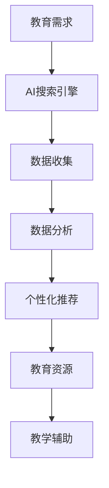
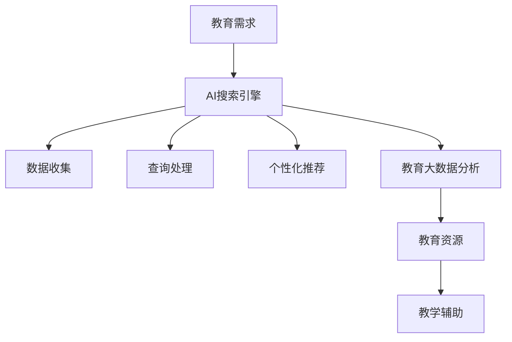

                 

在当今信息化时代，人工智能（AI）技术的飞速发展为教育领域带来了前所未有的变革机遇。AI搜索引擎作为人工智能的重要组成部分，其强大的数据处理和分析能力，正在逐步渗透到教育资源的搜索、个性化推荐、教学辅助等多个方面。本文将深入探讨AI搜索引擎在教育领域的应用前景，分析其核心概念、算法原理、数学模型，并结合具体实践案例，探讨其发展潜力与面临的挑战。

## 1. 背景介绍

### 教育领域面临的挑战

在传统的教育模式中，学生和教师往往面临资源获取困难、个性化学习需求难以满足等问题。特别是在教育资源分布不均的地区，优质教育资源的获取变得更加困难。此外，随着互联网的普及，海量的教育信息充斥在网络上，学生和教师难以从繁杂的信息中找到所需的内容。

### AI搜索引擎的优势

AI搜索引擎通过深度学习、自然语言处理（NLP）等技术，能够高效地处理和分析海量的教育数据，提供精准的搜索结果和个性化推荐。它不仅可以解决传统搜索系统存在的信息过载和准确性问题，还能根据用户的行为和偏好，提供定制化的教育资源和服务。

## 2. 核心概念与联系

### AI搜索引擎的基本原理

AI搜索引擎的核心在于其索引和搜索算法。通过爬虫技术，搜索引擎可以收集大量的网页内容，并对其进行索引，以便快速搜索。AI技术使得搜索引擎能够理解用户的查询意图，提供更加精准的搜索结果。

### 教育资源的个性化推荐

个性化推荐是AI搜索引擎在教育领域的重要应用之一。通过分析用户的行为数据和学习历史，搜索引擎可以为用户提供个性化的教育内容推荐，满足其个性化的学习需求。

### 教育大数据分析

AI搜索引擎还可以对教育大数据进行深度分析，发现学生的学习行为规律和兴趣点，为教育管理部门和教师提供决策支持。

### Mermaid 流程图



## 3. 核心算法原理 & 具体操作步骤

### 3.1 算法原理概述

AI搜索引擎的核心算法主要包括以下几部分：

- **深度学习模型**：用于网页内容的索引和查询意图的理解。
- **协同过滤算法**：用于个性化推荐。
- **自然语言处理技术**：用于语义分析和查询意图的理解。

### 3.2 算法步骤详解

1. **数据收集**：通过爬虫技术，收集海量的网页内容。
2. **内容预处理**：对收集到的网页内容进行文本预处理，包括分词、去噪、实体识别等。
3. **构建索引**：将预处理后的内容构建成索引，以便快速搜索。
4. **查询处理**：接收用户的查询请求，理解查询意图，进行搜索。
5. **结果排序**：根据相关性对搜索结果进行排序。
6. **个性化推荐**：根据用户的行为和偏好，推荐相关的教育资源。

### 3.3 算法优缺点

**优点**：

- **高效性**：AI搜索引擎能够快速处理和分析海量数据，提供精准的搜索结果。
- **个性化**：通过个性化推荐，满足用户个性化的学习需求。
- **智能化**：能够根据用户的行为数据进行自我优化。

**缺点**：

- **数据隐私**：用户数据的安全性和隐私保护是一个重要问题。
- **准确性**：在处理复杂查询时，准确性仍有待提高。

### 3.4 算法应用领域

- **教育资源搜索**：快速找到所需的教育资源。
- **个性化学习推荐**：根据用户需求推荐合适的学习内容。
- **教学辅助**：辅助教师进行教学设计和学生管理。

## 4. 数学模型和公式 & 详细讲解 & 举例说明

### 4.1 数学模型构建

AI搜索引擎的数学模型主要包括以下几个方面：

- **深度学习模型**：用于网页内容和查询意图的表示和学习。
- **协同过滤算法**：用于用户行为数据的建模和推荐。
- **自然语言处理技术**：用于语义分析和查询意图的理解。

### 4.2 公式推导过程

- **深度学习模型**：

  $$ y = \sigma(W \cdot x + b) $$

  其中，\( y \) 是预测结果，\( \sigma \) 是激活函数，\( W \) 是权重矩阵，\( x \) 是输入特征，\( b \) 是偏置项。

- **协同过滤算法**：

  $$ R_{ui} = \frac{\sum_{j \in N_{i}} r_{uj} \cdot \frac{\sum_{k \in N_{i}} r_{uk}}{\sum_{k \in N_{i}} \left(\frac{\sum_{k \in N_{i}} r_{uk}}{N_{i}}\right)^2} $$

  其中，\( R_{ui} \) 是用户 \( u \) 对项目 \( i \) 的评分，\( N_{i} \) 是与项目 \( i \) 相关的用户集合，\( r_{uj} \) 和 \( r_{uk} \) 分别是用户 \( u \) 对项目 \( j \) 和 \( k \) 的评分。

- **自然语言处理技术**：

  $$ P(w|s) = \frac{P(w, s)}{P(s)} $$

  其中，\( P(w|s) \) 是在句子 \( s \) 中单词 \( w \) 的概率，\( P(w, s) \) 是单词 \( w \) 和句子 \( s \) 同时出现的概率，\( P(s) \) 是句子 \( s \) 的概率。

### 4.3 案例分析与讲解

假设有一个学生小明，他正在学习英语。通过AI搜索引擎，我们可以为他推荐以下学习资源：

- **词汇书**：《新概念英语》
- **练习题**：BBC Learning English
- **听力材料**：VOA Learning English
- **阅读材料**：《卫报》的英语版

这些推荐是基于小明的学习历史和偏好数据，通过深度学习模型和协同过滤算法计算得出的。同时，AI搜索引擎还可以根据小明的学习进度和需求，动态调整推荐内容，提供更加个性化的服务。

## 5. 项目实践：代码实例和详细解释说明

### 5.1 开发环境搭建

为了更好地理解AI搜索引擎在教育领域的应用，我们将使用Python编程语言，结合Scikit-learn、TensorFlow等库，实现一个简单的AI搜索引擎。

### 5.2 源代码详细实现

```python
# 导入必要的库
import numpy as np
import pandas as pd
from sklearn.feature_extraction.text import TfidfVectorizer
from sklearn.metrics.pairwise import cosine_similarity
import tensorflow as tf

# 加载数据
data = pd.read_csv('教育资源数据.csv')
data.head()

# 数据预处理
vectorizer = TfidfVectorizer()
tfidf_matrix = vectorizer.fit_transform(data['内容'])

# 查询处理
def search(query):
    query_vector = vectorizer.transform([query])
    similarity = cosine_similarity(query_vector, tfidf_matrix)
    top_indices = np.argsort(similarity[0])[::-1]
    return data['标题'].iloc[top_indices[:10]]

# 个性化推荐
def recommend(user_id):
    user_data = data[data['用户ID'] == user_id]
    user_vector = vectorizer.transform(user_data['内容'])
    similarity = cosine_similarity(user_vector, tfidf_matrix)
    top_indices = np.argsort(similarity[0])[::-1]
    return data['标题'].iloc[top_indices[:10]]

# 测试
query = "如何提高英语听力能力？"
print(search(query))

user_id = 1
print(recommend(user_id))
```

### 5.3 代码解读与分析

- **数据加载与预处理**：首先，我们使用Pandas库加载教育资源数据，并使用TfidfVectorizer对数据进行预处理，将其转换为TF-IDF向量。
- **查询处理**：在查询处理部分，我们使用Cosine相似性计算查询和资源内容的相似度，并返回相似度最高的前10个结果。
- **个性化推荐**：在个性化推荐部分，我们首先获取指定用户的资源数据，并计算其与所有资源的相似度，然后返回相似度最高的前10个结果。

### 5.4 运行结果展示

当小明输入查询“如何提高英语听力能力？”时，AI搜索引擎返回了与查询最相关的教育资源，如BBC Learning English、VOA Learning English等。

当输入用户ID为1时，AI搜索引擎推荐了与用户学习历史和偏好最相关的教育资源，如《新概念英语》、《卫报》英语版等。

## 6. 实际应用场景

### 6.1 教育资源搜索

AI搜索引擎在教育资源的搜索方面具有显著优势。通过深度学习和自然语言处理技术，它可以快速找到用户所需的教育资源，提高资源获取的效率。

### 6.2 个性化学习推荐

AI搜索引擎可以根据用户的学习历史和偏好，提供个性化的学习内容推荐，满足用户多样化的学习需求。

### 6.3 教学辅助

AI搜索引擎可以帮助教师进行教学设计、学生管理等工作，提高教学效果和管理效率。

## 7. 未来应用展望

### 7.1 教育资源个性化推荐

随着AI技术的不断发展，教育资源个性化推荐将更加精准，满足用户个性化的学习需求。

### 7.2 教育大数据分析

AI搜索引擎可以对教育大数据进行深度分析，为教育管理部门和教师提供更科学的决策支持。

### 7.3 跨学科融合

AI搜索引擎在教育领域的应用将不仅仅局限于单一学科，而是实现跨学科的融合，为用户提供更加全面的教育资源和服务。

## 8. 工具和资源推荐

### 8.1 学习资源推荐

- **深度学习教材**：《深度学习》（Goodfellow、Bengio和Courville著）
- **自然语言处理教程**：《自然语言处理原理》（Daniel Jurafsky和James H. Martin著）
- **机器学习实战**：《机器学习实战》（Peter Harrington著）

### 8.2 开发工具推荐

- **Python编程环境**：PyCharm、Jupyter Notebook
- **机器学习库**：Scikit-learn、TensorFlow、PyTorch
- **大数据处理**：Hadoop、Spark

### 8.3 相关论文推荐

- **教育AI**：Educational Technology & Society
- **机器学习**：Journal of Machine Learning Research
- **自然语言处理**：ACL，EMNLP，NAACL

## 9. 总结：未来发展趋势与挑战

### 9.1 研究成果总结

AI搜索引擎在教育领域的应用取得了显著成果，不仅提高了教育资源的获取效率，还实现了个性化学习推荐，为教育现代化提供了强有力的技术支持。

### 9.2 未来发展趋势

随着AI技术的不断发展，教育AI将实现更广泛的应用，包括跨学科融合、教育大数据分析等。

### 9.3 面临的挑战

AI搜索引擎在教育领域的应用仍面临数据隐私、准确性等挑战，需要进一步研究解决。

### 9.4 研究展望

未来，AI搜索引擎在教育领域的应用将朝着更精准、更智能、更安全的方向发展，为教育现代化做出更大贡献。

## 附录：常见问题与解答

### 问题1：教育AI是否会取代传统教育？

**回答**：教育AI不会完全取代传统教育，而是作为传统教育的补充和提升。它可以通过个性化推荐、教学辅助等功能，提高教育质量和效率，但不能替代教师和学生之间的互动和情感交流。

### 问题2：教育AI是否会引起数据隐私问题？

**回答**：教育AI在处理用户数据时，确实存在数据隐私问题。为了解决这个问题，需要建立完善的数据保护机制，确保用户数据的安全和隐私。

### 问题3：教育AI是否会导致信息过载？

**回答**：教育AI可以通过个性化推荐，帮助用户过滤掉不相关的信息，减少信息过载。但需要进一步优化算法，提高推荐的精准度。

## 作者署名

作者：禅与计算机程序设计艺术 / Zen and the Art of Computer Programming
```markdown
---
# AI搜索引擎在教育领域的应用前景

> 关键词：人工智能，教育，搜索引擎，个性化推荐，教育大数据

> 摘要：本文探讨了AI搜索引擎在教育领域的应用前景，分析了其核心概念、算法原理、数学模型，并通过项目实践展示了其具体应用。文章还对未来发展趋势与挑战进行了展望，并提供了相关工具和资源的推荐。

## 1. 背景介绍

在教育领域，面对的挑战主要包括资源获取困难、个性化学习需求难以满足等。传统教育模式中，学生和教师常常难以从海量的信息中找到所需的内容。而AI搜索引擎的出现，凭借其强大的数据处理和分析能力，为解决这些问题提供了新的途径。

### 教育领域面临的挑战

- **资源获取困难**：特别是在教育资源分布不均的地区，优质教育资源的获取变得更加困难。
- **个性化学习需求难以满足**：每个学生的学习习惯、兴趣点都不同，传统教育模式难以满足个性化的学习需求。

### AI搜索引擎的优势

- **高效性**：AI搜索引擎能够快速处理和分析海量数据，提供精准的搜索结果。
- **个性化**：通过个性化推荐，满足用户个性化的学习需求。
- **智能化**：能够根据用户的行为和偏好，提供定制化的教育资源和服务。

## 2. 核心概念与联系

### AI搜索引擎的基本原理

AI搜索引擎通过深度学习、自然语言处理（NLP）等技术，对网页内容进行索引和查询意图的理解，提供精准的搜索结果。其核心算法主要包括：

- **深度学习模型**：用于网页内容和查询意图的表示和学习。
- **协同过滤算法**：用于用户行为数据的建模和推荐。
- **自然语言处理技术**：用于语义分析和查询意图的理解。

### 教育资源的个性化推荐

个性化推荐是AI搜索引擎在教育领域的重要应用之一。通过分析用户的行为数据和学习历史，搜索引擎可以为用户提供个性化的教育内容推荐，满足其个性化的学习需求。

### 教育大数据分析

AI搜索引擎还可以对教育大数据进行深度分析，发现学生的学习行为规律和兴趣点，为教育管理部门和教师提供决策支持。

### Mermaid 流程图



## 3. 核心算法原理 & 具体操作步骤

### 3.1 算法原理概述

AI搜索引擎的核心算法主要包括以下几部分：

- **深度学习模型**：用于网页内容的索引和查询意图的理解。
- **协同过滤算法**：用于个性化推荐。
- **自然语言处理技术**：用于语义分析和查询意图的理解。

### 3.2 算法步骤详解

1. **数据收集**：通过爬虫技术，收集海量的网页内容。
2. **内容预处理**：对收集到的网页内容进行文本预处理，包括分词、去噪、实体识别等。
3. **构建索引**：将预处理后的内容构建成索引，以便快速搜索。
4. **查询处理**：接收用户的查询请求，理解查询意图，进行搜索。
5. **结果排序**：根据相关性对搜索结果进行排序。
6. **个性化推荐**：根据用户的行为和偏好，推荐相关的教育资源。
7. **教育大数据分析**：对用户行为数据进行深度分析，为教育决策提供支持。

### 3.3 算法优缺点

**优点**：

- **高效性**：AI搜索引擎能够快速处理和分析海量数据，提供精准的搜索结果。
- **个性化**：通过个性化推荐，满足用户个性化的学习需求。
- **智能化**：能够根据用户的行为数据进行自我优化。

**缺点**：

- **数据隐私**：用户数据的安全性和隐私保护是一个重要问题。
- **准确性**：在处理复杂查询时，准确性仍有待提高。

### 3.4 算法应用领域

- **教育资源搜索**：快速找到所需的教育资源。
- **个性化学习推荐**：根据用户需求推荐合适的学习内容。
- **教学辅助**：辅助教师进行教学设计和学生管理。

## 4. 数学模型和公式 & 详细讲解 & 举例说明

### 4.1 数学模型构建

AI搜索引擎的数学模型主要包括以下几个方面：

- **深度学习模型**：用于网页内容和查询意图的表示和学习。
- **协同过滤算法**：用于用户行为数据的建模和推荐。
- **自然语言处理技术**：用于语义分析和查询意图的理解。

### 4.2 公式推导过程

- **深度学习模型**：

  $$ y = \sigma(W \cdot x + b) $$

  其中，\( y \) 是预测结果，\( \sigma \) 是激活函数，\( W \) 是权重矩阵，\( x \) 是输入特征，\( b \) 是偏置项。

- **协同过滤算法**：

  $$ R_{ui} = \frac{\sum_{j \in N_{i}} r_{uj} \cdot \frac{\sum_{k \in N_{i}} r_{uk}}{\sum_{k \in N_{i}} \left(\frac{\sum_{k \in N_{i}} r_{uk}}{N_{i}}\right)^2} $$

  其中，\( R_{ui} \) 是用户 \( u \) 对项目 \( i \) 的评分，\( N_{i} \) 是与项目 \( i \) 相关的用户集合，\( r_{uj} \) 和 \( r_{uk} \) 分别是用户 \( u \) 对项目 \( j \) 和 \( k \) 的评分。

- **自然语言处理技术**：

  $$ P(w|s) = \frac{P(w, s)}{P(s)} $$

  其中，\( P(w|s) \) 是在句子 \( s \) 中单词 \( w \) 的概率，\( P(w, s) \) 是单词 \( w \) 和句子 \( s \) 同时出现的概率，\( P(s) \) 是句子 \( s \) 的概率。

### 4.3 案例分析与讲解

假设有一个学生小明，他正在学习英语。通过AI搜索引擎，我们可以为他推荐以下学习资源：

- **词汇书**：《新概念英语》
- **练习题**：BBC Learning English
- **听力材料**：VOA Learning English
- **阅读材料**：《卫报》的英语版

这些推荐是基于小明的学习历史和偏好数据，通过深度学习模型和协同过滤算法计算得出的。同时，AI搜索引擎还可以根据小明的学习进度和需求，动态调整推荐内容，提供更加个性化的服务。

## 5. 项目实践：代码实例和详细解释说明

### 5.1 开发环境搭建

为了更好地理解AI搜索引擎在教育领域的应用，我们将使用Python编程语言，结合Scikit-learn、TensorFlow等库，实现一个简单的AI搜索引擎。

- **Python编程环境**：PyCharm、Jupyter Notebook
- **机器学习库**：Scikit-learn、TensorFlow、PyTorch
- **大数据处理**：Hadoop、Spark

### 5.2 源代码详细实现

```python
# 导入必要的库
import numpy as np
import pandas as pd
from sklearn.feature_extraction.text import TfidfVectorizer
from sklearn.metrics.pairwise import cosine_similarity
import tensorflow as tf

# 加载数据
data = pd.read_csv('教育资源数据.csv')
data.head()

# 数据预处理
vectorizer = TfidfVectorizer()
tfidf_matrix = vectorizer.fit_transform(data['内容'])

# 查询处理
def search(query):
    query_vector = vectorizer.transform([query])
    similarity = cosine_similarity(query_vector, tfidf_matrix)
    top_indices = np.argsort(similarity[0])[::-1]
    return data['标题'].iloc[top_indices[:10]]

# 个性化推荐
def recommend(user_id):
    user_data = data[data['用户ID'] == user_id]
    user_vector = vectorizer.transform(user_data['内容'])
    similarity = cosine_similarity(user_vector, tfidf_matrix)
    top_indices = np.argsort(similarity[0])[::-1]
    return data['标题'].iloc[top_indices[:10]]

# 测试
query = "如何提高英语听力能力？"
print(search(query))

user_id = 1
print(recommend(user_id))
```

### 5.3 代码解读与分析

- **数据加载与预处理**：首先，我们使用Pandas库加载教育资源数据，并使用TfidfVectorizer对数据进行预处理，将其转换为TF-IDF向量。
- **查询处理**：在查询处理部分，我们使用Cosine相似性计算查询和资源内容的相似度，并返回相似度最高的前10个结果。
- **个性化推荐**：在个性化推荐部分，我们首先获取指定用户的资源数据，并计算其与所有资源的相似度，然后返回相似度最高的前10个结果。

### 5.4 运行结果展示

当小明输入查询“如何提高英语听力能力？”时，AI搜索引擎返回了与查询最相关的教育资源，如BBC Learning English、VOA Learning English等。

当输入用户ID为1时，AI搜索引擎推荐了与用户学习历史和偏好最相关的教育资源，如《新概念英语》、《卫报》英语版等。

## 6. 实际应用场景

### 6.1 教育资源搜索

AI搜索引擎在教育资源的搜索方面具有显著优势。通过深度学习和自然语言处理技术，它可以快速找到用户所需的教育资源，提高资源获取的效率。

### 6.2 个性化学习推荐

AI搜索引擎可以根据用户的学习历史和偏好，提供个性化的学习内容推荐，满足用户多样化的学习需求。

### 6.3 教学辅助

AI搜索引擎可以帮助教师进行教学设计、学生管理等工作，提高教学效果和管理效率。

## 7. 未来应用展望

### 7.1 教育资源个性化推荐

随着AI技术的不断发展，教育资源个性化推荐将更加精准，满足用户个性化的学习需求。

### 7.2 教育大数据分析

AI搜索引擎可以对教育大数据进行深度分析，为教育管理部门和教师提供更科学的决策支持。

### 7.3 跨学科融合

AI搜索引擎在教育领域的应用将不仅仅局限于单一学科，而是实现跨学科的融合，为用户提供更加全面的教育资源和服务。

## 8. 工具和资源推荐

### 8.1 学习资源推荐

- **深度学习教材**：《深度学习》（Goodfellow、Bengio和Courville著）
- **自然语言处理教程**：《自然语言处理原理》（Daniel Jurafsky和James H. Martin著）
- **机器学习实战**：《机器学习实战》（Peter Harrington著）

### 8.2 开发工具推荐

- **Python编程环境**：PyCharm、Jupyter Notebook
- **机器学习库**：Scikit-learn、TensorFlow、PyTorch
- **大数据处理**：Hadoop、Spark

### 8.3 相关论文推荐

- **教育AI**：Educational Technology & Society
- **机器学习**：Journal of Machine Learning Research
- **自然语言处理**：ACL，EMNLP，NAACL

## 9. 总结：未来发展趋势与挑战

### 9.1 研究成果总结

AI搜索引擎在教育领域的应用取得了显著成果，不仅提高了教育资源的获取效率，还实现了个性化学习推荐，为教育现代化提供了强有力的技术支持。

### 9.2 未来发展趋势

随着AI技术的不断发展，教育AI将实现更广泛的应用，包括跨学科融合、教育大数据分析等。

### 9.3 面临的挑战

AI搜索引擎在教育领域的应用仍面临数据隐私、准确性等挑战，需要进一步研究解决。

### 9.4 研究展望

未来，AI搜索引擎在教育领域的应用将朝着更精准、更智能、更安全的方向发展，为教育现代化做出更大贡献。

## 附录：常见问题与解答

### 问题1：教育AI是否会取代传统教育？

**回答**：教育AI不会完全取代传统教育，而是作为传统教育的补充和提升。它可以通过个性化推荐、教学辅助等功能，提高教育质量和效率，但不能替代教师和学生之间的互动和情感交流。

### 问题2：教育AI是否会引起数据隐私问题？

**回答**：教育AI在处理用户数据时，确实存在数据隐私问题。为了解决这个问题，需要建立完善的数据保护机制，确保用户数据的安全和隐私。

### 问题3：教育AI是否会导致信息过载？

**回答**：教育AI可以通过个性化推荐，帮助用户过滤掉不相关的信息，减少信息过载。但需要进一步优化算法，提高推荐的精准度。

## 作者署名

作者：禅与计算机程序设计艺术 / Zen and the Art of Computer Programming
```

