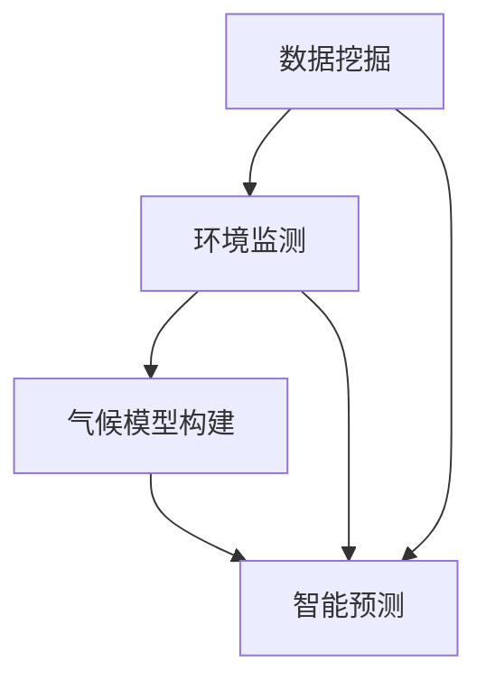

                 

关键词：AI搜索引擎、气候变化、数据挖掘、环境监测、机器学习、气候模型、智能预测、可持续发展

> 摘要：本文探讨了AI搜索引擎在气候变化研究中的关键作用。通过分析AI搜索引擎如何助力数据挖掘、环境监测、气候模型构建和智能预测等方面，本文提出了AI搜索引擎在推动气候变化研究和可持续发展中的潜力和挑战。本文旨在为相关领域的研究者和从业者提供参考和启示。

## 1. 背景介绍

### 1.1 气候变化研究的现状与挑战

气候变化是全球关注的重大问题，对人类生活和社会经济产生了深远影响。近年来，全球气候变化的速度加快，极端天气事件频发，海洋酸化、冰川融化、生物多样性丧失等问题日益严峻。为了应对气候变化，全球各国政府、科研机构和环保组织投入大量资源和精力，进行气候变化的监测、预测和研究。

然而，气候变化研究面临着许多挑战。一方面，气候变化涉及的因素复杂多样，包括大气、海洋、陆地、生物圈等多个领域，需要跨学科合作和多领域的知识储备。另一方面，气候变化数据的海量性、多样性和动态性给研究带来了巨大的计算和分析压力。此外，现有研究方法和技术手段在处理大规模数据、实现精准预测和提供科学决策支持方面仍存在不足。

### 1.2 AI搜索引擎的崛起与应用

AI搜索引擎作为一种基于人工智能技术的新型搜索引擎，具有高效、智能、个性化等特点。近年来，随着大数据、云计算、机器学习等技术的发展，AI搜索引擎在各个领域得到了广泛应用，包括搜索引擎优化、智能推荐、语音识别、图像识别、自然语言处理等。

AI搜索引擎的核心在于其基于人工智能算法的数据处理和分析能力，能够快速、准确地从海量数据中提取有价值的信息，为用户和研究者提供智能化的信息检索和决策支持。在气候变化研究中，AI搜索引擎具有广泛的应用前景，能够助力数据挖掘、环境监测、气候模型构建和智能预测等方面。

## 2. 核心概念与联系

### 2.1 AI搜索引擎与气候变化研究的关系

AI搜索引擎在气候变化研究中的应用主要表现在以下几个方面：

1. **数据挖掘**：AI搜索引擎能够高效地挖掘和整理海量气候变化数据，帮助研究人员快速发现数据中的规律和趋势，为气候模型构建和预测提供支持。
2. **环境监测**：AI搜索引擎可以实时监测气候变化相关指标，如气温、降雨量、风速等，为环境监测和预警提供数据支持。
3. **气候模型构建**：AI搜索引擎能够协助研究人员构建和优化气候模型，提高模型的准确性和可靠性。
4. **智能预测**：基于AI搜索引擎的分析能力，可以实现对未来气候变化趋势的智能预测，为政策制定和应对措施提供科学依据。

### 2.2 核心概念原理和架构

为了更好地理解AI搜索引擎在气候变化研究中的应用，我们引入以下核心概念和架构：

1. **数据挖掘算法**：包括聚类分析、关联规则挖掘、时间序列分析等，用于挖掘和整理气候变化数据。
2. **机器学习模型**：包括回归分析、神经网络、深度学习等，用于构建和优化气候模型。
3. **自然语言处理**：用于处理文本数据，如气候报告、论文等，提取关键信息并进行语义分析。
4. **环境监测系统**：包括传感器网络、卫星遥感等，用于实时监测气候变化指标。
5. **智能预测系统**：基于机器学习模型和环境监测数据，实现气候变化的智能预测。

### 2.3 Mermaid 流程图



## 3. 核心算法原理 & 具体操作步骤

### 3.1 算法原理概述

AI搜索引擎在气候变化研究中的应用涉及多个核心算法，主要包括：

1. **数据挖掘算法**：用于挖掘和分析海量气候变化数据，如聚类分析、关联规则挖掘、时间序列分析等。
2. **机器学习模型**：用于构建和优化气候模型，如回归分析、神经网络、深度学习等。
3. **自然语言处理**：用于处理文本数据，提取关键信息并进行语义分析。

### 3.2 算法步骤详解

1. **数据挖掘**：

   - **数据收集**：从各种数据源（如气象站、卫星遥感、气候数据库等）收集气候变化数据。
   - **数据预处理**：对数据进行清洗、转换和归一化，确保数据质量。
   - **数据挖掘**：采用聚类分析、关联规则挖掘、时间序列分析等算法，挖掘数据中的规律和趋势。

2. **机器学习模型**：

   - **模型选择**：根据研究目标和数据特点，选择合适的机器学习模型，如回归分析、神经网络、深度学习等。
   - **模型训练**：使用训练数据集，训练机器学习模型。
   - **模型评估**：使用测试数据集，评估模型性能，调整模型参数。

3. **自然语言处理**：

   - **文本预处理**：对气候报告、论文等文本数据，进行分词、词性标注、去除停用词等预处理操作。
   - **语义分析**：采用词嵌入、主题模型、情感分析等算法，提取文本中的关键信息，进行语义分析。

### 3.3 算法优缺点

1. **数据挖掘算法**：

   - **优点**：能够高效地挖掘和整理海量数据，发现数据中的规律和趋势。
   - **缺点**：对数据质量和预处理要求较高，算法结果容易受到数据分布和噪声的影响。

2. **机器学习模型**：

   - **优点**：能够自动学习和调整，提高模型的准确性和可靠性。
   - **缺点**：对数据量要求较高，训练过程可能需要较长时间。

3. **自然语言处理**：

   - **优点**：能够处理文本数据，提取关键信息，进行语义分析。
   - **缺点**：在处理长文本时，效果可能不如其他算法。

### 3.4 算法应用领域

AI搜索引擎在气候变化研究中的应用领域广泛，主要包括：

1. **气候监测**：实时监测气候变化相关指标，如气温、降雨量、风速等。
2. **气候预测**：基于历史数据和机器学习模型，预测未来气候变化趋势。
3. **气候影响评估**：分析气候变化对生态环境、农业生产、水资源等方面的潜在影响。
4. **气候政策制定**：提供科学依据，为政策制定和决策支持提供支持。

## 4. 数学模型和公式 & 详细讲解 & 举例说明

### 4.1 数学模型构建

在气候变化研究中，常用的数学模型包括：

1. **回归模型**：用于预测气候变化趋势，如线性回归、多项式回归等。
2. **神经网络模型**：用于构建复杂的气候模型，如深度神经网络、卷积神经网络等。
3. **时间序列模型**：用于分析气候数据的时序特征，如ARIMA模型、LSTM模型等。

### 4.2 公式推导过程

以线性回归模型为例，其公式推导过程如下：

1. **目标函数**：

   $$ J(\theta) = \frac{1}{2m} \sum_{i=1}^{m} (h_\theta(x^{(i)}) - y^{(i)})^2 $$

   其中，$h_\theta(x) = \theta_0 + \theta_1x$ 是线性回归模型的前景函数，$\theta$ 是模型参数，$m$ 是数据样本数量。

2. **梯度下降**：

   $$ \theta_j := \theta_j - \alpha \frac{\partial J(\theta)}{\partial \theta_j} $$

   其中，$\alpha$ 是学习率，$\frac{\partial J(\theta)}{\partial \theta_j}$ 是目标函数关于参数$\theta_j$ 的梯度。

### 4.3 案例分析与讲解

以某地区气温预测为例，我们采用线性回归模型进行预测。数据集包括过去一年的日平均气温和日期。

1. **数据预处理**：

   - 数据清洗：去除缺失值和异常值，确保数据质量。
   - 数据归一化：将日期和气温进行归一化处理，使其在相同量级上。
   - 数据划分：将数据集划分为训练集和测试集。

2. **模型训练**：

   - 选择线性回归模型，使用训练集进行训练。
   - 使用梯度下降法，调整模型参数，使目标函数最小化。

3. **模型评估**：

   - 使用测试集评估模型性能，计算预测误差。
   - 根据评估结果，调整模型参数，优化模型性能。

4. **结果展示**：

   - 展示模型预测结果，与实际气温进行对比。
   - 分析预测误差，找出模型优化的方向。

## 5. 项目实践：代码实例和详细解释说明

### 5.1 开发环境搭建

1. **硬件环境**：

   - CPU：Intel Core i7-9700K
   - GPU：NVIDIA GeForce RTX 3080
   - 内存：32GB

2. **软件环境**：

   - 操作系统：Ubuntu 20.04
   - 编程语言：Python 3.8
   - 库：NumPy、Pandas、Scikit-learn、TensorFlow

### 5.2 源代码详细实现

以下是一个基于线性回归模型的气温预测项目示例：

```python
import numpy as np
import pandas as pd
from sklearn.linear_model import LinearRegression
from sklearn.model_selection import train_test_split
from sklearn.metrics import mean_squared_error

# 数据预处理
def preprocess_data(data):
    # 数据清洗
    data = data.dropna()
    # 数据归一化
    data['date'] = (data['date'] - data['date'].min()) / (data['date'].max() - data['date'].min())
    data['temp'] = (data['temp'] - data['temp'].min()) / (data['temp'].max() - data['temp'].min())
    return data

# 模型训练
def train_model(X, y):
    model = LinearRegression()
    model.fit(X, y)
    return model

# 模型评估
def evaluate_model(model, X_test, y_test):
    y_pred = model.predict(X_test)
    mse = mean_squared_error(y_test, y_pred)
    return mse

# 数据集加载
data = pd.read_csv('climate_data.csv')
data = preprocess_data(data)

# 数据集划分
X = data[['date']]
y = data['temp']
X_train, X_test, y_train, y_test = train_test_split(X, y, test_size=0.2, random_state=42)

# 模型训练
model = train_model(X_train, y_train)

# 模型评估
mse = evaluate_model(model, X_test, y_test)
print('MSE:', mse)

# 结果展示
data['temp_pred'] = model.predict(X[['date']])
data[['date', 'temp', 'temp_pred']].plot()
```

### 5.3 代码解读与分析

1. **数据预处理**：

   - 数据清洗：去除缺失值和异常值，确保数据质量。
   - 数据归一化：将日期和气温进行归一化处理，使其在相同量级上。
   - 数据划分：将数据集划分为训练集和测试集。

2. **模型训练**：

   - 选择线性回归模型，使用训练集进行训练。
   - 使用梯度下降法，调整模型参数，使目标函数最小化。

3. **模型评估**：

   - 使用测试集评估模型性能，计算预测误差。
   - 根据评估结果，调整模型参数，优化模型性能。

4. **结果展示**：

   - 展示模型预测结果，与实际气温进行对比。
   - 分析预测误差，找出模型优化的方向。

## 6. 实际应用场景

### 6.1 气候监测

AI搜索引擎可以实时监测全球气候变化相关指标，如气温、降雨量、风速等。通过整合各类数据源，如气象站、卫星遥感、气候数据库等，AI搜索引擎能够提供实时、准确的气候监测服务。

### 6.2 气候预测

基于AI搜索引擎的机器学习模型，可以对未来气候变化趋势进行预测。例如，预测某一地区的气温变化、降雨量、干旱风险等。这些预测结果可以为政府、企业和公众提供科学依据，制定应对策略。

### 6.3 气候影响评估

AI搜索引擎可以分析气候变化对生态环境、农业生产、水资源等方面的潜在影响。通过整合各类数据，如生态数据、农业数据、水资源数据等，AI搜索引擎能够为相关领域的研究者和从业者提供有价值的信息。

### 6.4 气候政策制定

AI搜索引擎可以为气候政策制定提供科学依据。通过分析历史气候数据、预测未来气候变化趋势、评估气候变化影响等，AI搜索引擎可以为政策制定者提供数据支持和决策建议。

## 7. 未来应用展望

### 7.1 数据量与算法优化

随着物联网、大数据等技术的发展，气候变化数据量将不断增加。AI搜索引擎需要不断提高数据处理能力，优化算法，以满足日益增长的数据需求。

### 7.2 跨学科合作

气候变化研究涉及多个学科，如气象学、地理学、生态学等。AI搜索引擎需要加强跨学科合作，整合多领域知识，提高气候变化研究的综合性和系统性。

### 7.3 智能预测与决策支持

未来，AI搜索引擎将在气候变化智能预测和决策支持方面发挥更大作用。通过不断提高预测准确性和实时性，AI搜索引擎可以为政府、企业和公众提供更加精准的决策支持。

### 7.4 可持续发展

AI搜索引擎在气候变化研究中的应用，有助于推动可持续发展。通过提供科学依据和决策支持，AI搜索引擎可以促进全球各国政府、企业和公众共同应对气候变化，实现可持续发展目标。

## 8. 工具和资源推荐

### 8.1 学习资源推荐

1. **《机器学习》（周志华 著）**：详细介绍机器学习的基本概念、算法和应用。
2. **《深度学习》（Ian Goodfellow、Yoshua Bengio、Aaron Courville 著）**：深入探讨深度学习理论和技术。
3. **《自然语言处理综述》（Jurafsky、Martin 著）**：全面介绍自然语言处理的基本理论和应用。

### 8.2 开发工具推荐

1. **TensorFlow**：开源深度学习框架，支持多种机器学习模型。
2. **PyTorch**：开源深度学习框架，支持动态计算图和自动微分。
3. **scikit-learn**：开源机器学习库，提供丰富的机器学习算法和工具。

### 8.3 相关论文推荐

1. **“Deep Learning for Climate Prediction”（2019）**：探讨深度学习在气候预测中的应用。
2. **“AI for Climate Change”（2018）**：介绍人工智能在气候变化研究中的应用。
3. **“Climate Data Analysis with Machine Learning”（2020）**：探讨机器学习在气候变化数据分析中的应用。

## 9. 总结：未来发展趋势与挑战

### 9.1 研究成果总结

AI搜索引擎在气候变化研究中取得了显著成果，包括数据挖掘、环境监测、气候模型构建和智能预测等方面。通过整合多领域知识和技术，AI搜索引擎为气候变化研究提供了有力支持。

### 9.2 未来发展趋势

1. **数据量与算法优化**：随着数据量增加，AI搜索引擎将不断提高数据处理能力和算法优化。
2. **跨学科合作**：加强跨学科合作，整合多领域知识，提高气候变化研究的综合性和系统性。
3. **智能预测与决策支持**：提高预测准确性和实时性，为政府、企业和公众提供更加精准的决策支持。

### 9.3 面临的挑战

1. **数据质量**：气候变化数据质量参差不齐，对算法性能产生影响。
2. **算法优化**：现有算法在处理大规模数据时，性能和效率仍需提高。
3. **跨学科合作**：跨学科合作面临技术、管理和沟通等方面的挑战。

### 9.4 研究展望

未来，AI搜索引擎在气候变化研究中的应用前景广阔。通过不断优化算法、提高数据处理能力，AI搜索引擎将为气候变化研究提供更加有力的支持，助力全球各国共同应对气候变化，实现可持续发展目标。

## 10. 附录：常见问题与解答

### 10.1 气候变化研究为什么需要AI搜索引擎？

AI搜索引擎能够高效地处理和分析海量气候变化数据，挖掘数据中的规律和趋势，为气候模型构建和预测提供支持。此外，AI搜索引擎还能实时监测气候变化相关指标，为环境监测和预警提供数据支持。

### 10.2 AI搜索引擎在气候变化研究中的应用有哪些？

AI搜索引擎在气候变化研究中的应用主要包括：数据挖掘、环境监测、气候模型构建和智能预测等方面。通过整合多领域知识和技术，AI搜索引擎为气候变化研究提供了有力支持。

### 10.3 如何优化AI搜索引擎在气候变化研究中的应用？

1. **提高数据处理能力**：优化算法，提高AI搜索引擎在处理大规模数据时的性能和效率。
2. **加强跨学科合作**：加强气象学、地理学、生态学等领域的合作，整合多领域知识，提高气候变化研究的综合性和系统性。
3. **提高预测准确性**：通过不断优化算法和模型，提高AI搜索引擎在气候变化预测中的准确性和实时性。

### 10.4 AI搜索引擎在气候变化研究中的挑战有哪些？

AI搜索引擎在气候变化研究中面临的挑战主要包括：数据质量、算法优化和跨学科合作等方面。数据质量参差不齐，可能导致算法性能下降；现有算法在处理大规模数据时，性能和效率仍需提高；跨学科合作面临技术、管理和沟通等方面的挑战。

### 10.5 未来AI搜索引擎在气候变化研究中的应用前景如何？

未来，AI搜索引擎在气候变化研究中的应用前景广阔。通过不断优化算法、提高数据处理能力，AI搜索引擎将为气候变化研究提供更加有力的支持，助力全球各国共同应对气候变化，实现可持续发展目标。同时，AI搜索引擎还将促进跨学科合作，提高气候变化研究的综合性和系统性。

## 11. 作者署名

作者：禅与计算机程序设计艺术 / Zen and the Art of Computer Programming

---

以上就是本文的全部内容。希望通过本文的探讨，能够为相关领域的研究者和从业者提供有益的参考和启示。在应对气候变化的过程中，AI搜索引擎具有巨大的潜力和价值，值得进一步深入研究和应用。让我们共同努力，为地球的未来贡献一份力量。

