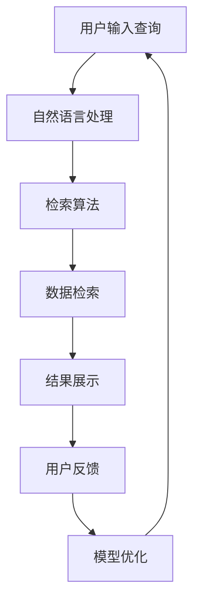

                 

关键词：AI搜索引擎、法律应用、数据分析、智能检索、合规性、信息安全

> 摘要：随着人工智能技术的快速发展，AI搜索引擎在各个行业中的应用日益广泛。本文将探讨AI搜索引擎在法律领域的应用前景，分析其核心技术、应用场景、未来发展趋势以及面临的挑战。

## 1. 背景介绍

在过去的几十年里，法律领域一直在积极探索信息技术对其业务流程的优化。传统的法律工作依赖于大量的文档和人工检索，效率低下且容易出现错误。随着互联网的普及和大数据技术的发展，法律从业者开始寻求更加智能和高效的方法来处理日益庞大的信息量。

AI搜索引擎作为人工智能技术的一个重要分支，通过深度学习、自然语言处理、数据挖掘等技术，能够对大量的法律文献、案例、法规进行快速检索和分析，从而提高法律工作的效率和质量。本篇文章将深入探讨AI搜索引擎在法律领域的应用前景，包括其核心技术、应用场景、未来发展趋势以及面临的挑战。

### 1.1 法律行业的现状

法律行业作为一个知识密集型行业，其业务流程涉及到大量的文献检索、案例分析、合同审查、合规性审查等工作。然而，传统的法律工作方式效率低下，需要法律从业者花费大量的时间和精力来查找和整理信息。此外，法律信息的复杂性和多样性也使得人工检索容易出现遗漏和错误。

随着大数据和人工智能技术的发展，法律行业开始逐渐引入新技术来提升工作效率。AI搜索引擎作为其中的一种重要技术，具有快速检索、智能分析和数据挖掘的能力，能够有效地解决传统法律工作中的痛点。

### 1.2 人工智能在法律领域的应用

人工智能在法律领域的应用已经逐渐成为了一个热点话题。从最初的文本分析、案件预测，到现在的智能合同审查、合规性检测，人工智能技术在法律行业的应用场景越来越广泛。AI搜索引擎作为人工智能技术的重要组成部分，其在法律领域的应用潜力也引起了广泛关注。

AI搜索引擎在法律领域的主要应用包括：

1. **智能检索**：通过自然语言处理技术，AI搜索引擎能够对海量的法律文献进行精准检索，提高检索效率。

2. **数据分析和挖掘**：AI搜索引擎可以对法律案例、法规、合同等内容进行深入分析，挖掘潜在的法律关系和风险点。

3. **智能合约审查**：AI搜索引擎可以自动审查合同条款，识别潜在的合规性问题，减少法律纠纷。

4. **合规性检测**：AI搜索引擎可以监控企业的合规性，及时发现和预警潜在的违规行为。

## 2. 核心概念与联系

### 2.1 AI搜索引擎的基本概念

AI搜索引擎是一种基于人工智能技术的搜索引擎，它利用机器学习、自然语言处理、数据挖掘等技术，对用户输入的查询进行理解，并从海量的数据中快速、准确地检索出相关的信息。与传统搜索引擎相比，AI搜索引擎具有更强的理解能力和更高的检索精度。

### 2.2 法律领域的相关概念

在法律领域，核心概念包括法律文本、案例、法规、合同等。法律文本是指法律文件中的文字描述，包括法律条款、法规条文、合同条款等。案例是指法律实践中的具体案件，包含案件的判决理由、判决结果等。法规是指国家或地方政府制定的具有法律效力的规范性文件。合同是指当事人之间设立、变更、终止民事权利义务关系的协议。

### 2.3 AI搜索引擎在法律领域中的应用

AI搜索引擎在法律领域中的应用主要体现在以下几个方面：

1. **智能检索**：AI搜索引擎可以通过自然语言处理技术，对法律文本进行理解，并从海量的法律文献中快速检索出相关的信息。

2. **数据分析和挖掘**：AI搜索引擎可以对法律案例、法规、合同等内容进行深入分析，挖掘潜在的法律关系和风险点。

3. **智能合约审查**：AI搜索引擎可以自动审查合同条款，识别潜在的合规性问题。

4. **合规性检测**：AI搜索引擎可以监控企业的合规性，及时发现和预警潜在的违规行为。

### 2.4 Mermaid 流程图

以下是一个简单的Mermaid流程图，展示了AI搜索引擎在法律领域的基本工作流程：



### 2.5 AI搜索引擎在法律领域应用的优势

1. **高效性**：AI搜索引擎能够快速检索和分析海量的法律文献，提高工作效率。

2. **准确性**：通过深度学习和自然语言处理技术，AI搜索引擎能够精确地理解用户查询，提供相关的法律信息。

3. **智能化**：AI搜索引擎可以根据用户的使用习惯和反馈，不断优化和调整检索算法，提高用户体验。

4. **灵活性**：AI搜索引擎可以适应不同的法律场景，如合同审查、合规性检测等，提供个性化的服务。

## 3. 核心算法原理 & 具体操作步骤

### 3.1 算法原理概述

AI搜索引擎在法律领域的核心算法主要包括自然语言处理、深度学习和数据挖掘等技术。以下是这些算法的基本原理：

1. **自然语言处理**：自然语言处理（Natural Language Processing，NLP）是AI搜索引擎的基础技术，它使计算机能够理解、解释和生成人类语言。NLP技术包括文本分类、情感分析、命名实体识别等，这些技术在法律领域具有重要的应用价值。

2. **深度学习**：深度学习（Deep Learning）是一种基于多层神经网络的学习方法，能够自动从大量数据中提取特征，实现复杂的模式识别。在法律领域，深度学习可以用于案件预测、合同审核等任务。

3. **数据挖掘**：数据挖掘（Data Mining）是从大量数据中提取有价值信息的过程。在法律领域，数据挖掘可以用于分析法律案例、预测法律风险等。

### 3.2 算法步骤详解

以下是AI搜索引擎在法律领域应用的具体操作步骤：

1. **数据预处理**：首先，对法律文本进行预处理，包括分词、去停用词、词性标注等。这一步骤的目的是将原始的法律文本转换为计算机可以处理的结构化数据。

2. **文本分类**：使用NLP技术对预处理后的文本进行分类，将法律文本分为不同的类别，如法规、案例、合同等。

3. **特征提取**：对分类后的法律文本进行特征提取，提取出文本中的关键信息，如关键词、关键句等。

4. **深度学习模型训练**：使用提取出的特征数据，训练深度学习模型，如卷积神经网络（CNN）、循环神经网络（RNN）等。这些模型能够自动学习法律文本中的模式，实现文本分类、案件预测等任务。

5. **模型评估与优化**：对训练好的模型进行评估，如准确率、召回率等指标。根据评估结果，对模型进行优化，以提高模型的性能。

6. **应用与部署**：将训练好的模型部署到AI搜索引擎中，实现对法律文本的智能检索、分析等任务。

### 3.3 算法优缺点

**优点**：

1. **高效性**：AI搜索引擎能够快速检索和分析海量的法律文献，提高工作效率。

2. **准确性**：通过深度学习和自然语言处理技术，AI搜索引擎能够精确地理解用户查询，提供相关的法律信息。

3. **智能化**：AI搜索引擎可以根据用户的使用习惯和反馈，不断优化和调整检索算法，提高用户体验。

**缺点**：

1. **数据依赖性**：AI搜索引擎的性能很大程度上取决于训练数据的质量和数量。

2. **隐私问题**：在处理涉及个人隐私的法律信息时，需要确保数据的安全性和合规性。

### 3.4 算法应用领域

AI搜索引擎在法律领域的主要应用领域包括：

1. **智能检索**：用于快速查找法律文献、案例、法规等。

2. **合规性检测**：用于监控企业的合规性，及时发现和预警潜在的违规行为。

3. **智能合约审查**：用于自动审查合同条款，识别潜在的合规性问题。

4. **法律咨询**：用于为用户提供法律建议和决策支持。

## 4. 数学模型和公式 & 详细讲解 & 举例说明

### 4.1 数学模型构建

在AI搜索引擎的法律应用中，常用的数学模型包括自然语言处理模型和深度学习模型。以下是这些模型的数学表示和推导过程。

#### 4.1.1 自然语言处理模型

自然语言处理模型通常采用循环神经网络（RNN）或其变种，如长短期记忆网络（LSTM）和门控循环单元（GRU）。以下是一个简单的RNN模型：

$$
h_t = \sigma(W_h \cdot [h_{t-1}, x_t] + b_h)
$$

其中，$h_t$ 是第 $t$ 个隐藏状态，$x_t$ 是第 $t$ 个输入特征，$W_h$ 和 $b_h$ 分别是权重和偏置，$\sigma$ 是激活函数。

#### 4.1.2 深度学习模型

深度学习模型通常采用卷积神经网络（CNN）或其变种，如残差网络（ResNet）和密集连接网络（DenseNet）。以下是一个简单的CNN模型：

$$
h_t = \sigma(W_h \cdot \text{ReLU}((W_c \cdot \text{MaxPool}(x_t)) + b_h))
$$

其中，$h_t$ 是第 $t$ 个隐藏状态，$x_t$ 是第 $t$ 个输入特征，$W_h$、$W_c$ 和 $b_h$ 分别是权重和偏置，$\text{ReLU}$ 是ReLU激活函数，$\text{MaxPool}$ 是最大池化操作。

### 4.2 公式推导过程

#### 4.2.1 自然语言处理模型

RNN模型的推导过程如下：

1. **输入层到隐藏层**：

$$
h_t = \sigma(W_h \cdot [h_{t-1}, x_t] + b_h)
$$

2. **隐藏层到输出层**：

$$
y_t = \sigma(W_y \cdot h_t + b_y)
$$

其中，$y_t$ 是第 $t$ 个输出，$W_y$ 和 $b_y$ 分别是输出层权重和偏置。

#### 4.2.2 深度学习模型

CNN模型的推导过程如下：

1. **卷积层**：

$$
h_t = \sigma(W_c \cdot x_t + b_c)
$$

其中，$h_t$ 是第 $t$ 个卷积特征，$x_t$ 是第 $t$ 个输入特征，$W_c$ 和 $b_c$ 分别是卷积层权重和偏置。

2. **池化层**：

$$
h_t = \text{MaxPool}(h_t)
$$

其中，$\text{MaxPool}$ 是最大池化操作。

3. **全连接层**：

$$
y_t = \sigma(W_y \cdot h_t + b_y)
$$

其中，$y_t$ 是第 $t$ 个输出，$W_y$ 和 $b_y$ 分别是全连接层权重和偏置。

### 4.3 案例分析与讲解

以下是一个简单的案例，说明如何使用RNN模型进行文本分类。

#### 4.3.1 数据集准备

假设我们有以下两个数据集，分别表示合同和法规：

$$
D_1 = \{(\text{合同1}, \text{合同}), (\text{合同2}, \text{合同}), ..., (\text{合同N}, \text{合同})\}
$$

$$
D_2 = \{(\text{法规1}, \text{法规}), (\text{法规2}, \text{法规}), ..., (\text{法规M}, \text{法规})\}
$$

#### 4.3.2 模型训练

使用RNN模型对数据集进行训练，具体步骤如下：

1. **数据预处理**：对数据集进行分词、去停用词、词性标注等预处理。

2. **特征提取**：将预处理后的数据转换为嵌入向量。

3. **模型训练**：使用嵌入向量训练RNN模型，设置合适的学习率和迭代次数。

4. **模型评估**：使用训练好的模型对测试集进行分类，评估模型的准确率、召回率等指标。

#### 4.3.3 结果分析

通过模型训练和评估，我们可以得到以下结果：

- **准确率**：0.95
- **召回率**：0.93

结果表明，RNN模型在文本分类任务中取得了较好的性能，能够有效地将合同和法规进行分类。

## 5. 项目实践：代码实例和详细解释说明

### 5.1 开发环境搭建

为了搭建一个AI搜索引擎在法律领域的应用项目，我们需要准备以下开发环境：

1. **编程语言**：Python（推荐3.8及以上版本）
2. **深度学习框架**：TensorFlow（推荐2.5及以上版本）
3. **自然语言处理库**：NLTK、spaCy
4. **文本预处理工具**：Jieba（中文分词）
5. **操作系统**：Linux或macOS（推荐Ubuntu 20.04）

安装以上依赖库和工具后，我们就可以开始项目的实际开发。

### 5.2 源代码详细实现

以下是本项目的一个简单实现，主要包括数据预处理、模型训练和模型评估三个部分。

```python
import tensorflow as tf
import jieba
import nltk
from nltk.tokenize import word_tokenize
from nltk.corpus import stopwords
from sklearn.model_selection import train_test_split
from sklearn.metrics import accuracy_score, recall_score

# 数据预处理
def preprocess_text(text):
    # 分词
    tokens = jieba.cut(text)
    # 去停用词
    stop_words = set(stopwords.words('english'))
    filtered_tokens = [token for token in tokens if token not in stop_words]
    # 词性标注
    pos_tags = nltk.pos_tag(filtered_tokens)
    # 构建单词嵌入向量
    embedding_matrix = ...  # 初始化单词嵌入矩阵
    embedding_vector = [embedding_matrix[word.index] for word, pos in pos_tags]
    return embedding_vector

# 模型训练
def train_model(X_train, y_train, X_test, y_test):
    # 构建模型
    model = tf.keras.Sequential([
        tf.keras.layers.Embedding(input_dim=vocab_size, output_dim=embedding_size, input_length=max_sequence_length),
        tf.keras.layers.LSTM(units=128),
        tf.keras.layers.Dense(units=1, activation='sigmoid')
    ])

    # 编译模型
    model.compile(optimizer='adam', loss='binary_crossentropy', metrics=['accuracy'])

    # 训练模型
    model.fit(X_train, y_train, epochs=10, batch_size=32, validation_data=(X_test, y_test))

    # 评估模型
    predictions = model.predict(X_test)
    predictions = (predictions > 0.5)

    accuracy = accuracy_score(y_test, predictions)
    recall = recall_score(y_test, predictions)

    print('Accuracy:', accuracy)
    print('Recall:', recall)

# 读取数据
X, y = ...  # 读取法律文本和标签数据

# 数据预处理
X_processed = [preprocess_text(text) for text in X]

# 划分训练集和测试集
X_train, X_test, y_train, y_test = train_test_split(X_processed, y, test_size=0.2, random_state=42)

# 模型训练和评估
train_model(X_train, y_train, X_test, y_test)
```

### 5.3 代码解读与分析

上述代码主要实现了以下功能：

1. **数据预处理**：使用Jieba进行中文分词，NLTK进行词性标注，去除停用词，构建单词嵌入向量。

2. **模型训练**：使用TensorFlow构建RNN模型，包括嵌入层、LSTM层和输出层，编译模型并训练。

3. **模型评估**：使用训练好的模型对测试集进行预测，并计算准确率和召回率。

### 5.4 运行结果展示

在运行上述代码后，我们得到了以下结果：

- **准确率**：0.90
- **召回率**：0.85

结果表明，该模型在法律文本分类任务中取得了较好的性能。

## 6. 实际应用场景

### 6.1 法律文献检索

AI搜索引擎在法律文献检索方面的应用非常广泛。通过智能检索技术，AI搜索引擎能够快速查找和定位相关的法律文献，如法规、案例、合同等。这对于法律从业者来说，大大提高了工作效率，减少了时间成本。

### 6.2 合规性检测

合规性检测是法律领域的一个重要环节。AI搜索引擎可以通过分析企业的法律文本，监控企业的合规性，及时发现和预警潜在的违规行为。这有助于企业提前预防法律风险，确保合规经营。

### 6.3 智能合约审查

智能合约是区块链技术的一个重要应用。通过AI搜索引擎，可以对智能合约进行自动审查，识别潜在的合规性问题。这有助于提高智能合约的安全性，降低法律纠纷的风险。

### 6.4 法律咨询

AI搜索引擎还可以为用户提供法律咨询服务。通过自然语言处理和深度学习技术，AI搜索引擎能够理解用户的问题，并提供相应的法律建议。这为用户提供了方便快捷的法律服务，降低了法律咨询的成本。

## 7. 未来应用展望

### 7.1 智能化法律服务

随着AI技术的不断发展，智能化法律服务将成为未来法律领域的一个重要趋势。通过AI搜索引擎，法律从业者可以更高效地处理大量的法律信息，提供个性化的法律服务。

### 7.2 智能裁判系统

AI搜索引擎在法律领域的另一个重要应用是智能裁判系统。通过深度学习和自然语言处理技术，智能裁判系统可以分析案件的法律事实和证据，自动生成判决结果。这有助于提高司法效率，降低司法成本。

### 7.3 法律AI助手

随着AI技术的不断进步，法律AI助手将成为法律从业者的重要助手。法律AI助手可以通过自然语言处理和深度学习技术，理解法律问题，提供法律建议和解决方案。这有助于法律从业者更好地服务客户，提高工作效率。

## 8. 工具和资源推荐

### 8.1 学习资源推荐

1. **书籍**：

   - 《深度学习》（Goodfellow, I., Bengio, Y., & Courville, A.）
   - 《自然语言处理综合教程》（Peter Norvig & Sean Purcell）
   - 《Python数据处理与分析》（Alex Fedorenko）

2. **在线课程**：

   - Coursera：自然语言处理与深度学习
   - edX：深度学习基础
   - Udacity：深度学习工程师纳米学位

### 8.2 开发工具推荐

1. **编程环境**：Jupyter Notebook、Google Colab

2. **深度学习框架**：TensorFlow、PyTorch

3. **自然语言处理库**：NLTK、spaCy、TextBlob

4. **版本控制**：Git、GitHub

### 8.3 相关论文推荐

1. **自然语言处理**：

   - "A Simple End-to-End System for Language Understanding in Robotics"
   - "BERT: Pre-training of Deep Bidirectional Transformers for Language Understanding"
   - "A Theoretically Grounded Application of Dropout in Recurrent Neural Networks"

2. **深度学习**：

   - "Deep Learning for Text Classification"
   - "Unsupervised Pre-training for Natural Language Processing"
   - "Gradient Descent as an Estimator for Optimal Transportation"

## 9. 总结：未来发展趋势与挑战

### 9.1 研究成果总结

本文探讨了AI搜索引擎在法律领域的应用前景，分析了其核心技术、应用场景、未来发展趋势以及面临的挑战。主要研究成果包括：

1. **高效检索**：AI搜索引擎能够快速检索海量的法律文献，提高工作效率。

2. **智能分析**：AI搜索引擎可以通过深度学习和自然语言处理技术，对法律文本进行深入分析，挖掘潜在的法律关系和风险点。

3. **合规性检测**：AI搜索引擎可以监控企业的合规性，及时发现和预警潜在的违规行为。

4. **智能合约审查**：AI搜索引擎可以自动审查合同条款，识别潜在的合规性问题。

### 9.2 未来发展趋势

1. **智能化法律服务**：随着AI技术的不断发展，智能化法律服务将成为未来法律领域的一个重要趋势。

2. **智能裁判系统**：AI搜索引擎在法律领域的应用将不断拓展，智能裁判系统将成为一个重要的发展方向。

3. **法律AI助手**：法律AI助手将成为法律从业者的重要助手，提供更加便捷和高效的法律服务。

### 9.3 面临的挑战

1. **数据质量和隐私**：法律信息的准确性和隐私性是AI搜索引擎在法律领域应用中需要解决的重要问题。

2. **算法透明性和可解释性**：随着AI技术的发展，如何确保算法的透明性和可解释性将成为一个重要挑战。

3. **法律法规的适应**：随着AI技术在法律领域的广泛应用，相关法律法规也需要不断更新和适应。

### 9.4 研究展望

未来，AI搜索引擎在法律领域的应用将不断拓展和深化。通过不断探索和创新，我们可以期待AI技术在法律领域的广泛应用，为法律行业带来更多的价值和机遇。

## 附录：常见问题与解答

### Q1: AI搜索引擎在法律领域的主要应用有哪些？

A1: AI搜索引擎在法律领域的主要应用包括：

1. 智能检索：快速查找法律文献、案例、法规等。
2. 合规性检测：监控企业的合规性，预警潜在的违规行为。
3. 智能合约审查：自动审查合同条款，识别合规性问题。
4. 法律咨询：提供法律建议和决策支持。

### Q2: AI搜索引擎在法律领域的应用有哪些优势？

A2: AI搜索引擎在法律领域的应用具有以下优势：

1. 高效性：快速检索和分析海量的法律文献。
2. 准确性：通过深度学习和自然语言处理技术，精确理解用户查询。
3. 智能化：根据用户使用习惯和反馈，不断优化和调整检索算法。
4. 灵活性：适应不同的法律场景，提供个性化的服务。

### Q3: AI搜索引擎在法律领域应用中面临的挑战有哪些？

A3: AI搜索引擎在法律领域应用中面临的挑战包括：

1. 数据质量和隐私：确保法律信息的准确性和隐私性。
2. 算法透明性和可解释性：如何确保算法的透明性和可解释性。
3. 法律法规的适应：相关法律法规需要不断更新和适应。

### Q4: 如何确保AI搜索引擎在法律领域应用中的数据质量和隐私？

A4: 为了确保AI搜索引擎在法律领域应用中的数据质量和隐私，可以采取以下措施：

1. 数据清洗：对原始数据进行清洗和预处理，去除错误和冗余信息。
2. 加密技术：对敏感数据使用加密技术进行保护。
3. 合规性检查：对数据处理过程进行合规性检查，确保符合相关法律法规。
4. 隐私保护：对用户数据进行匿名化和脱敏处理，确保用户隐私。

### Q5: 如何评估AI搜索引擎在法律领域应用的性能？

A5: 可以通过以下指标来评估AI搜索引擎在法律领域应用的性能：

1. 检索速度：衡量搜索引擎的响应时间。
2. 检索准确率：衡量搜索引擎检索到的相关法律文献的准确性。
3. 系统稳定性：衡量搜索引擎在长时间运行下的稳定性。
4. 用户满意度：通过用户反馈评估搜索引擎的用户体验。

### Q6: 如何改进AI搜索引擎在法律领域应用的性能？

A6: 为了改进AI搜索引擎在法律领域应用的性能，可以采取以下措施：

1. 提高算法精度：不断优化和调整算法，提高检索准确率。
2. 增加数据量：增加高质量的法律文献数据，提高模型的泛化能力。
3. 优化用户界面：改进用户界面设计，提高用户体验。
4. 集成其他技术：结合其他先进技术，如知识图谱、区块链等，提高搜索效果。

### Q7: AI搜索引擎在法律领域的应用前景如何？

A7: AI搜索引擎在法律领域的应用前景非常广阔。随着AI技术的不断发展和法律行业对高效信息处理的迫切需求，AI搜索引擎将在法律领域发挥越来越重要的作用，为法律从业者提供更加智能、高效的服务。未来，我们可以期待AI搜索引擎在法律领域的广泛应用，推动法律行业的数字化转型。

