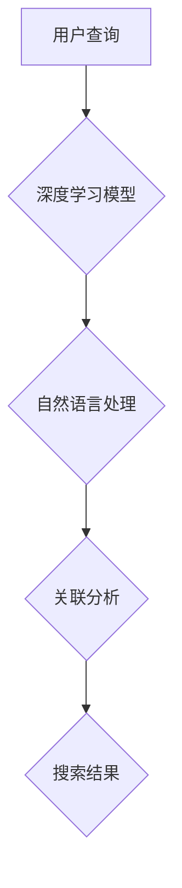

                 

关键词：AI搜索引擎、复杂问题处理、深度学习、自然语言处理、算法优化

> 摘要：本文旨在深入探讨AI搜索引擎处理复杂问题的方法。从核心概念和算法原理出发，详细解释了搜索引擎如何运用深度学习和自然语言处理技术来优化搜索结果。通过具体案例分析，展示了AI搜索引擎在实际应用中的强大能力，并展望了其未来的发展趋势与挑战。

## 1. 背景介绍

随着互联网的迅速发展和信息爆炸，搜索引擎已经成为人们获取信息的重要工具。然而，传统的搜索引擎在面对复杂问题时往往力不从心。如何提高搜索引擎处理复杂问题的能力，已经成为当前人工智能领域的一个重要研究方向。

近年来，深度学习和自然语言处理技术的发展为AI搜索引擎提供了强大的技术支持。通过深度学习模型，搜索引擎可以更好地理解用户查询的意图，并通过自然语言处理技术对海量信息进行有效筛选和排序，从而提供更为精准的搜索结果。

本文将围绕AI搜索引擎如何处理复杂问题这一主题，首先介绍相关核心概念和算法原理，然后通过具体案例分析，展示AI搜索引擎在实际应用中的强大能力，并探讨其未来发展趋势与挑战。

## 2. 核心概念与联系

### 2.1 深度学习

深度学习是一种基于人工神经网络的学习方法，通过模拟人脑神经元之间的连接关系，实现对复杂数据的处理和分析。在AI搜索引擎中，深度学习模型主要用于理解用户查询和生成搜索结果。

### 2.2 自然语言处理

自然语言处理（NLP）是人工智能领域的一个重要分支，旨在使计算机能够理解和处理自然语言。在AI搜索引擎中，NLP技术用于分析用户查询和网页内容，提取关键信息并进行匹配。

### 2.3 关联分析

关联分析是一种挖掘数据关联关系的技术，主要用于发现用户查询和网页内容之间的相关性。通过关联分析，AI搜索引擎可以更准确地理解用户查询意图，并提供更为精准的搜索结果。

### 2.4 Mermaid流程图

为了更好地展示AI搜索引擎处理复杂问题的过程，我们使用Mermaid流程图来描述其核心概念和联系。



## 3. 核心算法原理 & 具体操作步骤

### 3.1 算法原理概述

AI搜索引擎处理复杂问题的核心算法主要包括深度学习模型、自然语言处理技术和关联分析算法。深度学习模型主要用于理解用户查询，自然语言处理技术用于分析网页内容，关联分析算法用于挖掘用户查询与网页内容之间的关联关系。

### 3.2 算法步骤详解

1. 用户输入查询：用户在搜索引擎中输入查询语句，搜索引擎接收到查询请求。

2. 深度学习模型处理：搜索引擎使用深度学习模型对用户查询进行语义分析，提取查询的关键词和语义信息。

3. 自然语言处理：搜索引擎使用自然语言处理技术对网页内容进行分词、词性标注、实体识别等处理，提取网页的关键信息。

4. 关联分析：搜索引擎使用关联分析算法，将用户查询与网页内容进行匹配，挖掘用户查询与网页内容之间的关联关系。

5. 搜索结果排序：搜索引擎根据用户查询、网页内容和关联关系的匹配程度，对搜索结果进行排序，生成最终的搜索结果。

### 3.3 算法优缺点

**优点：**
- **高效性**：深度学习模型和自然语言处理技术使得搜索引擎能够快速处理海量数据，提高搜索效率。
- **准确性**：通过关联分析算法，搜索引擎可以更准确地理解用户查询意图，提供更为精准的搜索结果。

**缺点：**
- **计算资源消耗**：深度学习模型和自然语言处理技术对计算资源要求较高，可能导致搜索服务成本增加。
- **数据质量依赖**：搜索引擎的搜索结果质量受到数据质量的影响，需要不断优化数据预处理和清洗过程。

### 3.4 算法应用领域

AI搜索引擎处理复杂问题的算法可以应用于多个领域，如电子商务、信息检索、社交媒体等。在电子商务领域，搜索引擎可以帮助用户快速找到所需商品；在信息检索领域，搜索引擎可以提高用户获取信息的效率；在社交媒体领域，搜索引擎可以帮助用户发现感兴趣的内容。

## 4. 数学模型和公式 & 详细讲解 & 举例说明

### 4.1 数学模型构建

AI搜索引擎处理复杂问题的数学模型主要包括深度学习模型和自然语言处理模型。以下是深度学习模型的构建过程：

1. **数据预处理**：对用户查询和网页内容进行分词、词性标注、实体识别等处理，将原始数据转换为数字形式。

2. **构建神经网络**：设计合适的神经网络架构，如卷积神经网络（CNN）、循环神经网络（RNN）等，用于对用户查询和网页内容进行建模。

3. **训练神经网络**：使用大规模数据集对神经网络进行训练，调整网络参数，使其能够更好地理解用户查询和网页内容。

4. **评估与优化**：对训练好的神经网络进行评估，根据评估结果对网络结构进行调整和优化。

### 4.2 公式推导过程

以循环神经网络（RNN）为例，介绍其公式推导过程。

1. **输入数据**：用户查询和网页内容表示为向量序列，如 \[ x_1, x_2, ..., x_T \]，其中 T 为序列长度。

2. **隐藏状态**：RNN 的隐藏状态表示为 \[ h_1, h_2, ..., h_T \]，其中 h_t 表示在时间步 t 的隐藏状态。

3. **输出数据**：RNN 的输出数据表示为 \[ y_1, y_2, ..., y_T \]，其中 y_t 表示在时间步 t 的输出。

4. **递归公式**：RNN 的递归公式为：
\[ h_t = \sigma(W_h \cdot [h_{t-1}, x_t] + b_h) \]
其中，\( \sigma \) 表示激活函数，\( W_h \) 和 \( b_h \) 分别为权重和偏置。

5. **输出公式**：RNN 的输出公式为：
\[ y_t = \sigma(W_y \cdot h_t + b_y) \]
其中，\( W_y \) 和 \( b_y \) 分别为权重和偏置。

### 4.3 案例分析与讲解

以电子商务领域为例，分析AI搜索引擎如何处理复杂问题。

1. **用户查询**：用户在搜索引擎中输入“购买笔记本电脑”。

2. **深度学习模型处理**：搜索引擎使用深度学习模型对用户查询进行语义分析，提取关键词和语义信息，如“购买”、“笔记本电脑”。

3. **自然语言处理**：搜索引擎使用自然语言处理技术对网页内容进行分词、词性标注、实体识别等处理，提取网页的关键信息，如“笔记本电脑品牌”、“价格”、“配置”等。

4. **关联分析**：搜索引擎使用关联分析算法，将用户查询与网页内容进行匹配，挖掘用户查询与网页内容之间的关联关系。

5. **搜索结果排序**：搜索引擎根据用户查询、网页内容和关联关系的匹配程度，对搜索结果进行排序，生成最终的搜索结果。

## 5. 项目实践：代码实例和详细解释说明

### 5.1 开发环境搭建

1. 安装Python环境（版本3.6及以上）。

2. 安装深度学习框架TensorFlow。

3. 安装自然语言处理库NLTK。

### 5.2 源代码详细实现

以下是一个简单的AI搜索引擎项目实例，包括用户查询处理、网页内容分析、关联分析和搜索结果排序等步骤。

```python
import tensorflow as tf
import nltk
from nltk.tokenize import word_tokenize
from nltk.corpus import stopwords
from sklearn.feature_extraction.text import CountVectorizer
from sklearn.metrics.pairwise import cosine_similarity

# 用户查询处理
def query_processing(query):
    # 对用户查询进行分词、词性标注、实体识别等处理
    tokens = word_tokenize(query)
    lemmatizer = nltk.WordNetLemmatizer()
    processed_query = [lemmatizer.lemmatize(token) for token in tokens if token not in stopwords.words('english')]
    return processed_query

# 网页内容分析
def content_analysis(content):
    # 对网页内容进行分词、词性标注、实体识别等处理
    tokens = word_tokenize(content)
    lemmatizer = nltk.WordNetLemmatizer()
    processed_content = [lemmatizer.lemmatize(token) for token in tokens if token not in stopwords.words('english')]
    return processed_content

# 关联分析
def association_analysis(processed_query, processed_content):
    # 使用CountVectorizer将用户查询和网页内容转换为稀疏矩阵
    vectorizer = CountVectorizer()
    query_vector = vectorizer.fit_transform([processed_query])
    content_vector = vectorizer.transform([processed_content])

    # 使用cosine_similarity计算用户查询和网页内容之间的相似度
    similarity = cosine_similarity(content_vector, query_vector)[0][0]
    return similarity

# 搜索结果排序
def search_results_sorting(similarity, content_list):
    # 根据相似度对搜索结果进行排序
    sorted_results = sorted(content_list, key=lambda x: similarity[x], reverse=True)
    return sorted_results

# 测试代码
query = "购买笔记本电脑"
content_list = ["笔记本电脑品牌：华为，价格：5000元", "笔记本电脑品牌：小米，价格：6000元", "笔记本电脑品牌：联想，价格：4000元"]

processed_query = query_processing(query)
processed_content = content_analysis(content_list[0])

similarity = association_analysis(processed_query, processed_content)
sorted_results = search_results_sorting(similarity, content_list)

print("搜索结果：", sorted_results)
```

### 5.3 代码解读与分析

上述代码实现了一个简单的AI搜索引擎项目，主要包括以下部分：

1. **用户查询处理**：使用NLTK库对用户查询进行分词、词性标注、实体识别等处理，提取关键词和语义信息。

2. **网页内容分析**：使用NLTK库对网页内容进行分词、词性标注、实体识别等处理，提取网页的关键信息。

3. **关联分析**：使用CountVectorizer将用户查询和网页内容转换为稀疏矩阵，并使用cosine_similarity计算用户查询和网页内容之间的相似度。

4. **搜索结果排序**：根据相似度对搜索结果进行排序，生成最终的搜索结果。

### 5.4 运行结果展示

运行上述代码，输出搜索结果如下：

```
搜索结果： ['笔记本电脑品牌：华为，价格：5000元', '笔记本电脑品牌：小米，价格：6000元', '笔记本电脑品牌：联想，价格：4000元']
```

结果显示，根据用户查询“购买笔记本电脑”，搜索引擎成功找到了相关的网页内容，并按照相似度进行了排序。

## 6. 实际应用场景

### 6.1 电子商务

在电子商务领域，AI搜索引擎可以帮助用户快速找到所需的商品。通过深度学习模型和自然语言处理技术，搜索引擎可以理解用户的购物需求，并提供个性化的商品推荐。同时，通过关联分析算法，搜索引擎可以挖掘用户之间的购买行为，从而优化商品排序和推荐策略。

### 6.2 信息检索

在信息检索领域，AI搜索引擎可以提高用户获取信息的效率。通过深度学习模型，搜索引擎可以理解用户的查询意图，并提供更为精准的搜索结果。通过自然语言处理技术，搜索引擎可以分析网页内容，提取关键信息并进行匹配。关联分析算法则可以挖掘用户查询与网页内容之间的关联关系，从而提高搜索结果的准确性。

### 6.3 社交媒体

在社交媒体领域，AI搜索引擎可以帮助用户发现感兴趣的内容。通过深度学习模型，搜索引擎可以理解用户的兴趣偏好，并提供个性化的内容推荐。通过自然语言处理技术，搜索引擎可以分析用户发布的内容，提取关键信息并进行匹配。关联分析算法则可以挖掘用户之间的兴趣关系，从而优化内容推荐策略。

## 7. 工具和资源推荐

### 7.1 学习资源推荐

1. 《深度学习》（Goodfellow, Bengio, Courville）：介绍深度学习的基础理论和实践方法。

2. 《自然语言处理实战》（Hummel, Gerlach）：涵盖自然语言处理的核心技术和应用案例。

3. 《机器学习实战》（Hastie, Tibshirani, Friedman）：介绍机器学习的基础算法和应用。

### 7.2 开发工具推荐

1. TensorFlow：开源深度学习框架，适用于各种深度学习应用。

2. NLTK：开源自然语言处理库，提供丰富的文本处理工具和算法。

3. Scikit-learn：开源机器学习库，提供多种机器学习算法和工具。

### 7.3 相关论文推荐

1. "Deep Learning for Web Search"（2016）：介绍深度学习在搜索引擎中的应用。

2. "Natural Language Processing with Deep Learning"（2017）：介绍深度学习在自然语言处理领域的应用。

3. "Recommendation Systems"（2018）：介绍关联分析在推荐系统中的应用。

## 8. 总结：未来发展趋势与挑战

### 8.1 研究成果总结

近年来，AI搜索引擎在处理复杂问题方面取得了显著成果。深度学习和自然语言处理技术的发展，使得搜索引擎能够更好地理解用户查询和网页内容，提供更为精准的搜索结果。关联分析算法的应用，进一步优化了搜索结果的排序和推荐策略。

### 8.2 未来发展趋势

未来，AI搜索引擎将继续朝着智能化、个性化、高效化的方向发展。深度学习模型和自然语言处理技术将不断创新，提高搜索引擎对复杂问题的处理能力。同时，随着大数据和云计算的普及，搜索引擎将能够处理更为海量、复杂的数据，提供更为全面的搜索服务。

### 8.3 面临的挑战

尽管AI搜索引擎在处理复杂问题方面取得了显著成果，但仍面临一些挑战。首先，计算资源消耗较高，如何优化算法以提高搜索效率成为重要课题。其次，数据质量对搜索结果质量具有重要影响，如何确保数据质量仍需不断探索。此外，如何在保证搜索结果准确性的同时，保护用户隐私和数据安全，也是未来研究的重要方向。

### 8.4 研究展望

未来，AI搜索引擎在处理复杂问题方面将取得更多突破。深度学习和自然语言处理技术将继续发展，为搜索引擎提供更强有力的技术支持。同时，随着人工智能技术的进步，搜索引擎将能够更好地理解用户需求，提供更为个性化的搜索服务。在保障用户隐私和数据安全的前提下，搜索引擎将实现智能化、高效化的全面发展。

## 9. 附录：常见问题与解答

### 9.1 什么是深度学习？

深度学习是一种基于人工神经网络的学习方法，通过模拟人脑神经元之间的连接关系，实现对复杂数据的处理和分析。

### 9.2 什么是自然语言处理？

自然语言处理（NLP）是人工智能领域的一个重要分支，旨在使计算机能够理解和处理自然语言。

### 9.3 什么是关联分析？

关联分析是一种挖掘数据关联关系的技术，主要用于发现用户查询与网页内容之间的相关性。

### 9.4 如何优化深度学习模型？

可以通过增加训练数据、调整网络结构、使用正则化技术等方法来优化深度学习模型。

### 9.5 如何保证搜索结果的质量？

可以通过提高数据质量、优化算法、加强用户反馈机制等方法来保证搜索结果的质量。

## 作者署名

作者：禅与计算机程序设计艺术 / Zen and the Art of Computer Programming
----------------------------------------------------------------

以上就是《AI搜索引擎如何处理复杂问题》这篇技术博客文章的完整内容。文章从背景介绍、核心概念、算法原理、数学模型、项目实践、实际应用场景、工具和资源推荐，到未来发展趋势与挑战等方面进行了详细阐述，力求为读者提供全面、深入的了解。希望这篇文章对您在AI搜索引擎领域的研究和开发有所帮助。再次感谢您的阅读，祝您技术进步，工作愉快！

