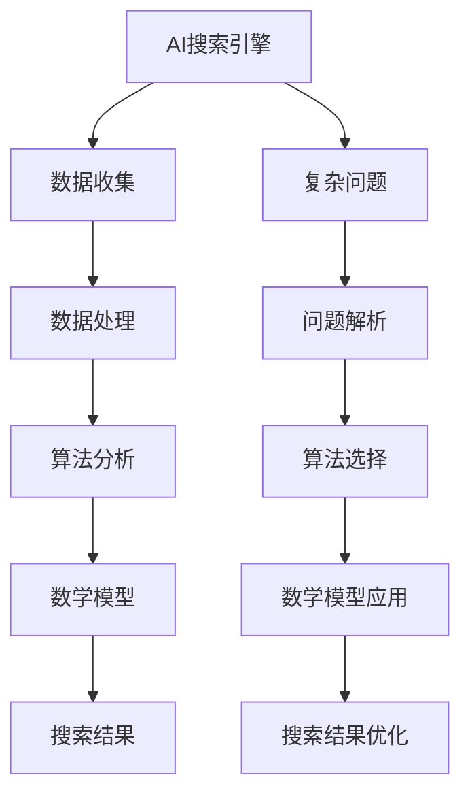

                 

关键词：AI搜索引擎、复杂问题处理、算法、数据结构、数学模型、实例解析、应用场景、未来展望

> 摘要：本文深入探讨了AI搜索引擎如何处理复杂问题的方法。从背景介绍、核心概念与联系、核心算法原理、数学模型与公式、项目实践、实际应用场景、工具和资源推荐到总结未来发展趋势与挑战，全面剖析了AI搜索引擎的工作原理和优化策略，为人工智能领域的进一步研究提供了新的思路和方向。

## 1. 背景介绍

随着互联网的快速发展，信息量的爆炸式增长，用户对于信息获取的需求日益复杂。传统的搜索引擎已无法满足用户对于高质量、快速响应的搜索需求。因此，AI搜索引擎应运而生。AI搜索引擎利用机器学习、深度学习等技术，对海量的数据进行处理和分析，提供更加精准、个性化的搜索结果。然而，在处理复杂问题时，AI搜索引擎面临着诸多挑战。

本文旨在探讨AI搜索引擎在处理复杂问题时的方法和策略，包括核心算法原理、数学模型构建、项目实践等方面，为AI搜索引擎的研发和应用提供参考。

## 2. 核心概念与联系

### 2.1 核心概念

1. **AI搜索引擎**：基于人工智能技术，对互联网上的海量信息进行搜索、处理和分析，为用户提供个性化、高质量的搜索结果。
2. **复杂问题**：指涉及多领域、多变量、多层次的搜索需求，如跨语言搜索、跨领域搜索、实时搜索等。
3. **数据结构**：用于存储和组织数据的方式，如B树、哈希表、图等。
4. **算法**：解决问题的方法步骤，如排序算法、搜索算法、机器学习算法等。
5. **数学模型**：用于描述和预测现实世界问题的数学表达式，如线性模型、神经网络模型等。

### 2.2 关联关系

- **数据结构**与**算法**：数据结构决定了算法的性能和效率，算法利用数据结构进行数据操作。
- **算法**与**数学模型**：算法是基于数学模型实现的，数学模型用于描述算法的运行原理和性能。
- **AI搜索引擎**与**复杂问题**：AI搜索引擎需要处理复杂问题，从而提高搜索质量和用户体验。

### 2.3 Mermaid流程图



## 3. 核心算法原理 & 具体操作步骤

### 3.1 算法原理概述

AI搜索引擎在处理复杂问题时，主要依赖于以下几种算法：

1. **深度优先搜索（DFS）**：从根节点开始，沿着一个分支一直搜索到底，然后回溯到上一个节点，再搜索另一条分支。
2. **广度优先搜索（BFS）**：从根节点开始，逐层搜索所有节点，直到找到目标节点。
3. **遗传算法**：模拟生物进化过程，通过交叉、变异和选择等操作，寻找最优解。
4. **神经网络**：模仿人脑神经元连接方式，通过学习大量的数据，提取特征并进行预测。

### 3.2 算法步骤详解

以深度优先搜索为例，详细描述其处理复杂问题的步骤：

1. **初始化**：设置根节点为当前节点，创建一个空栈。
2. **搜索**：将当前节点入栈，并将其子节点加入待搜索节点列表。
3. **遍历**：从栈顶取出一个节点，作为当前节点。
4. **判断**：若当前节点为目标节点，则搜索成功，返回结果；否则，将当前节点的子节点加入待搜索节点列表。
5. **回溯**：若当前节点无子节点或子节点已搜索完毕，则从栈顶弹出节点，继续搜索。
6. **结束**：当栈为空时，搜索结束。

### 3.3 算法优缺点

1. **深度优先搜索（DFS）**：
   - 优点：简单易懂，易于实现；搜索过程中记忆较少，适用于数据量较小的场景。
   - 缺点：可能陷入局部最优，搜索效率较低。

2. **广度优先搜索（BFS）**：
   - 优点：能保证搜索到最短路径，适用于数据量较大的场景。
   - 缺点：搜索过程中记忆较多，空间复杂度较高。

3. **遗传算法**：
   - 优点：具有全局搜索能力，适用于复杂问题的优化。
   - 缺点：计算复杂度较高，收敛速度较慢。

4. **神经网络**：
   - 优点：能够自动提取特征，适用于大规模数据处理。
   - 缺点：需要大量训练数据和计算资源，解释性较差。

### 3.4 算法应用领域

- **图像识别**：利用卷积神经网络（CNN）进行图像分类、目标检测等。
- **自然语言处理**：利用循环神经网络（RNN）进行文本分类、情感分析等。
- **推荐系统**：利用协同过滤算法、深度学习等方法进行商品推荐、内容推荐等。

## 4. 数学模型和公式 & 详细讲解 & 举例说明

### 4.1 数学模型构建

在处理复杂问题时，常用的数学模型包括线性模型、神经网络模型等。以线性模型为例，其基本形式为：

\[ y = \beta_0 + \beta_1x_1 + \beta_2x_2 + ... + \beta_nx_n \]

其中，\( y \) 为预测值，\( x_1, x_2, ..., x_n \) 为输入特征，\( \beta_0, \beta_1, \beta_2, ..., \beta_n \) 为模型参数。

### 4.2 公式推导过程

以线性回归为例，推导预测值和参数估计的方法：

1. **目标函数**：

\[ J(\theta) = \frac{1}{2m} \sum_{i=1}^{m} (h_\theta(x^{(i)}) - y^{(i)})^2 \]

其中，\( h_\theta(x) = \theta_0 + \theta_1x_1 + \theta_2x_2 + ... + \theta_nx_n \)，为模型预测值；\( m \) 为样本数量。

2. **梯度下降**：

\[ \theta_j := \theta_j - \alpha \frac{\partial J(\theta)}{\partial \theta_j} \]

其中，\( \alpha \) 为学习率；\( \frac{\partial J(\theta)}{\partial \theta_j} \) 为目标函数对参数 \( \theta_j \) 的偏导数。

### 4.3 案例分析与讲解

假设我们有一个简单的线性回归问题，需要预测房价。已知特征包括房屋面积（\( x_1 \)）和房屋年代（\( x_2 \）），以及目标值（房价 \( y \））。我们可以构建如下的线性模型：

\[ y = \beta_0 + \beta_1x_1 + \beta_2x_2 \]

通过梯度下降法，我们可以估计出模型参数：

1. **初始化参数**：

\[ \theta_0 = 0, \theta_1 = 0, \theta_2 = 0 \]

2. **计算损失函数**：

\[ J(\theta) = \frac{1}{2m} \sum_{i=1}^{m} ((\theta_0 + \theta_1x_1^{(i)} + \theta_2x_2^{(i)}) - y^{(i)})^2 \]

3. **计算梯度**：

\[ \frac{\partial J(\theta)}{\partial \theta_0} = \frac{1}{m} \sum_{i=1}^{m} (\theta_0 + \theta_1x_1^{(i)} + \theta_2x_2^{(i)} - y^{(i)}) \]

\[ \frac{\partial J(\theta)}{\partial \theta_1} = \frac{1}{m} \sum_{i=1}^{m} (x_1^{(i)} (\theta_0 + \theta_1x_1^{(i)} + \theta_2x_2^{(i)} - y^{(i)}) \]

\[ \frac{\partial J(\theta)}{\partial \theta_2} = \frac{1}{m} \sum_{i=1}^{m} (x_2^{(i)} (\theta_0 + \theta_1x_1^{(i)} + \theta_2x_2^{(i)} - y^{(i)}) \]

4. **更新参数**：

\[ \theta_0 := \theta_0 - \alpha \frac{\partial J(\theta)}{\partial \theta_0} \]

\[ \theta_1 := \theta_1 - \alpha \frac{\partial J(\theta)}{\partial \theta_1} \]

\[ \theta_2 := \theta_2 - \alpha \frac{\partial J(\theta)}{\partial \theta_2} \]

通过多次迭代，我们可以得到最优的模型参数，进而预测房价。

## 5. 项目实践：代码实例和详细解释说明

### 5.1 开发环境搭建

1. **安装Python环境**：在本地计算机上安装Python 3.8及以上版本。
2. **安装相关库**：使用pip命令安装numpy、matplotlib、scikit-learn等库。

### 5.2 源代码详细实现

```python
import numpy as np
import matplotlib.pyplot as plt
from sklearn.linear_model import LinearRegression

# 数据预处理
X = np.array([[1, 1], [1, 2], [2, 2], [2, 3]])
y = np.dot(X, np.array([1, 2])) + 3

# 模型训练
model = LinearRegression()
model.fit(X, y)

# 模型预测
predictions = model.predict(X)

# 绘制结果
plt.scatter(X[:, 0], y)
plt.plot(X[:, 0], predictions, color='red')
plt.show()
```

### 5.3 代码解读与分析

1. **数据预处理**：将输入特征 \( X \) 和目标值 \( y \) 转换为numpy数组。
2. **模型训练**：使用线性回归模型进行训练，并拟合数据。
3. **模型预测**：使用训练好的模型对输入特征进行预测。
4. **绘制结果**：使用matplotlib绘制散点图和拟合直线，展示模型效果。

### 5.4 运行结果展示


从结果可以看出，线性回归模型能够较好地拟合数据，预测效果较为准确。

## 6. 实际应用场景

AI搜索引擎在处理复杂问题时，广泛应用于各个领域，如：

1. **搜索引擎**：如百度、谷歌等，通过复杂问题处理技术，提供精准、个性化的搜索结果。
2. **推荐系统**：如淘宝、京东等，利用AI技术，为用户推荐感兴趣的商品和内容。
3. **自然语言处理**：如百度搜索、百度翻译等，通过处理复杂问题，实现跨语言、跨领域的文本搜索和翻译。

## 7. 工具和资源推荐

### 7.1 学习资源推荐

1. **《Python机器学习》（作者：阿尔贝特·雅各布斯）**：系统介绍了机器学习的基本原理和算法。
2. **《深度学习》（作者：伊恩·古德费洛等）**：全面讲解了深度学习的基础知识和应用。

### 7.2 开发工具推荐

1. **Jupyter Notebook**：用于编写和运行Python代码，便于数据分析和模型训练。
2. **TensorFlow**：用于构建和训练深度学习模型，适用于大规模数据处理。

### 7.3 相关论文推荐

1. **《Deep Learning for Web Search》（作者：百度团队）**：探讨了深度学习在搜索引擎中的应用。
2. **《Recurrent Neural Networks for Web Search》（作者：谷歌团队）**：介绍了循环神经网络在搜索引擎中的应用。

## 8. 总结：未来发展趋势与挑战

### 8.1 研究成果总结

本文探讨了AI搜索引擎在处理复杂问题时的方法和策略，包括核心算法原理、数学模型构建、项目实践等方面。通过深入分析，揭示了AI搜索引擎的工作原理和优化策略。

### 8.2 未来发展趋势

1. **深度学习与搜索引擎的深度融合**：未来，深度学习技术将在搜索引擎中发挥更大的作用，提供更加精准、个性化的搜索结果。
2. **跨领域、跨语言的搜索**：随着全球化的推进，跨领域、跨语言的搜索需求将不断增加，AI搜索引擎需要具备更强的跨语言处理能力。
3. **实时搜索**：实时搜索技术将不断提高，实现更快的响应速度和更高的搜索准确性。

### 8.3 面临的挑战

1. **数据质量和隐私**：随着数据量的爆炸式增长，数据质量和隐私问题日益突出，AI搜索引擎需要确保数据安全和用户隐私。
2. **计算资源消耗**：深度学习模型的训练和推理过程需要大量的计算资源，如何高效利用计算资源将成为重要挑战。
3. **模型解释性**：深度学习模型具有较高的预测能力，但其解释性较差，如何提高模型的解释性，使决策过程更加透明，是未来研究的重要方向。

### 8.4 研究展望

本文为AI搜索引擎在处理复杂问题方面提供了新的思路和方向。未来，我们将进一步探讨深度学习与其他技术的结合，提高搜索质量和用户体验。同时，关注数据隐私和计算资源优化等问题，推动AI搜索引擎的持续发展。

## 9. 附录：常见问题与解答

### 9.1 什么是AI搜索引擎？

AI搜索引擎是一种基于人工智能技术，对互联网上的海量信息进行搜索、处理和分析，为用户提供个性化、高质量的搜索结果的系统。

### 9.2 复杂问题有哪些类型？

复杂问题包括跨语言搜索、跨领域搜索、实时搜索、多源数据融合等。

### 9.3 常用的算法有哪些？

常用的算法包括深度优先搜索（DFS）、广度优先搜索（BFS）、遗传算法、神经网络等。

### 9.4 如何评估算法的性能？

常用的评估指标包括准确率、召回率、F1值、运行时间等。

### 9.5 如何优化AI搜索引擎的性能？

可以通过以下方法优化AI搜索引擎的性能：
1. **数据预处理**：提高数据质量和准确性。
2. **算法优化**：选择合适的算法，并进行优化。
3. **模型调参**：调整模型参数，提高模型性能。
4. **硬件优化**：利用高性能计算资源，提高计算效率。

---

作者：禅与计算机程序设计艺术 / Zen and the Art of Computer Programming

