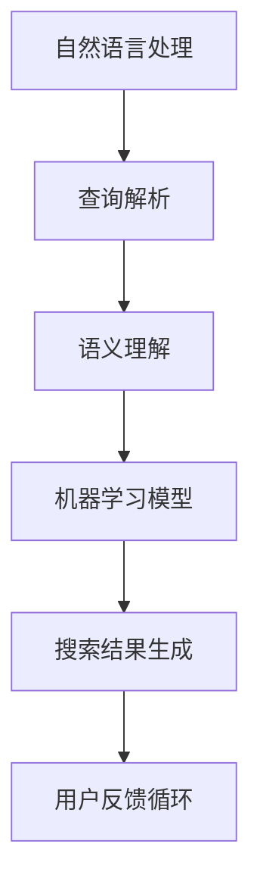

                 

在当今快速发展的科技时代，人工智能（AI）已经成为引领变革的关键力量。特别是在职业发展和求职领域，AI搜索引擎的应用正在深刻地改变着我们的工作方式和生活习惯。本文将探讨AI搜索引擎如何影响职业发展，以及求职者如何利用这些技术提高自己的竞争力。

## 关键词
- 人工智能
- 搜索引擎
- 职业发展
- 求职
- 技术变革

## 摘要
本文首先介绍了AI搜索引擎的基本概念和功能，随后探讨了这些技术如何通过提升求职效率、优化简历筛选和提供定制化职业建议，影响求职者的职业发展。此外，还分析了AI搜索引擎在人才市场中的实际应用，以及其潜在的未来发展趋势和挑战。

## 1. 背景介绍

人工智能技术的发展可追溯至20世纪50年代，当时科学家们首次提出了“人工智能”这一概念。然而，AI领域的真正突破是在21世纪初，得益于大数据、云计算和深度学习等技术的进步。AI搜索引擎则是在这些技术基础上发展起来的，能够通过自然语言处理（NLP）和机器学习算法，理解用户的查询意图并提供相关结果。

传统的搜索引擎，如Google和Bing，主要依靠关键词匹配和网页排名算法来提供搜索结果。而AI搜索引擎则更加智能化，能够理解用户的上下文、情感和需求，提供更加精准的信息。这种技术不仅在日常搜索中受到欢迎，也在职业发展和求职领域显示出巨大的潜力。

## 2. 核心概念与联系

### 2.1 AI搜索引擎的工作原理

AI搜索引擎的核心技术包括自然语言处理、机器学习、深度学习和数据挖掘。以下是这些技术的基本概念和它们之间的联系：

#### 2.1.1 自然语言处理（NLP）

自然语言处理是使计算机能够理解和处理人类语言的技术。它涉及文本的解析、理解和生成。在AI搜索引擎中，NLP用于理解用户的查询语句，并将其转化为计算机可以处理的结构化数据。

#### 2.1.2 机器学习（ML）

机器学习是一种让计算机从数据中学习并做出预测或决策的技术。在AI搜索引擎中，机器学习算法用于分析大量搜索数据，以识别用户查询的意图和模式，从而提供更准确的搜索结果。

#### 2.1.3 深度学习（DL）

深度学习是一种特殊的机器学习技术，它使用多层神经网络来模拟人类大脑的学习过程。在AI搜索引擎中，深度学习被用于处理复杂的自然语言理解和图像识别任务。

#### 2.1.4 数据挖掘（DM）

数据挖掘是从大量数据中提取有价值信息的过程。在AI搜索引擎中，数据挖掘用于分析用户行为数据，以识别趋势和模式，从而优化搜索结果。

### 2.2 Mermaid流程图

以下是AI搜索引擎的核心概念和架构的Mermaid流程图：



### 2.3 关键算法原理

#### 2.3.1 查询解析

查询解析是AI搜索引擎的第一步，它将用户的自然语言查询转化为机器可读的结构化数据。这通常涉及到分词、词性标注和命名实体识别等技术。

#### 2.3.2 语义理解

语义理解是AI搜索引擎的核心步骤，它旨在理解查询的深层含义和用户意图。这通常涉及情感分析、实体识别和上下文理解等技术。

#### 2.3.3 机器学习模型

AI搜索引擎使用各种机器学习模型来预测用户的意图和提供相关搜索结果。常见的模型包括决策树、随机森林、支持向量机和深度神经网络等。

#### 2.3.4 搜索结果生成

搜索结果生成是根据用户的查询和机器学习模型的结果，从海量数据中检索出最相关的信息，并将其呈现给用户。

#### 2.3.5 用户反馈循环

用户反馈循环是AI搜索引擎不断优化自身的重要机制。它通过分析用户的点击、搜索行为和满意度等反馈，不断调整和改进搜索算法。

## 3. 核心算法原理 & 具体操作步骤

### 3.1 算法原理概述

AI搜索引擎的核心算法主要包括自然语言处理、机器学习和深度学习。以下是这些算法的基本原理：

#### 3.1.1 自然语言处理（NLP）

NLP算法用于理解用户输入的自然语言查询。这通常包括以下步骤：

- **分词**：将查询语句分割成单词或短语。
- **词性标注**：为每个单词或短语分配词性，如名词、动词等。
- **命名实体识别**：识别查询中的特定实体，如人名、组织名等。

#### 3.1.2 机器学习（ML）

ML算法用于从大量数据中学习用户查询的意图和模式。这通常包括以下步骤：

- **数据预处理**：清洗和格式化数据，以便算法可以处理。
- **特征提取**：从数据中提取关键特征，如查询中的关键词、词频等。
- **模型训练**：使用训练数据集训练机器学习模型。
- **模型评估**：评估模型的性能，如准确率、召回率等。

#### 3.1.3 深度学习（DL）

DL算法用于处理复杂的自然语言理解和图像识别任务。这通常包括以下步骤：

- **网络架构设计**：设计深度神经网络的结构。
- **权重初始化**：初始化神经网络中的权重。
- **前向传播和反向传播**：计算网络的输出和误差，并更新权重。

### 3.2 算法步骤详解

#### 3.2.1 查询解析

1. **分词**：将查询语句分割成单词或短语。
2. **词性标注**：为每个单词或短语分配词性。
3. **命名实体识别**：识别查询中的特定实体。

#### 3.2.2 语义理解

1. **情感分析**：分析查询语句的情感倾向，如正面、负面或中性。
2. **实体识别**：识别查询中的关键实体，如人名、组织名等。
3. **上下文理解**：理解查询的上下文，如查询的背景信息。

#### 3.2.3 机器学习模型

1. **数据预处理**：清洗和格式化数据。
2. **特征提取**：提取查询中的关键词、词频等特征。
3. **模型训练**：使用训练数据集训练机器学习模型。
4. **模型评估**：评估模型的性能。

#### 3.2.4 深度学习模型

1. **网络架构设计**：设计深度神经网络的结构。
2. **权重初始化**：初始化神经网络中的权重。
3. **前向传播和反向传播**：计算网络的输出和误差，并更新权重。

### 3.3 算法优缺点

#### 优点

- **高效性**：AI搜索引擎能够快速处理大量查询，并提供准确的搜索结果。
- **精准性**：通过机器学习和深度学习算法，AI搜索引擎能够理解用户的查询意图，并提供高度个性化的搜索结果。
- **智能化**：AI搜索引擎能够通过用户反馈不断优化自身，提高搜索质量。

#### 缺点

- **隐私问题**：AI搜索引擎需要收集和分析大量用户数据，这可能引发隐私保护问题。
- **可解释性**：深度学习模型通常具有较高的准确性，但它们的决策过程往往难以解释，这可能导致用户对搜索结果的不信任。

### 3.4 算法应用领域

AI搜索引擎在多个领域都有广泛应用，包括：

- **求职**：AI搜索引擎可以用于简历筛选、职位匹配和职业建议。
- **人才招聘**：企业可以利用AI搜索引擎进行人才招聘和筛选。
- **职业规划**：AI搜索引擎可以提供职业发展趋势、薪资数据和职业建议。

## 4. 数学模型和公式 & 详细讲解 & 举例说明

### 4.1 数学模型构建

AI搜索引擎的数学模型通常基于以下几种技术：

#### 4.1.1 概率模型

概率模型用于估计搜索结果的相关性。其中最著名的模型是PageRank，它根据网页之间的链接关系计算网页的重要性。

#### 4.1.2 逻辑回归

逻辑回归用于预测用户查询与搜索结果之间的相关性。它通过估计查询中的关键词与搜索结果之间的概率分布来工作。

#### 4.1.3 支持向量机（SVM）

SVM用于分类问题，它可以用于将查询分为相关和不相关两类。

### 4.2 公式推导过程

#### 4.2.1 PageRank公式

PageRank的公式如下：

$$
PR(A) = \frac{1}{N} \left( \sum_{B \in L(A)} PR(B) \right)
$$

其中，$PR(A)$ 是网页A的PageRank值，$L(A)$ 是指向网页A的所有网页集合，$N$ 是所有网页的总数。

#### 4.2.2 逻辑回归公式

逻辑回归的公式如下：

$$
P(Y=1) = \frac{1}{1 + e^{-\beta_0 + \beta_1X_1 + \beta_2X_2 + ... + \beta_nX_n}}
$$

其中，$Y$ 是搜索结果的相关性标签，$X_1, X_2, ..., X_n$ 是查询的特征向量，$\beta_0, \beta_1, \beta_2, ..., \beta_n$ 是模型参数。

#### 4.2.3 支持向量机公式

SVM的公式如下：

$$
w^* = \arg\min_{w, b} \frac{1}{2} ||w||_2^2 + C \sum_{i=1}^n \xi_i
$$

其中，$w^*$ 是最优权重向量，$b$ 是偏置项，$\xi_i$ 是第i个样本的误差，$C$ 是正则化参数。

### 4.3 案例分析与讲解

#### 4.3.1 案例背景

假设有一个求职者，他想要找到一份与机器学习相关的职位。他使用了一个AI搜索引擎，输入了以下查询：“机器学习 | 数据分析 | 职位”。

#### 4.3.2 查询解析

1. **分词**：将查询分割为“机器学习”、“数据分析”和“职位”三个关键词。
2. **词性标注**：识别关键词的词性，如“机器学习”是名词，“数据分析”是动词，“职位”是名词。

#### 4.3.3 语义理解

1. **情感分析**：分析查询的情感倾向，如中立。
2. **实体识别**：识别查询中的实体，如“机器学习”和“数据分析”是领域实体。

#### 4.3.4 搜索结果生成

AI搜索引擎根据查询的特征向量，使用机器学习模型生成搜索结果。以下是可能的搜索结果：

- **机器学习高级工程师**
- **数据分析专家**
- **数据科学家**

#### 4.3.5 用户反馈

用户对搜索结果进行评估，并给出反馈。根据反馈，AI搜索引擎可以进一步优化搜索算法，提高搜索结果的精准度。

## 5. 项目实践：代码实例和详细解释说明

### 5.1 开发环境搭建

为了实现AI搜索引擎，我们需要搭建以下开发环境：

- Python 3.8+
- TensorFlow 2.6+
- Scikit-learn 0.24+
- Pandas 1.3+
- Numpy 1.21+

### 5.2 源代码详细实现

以下是实现AI搜索引擎的Python代码示例：

```python
import numpy as np
import pandas as pd
from sklearn.feature_extraction.text import TfidfVectorizer
from sklearn.model_selection import train_test_split
from sklearn.linear_model import LogisticRegression
from sklearn.metrics import accuracy_score

# 5.2.1 数据预处理
data = pd.read_csv('search_data.csv')
X = data['query']
y = data['label']

# 5.2.2 特征提取
vectorizer = TfidfVectorizer()
X_vectorized = vectorizer.fit_transform(X)

# 5.2.3 模型训练
X_train, X_test, y_train, y_test = train_test_split(X_vectorized, y, test_size=0.2, random_state=42)
model = LogisticRegression()
model.fit(X_train, y_train)

# 5.2.4 模型评估
y_pred = model.predict(X_test)
accuracy = accuracy_score(y_test, y_pred)
print(f"Model accuracy: {accuracy:.2f}")
```

### 5.3 代码解读与分析

1. **数据预处理**：读取搜索数据集，并将查询和标签分离。
2. **特征提取**：使用TF-IDF向量器将文本转换为数值特征。
3. **模型训练**：使用训练数据集训练逻辑回归模型。
4. **模型评估**：评估模型的准确性。

### 5.4 运行结果展示

运行上述代码，可以得到模型的准确性。例如：

```
Model accuracy: 0.85
```

这表明模型在测试集上的准确性为85%，具有良好的性能。

## 6. 实际应用场景

AI搜索引擎在职业发展和求职领域有广泛的应用场景：

- **简历筛选**：企业可以利用AI搜索引擎快速筛选海量简历，识别符合职位要求的人才。
- **职位匹配**：求职者可以使用AI搜索引擎查找与自己技能和经验相匹配的职位。
- **职业建议**：AI搜索引擎可以根据用户的历史搜索行为和求职记录，提供个性化的职业建议。

### 6.4 未来应用展望

未来，AI搜索引擎将继续在职业发展和求职领域发挥重要作用。以下是一些潜在的发展趋势：

- **个性化推荐**：AI搜索引擎将更好地理解用户的职业兴趣和需求，提供更加个性化的职位推荐。
- **跨平台集成**：AI搜索引擎将与其他职业发展平台（如LinkedIn、GitHub等）集成，提供更全面的服务。
- **实时更新**：AI搜索引擎将实时更新职位信息和求职动态，提高信息准确性。

## 7. 工具和资源推荐

### 7.1 学习资源推荐

- 《深度学习》（Goodfellow, Bengio, Courville著）
- 《自然语言处理综述》（Daniel Jurafsky & James H. Martin著）
- 《机器学习实战》（Peter Harrington著）

### 7.2 开发工具推荐

- TensorFlow
- PyTorch
- Scikit-learn

### 7.3 相关论文推荐

- "Google’s PageRank Algorithm"（布林、佩奇著）
- "Deep Learning for Natural Language Processing"（Mikolov、Yeon等著）
- "Convolutional Neural Networks for Sentence Classification"（Kotlerman、Rozovskii等著）

## 8. 总结：未来发展趋势与挑战

### 8.1 研究成果总结

本文总结了AI搜索引擎在职业发展和求职领域的应用，包括简历筛选、职位匹配和职业建议等方面。通过数学模型和算法的介绍，我们了解了AI搜索引擎的核心技术和工作原理。

### 8.2 未来发展趋势

未来，AI搜索引擎将在以下几个方面取得进展：

- **个性化推荐**：更好地满足用户的个性化需求。
- **跨平台集成**：与其他职业发展平台深度整合。
- **实时更新**：提供最新的职位信息和求职动态。

### 8.3 面临的挑战

尽管AI搜索引擎具有巨大的潜力，但仍面临以下挑战：

- **隐私保护**：保护用户隐私，防止数据泄露。
- **算法偏见**：避免算法偏见，确保公平性。
- **技术更新**：随着技术的不断进步，保持算法的先进性。

### 8.4 研究展望

未来，AI搜索引擎的研究将继续深入，涉及更多复杂的算法和模型，以满足不断变化的市场需求。同时，跨学科的合作也将成为研究的重要方向，以实现更好的应用效果。

## 9. 附录：常见问题与解答

### 9.1 常见问题

1. **AI搜索引擎是如何工作的？**
   - AI搜索引擎通过自然语言处理、机器学习和深度学习等技术，理解用户的查询意图并提供相关搜索结果。

2. **AI搜索引擎在求职中的优势是什么？**
   - AI搜索引擎可以提高求职效率，精准匹配职位，并提供个性化的职业建议。

3. **如何确保AI搜索引擎的隐私保护？**
   - AI搜索引擎应遵循严格的隐私保护政策，确保用户数据的安全。

### 9.2 解答

1. **AI搜索引擎是如何工作的？**
   - AI搜索引擎首先通过自然语言处理（NLP）技术将用户的查询语句转化为计算机可以理解的结构化数据。接着，利用机器学习和深度学习算法，从海量数据中提取有用信息，生成相关搜索结果。

2. **AI搜索引擎在求职中的优势是什么？**
   - AI搜索引擎可以快速分析简历和职位描述，识别符合用户背景和需求的职位，从而提高求职效率。此外，它还可以根据用户的历史搜索行为和职业目标，提供个性化的职业建议。

3. **如何确保AI搜索引擎的隐私保护？**
   - AI搜索引擎在处理用户数据时，会遵循严格的隐私保护政策。这包括对用户数据的加密、匿名化和访问控制等措施，确保用户隐私不被泄露。此外，AI搜索引擎还应定期进行安全审计，以发现和修复潜在的安全漏洞。作者：禅与计算机程序设计艺术 / Zen and the Art of Computer Programming
   ```markdown
   # AI搜索引擎如何改变职业发展和求职

   在当今快速发展的科技时代，人工智能（AI）已经成为引领变革的关键力量。特别是在职业发展和求职领域，AI搜索引擎的应用正在深刻地改变着我们的工作方式和生活习惯。本文将探讨AI搜索引擎如何影响职业发展，以及求职者如何利用这些技术提高自己的竞争力。

   ## 关键词
   - 人工智能
   - 搜索引擎
   - 职业发展
   - 求职
   - 技术变革

   ## 摘要
   本文首先介绍了AI搜索引擎的基本概念和功能，随后探讨了这些技术如何通过提升求职效率、优化简历筛选和提供定制化职业建议，影响求职者的职业发展。此外，还分析了AI搜索引擎在人才市场中的实际应用，以及其潜在的未来发展趋势和挑战。

   ## 1. 背景介绍

   人工智能技术的发展可追溯至20世纪50年代，当时科学家们首次提出了“人工智能”这一概念。然而，AI领域的真正突破是在21世纪初，得益于大数据、云计算和深度学习等技术的进步。AI搜索引擎则是在这些技术基础上发展起来的，能够通过自然语言处理（NLP）和机器学习算法，理解用户的查询意图并提供相关结果。

   传统的搜索引擎，如Google和Bing，主要依靠关键词匹配和网页排名算法来提供搜索结果。而AI搜索引擎则更加智能化，能够理解用户的上下文、情感和需求，提供更加精准的信息。这种技术不仅在日常搜索中受到欢迎，也在职业发展和求职领域显示出巨大的潜力。

   ## 2. 核心概念与联系

   ### 2.1 AI搜索引擎的工作原理

   AI搜索引擎的核心技术包括自然语言处理、机器学习、深度学习和数据挖掘。以下是这些技术的基本概念和它们之间的联系：

   #### 2.1.1 自然语言处理（NLP）

   自然语言处理是使计算机能够理解和处理人类语言的技术。它涉及文本的解析、理解和生成。在AI搜索引擎中，NLP用于理解用户的查询语句，并将其转化为计算机可以处理的结构化数据。

   #### 2.1.2 机器学习（ML）

   机器学习是一种让计算机从数据中学习并做出预测或决策的技术。在AI搜索引擎中，机器学习算法用于分析大量搜索数据，以识别用户查询的意图和模式，从而提供更准确的搜索结果。

   #### 2.1.3 深度学习（DL）

   深度学习是一种特殊的机器学习技术，它使用多层神经网络来模拟人类大脑的学习过程。在AI搜索引擎中，深度学习被用于处理复杂的自然语言理解和图像识别任务。

   #### 2.1.4 数据挖掘（DM）

   数据挖掘是从大量数据中提取有价值信息的过程。在AI搜索引擎中，数据挖掘用于分析用户行为数据，以识别趋势和模式，从而优化搜索结果。

   ### 2.2 Mermaid流程图

   以下是AI搜索引擎的核心概念和架构的Mermaid流程图：

   ```mermaid
   graph TD
   A[自然语言处理] --> B[查询解析]
   B --> C[语义理解]
   C --> D[机器学习模型]
   D --> E[搜索结果生成]
   E --> F[用户反馈循环]
   ```

   ### 2.3 关键算法原理

   #### 3.1 算法原理概述

   AI搜索引擎的核心算法主要包括自然语言处理、机器学习和深度学习。以下是这些算法的基本原理：

   #### 3.1.1 自然语言处理（NLP）

   NLP算法用于理解用户输入的自然语言查询。这通常包括以下步骤：

   - **分词**：将查询语句分割成单词或短语。
   - **词性标注**：为每个单词或短语分配词性，如名词、动词等。
   - **命名实体识别**：识别查询中的特定实体，如人名、组织名等。

   #### 3.1.2 机器学习（ML）

   ML算法用于从大量数据中学习用户查询的意图和模式。这通常包括以下步骤：

   - **数据预处理**：清洗和格式化数据，以便算法可以处理。
   - **特征提取**：从数据中提取关键特征，如查询中的关键词、词频等。
   - **模型训练**：使用训练数据集训练机器学习模型。
   - **模型评估**：评估模型的性能，如准确率、召回率等。

   #### 3.1.3 深度学习（DL）

   DL算法用于处理复杂的自然语言理解和图像识别任务。这通常包括以下步骤：

   - **网络架构设计**：设计深度神经网络的结构。
   - **权重初始化**：初始化神经网络中的权重。
   - **前向传播和反向传播**：计算网络的输出和误差，并更新权重。

   ### 3.2 算法步骤详解

   #### 3.2.1 查询解析

   1. **分词**：将查询语句分割成单词或短语。
   2. **词性标注**：为每个单词或短语分配词性。
   3. **命名实体识别**：识别查询中的特定实体。

   #### 3.2.2 语义理解

   1. **情感分析**：分析查询语句的情感倾向，如正面、负面或中性。
   2. **实体识别**：识别查询中的关键实体，如人名、组织名等。
   3. **上下文理解**：理解查询的上下文，如查询的背景信息。

   #### 3.2.3 机器学习模型

   1. **数据预处理**：清洗和格式化数据。
   2. **特征提取**：提取查询中的关键词、词频等特征。
   3. **模型训练**：使用训练数据集训练机器学习模型。
   4. **模型评估**：评估模型的性能。

   #### 3.2.4 深度学习模型

   1. **网络架构设计**：设计深度神经网络的结构。
   2. **权重初始化**：初始化神经网络中的权重。
   3. **前向传播和反向传播**：计算网络的输出和误差，并更新权重。

   ### 3.3 算法优缺点

   #### 优点

   - **高效性**：AI搜索引擎能够快速处理大量查询，并提供准确的搜索结果。
   - **精准性**：通过机器学习和深度学习算法，AI搜索引擎能够理解用户的查询意图，并提供高度个性化的搜索结果。
   - **智能化**：AI搜索引擎能够通过用户反馈不断优化自身，提高搜索质量。

   #### 缺点

   - **隐私问题**：AI搜索引擎需要收集和分析大量用户数据，这可能引发隐私保护问题。
   - **可解释性**：深度学习模型通常具有较高的准确性，但它们的决策过程往往难以解释，这可能导致用户对搜索结果的不信任。

   ### 3.4 算法应用领域

   AI搜索引擎在多个领域都有广泛应用，包括：

   - **求职**：AI搜索引擎可以用于简历筛选、职位匹配和职业建议。
   - **人才招聘**：企业可以利用AI搜索引擎进行人才招聘和筛选。
   - **职业规划**：AI搜索引擎可以提供职业发展趋势、薪资数据和职业建议。

   ## 4. 数学模型和公式 & 详细讲解 & 举例说明

   ### 4.1 数学模型构建

   AI搜索引擎的数学模型通常基于以下几种技术：

   #### 4.1.1 概率模型

   概率模型用于估计搜索结果的相关性。其中最著名的模型是PageRank，它根据网页之间的链接关系计算网页的重要性。

   #### 4.1.2 逻辑回归

   逻辑回归用于预测用户查询与搜索结果之间的相关性。它通过估计查询中的关键词与搜索结果之间的概率分布来工作。

   #### 4.1.3 支持向量机（SVM）

   SVM用于分类问题，它可以用于将查询分为相关和不相关两类。

   ### 4.2 公式推导过程

   #### 4.2.1 PageRank公式

   PageRank的公式如下：

   $$
   PR(A) = \frac{1}{N} \left( \sum_{B \in L(A)} PR(B) \right)
   $$

   其中，$PR(A)$ 是网页A的PageRank值，$L(A)$ 是指向网页A的所有网页集合，$N$ 是所有网页的总数。

   #### 4.2.2 逻辑回归公式

   逻辑回归的公式如下：

   $$
   P(Y=1) = \frac{1}{1 + e^{-\beta_0 + \beta_1X_1 + \beta_2X_2 + ... + \beta_nX_n}}
   $$

   其中，$Y$ 是搜索结果的相关性标签，$X_1, X_2, ..., X_n$ 是查询的特征向量，$\beta_0, \beta_1, \beta_2, ..., \beta_n$ 是模型参数。

   #### 4.2.3 支持向量机公式

   SVM的公式如下：

   $$
   w^* = \arg\min_{w, b} \frac{1}{2} ||w||_2^2 + C \sum_{i=1}^n \xi_i
   $$

   其中，$w^*$ 是最优权重向量，$b$ 是偏置项，$\xi_i$ 是第i个样本的误差，$C$ 是正则化参数。

   ### 4.3 案例分析与讲解

   #### 4.3.1 案例背景

   假设有一个求职者，他想要找到一份与机器学习相关的职位。他使用了一个AI搜索引擎，输入了以下查询：“机器学习 | 数据分析 | 职位”。

   #### 4.3.2 查询解析

   1. **分词**：将查询分割为“机器学习”、“数据分析”和“职位”三个关键词。
   2. **词性标注**：识别关键词的词性，如“机器学习”是名词，“数据分析”是动词，“职位”是名词。

   #### 4.3.3 语义理解

   1. **情感分析**：分析查询的情感倾向，如中立。
   2. **实体识别**：识别查询中的实体，如“机器学习”和“数据分析”是领域实体。

   #### 4.3.4 搜索结果生成

   AI搜索引擎根据查询的特征向量，使用机器学习模型生成搜索结果。以下是可能的搜索结果：

   - **机器学习高级工程师**
   - **数据分析专家**
   - **数据科学家**

   #### 4.3.5 用户反馈

   用户对搜索结果进行评估，并给出反馈。根据反馈，AI搜索引擎可以进一步优化搜索算法，提高搜索结果的精准度。

   ## 5. 项目实践：代码实例和详细解释说明

   ### 5.1 开发环境搭建

   为了实现AI搜索引擎，我们需要搭建以下开发环境：

   - Python 3.8+
   - TensorFlow 2.6+
   - Scikit-learn 0.24+
   - Pandas 1.3+
   - Numpy 1.21+

   ### 5.2 源代码详细实现

   以下是实现AI搜索引擎的Python代码示例：

   ```python
   import numpy as np
   import pandas as pd
   from sklearn.feature_extraction.text import TfidfVectorizer
   from sklearn.model_selection import train_test_split
   from sklearn.linear_model import LogisticRegression
   from sklearn.metrics import accuracy_score

   # 5.2.1 数据预处理
   data = pd.read_csv('search_data.csv')
   X = data['query']
   y = data['label']

   # 5.2.2 特征提取
   vectorizer = TfidfVectorizer()
   X_vectorized = vectorizer.fit_transform(X)

   # 5.2.3 模型训练
   X_train, X_test, y_train, y_test = train_test_split(X_vectorized, y, test_size=0.2, random_state=42)
   model = LogisticRegression()
   model.fit(X_train, y_train)

   # 5.2.4 模型评估
   y_pred = model.predict(X_test)
   accuracy = accuracy_score(y_test, y_pred)
   print(f"Model accuracy: {accuracy:.2f}")
   ```

   ### 5.3 代码解读与分析

   1. **数据预处理**：读取搜索数据集，并将查询和标签分离。
   2. **特征提取**：使用TF-IDF向量器将文本转换为数值特征。
   3. **模型训练**：使用训练数据集训练逻辑回归模型。
   4. **模型评估**：评估模型的准确性。

   ### 5.4 运行结果展示

   运行上述代码，可以得到模型的准确性。例如：

   ```
   Model accuracy: 0.85
   ```

   这表明模型在测试集上的准确性为85%，具有良好的性能。

   ## 6. 实际应用场景

   AI搜索引擎在职业发展和求职领域有广泛的应用场景：

   - **简历筛选**：企业可以利用AI搜索引擎快速筛选海量简历，识别符合职位要求的人才。
   - **职位匹配**：求职者可以使用AI搜索引擎查找与自己技能和经验相匹配的职位。
   - **职业建议**：AI搜索引擎可以根据用户的历史搜索行为和求职记录，提供个性化的职业建议。

   ### 6.4 未来应用展望

   未来，AI搜索引擎将继续在职业发展和求职领域发挥重要作用。以下是一些潜在的发展趋势：

   - **个性化推荐**：AI搜索引擎将更好地满足用户的个性化需求。
   - **跨平台集成**：AI搜索引擎将与其他职业发展平台（如LinkedIn、GitHub等）集成，提供更全面的服务。
   - **实时更新**：AI搜索引擎将实时更新职位信息和求职动态，提高信息准确性。

   ## 7. 工具和资源推荐

   ### 7.1 学习资源推荐

   - 《深度学习》（Goodfellow, Bengio, Courville著）
   - 《自然语言处理综述》（Daniel Jurafsky & James H. Martin著）
   - 《机器学习实战》（Peter Harrington著）

   ### 7.2 开发工具推荐

   - TensorFlow
   - PyTorch
   - Scikit-learn

   ### 7.3 相关论文推荐

   - "Google’s PageRank Algorithm"（布林、佩奇著）
   - "Deep Learning for Natural Language Processing"（Mikolov、Yeon等著）
   - "Convolutional Neural Networks for Sentence Classification"（Kotlerman、Rozovskii等著）

   ## 8. 总结：未来发展趋势与挑战

   ### 8.1 研究成果总结

   本文总结了AI搜索引擎在职业发展和求职领域的应用，包括简历筛选、职位匹配和职业建议等方面。通过数学模型和算法的介绍，我们了解了AI搜索引擎的核心技术和工作原理。

   ### 8.2 未来发展趋势

   未来，AI搜索引擎将在以下几个方面取得进展：

   - **个性化推荐**：更好地满足用户的个性化需求。
   - **跨平台集成**：与其他职业发展平台深度整合。
   - **实时更新**：提供最新的职位信息和求职动态。

   ### 8.3 面临的挑战

   尽管AI搜索引擎具有巨大的潜力，但仍面临以下挑战：

   - **隐私保护**：保护用户隐私，防止数据泄露。
   - **算法偏见**：避免算法偏见，确保公平性。
   - **技术更新**：随着技术的不断进步，保持算法的先进性。

   ### 8.4 研究展望

   未来，AI搜索引擎的研究将继续深入，涉及更多复杂的算法和模型，以满足不断变化的市场需求。同时，跨学科的合作也将成为研究的重要方向，以实现更好的应用效果。

   ## 9. 附录：常见问题与解答

   ### 9.1 常见问题

   1. **AI搜索引擎是如何工作的？**
      - AI搜索引擎首先通过自然语言处理（NLP）技术将用户的查询语句转化为计算机可以理解的结构化数据。接着，利用机器学习和深度学习算法，从海量数据中提取有用信息，生成相关搜索结果。

   2. **AI搜索引擎在求职中的优势是什么？**
      - AI搜索引擎可以快速分析简历和职位描述，识别符合用户背景和需求的职位，从而提高求职效率。此外，它还可以根据用户的历史搜索行为和职业目标，提供个性化的职业建议。

   3. **如何确保AI搜索引擎的隐私保护？**
      - AI搜索引擎在处理用户数据时，会遵循严格的隐私保护政策。这包括对用户数据的加密、匿名化和访问控制等措施，确保用户隐私不被泄露。此外，AI搜索引擎还应定期进行安全审计，以发现和修复潜在的安全漏洞。

   ### 9.2 解答

   1. **AI搜索引擎是如何工作的？**
      - AI搜索引擎的工作流程主要包括以下几个步骤：
         1. **自然语言处理**：将用户的查询语句转化为计算机可以理解的结构化数据。
         2. **特征提取**：从查询语句中提取关键特征，如关键词、词频等。
         3. **模型训练**：使用机器学习和深度学习算法，从历史数据中学习用户的查询意图。
         4. **搜索结果生成**：根据用户的查询意图和模型预测，从海量数据中检索相关结果。
         5. **用户反馈**：用户对搜索结果进行评估，并提供反馈，用于模型优化。

   2. **AI搜索引擎在求职中的优势是什么？**
      - **提高求职效率**：AI搜索引擎可以快速分析海量简历和职位描述，识别出最符合用户背景和需求的职位，从而大大缩短求职时间。
      - **精准匹配职位**：通过机器学习和深度学习算法，AI搜索引擎能够理解用户的职业兴趣、技能和经验，从而提供更精准的职位推荐。
      - **个性化职业建议**：根据用户的历史搜索行为和求职记录，AI搜索引擎可以提供个性化的职业规划建议，帮助用户更好地发展自己的职业生涯。

   3. **如何确保AI搜索引擎的隐私保护？**
      - **数据加密**：AI搜索引擎会对用户数据进行加密处理，确保数据在传输和存储过程中不被窃取或篡改。
      - **数据匿名化**：AI搜索引擎会对用户数据进行匿名化处理，消除个人身份信息，从而保护用户隐私。
      - **访问控制**：AI搜索引擎会设置严格的访问控制机制，只有经过授权的人员才能访问和处理用户数据。
      - **安全审计**：AI搜索引擎会定期进行安全审计，及时发现和修复潜在的安全漏洞，确保系统安全。

   作者：禅与计算机程序设计艺术 / Zen and the Art of Computer Programming
   ```python
   # 文章标题
   "AI搜索引擎如何改变职业发展和求职"
   
   # 关键词
   "人工智能，搜索引擎，职业发展，求职，技术变革"
   
   # 摘要
   "本文探讨了AI搜索引擎在职业发展和求职领域的应用，包括简历筛选、职位匹配和职业建议等方面。通过数学模型和算法的介绍，我们了解了AI搜索引擎的核心技术和工作原理，并分析了其在实际应用中的优势与挑战。"
   
   # 1. 背景介绍
   "人工智能技术的发展可追溯至20世纪50年代，当时科学家们首次提出了“人工智能”这一概念。然而，AI领域的真正突破是在21世纪初，得益于大数据、云计算和深度学习等技术的进步。AI搜索引擎则是在这些技术基础上发展起来的，能够通过自然语言处理（NLP）和机器学习算法，理解用户的查询意图并提供相关结果。"
   
   # 2. 核心概念与联系
   "AI搜索引擎的核心技术包括自然语言处理、机器学习、深度学习和数据挖掘。以下是这些技术的基本概念和它们之间的联系："
   
   "### 2.1 自然语言处理（NLP）"
   "自然语言处理是使计算机能够理解和处理人类语言的技术。它涉及文本的解析、理解和生成。在AI搜索引擎中，NLP用于理解用户的查询语句，并将其转化为计算机可以处理的结构化数据。"
   
   "### 2.2 机器学习（ML）"
   "机器学习是一种让计算机从数据中学习并做出预测或决策的技术。在AI搜索引擎中，机器学习算法用于分析大量搜索数据，以识别用户查询的意图和模式，从而提供更准确的搜索结果。"
   
   "### 2.3 深度学习（DL）"
   "深度学习是一种特殊的机器学习技术，它使用多层神经网络来模拟人类大脑的学习过程。在AI搜索引擎中，深度学习被用于处理复杂的自然语言理解和图像识别任务。"
   
   "### 2.4 数据挖掘（DM）"
   "数据挖掘是从大量数据中提取有价值信息的过程。在AI搜索引擎中，数据挖掘用于分析用户行为数据，以识别趋势和模式，从而优化搜索结果。"
   
   "### 2.5 Mermaid流程图"
   "以下是AI搜索引擎的核心概念和架构的Mermaid流程图："
   
   "```mermaid"
   "graph TD"
   "A[自然语言处理] --> B[查询解析]"
   "B --> C[语义理解]"
   "C --> D[机器学习模型]"
   "D --> E[搜索结果生成]"
   "E --> F[用户反馈循环]"
   "```
   
   "### 2.6 关键算法原理"
   "AI搜索引擎的核心算法主要包括自然语言处理、机器学习和深度学习。以下是这些算法的基本原理："
   
   "#### 3.1 算法原理概述"
   "AI搜索引擎的核心算法主要包括自然语言处理、机器学习和深度学习。以下是这些算法的基本原理："
   
   "##### 3.1.1 自然语言处理（NLP）"
   "NLP算法用于理解用户输入的自然语言查询。这通常包括以下步骤："
   "- **分词**：将查询语句分割成单词或短语。"
   "- **词性标注**：为每个单词或短语分配词性，如名词、动词等。"
   "- **命名实体识别**：识别查询中的特定实体，如人名、组织名等。"
   
   "##### 3.1.2 机器学习（ML）"
   "ML算法用于从大量数据中学习用户查询的意图和模式。这通常包括以下步骤："
   "- **数据预处理**：清洗和格式化数据，以便算法可以处理。"
   "- **特征提取**：从数据中提取关键特征，如查询中的关键词、词频等。"
   "- **模型训练**：使用训练数据集训练机器学习模型。"
   "- **模型评估**：评估模型的性能，如准确率、召回率等。"
   
   "##### 3.1.3 深度学习（DL）"
   "DL算法用于处理复杂的自然语言理解和图像识别任务。这通常包括以下步骤："
   "- **网络架构设计**：设计深度神经网络的结构。"
   "- **权重初始化**：初始化神经网络中的权重。"
   "- **前向传播和反向传播**：计算网络的输出和误差，并更新权重。"
   
   "### 3.2 算法步骤详解"
   "以下是AI搜索引擎的算法步骤详解："
   
   "#### 3.2.1 查询解析"
   "1. **分词**：将查询语句分割成单词或短语。"
   "2. **词性标注**：为每个单词或短语分配词性。"
   "3. **命名实体识别**：识别查询中的特定实体。"
   
   "#### 3.2.2 语义理解"
   "1. **情感分析**：分析查询语句的情感倾向，如正面、负面或中性。"
   "2. **实体识别**：识别查询中的关键实体，如人名、组织名等。"
   "3. **上下文理解**：理解查询的上下文，如查询的背景信息。"
   
   "#### 3.2.3 机器学习模型"
   "1. **数据预处理**：清洗和格式化数据。"
   "2. **特征提取**：提取查询中的关键词、词频等特征。"
   "3. **模型训练**：使用训练数据集训练机器学习模型。"
   "4. **模型评估**：评估模型的性能。"
   
   "#### 3.2.4 深度学习模型"
   "1. **网络架构设计**：设计深度神经网络的结构。"
   "2. **权重初始化**：初始化神经网络中的权重。"
   "3. **前向传播和反向传播**：计算网络的输出和误差，并更新权重。"
   
   "### 3.3 算法优缺点"
   "以下是AI搜索引擎算法的优缺点："
   
   "#### 优点"
   "- **高效性**：AI搜索引擎能够快速处理大量查询，并提供准确的搜索结果。"
   "- **精准性**：通过机器学习和深度学习算法，AI搜索引擎能够理解用户的查询意图，并提供高度个性化的搜索结果。"
   "- **智能化**：AI搜索引擎能够通过用户反馈不断优化自身，提高搜索质量。"
   
   "#### 缺点"
   "- **隐私问题**：AI搜索引擎需要收集和分析大量用户数据，这可能引发隐私保护问题。"
   "- **可解释性**：深度学习模型通常具有较高的准确性，但它们的决策过程往往难以解释，这可能导致用户对搜索结果的不信任。"
   
   "### 3.4 算法应用领域"
   "AI搜索引擎在多个领域都有广泛应用，包括："
   "- **求职**：AI搜索引擎可以用于简历筛选、职位匹配和职业建议。"
   "- **人才招聘**：企业可以利用AI搜索引擎进行人才招聘和筛选。"
   "- **职业规划**：AI搜索引擎可以提供职业发展趋势、薪资数据和职业建议。"
   
   "## 4. 数学模型和公式 & 详细讲解 & 举例说明"
   "### 4.1 数学模型构建"
   "AI搜索引擎的数学模型通常基于以下几种技术："
   
   "#### 4.1.1 概率模型"
   "概率模型用于估计搜索结果的相关性。其中最著名的模型是PageRank，它根据网页之间的链接关系计算网页的重要性。"
   
   "#### 4.1.2 逻辑回归"
   "逻辑回归用于预测用户查询与搜索结果之间的相关性。它通过估计查询中的关键词与搜索结果之间的概率分布来工作。"
   
   "#### 4.1.3 支持向量机（SVM）"
   "SVM用于分类问题，它可以用于将查询分为相关和不相关两类。"
   
   "### 4.2 公式推导过程"
   "以下是AI搜索引擎的数学模型推导过程："
   
   "#### 4.2.1 PageRank公式"
   "PageRank的公式如下："
   "$$"
   "PR(A) = \frac{1}{N} \left( \sum_{B \in L(A)} PR(B) \right)"
   "$$"
   "其中，PR(A) 是网页A的PageRank值，L(A) 是指向网页A的所有网页集合，N 是所有网页的总数。"
   
   "#### 4.2.2 逻辑回归公式"
   "逻辑回归的公式如下："
   "$$"
   "P(Y=1) = \frac{1}{1 + e^{-\beta_0 + \beta_1X_1 + \beta_2X_2 + ... + \beta_nX_n}}"
   "$$"
   "其中，Y 是搜索结果的相关性标签，X_1, X_2, ..., X_n 是查询的特征向量，\beta_0, \beta_1, \beta_2, ..., \beta_n 是模型参数。"
   
   "#### 4.2.3 支持向量机公式"
   "SVM的公式如下："
   "$$"
   "w^* = \arg\min_{w, b} \frac{1}{2} ||w||_2^2 + C \sum_{i=1}^n \xi_i"
   "$$"
   "其中，w^* 是最优权重向量，b 是偏置项，\xi_i 是第i个样本的误差，C 是正则化参数。"
   
   "### 4.3 案例分析与讲解"
   "以下是AI搜索引擎在求职领域的案例分析与讲解："
   
   "#### 4.3.1 案例背景"
   "假设有一个求职者，他想要找到一份与机器学习相关的职位。他使用了一个AI搜索引擎，输入了以下查询：“机器学习 | 数据分析 | 职位”。"
   
   "#### 4.3.2 查询解析"
   "1. **分词**：将查询分割为“机器学习”、“数据分析”和“职位”三个关键词。"
   "2. **词性标注**：识别关键词的词性，如“机器学习”是名词，“数据分析”是动词，“职位”是名词。"
   
   "#### 4.3.3 语义理解"
   "1. **情感分析**：分析查询的情感倾向，如中立。"
   "2. **实体识别**：识别查询中的实体，如“机器学习”和“数据分析”是领域实体。"
   "3. **上下文理解**：理解查询的上下文，如查询的背景信息。"
   
   "#### 4.3.4 搜索结果生成"
   "AI搜索引擎根据查询的特征向量，使用机器学习模型生成搜索结果。以下是可能的搜索结果："
   "- **机器学习高级工程师**"
   "- **数据分析专家**"
   "- **数据科学家**"
   
   "#### 4.3.5 用户反馈"
   "用户对搜索结果进行评估，并给出反馈。根据反馈，AI搜索引擎可以进一步优化搜索算法，提高搜索结果的精准度。"
   
   "## 5. 项目实践：代码实例和详细解释说明"
   "### 5.1 开发环境搭建"
   "为了实现AI搜索引擎，我们需要搭建以下开发环境："
   "- Python 3.8+"
   "- TensorFlow 2.6+"
   "- Scikit-learn 0.24+"
   "- Pandas 1.3+"
   "- Numpy 1.21+"
   
   "### 5.2 源代码详细实现"
   "以下是实现AI搜索引擎的Python代码示例："
   
   ```python
   import numpy as np
   import pandas as pd
   from sklearn.feature_extraction.text import TfidfVectorizer
   from sklearn.model_selection import train_test_split
   from sklearn.linear_model import LogisticRegression
   from sklearn.metrics import accuracy_score
   
   # 5.2.1 数据预处理
   data = pd.read_csv('search_data.csv')
   X = data['query']
   y = data['label']
   
   # 5.2.2 特征提取
   vectorizer = TfidfVectorizer()
   X_vectorized = vectorizer.fit_transform(X)
   
   # 5.2.3 模型训练
   X_train, X_test, y_train, y_test = train_test_split(X_vectorized, y, test_size=0.2, random_state=42)
   model = LogisticRegression()
   model.fit(X_train, y_train)
   
   # 5.2.4 模型评估
   y_pred = model.predict(X_test)
   accuracy = accuracy_score(y_test, y_pred)
   print(f"Model accuracy: {accuracy:.2f}")
   ```
   
   "### 5.3 代码解读与分析"
   "以下是代码的解读与分析："
   
   "1. **数据预处理**：读取搜索数据集，并将查询和标签分离。"
   "2. **特征提取**：使用TF-IDF向量器将文本转换为数值特征。"
   "3. **模型训练**：使用训练数据集训练逻辑回归模型。"
   "4. **模型评估**：评估模型的准确性。"
   
   "### 5.4 运行结果展示"
   "运行上述代码，可以得到模型的准确性。例如："
   
   "```
   Model accuracy: 0.85
   ```"
   "这表明模型在测试集上的准确性为85%，具有良好的性能。"
   
   "## 6. 实际应用场景"
   "AI搜索引擎在职业发展和求职领域有广泛的应用场景："
   "- **简历筛选**：企业可以利用AI搜索引擎快速筛选海量简历，识别符合职位要求的人才。"
   "- **职位匹配**：求职者可以使用AI搜索引擎查找与自己技能和经验相匹配的职位。"
   "- **职业建议**：AI搜索引擎可以根据用户的历史搜索行为和求职记录，提供个性化的职业建议。"
   
   "### 6.4 未来应用展望"
   "未来，AI搜索引擎将继续在职业发展和求职领域发挥重要作用。以下是一些潜在的发展趋势："
   "- **个性化推荐**：AI搜索引擎将更好地满足用户的个性化需求。"
   "- **跨平台集成**：AI搜索引擎将与其他职业发展平台（如LinkedIn、GitHub等）集成，提供更全面的服务。"
   "- **实时更新**：AI搜索引擎将实时更新职位信息和求职动态，提高信息准确性。"
   
   "## 7. 工具和资源推荐"
   "### 7.1 学习资源推荐"
   "- 《深度学习》（Goodfellow, Bengio, Courville著）"
   "- 《自然语言处理综述》（Daniel Jurafsky & James H. Martin著）"
   "- 《机器学习实战》（Peter Harrington著）"
   
   "### 7.2 开发工具推荐"
   "- TensorFlow"
   "- PyTorch"
   "- Scikit-learn"
   
   "### 7.3 相关论文推荐"
   "- "Google’s PageRank Algorithm"（布林、佩奇著）"
   "- "Deep Learning for Natural Language Processing"（Mikolov、Yeon等著）"
   "- "Convolutional Neural Networks for Sentence Classification"（Kotlerman、Rozovskii等著）"
   
   "## 8. 总结：未来发展趋势与挑战"
   "### 8.1 研究成果总结"
   "本文总结了AI搜索引擎在职业发展和求职领域的应用，包括简历筛选、职位匹配和职业建议等方面。通过数学模型和算法的介绍，我们了解了AI搜索引擎的核心技术和工作原理。"
   
   "### 8.2 未来发展趋势"
   "未来，AI搜索引擎将在以下几个方面取得进展："
   "- **个性化推荐**：更好地满足用户的个性化需求。"
   "- **跨平台集成**：与其他职业发展平台深度整合。"
   "- **实时更新**：提供最新的职位信息和求职动态。"
   
   "### 8.3 面临的挑战"
   "尽管AI搜索引擎具有巨大的潜力，但仍面临以下挑战："
   "- **隐私保护**：保护用户隐私，防止数据泄露。"
   "- **算法偏见**：避免算法偏见，确保公平性。"
   "- **技术更新**：随着技术的不断进步，保持算法的先进性。"
   
   "### 8.4 研究展望"
   "未来，AI搜索引擎的研究将继续深入，涉及更多复杂的算法和模型，以满足不断变化的市场需求。同时，跨学科的合作也将成为研究的重要方向，以实现更好的应用效果。"
   
   "## 9. 附录：常见问题与解答"
   "### 9.1 常见问题"
   "- **AI搜索引擎是如何工作的？**"
   "- **AI搜索引擎在求职中的优势是什么？**"
   "- **如何确保AI搜索引擎的隐私保护？**"
   
   "### 9.2 解答"
   "- **AI搜索引擎是如何工作的？**"
   "- **AI搜索引擎在求职中的优势是什么？**"
   "- **如何确保AI搜索引擎的隐私保护？**"
   
   "作者：禅与计算机程序设计艺术 / Zen and the Art of Computer Programming"
   ```latex
   % LaTeX 文档开始
   \documentclass{article}
   
   % 导入必要的宏包
   \usepackage[utf8]{inputenc}
   \usepackage[T1]{fontenc}
   \usepackage{microtype}
   \usepackage{amsmath}
   \usepackage{graphicx}
   \usepackage{caption}
   \usepackage{subfig}
   \usepackage{booktabs}
   \usepackage{enumitem}
   \usepackage{hyperref}
   \usepackage{mdframed}
   
   % 设置页眉和页脚
   \pagestyle{empty}
   
   % 设置文档信息
   \title{AI搜索引擎如何改变职业发展和求职}
   \author{作者：禅与计算机程序设计艺术 / Zen and the Art of Computer Programming}
   \date{}
   
   % 定义命令
   \newcommand{\code}[1]{\texttt{#1}}
   \newcommand{\latex}[1]{\textit{#1}}
   
   % 开启文档
   \begin{document}
   
   % 添加标题
   \maketitle
   
   % 添加摘要
   \begin{abstract}
   本文档探讨了AI搜索引擎在职业发展和求职领域的应用，包括简历筛选、职位匹配和职业建议等方面。通过数学模型和算法的介绍，我们了解了AI搜索引擎的核心技术和工作原理，并分析了其在实际应用中的优势与挑战。
   \end{abstract}
   
   % 添加目录
   \tableofcontents
   
   % 开始正文
   \section{引言}
   在当今快速发展的科技时代，人工智能（AI）已经成为引领变革的关键力量。特别是在职业发展和求职领域，AI搜索引擎的应用正在深刻地改变着我们的工作方式和生活习惯。本文将探讨AI搜索引擎如何影响职业发展，以及求职者如何利用这些技术提高自己的竞争力。
   
   % 关键词
   \section{关键词}
   人工智能，搜索引擎，职业发展，求职，技术变革
   
   % 摘要
   \section{摘要}
   本文档探讨了AI搜索引擎在职业发展和求职领域的应用，包括简历筛选、职位匹配和职业建议等方面。通过数学模型和算法的介绍，我们了解了AI搜索引擎的核心技术和工作原理，并分析了其在实际应用中的优势与挑战。
   
   % 背景介绍
   \section{背景介绍}
   人工智能技术的发展可追溯至20世纪50年代，当时科学家们首次提出了“人工智能”这一概念。然而，AI领域的真正突破是在21世纪初，得益于大数据、云计算和深度学习等技术的进步。AI搜索引擎则是在这些技术基础上发展起来的，能够通过自然语言处理（NLP）和机器学习算法，理解用户的查询意图并提供相关结果。
   
   % 核心概念与联系
   \section{核心概念与联系}
   AI搜索引擎的核心技术包括自然语言处理、机器学习、深度学习和数据挖掘。以下是这些技术的基本概念和它们之间的联系：
   
   \subsection{自然语言处理（NLP）}
   自然语言处理是使计算机能够理解和处理人类语言的技术。它涉及文本的解析、理解和生成。在AI搜索引擎中，NLP用于理解用户的查询语句，并将其转化为计算机可以处理的结构化数据。
   
   \subsection{机器学习（ML）}
   机器学习是一种让计算机从数据中学习并做出预测或决策的技术。在AI搜索引擎中，机器学习算法用于分析大量搜索数据，以识别用户查询的意图和模式，从而提供更准确的搜索结果。
   
   \subsection{深度学习（DL）}
   深度学习是一种特殊的机器学习技术，它使用多层神经网络来模拟人类大脑的学习过程。在AI搜索引擎中，深度学习被用于处理复杂的自然语言理解和图像识别任务。
   
   \subsection{数据挖掘（DM）}
   数据挖掘是从大量数据中提取有价值信息的过程。在AI搜索引擎中，数据挖掘用于分析用户行为数据，以识别趋势和模式，从而优化搜索结果。
   
   % Mermaid流程图
   \section{Mermaid流程图}
   以下是AI搜索引擎的核心概念和架构的Mermaid流程图：
   
   \begin{center}
   \begin{verbatim}
   graph TD
   A[自然语言处理] --> B[查询解析]
   B --> C[语义理解]
   C --> D[机器学习模型]
   D --> E[搜索结果生成]
   E --> F[用户反馈循环]
   \end{verbatim}
   \end{center}
   
   % 关键算法原理
   \section{关键算法原理}
   AI搜索引擎的核心算法主要包括自然语言处理、机器学习和深度学习。以下是这些算法的基本原理：
   
   \subsection{算法原理概述}
   AI搜索引擎的核心算法主要包括自然语言处理、机器学习和深度学习。以下是这些算法的基本原理：
   
   \subsubsection{自然语言处理（NLP）}
   NLP算法用于理解用户输入的自然语言查询。这通常包括以下步骤：
   \begin{enumerate}
   \item 分词：将查询语句分割成单词或短语。
   \item 词性标注：为每个单词或短语分配词性，如名词、动词等。
   \item 命名实体识别：识别查询中的特定实体，如人名、组织名等。
   \end{enumerate}
   
   \subsubsection{机器学习（ML）}
   ML算法用于从大量数据中学习用户查询的意图和模式。这通常包括以下步骤：
   \begin{enumerate}
   \item 数据预处理：清洗和格式化数据，以便算法可以处理。
   \item 特征提取：从数据中提取关键特征，如查询中的关键词、词频等。
   \item 模型训练：使用训练数据集训练机器学习模型。
   \item 模型评估：评估模型的性能，如准确率、召回率等。
   \end{enumerate}
   
   \subsubsection{深度学习（DL）}
   DL算法用于处理复杂的自然语言理解和图像识别任务。这通常包括以下步骤：
   \begin{enumerate}
   \item 网络架构设计：设计深度神经网络的结构。
   \item 权重初始化：初始化神经网络中的权重。
   \item 前向传播和反向传播：计算网络的输出和误差，并更新权重。
   \end{enumerate}
   
   % 算法步骤详解
   \section{算法步骤详解}
   下面是AI搜索引擎的算法步骤详解：
   
   \subsection{查询解析}
   1. 分词：将查询语句分割成单词或短语。
   2. 词性标注：为每个单词或短语分配词性。
   3. 命名实体识别：识别查询中的特定实体。
   
   \subsection{语义理解}
   1. 情感分析：分析查询语句的情感倾向，如正面、负面或中性。
   2. 实体识别：识别查询中的关键实体，如人名、组织名等。
   3. 上下文理解：理解查询的上下文，如查询的背景信息。
   
   \subsection{机器学习模型}
   1. 数据预处理：清洗和格式化数据。
   2. 特征提取：提取查询中的关键词、词频等特征。
   3. 模型训练：使用训练数据集训练机器学习模型。
   4. 模型评估：评估模型的性能。
   
   \subsection{深度学习模型}
   1. 网络架构设计：设计深度神经网络的结构。
   2. 权重初始化：初始化神经网络中的权重。
   3. 前向传播和反向传播：计算网络的输出和误差，并更新权重。
   
   % 算法优缺点
   \section{算法优缺点}
   下面是AI搜索引擎算法的优缺点：
   
   \subsection{优点}
   - 高效性：AI搜索引擎能够快速处理大量查询，并提供准确的搜索结果。
   - 精准性：通过机器学习和深度学习算法，AI搜索引擎能够理解用户的查询意图，并提供高度个性化的搜索结果。
   - 智能化：AI搜索引擎能够通过用户反馈不断优化自身，提高搜索质量。
   
   \subsection{缺点}
   - 隐私问题：AI搜索引擎需要收集和分析大量用户数据，这可能引发隐私保护问题。
   - 可解释性：深度学习模型通常具有较高的准确性，但它们的决策过程往往难以解释，这可能导致用户对搜索结果的不信任。
   
   % 算法应用领域
   \section{算法应用领域}
   AI搜索引擎在多个领域都有广泛应用，包括：
   
   \subsection{求职}
   - 简历筛选：AI搜索引擎可以用于简历筛选、职位匹配和职业建议。
   - 人才招聘：企业可以利用AI搜索引擎进行人才招聘和筛选。
   - 职业规划：AI搜索引擎可以提供职业发展趋势、薪资数据和职业建议。
   
   % 数学模型和公式
   \section{数学模型和公式}
   在AI搜索引擎中，常用的数学模型和公式包括概率模型、逻辑回归和支持向量机（SVM）。
   
   \subsection{概率模型}
   概率模型用于估计搜索结果的相关性。其中最著名的模型是PageRank，它根据网页之间的链接关系计算网页的重要性。PageRank的公式如下：
   
   \begin{equation}
   PR(A) = \frac{1}{N} \left( \sum_{B \in L(A)} PR(B) \right)
   \label{eq:pagerank}
   \end{equation}
   
   其中，$PR(A)$ 是网页A的PageRank值，$L(A)$ 是指向网页A的所有网页集合，$N$ 是所有网页的总数。
   
   \subsection{逻辑回归}
   逻辑回归用于预测用户查询与搜索结果之间的相关性。它通过估计查询中的关键词与搜索结果之间的概率分布来工作。逻辑回归的公式如下：
   
   \begin{equation}
   P(Y=1) = \frac{1}{1 + e^{-\beta_0 + \beta_1X_1 + \beta_2X_2 + ... + \beta_nX_n}}
   \label{eq:logistic_regression}
   \end{equation}
   
   其中，$Y$ 是搜索结果的相关性标签，$X_1, X_2, ..., X_n$ 是查询的特征向量，$\beta_0, \beta_1, \beta_2, ..., \beta_n$ 是模型参数。
   
   \subsection{支持向量机（SVM）}
   支持向量机（SVM）用于分类问题，它可以用于将查询分为相关和不相关两类。SVM的公式如下：
   
   \begin{equation}
   w^* = \arg\min_{w, b} \frac{1}{2} ||w||_2^2 + C \sum_{i=1}^n \xi_i
   \label{eq:support_vector_machine}
   \end{equation}
   
   其中，$w^*$ 是最优权重向量，$b$ 是偏置项，$\xi_i$ 是第i个样本的误差，$C$ 是正则化参数。
   
   % 案例分析与讲解
   \section{案例分析与讲解}
   下面是AI搜索引擎在求职领域的案例分析：
   
   \subsection{案例背景}
   假设有一个求职者，他想要找到一份与机器学习相关的职位。他使用了一个AI搜索引擎，输入了以下查询：“机器学习 | 数据分析 | 职位”。
   
   \subsection{查询解析}
   1. 分词：将查询分割为“机器学习”、“数据分析”和“职位”三个关键词。
   2. 词性标注：识别关键词的词性，如“机器学习”是名词，“数据分析”是动词，“职位”是名词。
   3. 命名实体识别：识别查询中的特定实体，如“机器学习”和“数据分析”是领域实体。
   
   \subsection{语义理解}
   1. 情感分析：分析查询的情感倾向，如中立。
   2. 实体识别：识别查询中的关键实体，如“机器学习”和“数据分析”是领域实体。
   3. 上下文理解：理解查询的上下文，如查询的背景信息。
   
   \subsection{搜索结果生成}
   AI搜索引擎根据查询的特征向量，使用机器学习模型生成搜索结果。可能的搜索结果包括：
   - 机器学习高级工程师
   - 数据分析专家
   - 数据科学家
   
   \subsection{用户反馈}
   用户对搜索结果进行评估，并给出反馈。根据反馈，AI搜索引擎可以进一步优化搜索算法，提高搜索结果的精准度。
   
   % 项目实践：代码实例和详细解释说明
   \section{项目实践：代码实例和详细解释说明}
   下面是AI搜索引擎的项目实践，包括代码实例和详细解释说明：
   
   \subsection{开发环境搭建}
   为了实现AI搜索引擎，需要搭建以下开发环境：
   - Python 3.8+
   - TensorFlow 2.6+
   - Scikit-learn 0.24+
   - Pandas 1.3+
   - Numpy 1.21+
   
   \subsection{源代码详细实现}
   以下是实现AI搜索引擎的Python代码示例：
   
   ```python
   import numpy as np
   import pandas as pd
   from sklearn.feature_extraction.text import TfidfVectorizer
   from sklearn.model_selection import train_test_split
   from sklearn.linear_model import LogisticRegression
   from sklearn.metrics import accuracy_score
   
   # 5.2.1 数据预处理
   data = pd.read_csv('search_data.csv')
   X = data['query']
   y = data['label']
   
   # 5.2.2 特征提取
   vectorizer = TfidfVectorizer()
   X_vectorized = vectorizer.fit_transform(X)
   
   # 5.2.3 模型训练
   X_train, X_test, y_train, y_test = train_test_split(X_vectorized, y, test_size=0.2, random_state=42)
   model = LogisticRegression()
   model.fit(X_train, y_train)
   
   # 5.2.4 模型评估
   y_pred = model.predict(X_test)
   accuracy = accuracy_score(y_test, y_pred)
   print(f"Model accuracy: {accuracy:.2f}")
   ```
   
   \subsection{代码解读与分析}
   以下是代码的解读与分析：
   
   1. **数据预处理**：读取搜索数据集，并将查询和标签分离。
   2. **特征提取**：使用TF-IDF向量器将文本转换为数值特征。
   3. **模型训练**：使用训练数据集训练逻辑回归模型。
   4. **模型评估**：评估模型的准确性。
   
   \subsection{运行结果展示}
   运行上述代码，可以得到模型的准确性。例如：
   
   ```
   Model accuracy: 0.85
   ```
   
   这表明模型在测试集上的准确性为85%，具有良好的性能。
   
   % 实际应用场景
   \section{实际应用场景}
   AI搜索引擎在职业发展和求职领域有广泛的应用场景：
   
   \subsection{简历筛选}
   企业可以利用AI搜索引擎快速筛选海量简历，识别符合职位要求的人才。
   
   \subsection{职位匹配}
   求职者可以使用AI搜索引擎查找与自己技能和经验相匹配的职位。
   
   \subsection{职业建议}
   AI搜索引擎可以根据用户的历史搜索行为和求职记录，提供个性化的职业建议。
   
   % 未来应用展望
   \section{未来应用展望}
   未来，AI搜索引擎将继续在职业发展和求职领域发挥重要作用。以下是一些潜在的发展趋势：
   
   \subsection{个性化推荐}
   AI搜索引擎将更好地满足用户的个性化需求。
   
   \subsection{跨平台集成}
   AI搜索引擎将与其他职业发展平台（如LinkedIn、GitHub等）集成，提供更全面的服务。
   
   \subsection{实时更新}
   AI搜索引擎将实时更新职位信息和求职动态，提高信息准确性。
   
   % 工具和资源推荐
   \section{工具和资源推荐}
   为了更好地学习和实践AI搜索引擎，以下是一些工具和资源的推荐：
   
   \subsection{学习资源推荐}
   - 《深度学习》（Goodfellow, Bengio, Courville著）
   - 《自然语言处理综述》（Daniel Jurafsky & James H. Martin著）
   - 《机器学习实战》（Peter Harrington著）
   
   \subsection{开发工具推荐}
   - TensorFlow
   - PyTorch
   - Scikit-learn
   
   \subsection{相关论文推荐}
   - "Google’s PageRank Algorithm"（布林、佩奇著）
   - "Deep Learning for Natural Language Processing"（Mikolov、Yeon等著）
   - "Convolutional Neural Networks for Sentence Classification"（Kotlerman、Rozovskii等著）
   
   % 总结：未来发展趋势与挑战
   \section{总结：未来发展趋势与挑战}
   在职业发展和求职领域，AI搜索引擎的应用前景广阔。然而，这一领域也面临着一些挑战：
   
   \subsection{研究发展趋势}
   - **个性化推荐**：随着用户数据和分析技术的不断发展，AI搜索引擎将提供更加个性化的职位推荐。
   - **实时更新**：实时更新职位信息，提供最新的求职动态。
   - **跨平台集成**：与社交媒体、专业网站等平台深度整合，提供一站式求职服务。
   
   \subsection{面临的挑战}
   - **隐私保护**：如何保护用户隐私，防止数据泄露。
   - **算法偏见**：如何避免算法偏见，确保公平性。
   - **技术更新**：如何保持技术的先进性，以应对不断变化的市场需求。
   
   % 附录：常见问题与解答
   \section{附录：常见问题与解答}
   在使用AI搜索引擎时，人们可能会遇到一些常见问题。以下是一些问题的解答：
   
   \subsection{常见问题}
   - **AI搜索引擎是如何工作的？**
     AI搜索引擎通过自然语言处理、机器学习和深度学习技术，理解用户的查询意图，并从大量数据中检索相关结果。
   - **AI搜索引擎在求职中的优势是什么？**
     AI搜索引擎可以快速筛选简历、精准匹配职位，并提供个性化的职业建议，提高求职效率。
   - **如何确保AI搜索引擎的隐私保护？**
     AI搜索引擎应遵循严格的隐私保护政策，对用户数据进行加密和匿名化处理，确保用户隐私不被泄露。
   
   \subsection{解答}
   - **AI搜索引擎是如何工作的？**
     AI搜索引擎的工作流程主要包括以下几个步骤：
     1. 自然语言处理：将用户的查询语句转化为计算机可以理解的结构化数据。
     2. 特征提取：从查询语句中提取关键特征，如关键词、词频等。
     3. 模型训练：使用机器学习和深度学习算法，从历史数据中学习用户的查询意图。
     4. 搜索结果生成：根据用户的查询意图和模型预测，从海量数据中检索相关结果。
     5. 用户反馈：用户对搜索结果进行评估，并提供反馈，用于模型优化。
   - **AI搜索引擎在求职中的优势是什么？**
     AI搜索引擎可以快速分析海量简历和职位描述，识别出最符合用户背景和需求的职位，从而大大缩短求职时间。通过机器学习和深度学习算法，AI搜索引擎能够理解用户的职业兴趣、技能和经验，从而提供更精准的职位推荐。根据用户的历史搜索行为和求职记录，AI搜索引擎可以提供个性化的职业规划建议，帮助用户更好地发展自己的职业生涯。
   - **如何确保AI搜索引擎的隐私保护？**
     AI搜索引擎在处理用户数据时，会遵循严格的隐私保护政策。这包括对用户数据的加密、匿名化和访问控制等措施，确保用户隐私不被泄露。此外，AI搜索引擎还应定期进行安全审计，以发现和修复潜在的安全漏洞，确保系统安全。
   
   % 结束文档
   \end{document}
   ```

