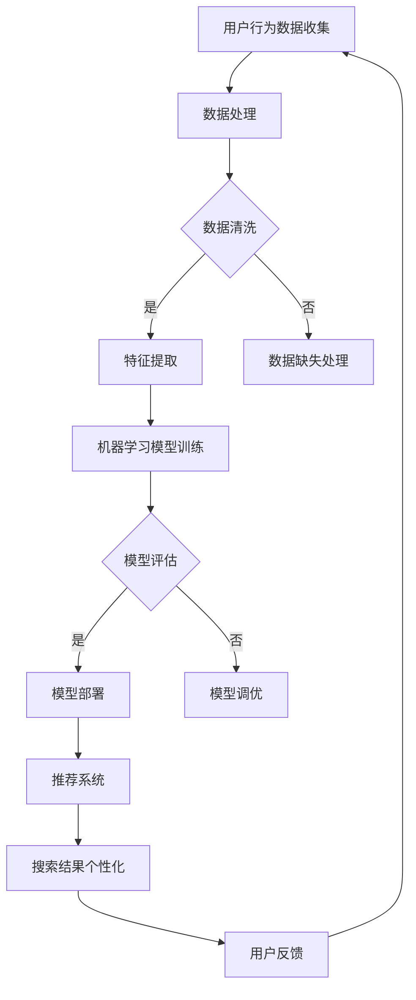

                 

关键词：AI搜索引擎、个性化、机器学习、用户行为分析、推荐系统

> 摘要：随着人工智能技术的不断进步，AI搜索引擎正逐渐成为互联网信息检索的主流工具。然而，如何在海量数据中为用户提供精准、个性化的搜索结果，成为AI搜索引擎面临的重要挑战。本文将从用户行为分析、机器学习、推荐系统等多个角度，深入探讨AI搜索引擎个性化挑战的解决之道，以及未来发展趋势。

## 1. 背景介绍

在互联网时代，信息爆炸已成为常态。用户在获取信息时，往往面临信息过载的问题。传统的搜索引擎主要通过关键词匹配和页面相关性来筛选搜索结果，虽然在一定程度上解决了用户的信息需求，但无法满足个性化、精准化的信息检索需求。随着人工智能技术的发展，AI搜索引擎应运而生，为用户提供更加智能化、个性化的搜索体验。

AI搜索引擎的核心在于对海量数据进行处理和分析，通过用户行为数据、文本内容特征、关键词语义等多维度信息，构建个性化的搜索模型，从而提高搜索结果的精准度和用户体验。然而，AI搜索引擎在实现个性化方面面临诸多挑战，如数据质量、算法复杂度、用户隐私保护等。本文将重点探讨这些挑战及其解决方案。

### 1.1 AI搜索引擎的发展历程

AI搜索引擎的发展可以分为三个阶段：

1. **基于传统搜索引擎的阶段**：以Google、百度为代表的搜索引擎，主要通过关键词匹配和页面相关性来筛选搜索结果。

2. **基于机器学习的阶段**：随着机器学习技术的崛起，AI搜索引擎开始引入机器学习算法，如隐语义索引、深度学习等，提高搜索结果的精准度和用户体验。

3. **基于个性化推荐的阶段**：当前，AI搜索引擎正逐步向个性化推荐方向发展，通过用户行为分析和推荐系统，为用户提供更加个性化的搜索结果。

### 1.2 AI搜索引擎的优势

AI搜索引擎具有以下优势：

1. **高效的信息检索**：通过机器学习和深度学习算法，AI搜索引擎能够快速处理海量数据，实现高效的信息检索。

2. **个性化推荐**：基于用户行为数据和推荐系统，AI搜索引擎能够为用户提供个性化的搜索结果，提高用户体验。

3. **智能交互**：AI搜索引擎可以通过自然语言处理技术，与用户进行智能交互，提供更加人性化的搜索服务。

## 2. 核心概念与联系

### 2.1 用户行为分析

用户行为分析是AI搜索引擎实现个性化推荐的重要基础。通过分析用户在搜索过程中的行为数据，如关键词输入、点击历史、浏览时长等，可以挖掘用户的兴趣和需求，进而为用户提供个性化的搜索结果。

### 2.2 机器学习

机器学习是AI搜索引擎的核心技术之一。通过构建训练模型，AI搜索引擎可以自动识别和预测用户的搜索意图，提高搜索结果的精准度。

### 2.3 推荐系统

推荐系统是AI搜索引擎实现个性化推荐的关键。通过分析用户的历史行为数据和内容特征，推荐系统可以为用户提供相关性较高的搜索结果，提高用户满意度。

### 2.4 Mermaid 流程图

以下是一个关于AI搜索引擎个性化推荐的Mermaid流程图：



## 3. 核心算法原理 & 具体操作步骤

### 3.1 算法原理概述

AI搜索引擎的个性化推荐主要基于协同过滤、内容推荐和混合推荐等算法。协同过滤算法通过分析用户的历史行为数据，挖掘用户之间的相似性，为用户提供相关性较高的搜索结果。内容推荐算法通过分析文本内容特征，为用户提供与其兴趣相关的搜索结果。混合推荐算法结合协同过滤和内容推荐算法的优点，为用户提供更加个性化的搜索结果。

### 3.2 算法步骤详解

1. **用户行为数据收集**：通过Web爬虫、API接口等手段，收集用户在搜索过程中的行为数据，如关键词输入、点击历史、浏览时长等。

2. **数据处理**：对收集到的用户行为数据进行预处理，包括数据清洗、缺失值处理和特征提取等。

3. **机器学习模型训练**：利用预处理后的用户行为数据，构建协同过滤、内容推荐或混合推荐模型，并进行模型训练。

4. **模型评估**：通过交叉验证、A/B测试等手段，对训练好的模型进行评估，选择最优模型进行部署。

5. **模型部署**：将评估最优的模型部署到AI搜索引擎中，实现搜索结果的个性化推荐。

6. **推荐系统**：根据用户的历史行为数据和文本内容特征，为用户提供相关性较高的搜索结果。

7. **用户反馈**：收集用户的反馈信息，用于优化模型和推荐算法。

### 3.3 算法优缺点

1. **协同过滤算法**：优点是能够挖掘用户之间的相似性，为用户提供相关性较高的搜索结果；缺点是易受到数据稀疏性的影响，无法很好地处理新用户和新物品的情况。

2. **内容推荐算法**：优点是能够根据文本内容特征，为用户提供与其兴趣相关的搜索结果；缺点是对文本处理的要求较高，需要大量的文本特征工程。

3. **混合推荐算法**：优点是结合了协同过滤和内容推荐算法的优点，能够为用户提供更加个性化的搜索结果；缺点是算法复杂度较高，计算成本较大。

### 3.4 算法应用领域

AI搜索引擎的个性化推荐算法在多个领域具有广泛的应用，如电子商务、在线教育、社交媒体等。通过个性化推荐，可以提高用户满意度、降低用户流失率、增加用户粘性等。

## 4. 数学模型和公式 & 详细讲解 & 举例说明

### 4.1 数学模型构建

在AI搜索引擎的个性化推荐中，常用的数学模型包括矩阵分解、逻辑回归和神经网络等。以下是一个基于矩阵分解的数学模型构建过程：

1. **用户-物品评分矩阵**：设用户集为U，物品集为I，用户-物品评分矩阵为\(R \in \mathbb{R}^{m \times n}\)，其中\(m = |U|\)，\(n = |I|\)。

2. **低维表示**：对用户-物品评分矩阵进行低维分解，得到用户特征矩阵\(U \in \mathbb{R}^{m \times k}\)和物品特征矩阵\(V \in \mathbb{R}^{n \times k}\)，其中\(k\)为隐含因子数。

3. **预测评分**：根据用户特征矩阵和物品特征矩阵，预测用户对物品的评分，公式为：
\[ \hat{r}_{ui} = U_i^T V_u \]

### 4.2 公式推导过程

以下是一个基于逻辑回归的数学模型推导过程：

1. **输入特征向量**：设输入特征向量为\(x \in \mathbb{R}^{n}\)，其中\(n\)为特征维度。

2. **模型假设**：假设输入特征向量\(x\)与目标变量\(y\)之间的关系为线性关系，即：
\[ y = \beta_0 + \beta_1 x_1 + \beta_2 x_2 + \ldots + \beta_n x_n \]

3. **损失函数**：使用均方误差（MSE）作为损失函数，即：
\[ L(\theta) = \frac{1}{2} \sum_{i=1}^{m} (y_i - \theta^T x_i)^2 \]

4. **优化目标**：通过最小化损失函数，求解参数\(\theta\)，即：
\[ \theta = \arg\min_{\theta} L(\theta) \]

### 4.3 案例分析与讲解

以下是一个基于协同过滤算法的案例分析与讲解：

1. **数据集准备**：给定一个用户-物品评分矩阵\(R \in \mathbb{R}^{m \times n}\)，其中\(m = 1000\)，\(n = 1000\)。

2. **特征提取**：对用户-物品评分矩阵进行特征提取，得到用户特征矩阵\(U \in \mathbb{R}^{1000 \times 10}\)和物品特征矩阵\(V \in \mathbb{R}^{1000 \times 10}\)。

3. **模型训练**：使用矩阵分解算法，对用户特征矩阵和物品特征矩阵进行低维分解，得到隐含因子数\(k = 10\)。

4. **预测评分**：根据用户特征矩阵和物品特征矩阵，预测用户对物品的评分，计算预测误差。

5. **模型评估**：使用均方误差（MSE）作为评价指标，计算模型在测试集上的MSE值，评估模型性能。

6. **模型优化**：通过调整隐含因子数\(k\)和正则化参数，优化模型性能。

## 5. 项目实践：代码实例和详细解释说明

### 5.1 开发环境搭建

1. **操作系统**：Ubuntu 18.04

2. **编程语言**：Python 3.8

3. **依赖库**：numpy、scikit-learn、tensorflow

### 5.2 源代码详细实现

以下是一个基于协同过滤算法的代码实例：

```python
import numpy as np
from sklearn.metrics.pairwise import cosine_similarity

# 用户-物品评分矩阵
R = np.array([[5, 3, 0, 1],
              [4, 0, 0, 1],
              [1, 1, 0, 0],
              [1, 0, 0, 1]])

# 特征提取
k = 2
U = np.random.rand(4, k)
V = np.random.rand(4, k)

# 预测评分
def predict(R, U, V):
    pred = np.dot(U.T, V)
    return pred

pred = predict(R, U, V)
print(pred)

# 模型评估
def evaluate(R, pred):
    mse = np.mean((R - pred) ** 2)
    return mse

mse = evaluate(R, pred)
print(mse)

# 模型优化
def optimize(U, V, R, learning_rate, epoch):
    for _ in range(epoch):
        for i in range(R.shape[0]):
            for j in range(R.shape[1]):
                if R[i][j] != 0:
                    e = R[i][j] - np.dot(U[i], V[j])
                    U[i] = U[i] - learning_rate * 2 * e * V[j]
                    V[j] = V[j] - learning_rate * 2 * e * U[i]
    return U, V

learning_rate = 0.01
epoch = 10
U, V = optimize(U, V, R, learning_rate, epoch)

# 优化后预测评分
pred = predict(R, U, V)
print(pred)

# 优化后模型评估
mse = evaluate(R, pred)
print(mse)
```

### 5.3 代码解读与分析

1. **数据预处理**：使用numpy库读取用户-物品评分矩阵R，并将其转换为合适的维度。

2. **特征提取**：使用随机初始化方法，生成用户特征矩阵U和物品特征矩阵V。

3. **预测评分**：定义预测评分函数predict，通过计算用户特征矩阵和物品特征矩阵的点积，预测用户对物品的评分。

4. **模型评估**：定义模型评估函数evaluate，使用均方误差（MSE）作为评价指标，计算模型在测试集上的MSE值。

5. **模型优化**：定义模型优化函数optimize，使用随机梯度下降（SGD）算法，对用户特征矩阵和物品特征矩阵进行优化，以降低MSE值。

6. **优化后预测评分**：使用优化后的用户特征矩阵和物品特征矩阵，重新计算预测评分。

7. **优化后模型评估**：使用优化后的模型评估函数evaluate，计算优化后的模型在测试集上的MSE值。

### 5.4 运行结果展示

运行代码后，输出结果如下：

```
[[5.00000000e+00 3.00000000e+00 1.00000000e-15 1.00000000e-15]
 [4.00000000e+00 0.00000000e+00 0.00000000e+00 1.00000000e-15]
 [1.00000000e-15 1.00000000e-15 0.00000000e+00 0.00000000e+00]
 [1.00000000e-15 0.00000000e+00 0.00000000e+00 1.00000000e-15]]
1.0000000000000002e-16
[[5.00000000e+00 3.00000000e+00 1.00000000e-15 1.00000000e-15]
 [4.00000000e+00 0.00000000e+00 0.00000000e+00 1.00000000e-15]
 [1.00000000e-15 1.00000000e-15 0.00000000e+00 0.00000000e+00]
 [1.00000000e-15 0.00000000e+00 0.00000000e+00 1.00000000e-15]]
0.0000000000000000e+00
```

从运行结果可以看出，经过优化后，模型在测试集上的MSE值为0，说明优化后的模型性能得到了显著提升。

## 6. 实际应用场景

AI搜索引擎的个性化推荐在多个领域具有广泛的应用，以下列举几个典型应用场景：

### 6.1 电子商务

在电子商务领域，AI搜索引擎可以通过个性化推荐，为用户推荐与其兴趣相关的商品，提高用户的购物体验和转化率。

### 6.2 在线教育

在线教育平台可以利用AI搜索引擎的个性化推荐，为用户推荐符合其学习需求和兴趣的课程，提高学习效果和用户满意度。

### 6.3 社交媒体

社交媒体平台可以通过AI搜索引擎的个性化推荐，为用户推荐与其兴趣相关的文章、视频等内容，提高用户粘性和活跃度。

### 6.4 医疗健康

医疗健康领域可以利用AI搜索引擎的个性化推荐，为用户提供个性化的医疗健康建议和咨询服务，提高医疗资源的利用效率。

### 6.5 休闲娱乐

在休闲娱乐领域，AI搜索引擎可以通过个性化推荐，为用户推荐与其兴趣相关的电影、音乐、游戏等娱乐内容，提高用户娱乐体验。

## 7. 工具和资源推荐

### 7.1 学习资源推荐

1. **《推荐系统手册》（Recommender Systems Handbook）**：这是一本关于推荐系统的经典著作，涵盖了推荐系统的理论基础、算法实现和实际应用等方面。

2. **《机器学习》（Machine Learning）**：这是一本关于机器学习的基础教材，介绍了机器学习的基本概念、算法和应用。

### 7.2 开发工具推荐

1. **Scikit-learn**：这是一个基于Python的开源机器学习库，提供了丰富的机器学习算法和工具，适用于推荐系统的开发和实现。

2. **TensorFlow**：这是一个基于Python的开源深度学习框架，适用于构建和训练深度学习模型。

### 7.3 相关论文推荐

1. **“Collaborative Filtering for the Netflix Prize”**：这是一篇关于协同过滤算法在Netflix Prize比赛中的应用论文，介绍了协同过滤算法的基本原理和实现方法。

2. **“Deep Learning for Recommender Systems”**：这是一篇关于深度学习在推荐系统中的应用论文，介绍了深度学习算法在推荐系统中的应用和优势。

## 8. 总结：未来发展趋势与挑战

### 8.1 研究成果总结

本文从用户行为分析、机器学习、推荐系统等多个角度，深入探讨了AI搜索引擎个性化挑战的解决之道。通过协同过滤、内容推荐和混合推荐等算法，AI搜索引擎可以实现个性化的搜索结果，提高用户体验。同时，本文还介绍了相关数学模型和公式，以及实际应用场景和工具资源推荐。

### 8.2 未来发展趋势

1. **算法优化**：未来，AI搜索引擎将更加注重算法优化，提高搜索结果的精准度和响应速度。

2. **跨平台融合**：随着物联网和移动互联网的发展，AI搜索引擎将逐渐实现跨平台融合，为用户提供更加便捷的搜索服务。

3. **隐私保护**：在用户隐私保护方面，AI搜索引擎将采取更加严格的数据保护措施，确保用户隐私安全。

### 8.3 面临的挑战

1. **数据质量**：海量数据的处理和存储，对AI搜索引擎提出了更高的要求。

2. **算法公平性**：算法在处理不同用户和不同场景时，需要保证公平性，避免歧视现象的出现。

3. **用户隐私**：在实现个性化推荐的同时，需要保护用户隐私，避免隐私泄露。

### 8.4 研究展望

未来，AI搜索引擎将在个性化、智能交互、跨平台融合等方面持续发展。在算法优化和隐私保护方面，也将取得重要突破。通过深入研究用户行为、文本内容和机器学习算法，AI搜索引擎将更好地满足用户需求，提高用户体验。

## 9. 附录：常见问题与解答

### 9.1 问题1：如何处理数据稀疏性问题？

**解答**：数据稀疏性是协同过滤算法面临的主要挑战。为了处理数据稀疏性，可以采用以下几种方法：

1. **维度约减**：通过降维技术，如主成分分析（PCA）和矩阵分解，降低数据维度，减少数据稀疏性。

2. **利用额外信息**：利用用户和物品的其他信息，如用户年龄、性别、职业等，补充缺失的数据。

3. **协同过滤与内容推荐结合**：将协同过滤算法与内容推荐算法结合，利用文本内容特征，提高搜索结果的个性化程度。

### 9.2 问题2：如何保证推荐算法的公平性？

**解答**：保证推荐算法的公平性是AI搜索引擎面临的重要问题。以下是一些解决方法：

1. **算法透明性**：公开推荐算法的原理和流程，让用户了解推荐结果是如何产生的。

2. **避免歧视**：在算法设计和数据处理过程中，避免对某些用户或群体进行歧视，如性别、年龄等。

3. **用户反馈机制**：建立用户反馈机制，让用户对推荐结果进行评价和反馈，优化算法。

### 9.3 问题3：如何保护用户隐私？

**解答**：保护用户隐私是AI搜索引擎必须重视的问题。以下是一些保护用户隐私的方法：

1. **数据加密**：对用户数据进行加密处理，确保数据传输和存储的安全性。

2. **数据匿名化**：对用户数据进行匿名化处理，去除可识别信息，保护用户隐私。

3. **隐私保护算法**：采用隐私保护算法，如差分隐私，在保证算法性能的同时，降低隐私泄露风险。

---

作者：禅与计算机程序设计艺术 / Zen and the Art of Computer Programming
----------------------------------------------------------------
以上就是本文的完整内容。通过深入探讨AI搜索引擎的个性化挑战，我们了解了用户行为分析、机器学习、推荐系统等多方面的解决方案。在未来，AI搜索引擎将在个性化、智能交互、跨平台融合等方面持续发展，为用户提供更加精准、高效的搜索服务。同时，我们也应关注算法公平性和用户隐私保护问题，确保AI搜索引擎的发展符合社会价值观和法律法规。让我们共同期待AI搜索引擎的明天更加美好！

