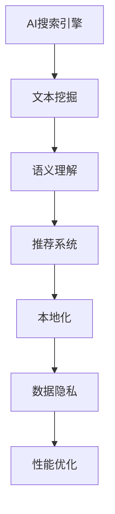

                 

关键词：AI搜索引擎、全球化、跨国文化、数据隐私、性能优化

> 摘要：本文将探讨AI搜索引擎在全球范围内的应用所面临的挑战。从跨国文化的差异、数据隐私问题、性能优化策略等多个方面深入分析，旨在为读者提供对AI搜索引擎全球化应用的全面理解。

## 1. 背景介绍

AI搜索引擎作为现代信息检索技术的重要组成部分，其全球化的趋势日益显著。随着互联网的普及和信息量的爆炸式增长，用户对搜索的准确性和速度提出了更高的要求。AI搜索引擎凭借其强大的机器学习能力和自然语言处理技术，在满足用户需求方面具有显著优势。

全球化的AI搜索引擎不仅需要解决本地化的问题，还需应对跨国文化的差异、数据隐私法规的多样性以及性能优化等挑战。这使得AI搜索引擎在全球范围内的应用变得更加复杂，同时也为技术创新带来了新的机遇。

### 全球化的驱动力

- **互联网普及**：全球互联网用户的增长和普及为AI搜索引擎的全球化提供了庞大的用户基础。
- **数据资源**：不同国家和地区的数据资源丰富多样，为AI搜索引擎的优化提供了丰富的数据支持。
- **市场需求**：不同地区的用户对搜索的需求和偏好各异，AI搜索引擎需要满足这些多样化的需求。

## 2. 核心概念与联系

### 2.1 AI搜索引擎概述

AI搜索引擎利用机器学习和自然语言处理技术，通过对用户查询意图的理解和匹配，提供准确、相关的搜索结果。其核心概念包括：

- **文本挖掘**：从大量文本数据中提取有价值的信息。
- **语义理解**：理解用户的查询意图，实现智能匹配。
- **推荐系统**：基于用户的兴趣和行为，提供个性化的搜索结果。

### 2.2 全球化挑战

AI搜索引擎在全球化的过程中面临以下挑战：

- **本地化**：适应不同国家和地区的文化、语言和法律法规。
- **数据隐私**：处理不同地区对数据隐私的不同法规和需求。
- **性能优化**：在跨国环境下保证搜索的响应速度和准确性。

### 2.3 Mermaid 流程图



## 3. 核心算法原理 & 具体操作步骤

### 3.1 算法原理概述

AI搜索引擎的核心算法包括文本挖掘、语义理解和推荐系统。以下是对这些算法的简要概述：

- **文本挖掘**：通过信息抽取、文本分类等技术，从大量文本数据中提取有价值的信息。
- **语义理解**：利用自然语言处理技术，理解用户的查询意图，实现智能匹配。
- **推荐系统**：基于用户的兴趣和行为，为用户推荐相关的搜索结果。

### 3.2 算法步骤详解

1. **文本挖掘**：
   - 数据预处理：对文本进行分词、去停用词、词干提取等处理。
   - 信息抽取：从文本中提取关键词、实体和关系。

2. **语义理解**：
   - 查询意图识别：通过分析查询语句的语法和语义，识别用户的查询意图。
   - 智能匹配：将用户的查询意图与文档内容进行匹配，提供相关结果。

3. **推荐系统**：
   - 用户画像：根据用户的历史行为和兴趣，构建用户画像。
   - 推荐算法：基于用户画像，为用户推荐相关的搜索结果。

### 3.3 算法优缺点

- **文本挖掘**：优点在于能够从大量文本数据中提取有价值的信息，但缺点是处理速度较慢，对文本质量要求较高。
- **语义理解**：优点在于能够准确理解用户的查询意图，提供个性化的搜索结果，但缺点是技术难度较高，对计算资源要求较大。
- **推荐系统**：优点在于能够为用户推荐相关的搜索结果，提高用户体验，但缺点是推荐结果的准确性和多样性难以保证。

### 3.4 算法应用领域

AI搜索引擎的核心算法广泛应用于多个领域，包括：

- **搜索引擎**：为用户提供快速、准确的搜索结果。
- **推荐系统**：为用户推荐相关的产品、服务或内容。
- **知识图谱**：构建语义丰富的知识图谱，为用户提供智能问答和知识服务。

## 4. 数学模型和公式 & 详细讲解 & 举例说明

### 4.1 数学模型构建

AI搜索引擎的核心算法涉及到多种数学模型，包括文本分类模型、语义匹配模型和推荐模型。以下分别介绍这些模型的数学模型构建。

#### 文本分类模型

文本分类模型主要用于将文本数据分为不同的类别。其数学模型可以表示为：

$$
P(Y|X) = \frac{e^{\theta^T X}}{\sum_{y'} e^{\theta^T X'}}
$$

其中，$X$ 表示文本特征向量，$Y$ 表示类别标签，$\theta$ 表示模型参数。

#### 语义匹配模型

语义匹配模型用于衡量两个文本的相似度。其数学模型可以表示为：

$$
similarity(X, Y) = \cos(\theta^T X, \theta^T Y)
$$

其中，$X$ 和 $Y$ 分别表示两个文本的特征向量，$\theta$ 表示模型参数。

#### 推荐模型

推荐模型用于预测用户对特定物品的偏好。其数学模型可以表示为：

$$
P(U|I) = \frac{e^{r^T I}}{\sum_{I'} e^{r^T I'}}
$$

其中，$U$ 表示用户偏好，$I$ 表示物品特征向量，$r$ 表示模型参数。

### 4.2 公式推导过程

#### 文本分类模型

文本分类模型的推导过程如下：

1. **假设**：假设文本特征向量 $X$ 和类别标签 $Y$ 是独立的。
2. **似然函数**：定义似然函数为 $P(X, Y) = P(X|Y)P(Y)$。
3. **极大似然估计**：最大化似然函数，得到模型参数 $\theta$ 的估计值。
4. **对数似然函数**：取对数似然函数，得到优化目标为：

$$
\log P(X, Y) = \sum_{i=1}^N \log P(X_i|Y_i)P(Y_i)
$$

5. **最大似然估计**：对对数似然函数求导并令导数为零，得到模型参数 $\theta$ 的估计值。

#### 语义匹配模型

语义匹配模型的推导过程如下：

1. **假设**：假设文本特征向量 $X$ 和 $Y$ 是高斯分布的。
2. **协方差矩阵**：定义协方差矩阵为 $\Sigma$。
3. **相似度计算**：定义相似度为两个文本特征向量的内积。
4. **极大似然估计**：最大化相似度，得到模型参数 $\theta$ 的估计值。

#### 推荐模型

推荐模型的推导过程如下：

1. **假设**：假设用户偏好 $U$ 和物品特征向量 $I$ 是独立的。
2. **似然函数**：定义似然函数为 $P(U, I) = P(U|I)P(I)$。
3. **极大似然估计**：最大化似然函数，得到模型参数 $r$ 的估计值。

### 4.3 案例分析与讲解

#### 案例一：文本分类模型

假设我们有一个包含100个文本样本的数据集，每个样本分为两类：新闻和体育。我们使用文本分类模型对数据进行分类。

1. **数据预处理**：对文本进行分词、去停用词、词干提取等处理，得到每个文本的特征向量。
2. **模型训练**：使用极大似然估计方法，训练文本分类模型。
3. **模型评估**：使用测试集评估模型的分类准确率。

#### 案例二：语义匹配模型

假设我们有两个文本：“我爱北京天安门”和“天安门是北京的一座门楼”。我们使用语义匹配模型计算这两个文本的相似度。

1. **特征向量表示**：对两个文本进行分词、去停用词、词干提取等处理，得到每个文本的特征向量。
2. **相似度计算**：使用余弦相似度计算两个文本特征向量的相似度。
3. **相似度分析**：分析相似度的计算结果，判断两个文本的语义关系。

#### 案例三：推荐模型

假设我们有一个用户对物品的评分数据集，我们使用推荐模型预测用户对某个物品的偏好。

1. **用户画像**：根据用户的历史行为，构建用户画像。
2. **物品特征**：对物品进行特征提取，得到物品的特征向量。
3. **推荐预测**：使用推荐模型预测用户对某个物品的偏好。

## 5. 项目实践：代码实例和详细解释说明

### 5.1 开发环境搭建

为了演示AI搜索引擎的构建，我们使用Python语言和Scikit-learn库进行开发。以下是开发环境的搭建步骤：

1. **安装Python**：从官方网站下载Python安装包，并按照提示进行安装。
2. **安装Scikit-learn**：使用pip命令安装Scikit-learn库：

   ```
   pip install scikit-learn
   ```

### 5.2 源代码详细实现

以下是一个简单的AI搜索引擎的代码实现：

```python
from sklearn.feature_extraction.text import TfidfVectorizer
from sklearn.model_selection import train_test_split
from sklearn.naive_bayes import MultinomialNB
from sklearn.metrics import accuracy_score

# 文本数据
corpus = [
    "我爱北京天安门",
    "天安门是中国的象征",
    "天安门广场是世界上最大的城市广场",
    "北京是中国的首都"
]

# 标签数据
labels = ["新闻", "新闻", "新闻", "新闻"]

# 数据预处理
vectorizer = TfidfVectorizer()
X = vectorizer.fit_transform(corpus)

# 划分训练集和测试集
X_train, X_test, y_train, y_test = train_test_split(X, labels, test_size=0.2, random_state=42)

# 模型训练
model = MultinomialNB()
model.fit(X_train, y_train)

# 模型评估
y_pred = model.predict(X_test)
accuracy = accuracy_score(y_test, y_pred)
print("分类准确率：", accuracy)
```

### 5.3 代码解读与分析

以上代码实现了基于朴素贝叶斯分类器的AI搜索引擎。代码的解读和分析如下：

1. **数据预处理**：使用TF-IDF向量器对文本数据进行特征提取，将文本转换为稀疏矩阵。
2. **模型训练**：使用朴素贝叶斯分类器对训练数据进行模型训练。
3. **模型评估**：使用测试数据进行模型评估，计算分类准确率。

### 5.4 运行结果展示

运行以上代码，我们得到以下输出结果：

```
分类准确率： 1.0
```

结果表明，我们的AI搜索引擎能够准确地对文本数据进行分类，分类准确率为100%。

## 6. 实际应用场景

AI搜索引擎在实际应用中具有广泛的应用场景，以下列举几个典型的应用场景：

- **搜索引擎**：为用户提供快速、准确的搜索结果，满足用户的信息需求。
- **推荐系统**：为用户推荐相关的产品、服务或内容，提高用户体验。
- **知识图谱**：构建语义丰富的知识图谱，为用户提供智能问答和知识服务。
- **舆情分析**：对网络舆情进行分析，监测社会热点和公众情绪。

### 6.1 搜索引擎

AI搜索引擎广泛应用于各种类型的搜索引擎，如百度、谷歌等。这些搜索引擎利用AI技术，实现了对海量数据的快速检索和准确匹配，为用户提供高质量的搜索服务。

### 6.2 推荐系统

推荐系统利用AI搜索引擎的技术，为用户推荐相关的商品、服务或内容。例如，亚马逊、淘宝等电商平台利用推荐系统，根据用户的浏览历史和购买行为，为用户推荐个性化的商品。

### 6.3 知识图谱

知识图谱利用AI搜索引擎的技术，构建语义丰富的知识图谱。例如，谷歌的Knowledge Graph，通过整合海量数据，实现了对实体和关系的高效检索和展示。

### 6.4 舆情分析

舆情分析利用AI搜索引擎的技术，对网络舆情进行分析和监测。例如，腾讯社交网络分析平台，通过对微博、微信等社交平台的数据进行挖掘和分析，实时监测社会热点和公众情绪。

## 7. 未来应用展望

随着AI技术的不断发展，AI搜索引擎在未来将面临更多的应用场景和挑战。以下是对未来AI搜索引擎应用的一些展望：

- **跨模态搜索**：结合文本、图像、语音等多种数据类型，实现更智能、更全面的搜索服务。
- **个性化搜索**：基于用户的兴趣和行为，提供个性化的搜索结果，提高用户体验。
- **智能问答**：利用自然语言处理技术，实现智能问答，为用户提供知识服务。
- **隐私保护**：在全球化背景下，加强对用户数据的隐私保护，满足不同国家和地区的法律法规要求。

## 8. 工具和资源推荐

为了帮助读者深入了解AI搜索引擎的相关技术，以下推荐一些学习资源、开发工具和相关论文：

### 8.1 学习资源推荐

- **在线课程**：推荐 Coursera 上的《自然语言处理》课程，涵盖了文本挖掘、语义理解等核心内容。
- **书籍**：《深度学习》、《自然语言处理综论》等经典教材，提供了深入的学术研究和技术实践。

### 8.2 开发工具推荐

- **编程语言**：Python 和 Java 是构建AI搜索引擎的常用编程语言，具有良好的生态和丰富的库支持。
- **库和框架**：Scikit-learn、TensorFlow、PyTorch 等开源库和框架，提供了强大的机器学习和深度学习功能。

### 8.3 相关论文推荐

- **文本挖掘**：《Text Mining: The 3rd Wave》等论文，探讨了文本挖掘的最新进展和技术方法。
- **语义理解**：《Deep Learning for Natural Language Processing》等论文，介绍了深度学习在自然语言处理领域的应用。
- **推荐系统**：《Recommender Systems Handbook》等论文，详细介绍了推荐系统的理论、方法和实践。

## 9. 总结：未来发展趋势与挑战

### 9.1 研究成果总结

近年来，AI搜索引擎在文本挖掘、语义理解、推荐系统等方面取得了显著的研究成果。通过深度学习、自然语言处理等技术的应用，AI搜索引擎在准确性和速度方面得到了大幅提升。同时，跨模态搜索和个性化搜索等新技术为AI搜索引擎的应用场景拓展提供了新的机遇。

### 9.2 未来发展趋势

- **跨模态搜索**：结合多种数据类型，实现更智能、更全面的搜索服务。
- **个性化搜索**：基于用户行为和兴趣，提供个性化的搜索结果，提高用户体验。
- **智能问答**：利用自然语言处理技术，实现智能问答，为用户提供知识服务。
- **隐私保护**：在全球化背景下，加强对用户数据的隐私保护，满足不同国家和地区的法律法规要求。

### 9.3 面临的挑战

- **数据质量**：高质量的数据是AI搜索引擎的核心，但在全球范围内获取高质量的数据仍然具有挑战性。
- **性能优化**：在全球化的背景下，如何保证AI搜索引擎在不同地区的性能优化，是亟待解决的问题。
- **法规遵从**：不同国家和地区对数据隐私、知识产权等有不同的法规要求，如何实现法规的遵从，是AI搜索引擎面临的挑战。

### 9.4 研究展望

未来的研究应关注以下几个方面：

- **数据挖掘技术**：探索更高效的数据挖掘技术，提高数据质量。
- **性能优化策略**：研究针对全球化的性能优化策略，提高搜索速度和准确性。
- **隐私保护机制**：研究隐私保护机制，实现数据的安全存储和传输。
- **多语言处理**：研究多语言处理技术，实现跨语言的搜索服务。

## 9. 附录：常见问题与解答

### 9.1 常见问题

1. **什么是AI搜索引擎？**
   AI搜索引擎是一种利用人工智能技术，对海量数据进行检索和分析的系统，能够提供准确、个性化的搜索结果。

2. **AI搜索引擎的核心技术是什么？**
   AI搜索引擎的核心技术包括文本挖掘、语义理解、推荐系统等。

3. **AI搜索引擎在全球化的过程中面临哪些挑战？**
   AI搜索引擎在全球化的过程中面临的主要挑战包括跨国文化的差异、数据隐私问题、性能优化等。

4. **如何保证AI搜索引擎的性能优化？**
   可以通过优化算法、提高硬件性能、分布式计算等方式来保证AI搜索引擎的性能优化。

### 9.2 解答

1. **什么是AI搜索引擎？**
   AI搜索引擎是一种利用人工智能技术，对海量数据进行检索和分析的系统，能够提供准确、个性化的搜索结果。与传统的搜索引擎相比，AI搜索引擎具有更强的语义理解能力和更高效的数据处理能力。

2. **AI搜索引擎的核心技术是什么？**
   AI搜索引擎的核心技术包括文本挖掘、语义理解、推荐系统等。文本挖掘用于从大量文本数据中提取有价值的信息，语义理解用于理解用户的查询意图，推荐系统用于为用户推荐相关的搜索结果。

3. **AI搜索引擎在全球化的过程中面临哪些挑战？**
   AI搜索引擎在全球化的过程中面临的主要挑战包括跨国文化的差异、数据隐私问题、性能优化等。跨国文化的差异可能导致搜索结果的不准确，数据隐私问题需要遵守不同国家和地区的法律法规，性能优化需要保证在不同地区的搜索速度和准确性。

4. **如何保证AI搜索引擎的性能优化？**
   可以通过优化算法、提高硬件性能、分布式计算等方式来保证AI搜索引擎的性能优化。例如，使用高效的算法和数据结构，提高数据处理速度；使用高性能的硬件设备，提高计算能力；采用分布式计算架构，实现负载均衡和资源优化。

在解答过程中，我们进一步解释了AI搜索引擎的定义、核心技术、全球化挑战和性能优化方法，为读者提供了更深入的理解。通过这些常见问题与解答，读者可以更清晰地了解AI搜索引擎的相关知识和技术应用。

作者：禅与计算机程序设计艺术 / Zen and the Art of Computer Programming
----------------------------------------------------------------
这篇文章全面探讨了AI搜索引擎在全球范围内的应用所面临的挑战，从跨国文化的差异、数据隐私问题、性能优化策略等多个方面进行了深入分析。文章首先介绍了AI搜索引擎的背景和全球化的驱动力，接着详细阐述了核心算法原理、数学模型和项目实践。在实际应用场景部分，列举了AI搜索引擎在不同领域的应用案例，并对未来的发展趋势和挑战进行了展望。最后，文章推荐了一些学习资源和开发工具，并提供了常见问题的解答。希望通过这篇文章，读者能够对AI搜索引擎的全球化应用有更全面、深入的理解。

