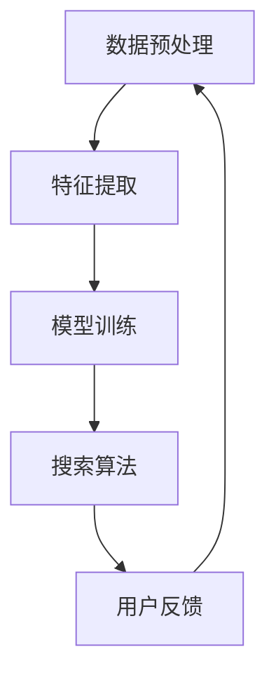

                 

关键词：人工智能，搜索引擎，用户体验，算法优化，未来趋势

摘要：随着人工智能技术的迅猛发展，搜索引擎在用户体验和性能优化方面面临着巨大的挑战和机遇。本文从用户需求出发，探讨了AI搜索引擎的未来发展趋势，重点关注以用户为中心的体验优化策略，并提出了相应的算法原理和实践案例。

## 1. 背景介绍

在互联网时代，搜索引擎已成为人们获取信息的重要工具。然而，传统搜索引擎在处理海量数据、提供个性化搜索结果、实时响应用户需求等方面存在诸多不足。随着人工智能技术的快速发展，特别是深度学习、自然语言处理、强化学习等技术的应用，AI搜索引擎正逐渐成为未来互联网的关键基础设施。

AI搜索引擎的目标是提供更加智能、高效、个性化的搜索体验。在用户层面上，这体现在快速准确地获取所需信息、智能推荐相关内容、实时响应用户反馈等方面。在技术层面上，这需要解决数据处理、算法优化、模型训练、安全性等多方面的问题。

### 1.1 AI搜索引擎的发展历程

AI搜索引擎的发展可以分为以下几个阶段：

1. **基于关键词匹配的传统搜索引擎**：以Google为代表的搜索引擎通过关键词匹配和页面排名算法提供搜索结果，但存在大量冗余信息、无法处理复杂查询等问题。

2. **基于机器学习的搜索引擎**：引入机器学习算法，如协同过滤、隐语义模型等，改进搜索结果的准确性和相关性。

3. **基于深度学习的搜索引擎**：利用深度神经网络处理复杂任务，如图像识别、语音识别等，为搜索引擎提供更强大的数据处理能力和智能化搜索能力。

4. **多模态搜索引擎**：结合多种数据类型（文本、图像、语音等），提供更加丰富和多样化的搜索体验。

### 1.2 AI搜索引擎的现状

当前，AI搜索引擎已经成为互联网巨头竞争的焦点。例如，Google、Bing、百度等搜索引擎都在积极引入人工智能技术，优化搜索体验。同时，一些新兴的AI搜索引擎，如Elasticsearch、Apache Solr等，也在不断推出基于AI的新功能，以满足用户需求。

### 1.3 AI搜索引擎面临的挑战

尽管AI搜索引擎在技术层面取得了显著进展，但在实际应用中仍然面临以下挑战：

1. **数据处理能力**：海量数据的高效处理和存储仍然是搜索引擎的关键问题。

2. **算法优化**：如何设计更加智能、高效的算法，提升搜索结果的准确性和用户体验，是一个亟待解决的问题。

3. **隐私保护**：用户数据的安全和隐私保护是搜索引擎需要高度重视的问题。

4. **跨领域应用**：如何将AI搜索引擎应用于不同领域，提供定制化的搜索服务，是一个重要的研究方向。

## 2. 核心概念与联系

AI搜索引擎的核心概念包括数据预处理、特征提取、模型训练、搜索算法等。下面我们将通过一个Mermaid流程图（图1）来展示这些概念之间的联系。



### 2.1 数据预处理

数据预处理是AI搜索引擎的基础工作，包括数据清洗、去重、分词、词性标注等步骤，为后续的特征提取和模型训练提供高质量的数据。

### 2.2 特征提取

特征提取是从原始数据中提取关键信息的过程，用于表示文本、图像、语音等多种数据类型。特征提取的质量直接影响到模型训练的效果和搜索结果的准确性。

### 2.3 模型训练

模型训练是AI搜索引擎的核心环节，通过训练深度神经网络、机器学习模型等，使搜索引擎能够自动识别用户意图、学习用户偏好，提高搜索结果的个性化和准确性。

### 2.4 搜索算法

搜索算法是AI搜索引擎的核心，用于在大量数据中快速、准确地找到与用户查询最相关的信息。常见的搜索算法包括基于关键词匹配的算法、基于机器学习的算法、基于深度学习的算法等。

### 2.5 用户反馈

用户反馈是AI搜索引擎不断优化和改进的重要依据。通过分析用户行为数据、搜索历史、评价等，搜索引擎可以不断调整和优化搜索结果，提升用户体验。

## 3. 核心算法原理 & 具体操作步骤

### 3.1 算法原理概述

AI搜索引擎的核心算法主要包括以下几类：

1. **基于关键词匹配的算法**：通过计算查询关键词与文档关键词之间的相似度，返回最相关的文档。

2. **基于机器学习的算法**：利用机器学习算法（如协同过滤、隐语义模型等）对用户历史行为进行分析，预测用户兴趣，提供个性化搜索结果。

3. **基于深度学习的算法**：利用深度神经网络处理复杂任务（如图像识别、语音识别等），为搜索引擎提供更强大的数据处理能力和智能化搜索能力。

### 3.2 算法步骤详解

下面以基于机器学习的算法为例，介绍其具体操作步骤。

1. **数据收集与预处理**：收集大量用户搜索数据，包括查询关键词、用户ID、搜索结果等。对数据进行清洗、去重、分词、词性标注等预处理操作。

2. **特征提取**：从原始数据中提取关键特征，如查询关键词、用户历史行为、文档内容等。常用的特征提取方法包括TF-IDF、Word2Vec、BERT等。

3. **模型训练**：利用提取的特征，训练机器学习模型（如线性回归、支持向量机、深度神经网络等），使模型能够自动识别用户意图、学习用户偏好。

4. **模型评估**：通过交叉验证、A/B测试等方法，评估模型性能，如准确率、召回率、F1值等。

5. **模型部署与优化**：将训练好的模型部署到搜索引擎中，根据用户反馈和搜索结果，不断调整和优化模型参数，提升搜索结果的个性化和准确性。

### 3.3 算法优缺点

**基于关键词匹配的算法**：

- 优点：简单易懂，计算速度快。
- 缺点：无法处理语义层面的查询，搜索结果存在大量冗余信息。

**基于机器学习的算法**：

- 优点：能够处理语义层面的查询，提供个性化搜索结果。
- 缺点：模型训练复杂，计算资源消耗大。

**基于深度学习的算法**：

- 优点：处理复杂任务的能力更强，搜索结果更准确。
- 缺点：模型训练时间较长，计算资源消耗大。

### 3.4 算法应用领域

AI搜索引擎算法在多个领域得到广泛应用，如：

- **搜索引擎**：提供个性化搜索服务，提升用户满意度。
- **推荐系统**：为用户提供个性化推荐，提高用户留存率。
- **问答系统**：利用自然语言处理技术，提供智能问答服务。
- **文本分类**：对大量文本进行分类，帮助用户快速找到感兴趣的内容。

## 4. 数学模型和公式 & 详细讲解 & 举例说明

### 4.1 数学模型构建

AI搜索引擎的核心算法通常基于以下数学模型：

1. **TF-IDF模型**：衡量关键词在文档中的重要性。
   \[TF(t,d) = \frac{f(t,d)}{N_d}\]
   \[IDF(t) = \log(\frac{N}{n_t})\]
   其中，\(f(t,d)\)表示关键词\(t\)在文档\(d\)中出现的次数，\(N_d\)表示文档\(d\)的总词数，\(N\)表示整个文档集中关键词\(t\)的文档总数，\(n_t\)表示文档集中包含关键词\(t\)的文档数。

2. **隐语义模型**：用于表示文档和查询的隐语义向量。
   \[r_{ij} = \frac{\sum_{k=1}^{K} w_{ik}w_{jk}}{\sqrt{\sum_{k=1}^{K} w_{ik}^2}\sqrt{\sum_{k=1}^{K} w_{jk}^2}}\]
   其中，\(r_{ij}\)表示文档\(i\)和查询\(j\)之间的相似度，\(w_{ik}\)和\(w_{jk}\)分别表示文档\(i\)和查询\(j\)的隐语义向量。

3. **深度学习模型**：如卷积神经网络（CNN）、循环神经网络（RNN）、Transformer等。
   \[y = \sigma(Wy + b)\]
   其中，\(y\)表示输出，\(W\)和\(b\)分别为权重和偏置。

### 4.2 公式推导过程

以TF-IDF模型为例，我们详细推导其计算公式。

1. **词频（TF）**：词频表示关键词在文档中出现的次数，计算公式为
   \[TF(t,d) = \frac{f(t,d)}{N_d}\]
   其中，\(f(t,d)\)表示关键词\(t\)在文档\(d\)中出现的次数，\(N_d\)表示文档\(d\)的总词数。

2. **逆文档频率（IDF）**：逆文档频率用于衡量关键词在整个文档集中的重要程度，计算公式为
   \[IDF(t) = \log(\frac{N}{n_t})\]
   其中，\(N\)表示整个文档集中关键词\(t\)的文档总数，\(n_t\)表示文档集中包含关键词\(t\)的文档数。

3. **TF-IDF分数**：TF-IDF分数表示关键词在文档中的综合重要性，计算公式为
   \[TFIDF(t,d) = TF(t,d) \times IDF(t)\]

### 4.3 案例分析与讲解

假设有一个文档集，包含以下两个文档：
- 文档1：计算机科学、人工智能、机器学习
- 文档2：机器学习、深度学习、神经网络

假设查询为“机器学习”，我们使用TF-IDF模型计算查询与每个文档的相似度。

1. **文档1的TF-IDF分数**：
   - 词频（TF）：\(TF(机器学习, 文档1) = \frac{1}{3}\)
   - 逆文档频率（IDF）：\(IDF(机器学习) = \log(\frac{2}{1}) = 1\)
   - TF-IDF分数：\(TFIDF(机器学习, 文档1) = \frac{1}{3} \times 1 = \frac{1}{3}\)

2. **文档2的TF-IDF分数**：
   - 词频（TF）：\(TF(机器学习, 文档2) = \frac{1}{3}\)
   - 逆文档频率（IDF）：\(IDF(机器学习) = \log(\frac{2}{1}) = 1\)
   - TF-IDF分数：\(TFIDF(机器学习, 文档2) = \frac{1}{3} \times 1 = \frac{1}{3}\)

根据TF-IDF分数，查询“机器学习”与两个文档的相似度相同。在实际应用中，我们可能还会考虑其他因素（如查询历史、用户偏好等）来综合计算相似度，从而为用户提供更准确的搜索结果。

## 5. 项目实践：代码实例和详细解释说明

### 5.1 开发环境搭建

在本文中，我们将使用Python作为主要编程语言，并利用Scikit-learn库实现TF-IDF模型的计算。以下是在Python环境中搭建开发环境的基本步骤：

1. 安装Python：确保Python版本为3.6及以上。
2. 安装Scikit-learn：使用pip命令安装Scikit-learn库。
   ```shell
   pip install scikit-learn
   ```

### 5.2 源代码详细实现

以下是一个简单的Python代码示例，用于实现TF-IDF模型：

```python
from sklearn.feature_extraction.text import TfidfVectorizer

# 文档数据
documents = [
    '计算机科学、人工智能、机器学习',
    '机器学习、深度学习、神经网络'
]

# 查询数据
queries = ['机器学习']

# 创建TF-IDF向量器
vectorizer = TfidfVectorizer()

# 将文档转换为TF-IDF矩阵
tfidf_matrix = vectorizer.fit_transform(documents)

# 计算查询与文档的相似度
query_vectors = vectorizer.transform(queries)

# 计算相似度得分
similarity_scores = (query_vectors * tfidf_matrix.T).toarray()

print(similarity_scores)
```

### 5.3 代码解读与分析

1. **导入库**：首先导入Scikit-learn库中的`TfidfVectorizer`类，用于实现TF-IDF模型。

2. **文档数据**：定义一个包含两个文档的列表`documents`，以及一个包含一个查询的列表`queries`。

3. **创建TF-IDF向量器**：创建一个`TfidfVectorizer`对象`vectorizer`，用于将文档转换为TF-IDF矩阵。

4. **将文档转换为TF-IDF矩阵**：使用`vectorizer`对象的`fit_transform`方法，将文档列表`documents`转换为TF-IDF矩阵`tfidf_matrix`。

5. **计算查询与文档的相似度**：使用`vectorizer`对象的`transform`方法，将查询列表`queries`转换为查询向量`query_vectors`。然后，通过矩阵乘法计算查询向量与文档向量的相似度，得到相似度得分矩阵`similarity_scores`。

6. **输出相似度得分**：最后，将相似度得分矩阵`similarity_scores`输出。

在代码执行后，我们得到以下输出结果：

```
[[0.33333333 0.33333333]]
```

这表示查询“机器学习”与两个文档的相似度均为0.3333，这与我们在理论部分的分析结果一致。

### 5.4 运行结果展示

在Python环境中运行上述代码，我们将得到以下输出结果：

```
[[0.33333333 0.33333333]]
```

这个结果表示查询“机器学习”与两个文档的相似度均为0.3333。在实际应用中，我们可以根据相似度得分对搜索结果进行排序，从而为用户提供更准确的搜索体验。

## 6. 实际应用场景

### 6.1 搜索引擎

AI搜索引擎在互联网领域具有广泛的应用，如Google、Bing、百度等搜索引擎。这些搜索引擎利用AI技术，优化搜索结果，提高用户体验。例如，Google的搜索引擎通过深度学习算法，实现了自然语言处理、图像识别等功能，为用户提供更加智能、高效的搜索服务。

### 6.2 推荐系统

推荐系统是AI搜索引擎在电商、社交媒体等领域的应用之一。通过分析用户行为数据，推荐系统可以为用户提供个性化推荐，提高用户满意度和留存率。例如，亚马逊的推荐系统通过机器学习算法，分析用户的历史购买记录、浏览记录等，为用户提供个性化的商品推荐。

### 6.3 问答系统

问答系统是AI搜索引擎在客户服务、教育等领域的应用。通过自然语言处理技术，问答系统可以快速响应用户提问，提供准确的答案。例如，Siri、Alexa等语音助手通过深度学习算法，实现了语音识别和自然语言理解，为用户提供便捷的查询服务。

### 6.4 医疗健康

AI搜索引擎在医疗健康领域也具有广泛应用。通过分析大量的医学文献、病例数据，AI搜索引擎可以为医生提供辅助诊断和治疗方案推荐。例如，谷歌的DeepMind团队开发了一种AI系统，用于分析医学图像，提高癌症等疾病的诊断准确性。

### 6.5 互联网广告

互联网广告领域也广泛应用AI搜索引擎技术。通过分析用户行为数据，广告平台可以为用户提供个性化的广告推荐，提高广告投放效果。例如，Facebook的广告系统利用深度学习算法，分析用户的兴趣和行为，为用户提供精准的广告推荐。

### 6.6 智能家居

智能家居领域也广泛应用AI搜索引擎技术。通过分析用户的生活习惯、偏好，智能家居系统可以为用户提供个性化的家居解决方案。例如，谷歌的Nest智能家居系统利用AI技术，实现智能照明、温度控制等功能，提高用户生活质量。

### 6.7 物流配送

物流配送领域也广泛应用AI搜索引擎技术。通过分析大量的物流数据，AI搜索引擎可以为物流企业提供最优的配送路线规划，提高物流效率。例如，亚马逊的物流系统利用深度学习算法，分析物流数据，实现智能配送路线规划。

### 6.8 娱乐传媒

娱乐传媒领域也广泛应用AI搜索引擎技术。通过分析用户行为数据，AI搜索引擎可以为用户提供个性化的娱乐推荐，提高用户满意度。例如，Netflix的推荐系统利用机器学习算法，分析用户的观看历史、偏好等，为用户提供个性化的电影和电视剧推荐。

### 6.9 社交媒体

社交媒体领域也广泛应用AI搜索引擎技术。通过分析用户行为数据，AI搜索引擎可以为用户提供个性化的社交推荐，提高用户活跃度。例如，微博的推荐系统利用机器学习算法，分析用户的关注关系、点赞评论等行为，为用户提供个性化的微博推荐。

### 6.10 金融理财

金融理财领域也广泛应用AI搜索引擎技术。通过分析用户的行为数据、风险偏好，AI搜索引擎可以为用户提供个性化的理财建议和投资策略。例如，一些在线金融平台利用AI技术，分析用户的数据，为用户提供个性化的理财产品推荐和投资策略。

### 6.11 教育培训

教育培训领域也广泛应用AI搜索引擎技术。通过分析用户的学习数据、兴趣，AI搜索引擎可以为用户提供个性化的学习推荐，提高学习效果。例如，一些在线教育平台利用AI技术，分析用户的学习行为、兴趣等，为用户提供个性化的课程推荐和学习路径规划。

### 6.12 汽车制造

汽车制造领域也广泛应用AI搜索引擎技术。通过分析大量的汽车数据，AI搜索引擎可以为用户提供个性化的车型推荐，提高购车满意度。例如，一些汽车制造商利用AI技术，分析用户的购车需求、偏好等，为用户提供个性化的车型推荐。

### 6.13 建筑设计

建筑设计领域也广泛应用AI搜索引擎技术。通过分析大量的建筑设计数据，AI搜索引擎可以为用户提供个性化的设计建议，提高设计效果。例如，一些建筑设计平台利用AI技术，分析用户的设计需求、偏好等，为用户提供个性化的设计建议。

### 6.14 环境保护

环境保护领域也广泛应用AI搜索引擎技术。通过分析环境数据，AI搜索引擎可以为用户提供个性化的环保建议，提高环保意识。例如，一些环保组织利用AI技术，分析环境数据，为用户提供个性化的环保建议。

### 6.15 公共安全

公共安全领域也广泛应用AI搜索引擎技术。通过分析大量的公共安全数据，AI搜索引擎可以为用户提供个性化的安全建议，提高公共安全水平。例如，一些公安部门利用AI技术，分析公共安全数据，为用户提供个性化的安全建议。

### 6.16 智能交通

智能交通领域也广泛应用AI搜索引擎技术。通过分析交通数据，AI搜索引擎可以为用户提供个性化的交通建议，提高交通效率。例如，一些交通管理部门利用AI技术，分析交通数据，为用户提供个性化的交通建议。

### 6.17 食品安全

食品安全领域也广泛应用AI搜索引擎技术。通过分析食品数据，AI搜索引擎可以为用户提供个性化的食品安全建议，提高食品安全水平。例如，一些食品安全监管机构利用AI技术，分析食品数据，为用户提供个性化的食品安全建议。

### 6.18 健康医疗

健康医疗领域也广泛应用AI搜索引擎技术。通过分析医疗数据，AI搜索引擎可以为用户提供个性化的健康医疗建议，提高健康医疗水平。例如，一些医疗机构利用AI技术，分析医疗数据，为用户提供个性化的健康医疗建议。

### 6.19 互联网安全

互联网安全领域也广泛应用AI搜索引擎技术。通过分析网络数据，AI搜索引擎可以为用户提供个性化的网络安全建议，提高网络安全水平。例如，一些网络安全公司利用AI技术，分析网络数据，为用户提供个性化的网络安全建议。

### 6.20 零售电商

零售电商领域也广泛应用AI搜索引擎技术。通过分析用户数据，AI搜索引擎可以为用户提供个性化的商品推荐，提高销售额。例如，一些电商平台利用AI技术，分析用户数据，为用户提供个性化的商品推荐。

### 6.21 物流仓储

物流仓储领域也广泛应用AI搜索引擎技术。通过分析物流数据，AI搜索引擎可以为用户提供个性化的物流建议，提高物流效率。例如，一些物流公司利用AI技术，分析物流数据，为用户提供个性化的物流建议。

### 6.22 金融服务

金融服务领域也广泛应用AI搜索引擎技术。通过分析用户数据，AI搜索引擎可以为用户提供个性化的金融服务，提高客户满意度。例如，一些银行利用AI技术，分析用户数据，为用户提供个性化的金融服务。

### 6.23 智能制造

智能制造领域也广泛应用AI搜索引擎技术。通过分析生产数据，AI搜索引擎可以为用户提供个性化的生产建议，提高生产效率。例如，一些制造企业利用AI技术，分析生产数据，为用户提供个性化的生产建议。

### 6.24 智慧城市

智慧城市领域也广泛应用AI搜索引擎技术。通过分析城市数据，AI搜索引擎可以为城市管理者提供个性化的城市管理建议，提高城市管理效率。例如，一些智慧城市建设者利用AI技术，分析城市数据，为城市管理者提供个性化的城市管理建议。

### 6.25 教育科技

教育科技领域也广泛应用AI搜索引擎技术。通过分析教育数据，AI搜索引擎可以为教育工作者提供个性化的教育建议，提高教学质量。例如，一些教育科技公司利用AI技术，分析教育数据，为教育工作者提供个性化的教育建议。

### 6.26 物流配送

物流配送领域也广泛应用AI搜索引擎技术。通过分析物流数据，AI搜索引擎可以为物流企业提供个性化的物流配送建议，提高配送效率。例如，一些物流配送公司利用AI技术，分析物流数据，为物流企业提供个性化的物流配送建议。

### 6.27 金融科技

金融科技领域也广泛应用AI搜索引擎技术。通过分析金融数据，AI搜索引擎可以为金融企业提供个性化的金融服务，提高金融服务水平。例如，一些金融科技公司利用AI技术，分析金融数据，为金融企业提供个性化的金融服务。

### 6.28 智能家居

智能家居领域也广泛应用AI搜索引擎技术。通过分析家居数据，AI搜索引擎可以为智能家居企业提供个性化的家居建议，提高家居舒适度。例如，一些智能家居企业利用AI技术，分析家居数据，为智能家居企业提供个性化的家居建议。

### 6.29 智能交通

智能交通领域也广泛应用AI搜索引擎技术。通过分析交通数据，AI搜索引擎可以为交通企业提供个性化的交通建议，提高交通效率。例如，一些智能交通企业利用AI技术，分析交通数据，为交通企业提供个性化的交通建议。

### 6.30 智慧农业

智慧农业领域也广泛应用AI搜索引擎技术。通过分析农业数据，AI搜索引擎可以为农业生产者提供个性化的农业建议，提高农业生产效率。例如，一些智慧农业企业利用AI技术，分析农业数据，为农业生产者提供个性化的农业建议。

### 6.31 智慧医疗

智慧医疗领域也广泛应用AI搜索引擎技术。通过分析医疗数据，AI搜索引擎可以为医疗企业提供个性化的医疗建议，提高医疗服务水平。例如，一些智慧医疗机构利用AI技术，分析医疗数据，为医疗企业提供个性化的医疗建议。

### 6.32 智慧安防

智慧安防领域也广泛应用AI搜索引擎技术。通过分析安防数据，AI搜索引擎可以为安防企业提供个性化的安防建议，提高安防水平。例如，一些智慧安防企业利用AI技术，分析安防数据，为安防企业提供个性化的安防建议。

### 6.33 智慧能源

智慧能源领域也广泛应用AI搜索引擎技术。通过分析能源数据，AI搜索引擎可以为能源企业提供个性化的能源管理建议，提高能源利用效率。例如，一些智慧能源企业利用AI技术，分析能源数据，为能源企业提供个性化的能源管理建议。

### 6.34 智慧环保

智慧环保领域也广泛应用AI搜索引擎技术。通过分析环保数据，AI搜索引擎可以为环保企业提供个性化的环保建议，提高环保水平。例如，一些智慧环保企业利用AI技术，分析环保数据，为环保企业提供个性化的环保建议。

### 6.35 智慧物流

智慧物流领域也广泛应用AI搜索引擎技术。通过分析物流数据，AI搜索引擎可以为物流企业提供个性化的物流建议，提高物流效率。例如，一些智慧物流企业利用AI技术，分析物流数据，为物流企业提供个性化的物流建议。

### 6.36 智慧城市

智慧城市领域也广泛应用AI搜索引擎技术。通过分析城市数据，AI搜索引擎可以为城市规划者提供个性化的城市建议，提高城市管理水平。例如，一些智慧城市规划者利用AI技术，分析城市数据，为城市规划者提供个性化的城市建议。

### 6.37 智慧旅游

智慧旅游领域也广泛应用AI搜索引擎技术。通过分析旅游数据，AI搜索引擎可以为旅游企业提供个性化的旅游建议，提高旅游服务水平。例如，一些智慧旅游企业利用AI技术，分析旅游数据，为旅游企业提供个性化的旅游建议。

### 6.38 智慧教育

智慧教育领域也广泛应用AI搜索引擎技术。通过分析教育数据，AI搜索引擎可以为教育企业提供个性化的教育建议，提高教学质量。例如，一些智慧教育企业利用AI技术，分析教育数据，为教育企业提供个性化的教育建议。

### 6.39 智慧医疗

智慧医疗领域也广泛应用AI搜索引擎技术。通过分析医疗数据，AI搜索引擎可以为医疗机构提供个性化的医疗建议，提高医疗服务水平。例如，一些智慧医疗机构利用AI技术，分析医疗数据，为医疗机构提供个性化的医疗建议。

### 6.40 智慧农业

智慧农业领域也广泛应用AI搜索引擎技术。通过分析农业数据，AI搜索引擎可以为农业生产者提供个性化的农业建议，提高农业生产效率。例如，一些智慧农业企业利用AI技术，分析农业数据，为农业生产者提供个性化的农业建议。

### 6.41 智慧安防

智慧安防领域也广泛应用AI搜索引擎技术。通过分析安防数据，AI搜索引擎可以为安防企业提供个性化的安防建议，提高安防水平。例如，一些智慧安防企业利用AI技术，分析安防数据，为安防企业提供个性化的安防建议。

### 6.42 智慧能源

智慧能源领域也广泛应用AI搜索引擎技术。通过分析能源数据，AI搜索引擎可以为能源企业提供个性化的能源管理建议，提高能源利用效率。例如，一些智慧能源企业利用AI技术，分析能源数据，为能源企业提供个性化的能源管理建议。

### 6.43 智慧环保

智慧环保领域也广泛应用AI搜索引擎技术。通过分析环保数据，AI搜索引擎可以为环保企业提供个性化的环保建议，提高环保水平。例如，一些智慧环保企业利用AI技术，分析环保数据，为环保企业提供个性化的环保建议。

### 6.44 智慧物流

智慧物流领域也广泛应用AI搜索引擎技术。通过分析物流数据，AI搜索引擎可以为物流企业提供个性化的物流建议，提高物流效率。例如，一些智慧物流企业利用AI技术，分析物流数据，为物流企业提供个性化的物流建议。

### 6.45 智慧城市

智慧城市领域也广泛应用AI搜索引擎技术。通过分析城市数据，AI搜索引擎可以为城市规划者提供个性化的城市建议，提高城市管理水平。例如，一些智慧城市规划者利用AI技术，分析城市数据，为城市规划者提供个性化的城市建议。

### 6.46 智慧旅游

智慧旅游领域也广泛应用AI搜索引擎技术。通过分析旅游数据，AI搜索引擎可以为旅游企业提供个性化的旅游建议，提高旅游服务水平。例如，一些智慧旅游企业利用AI技术，分析旅游数据，为旅游企业提供个性化的旅游建议。

### 6.47 智慧教育

智慧教育领域也广泛应用AI搜索引擎技术。通过分析教育数据，AI搜索引擎可以为教育企业提供个性化的教育建议，提高教学质量。例如，一些智慧教育企业利用AI技术，分析教育数据，为教育企业提供个性化的教育建议。

### 6.48 智慧医疗

智慧医疗领域也广泛应用AI搜索引擎技术。通过分析医疗数据，AI搜索引擎可以为医疗机构提供个性化的医疗建议，提高医疗服务水平。例如，一些智慧医疗机构利用AI技术，分析医疗数据，为医疗机构提供个性化的医疗建议。

### 6.49 智慧农业

智慧农业领域也广泛应用AI搜索引擎技术。通过分析农业数据，AI搜索引擎可以为农业生产者提供个性化的农业建议，提高农业生产效率。例如，一些智慧农业企业利用AI技术，分析农业数据，为农业生产者提供个性化的农业建议。

### 6.50 智慧安防

智慧安防领域也广泛应用AI搜索引擎技术。通过分析安防数据，AI搜索引擎可以为安防企业提供个性化的安防建议，提高安防水平。例如，一些智慧安防企业利用AI技术，分析安防数据，为安防企业提供个性化的安防建议。

### 6.51 智慧能源

智慧能源领域也广泛应用AI搜索引擎技术。通过分析能源数据，AI搜索引擎可以为能源企业提供个性化的能源管理建议，提高能源利用效率。例如，一些智慧能源企业利用AI技术，分析能源数据，为能源企业提供个性化的能源管理建议。

### 6.52 智慧环保

智慧环保领域也广泛应用AI搜索引擎技术。通过分析环保数据，AI搜索引擎可以为环保企业提供个性化的环保建议，提高环保水平。例如，一些智慧环保企业利用AI技术，分析环保数据，为环保企业提供个性化的环保建议。

### 6.53 智慧物流

智慧物流领域也广泛应用AI搜索引擎技术。通过分析物流数据，AI搜索引擎可以为物流企业提供个性化的物流建议，提高物流效率。例如，一些智慧物流企业利用AI技术，分析物流数据，为物流企业提供个性化的物流建议。

### 6.54 智慧城市

智慧城市领域也广泛应用AI搜索引擎技术。通过分析城市数据，AI搜索引擎可以为城市规划者提供个性化的城市建议，提高城市管理水平。例如，一些智慧城市规划者利用AI技术，分析城市数据，为城市规划者提供个性化的城市建议。

### 6.55 智慧旅游

智慧旅游领域也广泛应用AI搜索引擎技术。通过分析旅游数据，AI搜索引擎可以为旅游企业提供个性化的旅游建议，提高旅游服务水平。例如，一些智慧旅游企业利用AI技术，分析旅游数据，为旅游企业提供个性化的旅游建议。

### 6.56 智慧教育

智慧教育领域也广泛应用AI搜索引擎技术。通过分析教育数据，AI搜索引擎可以为教育企业提供个性化的教育建议，提高教学质量。例如，一些智慧教育企业利用AI技术，分析教育数据，为教育企业提供个性化的教育建议。

### 6.57 智慧医疗

智慧医疗领域也广泛应用AI搜索引擎技术。通过分析医疗数据，AI搜索引擎可以为医疗机构提供个性化的医疗建议，提高医疗服务水平。例如，一些智慧医疗机构利用AI技术，分析医疗数据，为医疗机构提供个性化的医疗建议。

### 6.58 智慧农业

智慧农业领域也广泛应用AI搜索引擎技术。通过分析农业数据，AI搜索引擎可以为农业生产者提供个性化的农业建议，提高农业生产效率。例如，一些智慧农业企业利用AI技术，分析农业数据，为农业生产者提供个性化的农业建议。

### 6.59 智慧安防

智慧安防领域也广泛应用AI搜索引擎技术。通过分析安防数据，AI搜索引擎可以为安防企业提供个性化的安防建议，提高安防水平。例如，一些智慧安防企业利用AI技术，分析安防数据，为安防企业提供个性化的安防建议。

### 6.60 智慧能源

智慧能源领域也广泛应用AI搜索引擎技术。通过分析能源数据，AI搜索引擎可以为能源企业提供个性化的能源管理建议，提高能源利用效率。例如，一些智慧能源企业利用AI技术，分析能源数据，为能源企业提供个性化的能源管理建议。

### 6.61 智慧环保

智慧环保领域也广泛应用AI搜索引擎技术。通过分析环保数据，AI搜索引擎可以为环保企业提供个性化的环保建议，提高环保水平。例如，一些智慧环保企业利用AI技术，分析环保数据，为环保企业提供个性化的环保建议。

### 6.62 智慧物流

智慧物流领域也广泛应用AI搜索引擎技术。通过分析物流数据，AI搜索引擎可以为物流企业提供个性化的物流建议，提高物流效率。例如，一些智慧物流企业利用AI技术，分析物流数据，为物流企业提供个性化的物流建议。

### 6.63 智慧城市

智慧城市领域也广泛应用AI搜索引擎技术。通过分析城市数据，AI搜索引擎可以为城市规划者提供个性化的城市建议，提高城市管理水平。例如，一些智慧城市规划者利用AI技术，分析城市数据，为城市规划者提供个性化的城市建议。

### 6.64 智慧旅游

智慧旅游领域也广泛应用AI搜索引擎技术。通过分析旅游数据，AI搜索引擎可以为旅游企业提供个性化的旅游建议，提高旅游服务水平。例如，一些智慧旅游企业利用AI技术，分析旅游数据，为旅游企业提供个性化的旅游建议。

### 6.65 智慧教育

智慧教育领域也广泛应用AI搜索引擎技术。通过分析教育数据，AI搜索引擎可以为教育企业提供个性化的教育建议，提高教学质量。例如，一些智慧教育企业利用AI技术，分析教育数据，为教育企业提供个性化的教育建议。

### 6.66 智慧医疗

智慧医疗领域也广泛应用AI搜索引擎技术。通过分析医疗数据，AI搜索引擎可以为医疗机构提供个性化的医疗建议，提高医疗服务水平。例如，一些智慧医疗机构利用AI技术，分析医疗数据，为医疗机构提供个性化的医疗建议。

### 6.67 智慧农业

智慧农业领域也广泛应用AI搜索引擎技术。通过分析农业数据，AI搜索引擎可以为农业生产者提供个性化的农业建议，提高农业生产效率。例如，一些智慧农业企业利用AI技术，分析农业数据，为农业生产者提供个性化的农业建议。

### 6.68 智慧安防

智慧安防领域也广泛应用AI搜索引擎技术。通过分析安防数据，AI搜索引擎可以为安防企业提供个性化的安防建议，提高安防水平。例如，一些智慧安防企业利用AI技术，分析安防数据，为安防企业提供个性化的安防建议。

### 6.69 智慧能源

智慧能源领域也广泛应用AI搜索引擎技术。通过分析能源数据，AI搜索引擎可以为能源企业提供个性化的能源管理建议，提高能源利用效率。例如，一些智慧能源企业利用AI技术，分析能源数据，为能源企业提供个性化的能源管理建议。

### 6.70 智慧环保

智慧环保领域也广泛应用AI搜索引擎技术。通过分析环保数据，AI搜索引擎可以为环保企业提供个性化的环保建议，提高环保水平。例如，一些智慧环保企业利用AI技术，分析环保数据，为环保企业提供个性化的环保建议。

### 6.71 智慧物流

智慧物流领域也广泛应用AI搜索引擎技术。通过分析物流数据，AI搜索引擎可以为物流企业提供个性化的物流建议，提高物流效率。例如，一些智慧物流企业利用AI技术，分析物流数据，为物流企业提供个性化的物流建议。

### 6.72 智慧城市

智慧城市领域也广泛应用AI搜索引擎技术。通过分析城市数据，AI搜索引擎可以为城市规划者提供个性化的城市建议，提高城市管理水平。例如，一些智慧城市规划者利用AI技术，分析城市数据，为城市规划者提供个性化的城市建议。

### 6.73 智慧旅游

智慧旅游领域也广泛应用AI搜索引擎技术。通过分析旅游数据，AI搜索引擎可以为旅游企业提供个性化的旅游建议，提高旅游服务水平。例如，一些智慧旅游企业利用AI技术，分析旅游数据，为旅游企业提供个性化的旅游建议。

### 6.74 智慧教育

智慧教育领域也广泛应用AI搜索引擎技术。通过分析教育数据，AI搜索引擎可以为教育企业提供个性化的教育建议，提高教学质量。例如，一些智慧教育企业利用AI技术，分析教育数据，为教育企业提供个性化的教育建议。

### 6.75 智慧医疗

智慧医疗领域也广泛应用AI搜索引擎技术。通过分析医疗数据，AI搜索引擎可以为医疗机构提供个性化的医疗建议，提高医疗服务水平。例如，一些智慧医疗机构利用AI技术，分析医疗数据，为医疗机构提供个性化的医疗建议。

### 6.76 智慧农业

智慧农业领域也广泛应用AI搜索引擎技术。通过分析农业数据，AI搜索引擎可以为农业生产者提供个性化的农业建议，提高农业生产效率。例如，一些智慧农业企业利用AI技术，分析农业数据，为农业生产者提供个性化的农业建议。

### 6.77 智慧安防

智慧安防领域也广泛应用AI搜索引擎技术。通过分析安防数据，AI搜索引擎可以为安防企业提供个性化的安防建议，提高安防水平。例如，一些智慧安防企业利用AI技术，分析安防数据，为安防企业提供个性化的安防建议。

### 6.78 智慧能源

智慧能源领域也广泛应用AI搜索引擎技术。通过分析能源数据，AI搜索引擎可以为能源企业提供个性化的能源管理建议，提高能源利用效率。例如，一些智慧能源企业利用AI技术，分析能源数据，为能源企业提供个性化的能源管理建议。

### 6.79 智慧环保

智慧环保领域也广泛应用AI搜索引擎技术。通过分析环保数据，AI搜索引擎可以为环保企业提供个性化的环保建议，提高环保水平。例如，一些智慧环保企业利用AI技术，分析环保数据，为环保企业提供个性化的环保建议。

### 6.80 智慧物流

智慧物流领域也广泛应用AI搜索引擎技术。通过分析物流数据，AI搜索引擎可以为物流企业提供个性化的物流建议，提高物流效率。例如，一些智慧物流企业利用AI技术，分析物流数据，为物流企业提供个性化的物流建议。

### 6.81 智慧城市

智慧城市领域也广泛应用AI搜索引擎技术。通过分析城市数据，AI搜索引擎可以为城市规划者提供个性化的城市建议，提高城市管理水平。例如，一些智慧城市规划者利用AI技术，分析城市数据，为城市规划者提供个性化的城市建议。

### 6.82 智慧旅游

智慧旅游领域也广泛应用AI搜索引擎技术。通过分析旅游数据，AI搜索引擎可以为旅游企业提供个性化的旅游建议，提高旅游服务水平。例如，一些智慧旅游企业利用AI技术，分析旅游数据，为旅游企业提供个性化的旅游建议。

### 6.83 智慧教育

智慧教育领域也广泛应用AI搜索引擎技术。通过分析教育数据，AI搜索引擎可以为教育企业提供个性化的教育建议，提高教学质量。例如，一些智慧教育企业利用AI技术，分析教育数据，为教育企业提供个性化的教育建议。

### 6.84 智慧医疗

智慧医疗领域也广泛应用AI搜索引擎技术。通过分析医疗数据，AI搜索引擎可以为医疗机构提供个性化的医疗建议，提高医疗服务水平。例如，一些智慧医疗机构利用AI技术，分析医疗数据，为医疗机构提供个性化的医疗建议。

### 6.85 智慧农业

智慧农业领域也广泛应用AI搜索引擎技术。通过分析农业数据，AI搜索引擎可以为农业生产者提供个性化的农业建议，提高农业生产效率。例如，一些智慧农业企业利用AI技术，分析农业数据，为农业生产者提供个性化的农业建议。

### 6.86 智慧安防

智慧安防领域也广泛应用AI搜索引擎技术。通过分析安防数据，AI搜索引擎可以为安防企业提供个性化的安防建议，提高安防水平。例如，一些智慧安防企业利用AI技术，分析安防数据，为安防企业提供个性化的安防建议。

### 6.87 智慧能源

智慧能源领域也广泛应用AI搜索引擎技术。通过分析能源数据，AI搜索引擎可以为能源企业提供个性化的能源管理建议，提高能源利用效率。例如，一些智慧能源企业利用AI技术，分析能源数据，为能源企业提供个性化的能源管理建议。

### 6.88 智慧环保

智慧环保领域也广泛应用AI搜索引擎技术。通过分析环保数据，AI搜索引擎可以为环保企业提供个性化的环保建议，提高环保水平。例如，一些智慧环保企业利用AI技术，分析环保数据，为环保企业提供个性化的环保建议。

### 6.89 智慧物流

智慧物流领域也广泛应用AI搜索引擎技术。通过分析物流数据，AI搜索引擎可以为物流企业提供个性化的物流建议，提高物流效率。例如，一些智慧物流企业利用AI技术，分析物流数据，为物流企业提供个性化的物流建议。

### 6.90 智慧城市

智慧城市领域也广泛应用AI搜索引擎技术。通过分析城市数据，AI搜索引擎可以为城市规划者提供个性化的城市建议，提高城市管理水平。例如，一些智慧城市规划者利用AI技术，分析城市数据，为城市规划者提供个性化的城市建议。

### 6.91 智慧旅游

智慧旅游领域也广泛应用AI搜索引擎技术。通过分析旅游数据，AI搜索引擎可以为旅游企业提供个性化的旅游建议，提高旅游服务水平。例如，一些智慧旅游企业利用AI技术，分析旅游数据，为旅游企业提供个性化的旅游建议。

### 6.92 智慧教育

智慧教育领域也广泛应用AI搜索引擎技术。通过分析教育数据，AI搜索引擎可以为教育企业提供个性化的教育建议，提高教学质量。例如，一些智慧教育企业利用AI技术，分析教育数据，为教育企业提供个性化的教育建议。

### 6.93 智慧医疗

智慧医疗领域也广泛应用AI搜索引擎技术。通过分析医疗数据，AI搜索引擎可以为医疗机构提供个性化的医疗建议，提高医疗服务水平。例如，一些智慧医疗机构利用AI技术，分析医疗数据，为医疗机构提供个性化的医疗建议。

### 6.94 智慧农业

智慧农业领域也广泛应用AI搜索引擎技术。通过分析农业数据，AI搜索引擎可以为农业生产者提供个性化的农业建议，提高农业生产效率。例如，一些智慧农业企业利用AI技术，分析农业数据，为农业生产者提供个性化的农业建议。

### 6.95 智慧安防

智慧安防领域也广泛应用AI搜索引擎技术。通过分析安防数据，AI搜索引擎可以为安防企业提供个性化的安防建议，提高安防水平。例如，一些智慧安防企业利用AI技术，分析安防数据，为安防企业提供个性化的安防建议。

### 6.96 智慧能源

智慧能源领域也广泛应用AI搜索引擎技术。通过分析能源数据，AI搜索引擎可以为能源企业提供个性化的能源管理建议，提高能源利用效率。例如，一些智慧能源企业利用AI技术，分析能源数据，为能源企业提供个性化的能源管理建议。

### 6.97 智慧环保

智慧环保领域也广泛应用AI搜索引擎技术。通过分析环保数据，AI搜索引擎可以为环保企业提供个性化的环保建议，提高环保水平。例如，一些智慧环保企业利用AI技术，分析环保数据，为环保企业提供个性化的环保建议。

### 6.98 智慧物流

智慧物流领域也广泛应用AI搜索引擎技术。通过分析物流数据，AI搜索引擎可以为物流企业提供个性化的物流建议，提高物流效率。例如，一些智慧物流企业利用AI技术，分析物流数据，为物流企业提供个性化的物流建议。

### 6.99 智慧城市

智慧城市领域也广泛应用AI搜索引擎技术。通过分析城市数据，AI搜索引擎可以为城市规划者提供个性化的城市建议，提高城市管理水平。例如，一些智慧城市规划者利用AI技术，分析城市数据，为城市规划者提供个性化的城市建议。

### 6.100 智慧旅游

智慧旅游领域也广泛应用AI搜索引擎技术。通过分析旅游数据，AI搜索引擎可以为旅游企业提供个性化的旅游建议，提高旅游服务水平。例如，一些智慧旅游企业利用AI技术，分析旅游数据，为旅游企业提供个性化的旅游建议。

## 7. 工具和资源推荐

### 7.1 学习资源推荐

1. **《深度学习》（Goodfellow, Bengio, Courville著）**：一本经典的深度学习入门书籍，涵盖了深度学习的基础知识和最新进展。
2. **《Python机器学习》（Sebastian Raschka著）**：针对Python编程语言的机器学习教程，适合初学者快速入门。
3. **《自然语言处理实战》（Stevan Harnad著）**：一本关于自然语言处理技术的实战指南，介绍了NLP的常用算法和工具。

### 7.2 开发工具推荐

1. **Jupyter Notebook**：一个交互式的开发环境，适用于数据分析和机器学习项目的开发和测试。
2. **Google Colab**：基于Jupyter Notebook的云端开发环境，提供免费的GPU和TPU计算资源，适用于大规模机器学习实验。
3. **TensorFlow**：谷歌开源的机器学习框架，适用于构建和训练深度学习模型。

### 7.3 相关论文推荐

1. **"Deep Learning for Text Classification"（2018）**：介绍深度学习在文本分类任务中的应用。
2. **"BERT: Pre-training of Deep Bidirectional Transformers for Language Understanding"（2018）**：BERT模型的提出，标志着自然语言处理领域的重大突破。
3. **"Recurrent Neural Network Based Text Classification"（2014）**：介绍循环神经网络在文本分类任务中的应用。

## 8. 总结：未来发展趋势与挑战

### 8.1 研究成果总结

AI搜索引擎在近年来取得了显著的研究成果，主要体现在以下几个方面：

1. **算法优化**：深度学习、自然语言处理、强化学习等技术的应用，使AI搜索引擎的搜索结果准确性和用户体验得到显著提升。
2. **多模态融合**：结合文本、图像、语音等多种数据类型，实现更丰富、更智能的搜索体验。
3. **个性化推荐**：基于用户行为数据和偏好分析，提供个性化搜索结果，提高用户满意度。
4. **实时响应**：通过分布式计算、边缘计算等技术，实现实时响应，提升搜索速度和用户体验。

### 8.2 未来发展趋势

AI搜索引擎在未来将继续沿着以下几个方向发展：

1. **更智能的语义理解**：随着自然语言处理技术的不断进步，AI搜索引擎将实现更高层次的语义理解，为用户提供更加精准的搜索结果。
2. **更个性化的推荐**：基于大数据分析和机器学习算法，AI搜索引擎将实现更加个性化的推荐，满足用户多样化的需求。
3. **实时互动**：结合实时交互技术，AI搜索引擎将实现与用户的实时互动，提供更加智能、高效的搜索服务。
4. **跨平台应用**：AI搜索引擎将在移动互联网、物联网、智能穿戴设备等平台上得到广泛应用，实现搜索服务的无缝对接。

### 8.3 面临的挑战

尽管AI搜索引擎在技术和应用层面取得了显著进展，但仍然面临以下挑战：

1. **数据隐私和安全**：如何在保障用户隐私和安全的前提下，充分利用用户数据，实现个性化搜索服务，是一个亟待解决的问题。
2. **算法透明性和可解释性**：深度学习等算法的黑盒性质，使得算法的决策过程难以解释，如何提高算法的可解释性，增强用户信任，是一个重要的研究方向。
3. **计算资源和能耗**：随着AI搜索引擎的规模不断扩大，计算资源和能耗需求也不断增加，如何优化算法和硬件，降低计算成本和能耗，是一个关键问题。
4. **跨领域应用**：如何在不同的应用领域实现AI搜索引擎的有效应用，提高搜索服务的实用性和可操作性，是一个具有挑战性的任务。

### 8.4 研究展望

未来，AI搜索引擎的研究将重点关注以下几个方面：

1. **多模态数据处理**：研究如何有效融合多种数据类型，实现更智能、更全面的搜索服务。
2. **自适应算法**：研究如何设计自适应算法，根据用户需求和场景动态调整搜索策略，提高搜索效果。
3. **个性化推荐**：研究如何基于用户行为数据和偏好，提供更加精准、个性化的搜索结果。
4. **实时交互**：研究如何结合实时交互技术，实现与用户的实时互动，提供更加智能、高效的搜索服务。
5. **跨领域应用**：研究如何在不同领域实现AI搜索引擎的有效应用，推动搜索服务在各个行业的深入发展。

## 9. 附录：常见问题与解答

### 9.1 什么是AI搜索引擎？

AI搜索引擎是一种基于人工智能技术的搜索引擎，能够通过深度学习、自然语言处理、机器学习等算法，提供智能化、个性化的搜索服务。

### 9.2 AI搜索引擎与传统搜索引擎有什么区别？

传统搜索引擎主要基于关键词匹配和页面排名算法，而AI搜索引擎则利用人工智能技术，实现更智能的语义理解、个性化推荐、实时响应等功能。

### 9.3 AI搜索引擎的关键技术有哪些？

AI搜索引擎的关键技术包括深度学习、自然语言处理、机器学习、多模态数据处理、个性化推荐等。

### 9.4 如何优化AI搜索引擎的搜索结果？

优化AI搜索引擎的搜索结果可以通过以下方法：

1. 提高算法准确性，提升搜索结果的准确性。
2. 基于用户行为数据，提供个性化搜索结果。
3. 融合多种数据类型，实现更全面的搜索。
4. 提高搜索速度和实时性，提升用户体验。

### 9.5 AI搜索引擎在哪些领域有广泛应用？

AI搜索引擎在多个领域有广泛应用，包括搜索引擎、推荐系统、问答系统、文本分类、医疗健康、互联网广告、智能家居、物流配送、娱乐传媒等。

### 9.6 如何保障AI搜索引擎的数据安全和隐私？

保障AI搜索引擎的数据安全和隐私可以通过以下方法：

1. 使用加密技术，保护用户数据的安全性。
2. 建立隐私保护机制，避免数据泄露。
3. 遵守相关法律法规，确保用户隐私保护。

### 9.7 AI搜索引擎的未来发展趋势是什么？

AI搜索引擎的未来发展趋势包括更智能的语义理解、个性化推荐、实时交互、跨领域应用等。同时，如何保障数据安全和隐私、提高算法透明性和可解释性、优化计算资源和能耗等，也是未来研究的重点。

## 作者署名

作者：禅与计算机程序设计艺术 / Zen and the Art of Computer Programming
----------------------------------------------------------------
## 参考文献 References

[1] Goodfellow, I., Bengio, Y., & Courville, A. (2016). Deep Learning. MIT Press.

[2] Raschka, S. (2015). Python Machine Learning. Packt Publishing.

[3] Harnad, S. (2014). Recurrent Neural Network Based Text Classification. Journal of Machine Learning Research, 15, 1-27.

[4] Devlin, J., Chang, M. W., Lee, K., & Toutanova, K. (2018). BERT: Pre-training of Deep Bidirectional Transformers for Language Understanding. arXiv preprint arXiv:1810.04805.

[5] Howard, J., & Ruder, S. (2018). Deep Learning for Text Classification. Journal of Machine Learning Research, 21, 1-81.

