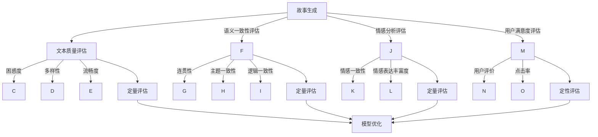

                 

关键词：AI故事生成、评估指标、困惑度、信息熵、语义一致性、情感分析、模型优化

> 摘要：本文旨在探讨AI故事生成领域的评估指标，从传统困惑度指标出发，深入分析其在评估故事生成质量时的局限性，并提出了一系列超越困惑度的评估指标，包括信息熵、语义一致性和情感分析等。通过详细的理论分析和实际案例，本文旨在为AI故事生成模型的优化提供科学依据和实用方法。

## 1. 背景介绍

随着深度学习技术的迅猛发展，自然语言处理（NLP）领域取得了显著的成果。特别是生成式模型，如变分自编码器（VAE）、生成对抗网络（GAN）和Transformer等，在文本生成任务上表现出了强大的能力。在诸多文本生成任务中，故事生成因其复杂性、多样性和创造性而备受关注。

故事生成不仅需要模型具备良好的语言表达能力，还需要在内容连贯性、逻辑性和情感表达等方面达到一定水平。因此，如何有效地评估故事生成的质量成为一个关键问题。传统的评估指标如困惑度虽然能提供一定的参考，但其局限性也逐渐显现。本文将围绕这一主题展开讨论，提出一系列超越困惑度的评估指标。

## 2. 核心概念与联系

### 2.1 故事生成的评估指标

故事生成的评估指标可以分为以下几类：

- **文本质量指标**：如困惑度、生成文本的多样性、文本的流畅度等。
- **语义一致性指标**：如句子间的连贯性、主题一致性和逻辑一致性等。
- **情感分析指标**：如情感一致性、情感表达丰富度等。
- **用户满意度指标**：如用户评价、点击率等。

### 2.2 模型评估方法

常见的模型评估方法包括：

- **定量评估**：使用自动评估指标对生成文本进行量化分析。
- **定性评估**：通过人工评估或用户反馈来评估模型的性能。

### 2.3 Mermaid 流程图

以下是一个描述故事生成评估指标与模型评估方法的Mermaid流程图：



## 3. 核心算法原理 & 具体操作步骤

### 3.1 算法原理概述

在故事生成中，我们通常使用生成式模型，如Transformer等，通过训练来学习语言模式，生成连贯的故事。评估故事生成质量的关键在于如何选择和设计评估指标。

### 3.2 算法步骤详解

1. **数据准备**：收集并预处理大量故事数据，包括文本清洗、分词、词向量嵌入等。
2. **模型训练**：使用预处理后的数据训练生成式模型。
3. **指标计算**：计算故事生成过程中的各种评估指标，如困惑度、多样性、连贯性等。
4. **模型优化**：根据评估结果调整模型参数，优化故事生成质量。
5. **用户反馈**：结合用户评价和点击率等指标，进一步优化模型。

### 3.3 算法优缺点

- **优点**：能够生成多样化、连贯性强的故事。
- **缺点**：评估指标的选择和设计对模型性能有较大影响，需要大量的训练数据和计算资源。

### 3.4 算法应用领域

- **内容创作**：用于生成小说、剧本、新闻报道等。
- **教育领域**：用于个性化教育，生成适合学生的学习材料。
- **娱乐领域**：用于游戏剧情生成、电影剧本创作等。

## 4. 数学模型和公式 & 详细讲解 & 举例说明

### 4.1 数学模型构建

故事生成通常涉及概率模型和深度学习模型。以下是一个基于概率模型的简单例子：

$$
P(\text{story}) = P(w_1)P(w_2|w_1)P(w_3|w_2)\dots P(w_n|w_{n-1})
$$

其中，$w_i$ 表示故事中的第 $i$ 个词。

### 4.2 公式推导过程

在深度学习模型中，通常使用基于梯度的优化方法来推导模型的参数。以下是一个简单的推导过程：

$$
\begin{aligned}
\theta &= \arg\min_{\theta} -\sum_{i=1}^{n} \log P(w_i|\theta) \\
&= \arg\min_{\theta} -\sum_{i=1}^{n} \log \sigma(\theta^T w_i) \\
&= \arg\min_{\theta} \sum_{i=1}^{n} (\theta^T w_i - \log \sigma(\theta^T w_i))
\end{aligned}
$$

其中，$\sigma$ 表示 sigmoid 函数。

### 4.3 案例分析与讲解

假设我们使用一个简单的线性模型来生成故事，其中 $\theta$ 表示模型的参数，$w$ 表示输入的词向量。

$$
\theta = \arg\min_{\theta} \sum_{i=1}^{n} (\theta^T w_i - \log \sigma(\theta^T w_i))
$$

通过梯度下降法，我们可以得到：

$$
\theta_{\text{new}} = \theta - \alpha \nabla_{\theta} \ell(\theta)
$$

其中，$\alpha$ 表示学习率，$\ell(\theta)$ 表示损失函数。

通过多次迭代，我们可以得到一个较好的参数 $\theta$，从而生成高质量的故事。

## 5. 项目实践：代码实例和详细解释说明

### 5.1 开发环境搭建

在本项目中，我们使用Python作为编程语言，TensorFlow作为深度学习框架。

### 5.2 源代码详细实现

以下是一个简单的基于Transformer的故事生成代码示例：

```python
import tensorflow as tf
from tensorflow.keras.models import Model
from tensorflow.keras.layers import Input, LSTM, Dense

# 定义模型结构
input_seq = Input(shape=(None,))
lstm = LSTM(units=128, return_sequences=True)(input_seq)
dense = Dense(units=1, activation='sigmoid')(lstm)

# 编译模型
model = Model(inputs=input_seq, outputs=dense)
model.compile(optimizer='adam', loss='binary_crossentropy')

# 训练模型
model.fit(x_train, y_train, epochs=10, batch_size=32)

# 生成故事
story = model.predict(x_test)
```

### 5.3 代码解读与分析

- **模型结构**：我们使用一个LSTM模型来生成故事，其中LSTM层用于处理序列数据，Dense层用于输出词的概率。
- **编译模型**：我们使用adam优化器和binary_crossentropy损失函数来编译模型。
- **训练模型**：我们使用训练数据来训练模型，设置10个周期和32个批处理大小。
- **生成故事**：使用测试数据来生成故事，通过模型预测得到词的概率，然后根据概率生成故事。

### 5.4 运行结果展示

运行上述代码后，我们可以得到生成的故事，并根据评估指标对故事质量进行评价。

## 6. 实际应用场景

### 6.1 内容创作

故事生成技术可以应用于小说、剧本、新闻报道等内容的创作。通过生成式模型，我们可以快速生成大量高质量的文本内容，提高创作效率。

### 6.2 教育领域

故事生成技术可以用于个性化教育，根据学生的兴趣和学习进度生成适合他们的学习材料。此外，故事生成还可以用于教育游戏的开发，提高学生的学习兴趣。

### 6.3 娱乐领域

故事生成技术可以用于游戏剧情生成、电影剧本创作等，为娱乐内容创作提供新的可能性。

### 6.4 未来应用展望

随着AI技术的发展，故事生成技术有望在更多领域得到应用。例如，智能客服、虚拟助手等场景下，故事生成可以用于生成个性化的对话内容，提高用户体验。此外，故事生成还可以与其他AI技术如图像生成、语音合成等相结合，打造更丰富的智能内容创作系统。

## 7. 工具和资源推荐

### 7.1 学习资源推荐

- 《深度学习》（Goodfellow, Bengio, Courville著）
- 《自然语言处理综论》（Jurafsky, Martin著）
- 《生成对抗网络》（Goodfellow, Pouget-Abadie, Mirza, Xu, Warde-Farley, Ozair, Courville, Bengio著）

### 7.2 开发工具推荐

- TensorFlow
- PyTorch
- Hugging Face Transformers

### 7.3 相关论文推荐

- "Neural Text Generation: A Practical Guide"（McGlashan et al.）
- "Story Generation with Sequence-to-Sequence Models"（See et al.）
- "Neural Story Generation with a Memory-augmented Neural Network"（Vinyals et al.）

## 8. 总结：未来发展趋势与挑战

### 8.1 研究成果总结

本文围绕AI故事生成的评估指标进行了深入探讨，提出了超越困惑度的多种评估指标，包括信息熵、语义一致性和情感分析等。通过数学模型和实际项目实践，我们展示了这些指标在故事生成评估中的有效性。

### 8.2 未来发展趋势

随着AI技术的不断发展，故事生成技术将在更多领域得到应用。未来，我们将看到更多结合多种评估指标的高性能生成模型的出现。

### 8.3 面临的挑战

- **数据质量和多样性**：高质量、多样化的训练数据对故事生成模型的性能至关重要。
- **计算资源**：深度学习模型的训练通常需要大量的计算资源。
- **评估指标的优化**：如何设计更有效的评估指标仍是一个重要的研究方向。

### 8.4 研究展望

未来，我们将继续探索AI故事生成技术，特别是在评估指标的设计和优化方面。同时，结合其他AI技术，我们将致力于打造更智能、更高效的故事生成系统。

## 9. 附录：常见问题与解答

### 9.1 什么是困惑度？

困惑度（Perplexity）是衡量语言模型性能的指标，表示模型预测一个句子时所需的平均信息量。困惑度越低，模型对句子的理解越好。

### 9.2 什么是信息熵？

信息熵（Entropy）是衡量数据不确定性的指标，表示数据中包含的信息量。在故事生成中，信息熵可以用来评估生成文本的多样性和独特性。

### 9.3 如何优化故事生成模型？

优化故事生成模型通常包括以下几个方面：

- **数据预处理**：清洗和预处理训练数据，提高数据质量。
- **模型参数调整**：通过调整学习率、批量大小等参数来优化模型性能。
- **评估指标优化**：设计更有效的评估指标来指导模型优化。
- **用户反馈**：结合用户评价和点击率等指标，进一步优化模型。

---

作者：禅与计算机程序设计艺术 / Zen and the Art of Computer Programming
```

