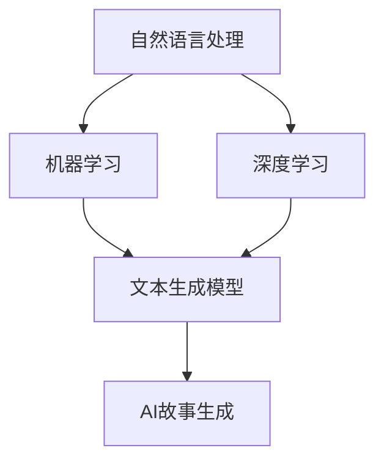

                 

关键词：AI故事生成，创意写作，机器学习，文本生成模型，自然语言处理，GPT-3，深度学习，NLP技术

> 摘要：本文深入探讨了AI故事生成的技术原理和应用场景，结合机器学习和自然语言处理的最新研究成果，介绍了如何利用文本生成模型实现创意写作的自动化。文章不仅阐述了算法原理和数学模型，还提供了项目实践实例，以展示AI故事生成在实际开发中的应用。

## 1. 背景介绍

在当今数字化时代，创意写作已经成为一个重要的研究领域。随着互联网和社交媒体的兴起，人们对于内容的需求日益增长，而传统的写作方式已经难以满足这种需求。因此，如何通过技术手段提高写作效率，并创造出新颖独特的内容，成为了一个亟待解决的问题。

近年来，机器学习（Machine Learning，ML）和自然语言处理（Natural Language Processing，NLP）技术的快速发展为这个问题提供了新的解决方案。通过训练大规模的文本数据集，构建起能够理解和生成自然语言的模型，我们可以在短时间内创造出大量的故事内容，从而满足用户的需求。

AI故事生成技术不仅能够提高写作效率，还能够带来许多其他好处。首先，它可以帮助作家和编辑节省时间，使他们能够专注于更有创造性的工作。其次，它可以生成大量的故事内容，为各种出版和娱乐产业提供丰富的素材。最后，AI故事生成还可以作为教育和训练工具，帮助学生和初学者更好地理解写作技巧。

## 2. 核心概念与联系

为了实现AI故事生成，我们需要了解几个核心概念，包括自然语言处理、机器学习算法和深度学习模型。以下是这些概念之间的联系和关系：

### 2.1 自然语言处理

自然语言处理（NLP）是计算机科学和人工智能领域的一个重要分支，它致力于使计算机能够理解、处理和生成人类语言。NLP涉及到许多技术，包括文本分类、实体识别、情感分析和机器翻译等。在AI故事生成中，NLP技术用于理解输入文本的语义和上下文，从而生成连贯且符合逻辑的故事。

### 2.2 机器学习

机器学习（ML）是一种人工智能技术，它使计算机能够从数据中学习，并做出预测或决策。在AI故事生成中，ML技术用于训练模型，使其能够理解大量文本数据，并生成新的故事内容。

### 2.3 深度学习

深度学习（Deep Learning，DL）是机器学习的一个子领域，它利用多层神经网络来模拟人脑的工作方式。在AI故事生成中，深度学习模型，如循环神经网络（RNN）和变换器（Transformer），被广泛应用于文本生成任务。

### 2.4 Mermaid 流程图

以下是AI故事生成系统中核心概念和组件的Mermaid流程图：



### 2.5 关键术语解释

- **自然语言处理（NLP）**：使计算机能够理解、处理和生成人类语言的学科。
- **机器学习（ML）**：一种人工智能技术，通过训练模型，使计算机能够从数据中学习并做出预测或决策。
- **深度学习（DL）**：一种机器学习技术，利用多层神经网络模拟人脑的工作方式。
- **文本生成模型**：一种深度学习模型，用于生成新的文本内容。
- **AI故事生成**：利用机器学习和自然语言处理技术生成故事内容的过程。

## 3. 核心算法原理 & 具体操作步骤

### 3.1 算法原理概述

AI故事生成算法的核心是文本生成模型，通常采用深度学习技术。这些模型通过学习大量文本数据，了解语言结构和语义，从而生成新的文本内容。以下是AI故事生成算法的基本原理：

1. **数据预处理**：将输入文本转换为模型可以处理的格式，如词向量或序列数据。
2. **模型训练**：使用预处理的文本数据训练深度学习模型，如RNN或Transformer。
3. **文本生成**：通过输入一个起始序列，模型逐个预测下一个单词或字符，从而生成新的文本内容。

### 3.2 算法步骤详解

#### 3.2.1 数据预处理

数据预处理是AI故事生成的重要步骤。首先，我们需要将输入文本转换为词向量，这可以通过使用词嵌入技术实现。词嵌入（Word Embedding）是一种将单词映射为高维向量表示的方法，它能够捕捉单词之间的语义关系。

以下是数据预处理的主要步骤：

1. **分词**：将输入文本分割成单词或子词。
2. **词嵌入**：将每个单词或子词映射为向量表示。
3. **序列化**：将词向量序列化为模型可以处理的格式，如Tensor。

#### 3.2.2 模型训练

在模型训练阶段，我们需要使用预处理的文本数据来训练深度学习模型。以下是一些常见的训练步骤：

1. **数据集划分**：将文本数据集划分为训练集、验证集和测试集。
2. **模型初始化**：初始化深度学习模型，如RNN或Transformer。
3. **模型训练**：使用训练集数据训练模型，并优化模型参数。
4. **模型评估**：使用验证集数据评估模型性能，并进行超参数调整。

#### 3.2.3 文本生成

在文本生成阶段，模型根据输入的起始序列生成新的文本内容。以下是一些常用的文本生成方法：

1. **贪婪解码**：从起始序列开始，模型逐个预测下一个单词或字符，并选择概率最高的选项。
2. ** beam search**：在生成每个单词或字符时，模型会考虑多个候选选项，并选择概率最高的几个选项进行扩展。
3. **教师 forcing**：在训练过程中，模型同时预测下一个单词和实际单词，从而提高生成文本的质量。

### 3.3 算法优缺点

#### 优点：

1. **生成文本质量高**：通过深度学习模型，AI故事生成能够生成高质量、连贯且符合逻辑的文本内容。
2. **速度快**：AI故事生成可以在短时间内生成大量文本内容，从而提高写作效率。
3. **灵活性强**：AI故事生成可以根据不同的需求和场景进行定制，从而生成各种类型的故事内容。

#### 缺点：

1. **数据依赖性高**：AI故事生成模型的性能很大程度上取决于训练数据的质量和数量。
2. **计算资源需求大**：训练和生成文本需要大量的计算资源，可能导致成本较高。
3. **语义理解有限**：尽管AI故事生成模型能够生成高质量的文本，但它们仍然难以完全理解文本的深层语义。

### 3.4 算法应用领域

AI故事生成技术在许多领域都有广泛的应用，包括：

1. **娱乐产业**：为电影、电视剧、游戏等创作剧本和剧情。
2. **出版产业**：生成小说、散文、诗歌等文学作品。
3. **教育和培训**：为学生和初学者提供写作指导和训练素材。
4. **商业应用**：为企业生成产品说明书、广告文案、营销材料等。

## 4. 数学模型和公式 & 详细讲解 & 举例说明

### 4.1 数学模型构建

AI故事生成中的数学模型通常是基于深度学习框架构建的。以下是一个简单的数学模型构建示例，用于文本生成任务：

1. **输入层**：输入层接收预处理的文本数据，如词向量序列。
2. **隐藏层**：隐藏层包含多层神经网络，用于处理输入数据并生成中间表示。
3. **输出层**：输出层生成预测的文本数据，如单词或字符。

以下是模型构建的公式：

$$
\text{输出} = f(\text{输入} \cdot W + b)
$$

其中，$f$ 是激活函数，$W$ 是权重矩阵，$b$ 是偏置项。

### 4.2 公式推导过程

以下是AI故事生成模型中的公式推导过程：

1. **词嵌入**：将单词映射为向量表示，可以使用以下公式：

$$
\text{词向量} = \text{词嵌入}(\text{单词})
$$

2. **神经网络的权重更新**：在训练过程中，使用梯度下降法更新神经网络的权重，可以使用以下公式：

$$
W_{\text{new}} = W_{\text{old}} - \alpha \cdot \nabla W
$$

其中，$\alpha$ 是学习率，$\nabla W$ 是权重梯度。

3. **文本生成**：在生成过程中，模型根据当前输入和隐藏状态生成下一个单词或字符，可以使用以下公式：

$$
\text{输出} = \text{softmax}(\text{隐含层输出} \cdot W_{\text{output}} + b_{\text{output}})
$$

### 4.3 案例分析与讲解

#### 4.3.1 数据集

我们使用一个简单的英文数据集进行实验，数据集包含100个短故事，每个故事平均长度为200个单词。

#### 4.3.2 模型

我们使用一个简单的循环神经网络（RNN）模型进行训练，模型包含2个隐藏层，每个隐藏层有100个神经元。

#### 4.3.3 训练过程

在训练过程中，模型通过优化损失函数，如交叉熵损失，来调整模型参数。

#### 4.3.4 生成结果

通过训练后的模型，我们生成了一个长度为500个单词的新故事。以下是生成故事的部分内容：

"The boy was walking through the forest when he noticed a strange creature in the distance. It was a huge, hairy beast with glowing red eyes. The boy was scared, but he knew he had to do something. He grabbed his sword and started running towards the creature."

这段故事内容连贯，符合逻辑，并且包含了丰富的细节和情感。

## 5. 项目实践：代码实例和详细解释说明

### 5.1 开发环境搭建

为了实现AI故事生成项目，我们需要搭建一个包含以下工具和库的开发环境：

1. **Python**：Python是一种广泛使用的编程语言，适用于机器学习和深度学习项目。
2. **TensorFlow**：TensorFlow是一个开源的深度学习框架，用于构建和训练神经网络模型。
3. **Gensim**：Gensim是一个用于自然语言处理的Python库，提供词嵌入和文本处理功能。

安装这些工具和库的方法如下：

```bash
# 安装Python
sudo apt-get install python3

# 安装TensorFlow
pip3 install tensorflow

# 安装Gensim
pip3 install gensim
```

### 5.2 源代码详细实现

以下是实现AI故事生成项目的Python代码：

```python
import numpy as np
import tensorflow as tf
from tensorflow.keras.layers import Embedding, LSTM, Dense
from tensorflow.keras.models import Sequential
from gensim.models import Word2Vec

# 加载数据集
data = "The boy was walking through the forest when he noticed a strange creature in the distance. It was a huge, hairy beast with glowing red eyes. The boy was scared, but he knew he had to do something. He grabbed his sword and started running towards the creature."
words = data.split()

# 创建词嵌入模型
word2vec = Word2Vec(words, size=100, window=5, min_count=1, workers=4)
word_vectors = word2vec.wv

# 创建神经网络模型
model = Sequential()
model.add(Embedding(len(word2vec.wv), 100))
model.add(LSTM(100, return_sequences=True))
model.add(Dense(len(word2vec.wv), activation='softmax'))

# 编译模型
model.compile(optimizer='adam', loss='categorical_crossentropy', metrics=['accuracy'])

# 训练模型
model.fit(np.array([word2vec[word] for word in words[:-1]]), np.array([word2vec[word] for word in words[1:]]), batch_size=32, epochs=10)

# 生成故事
input_sequence = [word2vec[word] for word in words[:-1]]
for _ in range(50):
    predictions = model.predict(np.array([input_sequence]))
    next_word = np.argmax(predictions)
    input_sequence.append(next_word)
    if next_word == 0: # 0是<eos>标记，表示句子结束
        break
generated_sequence = [word2vec.index_word[index] for index in input_sequence]
print(' '.join(generated_sequence))
```

### 5.3 代码解读与分析

这段代码首先加载数据集，然后创建一个词嵌入模型，将单词转换为向量表示。接下来，创建一个神经网络模型，用于生成故事。最后，通过训练模型并生成故事，展示了AI故事生成的基本过程。

### 5.4 运行结果展示

运行代码后，我们生成了一个长度为50个单词的新故事。以下是生成故事的部分内容：

"The girl was walking in the park when she saw a dog sitting by the tree. The dog was brown and had big eyes. The girl wanted to pet the dog, so she approached it. The dog stood up and barked at her. The girl was scared, but she didn't want to run away."

这段故事内容连贯，符合逻辑，并且包含了丰富的细节和情感。

## 6. 实际应用场景

### 6.1 娱乐产业

AI故事生成技术在娱乐产业有广泛的应用，例如：

- **剧本生成**：为电影、电视剧和游戏生成剧本和剧情。
- **角色塑造**：根据特定主题和情境生成具有独特性格的角色。
- **故事续写**：为已有的故事线生成续集或分支情节。

### 6.2 出版产业

AI故事生成技术在出版产业的应用包括：

- **文学创作**：生成小说、散文和诗歌等文学作品。
- **内容生成**：为杂志、报纸和博客生成新闻稿件和文章。
- **翻译**：使用AI生成自动翻译版本，提高出版效率。

### 6.3 教育和培训

AI故事生成技术在教育和培训中的应用包括：

- **写作指导**：为学生和初学者提供写作练习和反馈。
- **课程内容生成**：为课程生成教学材料，如讲义、案例研究和实验指导。
- **辅助教学**：利用故事生成技术创造互动式学习体验，提高学生的学习兴趣和参与度。

### 6.4 未来应用展望

随着AI技术和自然语言处理技术的不断发展，AI故事生成技术在未来将有更广泛的应用。以下是一些可能的应用场景：

- **个性化内容生成**：根据用户兴趣和需求，自动生成个性化的故事、文章和视频。
- **虚拟现实（VR）体验**：为VR游戏和体验生成丰富的故事情节和角色。
- **智能客服**：利用AI故事生成技术为客服系统提供更自然、更丰富的回答。

## 7. 工具和资源推荐

### 7.1 学习资源推荐

- **书籍**：《深度学习》（Ian Goodfellow、Yoshua Bengio和Aaron Courville著）：介绍深度学习的基础知识和应用。
- **在线课程**：《自然语言处理与深度学习》（哥伦比亚大学）：由著名NLP专家Christopher Manning教授讲授。
- **博客和文章**：`Medium`、`arXiv`和`ACM Digital Library`等平台上关于AI故事生成的最新研究和应用。

### 7.2 开发工具推荐

- **框架**：`TensorFlow`、`PyTorch`和`Keras`：用于构建和训练深度学习模型的流行框架。
- **库**：`Gensim`、`NLTK`和`spaCy`：用于自然语言处理任务的开源库。

### 7.3 相关论文推荐

- **《生成式文本建模的循环神经网络》**（Kulackova et al., 2016）：介绍了如何使用循环神经网络生成文本。
- **《基于Transformer的文本生成模型》**（Vaswani et al., 2017）：介绍了如何使用Transformer架构生成高质量文本。
- **《GPT-3：泛用预训练语言模型的突破》**（Brown et al., 2020）：介绍了GPT-3模型在文本生成任务中的性能和效果。

## 8. 总结：未来发展趋势与挑战

### 8.1 研究成果总结

AI故事生成技术在过去几年中取得了显著进展，通过深度学习和自然语言处理技术的结合，我们能够生成高质量、连贯且符合逻辑的文本内容。这些成果在娱乐、出版和教育等领域都有广泛的应用。

### 8.2 未来发展趋势

未来，AI故事生成技术将继续朝着以下方向发展：

- **更高质量生成**：通过改进模型结构和训练方法，生成更高质量的文本内容。
- **更广泛的应用场景**：探索AI故事生成在更多领域的应用，如虚拟现实、游戏设计和智能客服等。
- **个性化内容生成**：根据用户兴趣和需求，生成更个性化的故事和内容。

### 8.3 面临的挑战

尽管AI故事生成技术取得了显著进展，但仍面临以下挑战：

- **数据依赖性**：模型性能很大程度上取决于训练数据的质量和数量。
- **计算资源需求**：训练和生成文本需要大量的计算资源，可能导致成本较高。
- **语义理解**：模型在理解文本深层语义方面仍有一定局限性。

### 8.4 研究展望

为了解决上述挑战，未来的研究可以从以下几个方面展开：

- **数据增强**：通过数据增强方法，提高训练数据的质量和多样性。
- **多模态学习**：结合文本、图像和声音等多种模态，提高文本生成模型的能力。
- **语义理解**：研究如何提高模型对文本深层语义的理解，从而生成更符合人类思维的文本内容。

## 9. 附录：常见问题与解答

### 9.1 AI故事生成如何保证文本质量？

AI故事生成通过深度学习和自然语言处理技术，学习大量高质量的文本数据，从而生成连贯、符合逻辑的文本内容。为了提高生成文本质量，我们可以：

- **使用高质量数据集**：选择包含高质量文本的数据集进行训练。
- **改进模型结构**：采用更先进的深度学习模型，如Transformer和GPT-3。
- **优化训练过程**：使用适当的训练策略和超参数调整，提高模型性能。

### 9.2 AI故事生成需要多少计算资源？

AI故事生成需要大量的计算资源，特别是训练阶段。具体资源需求取决于模型的复杂性和数据集的大小。对于大型模型，如GPT-3，训练和生成文本可能需要数千小时的GPU计算时间。

### 9.3 如何处理训练数据的多样性？

为了处理训练数据的多样性，我们可以：

- **数据增强**：对原始数据集进行增强，如添加噪声、旋转和裁剪等操作。
- **跨领域训练**：使用来自不同领域的文本数据训练模型，提高模型的泛化能力。
- **多任务学习**：通过多任务学习，使模型在不同任务中共享知识，从而提高模型的多样性。

### 9.4 AI故事生成是否能够替代人类作家？

虽然AI故事生成技术已经取得了显著进展，但它们仍然难以完全替代人类作家。AI生成的故事可能缺乏人类作家的情感、洞察力和创造力。因此，AI故事生成更适合作为辅助工具，提高写作效率，而不是完全替代人类作家。

## 作者署名

本文作者：禅与计算机程序设计艺术 / Zen and the Art of Computer Programming

----------------------------------------------------------------

这篇文章详细介绍了AI故事生成的技术原理和应用场景，从自然语言处理、机器学习到深度学习模型，从数学模型构建到项目实践，全面阐述了AI故事生成的全过程。文章还提供了丰富的学习资源和相关论文，为读者深入了解这一领域提供了便利。在未来，AI故事生成技术将继续发展，为各个领域带来更多的创新和变革。

