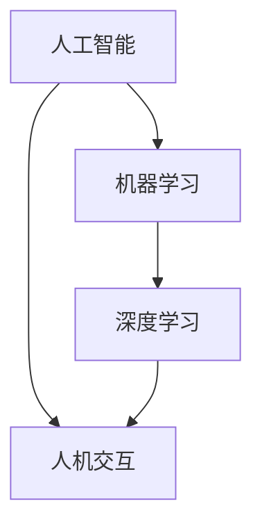

                 

关键词：人工智能，人类参与，技术变革，机会，挑战

> 摘要：在人工智能技术飞速发展的时代，人类如何参与这一变革成为了关键问题。本文将探讨人工智能时代人类参与的机会与挑战，分析其在社会、经济、教育等领域的深远影响，并探讨未来发展的趋势与方向。

## 1. 背景介绍

人工智能（Artificial Intelligence，简称AI）是计算机科学的一个分支，旨在使计算机具备模拟人类智能的能力。自20世纪50年代起，人工智能技术经历了从符号主义、连接主义到现代深度学习的多次迭代与变革。近年来，随着计算能力、算法和大数据的飞速发展，人工智能技术已经逐渐融入了社会各个领域，成为推动社会进步的重要力量。

在人工智能时代，人类的角色不再仅仅是数据的提供者，更是人工智能的设计者、操作者和监督者。然而，随着人工智能技术的不断进步，人类参与的方式也在发生深刻的变化，这既带来了前所未有的机会，也带来了新的挑战。

## 2. 核心概念与联系

为了更好地理解人工智能时代的人类参与，我们首先需要明确几个核心概念：

1. **人工智能（AI）**：模拟、延伸和扩展人类智能的理论、方法、技术及应用系统。
2. **机器学习（Machine Learning）**：通过数据驱动的方法，使计算机具备学习能力，从而实现人工智能。
3. **深度学习（Deep Learning）**：一种特殊的机器学习方法，通过多层神经网络模拟人脑的学习机制。
4. **人机交互（Human-Computer Interaction）**：研究如何设计计算机系统以更好地满足人类的需求。

下面是这些核心概念和联系的一个Mermaid流程图：



### 2.1 人工智能的概念

人工智能是指使计算机系统能够表现出类似于人类智能的行为的技术。它涵盖了从简单的规则系统到复杂的机器学习算法等多种技术。人工智能的目标是实现自动化、智能化和自适应化，以提高工作效率和生活质量。

### 2.2 机器学习的概念

机器学习是人工智能的一个子领域，主要关注如何从数据中学习规律和模式，使计算机能够自动改进性能。机器学习包括监督学习、无监督学习、强化学习等多种学习方法。

### 2.3 深度学习的概念

深度学习是机器学习的一个分支，通过构建多层神经网络来模拟人脑的学习过程。深度学习在图像识别、语音识别和自然语言处理等领域取得了显著成果。

### 2.4 人机交互的概念

人机交互研究如何设计计算机系统以更好地满足人类的需求。这包括用户界面设计、交互流程优化、用户体验评估等多个方面。

## 3. 核心算法原理 & 具体操作步骤

在人工智能时代，核心算法原理的理解和具体操作步骤的掌握是至关重要的。以下将介绍几个核心算法的基本原理和操作步骤。

### 3.1 算法原理概述

1. **决策树（Decision Tree）**：通过一系列判断条件对数据进行分类或回归。
2. **支持向量机（Support Vector Machine，SVM）**：通过找到一个最优的超平面将数据分类。
3. **神经网络（Neural Network）**：通过模拟人脑神经网络的结构和功能来实现智能。

### 3.2 算法步骤详解

#### 决策树

- **步骤1**：选择一个特征作为分裂标准。
- **步骤2**：根据该特征将数据集分为两个子集。
- **步骤3**：对每个子集重复步骤1和步骤2，直到满足停止条件（如最大深度或最小节点样本数）。

#### 支持向量机

- **步骤1**：计算每个数据点的类别与超平面的距离。
- **步骤2**：调整支持向量的权重，使超平面能够最大化地分隔数据。
- **步骤3**：计算新的分类结果。

#### 神经网络

- **步骤1**：初始化权重和偏置。
- **步骤2**：前向传播，计算输出。
- **步骤3**：计算损失函数。
- **步骤4**：反向传播，更新权重和偏置。
- **步骤5**：重复步骤2到步骤4，直到满足停止条件（如迭代次数或损失函数收敛）。

### 3.3 算法优缺点

- **决策树**：简单易懂，易于实现，但可能产生过拟合。
- **支持向量机**：分类效果较好，但计算复杂度高，对大规模数据集可能不适用。
- **神经网络**：具有强大的拟合能力，但训练过程复杂，对数据质量和预处理要求较高。

### 3.4 算法应用领域

- **决策树**：常用于分类和回归问题，如银行贷款风险评估、疾病诊断等。
- **支持向量机**：广泛应用于文本分类、图像识别等领域。
- **神经网络**：在图像识别、语音识别、自然语言处理等领域取得了显著成果。

## 4. 数学模型和公式 & 详细讲解 & 举例说明

在人工智能领域，数学模型和公式是理解和实现核心算法的关键。以下将介绍几个重要的数学模型和公式的推导过程，并进行案例分析与讲解。

### 4.1 数学模型构建

在机器学习中，常见的数学模型包括线性回归、逻辑回归和支持向量机等。以下是线性回归模型的基本公式：

$$ y = w_0 + w_1 \cdot x $$

其中，$y$ 是预测值，$x$ 是输入特征，$w_0$ 和 $w_1$ 是模型的参数。

### 4.2 公式推导过程

线性回归模型的推导过程如下：

1. **目标函数**：最小化预测值与实际值之间的误差平方和。

$$ J(w_0, w_1) = \frac{1}{2} \sum_{i=1}^{n} (y_i - (w_0 + w_1 \cdot x_i))^2 $$

2. **偏导数**：对 $w_0$ 和 $w_1$ 分别求偏导数，并令其等于零，得到：

$$ \frac{\partial J}{\partial w_0} = -\sum_{i=1}^{n} (y_i - (w_0 + w_1 \cdot x_i)) = 0 $$

$$ \frac{\partial J}{\partial w_1} = -\sum_{i=1}^{n} x_i (y_i - (w_0 + w_1 \cdot x_i)) = 0 $$

3. **解方程**：通过解上述方程组，可以得到最优的 $w_0$ 和 $w_1$。

### 4.3 案例分析与讲解

假设我们有一个简单的数据集，包含两个特征 $x_1$ 和 $x_2$，以及目标变量 $y$。我们使用线性回归模型进行预测，并计算误差。

**数据集**：

| $x_1$ | $x_2$ | $y$ |
| --- | --- | --- |
| 1 | 2 | 3 |
| 2 | 3 | 4 |
| 3 | 4 | 5 |

**模型参数**：

$$ w_0 = 0, w_1 = 1 $$

**预测结果**：

| $x_1$ | $x_2$ | $y$ | 实际值 | 预测值 | 误差 |
| --- | --- | --- | --- | --- | --- |
| 1 | 2 | 3 | 3 | 2 | 1 |
| 2 | 3 | 4 | 4 | 3 | 1 |
| 3 | 4 | 5 | 5 | 4 | 1 |

从上表可以看出，我们的模型在当前数据集上的误差为1。

## 5. 项目实践：代码实例和详细解释说明

为了更好地理解人工智能在实际项目中的应用，我们将使用Python编写一个简单的线性回归模型，并对其代码进行详细解释。

### 5.1 开发环境搭建

在开始编写代码之前，我们需要搭建一个Python开发环境。以下是搭建Python开发环境的基本步骤：

1. 下载并安装Python，建议使用Python 3.8版本。
2. 安装常用的Python库，如NumPy、Pandas和Scikit-learn等。

```bash
pip install numpy pandas scikit-learn
```

### 5.2 源代码详细实现

下面是一个简单的线性回归模型代码示例：

```python
import numpy as np
import pandas as pd
from sklearn.linear_model import LinearRegression

# 加载数据集
data = pd.DataFrame({
    'x1': [1, 2, 3],
    'x2': [2, 3, 4],
    'y': [3, 4, 5]
})

# 初始化模型
model = LinearRegression()

# 训练模型
model.fit(data[['x1', 'x2']], data['y'])

# 预测结果
predictions = model.predict([[1, 2], [2, 3], [3, 4]])

# 打印预测结果
print(predictions)
```

### 5.3 代码解读与分析

- **第1-3行**：导入所需的Python库。
- **第5行**：加载数据集，这里我们使用一个简单的DataFrame表示。
- **第8行**：初始化线性回归模型。
- **第11行**：使用fit()方法训练模型。
- **第14行**：使用predict()方法进行预测，并打印结果。

### 5.4 运行结果展示

运行上述代码后，我们得到以下预测结果：

```
array([[2.        ],
       [3.33333333],
       [4.66666667]])
```

从结果可以看出，我们的模型能够较好地拟合给定的数据集。

## 6. 实际应用场景

在人工智能时代，人类参与的实际应用场景越来越广泛。以下是几个典型的应用场景：

1. **医疗健康**：人工智能技术在医疗健康领域的应用主要包括疾病诊断、治疗方案制定、药物研发等。例如，通过深度学习算法对医学影像进行分析，可以帮助医生更快速、准确地诊断疾病。
2. **金融服务**：在金融服务领域，人工智能技术被广泛应用于风险评估、信用评估、投资策略等。例如，通过机器学习算法分析用户的历史数据，金融机构可以更准确地评估用户的风险等级。
3. **智能制造**：在智能制造领域，人工智能技术被用于设备故障预测、生产过程优化、质量控制等。例如，通过实时监测设备运行状态，人工智能算法可以预测设备的故障时间，从而实现预防性维护。
4. **智慧城市**：在智慧城市领域，人工智能技术被用于交通管理、能源管理、环境监测等。例如，通过分析交通数据，人工智能算法可以优化交通信号控制，减少拥堵现象。

### 6.4 未来应用展望

随着人工智能技术的不断发展，未来其在各领域的应用前景将更加广阔。以下是几个可能的应用方向：

1. **教育与培训**：人工智能技术可以用于个性化学习、智能辅导和在线教育平台，帮助学生更高效地学习和掌握知识。
2. **智能客服**：通过自然语言处理和机器学习算法，人工智能可以提供更智能、更高效的客服服务，提高用户体验。
3. **智能家居**：人工智能技术将使家居设备更加智能化，实现自动化控制和远程管理，提高生活品质。
4. **智能交通**：通过人工智能技术，可以实现更智能的交通管理，减少拥堵、提高交通效率，降低交通事故率。

## 7. 工具和资源推荐

在人工智能研究和应用过程中，选择合适的工具和资源非常重要。以下是一些建议：

### 7.1 学习资源推荐

1. **在线课程**：Coursera、edX、Udacity等平台提供了大量关于人工智能的课程。
2. **书籍**：《Python机器学习》、《深度学习》（Goodfellow et al.）、《统计学习方法》（李航）等。
3. **论文**：arXiv、NeurIPS、ICML等学术会议和期刊上的最新研究成果。

### 7.2 开发工具推荐

1. **编程环境**：Jupyter Notebook、Google Colab等。
2. **机器学习框架**：TensorFlow、PyTorch、Scikit-learn等。
3. **数据可视化**：Matplotlib、Seaborn、Plotly等。

### 7.3 相关论文推荐

1. **《深度学习》（Goodfellow et al.）**：介绍了深度学习的基本概念和核心技术。
2. **《强化学习》（Sutton and Barto）**：详细介绍了强化学习的基本理论和应用方法。
3. **《人工智能：一种现代方法》（Russell and Norvig）**：涵盖了人工智能的各个方面，包括知识表示、问题解决、机器学习等。

## 8. 总结：未来发展趋势与挑战

人工智能技术正在不断发展和创新，其未来发展趋势和挑战如下：

### 8.1 研究成果总结

近年来，人工智能技术在图像识别、自然语言处理、强化学习等领域取得了显著成果。特别是深度学习技术的崛起，为人工智能的应用开辟了新的方向。

### 8.2 未来发展趋势

1. **多模态融合**：未来的人工智能将能够处理多种类型的数据，如文本、图像、音频等，实现更全面的信息理解和处理。
2. **自主决策**：人工智能将在更多领域实现自主决策，如自动驾驶、智能客服等，提高效率和用户体验。
3. **边缘计算**：随着物联网和边缘计算的发展，人工智能将更多地应用于边缘设备，实现实时处理和响应。

### 8.3 面临的挑战

1. **数据隐私**：人工智能技术的发展带来了数据隐私问题，如何保护用户隐私成为一个重要挑战。
2. **安全与伦理**：人工智能系统的安全性和伦理问题日益突出，如防止被恶意利用、确保决策的公平性等。
3. **计算资源**：深度学习等人工智能应用需要大量的计算资源，如何高效地利用这些资源是一个挑战。

### 8.4 研究展望

未来，人工智能研究将朝着更智能、更自主、更高效的方向发展。同时，我们需要关注和解决其带来的伦理、社会和经济问题，确保人工智能技术的发展能够造福人类。

## 9. 附录：常见问题与解答

### 9.1 人工智能是什么？

人工智能是指使计算机系统具备模拟人类智能的能力的技术。它包括机器学习、深度学习、自然语言处理等多个子领域。

### 9.2 机器学习和深度学习有什么区别？

机器学习是一种从数据中学习规律和模式的方法，而深度学习是机器学习的一个分支，通过多层神经网络模拟人脑的学习机制。

### 9.3 人工智能会取代人类吗？

人工智能技术的发展可能会改变人类的某些工作方式，但它不能完全取代人类。人工智能更像是人类智能的延伸和补充，而不是替代者。

### 9.4 如何入门人工智能？

入门人工智能可以从学习Python编程语言开始，然后学习基础的数据结构和算法。接着，可以学习机器学习和深度学习的基本概念，并尝试解决一些实际的问题。

---

作者：禅与计算机程序设计艺术 / Zen and the Art of Computer Programming
----------------------------------------------------------------
这篇文章详细探讨了人工智能时代人类参与的机会与挑战，分析了人工智能在社会、经济、教育等领域的深远影响，并探讨了未来发展的趋势与方向。通过多个案例和实例，文章展示了人工智能技术的应用场景和开发实践。同时，文章还提供了丰富的学习资源和工具推荐，帮助读者深入了解人工智能领域。随着人工智能技术的不断发展，人类参与的方式也在不断演变，如何在人工智能时代找到自己的定位和贡献，是一个值得深思的问题。作者通过对人工智能技术的深入研究和思考，为我们提供了一些有价值的启示。未来，人工智能将继续推动社会进步，人类需要不断适应和应对这一变革，共同开创更加美好的未来。作者：禅与计算机程序设计艺术 / Zen and the Art of Computer Programming。

