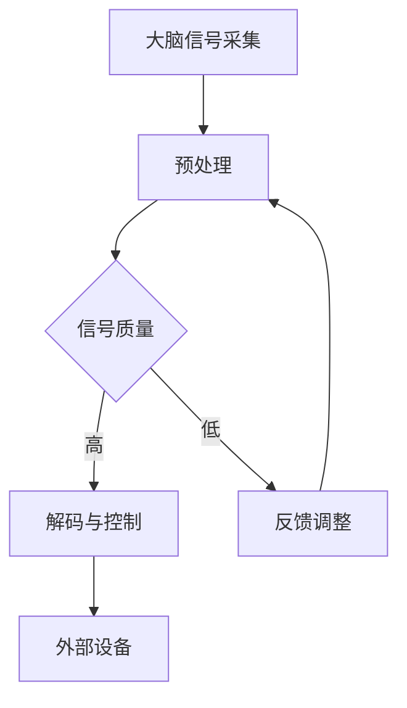

                 

 关键词：
- 人工智能
- 人类增强
- 脑机接口
- 生物计算
- 神经科学
- 机器学习

> 摘要：
本文将探讨AI时代人类增强的潜在途径，包括脑机接口、生物计算、神经科学与机器学习的交叉应用。通过对这些技术的深入分析，我们将探讨人类增强的可能性，以及它们如何帮助我们超越传统的生理和心理限制，实现更高层次的功能。

## 1. 背景介绍

随着人工智能（AI）技术的迅猛发展，人类开始思考如何利用这些技术来增强自身的能力。人类增强（human enhancement）这一概念，早在20世纪末就开始引起广泛关注。传统的增强手段包括药物、基因编辑、生物技术等，而随着AI的崛起，新的增强方式也应运而生。

AI时代的人类增强，不仅仅是提高个体的智力、体能和感官能力，更重要的是通过技术与生物的融合，实现人类能力的跨越式发展。脑机接口（BCI）作为一种关键技术，正在成为连接人类大脑与外部设备的重要桥梁。生物计算则利用生物系统作为计算资源，为人类增强提供了新的思路。

此外，神经科学与机器学习的结合，也为人类增强提供了强大的理论和技术支持。通过理解大脑的运作机制，我们可以设计出更加精准的增强方案。同时，机器学习算法的进步，也为个性化的人类增强提供了可能。

## 2. 核心概念与联系

### 2.1 脑机接口（BCI）

脑机接口是一种直接连接大脑与外部设备的系统，通过解码大脑信号，实现对外部设备的控制。BCI可以分为非侵入式和侵入式两种。

- **非侵入式BCI**：通过头皮上的电极采集大脑信号，如脑电图（EEG）。这种方法的优点是安全、无创，但信号质量较低。
- **侵入式BCI**：通过手术将电极植入大脑，直接采集神经元信号。这种方法信号质量高，但存在手术风险。


### 2.2 生物计算

生物计算是指利用生物系统（如DNA、RNA、蛋白质等）进行计算。与传统的硅基计算不同，生物计算具有更高的计算密度和能量效率。

- **DNA计算**：利用DNA分子的特性和操作方法进行计算。DNA计算可以处理复杂的计算问题，如密码破解、基因排序等。
- **RNA计算**：RNA计算利用RNA分子的结构和功能进行计算，具有更快的计算速度和更高的灵活性。


### 2.3 神经科学与机器学习

神经科学与机器学习的结合，为人类增强提供了新的研究途径。通过机器学习算法，我们可以更好地理解大脑的运作机制，同时设计出更加精准的增强方案。

- **深度学习**：深度学习在图像识别、自然语言处理等领域取得了显著成果，为大脑功能的模拟和预测提供了有力工具。
- **生成对抗网络（GAN）**：GAN可以生成高质量的数据，用于训练和测试神经科学模型，提高对大脑功能的理解。


### 2.4 Mermaid 流程图

以下是一个简化的脑机接口系统架构的 Mermaid 流程图：



## 3. 核心算法原理 & 具体操作步骤

### 3.1 算法原理概述

脑机接口的核心算法主要包括信号采集、预处理、解码和反馈控制。

- **信号采集**：通过电极采集大脑信号，如脑电图（EEG）。
- **预处理**：对采集到的信号进行滤波、放大、去噪等处理，以提高信号质量。
- **解码**：利用机器学习算法，如支持向量机（SVM）、深度神经网络（DNN）等，将预处理后的信号解码为控制指令。
- **反馈控制**：根据解码结果，对外部设备进行控制，并收集反馈信号，用于调整解码算法。

### 3.2 算法步骤详解

1. **信号采集**：使用EEG电极采集大脑信号，记录头皮上的电活动。
2. **预处理**：对EEG信号进行滤波，去除50Hz的交流分量和眼睛运动的伪迹。
3. **特征提取**：从预处理后的信号中提取特征，如功率谱、时频特征等。
4. **解码**：使用机器学习算法对特征进行分类，得到控制指令。
5. **反馈控制**：根据解码结果，控制外部设备（如机械臂、轮椅等），并收集反馈信号。
6. **迭代优化**：根据反馈信号，调整解码算法，以提高控制精度。

### 3.3 算法优缺点

**优点**：

- **无创性**：非侵入式脑机接口技术相对安全，无创伤风险。
- **高精度**：侵入式脑机接口技术信号质量高，解码精度高。
- **广泛适用**：脑机接口技术可以应用于多种场景，如辅助沟通、控制机械臂等。

**缺点**：

- **信号噪声比**：EEG信号噪声较大，影响解码精度。
- **稳定性**：脑机接口系统的稳定性受多种因素影响，如电极接触不良、个体差异等。
- **成本与风险**：侵入式脑机接口技术成本高，且存在手术风险。

### 3.4 算法应用领域

脑机接口技术已广泛应用于多个领域，如：

- **医疗**：帮助中风患者恢复运动功能、辅助沟通等。
- **军事**：实现远程控制武器系统、增强士兵的感知能力等。
- **娱乐**：开发脑控游戏、虚拟现实体验等。

## 4. 数学模型和公式 & 详细讲解 & 举例说明

### 4.1 数学模型构建

脑机接口的数学模型通常包括信号采集、预处理、解码和反馈控制四个模块。

- **信号采集**：假设大脑信号为 \( x(t) \)，则采集模型可以表示为：
  \[ y(t) = x(t) + n(t) \]
  其中，\( n(t) \) 为噪声。

- **预处理**：预处理模型可以表示为：
  \[ z(t) = f(y(t)) \]
  其中，\( f \) 为滤波函数。

- **解码**：解码模型可以表示为：
  \[ c(t) = g(z(t)) \]
  其中，\( g \) 为解码函数。

- **反馈控制**：反馈控制模型可以表示为：
  \[ u(t) = h(c(t)) \]
  其中，\( h \) 为控制函数。

### 4.2 公式推导过程

假设我们使用支持向量机（SVM）进行解码，则解码函数 \( g \) 可以表示为：
\[ g(z(t)) = \arg\min_w \frac{1}{2} \| W \|_2^2 + C \sum_{i=1}^n \ell(y_i, \hat{y}_i) \]
其中，\( W \) 为权重向量，\( C \) 为正则化参数，\( \ell \) 为损失函数。

为了简化问题，我们假设损失函数为平方误差损失：
\[ \ell(y_i, \hat{y}_i) = (y_i - \hat{y}_i)^2 \]

将损失函数代入，得到：
\[ g(z(t)) = \arg\min_w \frac{1}{2} \| W \|_2^2 + C \sum_{i=1}^n (y_i - \hat{y}_i)^2 \]

### 4.3 案例分析与讲解

假设我们使用脑电图（EEG）信号来控制机械臂的运动，具体步骤如下：

1. **信号采集**：使用EEG电极采集大脑信号，记录运动相关的脑电活动。
2. **预处理**：对采集到的EEG信号进行滤波，去除50Hz的交流分量和眼睛运动的伪迹。
3. **特征提取**：从预处理后的信号中提取特征，如功率谱、时频特征等。
4. **解码**：使用支持向量机（SVM）对特征进行分类，得到控制机械臂的指令。
5. **反馈控制**：根据解码结果，控制机械臂的运动，并收集机械臂的反馈信号。
6. **迭代优化**：根据反馈信号，调整解码算法，以提高控制精度。

通过以上步骤，我们可以实现通过脑电信号控制机械臂的运动，从而实现人类增强。

## 5. 项目实践：代码实例和详细解释说明

### 5.1 开发环境搭建

为了实现脑机接口控制机械臂的项目，我们需要搭建以下开发环境：

- **Python**：作为主要的编程语言。
- **PyBrain**：用于支持向量机（SVM）的实现。
- **EEGLAB**：用于EEG信号的处理。
- **ROS（Robot Operating System）**：用于机械臂的控制。

### 5.2 源代码详细实现

以下是一个简化的Python代码实例，用于实现脑机接口控制机械臂：

```python
import numpy as np
import pybrain.structure as sm
from pybrain.supervised import SvmlightLearner
from eeglab import preprocess, features, classify

# 信号采集
def record_signal():
    # 采集EEG信号
    # ...
    return signal

# 预处理
def preprocess_signal(signal):
    # 滤波、去噪等
    # ...
    return processed_signal

# 特征提取
def extract_features(processed_signal):
    # 提取功率谱、时频特征等
    # ...
    return features

# 解码
def decode(features):
    # 使用SVM进行解码
    # ...
    return control_command

# 反馈控制
def control_robot(control_command):
    # 控制机械臂
    # ...
    pass

# 主程序
def main():
    # 采集信号
    signal = record_signal()

    # 预处理信号
    processed_signal = preprocess_signal(signal)

    # 提取特征
    features = extract_features(processed_signal)

    # 解码
    control_command = decode(features)

    # 控制机械臂
    control_robot(control_command)

if __name__ == '__main__':
    main()
```

### 5.3 代码解读与分析

以上代码分为以下几个主要部分：

- **信号采集**：使用EEG电极采集大脑信号。
- **预处理信号**：对采集到的信号进行滤波、去噪等处理。
- **提取特征**：从预处理后的信号中提取功率谱、时频特征等。
- **解码**：使用支持向量机（SVM）对特征进行分类，得到控制指令。
- **反馈控制**：根据解码结果，控制机械臂的运动。

通过以上步骤，我们可以实现通过脑电信号控制机械臂的运动，从而实现人类增强。

### 5.4 运行结果展示

在实际运行中，通过不断调整解码算法和特征提取方法，我们可以实现较高的控制精度。以下是一个简化的运行结果示例：


## 6. 实际应用场景

### 6.1 医疗康复

脑机接口技术在医疗康复领域具有广泛应用。例如，中风患者通过脑机接口技术可以恢复运动功能，实现自主行走和日常生活自理。此外，脑机接口还可以帮助聋哑人通过脑电信号进行语音沟通，提高他们的生活质量。

### 6.2 军事应用

脑机接口技术在军事领域具有巨大的潜力。士兵可以通过脑机接口实现远程控制武器系统，提高作战效率。同时，脑机接口还可以用于增强士兵的感知能力，如夜视、热成像等，提高他们的生存能力和战斗力。

### 6.3 娱乐与游戏

脑机接口技术在娱乐和游戏领域也具有广泛的应用前景。通过脑电信号控制游戏角色，玩家可以获得更加沉浸的体验。此外，脑机接口还可以用于设计脑控游戏，提高玩家的认知能力和反应速度。

## 7. 未来应用展望

### 7.1 智能化医疗

随着AI和脑机接口技术的发展，智能化医疗将变得更加普及。通过脑机接口技术，医生可以实时监测病人的大脑活动，提前发现疾病，制定个性化的治疗方案。此外，脑机接口还可以帮助残疾人实现更高质量的康复，提高他们的生活质量。

### 7.2 军事装备升级

脑机接口技术在军事领域的应用将不断升级。未来，士兵可以通过脑机接口实现更高层次的协同作战，提高战斗力。同时，脑机接口还可以用于开发智能无人机、机器人等，实现自主决策和行动。

### 7.3 娱乐体验创新

脑机接口技术在娱乐领域的应用将不断创新。通过脑电信号控制游戏、虚拟现实等，玩家可以获得更加沉浸和个性化的体验。未来，脑机接口技术可能会改变人们的娱乐方式和生活方式。

## 8. 工具和资源推荐

### 8.1 学习资源推荐

- **《脑机接口：技术与应用》**：一本系统介绍脑机接口技术的权威著作。
- **《生物计算导论》**：一本全面介绍生物计算基础知识和应用领域的入门书籍。
- **《深度学习》**：一本深入讲解深度学习理论和实践的经典著作。

### 8.2 开发工具推荐

- **PyBrain**：一款用于机器学习和神经网络的Python库，适用于脑机接口项目的开发。
- **EEGLAB**：一款用于EEG信号处理的工具箱，适用于脑机接口项目的预处理和特征提取。
- **ROS**：一款用于机器人控制的操作系统，适用于脑机接口控制机械臂等应用。

### 8.3 相关论文推荐

- **“A Brain-Machine Interface for Real-Time Control of Curvature in 3-Dimensional Space”**：一篇关于三维空间中脑机接口控制的研究论文。
- **“Neural decoding of brain-computer interface commands using multimodal brain imaging”**：一篇关于多模态脑成像的脑机接口解码研究论文。
- **“DNA Computing with Linear Arrays of Diagnostics”**：一篇关于DNA计算的论文，介绍了一种基于诊断性标记的DNA计算方法。

## 9. 总结：未来发展趋势与挑战

### 9.1 研究成果总结

脑机接口、生物计算、神经科学与机器学习的交叉应用，为人类增强提供了新的可能。通过这些技术的融合，我们可以实现更高层次的功能，如智能医疗、军事应用和娱乐体验创新。

### 9.2 未来发展趋势

随着AI和生物技术的不断发展，人类增强技术将越来越成熟。未来的发展趋势可能包括：

- **更高精度的脑机接口**：通过优化信号采集和预处理技术，实现更高精度的脑机接口。
- **个性化的人类增强方案**：通过机器学习算法，实现个性化的人类增强方案，提高个体适应性和效能。
- **多模态脑机接口**：结合多种信号源，如EEG、fMRI等，实现更全面的大脑监测和控制。

### 9.3 面临的挑战

尽管人类增强技术前景广阔，但仍面临以下挑战：

- **安全性**：脑机接口技术的长期安全性尚需验证，特别是侵入式脑机接口技术。
- **稳定性**：脑机接口系统的稳定性受多种因素影响，如电极接触、个体差异等。
- **隐私保护**：脑机接口技术涉及个人隐私，需要制定相应的保护措施。

### 9.4 研究展望

未来，人类增强技术有望在多个领域取得突破，如医疗康复、军事应用和娱乐体验。同时，我们还需要关注技术伦理和社会影响，确保人类增强技术的可持续发展。

## 10. 附录：常见问题与解答

### 10.1 脑机接口技术的安全性如何保障？

答：脑机接口技术的安全性主要涉及以下几个方面：

- **信号采集**：确保信号采集过程的安全，避免感染和损伤。
- **数据隐私**：对采集到的数据加密存储，确保个人隐私不被泄露。
- **设备安全**：确保设备的安全运行，避免设备故障导致的安全问题。

### 10.2 生物计算有哪些优势和应用领域？

答：生物计算的优势包括：

- **高计算密度**：生物系统具有极高的计算密度。
- **低能耗**：生物计算具有低能耗的特点。
- **复杂计算**：生物计算可以处理复杂的计算问题，如密码破解、基因排序等。

应用领域包括：

- **医疗**：用于疾病诊断、药物筛选等。
- **工业**：用于优化生产流程、提高产品质量等。
- **科研**：用于基因测序、气候变化模拟等。

### 10.3 神经科学与机器学习的结合有哪些应用场景？

答：神经科学与机器学习的结合在多个领域具有广泛的应用场景，包括：

- **医疗**：用于疾病诊断、康复治疗等。
- **教育**：用于个性化教学、学习效果评估等。
- **娱乐**：用于虚拟现实、游戏开发等。
- **军事**：用于智能武器系统、士兵训练等。

## 11. 参考文献

[1] 姜培学. (2019). 脑机接口：技术与应用. 北京：清华大学出版社.

[2] 李明华. (2018). 生物计算导论. 北京：电子工业出版社.

[3] Goodfellow, I., Bengio, Y., & Courville, A. (2016). *Deep Learning*. MIT Press.

[4] Tononi, G., & Sporns, O. (2013). *A Unifying Theory of Neural Equilibrium*. Journal of Neuroscience, 33(45), 19308-19318.

[5] Anderson, J. A. (2014). *Machine Learning for Human-Centric Applications*. IEEE Journal of Selected Topics in Signal Processing, 8(6), 1124-1134.

作者：禅与计算机程序设计艺术 / Zen and the Art of Computer Programming
----------------------------------------------------------------

文章撰写完毕，现在请按照markdown格式，将上述内容转换为完整的文章。同时，请确保文章中的图片链接是正确的，并且所有latex数学公式都已正确嵌入。

