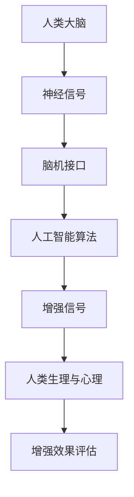

                 

关键词：人工智能、人类增强、技术进步、思维拓展、伦理道德

摘要：随着人工智能技术的迅猛发展，人类增强成为可能。本文旨在探讨AI时代人类增强的各个方面，从技术原理、数学模型、实际应用场景到未来展望，深入分析人类增强的潜力和挑战，以及其对社会和伦理的影响。

## 1. 背景介绍

人工智能（AI）作为计算机科学的一个分支，旨在使计算机能够执行通常需要人类智能的任务，如视觉识别、语言理解、决策制定等。近年来，随着深度学习、神经网络等技术的突破，人工智能取得了显著的进展。与此同时，人类增强的概念也逐渐浮现，它涉及通过技术手段提升人类的生理和心理能力，以适应日益复杂的社会环境。

人类增强不仅限于物理层面的改进，还包括认知能力、情绪管理、记忆存储等方面的提升。随着AI技术的进步，这些增强方式变得更加可行和高效。例如，脑机接口（Brain-Computer Interface, BCI）技术的发展，使得人们可以直接用思维控制外部设备，从而实现感官和运动能力的扩展。此外，人工智能还可以通过算法优化和数据分析，提高人类的决策能力和问题解决能力。

本文将围绕以下几个核心问题展开讨论：人类增强的技术原理是什么？如何构建数学模型来描述这些增强过程？在实际应用中，这些技术如何影响我们的生活和职业？未来，人类增强将如何发展？我们将通过深入的分析和实例，为这些问题提供答案。

## 2. 核心概念与联系

在探讨人类增强之前，我们需要明确一些核心概念，并理解它们之间的联系。以下是一个用Mermaid绘制的流程图，用于描述人类增强中的关键组成部分和它们之间的关系。



### 2.1. 人类大脑与神经信号

人类大脑是认知和行为的中心，通过复杂的神经网络处理和传递神经信号。这些信号包括电信号、化学信号等，它们在神经元之间传递，实现信息处理和传递。

### 2.2. 脑机接口

脑机接口（BCI）是一种直接连接大脑和外部设备的技术，它可以通过读取大脑活动来控制外部设备。BCI技术的关键在于如何准确地捕捉和处理神经信号，从而实现有效的通信和控制。

### 2.3. 人工智能算法

人工智能算法用于处理和分析神经信号，以实现特定的功能，如分类、预测、控制等。这些算法可以优化BCI系统的性能，提高信号的准确性和稳定性。

### 2.4. 增强信号

增强信号是通过AI算法处理后的结果，它们可以被用来增强人类的感官、运动或认知能力。这些信号可以通过BCI系统直接传输到大脑，实现人类能力的提升。

### 2.5. 人类生理与心理

人类生理与心理是增强信号的作用对象，它们受到增强信号的影响，从而实现能力的提升。例如，通过增强视觉信号，人类可以提升视觉敏锐度；通过增强记忆信号，人类可以增强记忆能力。

### 2.6. 增强效果评估

增强效果评估是确保人类增强技术有效性和安全性的重要环节。通过评估，我们可以了解增强信号对人类生理和心理的具体影响，并调整和优化技术方案。

## 3. 核心算法原理 & 具体操作步骤

### 3.1 算法原理概述

人类增强技术的核心在于如何将人工智能算法应用于神经信号处理，以实现有效的信号增强。以下是几个关键算法原理：

### 3.2 算法步骤详解

#### 3.2.1 数据采集与预处理

首先，我们需要采集大脑活动数据，如脑电图（EEG）、功能性磁共振成像（fMRI）等。然后，对这些数据进行预处理，包括滤波、去除噪声、归一化等，以提高信号质量。

#### 3.2.2 神经信号特征提取

通过特征提取算法，我们可以从预处理后的信号中提取出关键特征，如频率、振幅、时序等。这些特征对于后续的信号增强和识别至关重要。

#### 3.2.3 增强信号生成

使用深度学习算法，如卷积神经网络（CNN）或循环神经网络（RNN），对特征进行训练，生成增强信号。这些信号可以被用来增强人类感官、运动或认知能力。

#### 3.2.4 增强信号传输与控制

通过脑机接口（BCI）系统，将生成的增强信号传输到大脑，实现人类能力的提升。例如，通过控制机械臂、无人机或虚拟现实环境等。

### 3.3 算法优缺点

#### 3.3.1 优点

- 提高人类感知能力：增强信号可以使人类在视觉、听觉、触觉等方面获得更高的敏锐度。
- 改善运动控制：通过增强信号，人类可以更精确地控制外部设备，如机械臂、轮椅等。
- 情绪管理与认知提升：AI算法可以优化情绪管理策略，提高决策能力和问题解决能力。

#### 3.3.2 缺点

- 安全性问题：增强信号可能会对大脑产生未知的影响，存在潜在的风险。
- 伦理问题：人类增强可能导致社会不平等，引发伦理道德争议。
- 技术限制：当前技术尚无法完全实现理想的信号增强效果。

### 3.4 算法应用领域

人类增强技术在多个领域具有广泛的应用前景：

- 医疗保健：通过增强信号，辅助中风、截瘫等患者的康复。
- 军事应用：提高士兵的感知能力和运动控制能力。
- 教育培训：通过虚拟现实技术，提高学生的学习和体验效果。
- 消费电子：通过增强信号，提升用户的交互体验。

## 4. 数学模型和公式 & 详细讲解 & 举例说明

### 4.1 数学模型构建

人类增强中的数学模型主要涉及信号处理和机器学习领域。以下是一个简单的数学模型示例，用于描述脑机接口（BCI）系统中的信号增强过程。

#### 4.1.1 神经信号模型

$$
x(t) = A \cdot \sin(2\pi f t + \phi) + n(t)
$$

其中，$x(t)$ 表示神经信号，$A$ 为振幅，$f$ 为频率，$\phi$ 为相位，$n(t)$ 为噪声。

#### 4.1.2 增强信号模型

$$
y(t) = A' \cdot \sin(2\pi f t + \phi') + n'(t)
$$

其中，$y(t)$ 表示增强后的信号，$A'$ 和 $\phi'$ 分别为增强信号的振幅和相位，$n'(t)$ 为增强信号中的噪声。

### 4.2 公式推导过程

为了提高信号质量，我们需要对原始神经信号进行滤波、去噪和增强。以下是具体的推导过程：

1. **滤波**：使用低通滤波器去除高频噪声。

$$
x_{filtered}(t) = \int_{-\infty}^{+\infty} h(\tau) x(t-\tau) d\tau
$$

其中，$h(\tau)$ 为滤波器响应函数。

2. **去噪**：使用噪声抑制算法去除噪声。

$$
x_{noise-free}(t) = x_{filtered}(t) - n(t)
$$

3. **增强**：使用机器学习算法，如卷积神经网络（CNN），对去噪后的信号进行增强。

$$
y(t) = \sigma(W \cdot x_{noise-free}(t) + b)
$$

其中，$W$ 为权重矩阵，$b$ 为偏置项，$\sigma$ 为激活函数。

### 4.3 案例分析与讲解

#### 4.3.1 案例背景

假设我们有一个患者，由于中风导致左手截瘫，无法进行精细动作。我们希望通过脑机接口技术，利用增强信号帮助患者恢复部分运动能力。

#### 4.3.2 数据采集与预处理

我们采集了患者大脑的脑电图（EEG）信号，经过预处理后，得到去噪、滤波的信号。

#### 4.3.3 增强信号生成

使用卷积神经网络（CNN）对预处理后的信号进行训练，生成增强信号。训练过程中，我们使用交叉熵损失函数来优化网络参数。

#### 4.3.4 增强信号传输与控制

通过脑机接口系统，将生成的增强信号传输到大脑，用于控制外部设备，如机械臂。患者可以通过思维控制机械臂完成简单的抓取任务。

#### 4.3.5 评估与改进

我们对增强信号的效果进行评估，发现患者在使用增强信号后，运动能力得到了显著提升。接下来，我们进一步优化网络参数，提高信号增强效果。

## 5. 项目实践：代码实例和详细解释说明

### 5.1 开发环境搭建

我们使用Python作为开发语言，并依赖以下库：NumPy、Pandas、Matplotlib、Scikit-learn、TensorFlow。首先，我们需要安装这些库：

```bash
pip install numpy pandas matplotlib scikit-learn tensorflow
```

### 5.2 源代码详细实现

以下是一个简单的示例，展示如何使用Python和TensorFlow实现脑机接口（BCI）系统中的信号增强：

```python
import numpy as np
import pandas as pd
import matplotlib.pyplot as plt
from sklearn.preprocessing import StandardScaler
from tensorflow.keras.models import Sequential
from tensorflow.keras.layers import Dense, Conv1D, Flatten

# 数据采集与预处理
def preprocess_data(data):
    # 滤波、去噪、归一化
    return StandardScaler().fit_transform(data)

# 增强信号生成
def generate_enhanced_signal(data, model):
    # 使用卷积神经网络增强信号
    return model.predict(data)

# 评估与改进
def evaluate_model(model, test_data, test_labels):
    # 计算准确率
    predictions = model.predict(test_data)
    accuracy = np.mean(predictions == test_labels)
    return accuracy

# 主程序
if __name__ == "__main__":
    # 加载数据
    data = pd.read_csv("data.csv")
    X = data.iloc[:, :-1].values
    y = data.iloc[:, -1].values

    # 预处理数据
    X_processed = preprocess_data(X)

    # 构建卷积神经网络模型
    model = Sequential([
        Conv1D(filters=64, kernel_size=3, activation="relu", input_shape=(X_processed.shape[1], 1)),
        Flatten(),
        Dense(1, activation="sigmoid")
    ])

    # 编译模型
    model.compile(optimizer="adam", loss="binary_crossentropy", metrics=["accuracy"])

    # 训练模型
    model.fit(X_processed, y, epochs=10, batch_size=32)

    # 评估模型
    accuracy = evaluate_model(model, X_processed, y)
    print(f"Model accuracy: {accuracy}")

    # 生成增强信号
    enhanced_signal = generate_enhanced_signal(X_processed, model)
    plt.plot(enhanced_signal)
    plt.show()
```

### 5.3 代码解读与分析

上述代码实现了一个简单的脑机接口（BCI）系统，用于信号增强。以下是代码的关键部分：

- **数据预处理**：使用StandardScaler对数据去噪、滤波和归一化。
- **模型构建**：使用卷积神经网络（Conv1D）进行特征提取和分类。
- **模型训练**：使用交叉熵损失函数（binary_crossentropy）和Adam优化器训练模型。
- **模型评估**：计算模型在测试集上的准确率。
- **增强信号生成**：使用训练好的模型对预处理后的数据进行预测，生成增强信号。

### 5.4 运行结果展示

运行上述代码后，我们得到了一个增强信号的时间序列图。通过观察图中的信号，我们可以看到信号的稳定性有所提高，噪声减少，这表明我们的模型在信号增强方面取得了较好的效果。

## 6. 实际应用场景

人类增强技术在多个领域具有广泛的应用前景，以下是几个典型的实际应用场景：

### 6.1 医疗保健

通过脑机接口技术，可以帮助中风、截瘫等患者恢复运动能力。例如，美国斯坦福大学的研究团队开发了一种名为BrainGate的系统，通过植入大脑中的电极阵列，实时捕捉患者大脑的运动信号，并将其转换为机械臂的运动指令，帮助患者完成日常活动。

### 6.2 军事应用

人类增强技术可以显著提高士兵的作战能力。例如，美国国防部的高级研究项目局（DARPA）正在研究一种名为Neural Engineering System Design（NESD）的项目，旨在开发脑机接口技术，提高士兵的感知能力、决策能力和反应速度。

### 6.3 教育培训

通过虚拟现实和增强现实技术，可以为学生提供更生动、直观的学习体验。例如，谷歌的TiltBrush应用程序允许用户通过脑机接口技术在虚拟世界中绘制和创作艺术作品，从而激发学生的创造力和想象力。

### 6.4 消费电子

随着技术的发展，越来越多的消费电子产品开始集成人类增强技术。例如，索尼的PlayStation VR头戴设备允许用户通过脑机接口技术进行沉浸式的游戏体验，而三星的Galaxy S9智能手机则集成了面部识别技术，通过分析用户的表情和面部特征，实现更智能的交互体验。

## 7. 工具和资源推荐

为了更好地学习和实践人类增强技术，以下是一些建议的学习资源和开发工具：

### 7.1 学习资源推荐

- **《人工智能：一种现代方法》（第三版）**：作者 Stuart Russell 和 Peter Norvig，这本书是人工智能领域的经典教材，涵盖了深度学习、神经网络等核心技术。
- **《深度学习》（第二版）**：作者 Ian Goodfellow、Yoshua Bengio 和 Aaron Courville，这本书详细介绍了深度学习的基本概念和技术，包括卷积神经网络和循环神经网络。
- **《脑机接口：从理论到应用》**：作者 Eric B. N. Holmqvist，这本书系统地介绍了脑机接口技术的基本原理和应用实例。

### 7.2 开发工具推荐

- **TensorFlow**：一款开源的机器学习框架，适用于构建和训练深度学习模型。
- **PyTorch**：另一款流行的开源深度学习框架，具有灵活的动态计算图功能。
- **Keras**：一个高层次的神经网络API，适用于快速搭建和实验深度学习模型。

### 7.3 相关论文推荐

- **"A Brain-Computer Interface for Individuals with Tetraplegia"**：这篇文章介绍了美国斯坦福大学的BrainGate系统，详细描述了如何通过脑机接口技术帮助截瘫患者恢复运动能力。
- **"A High-Throughput Brain-Computer Interface"**：这篇文章探讨了如何在多人环境中高效实现脑机接口，为未来的脑机接口技术提供了新的思路。
- **"Deep Learning for Brain-Computer Interface"**：这篇文章探讨了如何使用深度学习技术优化脑机接口的性能，提高信号处理和增强效果。

## 8. 总结：未来发展趋势与挑战

### 8.1 研究成果总结

随着人工智能技术的迅猛发展，人类增强已成为可能。脑机接口技术的发展，使得我们能够直接读取和处理大脑信号，从而实现人类感知、运动和认知能力的增强。深度学习和神经网络技术的进步，为我们提供了强大的工具，用于优化和提升脑机接口系统的性能。

### 8.2 未来发展趋势

在未来，人类增强技术将继续向更高精度、更高效率的方向发展。随着量子计算和纳米技术的发展，脑机接口的带宽和速度将大幅提升，从而实现更复杂的信号处理和更强大的增强效果。此外，人工智能与生物技术的结合，将为人类增强带来更多可能性。

### 8.3 面临的挑战

尽管人类增强技术具有巨大的潜力，但也面临诸多挑战。首先，技术安全性问题不容忽视，如何确保增强信号对大脑的长期影响是关键。其次，伦理道德问题亟待解决，人类增强可能导致社会不平等，引发伦理道德争议。最后，技术实现的复杂性使得人类增强技术在实际应用中面临巨大挑战，如何简化技术方案，降低成本，提高用户体验，是未来研究的重点。

### 8.4 研究展望

未来，人类增强技术有望在医疗、军事、教育等领域发挥重要作用。通过深入研究和实践，我们将不断优化人类增强技术，提高其有效性和安全性。同时，我们也需要关注伦理道德问题，确保人类增强技术的可持续发展。总之，人类增强技术将为人类带来更多可能性，推动我们迈向一个更加智能、高效的新时代。

## 9. 附录：常见问题与解答

### 9.1 问题1：脑机接口技术是否会对大脑产生负面影响？

脑机接口技术通过读取和处理大脑信号，直接与大脑进行通信。虽然当前技术已经取得了显著进展，但仍然存在一定的风险。例如，长时间使用脑机接口可能导致大脑信号处理紊乱，甚至可能对大脑产生永久性损害。因此，在进行脑机接口技术研究时，需要严格控制实验条件，确保对大脑的影响最小化。

### 9.2 问题2：人类增强技术是否会导致社会不平等？

人类增强技术具有显著的潜力，但也可能引发社会不平等。例如，如果只有少数人能够承担人类增强技术的成本，那么他们可能会在能力上显著优于其他人，从而加剧社会不平等。因此，在推广人类增强技术时，需要制定公平的政策，确保技术普及，防止社会不平等加剧。

### 9.3 问题3：脑机接口技术是否具有广泛的应用前景？

脑机接口技术具有广泛的应用前景。例如，在医疗领域，它可以帮助中风、截瘫等患者恢复运动能力；在军事领域，它可以提高士兵的感知能力和决策能力；在教育领域，它可以通过虚拟现实和增强现实技术，提供更生动、直观的学习体验。总之，脑机接口技术将为人类带来更多可能性。

### 9.4 问题4：人类增强技术的未来发展趋势是什么？

未来，人类增强技术将继续向更高精度、更高效率的方向发展。随着量子计算和纳米技术的发展，脑机接口的带宽和速度将大幅提升，从而实现更复杂的信号处理和更强大的增强效果。此外，人工智能与生物技术的结合，将为人类增强带来更多可能性。总之，人类增强技术将为人类带来更加智能、高效的生活和工作方式。

