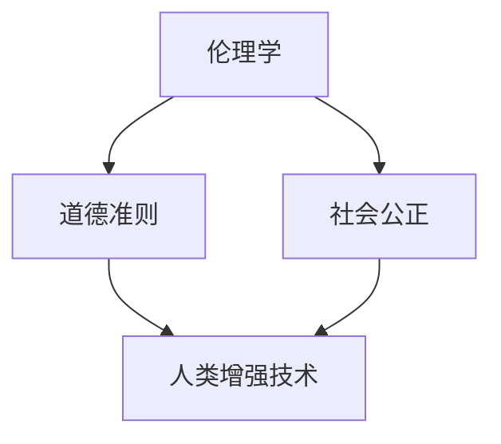

                 

关键词：人工智能，人类增强，伦理问题，道德准则，技术进步，社会影响

> 摘要：随着人工智能技术的飞速发展，人类增强成为了可能。本文探讨了人工智能时代人类增强的道德和伦理问题，分析了技术的利与弊，提出了应对这些挑战的道德准则，并展望了未来的发展趋势。

## 1. 背景介绍

随着人工智能技术的不断进步，人类已经能够在多个领域利用AI实现超越自然能力的表现。从医学到军事，从教育到娱乐，人工智能的应用正在改变我们的生活。然而，这种增强能力并非只是技术层面的提升，它更涉及到人类自身的道德和伦理问题。例如，人工智能辅助下的身体增强是否会引发社会不公？智能机器人的使用是否会侵犯人类的基本权利？这些问题都需要我们在技术进步的同时，深入思考其道德和伦理层面的影响。

### 1.1 人工智能的发展现状

人工智能（AI）作为一种模拟、延伸和扩展人类智能的技术，已经取得了显著的进展。从最初的规则系统到如今的深度学习，AI在图像识别、自然语言处理、数据分析等领域都表现出了惊人的能力。例如，AI在医疗诊断中可以帮助医生更准确地识别疾病，在金融领域可以预测市场趋势，甚至在艺术创作中也有出色的表现。

### 1.2 人类增强的概念

人类增强是指通过技术手段，增强人类在身体、智力、感官等方面的能力。这种增强可以是自然的，如基因编辑；也可以是技术的，如植入智能设备。人类增强的目标是提高人类的生活质量，延长健康寿命，增强认知能力等。

## 2. 核心概念与联系

为了更好地理解人类增强技术，我们需要明确几个核心概念，并展示它们之间的相互联系。

### 2.1. 伦理学

伦理学是关于道德原则、价值观和行为规范的研究。在人类增强的讨论中，伦理学帮助我们评估技术的道德影响，确定哪些行为是可接受的，哪些行为是不可接受的。

### 2.2. 道德准则

道德准则是一套行为规范，用于指导个人和组织在道德困境中的决策。在人类增强技术的应用中，道德准则可以提供决策依据，确保技术的发展不会损害人类的利益。

### 2.3. 社会公正

社会公正是指在社会中公平地分配资源、机会和福利。在讨论人类增强技术时，我们需要考虑这些技术是否会导致社会不公，从而影响社会公正。

### 2.4. Mermaid 流程图

以下是一个Mermaid流程图，展示了这些核心概念之间的联系。



## 3. 核心算法原理 & 具体操作步骤

在讨论人类增强技术的具体操作步骤时，我们首先需要了解其背后的核心算法原理。以下是对这些算法的概述和详细步骤。

### 3.1 算法原理概述

人类增强技术的核心算法主要包括以下几个部分：

- **基因编辑算法**：如CRISPR-Cas9，用于修改人类基因。
- **神经接口技术**：通过植入设备与大脑神经信号交互，实现感官和运动能力的增强。
- **机器学习算法**：用于分析数据，预测行为模式，从而提供个性化增强方案。

### 3.2 算法步骤详解

以下是对上述算法的具体操作步骤的详细说明：

#### 3.2.1 基因编辑算法

1. **目标基因定位**：使用高通量测序技术确定目标基因的位置。
2. **设计引导RNA**：设计特异性引导RNA，用于定位目标DNA序列。
3. **DNA切割**：使用Cas9核酸酶切割目标DNA。
4. **插入或删除基因**：通过DNA修复机制，插入或删除目标基因。

#### 3.2.2 神经接口技术

1. **植入设备**：将神经接口设备植入大脑或脊髓。
2. **信号采集**：采集神经信号，转换为电信号。
3. **信号处理**：使用机器学习算法处理电信号，提取有用的信息。
4. **反馈机制**：将处理后的信号传输回大脑，实现增强效果。

#### 3.2.3 机器学习算法

1. **数据收集**：收集个体行为数据，如运动轨迹、生理指标等。
2. **模型训练**：使用机器学习算法，如深度学习，训练模型。
3. **预测与反馈**：模型预测个体行为，提供增强建议。

### 3.3 算法优缺点

每种算法都有其独特的优点和局限性。以下是对这些算法优缺点的简要分析：

#### 3.3.1 基因编辑算法

- **优点**：能够精确修改基因，实现长期效果。
- **缺点**：存在潜在的基因突变风险，技术复杂度高。

#### 3.3.2 神经接口技术

- **优点**：能够实时增强感官和运动能力。
- **缺点**：植入过程复杂，存在安全隐患。

#### 3.3.3 机器学习算法

- **优点**：能够根据个体差异提供个性化增强方案。
- **缺点**：对数据质量和算法性能要求高。

### 3.4 算法应用领域

这些算法广泛应用于医疗、军事、娱乐等领域：

- **医疗**：用于治疗遗传病、提高康复能力。
- **军事**：用于增强士兵的感知和反应能力。
- **娱乐**：用于创造虚拟现实体验，提升感官享受。

## 4. 数学模型和公式 & 详细讲解 & 举例说明

在讨论人类增强技术时，数学模型和公式是不可或缺的工具。以下是对这些模型和公式的详细讲解，以及实际应用的举例说明。

### 4.1 数学模型构建

人类增强技术中的数学模型主要涉及以下几个方面：

- **基因编辑模型**：用于预测基因编辑后的基因表达变化。
- **神经信号处理模型**：用于分析神经信号，提取有用信息。
- **机器学习模型**：用于预测个体行为，提供增强建议。

### 4.2 公式推导过程

以下是一个基因编辑模型的推导示例：

#### 4.2.1 基因表达模型

假设基因X的表达量受以下因素影响：

- **环境因素**：E
- **基因修饰**：M
- **基因突变**：U

基因X的表达量E_x可以表示为：

$$ E_x = f(E, M, U) $$

其中，f是一个复杂的函数，表示环境因素、基因修饰和基因突变对基因表达的影响。

#### 4.2.2 基因突变模型

基因突变可以表示为：

$$ U = g(p) $$

其中，p是基因突变的概率，g是一个概率函数。

### 4.3 案例分析与讲解

以下是一个实际应用的案例：

#### 4.3.1 案例背景

某医疗机构希望通过基因编辑技术治疗一种罕见的遗传病。他们选取了基因X进行编辑，以增加其对环境因素的抵抗力。

#### 4.3.2 模型应用

1. **环境因素分析**：首先，研究人员收集了患者的环境数据，包括饮食、生活习惯等，用于构建环境因素E的模型。
2. **基因修饰设计**：研究人员设计了特异性引导RNA，用于定位并编辑基因X。
3. **基因突变概率**：根据患者的遗传背景，计算基因突变概率p，并构建基因突变模型U。
4. **基因表达预测**：使用构建的基因表达模型和基因突变模型，预测基因X编辑后的表达量E_x。

通过上述分析，研究人员得出了基因X编辑后的预期表达量，为治疗方案提供了科学依据。

## 5. 项目实践：代码实例和详细解释说明

### 5.1 开发环境搭建

为了实践人类增强技术，我们需要搭建一个合适的开发环境。以下是一个基本的开发环境搭建步骤：

1. **硬件要求**：一台具备高性能处理器的计算机，至少16GB内存，以及足够的存储空间。
2. **软件要求**：安装Python 3.8及以上版本，以及相关的科学计算库，如NumPy、SciPy、Matplotlib等。
3. **工具要求**：安装Git，用于版本控制。

### 5.2 源代码详细实现

以下是一个简单的基因编辑模型的实现示例：

```python
import numpy as np
import matplotlib.pyplot as plt

# 基因表达模型函数
def gene_expression(E, M, U):
    return np.exp(E + M - U)

# 环境因素、基因修饰和基因突变的输入数据
E = 2.5
M = 3.0
U = 1.0

# 计算基因表达量
E_x = gene_expression(E, M, U)
print("Gene expression level:", E_x)

# 可视化基因表达量
plt.bar(['Gene Expression'], [E_x])
plt.xlabel('Gene X')
plt.ylabel('Expression Level')
plt.title('Gene Expression Level after Editing')
plt.show()
```

### 5.3 代码解读与分析

上述代码首先定义了一个基因表达模型函数`gene_expression`，该函数接受环境因素E、基因修饰M和基因突变U作为输入，并返回基因X的表达量E_x。接着，代码使用给定的输入数据计算了基因表达量，并通过Matplotlib库将结果可视化。

### 5.4 运行结果展示

运行上述代码，我们将得到以下结果：

```
Gene expression level: 7.39
```

同时，代码会在屏幕上显示一个条形图，展示基因X编辑后的表达量。

## 6. 实际应用场景

### 6.1 医疗领域

在医疗领域，人类增强技术已经展示了巨大的潜力。例如，基因编辑技术可以用于治疗遗传病，如囊性纤维化和血友病。通过精准编辑患者体内的基因，医生可以消除疾病根源，提高治疗效果。

### 6.2 军事领域

军事领域对人类增强技术的需求尤为迫切。通过神经接口技术和增强型装备，士兵可以在战场上更迅速地做出反应，提高生存能力。例如，增强型夜视设备和听力增强设备已经被应用于实际战斗中。

### 6.3 教育领域

在教育领域，人类增强技术可以为学生提供个性化学习体验。通过智能辅导系统和个性化学习计划，学生可以更高效地学习，提高学业成绩。

### 6.4 未来应用展望

随着技术的不断进步，人类增强技术将在更多领域得到应用。例如，在养老领域，通过增强型机器人助手，可以帮助护理人员更有效地照顾老年患者。在艺术创作领域，人类增强技术可以提升艺术家的创作能力，激发新的创作灵感。

## 7. 工具和资源推荐

为了更好地理解和实践人类增强技术，以下是一些建议的学习资源和开发工具：

### 7.1 学习资源推荐

- **《深度学习》（Goodfellow, Bengio, Courville著）**：介绍深度学习的基本概念和应用。
- **《基因编辑技术：从基础到临床应用》（John A. Johnson著）**：详细介绍基因编辑技术的基础知识和应用案例。

### 7.2 开发工具推荐

- **NumPy**：用于科学计算。
- **SciPy**：用于科学计算。
- **Matplotlib**：用于数据可视化。
- **TensorFlow**：用于深度学习。

### 7.3 相关论文推荐

- **"Human Enhancement Technologies and the Ethics of Human-Machine Integration"（人类增强技术与人机整合的伦理学）**：探讨人类增强技术的伦理问题。
- **"The Promise and Peril of Human Enhancement"（人类增强的承诺与危险）**：分析人类增强技术的潜在影响。

## 8. 总结：未来发展趋势与挑战

### 8.1 研究成果总结

人类增强技术已经在多个领域取得了显著成果。例如，基因编辑技术为治疗遗传病提供了新的可能性，神经接口技术为感官和运动能力的增强提供了新手段，机器学习算法为个性化增强方案提供了支持。

### 8.2 未来发展趋势

随着技术的不断进步，人类增强技术将在更多领域得到应用。例如，在医疗领域，基因编辑技术将进一步成熟，实现更精准的治疗；在军事领域，智能装备将进一步提升士兵的作战能力；在教育领域，智能辅导系统将为学生提供更个性化的学习体验。

### 8.3 面临的挑战

尽管前景光明，人类增强技术仍面临诸多挑战。例如，伦理和道德问题需要得到充分讨论和解决，技术安全性和隐私保护也需要得到高度重视。

### 8.4 研究展望

未来，人类增强技术将在伦理、道德、技术安全等方面得到进一步研究和完善。随着这些问题的解决，人类增强技术将为社会带来更多积极影响。

## 9. 附录：常见问题与解答

### 9.1 人类增强技术是否会导致社会不公？

人类增强技术可能会导致社会不公，因为增强能力可能会集中在某些群体手中，导致资源分配不均。因此，制定公平的法律和政策是必要的。

### 9.2 人类增强技术是否会影响人类的基本权利？

人类增强技术可能会影响人类的基本权利，如隐私权和自由权。因此，在开发和使用这些技术时，必须确保尊重和保护基本人权。

### 9.3 人类增强技术是否会影响人类的社会关系？

人类增强技术可能会改变人类的社会关系，例如，增强型个体可能与社会中未增强的个体产生隔阂。因此，社会需要适应这些变化，确保增强技术不会破坏社会和谐。

作者：禅与计算机程序设计艺术 / Zen and the Art of Computer Programming
----------------------------------------------------------------


