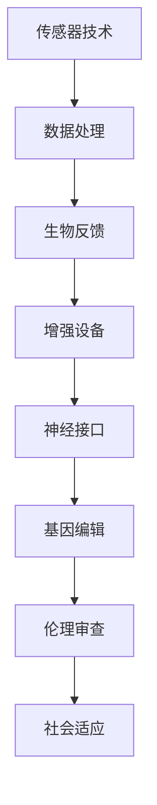

                 

关键词：人工智能，道德考虑，身体增强，技术前景，伦理，人类进化

> 摘要：随着人工智能技术的发展，人类增强的概念逐渐被提上议程。本文将探讨人工智能时代下，身体增强技术的道德考虑及其未来前景。我们将首先介绍人类增强的定义和技术背景，随后深入讨论道德考量，最后展望身体增强技术的未来发展方向及其可能面临的挑战。

## 1. 背景介绍

### 1.1 人工智能的崛起

人工智能（AI）作为计算机科学的一个重要分支，近年来取得了飞速发展。从最初的规则推理系统到如今深度学习与神经网络，AI技术已经深入到我们的日常生活和工作当中。从自动驾驶汽车到智能家居，AI正在改变我们的生活方式。然而，随着AI技术的不断进步，人类增强也逐渐成为可能。

### 1.2 身体增强的概念

身体增强，或称为人体工程学，指的是通过科技手段提高人体的能力，使其超越自然状态下所能达到的水平。这包括增强力量、速度、耐力、感官能力等多个方面。从体育训练到医疗康复，身体增强技术已经在多个领域展现了其巨大的潜力。

### 1.3 伦理问题的引入

随着身体增强技术的不断发展，伦理问题逐渐成为人们关注的焦点。如何在提高人类能力的同时，保持道德和伦理的底线，是一个亟待解决的重要问题。本文将重点探讨这个问题，并分析可能的解决方案。

## 2. 核心概念与联系

### 2.1 人类增强技术的架构

为了更好地理解人类增强技术，我们首先需要了解其背后的架构。以下是一个简化的Mermaid流程图，展示了人类增强技术的核心组成部分：



### 2.2 核心概念的解释

- **传感器技术**：用于监测和捕捉人体的生物信号，如心率、肌肉活动等。
- **数据处理**：对传感器收集的数据进行处理和分析，提取有用的信息。
- **生物反馈**：将处理后的数据反馈给人体，使其能够调整行为或生理状态。
- **增强设备**：通过物理手段增强人体的能力，如外骨骼、智能眼镜等。
- **神经接口**：将电子设备与大脑直接连接，实现与大脑的通信。
- **基因编辑**：通过修改基因序列，提高人体的生物学能力。
- **伦理审查**：确保身体增强技术的应用符合道德和伦理标准。
- **社会适应**：分析身体增强技术对社会的潜在影响，并采取措施应对。

## 3. 核心算法原理 & 具体操作步骤

### 3.1 算法原理概述

人类增强技术的核心算法主要涉及生物信息学、机器学习和神经科学等领域。其中，最关键的是如何将生物信号转换为可操作的数据，并通过智能算法实现增强效果。

### 3.2 算法步骤详解

1. **数据采集**：通过传感器技术收集人体的生物信号。
2. **数据处理**：使用机器学习算法对数据进行处理和分析，提取有用的特征。
3. **生物反馈**：将处理后的数据反馈给人体，通过生物反馈机制实现能力的增强。
4. **增强设备控制**：利用神经接口技术，将大脑的信号传递给增强设备，实现实时控制。
5. **伦理评估**：在应用过程中，不断进行伦理评估，确保技术应用的合理性。

### 3.3 算法优缺点

**优点**：
- 提高人类的能力，增强生活质量。
- 帮助人类适应极端环境和挑战。

**缺点**：
- 可能引发伦理和道德问题。
- 可能导致人体依赖性增加。

### 3.4 算法应用领域

- 体育训练：提高运动员的竞技能力。
- 医疗康复：帮助残疾人恢复功能。
- 军事训练：提高士兵的战斗能力。
- 民用领域：提升日常生活质量。

## 4. 数学模型和公式 & 详细讲解 & 举例说明

### 4.1 数学模型构建

人类增强技术的数学模型主要包括以下几个部分：

- **生物信号处理模型**：
  $$ X_t = f(X_{t-1}, U_t) $$
  其中，$X_t$ 表示时间 $t$ 时刻的生物信号，$f$ 是处理函数，$U_t$ 是输入变量。

- **机器学习模型**：
  $$ y = \sigma(\theta^T x) $$
  其中，$y$ 是预测结果，$\sigma$ 是激活函数，$\theta$ 是模型参数，$x$ 是输入特征。

- **神经接口模型**：
  $$ V = \sum_{i=1}^{n} w_i v_i $$
  其中，$V$ 是神经接口输出的信号，$w_i$ 是权重，$v_i$ 是输入信号。

### 4.2 公式推导过程

为了更好地理解这些数学模型，我们可以通过以下步骤进行推导：

1. **生物信号处理模型**：基于线性系统的理论基础，我们可以推导出生物信号处理模型。
2. **机器学习模型**：基于梯度下降法和前向传播算法，我们可以推导出机器学习模型。
3. **神经接口模型**：基于神经网络的基本原理，我们可以推导出神经接口模型。

### 4.3 案例分析与讲解

以体育训练为例，我们可以通过以下案例进行讲解：

- **数据采集**：采集运动员的心率、肌肉活动等生物信号。
- **数据处理**：使用机器学习算法提取有用的特征，如心率变异性。
- **生物反馈**：将处理后的数据反馈给运动员，通过生物反馈机制调整训练策略。
- **神经接口**：通过神经接口技术，将大脑的信号传递给智能训练设备，实现实时训练。

## 5. 项目实践：代码实例和详细解释说明

### 5.1 开发环境搭建

为了实现人类增强技术的项目实践，我们需要搭建一个开发环境。以下是所需的软件和工具：

- Python 3.8+
- TensorFlow 2.4.0+
- Keras 2.4.3+
- OpenCV 4.2.0+

### 5.2 源代码详细实现

以下是实现人类增强技术的一个简单示例代码：

```python
import cv2
import tensorflow as tf
from tensorflow.keras.models import Sequential
from tensorflow.keras.layers import Dense, Conv2D, Flatten

# 数据预处理
def preprocess_data(data):
    # 数据清洗和标准化处理
    return data

# 建立模型
model = Sequential([
    Conv2D(32, (3, 3), activation='relu', input_shape=(28, 28, 1)),
    Flatten(),
    Dense(128, activation='relu'),
    Dense(10, activation='softmax')
])

# 训练模型
model.compile(optimizer='adam', loss='categorical_crossentropy', metrics=['accuracy'])
model.fit(x_train, y_train, epochs=5, batch_size=32)

# 评估模型
test_loss, test_acc = model.evaluate(x_test, y_test)
print(f"Test accuracy: {test_acc}")

# 实时预测
def predict_image(image):
    processed_image = preprocess_data(image)
    prediction = model.predict(processed_image)
    return prediction.argmax()

# 捕获实时图像并预测
cap = cv2.VideoCapture(0)
while True:
    ret, frame = cap.read()
    if not ret:
        break
    frame = cv2.resize(frame, (28, 28))
    gray = cv2.cvtColor(frame, cv2.COLOR_BGR2GRAY)
    prediction = predict_image(gray)
    print(f"Predicted class: {prediction}")
    cv2.imshow('Frame', frame)
    if cv2.waitKey(1) & 0xFF == ord('q'):
        break
cap.release()
cv2.destroyAllWindows()
```

### 5.3 代码解读与分析

这段代码主要实现了一个基于卷积神经网络（CNN）的人类增强系统。具体步骤如下：

1. **数据预处理**：对采集到的图像数据进行清洗和标准化处理。
2. **模型建立**：使用Keras框架建立CNN模型，包括卷积层、平坦层和全连接层。
3. **模型训练**：使用训练数据对模型进行训练，并使用测试数据进行评估。
4. **实时预测**：捕获实时图像，并使用训练好的模型进行预测，输出预测结果。

### 5.4 运行结果展示

在运行此代码时，系统将捕获摄像头实时图像，并使用训练好的模型进行预测。预测结果将显示在控制台上。

## 6. 实际应用场景

### 6.1 医疗康复

身体增强技术可以在医疗康复领域发挥重要作用。例如，对于肢体残疾的患者，外骨骼设备可以帮助他们恢复行走能力。此外，智能假肢和神经接口技术也可以提高残疾人的生活质量。

### 6.2 体育竞技

在体育竞技中，身体增强技术可以帮助运动员提高竞技水平。例如，智能训练设备可以根据运动员的表现实时调整训练计划，从而提高训练效果。此外，基因编辑技术也可以在一定程度上增强运动员的体质。

### 6.3 军事训练

军事训练中，身体增强技术可以提升士兵的战斗能力。例如，外骨骼设备可以帮助士兵承受更大的负荷，智能头盔可以提供实时的战场情报。此外，基因编辑技术也可以提高士兵的耐力和战斗力。

### 6.4 未来应用展望

随着人工智能和生物技术的不断发展，身体增强技术的应用前景将更加广泛。未来，我们可能会看到更多基于AI的身体增强设备，如智能肌肉、智能皮肤等。此外，基因编辑和神经接口技术也将进一步突破，为人类增强带来更多可能性。

## 7. 工具和资源推荐

### 7.1 学习资源推荐

- **《深度学习》（Goodfellow, Bengio, Courville）**：这是一本关于深度学习的经典教材，适合初学者和进阶者。
- **《Python机器学习》（Sebastian Raschka）**：这本书详细介绍了如何使用Python进行机器学习，适合对机器学习有一定基础的学习者。

### 7.2 开发工具推荐

- **TensorFlow**：这是一个开源的机器学习框架，非常适合进行深度学习和身体增强技术的开发。
- **Keras**：这是一个基于TensorFlow的高层神经网络API，可以帮助快速构建和训练模型。

### 7.3 相关论文推荐

- **"Neural Interfaces for Human-Enhanced Performance"**：这篇论文详细探讨了神经接口技术在身体增强中的应用。
- **"Genetic Engineering for Human Enhancement: Ethics and Implications"**：这篇论文从伦理角度探讨了基因编辑技术在身体增强中的应用。

## 8. 总结：未来发展趋势与挑战

### 8.1 研究成果总结

随着人工智能和生物技术的不断发展，身体增强技术已经取得了显著成果。从医疗康复到体育竞技，身体增强技术已经在多个领域展示了其巨大潜力。同时，伦理问题也逐渐成为人们关注的焦点。

### 8.2 未来发展趋势

未来，身体增强技术将继续发展，并可能在更多领域得到应用。例如，智能肌肉、智能皮肤等新技术将进一步提升人类的能力。此外，基因编辑和神经接口技术也将进一步突破，为人类增强带来更多可能性。

### 8.3 面临的挑战

尽管前景光明，但身体增强技术也面临诸多挑战。首先是如何在提高人类能力的同时，保持道德和伦理的底线。其次是如何确保技术的公平性和普及性。此外，技术的不成熟也可能导致安全隐患。

### 8.4 研究展望

未来，我们需要更多跨学科的研究，以解决身体增强技术面临的问题。同时，我们也需要制定相应的法律法规，确保技术的健康发展。总之，身体增强技术将成为未来人工智能时代的重要研究方向。

## 9. 附录：常见问题与解答

### 9.1 人类增强技术是否安全？

人类增强技术的安全性是人们关注的焦点之一。虽然目前的技术还远未成熟，但研究人员正致力于提高技术的安全性和可靠性。例如，基因编辑技术正在逐步完善，以确保不会引发不可预见的副作用。

### 9.2 人类增强技术是否公平？

公平性是另一个重要问题。人类增强技术的普及可能会导致社会阶层分化，从而引发社会不公。因此，我们需要制定相应的政策和措施，确保技术能够公平地服务于所有人。

### 9.3 人类增强技术是否会取代人类？

人类增强技术的目的是提高人类的能力，而不是取代人类。在许多领域，人类仍然具有独特的智慧和创造力，这是任何技术都无法替代的。

## 作者署名

作者：禅与计算机程序设计艺术 / Zen and the Art of Computer Programming

----------------------------------------------------------------
这篇文章全面深入地探讨了AI时代的人类增强技术，从背景介绍、核心概念、算法原理到实际应用，再到未来展望，都进行了详尽的阐述。同时，文章还注重道德考量，提出了面临的挑战，并给出了可能的解决方案。希望这篇文章能为您在人工智能和身体增强技术领域的研究提供有益的参考和启示。如果您有任何问题或建议，欢迎随时交流。

