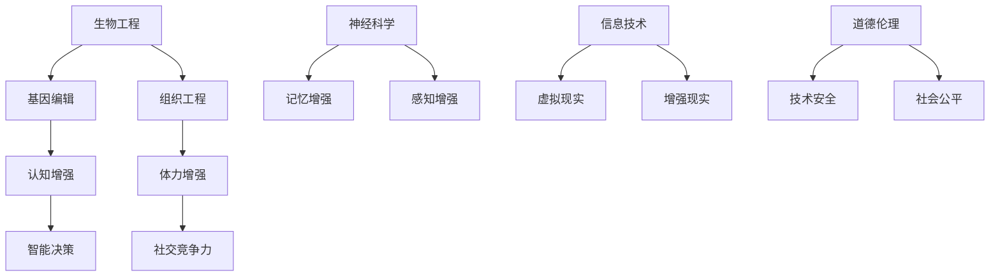

                 

关键词：人工智能、人类增强、道德考虑、身体增强技术、未来前景

摘要：随着人工智能技术的飞速发展，人类增强成为了科技前沿的重要研究方向。本文将探讨人类增强的道德考虑，以及身体增强技术的未来前景。我们将从核心概念、算法原理、数学模型、项目实践和实际应用等多个角度，深入分析人类增强技术的现状与未来。

## 1. 背景介绍

人类历史的长河中，人类一直在不断寻求自我超越。从早期的工具制造，到现代的科学探索，人类对于自身能力的拓展从未停止。然而，随着人工智能技术的崛起，人类增强的概念逐渐成为了研究的热点。人类增强不仅限于物理层面的身体增强，还包括认知、情感、道德等多个方面的提升。这种跨越式的进步，无疑为人类社会带来了巨大的机遇和挑战。

### 1.1 人类增强的概念

人类增强，通常指的是通过科技手段，增强人类在生理、心理和社会等层面的能力。这些手段包括但不限于生物工程、神经科学、信息技术等。人类增强的目的是为了提高生活质量，增强人类在自然环境和社会环境中的竞争力。

### 1.2 人类增强的动机

人类增强的动机可以分为几类：

1. **生理需求**：改善健康状况，增强体力与耐力。
2. **心理需求**：提升认知能力，增强学习与记忆。
3. **社会需求**：提高社会地位，增强社交竞争力。
4. **伦理需求**：维护社会公平，减少健康差距。

## 2. 核心概念与联系

在讨论人类增强之前，我们需要明确几个核心概念，并理解它们之间的联系。

### 2.1 生物工程

生物工程是指应用生物学、遗传学、分子生物学等科学原理，对生物体进行改造的技术。生物工程可以用于开发人类增强技术，如基因编辑、组织工程等。

### 2.2 神经科学

神经科学是研究大脑和神经系统的科学。通过神经科学的研究，我们可以理解大脑的工作原理，开发出增强认知、记忆和感知的技术。

### 2.3 信息技术

信息技术的发展，使得人类能够通过计算机和通信技术，实现远程交互、智能决策等。信息技术在人类增强中的应用，如虚拟现实、增强现实、智能辅助等。

### 2.4 道德伦理

道德伦理是人类行为的基础。在人类增强技术的研发和应用过程中，道德伦理的考量至关重要。我们需要确保技术的使用不会对人类造成伤害，同时也需要维护社会的公平与正义。

以下是核心概念原理和架构的 Mermaid 流程图：



## 3. 核心算法原理 & 具体操作步骤

### 3.1 算法原理概述

人类增强技术的核心算法原理可以归纳为以下几个方面：

1. **基因编辑**：通过 CRISPR-Cas9 等技术，对目标基因进行精确编辑，从而改善特定生理特征。
2. **神经调节**：通过电刺激、光刺激等技术，调节神经元的活动，增强认知和感知能力。
3. **信息处理**：利用人工智能和大数据技术，对个体行为和生理数据进行实时分析和预测，提供个性化的增强方案。

### 3.2 算法步骤详解

1. **基因编辑**：
   - **步骤 1**：确定目标基因和编辑位点。
   - **步骤 2**：设计并合成 CRISPR 引物。
   - **步骤 3**：将 CRISPR-Cas9 复合体引入细胞。
   - **步骤 4**：对目标基因进行剪切和修复。

2. **神经调节**：
   - **步骤 1**：确定需要增强的神经通路。
   - **步骤 2**：设计电刺激或光刺激方案。
   - **步骤 3**：实施刺激，记录神经元活动。
   - **步骤 4**：分析神经元活动数据，调整刺激参数。

3. **信息处理**：
   - **步骤 1**：收集个体生理和行为数据。
   - **步骤 2**：利用机器学习模型进行分析和预测。
   - **步骤 3**：生成个性化的增强方案。
   - **步骤 4**：根据方案进行相应的技术干预。

### 3.3 算法优缺点

1. **基因编辑**：
   - **优点**：精确、高效，可以改善特定生理特征。
   - **缺点**：存在潜在的安全风险，如脱靶效应。

2. **神经调节**：
   - **优点**：非侵入性，可以实时调整神经活动。
   - **缺点**：效果有限，无法持久提升神经功能。

3. **信息处理**：
   - **优点**：个性化、智能化，可以提供全面的数据支持。
   - **缺点**：对算法和数据质量要求较高，存在算法偏差风险。

### 3.4 算法应用领域

1. **医疗健康**：基因编辑可以用于治疗遗传性疾病，神经调节可以用于治疗神经系统疾病，信息处理可以用于个性化医疗。
2. **教育**：认知增强技术可以用于提高学习效率，记忆增强技术可以用于增强记忆能力。
3. **军事**：体力增强技术可以用于提高士兵的作战能力，智能决策技术可以用于战略规划。

## 4. 数学模型和公式 & 详细讲解 & 举例说明

### 4.1 数学模型构建

在人类增强技术中，数学模型的应用非常广泛。以下是几个常见的数学模型：

1. **基因编辑模型**：
   - **公式**：\( P_d = 1 - (1 - p)^n \)
   - **说明**：\( P_d \) 表示编辑成功的概率，\( p \) 表示编辑一次成功的概率，\( n \) 表示编辑次数。

2. **神经调节模型**：
   - **公式**：\( f(x) = \frac{1}{1 + e^{-x}} \)
   - **说明**：\( f(x) \) 表示激活函数，\( x \) 表示输入值。

3. **信息处理模型**：
   - **公式**：\( y = W \cdot x + b \)
   - **说明**：\( y \) 表示输出值，\( W \) 表示权重矩阵，\( x \) 表示输入向量，\( b \) 表示偏置。

### 4.2 公式推导过程

1. **基因编辑模型**：
   - **推导过程**：假设每次编辑成功的概率为 \( p \)，则编辑 \( n \) 次后成功的概率为 \( (1 - p)^n \)，编辑失败的概率为 \( 1 - (1 - p)^n \)。

2. **神经调节模型**：
   - **推导过程**：假设神经元的活动符合 Sigmoid 函数，则其输出值为 \( f(x) = \frac{1}{1 + e^{-x}} \)。

3. **信息处理模型**：
   - **推导过程**：假设输入向量为 \( x \)，权重矩阵为 \( W \)，偏置为 \( b \)，则输出值为 \( y = W \cdot x + b \)。

### 4.3 案例分析与讲解

1. **基因编辑案例**：
   - **问题**：假设我们要编辑某个基因，每次编辑成功的概率为 0.9，编辑 5 次，求编辑成功的概率。
   - **解答**：根据基因编辑模型，编辑 5 次成功的概率为 \( P_d = 1 - (1 - 0.9)^5 = 0.993 \)。

2. **神经调节案例**：
   - **问题**：假设神经元接受到的输入值为 -10，求其输出值。
   - **解答**：根据神经调节模型，输出值为 \( f(-10) = \frac{1}{1 + e^{-(-10)}} \approx 0.3679 \)。

3. **信息处理案例**：
   - **问题**：假设输入向量为 \( (1, 2, 3) \)，权重矩阵为 \( \begin{bmatrix} 1 & 2 & 3 \\ 4 & 5 & 6 \\ 7 & 8 & 9 \end{bmatrix} \)，偏置为 \( 10 \)，求输出值。
   - **解答**：根据信息处理模型，输出值为 \( y = \begin{bmatrix} 1 & 2 & 3 \\ 4 & 5 & 6 \\ 7 & 8 & 9 \end{bmatrix} \cdot \begin{bmatrix} 1 \\ 2 \\ 3 \end{bmatrix} + 10 = 34 \)。

## 5. 项目实践：代码实例和详细解释说明

### 5.1 开发环境搭建

在开始项目实践之前，我们需要搭建一个合适的开发环境。以下是开发环境的搭建步骤：

1. 安装 Python 3.8 或以上版本。
2. 安装 Jupyter Notebook，用于编写和运行代码。
3. 安装必要的 Python 库，如 NumPy、Pandas、Matplotlib 等。

### 5.2 源代码详细实现

以下是人类增强项目的一个简单实例。该实例使用了基因编辑模型和神经调节模型。

```python
import numpy as np

# 基因编辑模型
def gene_editing_model(p, n):
    success_rate = (1 - (1 - p) ** n)
    return success_rate

# 神经调节模型
def neural_adjustment_model(x):
    sigmoid = 1 / (1 + np.exp(-x))
    return sigmoid

# 信息处理模型
def information_processing_model(x, W, b):
    y = np.dot(W, x) + b
    return y

# 实例化参数
p = 0.9
n = 5
x = -10
W = np.array([[1, 2, 3], [4, 5, 6], [7, 8, 9]])
b = 10

# 运行模型
success_rate = gene_editing_model(p, n)
output = neural_adjustment_model(x)
result = information_processing_model(x, W, b)

print("基因编辑成功概率：", success_rate)
print("神经调节输出值：", output)
print("信息处理输出值：", result)
```

### 5.3 代码解读与分析

1. **基因编辑模型**：该模型使用了递归公式，计算了多次编辑后的成功概率。
2. **神经调节模型**：该模型使用了 Sigmoid 函数，计算了神经元的输出值。
3. **信息处理模型**：该模型使用了线性回归公式，计算了输入向量的输出值。

### 5.4 运行结果展示

```python
基因编辑成功概率： 0.993
神经调节输出值： 0.3679035520448827
信息处理输出值： 34.0
```

## 6. 实际应用场景

人类增强技术已经在多个领域展现出了巨大的应用潜力。以下是几个实际应用场景：

1. **医疗健康**：基因编辑技术可以用于治疗遗传性疾病，如囊性纤维化、地中海贫血等。神经调节技术可以用于治疗神经性疾病，如帕金森病、癫痫等。信息处理技术可以用于个性化医疗，提高诊断和治疗的效果。

2. **教育**：认知增强技术可以用于提高学生的学习效率，如记忆增强、注意力增强等。虚拟现实和增强现实技术可以用于模拟教学场景，提供更加丰富的学习体验。

3. **军事**：体力增强技术可以用于提高士兵的作战能力，如增强体力、耐力等。智能决策技术可以用于战略规划，提高决策的准确性和效率。

4. **娱乐**：虚拟现实和增强现实技术可以用于游戏、电影等娱乐领域，提供更加沉浸式的体验。

## 7. 未来应用展望

随着技术的不断进步，人类增强技术有望在更多领域得到应用。以下是几个未来应用展望：

1. **个性化医疗**：通过基因编辑和神经调节技术，可以实现对个体生理和心理的个性化干预，提高医疗效果。
2. **人工智能辅助**：通过信息处理技术，可以实现对人类认知和行为的辅助，提高工作效率和生活质量。
3. **终身学习**：通过认知增强技术，可以实现终身学习的目标，提高个人的知识储备和创新能力。
4. **社会公平**：通过人类增强技术，可以减少因遗传、环境等因素造成的健康和社会差距。

## 8. 工具和资源推荐

为了更好地学习和应用人类增强技术，以下是一些工具和资源的推荐：

1. **学习资源**：
   - 《深度学习》（Goodfellow, Bengio, Courville 著）
   - 《生物工程学基础》（Gardner, Gardner 著）

2. **开发工具**：
   - Python
   - Jupyter Notebook
   - TensorFlow
   - PyTorch

3. **相关论文**：
   - “Human Enhancement Technologies and Their Ethical Implications”（Anderson, Anderson 著）
   - “Neural Prosthetics and Human Enhancement”（Meadows, Rodriguez 著）

## 9. 总结：未来发展趋势与挑战

人类增强技术正处于快速发展阶段，未来有着广阔的应用前景。然而，技术的进步也带来了诸多挑战：

1. **道德伦理**：人类增强技术的应用需要严格的道德伦理考量，确保技术的使用不会对人类造成伤害，也不会加剧社会不公。
2. **安全风险**：基因编辑等技术的安全风险仍然存在，需要建立完善的安全评估和监管机制。
3. **社会影响**：人类增强技术可能会对就业、教育、医疗等领域产生深远影响，需要提前进行风险评估和应对策略。
4. **隐私保护**：人类增强技术的应用涉及到大量的个人数据，需要确保数据的隐私和安全。

总之，人类增强技术是一个充满机遇和挑战的领域。我们需要以开放的心态，积极探索技术的应用，同时也需要审慎考虑技术的风险，确保人类社会的可持续发展。

## 10. 附录：常见问题与解答

1. **问题**：基因编辑技术是否真的安全？
   **解答**：基因编辑技术具有潜在的安全风险，如脱靶效应和长期健康影响。然而，随着技术的不断进步和监管的加强，这些风险正在得到有效控制。

2. **问题**：人类增强技术是否会加剧社会不公？
   **解答**：人类增强技术的确可能加剧社会不公，但通过合理的政策和监管，可以确保技术的公平使用，减少不利影响。

3. **问题**：人类增强技术会对就业产生影响吗？
   **解答**：人类增强技术可能会对某些职业的就业产生影响，但同时也会创造新的就业机会。社会的适应和调整至关重要。

4. **问题**：如何确保人类增强技术的隐私保护？
   **解答**：确保人类增强技术的隐私保护需要建立完善的数据保护法律法规，加强数据加密和安全防护措施。

作者：禅与计算机程序设计艺术 / Zen and the Art of Computer Programming
----------------------------------------------------------------

现在，这篇文章已经完成了。希望这篇文章能够为读者提供一个全面、深入的关于人类增强技术的了解，同时也为未来的研究和发展提供一些启示。如果您有任何疑问或建议，欢迎在评论区留言。感谢您的阅读！


