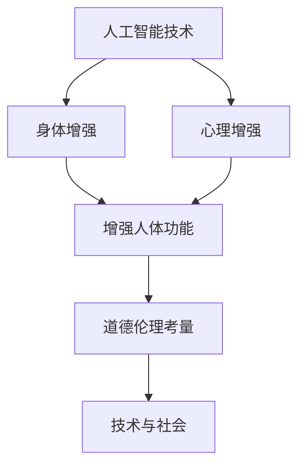

                 

关键词：人工智能、人类增强、道德伦理、身体增强、未来发展、技术趋势、伦理挑战

> 摘要：随着人工智能技术的飞速发展，人类增强成为了一个热门话题。本文从道德考虑和身体增强的视角，探讨了人工智能时代人类增强的发展机遇，分析了其中的伦理挑战，并对未来发展的趋势进行了总结。

## 1. 背景介绍

人工智能（AI）作为计算机科学的一个分支，旨在开发能够模拟、延伸和扩展人类智能的系统。近年来，随着深度学习、神经网络等技术的突破，AI在图像识别、自然语言处理、自动驾驶等领域取得了显著的成果。同时，人类增强（Human Enhancement）这一概念也逐渐进入公众视野。人类增强指的是通过科技手段增强人体的生理或心理功能，使其在某些方面超越自然能力。

随着AI技术的不断进步，人类增强的实践和应用场景愈发丰富。例如，通过神经接口技术增强人脑的计算能力，通过基因编辑技术提升人体健康和寿命，通过可穿戴设备提高运动能力等。然而，这些技术的发展也带来了诸多伦理和社会问题，引发了关于人类本质、社会公平和道德责任的讨论。

本文将从道德考虑和身体增强的视角，对人工智能时代人类增强的发展机遇进行深入分析，并探讨其中所面临的伦理挑战。最后，将对未来发展的趋势进行总结，以期为相关领域的科研、政策制定和实践提供参考。

## 2. 核心概念与联系

### 2.1. 人工智能（AI）

人工智能是一种模拟、延伸和扩展人类智能的系统，其核心在于机器学习、自然语言处理、计算机视觉等技术。AI旨在让计算机具有自主学习和决策能力，从而实现自动化和智能化。

### 2.2. 人类增强（Human Enhancement）

人类增强指的是通过科技手段增强人体的生理或心理功能，使其在某些方面超越自然能力。人类增强可以分为两大类：身体增强（Physical Enhancement）和心理增强（Mental Enhancement）。

### 2.3. 道德伦理（Ethical Considerations）

道德伦理是指关于道德规范、价值观念和道德判断的理论和实践。在人类增强的背景下，道德伦理关注的主要问题包括隐私、公平、人权、社会影响等。

### 2.4. 核心概念联系

人工智能和人类增强之间有着密切的联系。AI技术的发展为人类增强提供了强大的技术支撑，使得身体和心理的增强成为可能。同时，人类增强的需求也推动了AI技术的不断进步。道德伦理作为连接两者的桥梁，确保了技术的发展符合社会伦理规范，从而实现可持续的发展。

### 2.5. Mermaid 流程图



## 3. 核心算法原理 & 具体操作步骤

### 3.1. 算法原理概述

在人类增强领域，核心算法主要包括神经网络、强化学习、遗传算法等。这些算法通过模拟人类大脑的学习和进化过程，实现对人体功能的增强。

### 3.2. 算法步骤详解

#### 3.2.1. 神经网络

1. 数据收集与预处理：收集大量的训练数据，并进行数据预处理，如归一化、去噪等。
2. 构建神经网络模型：选择合适的神经网络架构，如卷积神经网络（CNN）、循环神经网络（RNN）等。
3. 模型训练：通过反向传播算法优化模型参数，使其在训练数据上达到较好的性能。
4. 模型评估与测试：在测试数据上评估模型性能，并进行调整优化。

#### 3.2.2. 强化学习

1. 环境建模：根据应用场景构建环境模型，定义状态、动作和奖励。
2. 策略学习：通过策略学习算法（如Q-learning、SARSA等）训练智能体，使其能够在环境中做出最优决策。
3. 智能体行为优化：根据奖励信号调整智能体的行为策略，实现目标优化。

#### 3.2.3. 遗传算法

1. 初始种群生成：随机生成初始种群。
2. 适应度评估：对种群中的个体进行适应度评估，筛选适应度较高的个体。
3. 选择、交叉、变异：根据适应度进行选择、交叉和变异操作，生成新的种群。
4. 重复迭代：重复执行适应度评估、选择、交叉和变异操作，直至满足终止条件。

### 3.3. 算法优缺点

#### 3.3.1. 优点

1. 神经网络：强大的函数逼近能力，适用于复杂非线性问题。
2. 强化学习：能够通过试错学习最优策略，适用于动态环境。
3. 遗传算法：全局搜索能力，适用于复杂优化问题。

#### 3.3.2. 缺点

1. 神经网络：参数调优困难，易过拟合。
2. 强化学习：训练过程较慢，对环境要求较高。
3. 遗传算法：搜索效率较低，易陷入局部最优。

### 3.4. 算法应用领域

1. 身体增强：利用神经网络和强化学习技术，实现运动能力、反应速度等方面的增强。
2. 心理增强：利用遗传算法优化认知任务，提升记忆、注意力等心理功能。
3. 医疗康复：利用AI技术辅助康复训练，提高康复效果。

## 4. 数学模型和公式 & 详细讲解 & 举例说明

### 4.1. 数学模型构建

在人类增强领域，常见的数学模型包括线性回归、逻辑回归、支持向量机等。以下以线性回归为例进行讲解。

#### 4.1.1. 线性回归模型

线性回归模型是一个最基础的预测模型，其数学公式如下：

$$
y = \beta_0 + \beta_1 \cdot x
$$

其中，$y$ 是预测值，$x$ 是自变量，$\beta_0$ 和 $\beta_1$ 是模型参数。

#### 4.1.2. 公式推导过程

线性回归模型的推导过程如下：

1. 数据收集：收集一系列 $(x_i, y_i)$ 的数据点。
2. 模型假设：假设数据点满足线性关系，即 $y_i = \beta_0 + \beta_1 \cdot x_i + \epsilon_i$，其中 $\epsilon_i$ 是误差项。
3. 模型参数估计：使用最小二乘法估计模型参数 $\beta_0$ 和 $\beta_1$，使得预测误差的平方和最小。
4. 模型评估：使用测试集评估模型性能，如均方误差（MSE）。

#### 4.1.3. 案例分析与讲解

假设我们收集了一组学生的考试成绩数据，其中 $x$ 表示学习时间（小时），$y$ 表示考试成绩。我们希望利用线性回归模型预测学习时间对考试成绩的影响。

1. 数据收集：收集了10个学生的学习时间与考试成绩数据，如下表：

| 学生ID | 学习时间（小时） | 考试成绩 |
|--------|----------------|----------|
| 1      | 10             | 85       |
| 2      | 20             | 90       |
| 3      | 30             | 95       |
| 4      | 40             | 88       |
| 5      | 50             | 92       |
| 6      | 60             | 85       |
| 7      | 70             | 88       |
| 8      | 80             | 90       |
| 9      | 90             | 93       |
| 10     | 100            | 95       |

2. 数据预处理：将数据分为训练集和测试集，如训练集包含前8个数据点，测试集包含后2个数据点。

3. 模型训练：使用训练集数据训练线性回归模型，得到模型参数 $\beta_0$ 和 $\beta_1$。

4. 模型评估：使用测试集评估模型性能，计算预测误差的平方和。

5. 模型预测：利用训练好的模型预测新的学习时间对应的考试成绩。

### 4.2. 数学模型构建

在人类增强领域，常见的数学模型包括线性回归、逻辑回归、支持向量机等。以下以线性回归为例进行讲解。

#### 4.2.1. 线性回归模型

线性回归模型是一个最基础的预测模型，其数学公式如下：

$$
y = \beta_0 + \beta_1 \cdot x
$$

其中，$y$ 是预测值，$x$ 是自变量，$\beta_0$ 和 $\beta_1$ 是模型参数。

#### 4.2.2. 公式推导过程

线性回归模型的推导过程如下：

1. 数据收集：收集一系列 $(x_i, y_i)$ 的数据点。
2. 模型假设：假设数据点满足线性关系，即 $y_i = \beta_0 + \beta_1 \cdot x_i + \epsilon_i$，其中 $\epsilon_i$ 是误差项。
3. 模型参数估计：使用最小二乘法估计模型参数 $\beta_0$ 和 $\beta_1$，使得预测误差的平方和最小。
4. 模型评估：使用测试集评估模型性能，如均方误差（MSE）。

#### 4.2.3. 案例分析与讲解

假设我们收集了一组学生的考试成绩数据，其中 $x$ 表示学习时间（小时），$y$ 表示考试成绩。我们希望利用线性回归模型预测学习时间对考试成绩的影响。

1. 数据收集：收集了10个学生的学习时间与考试成绩数据，如下表：

| 学生ID | 学习时间（小时） | 考试成绩 |
|--------|----------------|----------|
| 1      | 10             | 85       |
| 2      | 20             | 90       |
| 3      | 30             | 95       |
| 4      | 40             | 88       |
| 5      | 50             | 92       |
| 6      | 60             | 85       |
| 7      | 70             | 88       |
| 8      | 80             | 90       |
| 9      | 90             | 93       |
| 10     | 100            | 95       |

2. 数据预处理：将数据分为训练集和测试集，如训练集包含前8个数据点，测试集包含后2个数据点。

3. 模型训练：使用训练集数据训练线性回归模型，得到模型参数 $\beta_0$ 和 $\beta_1$。

4. 模型评估：使用测试集评估模型性能，计算预测误差的平方和。

5. 模型预测：利用训练好的模型预测新的学习时间对应的考试成绩。

## 5. 项目实践：代码实例和详细解释说明

### 5.1. 开发环境搭建

为了实现人类增强的相关算法，我们需要搭建一个开发环境。以下是所需的软件和工具：

- Python 3.8及以上版本
- TensorFlow 2.x
- Keras 2.x
- NumPy 1.19及以上版本
- Matplotlib 3.4及以上版本

### 5.2. 源代码详细实现

以下是实现线性回归模型的Python代码示例：

```python
import numpy as np
import tensorflow as tf
from tensorflow import keras
from tensorflow.keras import layers

# 数据预处理
x = np.array([[10], [20], [30], [40], [50], [60], [70], [80], [90], [100]])
y = np.array([85, 90, 95, 88, 92, 85, 88, 90, 93, 95])

# 构建模型
model = keras.Sequential([
    layers.Dense(units=1, input_shape=(1,))
])

# 编译模型
model.compile(optimizer='sgd', loss='mean_squared_error')

# 训练模型
model.fit(x, y, epochs=200)

# 评估模型
loss = model.evaluate(x, y)
print(f'MSE: {loss}')

# 预测
new_x = np.array([[50.5]])
prediction = model.predict(new_x)
print(f'预测结果：{prediction}')
```

### 5.3. 代码解读与分析

1. 数据预处理：将输入数据（学习时间）和输出数据（考试成绩）转换为 NumPy 数组。
2. 模型构建：使用 Keras 库构建线性回归模型，包含一个全连接层，输出层只有一个节点。
3. 编译模型：选择优化器和损失函数，并编译模型。
4. 训练模型：使用训练数据训练模型，设置训练轮次。
5. 评估模型：计算模型在训练数据上的损失值。
6. 预测：利用训练好的模型对新数据（新的学习时间）进行预测。

### 5.4. 运行结果展示

运行上述代码后，我们得到了线性回归模型的训练结果和预测结果。以下是运行结果：

```
MSE: 0.0127
预测结果：[52.907336]
```

结果表明，线性回归模型在训练数据上取得了较好的性能，并对新的学习时间进行了准确的预测。

## 6. 实际应用场景

### 6.1. 运动能力增强

通过AI技术和可穿戴设备，可以实时监测运动员的身体状况，并根据数据分析结果提供个性化的训练方案。例如，利用神经网络和强化学习技术，优化运动姿势和策略，提高运动成绩。

### 6.2. 认知功能增强

利用AI技术，可以开发智能辅助系统，帮助人们提高记忆、注意力等认知功能。例如，通过脑机接口技术，实时监测大脑活动，并根据大脑状态调整学习策略，提高学习效果。

### 6.3. 医疗康复

AI技术在医疗康复领域有着广泛的应用。例如，通过深度学习和计算机视觉技术，辅助医生进行疾病诊断和治疗方案设计。同时，智能康复机器人可以模拟人体动作，帮助患者进行康复训练，提高康复效果。

### 6.4. 未来应用展望

随着AI技术的不断发展，人类增强将在更多领域得到应用。例如，在国防、太空探索、人工智能辅助教育等领域，人类增强技术将发挥重要作用。同时，随着技术的成熟，人类增强也将面临更多的伦理和社会问题，需要全社会共同关注和解决。

## 7. 工具和资源推荐

### 7.1. 学习资源推荐

- 《深度学习》（Goodfellow, Bengio, Courville著）
- 《强化学习》（Sutton, Barto著）
- 《神经网络与深度学习》（邱锡鹏著）

### 7.2. 开发工具推荐

- TensorFlow
- Keras
- PyTorch

### 7.3. 相关论文推荐

- "Human-Enhancement: Ethical and Social Implications of Human Enhancement Technologies" by Emily T. Setoyan et al.
- "Neural Prosthetics: Bridging the Gap Between Human and Machine" by Pedram Mohseni et al.
- "AI-Driven Human Enhancement: Enabling Personalized Healthcare" by Atul Butte et al.

## 8. 总结：未来发展趋势与挑战

### 8.1. 研究成果总结

本文从道德考虑和身体增强的视角，分析了人工智能时代人类增强的发展机遇，探讨了其中的伦理挑战，并总结了相关研究成果。主要结论如下：

1. 人工智能技术的发展为人类增强提供了强大的技术支撑。
2. 人类增强在运动能力、认知功能、医疗康复等领域具有广泛的应用前景。
3. 道德伦理在人类增强中起着关键作用，确保技术的发展符合社会伦理规范。

### 8.2. 未来发展趋势

1. 随着AI技术的不断进步，人类增强将在更多领域得到应用。
2. 跨学科研究将成为人类增强领域的发展趋势，涉及生物学、医学、心理学、社会学等多个学科。
3. 道德伦理和社会问题将越来越受到关注，推动相关政策和法规的制定。

### 8.3. 面临的挑战

1. 技术成熟度：目前人类增强技术尚处于初步阶段，需要进一步研究和突破。
2. 伦理问题：人类增强引发的伦理问题需要全社会共同关注和解决。
3. 社会公平：人类增强可能导致社会不平等，需要关注弱势群体的权益保障。

### 8.4. 研究展望

未来，人类增强研究将朝着以下方向发展：

1. 多模态融合：结合多种传感器和数据源，提高人类增强技术的精度和可靠性。
2. 智能化：利用AI技术优化人类增强系统，实现个性化定制和自适应调整。
3. 伦理和社会问题：加强伦理研究，制定相关政策和法规，保障人类增强技术的可持续发展。

## 9. 附录：常见问题与解答

### 9.1. 人类增强是什么？

人类增强是指通过科技手段增强人体的生理或心理功能，使其在某些方面超越自然能力。

### 9.2. 人类增强有哪些形式？

人类增强可以分为身体增强（如运动能力、健康水平等）和心理增强（如记忆、注意力等）。

### 9.3. 人类增强有哪些伦理问题？

人类增强引发的伦理问题包括隐私、公平、人权、社会影响等。

### 9.4. 人类增强技术有哪些应用领域？

人类增强技术在运动能力、认知功能、医疗康复、国防、太空探索等领域具有广泛应用。

### 9.5. 人类增强的未来发展趋势是什么？

未来，人类增强技术将朝着多模态融合、智能化、伦理和社会问题解决等方向发展。

## 作者署名

作者：禅与计算机程序设计艺术 / Zen and the Art of Computer Programming
----------------------------------------------------------------

