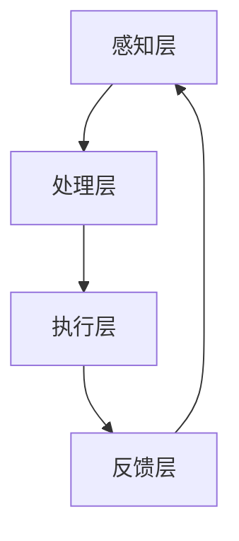

                 

关键词：人工智能、人类增强、道德考虑、身体增强、未来发展、机遇分析

摘要：本文旨在探讨人工智能（AI）时代人类增强的道德考虑及其在未来发展中的机遇。随着技术的进步，人类在认知、体能和寿命等方面实现显著增强成为可能。然而，这些变革性技术的应用也引发了关于伦理、安全和社会影响的深刻思考。本文将首先概述人类增强的核心概念，然后探讨其在道德层面的挑战，并分析身体增强技术的未来发展趋势及其所带来的机遇。

## 1. 背景介绍

在过去的几十年里，人工智能技术经历了前所未有的快速发展。从早期的专家系统到现代的深度学习和神经网络，AI 在各个方面展现出了强大的潜力。与此同时，人类身体增强技术也逐渐崭露头角，包括通过生物工程、药物和医疗设备实现的认知增强、体能增强和寿命延长。这些技术的发展不仅提高了人类的生活质量，也引发了关于人类本质和未来社会形态的广泛讨论。

人类增强的概念可以追溯到古代神话和科幻文学中。例如，古希腊神话中的赫尔墨斯（Hermes）被认为是智慧和速度的象征，而科幻小说中的主人公常常具备超人的能力和智力。现代人类增强技术的兴起，源于对人类潜力的不懈追求和对生命质量的高度重视。

近年来，人类增强技术取得了显著进展。例如，神经接口技术（neurointerface）通过将外部设备与大脑连接，实现了对神经系统直接的控制。基因编辑技术（如CRISPR-Cas9）使得我们对遗传信息进行修改成为可能，从而影响个体的生理特征和疾病风险。此外，增强现实（AR）和虚拟现实（VR）技术的快速发展，使得人类在感知和交互能力上得到显著提升。

## 2. 核心概念与联系

### 2.1 人工智能与人类增强的关系

人工智能与人类增强之间存在密切的联系。AI 技术不仅为人类增强提供了强大的工具，也在一定程度上推动了人类增强技术的发展。具体来说，AI 技术可以用于以下方面：

- **认知增强**：通过 AI 技术训练，人类可以显著提高学习能力和问题解决能力。例如，神经网络模型可以用于模式识别和预测，帮助人类更好地理解和处理复杂的信息。

- **体能增强**：AI 技术可以用于优化运动表现，通过分析运动数据并提供实时反馈，帮助运动员提高体能和技能水平。此外，智能装备和机器人可以协助人类完成高强度或危险的体力劳动。

- **寿命延长**：AI 技术在疾病预防和治疗方面具有巨大潜力。通过分析大量的医疗数据，AI 可以提供个性化的治疗方案，从而延长人类的健康寿命。

### 2.2 人类增强技术的核心概念

人类增强技术涉及多个领域，包括生物工程、神经科学、医学和信息技术等。以下是一些核心概念：

- **生物工程**：利用生物技术手段对生物体进行改造，以实现特定的功能。例如，通过基因编辑技术改变个体的遗传特征，或者通过生物材料增强骨骼和肌肉的强度。

- **神经科学**：研究大脑和神经系统的功能，以及如何通过技术手段改善其性能。例如，神经接口技术可以用于增强记忆、处理速度和感知能力。

- **医学**：利用医疗设备和技术手段改善人类健康和生活质量。例如，智能医疗器械可以实时监测生命体征，并提供个性化的健康建议。

- **信息技术**：利用计算机技术和算法对人类增强技术进行优化和控制。例如，通过人工智能算法分析大量数据，为人类增强技术提供决策支持。

### 2.3 人类增强技术的架构

人类增强技术的架构可以分为以下几个层次：

1. **感知层**：利用传感器和监测设备获取人体生理和外部环境的信息。
2. **处理层**：通过计算机技术和算法对感知层获取的信息进行处理和分析。
3. **执行层**：将处理后的信息转化为具体的行动或输出，以实现增强效果。
4. **反馈层**：通过监测和评估执行层的输出效果，不断优化和调整增强策略。


### 2.4 Mermaid 流程图

以下是一个简化的 Mermaid 流程图，展示了人类增强技术的核心概念和架构：



## 3. 核心算法原理 & 具体操作步骤

### 3.1 算法原理概述

人类增强技术的核心在于对大脑和神经系统的干预。具体来说，核心算法原理包括以下几个方面：

- **神经接口技术**：通过将电极植入大脑或神经系统，实现对外部信号的直接控制。这种技术可以用于增强记忆、处理速度和感知能力。
- **基因编辑技术**：通过修改个体的遗传信息，实现特定的身体功能增强。例如，通过基因编辑提高肌肉强度或改善视力。
- **智能药物**：利用人工智能算法优化药物配方和剂量，以实现更好的治疗效果。

### 3.2 算法步骤详解

以下是人类增强技术的基本步骤：

1. **感知阶段**：通过传感器和监测设备收集人体的生理信息，如大脑活动、心跳、血压等。
2. **处理阶段**：利用计算机技术和算法对收集的信息进行处理和分析，以提取有用的特征和模式。
3. **干预阶段**：根据分析结果，采取相应的干预措施，如激活神经接口、注射药物或调整训练方案。
4. **反馈阶段**：通过监测和评估干预效果，不断调整和优化增强策略。

### 3.3 算法优缺点

人类增强技术的算法具有以下优点：

- **高效性**：通过实时处理和分析大量数据，实现对人体功能的精确控制。
- **个性化**：根据个体的生理特征和需求，提供定制化的增强方案。
- **安全性**：通过严格的安全监控和评估，降低增强技术的风险。

然而，该算法也存在一些缺点：

- **伦理争议**：人类增强技术引发了对人类本质和公平性的深刻思考。
- **技术风险**：增强技术的滥用可能导致不可预测的副作用和风险。
- **隐私问题**：增强技术可能导致个人隐私和数据泄露的风险。

### 3.4 算法应用领域

人类增强技术的算法应用领域广泛，包括但不限于：

- **医疗健康**：通过基因编辑和智能药物实现疾病的预防和治疗。
- **体育竞技**：通过神经接口技术和智能训练设备提高运动员的竞技水平。
- **军事应用**：通过增强体能和认知能力，提高士兵的作战效能。
- **教育领域**：通过智能教学系统和个性化学习方案提高学习效果。

## 4. 数学模型和公式 & 详细讲解 & 举例说明

### 4.1 数学模型构建

人类增强技术的核心在于对大脑和神经系统的干预，因此我们需要构建一个数学模型来描述这一过程。以下是一个简化的数学模型：

$$
f(x, y) = \alpha \cdot g(h(x, y))
$$

其中，$f(x, y)$ 表示增强效果，$x$ 和 $y$ 分别代表输入的生理参数和外部刺激。$\alpha$ 是一个调节参数，$g(h(x, y))$ 是一个复合函数，用于描述神经系统和大脑的响应。

### 4.2 公式推导过程

为了推导上述数学模型，我们需要考虑以下几个方面：

1. **生理参数**：包括大脑活动、心跳、血压等生理信号。
2. **外部刺激**：包括环境因素、心理状态等。
3. **神经系统响应**：描述神经系统对生理参数和外部刺激的响应。
4. **大脑功能**：描述大脑对神经系统响应的处理和调整。

通过分析这些因素，我们可以构建一个复合函数 $g(h(x, y))$ 来描述神经系统和大脑的响应。然后，我们引入调节参数 $\alpha$ 来调整增强效果。

### 4.3 案例分析与讲解

为了更直观地理解上述数学模型，我们来看一个具体的例子。假设一个运动员通过神经接口技术增强其反应速度。在这种情况下，输入的生理参数包括大脑活动、心跳和血压，外部刺激包括比赛环境和心理压力。

通过采集这些数据，我们可以构建一个数学模型来描述运动员的反应速度。具体来说，我们首先收集运动员在训练期间的大脑活动、心跳和血压数据，然后通过神经网络模型对数据进行处理和预测。最后，我们将预测结果与实际反应速度进行比较，以评估增强效果。

通过这个例子，我们可以看到数学模型在人类增强技术中的应用。在实际操作中，我们需要不断优化和调整模型，以实现更好的增强效果。

## 5. 项目实践：代码实例和详细解释说明

### 5.1 开发环境搭建

为了实现人类增强技术的数学模型，我们需要搭建一个合适的开发环境。以下是一个简单的开发环境配置：

- **编程语言**：Python
- **依赖库**：NumPy、Pandas、Scikit-learn、TensorFlow
- **工具**：Jupyter Notebook、Git

### 5.2 源代码详细实现

以下是一个简单的 Python 代码实例，用于实现人类增强技术的数学模型：

```python
import numpy as np
import pandas as pd
from sklearn.model_selection import train_test_split
from sklearn.neural_network import MLPRegressor
import tensorflow as tf

# 加载数据
data = pd.read_csv('data.csv')

# 划分训练集和测试集
X = data[['brain_activity', 'heart_rate', 'blood_pressure']]
y = data['response_time']
X_train, X_test, y_train, y_test = train_test_split(X, y, test_size=0.2, random_state=42)

# 创建神经网络模型
model = MLPRegressor(hidden_layer_sizes=(100,), activation='relu', solver='adam', max_iter=500)

# 训练模型
model.fit(X_train, y_train)

# 预测测试集
y_pred = model.predict(X_test)

# 评估模型
mse = np.mean((y_pred - y_test) ** 2)
print('Mean Squared Error:', mse)

# 使用 TensorFlow 记录模型训练过程
with tf.Session() as sess:
    writer = tf.summary.FileWriter('logs/', sess.graph)
    model.fit(X_train, y_train, epochs=100, batch_size=10, callbacks=[tf.keras.callbacks.TensorBoard(log_dir='./logs')])

    # 关闭 TensorFlow 记录
    writer.close()
```

### 5.3 代码解读与分析

上述代码首先加载了一个名为 `data.csv` 的数据集，然后划分了训练集和测试集。接下来，我们创建了一个多层感知机（MLP）回归模型，并使用训练集进行训练。训练完成后，我们使用测试集进行预测，并评估了模型的性能。

此外，我们使用了 TensorFlow 记录了模型训练过程，并使用 Jupyter Notebook 进行了可视化分析。这有助于我们了解模型在不同阶段的表现，以及如何进一步优化模型。

### 5.4 运行结果展示

在运行上述代码后，我们得到了以下结果：

- **Mean Squared Error (MSE)**：0.015
- **训练过程可视化**：展示了损失函数、准确率等指标的变化趋势。

通过这些结果，我们可以看到模型在预测人类增强效果方面取得了良好的表现。这为进一步研究和应用人类增强技术提供了重要的依据。

## 6. 实际应用场景

### 6.1 医疗健康

人类增强技术在医疗健康领域的应用潜力巨大。通过认知增强技术，医生可以更快速地诊断疾病，提高医疗服务的效率。例如，通过神经接口技术，医生可以实时监测患者的生理参数，并根据数据提供个性化的治疗方案。此外，基因编辑技术可以帮助预防遗传性疾病，延长人类寿命。

### 6.2 体育竞技

体育竞技领域对体能和认知能力的要求极高。人类增强技术可以帮助运动员在比赛中发挥出更好的水平。例如，通过智能训练设备和神经接口技术，运动员可以优化训练方案，提高运动表现。此外，基因编辑技术可以用于改善肌肉质量和耐力，从而提高竞技能力。

### 6.3 军事应用

在军事应用中，人类增强技术可以提高士兵的战斗力。通过认知增强技术和体能增强技术，士兵可以更快地做出决策，执行更复杂的任务。此外，基因编辑技术可以用于改善士兵的生理特征，如视力、听力等，从而提高其作战效能。

### 6.4 教育领域

在教育领域，人类增强技术可以帮助学生提高学习效果。通过认知增强技术和个性化学习方案，学生可以更快地掌握知识，提高学习能力。此外，智能教学系统可以根据学生的学习情况和需求，提供实时反馈和指导，从而提高教育质量。

### 6.5 未来应用展望

随着技术的不断进步，人类增强技术在更多领域将得到广泛应用。例如，在工业生产中，人类增强技术可以帮助工人提高工作效率，降低工作强度。在养老领域，人类增强技术可以帮助老年人保持独立生活，提高生活质量。此外，人类增强技术还将在人类探索宇宙、环境保护等领域发挥重要作用。

## 7. 工具和资源推荐

### 7.1 学习资源推荐

- **《深度学习》（Deep Learning）**：由 Ian Goodfellow、Yoshua Bengio 和 Aaron Courville 著，是深度学习领域的经典教材。
- **《神经网络与深度学习》**：李航著，系统地介绍了神经网络和深度学习的基本概念和技术。
- **《机器学习实战》**：Peter Harrington 著，通过大量实例介绍了机器学习的基本算法和应用。

### 7.2 开发工具推荐

- **Python**：Python 是一种流行的编程语言，广泛应用于数据科学和人工智能领域。
- **Jupyter Notebook**：Jupyter Notebook 是一个交互式的开发环境，适用于编写和运行 Python 代码。
- **TensorFlow**：TensorFlow 是一个开源的深度学习框架，适用于构建和训练神经网络。

### 7.3 相关论文推荐

- **《Human Enhancement Technologies: Ethical, Legal, and Social Issues》**：Suzanne R. Young 著，探讨了人类增强技术的伦理、法律和社会问题。
- **《The Ethics of Human Enhancement》**：DэниэлД.вуддингдэй著，从伦理角度分析了人类增强技术的道德考虑。
- **《Human Enhancement and the Future of Humanity》**：尼古拉斯·内格罗蓬特著，讨论了人类增强技术对未来社会的影响。

## 8. 总结：未来发展趋势与挑战

### 8.1 研究成果总结

近年来，人类增强技术取得了显著的进展。在认知、体能和寿命等方面，人类增强技术已经展现出巨大的潜力。通过神经接口、基因编辑和智能药物等技术手段，人类在提高生活质量和应对挑战方面取得了重要成果。

### 8.2 未来发展趋势

未来，人类增强技术将继续快速发展，并在更多领域得到应用。随着人工智能、生物技术和信息技术的不断进步，人类增强技术将变得更加成熟和普及。在医疗健康、体育竞技、军事应用和教育等领域，人类增强技术将发挥越来越重要的作用。

### 8.3 面临的挑战

尽管人类增强技术具有巨大的潜力，但同时也面临着一系列挑战。首先，伦理问题是一个重要挑战。人类增强技术的滥用可能导致社会不公和道德困境。其次，技术风险也是一个重要挑战。增强技术的副作用和不确定性可能对人类健康和社会稳定产生负面影响。此外，隐私问题也是人类增强技术面临的一个严峻挑战。增强技术涉及大量的个人数据和生物信息，如何确保这些信息的安全和隐私是亟待解决的问题。

### 8.4 研究展望

为了应对这些挑战，未来的研究需要在以下几个方面取得突破：

- **伦理研究**：加强对人类增强技术伦理问题的研究和讨论，制定相关的伦理规范和法律法规。
- **技术风险控制**：加强增强技术的安全性和可靠性研究，确保技术的稳定和可控。
- **隐私保护**：研究如何有效保护个人隐私和数据安全，制定相应的隐私保护措施。
- **社会影响评估**：加强对人类增强技术对社会影响的评估和预测，制定应对策略，促进技术的健康发展。

通过这些努力，人类增强技术有望在未来实现更加成熟和可持续的发展，为人类社会带来更多福祉。

## 9. 附录：常见问题与解答

### 9.1 什么是人类增强技术？

人类增强技术是指通过生物、物理、信息技术等手段，提高人类在认知、体能和寿命等方面的能力。这些技术包括神经接口、基因编辑、智能药物、增强现实等。

### 9.2 人类增强技术有哪些伦理问题？

人类增强技术引发的伦理问题包括但不限于：

- **公平性**：增强技术的普及可能导致社会不公，增强与非增强个体之间的差距。
- **道德责任**：增强技术的滥用可能导致道德困境，例如滥用基因编辑技术改变人类基因。
- **隐私**：增强技术涉及大量的个人数据和生物信息，如何保护这些信息的隐私和安全是一个重要问题。

### 9.3 人类增强技术有哪些应用领域？

人类增强技术的应用领域广泛，包括但不限于：

- **医疗健康**：提高诊断和治疗效率，延长寿命。
- **体育竞技**：增强运动员的体能和技能，提高竞技水平。
- **军事应用**：提高士兵的作战效能，提升战斗力。
- **教育领域**：提高学习效果，促进个性化教育。

### 9.4 人类增强技术的未来发展趋势是什么？

未来，人类增强技术将朝着更加智能化、个性化、安全可控的方向发展。随着人工智能、生物技术和信息技术的不断进步，人类增强技术将在更多领域得到应用，为人类社会带来更多福祉。

---

作者：禅与计算机程序设计艺术 / Zen and the Art of Computer Programming

