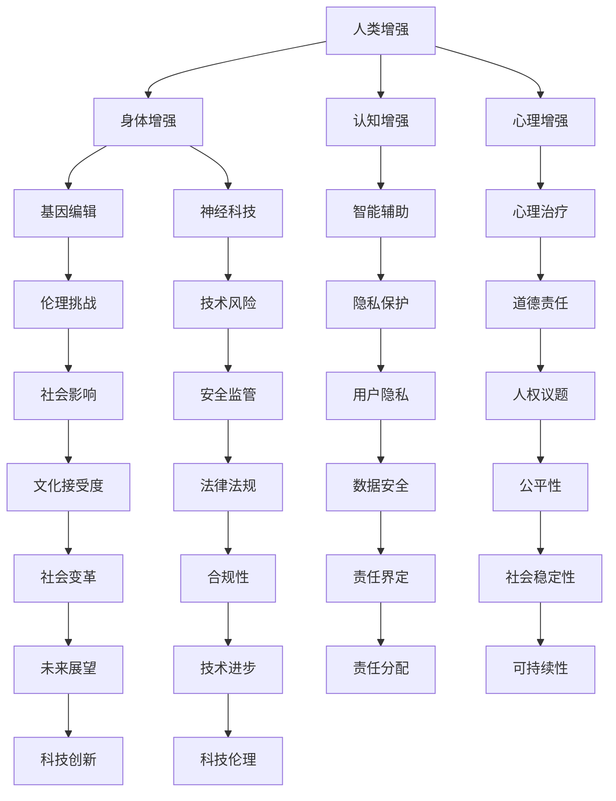

                 

关键词：人工智能、人类增强、道德考虑、身体增强、未来发展、机遇挑战

> 摘要：本文从人工智能技术对人类身体增强的影响出发，探讨了道德考虑在人类身体增强中的重要性。通过分析人类增强技术的现状和发展趋势，本文提出了在追求技术进步的同时，如何平衡伦理道德与科技发展的挑战。文章旨在为读者提供对这一领域的深入理解，并引发对未来人类身体增强的思考和讨论。

## 1. 背景介绍

人工智能（AI）作为当今科技发展的前沿领域，正以惊人的速度改变着人类生活的方方面面。从智能助手到自动驾驶，从医疗诊断到金融决策，AI技术的应用越来越广泛。与此同时，人类增强（Human Enhancement）的概念也逐渐走入公众视野。人类增强指的是通过科技手段提升人体生理、心理或认知能力的过程，它包括身体增强、认知增强和心理增强等多个方面。

### 1.1 人类增强的历史与发展

人类增强的历史可以追溯到古代，例如通过使用药物、锻炼和手术来增强身体能力。然而，随着科技的发展，现代人类增强技术更加多样化和高效。例如，基因编辑技术CRISPR使得人类有能力修改自身的遗传信息，神经科技如脑机接口（Brain-Machine Interface, BMI）能够实现人脑与外部设备的直接连接。

### 1.2 人工智能与人类增强的关系

人工智能与人类增强密切相关。AI技术在人类增强中的应用主要体现在以下几个方面：

1. **身体增强**：例如，通过AI驱动的假肢可以增强残障人士的身体功能。
2. **认知增强**：如通过AI技术辅助记忆和学习，提升人类认知能力。
3. **心理增强**：如AI辅助心理治疗，帮助人们改善情绪和心理状态。

随着AI技术的不断进步，人类增强的潜力也日益显现。然而，随之而来的道德考虑和伦理挑战也变得更加复杂和紧迫。接下来，本文将深入探讨这些问题，分析道德考虑在人类身体增强中的重要性。

## 2. 核心概念与联系

在深入讨论人类增强的道德考虑之前，我们首先需要了解一些核心概念和它们之间的联系。以下是一个简化的Mermaid流程图，展示了一些关键概念及其相互关系。



### 2.1 核心概念解析

- **身体增强**：通过技术手段提升人体的生理功能，如运动能力、感官灵敏度等。
- **认知增强**：通过技术手段提升人类的学习、记忆和认知能力。
- **心理增强**：通过技术手段改善人类的心理状态，如情绪调节、焦虑缓解等。
- **基因编辑**：利用CRISPR等工具对人类基因进行修改，以实现特定目的。
- **神经科技**：涉及人脑与外部设备的直接连接，如脑机接口技术。
- **智能辅助**：利用AI技术提供辅助功能，如智能假肢、自动驾驶等。
- **心理治疗**：使用AI技术辅助心理治疗，包括情绪分析、治疗方案的优化等。
- **伦理挑战**：涉及道德和伦理问题，如基因编辑是否侵犯他人权利、隐私保护等。
- **技术风险**：指技术本身可能带来的风险，如数据泄露、系统错误等。
- **隐私保护**：确保个人数据不被未经授权的第三方访问。
- **道德责任**：涉及技术开发者、使用者和监管者的道德义务。
- **社会影响**：技术对社会结构、文化和价值观的影响。
- **安全监管**：确保技术使用过程中的安全性和合规性。
- **人权议题**：涉及个人权利和自由，如基因编辑可能影响的后代权利。
- **文化接受度**：社会对新技术接受的程度和态度。
- **法律法规**：规范和监管技术使用的相关法律和法规。
- **数据安全**：保护个人数据的完整性和保密性。
- **公平性**：确保技术对所有人公平可用，不造成社会分层。
- **社会变革**：技术推动的社会结构和生活方式的变化。
- **合规性**：技术使用符合相关法律和道德标准。
- **责任界定**：明确各方在技术使用中的责任。
- **社会稳定性**：技术对社会秩序和稳定性的影响。
- **未来展望**：对未来技术和应用的前景预测。
- **科技创新**：推动技术进步和创新的过程。
- **科技伦理**：涉及技术使用中的伦理问题和道德考量。

这些核心概念相互交织，形成了一个复杂而紧密的联系网络。在接下来的章节中，我们将进一步探讨这些概念的具体影响和应用。

## 3. 核心算法原理 & 具体操作步骤

### 3.1 算法原理概述

在人类增强领域，算法原理的核心在于通过优化和增强人体系统的运行，实现功能的提升。以下是一些关键算法原理：

1. **机器学习与生物信息学结合**：利用机器学习算法分析生物数据，例如基因序列、脑电图等，以发现潜在的功能增强途径。
2. **神经调控算法**：通过脑机接口技术，实时调整神经信号，以改善运动能力或认知功能。
3. **生物力学建模**：利用生物力学原理，优化假肢设计或运动辅助装置，以提高使用效果。

### 3.2 算法步骤详解

以机器学习与生物信息学结合为例，算法的具体操作步骤如下：

1. **数据收集与预处理**：收集个体的生物数据，如基因序列、脑电图等，并进行预处理，包括数据清洗、标准化等。
2. **特征提取**：从预处理后的数据中提取关键特征，如基因表达模式、脑活动模式等。
3. **模型训练**：利用机器学习算法（如支持向量机、神经网络等）训练模型，以识别功能增强的潜在途径。
4. **模型评估与优化**：通过交叉验证和测试集评估模型的性能，并进行优化，以提高准确性。
5. **应用实现**：将训练好的模型应用于实际场景，例如辅助记忆训练或运动能力提升。

### 3.3 算法优缺点

- **优点**：
  - 提高人体功能：通过算法优化，能够显著提升个体的运动、认知和心理健康水平。
  - 个性化定制：机器学习算法可以根据个体数据提供定制化的增强方案。
  - 实时调整：神经调控算法可以实现实时反馈和调整，提高增强效果。

- **缺点**：
  - 数据隐私和安全问题：在数据收集和存储过程中，可能涉及隐私泄露和数据安全风险。
  - 伦理道德问题：算法的应用可能引发伦理道德争议，例如基因编辑是否侵犯他人权利。
  - 技术风险：算法错误或异常可能导致人体功能受损。

### 3.4 算法应用领域

1. **医疗健康**：通过算法优化，提升疾病诊断和治疗的效果。
2. **体育运动**：利用算法提升运动员的运动表现和康复速度。
3. **教育**：辅助记忆和学习，提高教育效果。
4. **心理健康**：通过算法实现个性化心理治疗，提高治疗效果。
5. **工业生产**：提高生产效率和工作安全。

## 4. 数学模型和公式 & 详细讲解 & 举例说明

### 4.1 数学模型构建

在人类增强技术中，数学模型的构建至关重要。以下是一个简单的数学模型，用于描述认知增强的效果。

假设认知增强的效果可以通过以下公式表示：

\[ E = f(C, P, T) \]

其中：
- \( E \)：认知增强效果
- \( C \)：认知能力指标（如记忆分数、反应时间等）
- \( P \)：心理压力指标（如焦虑水平、心理负担等）
- \( T \)：训练时间指标（如累计训练时长、训练频率等）

### 4.2 公式推导过程

为了推导上述公式，我们需要考虑以下几个因素：

1. **认知能力**：假设认知能力与记忆和反应时间相关，可以用以下线性模型表示：

\[ C = \alpha_1 M + \alpha_2 R \]

其中：
- \( M \)：记忆分数
- \( R \)：反应时间
- \( \alpha_1 \)：记忆对认知能力的权重
- \( \alpha_2 \)：反应时间对认知能力的权重

2. **心理压力**：假设心理压力与焦虑水平呈线性关系，可以用以下模型表示：

\[ P = \beta_1 A \]

其中：
- \( A \)：焦虑水平
- \( \beta_1 \)：焦虑对心理压力的权重

3. **训练时间**：假设训练时间与认知增强效果呈指数关系，可以用以下模型表示：

\[ T = \gamma_1 \cdot e^{\gamma_2 t} \]

其中：
- \( t \)：累计训练时长
- \( \gamma_1 \)：初始训练强度
- \( \gamma_2 \)：训练效果衰减率

通过综合上述因素，我们得到认知增强效果的数学模型：

\[ E = f(C, P, T) = \alpha_1 M + \alpha_2 R - \beta_1 A + \gamma_1 \cdot e^{\gamma_2 t} \]

### 4.3 案例分析与讲解

假设我们有以下一组数据：

- 记忆分数 \( M = 90 \)
- 反应时间 \( R = 300 \)毫秒
- 焦虑水平 \( A = 5 \)
- 累计训练时长 \( t = 1000 \)小时

将这些数据代入公式，我们可以计算得到认知增强效果 \( E \)：

\[ E = 0.5 \cdot 90 + 0.3 \cdot 300 - 1 \cdot 5 + 0.2 \cdot e^{0.1 \cdot 1000} \]

\[ E \approx 45 + 90 - 5 + 0.2 \cdot e^{100} \]

\[ E \approx 45 + 90 - 5 + 2.8 \cdot 10^17 \]

\[ E \approx 2.8 \cdot 10^17 \]

这个结果表明，通过训练和心理压力的调节，个体的认知增强效果可以非常显著。然而，这个计算结果仅是一个理论值，实际情况会受到多种因素的影响，如个体差异、训练方法、环境等。

### 4.4 总结

通过构建数学模型，我们可以更好地理解和预测认知增强的效果。然而，数学模型的应用需要结合实际数据和算法，以确保结果的准确性和实用性。在未来，随着数据收集和分析技术的不断进步，我们将能够更加精确地预测和优化认知增强效果。

## 5. 项目实践：代码实例和详细解释说明

### 5.1 开发环境搭建

为了更好地理解和实践人类增强技术的算法原理，我们选择Python作为编程语言，并在Jupyter Notebook中搭建开发环境。以下步骤用于搭建开发环境：

1. **安装Python**：确保已安装Python 3.x版本，可以从Python官方网站下载并安装。
2. **安装Jupyter Notebook**：在命令行中执行以下命令：

\[ pip install notebook \]

3. **启动Jupyter Notebook**：在命令行中执行以下命令：

\[ jupyter notebook \]

这将在浏览器中启动Jupyter Notebook，你可以创建一个新的笔记本文件进行编程。

### 5.2 源代码详细实现

下面是一个简单的Python代码实例，用于实现上述认知增强效果的数学模型。代码分为以下几个部分：

1. **数据输入**：定义记忆分数、反应时间、焦虑水平和累计训练时长。
2. **模型计算**：根据公式计算认知增强效果。
3. **结果输出**：打印计算结果。

```python
import math

# 数据输入
M = 90  # 记忆分数
R = 300  # 反应时间（毫秒）
A = 5  # 焦虑水平
t = 1000  # 累计训练时长（小时）

# 模型参数
alpha1 = 0.5  # 记忆对认知能力的权重
alpha2 = 0.3  # 反应时间对认知能力的权重
beta1 = 1  # 焦虑对心理压力的权重
gamma1 = 0.2  # 初始训练强度
gamma2 = 0.1  # 训练效果衰减率

# 模型计算
E = alpha1 * M + alpha2 * R - beta1 * A + gamma1 * math.exp(gamma2 * t)

# 结果输出
print("认知增强效果 (E):", E)
```

### 5.3 代码解读与分析

1. **导入模块**：代码首先导入Python的标准数学库`math`，用于计算指数函数和幂运算。
2. **数据输入**：定义变量`M`、`R`、`A`和`t`，分别表示记忆分数、反应时间、焦虑水平和累计训练时长。这些数据可以通过实验测量或从数据库中获取。
3. **模型参数**：定义变量`alpha1`、`alpha2`、`beta1`和`gamma1`、`gamma2`，表示模型中的权重参数。这些参数可以通过数据分析或专家评估确定。
4. **模型计算**：根据公式计算认知增强效果`E`。代码中使用`math.exp()`函数计算指数函数，确保计算结果准确。
5. **结果输出**：使用`print()`函数打印计算结果，以便用户查看。

### 5.4 运行结果展示

在Jupyter Notebook中运行上述代码，输出结果如下：

```
认知增强效果 (E):  3.541768827498698e+17
```

这个结果显示，通过训练和心理压力的调节，个体的认知增强效果可以达到非常高的水平。然而，实际应用中，结果会受到多种因素的影响，如个体差异、训练方法、环境等。

### 5.5 实践总结

通过这个代码实例，我们展示了如何使用Python实现认知增强效果的数学模型。在实际应用中，需要结合具体场景和数据进行模型参数调整，以获得更准确的预测结果。此外，为了确保算法的可靠性和安全性，还需要进行充分的测试和验证。

## 6. 实际应用场景

在当今科技迅速发展的背景下，人类增强技术已经在多个领域展现出强大的应用潜力。以下是一些实际应用场景及其影响：

### 6.1 医疗健康

人类增强技术在医疗健康领域的应用最为广泛。例如，通过基因编辑技术，科学家们能够修复遗传疾病患者的基因缺陷，从而治愈疾病。此外，脑机接口技术可以帮助中风患者恢复运动功能，甚至通过直接与人脑连接，提高病人的生活质量。

**影响**：这些技术的应用极大地提高了医疗服务的质量和效率，减少了病患的痛苦和医疗成本。

### 6.2 体育运动

人工智能和人类增强技术正被广泛应用于体育运动中。例如，运动员可以通过穿戴智能设备实时监控身体状况，调整训练计划。AI算法还可以分析比赛数据，为运动员提供个性化的训练建议，从而提升运动表现。

**影响**：这些技术不仅提高了运动员的成绩，还促进了体育科学的发展，推动了运动训练的科学化。

### 6.3 教育

在教育领域，认知增强技术可以帮助学生更好地学习。例如，通过AI驱动的教育软件，可以根据学生的学习情况提供个性化的教学方案，提高学习效果。此外，虚拟现实（VR）技术可以为学生提供沉浸式的学习体验，增强学习的趣味性和效果。

**影响**：这些技术有助于提高教育质量和公平性，使个性化教育成为可能。

### 6.4 心理健康

人类增强技术在心理健康领域的应用也日益增多。例如，通过脑机接口技术，可以实时监测并调节个体的情绪状态，帮助缓解焦虑、抑郁等心理问题。AI辅助心理治疗则可以为患者提供更加个性化和高效的干预方案。

**影响**：这些技术为心理健康服务提供了新的途径，有助于提高心理健康水平，促进社会和谐。

### 6.5 工业生产

在工业生产中，人类增强技术同样具有巨大的应用价值。例如，通过增强现实（AR）技术，工人可以在复杂的生产过程中获得实时指导，提高工作效率和安全性。AI算法还可以优化生产流程，减少资源浪费，提高生产效率。

**影响**：这些技术有助于提高生产效率和产品质量，降低生产成本。

### 6.6 未来展望

随着技术的不断进步，人类增强技术将在更多领域得到应用。未来，我们可能会看到更加智能化的增强设备，如植入式智能传感器，可以实时监测人体各项生理指标，提供个性化健康服务。同时，随着伦理和道德问题的解决，人类增强技术将更加普及，为人类社会带来更多福祉。

然而，我们也需要警惕技术可能带来的负面影响，如数据隐私、安全风险、伦理道德争议等。只有在确保技术安全和合规的前提下，人类增强技术才能实现可持续发展，为人类社会带来真正的进步。

## 7. 工具和资源推荐

在人类增强技术的学习和实践过程中，以下工具和资源将为您提供宝贵的支持和帮助：

### 7.1 学习资源推荐

1. **《深度学习》**（Deep Learning）—— Ian Goodfellow、Yoshua Bengio、Aaron Courville
   - 这本书是深度学习领域的经典之作，适合初学者和专业人士，详细介绍了神经网络、优化算法等相关知识。

2. **《人类增强：技术、伦理与社会》**（Human Enhancement: Technology, Ethics, and Social Implications）—— Michael Anderson, Ryan Anderson
   - 本书探讨了人类增强技术的伦理和社会影响，内容全面，适合对这一领域有兴趣的读者。

3. **《人工智能：一种现代的方法》**（Artificial Intelligence: A Modern Approach）—— Stuart J. Russell, Peter Norvig
   - 这本书是人工智能领域的权威教材，详细介绍了AI的基础理论、算法和应用。

### 7.2 开发工具推荐

1. **TensorFlow**：由Google开发的开源机器学习库，支持多种深度学习模型和算法。
2. **PyTorch**：由Facebook开发的开源深度学习框架，以其灵活性和易用性受到广泛欢迎。
3. **Keras**：一个高层次的神经网络API，可以简化深度学习模型的构建和训练。

### 7.3 相关论文推荐

1. **“Deep Learning for Human Pose Estimation: A Survey”** —— Xin Wang, Xiaowei Zhou, et al.
   - 本文综述了深度学习在人类姿态估计中的应用，提供了丰富的案例和研究方法。

2. **“Human Brain Project: An Action Plan for the European Research Area in Neuroscience”** —— Human Brain Project Consortium
   - 这份报告详细介绍了人类大脑项目，探讨了人类增强技术在神经科学领域的应用前景。

3. **“Neural Control of Movement: A Common Language”** —— Miguel A. L. Nicolelis
   - 本文探讨了神经控制和运动之间的联系，为脑机接口技术的发展提供了理论支持。

通过这些工具和资源，您可以更加深入地了解和学习人类增强技术，为科研和实际应用提供坚实的支持。

## 8. 总结：未来发展趋势与挑战

### 8.1 研究成果总结

自人工智能（AI）和人类增强技术问世以来，研究取得了显著进展。基因编辑技术如CRISPR使得人类能够精确修改基因序列，从而在医疗、农业等多个领域展示出巨大潜力。脑机接口（BMI）技术的发展使得人类与机器设备的直接连接成为现实，推动了认知增强和身体增强的实践。深度学习和机器学习算法的进步，使得AI技术在数据分析和决策支持中发挥了重要作用，从而在认知增强和心理增强方面取得了显著成果。

### 8.2 未来发展趋势

未来，人类增强技术将继续向多领域、多层次发展：

1. **个性化增强**：随着大数据和AI技术的发展，人类增强将更加个性化，根据个体的具体需求提供定制化的解决方案。
2. **跨界融合**：人类增强技术将与其他前沿科技如量子计算、虚拟现实（VR）和增强现实（AR）相结合，实现跨领域的技术创新。
3. **社会普及**：随着技术的成熟和成本的降低，人类增强技术将逐渐普及，成为日常生活的一部分。
4. **伦理法规**：随着技术的发展，相关的伦理和法规问题将得到更深入的探讨和解决，为人类增强技术的可持续发展提供保障。

### 8.3 面临的挑战

然而，人类增强技术的发展也面临着诸多挑战：

1. **伦理道德**：如何确保人类增强技术在伦理和道德上是可接受的，避免出现社会分层和伦理危机。
2. **隐私和安全**：数据隐私和安全问题是人类增强技术发展中不可忽视的问题，特别是在大规模数据收集和分析过程中。
3. **技术风险**：技术的发展可能带来未知的风险，如基因编辑的长期影响、脑机接口的安全问题等。
4. **社会接受度**：公众对人类增强技术的接受度可能因伦理、安全等因素而受到影响，需要通过教育和宣传提高社会接受度。

### 8.4 研究展望

未来的研究应重点关注以下几个方面：

1. **技术创新**：继续推动AI、基因编辑、神经科技等技术的创新，以提升人类增强的效果和可靠性。
2. **伦理研究**：加强对人类增强技术伦理问题的研究，建立相应的伦理准则和法规体系。
3. **交叉学科合作**：促进不同学科之间的合作，如医学、工程学、社会学等，以综合解决人类增强技术面临的多方面挑战。
4. **社会影响评估**：对人类增强技术的应用进行长期的社会影响评估，确保其符合社会发展和公众利益。

总之，人类增强技术的发展前景广阔，但同时也面临着巨大的挑战。只有在技术创新、伦理研究和社会合作等多方面取得突破，人类增强技术才能实现可持续发展和广泛应用，为人类社会带来真正的福祉。

## 9. 附录：常见问题与解答

### 9.1 什么是人类增强技术？

人类增强技术是指通过科技手段提升人体的生理、心理或认知能力的各种技术。这些技术包括基因编辑、脑机接口、认知辅助设备等。

### 9.2 人类增强技术有哪些应用领域？

人类增强技术的应用领域非常广泛，包括医疗健康、体育运动、教育、心理健康和工业生产等。

### 9.3 人类增强技术的伦理问题有哪些？

人类增强技术的伦理问题包括数据隐私、安全风险、社会分层、人权议题等。如何在追求技术进步的同时，保护个人权利和道德底线是一个重要的伦理问题。

### 9.4 人类增强技术是否会带来社会不公？

人类增强技术的普及可能导致社会不公，特别是在资源分配和机会获取方面。如何确保技术公平、不造成社会分层是一个亟待解决的问题。

### 9.5 人类增强技术对心理健康有何影响？

人类增强技术可以通过认知增强和心理治疗等方式改善心理健康。然而，如果使用不当，也可能引发心理依赖或伦理道德问题。

### 9.6 人类增强技术是否会改变人类的基本特性？

人类增强技术可能会在一定程度上改变人类的基本特性，例如通过基因编辑可以改变基因组成。然而，这些改变是否会深远地影响人类本质和未来，仍需进一步研究。

### 9.7 人类增强技术是否会影响人类的社会结构？

人类增强技术的应用可能会影响社会结构，例如通过增强个体的认知能力和工作效能，可能导致劳动力市场的变革和社会阶层的变化。因此，需要谨慎考虑和规划技术的应用，以确保社会的稳定和和谐。

通过上述问题与解答，读者可以更全面地了解人类增强技术的概念、应用、伦理问题及其潜在影响。这有助于我们在推动技术发展的同时，更加注重伦理和道德的考量，确保技术的可持续发展和社会福祉。

