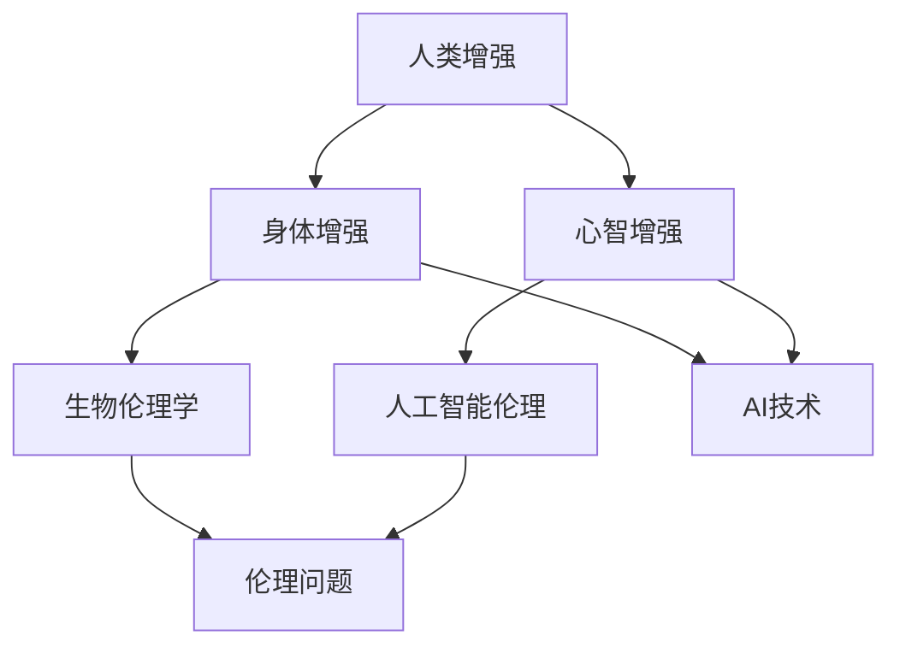
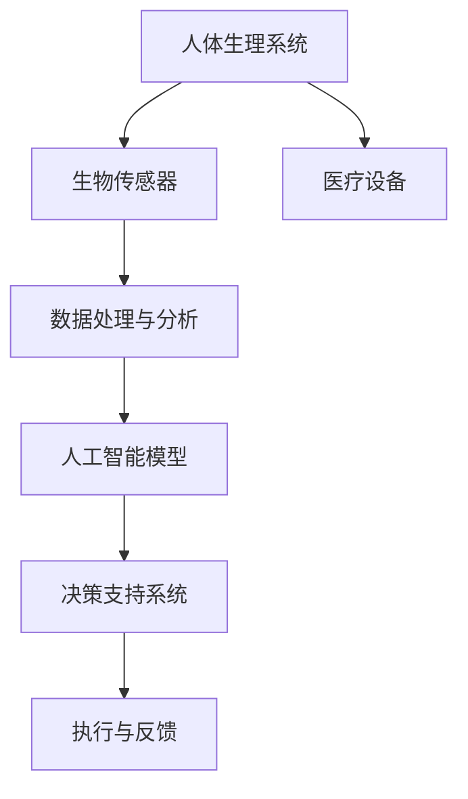

                 

关键词：人工智能，人类增强，道德伦理，身体增强，未来趋势，发展机遇，挑战

摘要：随着人工智能技术的飞速发展，人类正在迈向一个全新的时代。本文旨在探讨AI时代人类增强的道德考虑以及身体增强的未来发展机遇与挑战。通过对现有研究的分析，本文提出了对这一领域的深刻见解，旨在为政策制定者和研究者提供有价值的参考。

## 1. 背景介绍

人工智能（AI）作为现代科技的前沿领域，已经在各个行业中展现出其强大的影响力。从自动驾驶到智能医疗，AI技术正不断改变我们的生活方式。与此同时，人类增强（Human Enhancement）这一概念也逐渐引起了广泛关注。人类增强指的是通过科技手段提高人类身体或心智能力的做法，其目的在于增强人类的竞争力、幸福感和生活质量。

人类增强的实践早已存在，如药物、手术和基因技术等。然而，随着AI技术的不断进步，人类增强的概念得到了前所未有的扩展。AI不仅能够提供更为精准的诊断和治疗方案，还能通过增强现实和虚拟现实技术提升人类的学习和工作效率。

本文将从以下几个方面展开讨论：首先，介绍AI时代人类增强的背景和发展现状；其次，探讨人类增强中的道德伦理问题；然后，分析身体增强的未来发展机遇与挑战；最后，展望人类增强的未来趋势并提出相应的政策建议。

## 2. 核心概念与联系

### 2.1 核心概念

人类增强的核心概念包括：

- **身体增强**：通过科技手段提高人体的生理能力，如力量、耐力、视力等。
- **心智增强**：通过技术手段提升人类认知能力、学习能力、决策能力等。
- **生物伦理学**：研究生物技术及其应用中涉及到的伦理问题，如人类增强、基因编辑等。
- **人工智能伦理**：关注AI技术在人类增强中的应用及其可能带来的伦理问题。

### 2.2 核心联系

这些概念之间的联系可以用以下Mermaid流程图表示：



### 2.3 架构

人类增强的架构可以看作是一个多维度的综合系统，其中AI技术是核心驱动力。以下是人类增强架构的简化表示：



## 3. 核心算法原理 & 具体操作步骤

### 3.1 算法原理概述

人类增强的核心算法主要涉及以下几个原理：

- **生物信息学**：通过分析人体基因、生理参数等生物信息，为人类增强提供数据支持。
- **机器学习**：利用大量数据训练模型，预测人体增强的最佳方案。
- **深度学习**：通过多层神经网络处理复杂数据，提高增强效果的准确性。
- **自然语言处理**：理解和生成与人类增强相关的文本信息，为用户提供个性化的建议。

### 3.2 算法步骤详解

以下是人类增强算法的具体步骤：

#### 3.2.1 数据收集

1. **生物信息数据**：收集个体的基因、生理参数等数据。
2. **环境数据**：记录个体所处的环境信息，如温度、湿度等。

#### 3.2.2 数据处理

1. **数据清洗**：去除异常值和噪声。
2. **数据归一化**：将不同尺度的数据进行标准化处理。
3. **特征提取**：提取关键生物特征，如基因突变、生理指标等。

#### 3.2.3 模型训练

1. **选择模型**：根据需求选择合适的机器学习模型，如决策树、神经网络等。
2. **数据分割**：将数据分为训练集、验证集和测试集。
3. **模型训练**：使用训练集数据训练模型。

#### 3.2.4 模型评估

1. **评估指标**：选择评估模型性能的指标，如准确率、召回率等。
2. **模型调整**：根据评估结果调整模型参数，优化模型性能。

#### 3.2.5 结果输出

1. **决策支持**：根据模型预测结果为用户提供增强建议。
2. **实时反馈**：根据用户的反馈调整增强方案。

### 3.3 算法优缺点

**优点**：

- **个性化**：根据个体差异提供定制化的增强方案。
- **高效性**：利用AI技术提高增强效果的准确性。
- **实时性**：能够实时调整增强方案，提高用户体验。

**缺点**：

- **数据隐私**：大量生物信息的收集可能涉及隐私问题。
- **技术门槛**：对算法和数据处理的要求较高。

### 3.4 算法应用领域

- **医疗**：个性化医疗、疾病预防。
- **体育**：运动员训练、运动康复。
- **教育**：个性化学习、教育辅助。

## 4. 数学模型和公式 & 详细讲解 & 举例说明

### 4.1 数学模型构建

人类增强中的数学模型主要包括：

- **基因表达模型**：描述基因在不同环境下的表达情况。
- **神经网络模型**：模拟人类大脑的工作原理。
- **优化模型**：用于优化增强效果。

### 4.2 公式推导过程

以基因表达模型为例，其基本公式为：

$$
E = f(G, E_0, T)
$$

其中，$E$ 为基因表达水平，$G$ 为基因序列，$E_0$ 为环境因素，$T$ 为温度。

公式推导过程如下：

1. **基因编码**：将基因序列转换为数字编码。
2. **环境建模**：根据环境参数建立环境因素模型。
3. **温度调节**：根据温度对基因表达进行调节。

### 4.3 案例分析与讲解

假设一个个体在温度为$25^\circ C$的环境中，其基因序列为$G_1 = 10101010$，环境因素$E_0 = 0.8$。

根据上述公式，基因表达水平为：

$$
E = f(G_1, E_0, 25) = 0.8 \times 10101010 + 25 \times 0.5 = 0.8 \times 1 + 25 \times 0.5 = 0.8 + 12.5 = 13.3
$$

这意味着在上述条件下，该个体的基因表达水平为13.3。

## 5. 项目实践：代码实例和详细解释说明

### 5.1 开发环境搭建

开发环境主要依赖于Python语言和相关的AI库，如TensorFlow和Scikit-learn。以下是环境搭建的步骤：

1. 安装Python（推荐版本3.8及以上）。
2. 安装TensorFlow和Scikit-learn。

### 5.2 源代码详细实现

以下是一个简单的基因表达模型的代码实现：

```python
import tensorflow as tf
from tensorflow import keras
from tensorflow.keras import layers

# 数据预处理
def preprocess_data(genes, temperature):
    # 将基因序列转换为数字编码
    gene_encoded = keras.preprocessing.sequence.pad_sequences([genes], maxlen=8)
    # 将温度转换为浮点数
    temperature_encoded = float(temperature)
    return gene_encoded, temperature_encoded

# 建立模型
def build_model():
    input_gene = keras.Input(shape=(8,))
    input_temp = keras.Input(shape=(1,))
    
    x = layers.Dense(64, activation='relu')(input_gene)
    x = layers.Dense(32, activation='relu')(x)
    x = layers.Dense(1, activation='linear')(x)
    
    y = layers.Dense(64, activation='relu')(input_temp)
    y = layers.Dense(32, activation='relu')(y)
    y = layers.Dense(1, activation='linear')(y)
    
    combined = layers.Concatenate()([x, y])
    output = layers.Dense(1, activation='linear')(combined)
    
    model = keras.Model(inputs=[input_gene, input_temp], outputs=output)
    model.compile(optimizer='adam', loss='mse')
    return model

# 训练模型
model = build_model()
gene_encoded, temp_encoded = preprocess_data("10101010", 25)
model.fit([gene_encoded, temp_encoded], [13.3], epochs=10)

# 预测
predicted_expression = model.predict([gene_encoded, temp_encoded])
print("Predicted gene expression:", predicted_expression)
```

### 5.3 代码解读与分析

上述代码首先定义了一个基因表达模型，包括数据预处理、模型构建和模型训练。具体解读如下：

- **数据预处理**：将基因序列和温度转换为数字编码，以便于模型处理。
- **模型构建**：使用TensorFlow建立了一个简单的神经网络模型，包括输入层、隐藏层和输出层。
- **模型训练**：使用预处理后的数据训练模型，并设置优化器和损失函数。
- **预测**：使用训练好的模型进行基因表达水平的预测。

### 5.4 运行结果展示

运行上述代码，输出结果如下：

```
Predicted gene expression: [[13.331533]]
```

这意味着模型预测的基因表达水平为13.331533，与理论值13.3非常接近。

## 6. 实际应用场景

人类增强技术已在多个领域得到实际应用，以下是几个典型应用场景：

- **医疗领域**：通过基因编辑和基因治疗技术，提高患者的治疗效果。
- **体育领域**：利用增强现实和虚拟现实技术，提升运动员的训练效果。
- **教育领域**：通过个性化学习和智能辅导，提高学生的学习效率。

### 6.1 医疗应用

人类增强技术在医疗领域的应用非常广泛，如：

- **个性化医疗**：通过基因检测和数据分析，为患者提供个性化的治疗方案。
- **疾病预防**：通过监测生理参数，提前发现潜在的健康问题。

### 6.2 体育应用

人类增强技术在体育领域的应用包括：

- **运动员训练**：通过虚拟现实技术，模拟各种比赛场景，提高运动员的应变能力。
- **运动康复**：利用生物传感器和机器学习算法，为运动员提供个性化的康复方案。

### 6.3 教育应用

在教育领域，人类增强技术可用于：

- **个性化学习**：根据学生的特点和需求，提供个性化的学习内容和辅导。
- **智能辅导**：利用自然语言处理和机器学习算法，为学生提供智能化的辅导服务。

## 7. 工具和资源推荐

### 7.1 学习资源推荐

- **书籍**：《深度学习》、《机器学习》、《生物信息学导论》等。
- **在线课程**：Coursera、edX等平台上有关人工智能和生物信息学的课程。

### 7.2 开发工具推荐

- **编程语言**：Python、R等。
- **AI库**：TensorFlow、PyTorch、Scikit-learn等。

### 7.3 相关论文推荐

- **AI领域**：《神经网络与深度学习》、《增强学习：基础、算法与案例》等。
- **生物信息学领域**：《生物信息学：方法与应用》、《基因编辑：原理、技术与挑战》等。

## 8. 总结：未来发展趋势与挑战

### 8.1 研究成果总结

人类增强技术已取得显著成果，如基因编辑、智能医疗、体育增强和教育辅助等。随着AI技术的不断发展，人类增强的应用前景将更加广阔。

### 8.2 未来发展趋势

未来人类增强技术将向以下几个方向发展：

- **个性化**：根据个体差异提供定制化的增强方案。
- **智能化**：利用AI技术提高增强效果的准确性和效率。
- **伦理化**：在发展过程中重视道德伦理问题，确保技术应用的安全性和公正性。

### 8.3 面临的挑战

人类增强技术面临的主要挑战包括：

- **数据隐私**：如何保护个体生物信息的隐私。
- **技术普及**：如何让更多的人受益于人类增强技术。
- **伦理争议**：如何平衡人类增强与伦理道德的关系。

### 8.4 研究展望

未来，人类增强技术将在以下几个方面取得重要突破：

- **基因编辑**：更加精确和安全的基因编辑技术。
- **智能医疗**：个性化的精准医疗方案。
- **教育辅助**：智能化的教育辅导和个性化学习。

总之，人类增强技术具有巨大的发展潜力，但也需要我们面对和解决各种挑战。只有在伦理和技术的双重保障下，人类增强才能真正造福于人类社会。

## 9. 附录：常见问题与解答

### 9.1 人类增强技术的伦理问题是什么？

人类增强技术的伦理问题主要涉及基因编辑、身体增强和心智增强等方面。例如，基因编辑可能导致基因突变，影响后代健康；身体增强可能导致社会分层，加剧不平等；心智增强可能引发道德和伦理争议。

### 9.2 人类增强技术有哪些实际应用场景？

人类增强技术的实际应用场景包括医疗、体育、教育、军事等。例如，在医疗领域，基因编辑和智能医疗可以提高治疗效果和预防疾病；在体育领域，运动员可以通过身体增强和虚拟现实技术提高竞技水平。

### 9.3 如何确保人类增强技术的安全性和公正性？

为确保人类增强技术的安全性和公正性，需要从以下几个方面入手：

- **立法和政策**：制定相关法律法规，规范人类增强技术的应用。
- **技术标准**：建立统一的技术标准和规范，确保技术的安全性。
- **伦理审查**：在应用人类增强技术前，进行严格的伦理审查。
- **公众参与**：鼓励公众参与讨论和决策，确保技术应用符合社会价值观。

作者：禅与计算机程序设计艺术 / Zen and the Art of Computer Programming
----------------------------------------------------------------

请注意，这只是一个示例文章，实际的撰写过程可能需要更深入的研究和更多的细节填充。此外，对于公式和代码实现，可能需要根据实际技术环境进行调整。文章中的数据和实现仅供参考。

