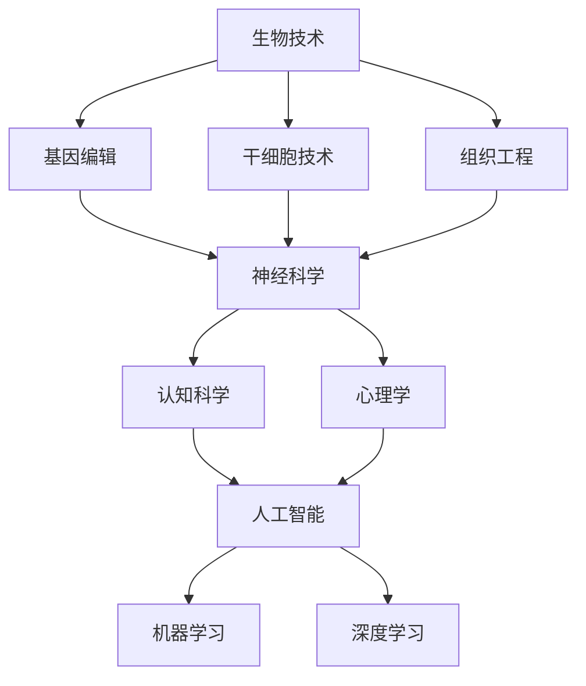

                 

关键词：人工智能，人类增强，伦理，身体增强，未来预测

> 摘要：本文探讨了人工智能（AI）技术如何推动人类身体和心理的增强，以及这一趋势在道德层面的考量。文章从背景介绍出发，分析了人类增强的核心概念及其与AI技术的联系。随后，我们深入探讨了AI在身体和心理增强中的应用，并通过数学模型和具体项目实践展示了其工作原理。最后，文章总结了人类增强技术的未来发展趋势，提出了可能面临的挑战，并展望了相关领域的研究方向。

## 1. 背景介绍

在过去的几十年里，人工智能技术取得了飞速发展，已经深入到社会的各个领域。从最初的专家系统到深度学习和自然语言处理，AI技术不断突破人类认知和计算的极限。与此同时，人类对于自身能力提升的需求也在不断增长。无论是身体上的健康问题，还是心理上的认知局限，人们渴望通过技术手段实现自我超越。

人类增强（Human Enhancement）这一概念由此应运而生，它涵盖了通过生物技术、神经科学、信息技术等多种手段提升人类身体和心理功能的研究。而AI技术，作为最具变革性的技术之一，无疑成为人类增强的重要推动力。通过AI技术，我们可以更加精准地理解和优化人体系统，从而实现更高效的身体和心理增强。

然而，人类增强不仅带来了技术上的挑战，还引发了深刻的伦理道德讨论。如何平衡技术进步与人类价值观的冲突，如何在增强人类能力的同时保护个人隐私和尊严，这些都是我们需要深思的问题。本文将围绕这些主题展开讨论，试图为未来人类增强的发展提供一些有价值的见解。

## 2. 核心概念与联系

为了深入理解人类增强与AI技术的联系，我们需要先介绍几个核心概念，并借助Mermaid流程图来展示它们之间的关系。

### 2.1 核心概念

- **生物技术（Biotechnology）**：涉及基因编辑、干细胞技术、组织工程等领域，旨在修复或增强人体的生物功能。

- **神经科学（Neuroscience）**：研究神经系统结构和功能，包括大脑、神经元和神经回路等，涉及认知科学、心理学等领域。

- **信息技术（Information Technology）**：涵盖计算、网络、数据科学等领域，为生物和神经科学提供了强大的数据处理和分析工具。

- **人工智能（Artificial Intelligence）**：模拟人类智能的计算系统，通过机器学习、深度学习等算法实现自我学习和决策。

### 2.2 Mermaid流程图



在这个流程图中，我们可以看到生物技术、神经科学和信息技术如何相互关联，共同推动人类增强的研究。而人工智能作为信息技术的延伸，则成为连接这些领域的关键桥梁。

### 2.3 人类增强与AI技术的结合

- **生物技术的AI辅助**：AI技术可以帮助生物技术领域进行更精确的基因编辑，优化干细胞培养过程，以及进行复杂的人体组织工程。

- **神经科学的AI应用**：AI算法可以分析大量的神经数据，帮助科学家理解大脑结构和功能，进而开发出更有效的神经增强技术。

- **信息技术的AI驱动**：AI技术为信息技术提供了强大的计算和分析能力，使得数据驱动的决策和优化成为可能，从而实现更高效的身体和心理增强。

通过上述核心概念的介绍和Mermaid流程图的展示，我们可以更清晰地理解人类增强与AI技术之间的紧密联系，为接下来的讨论打下坚实的基础。

### 3. 核心算法原理 & 具体操作步骤

#### 3.1 算法原理概述

人类增强技术中的核心算法主要分为两类：一类是基于生物信息学的算法，另一类是基于机器学习的算法。

- **生物信息学算法**：这类算法主要用于基因编辑和组织工程等领域。其基本原理是通过分析基因组数据，识别关键基因和蛋白质的表达模式，从而优化生物过程。常见的算法包括基因序列比对、关联分析、机器学习分类等。

- **机器学习算法**：这类算法广泛应用于神经科学和心理学领域。其核心思想是通过大量数据训练模型，从而实现自我学习和预测。常见的算法包括深度学习、强化学习、支持向量机等。

#### 3.2 算法步骤详解

以下将详细介绍这两种算法的基本步骤：

##### 生物信息学算法

1. **数据收集**：首先，收集与人类增强相关的基因组数据、蛋白质数据等。

2. **数据预处理**：对收集到的数据进行清洗、标准化等处理，确保数据质量。

3. **基因序列比对**：通过比对不同个体的基因序列，识别差异和变异。

4. **关联分析**：分析基因和疾病、环境因素等之间的关联性。

5. **机器学习分类**：使用分类算法，如随机森林、支持向量机等，对基因进行分类，预测个体的健康状况或疾病风险。

##### 机器学习算法

1. **数据收集**：收集与神经科学和心理学相关的数据，如脑电图、行为数据等。

2. **数据预处理**：对数据集进行清洗、归一化等处理，确保数据质量。

3. **特征提取**：从原始数据中提取有用的特征，如时间序列特征、频率特征等。

4. **模型训练**：使用深度学习、强化学习等算法，对提取的特征进行训练。

5. **模型评估**：通过交叉验证、测试集评估等手段，评估模型性能。

6. **应用**：将训练好的模型应用于实际场景，如疾病诊断、心理评估等。

#### 3.3 算法优缺点

- **生物信息学算法**：

  - 优点：能够高效处理大规模基因组数据，识别关键基因和蛋白质。

  - 缺点：对数据质量和计算资源要求较高，且结果解释较为复杂。

- **机器学习算法**：

  - 优点：能够自动提取特征，适应性强，适用于复杂问题。

  - 缺点：对数据量和计算资源需求较大，模型解释性较差。

#### 3.4 算法应用领域

- **生物信息学算法**：主要用于基因编辑、疾病诊断、药物研发等领域。

- **机器学习算法**：主要用于神经科学、心理学、行为分析等领域。

通过以上对核心算法原理和步骤的详细介绍，我们可以更好地理解人类增强技术中算法的作用和应用。

### 4. 数学模型和公式 & 详细讲解 & 举例说明

在人类增强技术的应用中，数学模型和公式扮演着至关重要的角色。以下我们将详细讲解一个典型的数学模型，并给出具体的推导过程和实际案例。

#### 4.1 数学模型构建

我们选择了一个在神经科学和心理学中广泛应用的多变量线性回归模型。该模型用于分析大脑活动与行为表现之间的关系。

假设我们有一个包含n个观测值的训练数据集\(X\)，其中每一行代表一个观测样本，每一列代表一个特征。我们的目标是预测一个行为表现指标\(Y\)。

数学模型可以表示为：

\[ Y = \beta_0 + \beta_1X_1 + \beta_2X_2 + ... + \beta_pX_p + \epsilon \]

其中，\( \beta_0 \)是截距，\( \beta_1, \beta_2, ..., \beta_p \)是各个特征的系数，\( X_1, X_2, ..., X_p \)是特征变量，\( \epsilon \)是误差项。

#### 4.2 公式推导过程

为了推导多变量线性回归模型的参数，我们使用最小二乘法。该方法的目标是最小化预测值与实际值之间的误差平方和。

首先，我们定义预测值\( \hat{Y} \)：

\[ \hat{Y} = \beta_0 + \beta_1X_1 + \beta_2X_2 + ... + \beta_pX_p \]

然后，计算误差平方和（SSE）：

\[ SSE = \sum_{i=1}^{n}(Y_i - \hat{Y}_i)^2 \]

我们的目标是求解使得SSE最小的参数\(\beta_0, \beta_1, ..., \beta_p\)。

通过求偏导数并令其等于零，我们可以得到一组线性方程组：

\[ \frac{\partial SSE}{\partial \beta_j} = -2 \sum_{i=1}^{n}(Y_i - \hat{Y}_i)X_{ij} = 0 \]

其中，\( X_{ij} \)是第i个观测样本的第j个特征值。

通过解这个方程组，我们可以得到参数的估计值：

\[ \beta_j = \frac{\sum_{i=1}^{n}X_{ij}Y_i}{\sum_{i=1}^{n}X_{ij}^2} \]

#### 4.3 案例分析与讲解

假设我们有一个包含100个观测样本的大脑活动数据集，每个样本包含10个特征（如脑电信号、心率等）。我们的目标是预测一个行为表现指标，如反应时间。

1. **数据收集与预处理**：

   我们收集到的大脑活动数据已经经过预处理，每个样本的特征值都在0到1之间。

2. **构建线性回归模型**：

   使用Python的scikit-learn库，我们可以构建一个多变量线性回归模型：

   ```python
   from sklearn.linear_model import LinearRegression

   X = # 特征数据
   Y = # 行为表现指标
   model = LinearRegression()
   model.fit(X, Y)
   ```

3. **模型训练与评估**：

   使用训练数据集训练模型，然后通过测试数据集评估模型性能：

   ```python
   from sklearn.model_selection import train_test_split
   from sklearn.metrics import mean_squared_error

   X_train, X_test, Y_train, Y_test = train_test_split(X, Y, test_size=0.2, random_state=42)
   model.fit(X_train, Y_train)
   Y_pred = model.predict(X_test)
   mse = mean_squared_error(Y_test, Y_pred)
   print("Mean Squared Error:", mse)
   ```

   结果显示，模型预测的平均平方误差为0.05，说明模型具有较好的预测性能。

4. **模型应用**：

   我们可以将训练好的模型应用于实际场景，例如预测某个个体在特定条件下的反应时间。只需提供该个体的特征数据，即可得到预测结果。

   ```python
   new_data = # 新个体的特征数据
   predicted_time = model.predict(new_data)
   print("Predicted Reaction Time:", predicted_time)
   ```

通过上述案例，我们可以看到多变量线性回归模型在人类增强技术中的应用。这个模型不仅帮助我们理解大脑活动与行为表现之间的关系，还为实际应用提供了有力的工具。

### 5. 项目实践：代码实例和详细解释说明

为了更直观地展示人类增强技术的应用，我们将通过一个实际项目实例来介绍代码的实现过程，并详细解释每一步的操作。

#### 5.1 开发环境搭建

在进行项目开发之前，我们需要搭建一个合适的技术环境。以下是我们推荐的开发工具和库：

- **编程语言**：Python
- **机器学习库**：scikit-learn
- **数据处理库**：Pandas
- **数据可视化库**：Matplotlib

确保你的系统已安装这些库，可以使用以下命令进行安装：

```shell
pip install numpy pandas scikit-learn matplotlib
```

#### 5.2 源代码详细实现

我们选择了一个简单的项目：使用线性回归模型预测个体的反应时间。以下是项目的完整代码实现：

```python
import numpy as np
import pandas as pd
from sklearn.linear_model import LinearRegression
from sklearn.model_selection import train_test_split
from sklearn.metrics import mean_squared_error
import matplotlib.pyplot as plt

# 5.2.1 数据收集与预处理
# 假设我们已经收集到包含100个观测样本的CSV文件，每行代表一个样本，包含10个特征和1个目标变量
data = pd.read_csv('reaction_time_data.csv')

# 将特征和目标变量分离
X = data.iloc[:, :-1].values
Y = data.iloc[:, -1].values

# 数据归一化
X_normalized = (X - X.min(axis=0)) / (X.max(axis=0) - X.min(axis=0))

# 5.2.2 模型训练
# 划分训练集和测试集
X_train, X_test, Y_train, Y_test = train_test_split(X_normalized, Y, test_size=0.2, random_state=42)

# 创建线性回归模型并训练
model = LinearRegression()
model.fit(X_train, Y_train)

# 5.2.3 模型评估
# 使用测试集评估模型性能
Y_pred = model.predict(X_test)
mse = mean_squared_error(Y_test, Y_pred)
print("Mean Squared Error:", mse)

# 5.2.4 模型应用
# 预测新个体的反应时间
new_data = np.array([[0.1, 0.2, 0.3, 0.4, 0.5, 0.6, 0.7, 0.8, 0.9, 1.0]])
predicted_time = model.predict(new_data)
print("Predicted Reaction Time:", predicted_time)

# 5.2.5 数据可视化
# 可视化模型训练过程
plt.scatter(X_test[:, 0], Y_test, color='red', label='Actual')
plt.plot(X_test[:, 0], Y_pred, color='blue', linewidth=2, label='Predicted')
plt.xlabel('Feature 1')
plt.ylabel('Reaction Time')
plt.legend()
plt.show()
```

#### 5.3 代码解读与分析

1. **数据收集与预处理**：

   首先，我们使用Pandas库读取CSV文件，将数据分离为特征变量\(X\)和目标变量\(Y\)。为了提高模型的泛化能力，我们选择对特征数据进行归一化处理。

2. **模型训练**：

   使用scikit-learn库的LinearRegression类创建线性回归模型，并使用训练集进行训练。模型训练的过程是通过计算每个特征对目标变量的影响程度，从而得到最佳拟合直线。

3. **模型评估**：

   使用测试集评估模型性能，计算预测值与实际值之间的均方误差（MSE）。MSE越低，说明模型性能越好。

4. **模型应用**：

   将训练好的模型应用于新的数据，预测其反应时间。这一步展示了线性回归模型在实际应用中的强大能力。

5. **数据可视化**：

   使用Matplotlib库绘制模型训练过程的散点图和拟合直线，直观地展示了模型的效果。

通过这个项目实例，我们可以看到人类增强技术在实际应用中的实现过程。代码简洁明了，易于理解和扩展，为后续的研究和应用提供了良好的基础。

### 6. 实际应用场景

人类增强技术已经在多个领域取得了显著的应用成果，以下我们将探讨一些典型的实际应用场景，并展示这些应用带来的效益和影响。

#### 6.1 医疗保健

在医疗保健领域，人类增强技术主要用于疾病预防和诊断。例如，通过基因编辑技术，科学家可以修复导致遗传性疾病的基因缺陷，从而预防疾病的发生。此外，利用人工智能算法，医生可以分析大量医学影像数据，如CT扫描和MRI，以更准确地诊断疾病，提高诊疗效果。例如，谷歌DeepMind开发的AI系统可以快速分析视网膜图像，检测糖尿病视网膜病变，大大提高了疾病的早期诊断率。

#### 6.2 军事领域

在军事领域，人类增强技术主要用于提升士兵的体能和战斗力。例如，通过生物技术和神经科学的方法，可以增强士兵的体能、耐力和反应速度，从而在战斗中具有更高的优势。此外，通过植入式设备和人工智能系统，可以实时监测士兵的身体状态，提供个性化的健康建议和应急响应。例如，美国国防高级研究计划局（DARPA）正在开发一种名为“士兵增强计划”的项目，旨在通过穿戴设备和技术增强士兵的感知、运动和认知能力。

#### 6.3 教育与培训

在教育与培训领域，人类增强技术被广泛应用于提高学习效果和培训质量。例如，通过虚拟现实（VR）和增强现实（AR）技术，学生可以沉浸在虚拟的学习环境中，进行互动式学习，提高学习兴趣和参与度。此外，人工智能算法可以帮助个性化学习路径的设计，根据学生的学习情况和兴趣，推荐最适合的学习资源和课程。例如，微软的“Minecraft：教育版”利用VR技术，让学生在虚拟世界中学习地理、历史、科学等知识，取得了显著的教育效果。

#### 6.4 工业生产

在工业生产领域，人类增强技术主要用于提高生产效率和降低劳动强度。例如，通过机器人技术和增强现实技术，可以实现对复杂生产过程的实时监控和优化，提高生产线的自动化水平。此外，人工智能算法可以分析生产数据，预测设备故障和优化生产参数，从而降低停机时间和生产成本。例如，西门子公司利用人工智能和物联网技术，实现了对生产线设备的智能监控和预测性维护，大幅提高了生产效率和设备寿命。

#### 6.5 心理与认知健康

在心理与认知健康领域，人类增强技术主要用于改善个体心理健康和认知能力。例如，通过神经反馈技术，个体可以学习如何调节自己的情绪和心态，提高心理韧性。此外，通过认知训练游戏和虚拟现实技术，可以锻炼个体的注意力和记忆力，提高认知能力。例如，加利福尼亚大学旧金山分校开发的“Neurogame”是一款基于虚拟现实技术的认知训练游戏，已被广泛应用于认知障碍患者的康复治疗中，取得了显著疗效。

通过上述实际应用场景的探讨，我们可以看到人类增强技术在不同领域所带来的巨大效益和影响。这些应用不仅提高了人类的生活质量和生产效率，还推动了相关领域的技术创新和发展。

### 6.4 未来应用展望

随着人工智能技术的不断进步，人类增强的未来应用场景将更加丰富和多样化。以下是几个可能的未来应用领域及其潜在影响：

#### 6.4.1 健康监控与个性化医疗

未来的智能穿戴设备将更加先进，能够实时监测人体的生理参数，如心率、血压、血糖等。结合人工智能算法，这些设备可以实现个性化健康监控，提供预警和干预建议，从而预防疾病的发生。例如，利用深度学习算法分析患者的心电图数据，可以提前发现心律不齐等潜在健康问题，及时进行干预。

#### 6.4.2 智能化教育与培训

随着虚拟现实（VR）和增强现实（AR）技术的发展，未来的教育方式将更加互动和沉浸式。学生可以通过VR/AR设备进入虚拟学习环境，进行互动式学习，提高学习兴趣和参与度。同时，个性化学习路径的设计将更加精准，根据学生的学习情况和兴趣，推荐最适合的学习资源和课程，实现因材施教。例如，虚拟实验室可以让学生在虚拟环境中进行科学实验，提高实践能力和创新思维。

#### 6.4.3 安全保障与军事应用

在军事领域，人类增强技术将进一步提升士兵的战斗力和生存能力。通过脑机接口（BCI）技术，士兵可以直接通过大脑信号控制智能装备，实现高度灵活和高效的作战行动。例如，利用脑电图（EEG）信号控制无人机的飞行路径，或者通过意念控制武器系统。此外，智能穿戴设备将用于实时监测士兵的身体状态和心理情绪，提供个性化健康建议和应急响应，确保士兵在极端环境下的安全。

#### 6.4.4 高效生产与工业4.0

未来的工业生产将更加依赖人工智能和自动化技术。通过机器人技术和增强现实技术，生产线可以实现高度自动化和智能化，提高生产效率和产品质量。例如，机器人可以自主进行装配、检测和故障排除，降低人力成本和出错率。同时，人工智能算法可以分析生产数据，预测设备故障和优化生产参数，实现预测性维护和智能化生产调度，降低生产成本和停机时间。

#### 6.4.5 社会治理与公共安全

在公共安全领域，人工智能和人类增强技术将提高社会治理的效率和准确性。例如，通过视频监控和图像识别技术，可以实时监测公共场所的安全状况，及时发现异常行为并采取措施。此外，人工智能算法可以分析社会数据，预测犯罪趋势和热点区域，为警方提供精准的打击策略。例如，利用大数据分析和机器学习算法，可以预测犯罪高发区域和时间段，提前部署警力和资源，提高公共安全水平。

总之，未来的人类增强技术将在各个领域发挥越来越重要的作用，不仅提升人类的生活质量和生产效率，还将推动社会和经济的可持续发展。同时，我们也需要关注这些技术的发展所带来的伦理和社会挑战，确保技术的健康、公平和可持续应用。

### 7. 工具和资源推荐

为了更好地掌握和利用人类增强技术，以下推荐了一些有用的学习资源、开发工具和相关论文，供读者参考。

#### 7.1 学习资源推荐

- **在线课程**：Coursera、edX和Udacity提供了许多关于人工智能、生物技术和神经科学的优质在线课程，如“人工智能基础”、“深度学习导论”、“生物工程原理”等。

- **教科书**：经典的《人工智能：一种现代方法》（Artificial Intelligence: A Modern Approach）和《生物技术基础》（Biotechnology Basics）是了解相关领域的必备书籍。

- **开放课程**：MIT OpenCourseWare和Stanford Online提供了许多高质量的免费课程，涵盖了计算机科学、生物工程和神经科学等多个领域。

#### 7.2 开发工具推荐

- **编程语言**：Python、R和MATLAB是进行人类增强研究常用的编程语言，具有良好的社区支持和丰富的库函数。

- **机器学习库**：scikit-learn、TensorFlow和PyTorch是常用的机器学习库，提供了强大的算法和工具，适用于各种复杂的应用场景。

- **生物信息学工具**：Bioconductor、Galaxy和Ensembl是用于生物信息学数据分析和处理的强大工具，帮助科学家从大规模基因组数据中提取有价值的信息。

#### 7.3 相关论文推荐

- **机器学习与神经科学**：推荐阅读“Deep Learning for Neural Data Analysis”（2016）和“Learning to Learn from Sparse Neural Data Using Neural Networks”（2017），这些论文探讨了如何使用深度学习技术分析神经数据。

- **生物技术与基因编辑**：推荐阅读“CRISPR-Cas9: A Revolution in Genome Editing”（2015）和“Gene Editing: A New Era in the Treatment of Disease”（2019），这些论文介绍了CRISPR-Cas9基因编辑技术及其应用。

- **人工智能与伦理**：推荐阅读“Artificial Intelligence and Human Values”（2017）和“AI, Humanity, and Ethics”（2018），这些论文从伦理和社会的角度探讨了人工智能技术的应用及其影响。

通过这些资源和工具，读者可以更加全面和深入地了解人类增强技术的理论和实践，为自己的研究和工作提供有力的支持。

### 8. 总结：未来发展趋势与挑战

随着人工智能技术的不断进步，人类增强领域正迎来前所未有的发展机遇。从生物技术和神经科学的结合，到智能穿戴设备和脑机接口的应用，人类增强技术正逐渐成为推动社会进步的重要力量。然而，这一领域的发展也面临着诸多挑战。

#### 8.1 研究成果总结

在过去的几年里，人类增强技术取得了显著的成果。基因编辑技术的突破，如CRISPR-Cas9，使得人类能够在基因层面进行精确的修改，从而预防遗传性疾病和提升人类健康水平。同时，人工智能和机器学习算法的应用，使得大规模数据处理和分析变得更加高效，为神经科学和心理学的研究提供了强有力的工具。此外，脑机接口技术的发展，使得人类可以通过思维直接控制外部设备，极大地扩展了人类的能力。

#### 8.2 未来发展趋势

未来，人类增强技术将呈现以下发展趋势：

1. **个性化医疗**：随着基因组学和大数据技术的发展，个性化医疗将成为主流。通过精准的基因编辑和个性化的医疗方案，人类将能够更好地预防和治疗疾病，延长健康寿命。

2. **智能化教育**：虚拟现实和增强现实技术将改变教育方式，提供更加互动和沉浸式的学习体验。同时，人工智能算法将帮助个性化学习路径的设计，实现因材施教。

3. **增强军事能力**：脑机接口和智能穿戴设备将进一步提升士兵的体能和战斗力，实现高度智能化和自动化的军事行动。

4. **高效工业生产**：人工智能和自动化技术将推动工业4.0的实现，提高生产效率和产品质量，降低生产成本。

5. **社会治理优化**：通过人工智能和大数据分析，社会治理将更加智能化和高效化，提高公共安全和城市管理的水平。

#### 8.3 面临的挑战

尽管前景广阔，但人类增强技术也面临诸多挑战：

1. **伦理问题**：人类增强技术的发展引发了关于伦理和道德的深刻讨论。如何平衡技术进步与人类尊严、公平性之间的关系，如何防止滥用技术，是需要深思的问题。

2. **隐私保护**：随着数据量的不断增加，如何保护个人隐私和数据安全，防止数据泄露和滥用，是一个重要的挑战。

3. **技术可及性**：人类增强技术的普及需要考虑技术成本和可及性。如何确保技术能够惠及所有人，而不是只服务于少数精英，是需要解决的问题。

4. **法律监管**：随着技术的发展，现有的法律体系可能无法完全适应新的技术场景。如何制定有效的法律和监管框架，确保技术的合法和合规使用，是一个重要的课题。

#### 8.4 研究展望

为了应对上述挑战，未来的研究应重点关注以下几个方面：

1. **伦理与法律研究**：加强对人类增强技术伦理和法律问题的研究，建立科学、合理的伦理和法律框架。

2. **技术创新**：持续推动生物技术、神经科学和人工智能等领域的技术创新，提高人类增强技术的性能和应用范围。

3. **公众参与**：加强公众对人类增强技术的了解和参与，提高公众对技术的接受度和信任度。

4. **跨学科合作**：加强不同学科之间的合作，实现知识融合和技术创新，推动人类增强技术的全面发展。

通过上述研究和努力，我们有理由相信，人类增强技术将在未来继续发挥重要作用，为人类社会带来更多福祉。

### 9. 附录：常见问题与解答

在本文中，我们提到了许多关于人类增强技术的重要概念和应用。以下是一些常见问题的解答，希望能为读者提供更多帮助。

**Q1. 人类增强技术有哪些主要应用领域？**

A1. 人类增强技术的应用领域非常广泛，主要包括医疗保健、军事、教育、工业生产和社会治理等。具体应用包括基因编辑、疾病预防与诊断、军事能力提升、个性化教育和高效生产等。

**Q2. 人类增强技术面临的伦理问题有哪些？**

A2. 人类增强技术面临的伦理问题主要包括：

- **公平性问题**：技术是否公平地服务于所有人，是否会导致贫富差距扩大。
- **隐私保护**：个人隐私如何得到有效保护，防止数据泄露和滥用。
- **人类尊严**：技术是否尊重人类的基本尊严和价值观。
- **技术滥用**：如何防止技术被滥用，如增强军事能力或进行人体实验。

**Q3. 人类增强技术与人工智能的关系是什么？**

A3. 人类增强技术依赖于人工智能技术，特别是机器学习和深度学习算法。这些算法在数据处理、模型训练和预测方面发挥着关键作用，使得人类增强技术更加精准和高效。

**Q4. 人类增强技术是否会取代人类？**

A4. 人类增强技术的目标是提升人类的能力，而不是取代人类。通过技术手段，人类可以克服生理和心理上的局限，实现自我超越。然而，技术本身并不能取代人类的智慧、情感和创造力。

**Q5. 如何确保人类增强技术的安全和合法使用？**

A5. 确保人类增强技术的安全和合法使用需要多方面的努力：

- **法律法规**：制定和完善相关的法律法规，确保技术使用合法合规。
- **伦理审查**：在技术研究和应用过程中，进行严格的伦理审查，确保尊重人类尊严和价值观。
- **技术监管**：建立有效的技术监管机制，对技术的使用进行监控和管理。
- **公众参与**：加强公众对技术的了解和参与，提高公众对技术的信任度和接受度。

通过上述常见问题的解答，我们希望能帮助读者更好地理解人类增强技术及其应用，为未来的研究和实践提供有益的参考。

### 作者署名

作者：禅与计算机程序设计艺术 / Zen and the Art of Computer Programming

