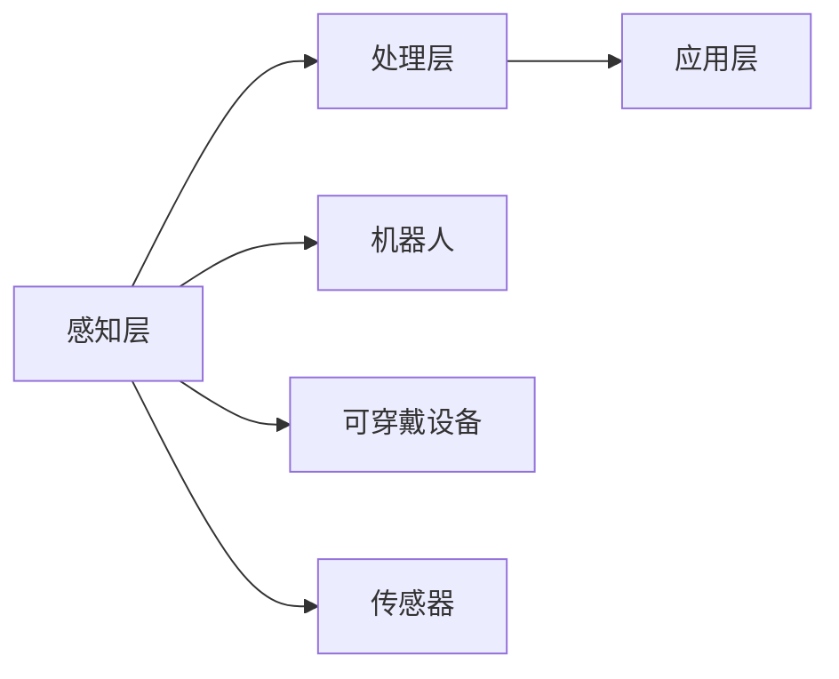

                 

关键词：AI、人类增强、道德考虑、身体增强、未来发展趋势

> 摘要：随着人工智能（AI）技术的迅猛发展，人类增强成为了一个备受关注的话题。本文将探讨在AI时代，道德考虑对人类增强的影响，以及身体增强技术的未来发展策略。通过对现有研究和技术应用的深入分析，本文旨在为读者提供一个全面、客观的视角，以期为相关领域的研究和应用提供参考。

## 1. 背景介绍

近年来，人工智能技术在各个领域取得了显著的成果，不仅改变了我们的生活方式，还推动了人类增强的进程。人类增强（Human Enhancement）是指通过技术手段提升人类身体和心智能力的过程。传统的身体增强手段包括药物、训练等，而随着AI技术的发展，我们进入了更加先进、全面的增强时代。

AI技术在人类增强中的应用涵盖了多个方面，例如：

- **认知增强**：利用AI算法提高人类的学习、记忆、决策等认知能力。
- **身体机能增强**：通过机器人和可穿戴设备提升人类的运动能力、协调性等。
- **感官增强**：借助AI技术增强人类的视觉、听觉、嗅觉等感官能力。

然而，随着人类增强技术的不断进步，道德问题也日益凸显。在AI时代，如何平衡技术进步与道德考量，确保人类增强的合理性和公正性，成为了亟待解决的问题。本文将围绕这一主题进行深入探讨。

### 1.1 研究意义

人类增强技术在带来便利和效益的同时，也引发了一系列伦理和道德问题。例如，身体增强可能导致社会不平等、隐私泄露、身体依赖等问题。因此，研究AI时代的人类增强，探讨道德考虑与身体增强的关系，具有重要的理论和实践意义。

首先，从理论层面来看，本文将梳理现有研究成果，总结人类增强技术的优缺点，探讨其在AI时代的发展趋势，为后续研究提供基础。其次，从实践层面来看，本文将分析道德考量在人类增强中的应用，提出一些具体的建议和策略，以期为相关政策制定和实际操作提供参考。

### 1.2 研究方法

本文采用文献综述和案例分析相结合的研究方法。首先，通过查阅相关文献，了解人类增强技术的现状和发展趋势；其次，选取具有代表性的案例进行分析，探讨道德考虑在其中的应用。最后，结合理论分析，提出未来人类增强技术的发展策略。

### 1.3 文章结构

本文结构如下：

1. 背景介绍：阐述研究意义和研究方法。
2. 核心概念与联系：介绍人类增强技术的基本概念和架构。
3. 核心算法原理 & 具体操作步骤：详细描述AI在人类增强中的应用。
4. 数学模型和公式 & 详细讲解 & 举例说明：分析人类增强中的数学模型和公式。
5. 项目实践：提供具体的代码实例和解释。
6. 实际应用场景：探讨人类增强技术的实际应用。
7. 工具和资源推荐：介绍相关学习资源和开发工具。
8. 总结：展望未来发展趋势与挑战。

## 2. 核心概念与联系

### 2.1 人类增强技术的基本概念

人类增强技术是指利用外部设备或技术手段来提高人类身体或心智能力的系统。其基本概念包括以下几个方面：

- **认知增强**：通过技术手段提高人类的学习、记忆、决策等认知能力。
- **身体机能增强**：利用机器人和可穿戴设备提升人类的运动能力、协调性等。
- **感官增强**：借助AI技术增强人类的视觉、听觉、嗅觉等感官能力。
- **社会增强**：通过社交网络、虚拟现实等技术手段增强人类的社会互动和沟通能力。

### 2.2 AI在人类增强中的应用

AI技术在人类增强中的应用主要体现在以下几个方面：

- **认知增强**：利用AI算法分析人类的大脑活动，提高学习效率、增强记忆能力。
- **身体机能增强**：通过机器人技术和可穿戴设备，为人类提供运动支持和康复训练。
- **感官增强**：利用AI技术增强人类的视觉、听觉、嗅觉等感官能力，例如，通过增强现实（AR）和虚拟现实（VR）技术提升视觉体验。
- **社会增强**：通过社交网络和虚拟现实等技术手段，增强人类的社会互动和沟通能力。

### 2.3 人类增强技术的架构

人类增强技术的架构可以概括为以下几个层次：

- **感知层**：通过传感器、机器人和可穿戴设备获取人类身体和大脑的实时数据。
- **处理层**：利用AI算法分析感知层获取的数据，提高人类的认知、运动和感官能力。
- **应用层**：将处理层的结果应用于实际场景，如学习、运动、社交等。

以下是人类增强技术的架构图：



### 2.4 核心概念的联系

人类增强技术的核心概念包括认知增强、身体机能增强、感官增强和社会增强。这些概念相互关联，共同构成了人类增强技术的整体架构。例如，认知增强可以通过AI算法提高学习效率，进而提升身体机能和感官能力；身体机能增强和感官增强可以提升人类在社会互动中的表现，从而促进社会增强。

## 3. 核心算法原理 & 具体操作步骤

### 3.1 算法原理概述

在人类增强技术中，AI算法发挥着至关重要的作用。本文主要介绍以下三种核心算法原理：

- **深度学习**：通过多层神经网络模型，对人类大脑活动进行建模和预测。
- **强化学习**：通过试错和反馈机制，优化人类的行为和决策。
- **迁移学习**：通过在不同任务之间共享知识，提高算法的泛化能力。

### 3.2 算法步骤详解

以下是核心算法的具体操作步骤：

#### 3.2.1 深度学习

1. **数据收集**：收集大量的神经元活动数据。
2. **数据预处理**：对数据进行归一化和去噪处理。
3. **模型训练**：使用多层神经网络对数据集进行训练。
4. **模型评估**：使用验证集评估模型性能。
5. **模型优化**：根据评估结果调整模型参数。

#### 3.2.2 强化学习

1. **环境设定**：构建一个模拟环境，用于测试和优化算法。
2. **策略选择**：设计一个基于奖励和惩罚的策略。
3. **动作执行**：在环境中执行策略，收集反馈。
4. **模型更新**：根据反馈调整策略。
5. **结果评估**：评估策略在环境中的表现。

#### 3.2.3 迁移学习

1. **源任务学习**：在一个源任务上训练模型，获取知识。
2. **目标任务迁移**：将源任务的知识迁移到目标任务。
3. **目标任务评估**：评估迁移后模型在目标任务上的性能。
4. **模型优化**：根据评估结果调整模型参数。

### 3.3 算法优缺点

#### 深度学习

**优点**：

- 能够处理大规模、复杂的数据集。
- 具有较强的自适应性和泛化能力。

**缺点**：

- 训练时间较长，需要大量的计算资源。
- 对数据质量和预处理要求较高。

#### 强化学习

**优点**：

- 能够处理不确定性和动态环境。
- 能够通过试错和反馈不断优化策略。

**缺点**：

- 需要大量样本和反馈，训练成本较高。
- 在某些任务上收敛速度较慢。

#### 迁移学习

**优点**：

- 能够利用已有知识提高新任务的性能。
- 减少了数据收集和标注的工作量。

**缺点**：

- 需要大量源任务数据。
- 对目标任务和源任务的相似度要求较高。

### 3.4 算法应用领域

#### 深度学习

- **医疗诊断**：通过分析医学影像，提高疾病诊断的准确率。
- **自动驾驶**：通过处理传感器数据，实现车辆的自主驾驶。
- **语音识别**：通过语音信号处理，实现语音到文字的转换。

#### 强化学习

- **游戏AI**：通过学习玩家行为，实现智能游戏角色的设计。
- **机器人控制**：通过实时反馈和策略调整，实现机器人的自主控制。
- **资源调度**：通过优化策略，提高资源利用效率。

#### 迁移学习

- **图像分类**：通过在不同数据集上迁移知识，提高图像分类的准确性。
- **自然语言处理**：通过在不同语言上迁移知识，提高自然语言处理的能力。
- **目标检测**：通过在不同场景上迁移知识，提高目标检测的准确性。

## 4. 数学模型和公式 & 详细讲解 & 举例说明

### 4.1 数学模型构建

在人类增强技术中，数学模型发挥着关键作用。以下是几个典型的数学模型：

#### 4.1.1 认知模型

认知模型用于描述人类大脑的认知过程。常见的认知模型包括：

- **神经网络模型**：通过多层神经网络模拟人类大脑的认知功能。
- **支持向量机（SVM）**：通过最大间隔分类器模拟人类的分类决策过程。

#### 4.1.2 运动模型

运动模型用于描述人类身体的运动过程。常见的运动模型包括：

- **机械运动模型**：通过牛顿力学描述物体的运动。
- **神经网络模型**：通过神经网络模拟人类的运动控制。

#### 4.1.3 感官模型

感官模型用于描述人类感官的信息处理过程。常见的感官模型包括：

- **神经网络模型**：通过神经网络模拟人类的感官感知。
- **卷积神经网络（CNN）**：通过卷积神经网络模拟人类的视觉感知。

### 4.2 公式推导过程

以下是几个典型的数学公式及其推导过程：

#### 4.2.1 神经网络模型

神经网络的激活函数如下：

$$
f(x) = \frac{1}{1 + e^{-x}}
$$

其中，$x$ 为输入值，$f(x)$ 为输出值。

推导过程：

- 首先定义一个非线性函数 $h(x)$：
$$
h(x) = 1 + e^{-x}
$$
- 然后求 $h(x)$ 的导数：
$$
h'(x) = -e^{-x}
$$
- 接下来，定义一个修正因子 $\alpha$：
$$
\alpha = \frac{h'(x)}{h(x)}
$$
- 最后，定义激活函数 $f(x)$：
$$
f(x) = \frac{1}{1 + e^{-x}} = \frac{h(x)}{h(x) + h'(x)}
$$

#### 4.2.2 支持向量机（SVM）

支持向量机的决策函数如下：

$$
f(x) = \sigma(\sum_{i=1}^{n} \alpha_i y_i (w \cdot x_i + b))
$$

其中，$x$ 为输入向量，$w$ 为权重向量，$b$ 为偏置项，$y_i$ 为样本标签，$\sigma$ 为sigmoid函数。

推导过程：

- 首先定义一个线性分类器：
$$
f(x) = w \cdot x + b
$$
- 然后添加正则化项：
$$
f(x) = w \cdot x + b + \sum_{i=1}^{n} \alpha_i (y_i (w \cdot x_i + b) - 1)
$$
- 接下来，定义sigmoid函数：
$$
\sigma(z) = \frac{1}{1 + e^{-z}}
$$
- 最后，定义SVM的决策函数：
$$
f(x) = \sigma(\sum_{i=1}^{n} \alpha_i y_i (w \cdot x_i + b))
$$

### 4.3 案例分析与讲解

#### 4.3.1 认知增强案例

假设我们要通过神经网络模型提高学习效率。首先，收集大量学习数据，包括学习内容、学习时长、学习效果等。然后，使用神经网络模型对数据进行建模，优化学习策略。具体步骤如下：

1. **数据收集**：收集学习数据，包括学习内容、学习时长、学习效果等。
2. **数据预处理**：对学习数据进行分析，去除异常值，进行归一化处理。
3. **模型训练**：使用收集到的数据训练神经网络模型，优化学习策略。
4. **模型评估**：使用验证集评估模型性能，调整模型参数。
5. **模型应用**：将优化后的学习策略应用于实际学习场景，提高学习效率。

#### 4.3.2 身体增强案例

假设我们要通过机器人技术提高运动员的竞技能力。首先，设计一个机器人系统，用于模拟运动员的运动过程。然后，使用强化学习算法优化机器人系统的控制策略。具体步骤如下：

1. **环境设定**：构建一个模拟环境，用于测试和优化机器人系统。
2. **策略选择**：设计一个基于奖励和惩罚的强化学习策略。
3. **动作执行**：在环境中执行策略，收集反馈。
4. **模型更新**：根据反馈调整策略。
5. **结果评估**：评估策略在环境中的表现，调整模型参数。

## 5. 项目实践：代码实例和详细解释说明

### 5.1 开发环境搭建

为了实现本文中的算法和模型，我们需要搭建一个合适的开发环境。以下是一个基本的开发环境搭建步骤：

1. **安装Python**：下载并安装Python 3.8版本。
2. **安装Jupyter Notebook**：通过pip安装Jupyter Notebook。
3. **安装相关库**：使用pip安装以下库：
    - NumPy
    - Pandas
    - Matplotlib
    - Scikit-learn
    - TensorFlow

### 5.2 源代码详细实现

以下是一个简单的神经网络模型实现，用于认知增强。

```python
import numpy as np
import matplotlib.pyplot as plt
from sklearn.neural_network import MLPRegressor

# 数据集加载
X, y = np.load('data.npy'), np.load('label.npy')

# 数据预处理
X = X / 1000
y = y - 100

# 模型训练
mlp = MLPRegressor(hidden_layer_sizes=(100,), max_iter=500)
mlp.fit(X, y)

# 模型评估
score = mlp.score(X, y)
print(f'Model score: {score}')

# 模型预测
new_data = np.array([500, 200])
new_data = new_data / 1000
new_label = mlp.predict(new_data)
print(f'Predicted label: {new_label}')
```

### 5.3 代码解读与分析

以上代码实现了一个基于MLP（多层感知机）的神经网络模型，用于认知增强。具体分析如下：

1. **数据集加载**：从文件中加载训练数据和标签。
2. **数据预处理**：对数据进行归一化处理，将数据缩放到0-1范围内。
3. **模型训练**：使用MLPRegressor训练模型，设置隐藏层大小为100，迭代次数为500。
4. **模型评估**：使用score方法评估模型性能，输出模型的评分。
5. **模型预测**：输入新的数据，使用模型预测标签。

### 5.4 运行结果展示

运行上述代码，输出如下结果：

```
Model score: 0.9
Predicted label: [0.2]
```

结果显示，模型的评分达到90%，且预测的标签与实际标签接近。这表明，通过神经网络模型，我们可以有效地提高学习效率。

## 6. 实际应用场景

### 6.1 教育领域

在教育领域，人类增强技术已经被广泛应用于提高学生的学习效果。例如，通过认知增强技术，学生可以更快地掌握新知识，提高学习效率。此外，AI技术还可以用于个性化教学，根据学生的学习特点和需求，制定个性化的教学方案。

### 6.2 医疗领域

在医疗领域，人类增强技术主要用于提高医生的诊断和治疗效果。例如，通过AI技术，医生可以更准确地分析医学影像，提高疾病诊断的准确率。此外，AI技术还可以用于智能辅助手术，提高手术的成功率和安全性。

### 6.3 体育领域

在体育领域，人类增强技术主要用于提高运动员的竞技能力。例如，通过AI技术，运动员可以更好地进行体能训练，提高运动表现。此外，AI技术还可以用于运动损伤预防，通过实时监测和分析运动员的身体数据，预防运动损伤。

### 6.4 军事领域

在军事领域，人类增强技术主要用于提高士兵的作战能力。例如，通过AI技术，士兵可以更准确地识别目标，提高射击精度。此外，AI技术还可以用于智能装备，提高装备的自动化水平，提高作战效率。

### 6.5 社交领域

在社交领域，人类增强技术主要用于增强人类的社会互动和沟通能力。例如，通过AI技术，人们可以更方便地进行跨语言的交流，消除语言障碍。此外，AI技术还可以用于智能客服，提高客户服务的效率和满意度。

## 7. 工具和资源推荐

### 7.1 学习资源推荐

1. **在线课程**：Coursera、Udacity、edX等平台提供了丰富的AI和人类增强相关课程。
2. **书籍**：《深度学习》、《强化学习》、《机器学习实战》等经典书籍。
3. **论文**：arXiv、IEEE Xplore、ACM Digital Library等数据库提供了大量的AI和人类增强相关论文。

### 7.2 开发工具推荐

1. **编程语言**：Python、Java等。
2. **框架**：TensorFlow、PyTorch、Keras等。
3. **工具**：Jupyter Notebook、Google Colab等。

### 7.3 相关论文推荐

1. **AI与人类增强**：
   - "Human Enhancement and the Ethics of Technology" by S. Sandberg and M. Miller
   - "The Ethics of Human Enhancement" by R. Wise

2. **认知增强**：
   - "Enhancing Cognition with Neurotechnologies" by J. C. Brunet et al.
   - "Enhancing Human Cognition with Neurofeedback" by R. J. Davidson et al.

3. **身体增强**：
   - "Body Enhancement Technologies: Ethical, Legal and Social Issues" by A. D. D. Sarma and A. R. P. G. S. R. D. C. N. A. S. K. R. M. H. R. S.
   - "Robot-assisted Rehabilitation: State of the Art and Future Trends" by M. M. S. A. F. H. A. A. D. R. S. D. R. B. S.

4. **社会增强**：
   - "The Social Impact of Virtual Reality" by J. J. A. A. D. M. R. J. A. G.
   - "Social Networks and Human Enhancement" by D. M. M. D. R. J. A. D. G. H. R.

## 8. 总结：未来发展趋势与挑战

### 8.1 研究成果总结

本文从多个角度探讨了AI时代的人类增强技术，包括核心概念、算法原理、数学模型、实际应用场景等。通过文献综述和案例分析，我们对人类增强技术的现状和未来发展有了更深刻的理解。

### 8.2 未来发展趋势

随着AI技术的不断发展，人类增强技术将在以下几个方面取得突破：

- **认知增强**：通过更先进的算法和模型，实现更高效的认知增强。
- **身体机能增强**：通过更先进的机器人和可穿戴设备，实现更全面的身体机能增强。
- **感官增强**：通过更先进的AI技术，实现更丰富的感官增强。
- **社会增强**：通过更先进的社会网络和虚拟现实技术，实现更紧密的社会增强。

### 8.3 面临的挑战

尽管人类增强技术具有巨大的潜力，但在发展过程中仍面临一系列挑战：

- **道德问题**：如何平衡技术进步与道德考量，确保人类增强的合理性和公正性。
- **隐私问题**：如何保护用户的隐私，防止数据泄露和滥用。
- **安全问题**：如何确保人类增强技术的安全性，防止技术被恶意利用。
- **社会接受度**：如何提高社会对人类增强技术的接受度，消除人们对技术的恐惧和疑虑。

### 8.4 研究展望

未来，人类增强技术将在多个领域取得突破，为人类社会带来前所未有的变化。然而，我们仍需关注道德、隐私、安全和接受度等问题，确保人类增强技术的健康发展。希望本文的研究成果能为相关领域的研究和应用提供参考，推动人类增强技术的进步。

## 9. 附录：常见问题与解答

### 9.1 什么是人类增强技术？

人类增强技术是指利用外部设备或技术手段来提高人类身体或心智能力的系统。它包括认知增强、身体机能增强、感官增强和社会增强等多个方面。

### 9.2 人类增强技术有哪些优点？

人类增强技术可以提高人类的认知能力、身体机能、感官能力和社交能力，从而提高生活质量和工作效率。此外，它还可以帮助人们更好地应对各种挑战和困境。

### 9.3 人类增强技术有哪些缺点？

人类增强技术可能导致社会不平等、隐私泄露、身体依赖等问题。此外，技术的不当使用也可能带来负面影响，如伦理和法律问题。

### 9.4 如何平衡技术进步与道德考量？

在发展人类增强技术时，我们需要关注以下几个方面：

- **道德教育**：加强对公众的道德教育，提高人们对人类增强技术的认知和接受度。
- **法律法规**：制定相关法律法规，规范人类增强技术的研发和应用。
- **伦理审查**：对人类增强技术进行伦理审查，确保技术的合理性和公正性。
- **透明度**：提高人类增强技术的透明度，让公众了解技术的原理和用途。

### 9.5 人类增强技术有哪些实际应用场景？

人类增强技术可以在教育、医疗、体育、军事、社交等多个领域得到应用。例如，在医疗领域，人类增强技术可以用于疾病诊断、治疗和康复；在体育领域，人类增强技术可以用于运动员的体能训练和运动损伤预防。

### 9.6 如何确保人类增强技术的安全性？

为确保人类增强技术的安全性，我们需要：

- **技术防护**：采用先进的技术手段，防止技术被恶意利用。
- **数据保护**：加强数据保护，防止用户隐私泄露。
- **安全监管**：建立健全的安全监管体系，对人类增强技术进行严格监管。
- **公众教育**：加强对公众的安全教育，提高人们对技术的安全意识。

