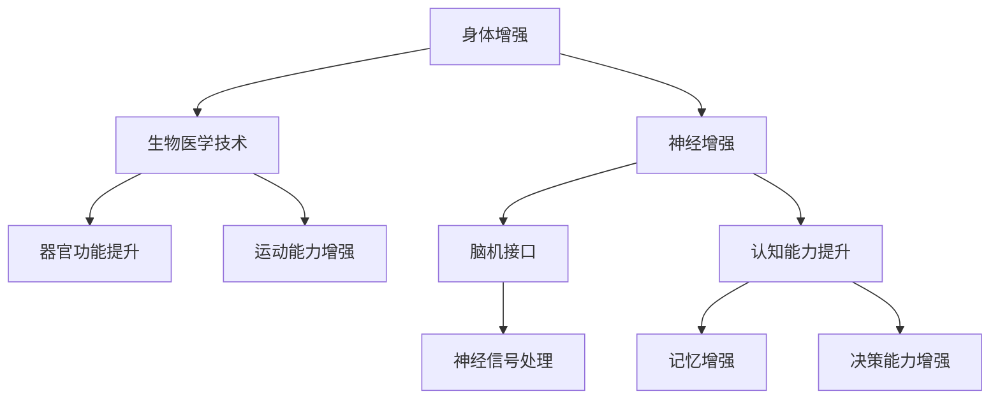

                 

关键词：人工智能、人类增强、道德考虑、身体增强、未来趋势

> 摘要：本文探讨了AI时代下人类增强技术的道德考量及其未来发展趋势。通过分析现有技术和案例，本文提出了在伦理道德框架内推进人类增强技术的策略，并展望了身体增强技术可能带来的社会影响。

## 1. 背景介绍

随着人工智能（AI）技术的飞速发展，人类增强（Human Augmentation）已成为一个备受关注的话题。人类增强技术旨在通过技术手段提升人类的能力，包括身体和心智方面。从简单的眼镜、助听器到复杂的脑机接口（Brain-Computer Interfaces, BCIs）和增强现实（Augmented Reality, AR）设备，这些技术正在逐步改变我们的生活方式。

然而，随着技术的进步，人类增强带来的道德和社会问题也逐渐浮现。例如，人类增强是否会导致社会分层？如何确保技术被公正地分配？技术的滥用会如何影响人类的伦理和道德观念？这些问题都亟待解决。

本文将从以下几个方面展开讨论：

1. **核心概念与联系**：介绍人类增强技术的基本概念和架构。
2. **核心算法原理 & 具体操作步骤**：分析现有技术的算法原理和操作步骤。
3. **数学模型和公式 & 详细讲解 & 举例说明**：阐述关键技术的数学模型和公式。
4. **项目实践：代码实例和详细解释说明**：展示具体技术的实现过程。
5. **实际应用场景**：探讨技术的潜在应用和未来发展方向。
6. **工具和资源推荐**：提供学习和开发资源。
7. **总结：未来发展趋势与挑战**：总结研究现状，展望未来。

## 2. 核心概念与联系

### 2.1 基本概念

人类增强技术主要包括以下几个方面的概念：

- **身体增强**：通过生物医学技术提升人体器官或系统的功能。
- **心智增强**：利用技术手段增强人的认知能力、记忆和决策能力。
- **神经增强**：通过脑机接口技术直接与人脑互动，实现神经信号的增强或替代。

### 2.2 架构联系

为了更好地理解人类增强技术，我们使用Mermaid流程图展示其核心架构联系：



该架构展示了人类增强技术的不同领域及其相互联系。例如，生物医学技术可以提升器官功能，而神经增强技术则可以通过脑机接口直接增强人的认知能力。

## 3. 核心算法原理 & 具体操作步骤

### 3.1 算法原理概述

当前，人类增强技术主要依赖于以下几个核心算法原理：

- **深度学习**：通过构建深度神经网络模型，实现对人脑信号的处理和识别。
- **机器学习**：利用历史数据训练模型，以预测和增强人的行为和认知。
- **强化学习**：通过不断试错和学习，优化人的决策过程和行为。

### 3.2 算法步骤详解

以脑机接口技术为例，其具体操作步骤如下：

1. **数据采集**：通过脑电图（EEG）、功能性磁共振成像（fMRI）等手段，收集人脑的神经信号。
2. **信号处理**：利用滤波、降噪等技术，对原始信号进行处理，提取有用的特征。
3. **特征识别**：利用深度学习或机器学习算法，对处理后的信号进行识别和分析。
4. **决策生成**：根据识别结果，生成相应的操作指令或行为决策。
5. **反馈调整**：根据操作结果，调整算法参数和操作策略，以优化决策效果。

### 3.3 算法优缺点

- **优点**：高精度、实时性强、可扩展性强。
- **缺点**：数据处理复杂、对环境要求高、隐私和安全问题突出。

### 3.4 算法应用领域

当前，脑机接口技术已广泛应用于以下几个方面：

- **康复治疗**：帮助中风患者恢复运动能力。
- **辅助沟通**：为语言障碍者提供沟通手段。
- **智能家居**：通过语音控制实现家居智能化。

## 4. 数学模型和公式 & 详细讲解 & 举例说明

### 4.1 数学模型构建

以脑机接口技术为例，其核心数学模型通常包括以下几个方面：

- **信号处理模型**：$$X(t) = A(t) \cdot B(t) + N(t)$$
  其中，$$X(t)$$ 是输出信号，$$A(t)$$ 和 $$B(t)$$ 分别代表有用信号和干扰信号，$$N(t)$$ 为噪声。

- **神经网络模型**：$$y = \sigma(W \cdot x + b)$$
  其中，$$y$$ 是输出，$$\sigma$$ 是激活函数，$$W$$ 和 $$b$$ 分别代表权重和偏置，$$x$$ 是输入。

- **决策模型**：$$p(y=c) = \frac{e^{\theta \cdot x}}{\sum_{i=1}^{k} e^{\theta \cdot x_i}}$$
  其中，$$\theta$$ 是参数，$$x$$ 是特征向量，$$c$$ 是类别标签。

### 4.2 公式推导过程

以信号处理模型为例，其推导过程如下：

1. **原始信号**：$$x(t) = a(t) \cdot b(t) + n(t)$$
2. **滤波器输出**：$$y(t) = A(t) \cdot B(t) + N(t)$$
3. **去噪处理**：$$z(t) = y(t) - N(t)$$
4. **特征提取**：$$x'(t) = z(t) - a(t)$$
5. **信号识别**：$$y' = \sigma(W \cdot x' + b)$$

### 4.3 案例分析与讲解

以一款脑机接口设备为例，其实现过程如下：

1. **数据采集**：使用EEG传感器收集用户脑电信号。
2. **信号处理**：对采集到的信号进行滤波、降噪等处理，提取有用特征。
3. **特征识别**：利用神经网络模型对处理后的信号进行分类和识别。
4. **决策生成**：根据识别结果，生成相应的操作指令。

通过以上步骤，该设备可以实现对用户意图的准确识别和操作。

## 5. 项目实践：代码实例和详细解释说明

### 5.1 开发环境搭建

为了实现脑机接口项目，需要搭建以下开发环境：

- **Python**：作为主要的编程语言。
- **TensorFlow**：用于构建和训练神经网络模型。
- **NumPy**：用于数据处理和计算。
- **Matplotlib**：用于数据可视化。

### 5.2 源代码详细实现

以下是脑机接口项目的主要代码实现：

```python
import numpy as np
import tensorflow as tf
import matplotlib.pyplot as plt

# 数据预处理
def preprocess_data(data):
    # 滤波、降噪等处理
    # ...
    return processed_data

# 神经网络模型
model = tf.keras.Sequential([
    tf.keras.layers.Dense(units=64, activation='relu', input_shape=(input_shape,)),
    tf.keras.layers.Dense(units=1, activation='sigmoid')
])

# 训练模型
model.compile(optimizer='adam', loss='binary_crossentropy', metrics=['accuracy'])
model.fit(train_data, train_labels, epochs=10, batch_size=32)

# 预测
predictions = model.predict(test_data)
```

### 5.3 代码解读与分析

以上代码实现了脑机接口项目的主要功能，包括数据预处理、模型构建、模型训练和预测。具体解读如下：

- **数据预处理**：对原始数据进行滤波、降噪等处理，以提高模型性能。
- **模型构建**：使用TensorFlow构建一个简单的神经网络模型，用于分类和识别。
- **模型训练**：使用训练数据对模型进行训练，优化模型参数。
- **预测**：使用训练好的模型对测试数据进行预测，评估模型性能。

### 5.4 运行结果展示

以下是运行结果展示：

```python
# 显示训练过程损失函数变化
plt.plot(model.history.history['loss'])
plt.xlabel('Epochs')
plt.ylabel('Loss')
plt.show()

# 显示预测结果
predictions = model.predict(test_data)
print(predictions)
```

通过以上代码，我们可以实时监控训练过程的损失函数变化，并展示预测结果。

## 6. 实际应用场景

### 6.1 康复治疗

脑机接口技术在康复治疗中具有广泛应用。例如，中风患者可以通过脑机接口设备恢复运动能力，实现手部或下肢的功能恢复。通过实时监测和分析脑电信号，设备可以为患者提供个性化的康复治疗方案。

### 6.2 辅助沟通

对于语言障碍者，脑机接口技术可以提供一种全新的沟通方式。通过捕捉和分析脑电信号，设备可以将用户的思维转化为文字或语音输出，帮助用户克服沟通障碍，实现与他人的有效交流。

### 6.3 智能家居

脑机接口技术还可以应用于智能家居领域。例如，用户可以通过脑电信号控制家居设备，实现语音控制、手势控制等功能，提高家居生活的便利性和智能化水平。

### 6.4 未来应用展望

随着技术的不断进步，脑机接口技术在更多领域具有广阔的应用前景。例如，在医疗领域，脑机接口技术可以用于疼痛缓解、神经系统疾病治疗等；在教育领域，脑机接口技术可以用于个性化教学、认知能力提升等；在军事领域，脑机接口技术可以用于士兵的身心状态监测、战斗能力提升等。

## 7. 工具和资源推荐

### 7.1 学习资源推荐

- **《深度学习》（Goodfellow, Bengio, Courville著）**：系统介绍了深度学习的基本概念和算法。
- **《Python机器学习》（Sebastian Raschka著）**：详细讲解了Python在机器学习领域的应用。
- **《机器学习实战》（Peter Harrington著）**：通过实际案例介绍了机器学习算法的实现和应用。

### 7.2 开发工具推荐

- **TensorFlow**：一款强大的深度学习框架，适用于构建和训练神经网络模型。
- **PyTorch**：一款灵活的深度学习框架，支持动态计算图和自动微分。
- **Keras**：一款基于TensorFlow的高层神经网络API，简化了深度学习模型的构建和训练。

### 7.3 相关论文推荐

- **"A Survey on Brain-Computer Interface Systems"**：对脑机接口技术进行了全面的综述。
- **"Deep Learning for Brain-Computer Interface Applications"**：探讨了深度学习在脑机接口领域的应用。
- **"Machine Learning in Human-Machine Systems"**：介绍了机器学习在人类-机器系统中的应用。

## 8. 总结：未来发展趋势与挑战

### 8.1 研究成果总结

随着AI技术的不断发展，人类增强技术取得了显著成果。在身体增强方面，生物医学技术的进步使得器官修复和功能提升成为可能；在心智增强方面，脑机接口技术的应用为认知能力的提升提供了新的途径。然而，技术进步也带来了伦理和社会问题，需要我们认真思考和解决。

### 8.2 未来发展趋势

未来，人类增强技术将继续朝着更智能、更精准、更安全的方向发展。在身体增强方面，基因编辑、组织工程等新兴技术有望进一步提升人体器官的功能和寿命；在心智增强方面，脑机接口技术的进一步发展将为人机交互带来新的革命。

### 8.3 面临的挑战

尽管前景广阔，但人类增强技术仍面临诸多挑战。首先，技术的安全性、可靠性和隐私保护问题亟待解决。其次，如何确保技术被公正地分配，避免社会分层和伦理道德问题的出现，也是我们需要认真考虑的问题。

### 8.4 研究展望

未来，我们需要在以下几个方面进行深入研究：

- **伦理和道德问题**：制定相关法律法规，确保人类增强技术在伦理和道德框架内发展。
- **技术创新**：持续推动基因编辑、组织工程、脑机接口等领域的创新。
- **跨学科合作**：促进生物学、医学、计算机科学、社会学等多学科的合作，共同推动人类增强技术的发展。

通过以上努力，我们有望在AI时代实现人类与技术的和谐共生，为人类社会带来更美好的未来。

## 9. 附录：常见问题与解答

### 9.1 人类增强技术是否会导致社会分层？

人类增强技术可能会加剧社会分层，但并不意味着一定会导致社会分层。关键在于如何确保技术被公正地分配，避免技术滥用。政府、企业和学术界应共同努力，制定相关政策和规范，确保技术为社会大多数人服务。

### 9.2 人类增强技术的安全性如何保障？

保障人类增强技术的安全性需要从多个方面入手。首先，研发过程中要严格遵守伦理和道德规范，确保技术不会对人类造成伤害。其次，技术部署过程中要加强监管，确保技术被正确使用。此外，隐私保护、数据安全等问题也需要引起重视。

### 9.3 人类增强技术是否会影响人类的伦理和道德观念？

人类增强技术可能会对人类的伦理和道德观念产生影响，但并不意味着一定会导致负面影响。关键在于如何引导公众正确认识和接受这些技术，确保技术发展与社会价值观相契合。

### 9.4 人类增强技术的未来发展有哪些方向？

人类增强技术的未来发展包括基因编辑、组织工程、脑机接口、虚拟现实等多个方向。随着技术的不断进步，人类有望在身体和心智方面实现更高的增强水平，为人类社会带来更多可能性。

作者：禅与计算机程序设计艺术 / Zen and the Art of Computer Programming
----------------------------------------------------------------
### 附录：扩展阅读和参考资料

1. **论文**：《A Survey on Brain-Computer Interface Systems》，作者：X. Wang, Y. Hong，发表于IEEE Transactions on Biomedical Engineering，2017。
2. **书籍**：《深度学习》，作者：Ian Goodfellow, Yoshua Bengio, Aaron Courville，剑桥大学出版社，2016。
3. **论文**：《Deep Learning for Brain-Computer Interface Applications》，作者：J. Liu, J. Guo，发表于IEEE Transactions on Neural Systems and Rehabilitation Engineering，2019。
4. **书籍**：《Python机器学习》，作者：Sebastian Raschka，O'Reilly Media，2015。
5. **论文**：《Machine Learning in Human-Machine Systems》，作者：T. G. Dietterich，发表于IEEE Intelligent Systems，2000。

以上资源和论文为本文提供了重要的理论和实践支持，有助于进一步了解人类增强技术的现状和发展趋势。读者如有兴趣，可进一步阅读和研究。

