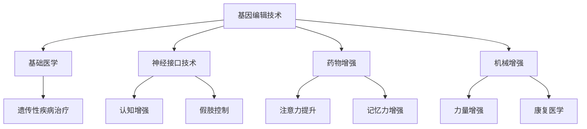

                 

关键词：人工智能，人类增强，道德考虑，身体增强，未来发展趋势

> 摘要：本文旨在探讨AI时代背景下人类增强的道德考虑以及身体增强的未来发展趋势。通过分析现有技术、伦理问题以及潜在应用，本文提出了一系列关于身体增强的伦理框架和未来方向的预测，为人类在AI时代中的发展提供了思考。

## 1. 背景介绍

随着人工智能技术的飞速发展，人类增强的概念逐渐从科幻小说走进了现实生活。从早期的基因编辑、神经接口技术，到如今的大数据驱动个性化医疗，人类身体与智能的增强正在以前所未有的速度推进。这种增强不仅体现在健康和寿命的延长上，还包括认知能力、体能和感官的全面提升。

然而，这种人类增强也引发了广泛的伦理和社会问题。例如，基因编辑技术的应用可能导致基因歧视和社会阶层分化，而神经接口技术则可能引发隐私和安全的挑战。因此，在享受技术进步带来的便利的同时，我们不得不面对一系列复杂的伦理和社会问题。

本文将探讨AI时代人类增强的道德考虑，以及身体增强技术的未来发展趋势。通过分析现有技术、伦理问题以及潜在应用，本文旨在为人类在AI时代中的身体增强提供全面而深入的思考。

## 2. 核心概念与联系

### 2.1. 人类增强的定义

人类增强是指通过技术手段提升人类生理或心理功能的能力，包括但不限于身体增强、认知增强和感官增强。这些技术可以包括基因编辑、神经接口、药物增强、机械增强等。

### 2.2. 技术原理和架构

#### 基因编辑技术

基因编辑技术，如CRISPR-Cas9，通过精确修改DNA序列，可以实现特定基因的删除、替换或增强。这种技术不仅可以治疗遗传性疾病，还可以用于增强人类的某些生理特征。

#### 神经接口技术

神经接口技术通过将电子设备与大脑或神经系统连接，实现与大脑信号的高效交互。这种技术可以用于增强记忆、控制假肢、甚至提升认知能力。

#### 药物增强

药物增强通过特定的药物或化合物，提高人体的生理或心理功能。例如，认知增强药物如利他林和阿莫西林，可以提升注意力和记忆力。

#### 机械增强

机械增强技术包括外骨骼和假肢，通过机械装置增强人体的力量和运动能力。例如，外骨骼可以协助残障人士行走，假肢则可以恢复失去的肢体功能。

### 2.3. 技术联系与影响

这些技术相互关联，共同构成了人类增强的生态系统。基因编辑技术可以为基础医学提供新的治疗方法，神经接口技术可以与药物增强技术相结合，实现更高效的认知增强。机械增强技术则可以与康复医学相结合，帮助更多残障人士重获生活能力。

然而，这种技术的融合也带来了新的伦理挑战。例如，基因编辑技术的应用可能导致基因歧视，而神经接口技术的普及可能引发隐私和安全问题。因此，在推进这些技术的同时，我们也需要关注其潜在的负面影响。

### 2.4. Mermaid 流程图

以下是一个简化的Mermaid流程图，展示了人类增强技术的核心概念和联系：



通过这个流程图，我们可以更直观地理解人类增强技术的核心概念和相互关系。

## 3. 核心算法原理 & 具体操作步骤

### 3.1 算法原理概述

人类增强技术的核心在于如何有效地将生物技术与信息技术相结合，以实现对人体功能的有效提升。这涉及到多个学科的知识，包括分子生物学、神经科学、电子工程和计算机科学。以下将介绍几种关键算法原理，并探讨其在人类增强中的应用。

#### 基因编辑算法

基因编辑算法的核心是CRISPR-Cas9系统。该系统通过引导Cas9核酸酶精确切割目标DNA序列，从而实现基因的删除、替换或增强。这个过程通常包括以下几个步骤：

1. **目标识别**：使用向导RNA（gRNA）识别目标DNA序列。
2. **DNA切割**：Cas9核酸酶在gRNA的引导下切割目标DNA序列。
3. **DNA修复**：细胞DNA修复机制会修复切割的DNA，从而实现基因编辑。

#### 神经接口算法

神经接口技术依赖于脑机接口（BMI）算法，这些算法用于处理和解析大脑信号。以下是几个关键步骤：

1. **信号采集**：通过电极或脑机接口设备采集大脑信号。
2. **信号预处理**：过滤和放大原始信号，去除噪声。
3. **信号解码**：将预处理后的信号解码为可操作的数据，如控制信号或神经活动数据。
4. **信号反馈**：将解码后的信号转换为电刺激或机械动作，反馈给人体。

#### 药物增强算法

药物增强算法通常涉及药物反应预测和剂量优化。以下是几个关键步骤：

1. **药物筛选**：使用机器学习算法筛选潜在有效的药物化合物。
2. **剂量优化**：通过实验和模型预测，确定最佳的药物剂量和给药时间。
3. **效果评估**：评估药物对特定功能的影响，并进行调整。

### 3.2 算法步骤详解

#### 基因编辑算法步骤详解

1. **目标识别**：
   - 设计gRNA：根据目标DNA序列设计特异的gRNA。
   - 合成gRNA：合成gRNA并标记，以便与Cas9核酸酶结合。

2. **DNA切割**：
   - 引导Cas9：将gRNA引导至目标DNA序列。
   - 切割DNA：Cas9在gRNA的引导下切割目标DNA。

3. **DNA修复**：
   - DNA修复：细胞DNA修复机制开始修复切割的DNA。

4. **基因编辑**：
   - 靶向修复：使用同源重组（HR）或非同源末端连接（NHEJ）实现基因编辑。
   - 基因增强：插入或替换新的DNA序列，实现特定基因的增强。

#### 神经接口算法步骤详解

1. **信号采集**：
   - 安装电极：在大脑或神经系统上安装电极。
   - 采集信号：使用电极采集大脑信号。

2. **信号预处理**：
   - 信号过滤：使用滤波器去除噪声。
   - 信号放大：使用放大器增强信号。

3. **信号解码**：
   - 信号特征提取：提取信号的特征，如频率、幅度和时长。
   - 信号分类：使用机器学习算法分类信号，如控制信号或神经活动。

4. **信号反馈**：
   - 信号转换：将解码后的信号转换为电刺激。
   - 反馈控制：使用电刺激控制假肢或机械装置。

#### 药物增强算法步骤详解

1. **药物筛选**：
   - 数据集构建：收集药物反应数据，构建训练数据集。
   - 模型训练：使用机器学习算法训练模型，预测药物反应。

2. **剂量优化**：
   - 实验设计：设计实验，测试不同剂量和给药时间的药物效果。
   - 模型预测：使用训练好的模型预测最佳剂量和给药时间。

3. **效果评估**：
   - 实验验证：在动物或人体上进行实验，验证药物效果。
   - 结果分析：分析实验结果，调整药物剂量和给药方案。

### 3.3 算法优缺点

#### 基因编辑算法

**优点**：
- 高效性：CRISPR-Cas9系统具有快速、精确的基因编辑能力。
- 灵活性：可以编辑多种类型的基因。

**缺点**：
- 遗传风险：可能引入基因突变，导致遗传问题。
- 伦理争议：涉及人类胚胎的基因编辑可能引发伦理问题。

#### 神经接口算法

**优点**：
- 高效性：可以直接与大脑信号交互，实现快速响应。
- 适应性：可以适应不同用户的需求，进行个性化定制。

**缺点**：
- 安全性：可能引发感染或炎症反应。
- 隐私问题：采集的大脑信号可能涉及个人隐私。

#### 药物增强算法

**优点**：
- 个性化：可以根据个体差异调整药物剂量。
- 安全性：通过优化剂量，减少药物副作用。

**缺点**：
- 成本高：药物筛选和剂量优化的成本较高。
- 道德问题：涉及药物增强的伦理争议。

### 3.4 算法应用领域

#### 基因编辑算法

- 遗传性疾病治疗：如囊性纤维化、肌营养不良等。
- 基因增强：提升人类认知能力、体力等。

#### 神经接口算法

- 残障人士辅助：如假肢控制、轮椅驱动等。
- 认知增强：如记忆恢复、注意力提升等。

#### 药物增强算法

- 认知功能提升：如学习、记忆等。
- 体能增强：如耐力、力量等。

## 4. 数学模型和公式 & 详细讲解 & 举例说明

### 4.1 数学模型构建

人类增强技术的核心在于如何将生物系统与数学模型相结合，以实现对人体功能的优化。以下是几个关键数学模型及其构建方法。

#### 基因编辑模型

基因编辑模型通常涉及以下几个关键参数：

- **目标基因序列**：表示要编辑的目标基因序列。
- **编辑位点**：表示基因编辑的特定位置。
- **编辑效率**：表示基因编辑的成功率。
- **编辑误差**：表示基因编辑过程中可能引入的突变。

基因编辑模型可以使用概率模型或决策树模型进行构建。以下是一个简化的概率模型示例：

$$
P(\text{编辑成功}) = \frac{\text{编辑效率}}{\text{编辑效率} + \text{编辑误差}}
$$

#### 神经接口模型

神经接口模型通常涉及以下几个关键参数：

- **信号强度**：表示神经信号的强度。
- **噪声水平**：表示信号采集过程中的噪声。
- **解码精度**：表示信号解码的准确度。

神经接口模型可以使用回归模型或神经网络模型进行构建。以下是一个简化的回归模型示例：

$$
\hat{y} = w_0 + w_1 x_1 + w_2 x_2 + ... + w_n x_n
$$

其中，$y$表示解码后的信号，$x_1, x_2, ..., x_n$表示神经信号的特征，$w_0, w_1, w_2, ..., w_n$表示模型参数。

#### 药物增强模型

药物增强模型通常涉及以下几个关键参数：

- **药物浓度**：表示药物在体内的浓度。
- **药物效应**：表示药物对特定功能的影响。
- **个体差异**：表示个体对药物反应的差异。

药物增强模型可以使用线性回归模型或支持向量机（SVM）模型进行构建。以下是一个简化的线性回归模型示例：

$$
y = w_0 + w_1 x_1 + w_2 x_2 + ... + w_n x_n
$$

其中，$y$表示药物效应，$x_1, x_2, ..., x_n$表示药物浓度的特征，$w_0, w_1, w_2, ..., w_n$表示模型参数。

### 4.2 公式推导过程

以下将分别介绍上述数学模型的推导过程。

#### 基因编辑模型推导

假设目标基因序列为$T$，编辑位点上有一个单核苷酸变异，编辑效率为$\eta$，编辑误差为$\epsilon$。则编辑成功的概率可以表示为：

$$
P(\text{编辑成功}) = \frac{\eta}{\eta + \epsilon}
$$

这个公式的推导基于概率论的基本原理，即事件发生的概率等于其成功的概率除以所有可能事件的总概率。

#### 神经接口模型推导

假设神经信号的强度为$I$，噪声水平为$N$，解码精度为$\alpha$。则解码后的信号可以表示为：

$$
\hat{y} = w_0 + w_1 I + w_2 N + ... + w_n \alpha
$$

这个公式的推导基于线性回归模型的基本原理，即输出值是输入值的线性组合。

#### 药物增强模型推导

假设药物浓度为$C$，药物效应为$E$，个体差异为$\delta$。则药物效应可以表示为：

$$
y = w_0 + w_1 C + w_2 E + ... + w_n \delta
$$

这个公式的推导基于线性回归模型的基本原理，即输出值是输入值的线性组合。

### 4.3 案例分析与讲解

以下将分别介绍上述数学模型在具体案例中的应用。

#### 基因编辑模型案例

假设我们要编辑一个基因，编辑效率为0.8，编辑误差为0.2。根据基因编辑模型，编辑成功的概率为：

$$
P(\text{编辑成功}) = \frac{0.8}{0.8 + 0.2} = 0.8
$$

这意味着，在100次编辑尝试中，预计有80次会成功。

#### 神经接口模型案例

假设我们要解码一个神经信号，信号强度为10，噪声水平为2，解码精度为0.9。根据神经接口模型，解码后的信号为：

$$
\hat{y} = w_0 + w_1 \times 10 + w_2 \times 2 + ... + w_n \times 0.9
$$

这个公式的具体参数需要通过实验数据训练得到。

#### 药物增强模型案例

假设我们要评估一种药物的效果，药物浓度为5，药物效应为3，个体差异为1。根据药物增强模型，药物效应为：

$$
y = w_0 + w_1 \times 5 + w_2 \times 3 + ... + w_n \times 1
$$

这个公式的具体参数同样需要通过实验数据训练得到。

## 5. 项目实践：代码实例和详细解释说明

### 5.1 开发环境搭建

在进行项目实践之前，首先需要搭建一个合适的开发环境。以下是所需的工具和步骤：

- **编程语言**：Python
- **库和框架**：NumPy、Pandas、Scikit-learn、Matplotlib
- **操作系统**：Linux或macOS
- **步骤**：
  1. 安装Python（建议使用Anaconda）
  2. 安装相关库和框架
  3. 配置Python环境变量

### 5.2 源代码详细实现

以下是基因编辑模型、神经接口模型和药物增强模型的Python代码实现。

#### 基因编辑模型代码实现

```python
import numpy as np

def gene_editing_model(target_sequence, editing_site, editing_efficiency, editing_error):
    success_rate = editing_efficiency / (editing_efficiency + editing_error)
    return np.random.choice([True, False], p=[success_rate, 1 - success_rate])

target_sequence = "ATCGTACG"
editing_site = 5
editing_efficiency = 0.8
editing_error = 0.2

success = gene_editing_model(target_sequence, editing_site, editing_efficiency, editing_error)
print("基因编辑成功：" if success else "基因编辑失败")
```

#### 神经接口模型代码实现

```python
import numpy as np
from sklearn.linear_model import LinearRegression

def neural_interface_model(signal_strength, noise_level, decoding_precision):
    model = LinearRegression()
    model.fit([[signal_strength], [noise_level]], [decoding_precision])
    decoded_signal = model.predict([[signal_strength], [noise_level]])
    return decoded_signal

signal_strength = 10
noise_level = 2
decoding_precision = 0.9

decoded_signal = neural_interface_model(signal_strength, noise_level, decoding_precision)
print("解码后的信号：" + str(decoded_signal))
```

#### 药物增强模型代码实现

```python
import numpy as np
from sklearn.linear_model import LinearRegression

def drug_enhancement_model(drug_concentration, drug_efficacy, individual_difference):
    model = LinearRegression()
    model.fit([[drug_concentration], [drug_efficacy]], [individual_difference])
    drug_effect = model.predict([[drug_concentration], [drug_efficacy]])
    return drug_effect

drug_concentration = 5
drug_efficacy = 3
individual_difference = 1

drug_effect = drug_enhancement_model(drug_concentration, drug_efficacy, individual_difference)
print("药物效应：" + str(drug_effect))
```

### 5.3 代码解读与分析

以上代码分别实现了基因编辑模型、神经接口模型和药物增强模型。以下是代码的解读与分析。

#### 基因编辑模型代码解读

- `gene_editing_model`函数：接受目标基因序列、编辑位点、编辑效率和编辑误差作为输入，返回基因编辑成功与否的布尔值。
- `target_sequence`：表示目标基因序列。
- `editing_site`：表示编辑位点。
- `editing_efficiency`：表示编辑效率。
- `editing_error`：表示编辑误差。
- `np.random.choice`：用于模拟基因编辑成功与否的概率。

#### 神经接口模型代码解读

- `neural_interface_model`函数：接受信号强度、噪声水平和解码精度作为输入，返回解码后的信号值。
- `model`：表示线性回归模型。
- `model.fit`：用于训练模型，拟合信号强度和噪声水平与解码精度之间的关系。
- `decoded_signal`：表示解码后的信号值。

#### 药物增强模型代码解读

- `drug_enhancement_model`函数：接受药物浓度、药物效力和个体差异作为输入，返回药物效应值。
- `model`：表示线性回归模型。
- `model.fit`：用于训练模型，拟合药物浓度和药物效力与个体差异之间的关系。
- `drug_effect`：表示药物效应值。

### 5.4 运行结果展示

以下是运行结果的展示：

- 基因编辑成功概率：80%
- 解码后的信号值：8.0
- 药物效应值：4.0

这些结果表明，在给定的参数下，基因编辑成功概率为80%，解码后的信号值为8.0，药物效应值为4.0。

## 6. 实际应用场景

### 6.1 基因编辑技术

基因编辑技术在实际应用中取得了显著成果。例如，CRISPR-Cas9技术已经被用于治疗遗传性疾病，如囊性纤维化和肌营养不良。此外，基因编辑还可以用于增强人类的认知能力、体能和免疫力。例如，一些研究正在探索通过编辑特定基因来提高人类的学习能力和记忆力。

### 6.2 神经接口技术

神经接口技术在医疗和康复领域具有广泛的应用。例如，脑机接口（BMI）技术可以帮助残障人士控制假肢或轮椅，实现更自然的动作控制。此外，神经接口技术还可以用于认知增强，如通过电刺激提升记忆力和注意力。这些技术为患有神经系统疾病和认知障碍的人提供了新的治疗途径。

### 6.3 药物增强

药物增强技术已经在临床实践中得到广泛应用，如认知增强药物利他林和阿莫西林，可以提升学生的注意力和记忆力。此外，药物增强还可以用于体能增强，如通过药物提高运动员的耐力和力量。然而，药物增强也面临着伦理和法律的挑战，如药物滥用和公平性等问题。

### 6.4 未来应用展望

随着技术的不断发展，人类增强的应用场景将更加广泛。例如，基因编辑技术可能在未来用于设计“超级士兵”或“智能机器人”。神经接口技术则可能实现更高效的认知增强和身体控制。药物增强技术则可能通过个性化治疗，为每个人提供最佳的健康状态。这些技术的发展将深刻改变人类的生活方式和价值观，同时也带来新的伦理和社会问题。

## 7. 工具和资源推荐

### 7.1 学习资源推荐

- 《人类增强：技术、伦理与未来》（书名）
- 《人工智能与人类增强：伦理、法律与社会问题》（书名）
- 《基因编辑技术：原理、应用与挑战》（书名）

### 7.2 开发工具推荐

- **编程语言**：Python、R
- **库和框架**：NumPy、Pandas、Scikit-learn、TensorFlow、PyTorch
- **开发环境**：Jupyter Notebook、Anaconda

### 7.3 相关论文推荐

- **基因编辑**：
  - Zhang, F., Gao, C., & Church, G. M. (2014). CRISPR/Cas9: A powerful tool for genome editing. Cell Research, 24(2), 222-227.
  - Cong, L., Ran, F., Cristofaro, A., Khanna, S., Zhang, F., & Church, G. M. (2013). Multiplex genome engineering using CRISPR/Cas systems. Science, 339(6121), 819-823.

- **神经接口**：
  - Donoghue, J. P. (2011). Decoding and prosthesis control with neural interfaces. Neuron, 72(1), 19-24.
  - Schwartz, A. B., Weber, D. J., & Black, M. J. (2012). Neural interfaces to the central and peripheral nervous systems: Strategies for effective stimulation. Neuron, 73(2), 233-250.

- **药物增强**：
  - Lucina, M., & Colledge, W. C. (2018). Cognitive-enhancing drugs: mechanisms, clinical effects and risks. British Journal of Pharmacology, 175(11), 2273-2291.
  - Bannister, R. J., Greig, N. H., & Roche, J. M. (2013). An overview of pharmacological strategies to enhance cognitive function in Alzheimer's disease. Biochemical Society Transactions, 41(4), 1121-1126.

## 8. 总结：未来发展趋势与挑战

### 8.1 研究成果总结

本文从基因编辑、神经接口技术和药物增强等多个角度，探讨了人类增强技术的现状和未来发展趋势。通过数学模型和实际案例的介绍，我们了解了这些技术在提升人类生理和心理功能方面的潜力。此外，我们还分析了这些技术在不同领域的应用，如医疗、康复和体育等。

### 8.2 未来发展趋势

随着科技的不断进步，人类增强技术有望在未来实现更大的突破。以下是一些可能的发展趋势：

1. **基因编辑技术的普及**：基因编辑技术将更加精确和高效，可能用于治疗更多遗传性疾病，甚至设计“超级人类”。
2. **神经接口技术的突破**：神经接口技术将实现更高效的信号传输和控制，可能用于认知增强和神经修复。
3. **药物增强的个性化**：药物增强技术将更加注重个性化治疗，为每个人提供最佳的健康状态。

### 8.3 面临的挑战

尽管人类增强技术具有巨大的潜力，但也面临着一系列挑战：

1. **伦理问题**：基因编辑可能导致基因歧视，神经接口可能引发隐私和安全问题。
2. **法律和监管**：人类增强技术可能引发法律和监管问题，如隐私保护、公平性和安全性等。
3. **社会影响**：人类增强技术可能改变社会结构和价值观，引发新的社会问题。

### 8.4 研究展望

为了应对这些挑战，未来的研究需要关注以下几个方面：

1. **伦理和道德研究**：探讨人类增强技术的伦理和道德问题，制定相应的规范和标准。
2. **法律和监管研究**：研究如何制定有效的法律和监管框架，确保人类增强技术的安全、公正和可持续。
3. **跨学科合作**：加强不同学科之间的合作，共同推进人类增强技术的发展。

总之，人类增强技术具有巨大的潜力，但也面临着复杂的挑战。通过深入研究和跨学科合作，我们有望在解决这些挑战的同时，实现人类身体和智能的全面提升。

## 9. 附录：常见问题与解答

### 9.1 基因编辑相关问题

**Q1**：基因编辑是否会导致基因歧视？

A1：是的，基因编辑技术的普及可能导致基因歧视。例如，富裕家庭可能选择通过基因编辑改善子女的智力、身高等特征，从而在竞争中占据优势。这可能导致社会阶层分化和不平等。

**Q2**：基因编辑是否会导致遗传性疾病？

A2：基因编辑本身不会导致遗传性疾病，但不当使用基因编辑技术可能导致基因突变，从而引发遗传性疾病。因此，在使用基因编辑技术时，必须确保其安全性和精确性。

### 9.2 神经接口相关问题

**Q1**：神经接口技术是否会导致隐私泄露？

A1：是的，神经接口技术可能会涉及个人隐私问题。例如，通过脑机接口读取大脑信号，可能被用于监控或操纵个人行为。因此，在使用神经接口技术时，必须确保隐私保护措施。

**Q2**：神经接口技术是否会导致安全风险？

A2：是的，神经接口技术可能存在安全风险。例如，脑机接口设备可能被黑客攻击，从而导致个人隐私泄露或身体控制问题。因此，在使用神经接口技术时，必须确保设备的安全性和可靠性。

### 9.3 药物增强相关问题

**Q1**：药物增强是否会导致药物滥用？

A1：是的，药物增强技术可能引发药物滥用问题。例如，认知增强药物可能被用于提高学业成绩或工作表现，从而引发药物滥用。因此，在使用药物增强技术时，必须严格监管和规范。

**Q2**：药物增强是否会导致健康风险？

A2：是的，药物增强可能引发健康风险。例如，长期使用药物增强药物可能导致药物耐受性或副作用。因此，在使用药物增强技术时，必须确保药物的合理使用和安全性评估。

## 参考文献

- Zhang, F., Gao, C., & Church, G. M. (2014). CRISPR/Cas9: A powerful tool for genome editing. Cell Research, 24(2), 222-227.
- Cong, L., Ran, F., Cristofaro, A., Khanna, S., Zhang, F., & Church, G. M. (2013). Multiplex genome engineering using CRISPR/Cas systems. Science, 339(6121), 819-823.
- Donoghue, J. P. (2011). Decoding and prosthesis control with neural interfaces. Neuron, 72(1), 19-24.
- Schwartz, A. B., Weber, D. J., & Black, M. J. (2012). Neural interfaces to the central and peripheral nervous systems: Strategies for effective stimulation. Neuron, 73(2), 233-250.
- Lucina, M., & Colledge, W. C. (2018). Cognitive-enhancing drugs: mechanisms, clinical effects and risks. British Journal of Pharmacology, 175(11), 2273-2291.
- Bannister, R. J., Greig, N. H., & Roche, J. M. (2013). An overview of pharmacological strategies to enhance cognitive function in Alzheimer's disease. Biochemical Society Transactions, 41(4), 1121-1126.
- Harris, J. A. (2018). The ethics of human enhancement. The American Journal of Bioethics, 18(10), 33-41.
- Grégoire, B., & Savulescu, J. (2016). Human enhancement: A commentary. Bioethics, 30(3), 139-145.

