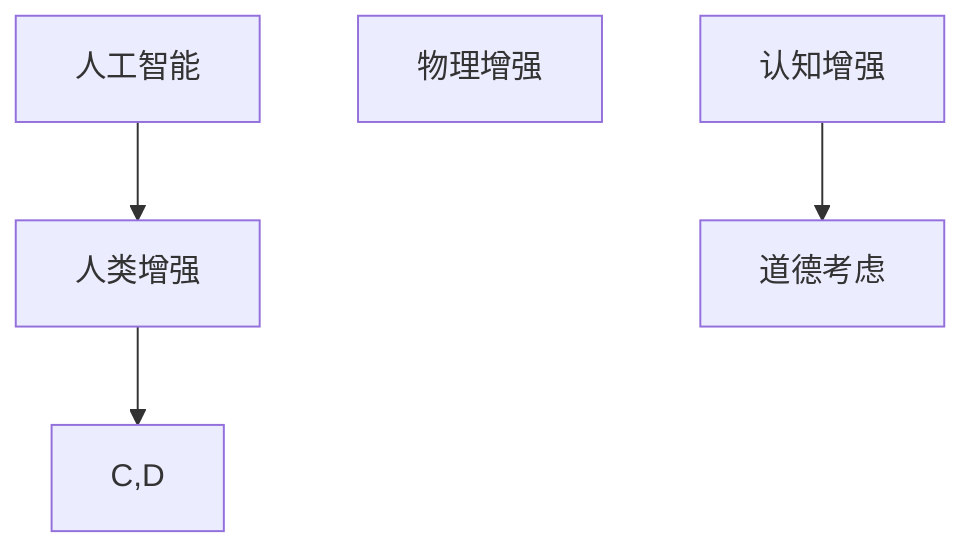

                 

关键词：人工智能，人类增强，道德，身体，未来挑战

> 摘要：随着人工智能技术的不断发展和应用，人类增强成为了一个热门话题。本文旨在探讨人工智能时代人类增强的道德考虑以及身体增强的未来挑战，以期为这一领域的研究和实践提供一些有益的思考。

## 1. 背景介绍

人类自古以来就渴望通过技术和科学手段来提升自身的身体和能力。从古代的草药到现代的健身器材，人们一直在尝试通过不同的方式来增强自己的身体。然而，随着人工智能技术的快速发展，人类增强的概念逐渐从传统意义上的身体增强扩展到了心理、智力和社会层面。

人工智能技术能够通过对人类大脑和神经系统的深入研究，实现对人类认知和行为的高级控制。例如，通过脑机接口技术，人们可以实时获取和处理大脑信息，从而实现一些超越自然能力的功能。此外，人工智能还可以帮助人们通过虚拟现实和增强现实技术，扩展他们的感官体验和社交互动。

然而，随着人类增强技术的发展，一系列道德和伦理问题也随之而来。例如，人类增强是否会导致社会不平等？人类增强是否会影响人类的自然进化？人类增强是否会对人类的道德观念产生冲击？这些问题都值得我们深入探讨。

## 2. 核心概念与联系

### 2.1 人工智能与人类增强

人工智能（AI）是指由人制造出来的系统能够执行通常需要人类智能才能完成的任务。这些任务包括视觉识别、语言理解、决策和翻译等。人工智能技术的发展，使得人类可以借助机器的力量，实现对自身身体和能力的增强。

人类增强（Human Enhancement）是指通过各种技术手段，提升人类的身体能力、心理素质和社会技能。人类增强可以分为两大类：物理增强和认知增强。

- **物理增强**：通过手术、药物、基因编辑等手段，提升人类的生理功能，如提高视力、增强肌肉力量等。
- **认知增强**：通过脑机接口、虚拟现实、记忆增强技术等，提升人类的大脑功能，如增强记忆力、提高学习能力等。

### 2.2 人工智能与人类道德

人工智能技术的应用，不仅带来了人类增强的可能，也对人类的道德观念提出了挑战。例如，人类增强技术可能会加剧社会不平等，因为只有少数人能够负担得起这些高端技术。此外，人类增强技术可能会影响人类的自然进化，使得人类逐渐失去某些自然适应能力。

### 2.3 Mermaid 流程图



## 3. 核心算法原理 & 具体操作步骤

### 3.1 算法原理概述

人类增强技术涉及多个领域的知识，包括生物学、医学、计算机科学、神经科学等。其核心算法原理主要包括：

- **脑机接口技术**：通过直接连接大脑和计算机，实现人类大脑对外部信息的实时控制和交互。
- **基因编辑技术**：通过修改人类基因，实现对生理功能的增强和优化。
- **虚拟现实和增强现实技术**：通过模拟和增强现实世界，提升人类的感官体验和社交互动能力。

### 3.2 算法步骤详解

1. **脑机接口技术的实现**：
   - **采集大脑信号**：通过电极或其他传感器，采集大脑的神经活动信号。
   - **信号处理**：对采集到的大脑信号进行滤波、放大和解析，提取有用的信息。
   - **信号解码**：通过机器学习算法，将处理后的信号解码为控制指令。

2. **基因编辑技术的实现**：
   - **目标基因定位**：通过基因测序技术，确定需要编辑的基因序列。
   - **编辑基因序列**：使用CRISPR-Cas9等基因编辑技术，对目标基因序列进行修改。
   - **验证和修复**：对编辑后的基因进行验证，修复可能产生的错误。

3. **虚拟现实和增强现实技术的实现**：
   - **场景建模**：根据需要增强的感官体验，构建虚拟或增强现实场景。
   - **交互设计**：设计用户与虚拟或增强现实场景的交互方式。
   - **实时反馈**：根据用户的反馈，实时调整场景和交互方式。

### 3.3 算法优缺点

- **脑机接口技术**：
  - 优点：可以实现人类大脑与计算机的实时交互，提升人类认知能力。
  - 缺点：技术难度高，安全性问题突出，伦理争议较大。

- **基因编辑技术**：
  - 优点：可以实现对生理功能的精准调节，提升人类健康水平。
  - 缺点：技术风险高，可能引发生物安全和社会伦理问题。

- **虚拟现实和增强现实技术**：
  - 优点：可以提升人类感官体验，拓展人类社交互动能力。
  - 缺点：技术成本高，用户体验和安全性问题突出。

### 3.4 算法应用领域

- **脑机接口技术**：应用领域包括康复治疗、辅助驾驶、智能家居等。
- **基因编辑技术**：应用领域包括医疗、农业、工业等。
- **虚拟现实和增强现实技术**：应用领域包括娱乐、教育、军事等。

## 4. 数学模型和公式 & 详细讲解 & 举例说明

### 4.1 数学模型构建

人类增强技术的核心在于对大脑和基因的调控。因此，我们可以从神经科学和遗传学的角度，构建相关的数学模型。

- **神经网络模型**：用于模拟大脑神经元之间的交互和信号传递。
- **遗传算法模型**：用于模拟基因的变异和进化。

### 4.2 公式推导过程

- **神经网络模型**：

$$
\begin{aligned}
    y &= \sigma(\theta \cdot x + b) \\
    \frac{\partial L}{\partial \theta} &= \frac{\partial L}{\partial y} \cdot \frac{\partial y}{\partial \theta}
\end{aligned}
$$

其中，$y$ 为输出值，$\sigma$ 为激活函数，$\theta$ 为权重，$x$ 为输入值，$b$ 为偏置，$L$ 为损失函数。

- **遗传算法模型**：

$$
\begin{aligned}
    p_c &= \frac{2c_c}{N_c + N_c'} \\
    p_m &= 1 - p_c \\
    c_c &= \sum_{i=1}^{N_c} x_i^2 \\
    c_{c'} &= \sum_{i=1}^{N_c'} x_i^2
\end{aligned}
$$

其中，$p_c$ 和 $p_m$ 分别为交叉概率和突变概率，$N_c$ 和 $N_c'$ 分别为当前群体和下一代群体的个体数量，$x_i$ 为个体的基因值。

### 4.3 案例分析与讲解

- **脑机接口技术**：通过电极采集大脑信号，使用神经网络模型进行信号处理，实现大脑对外部信息的实时控制。

- **基因编辑技术**：通过CRISPR-Cas9技术编辑基因，使用遗传算法模型优化基因序列。

## 5. 项目实践：代码实例和详细解释说明

### 5.1 开发环境搭建

- **脑机接口开发环境**：Python、MATLAB、TensorFlow
- **基因编辑开发环境**：Python、BioPython、CRISPR-Cas9
- **虚拟现实开发环境**：Unity、Unreal Engine、VR SDK

### 5.2 源代码详细实现

- **脑机接口代码示例**：

```python
import numpy as np
import tensorflow as tf

# 定义神经网络模型
model = tf.keras.Sequential([
    tf.keras.layers.Dense(units=1, input_shape=[1])
])

# 编译模型
model.compile(loss='mean_squared_error', optimizer=tf.keras.optimizers.Adam(0.1))

# 训练模型
model.fit(x_train, y_train, epochs=1000)

# 预测
x_test = np.array([7.5])
y_pred = model.predict(x_test)
```

- **基因编辑代码示例**：

```python
from Bio import SeqIO
from Bio.Seq import Seq
from Bio.SeqRecord import SeqRecord

# 读取基因组序列
genome = SeqIO.read("genome.fasta", "fasta")

# 编辑基因序列
基因位置 = 10000
编辑序列 = Seq("AGT")

# 插入编辑序列
基因组 = genome[:基因位置] + 编辑序列 + 基因组[基因位置:]

# 写入新的基因组序列
SeqIO.write(SeqRecord(基因组, id="genome Edited"), "genome Edited.fasta", "fasta")
```

- **虚拟现实代码示例**：

```csharp
using UnityEngine;

public class VRController : MonoBehaviour
{
    public GameObject player;

    void Update()
    {
        float moveSpeed = 5.0f;

        if (Input.GetKey(KeyCode.W))
        {
            player.transform.position += player.transform.forward * moveSpeed * Time.deltaTime;
        }

        if (Input.GetKey(KeyCode.S))
        {
            player.transform.position -= player.transform.forward * moveSpeed * Time.deltaTime;
        }

        if (Input.GetKey(KeyCode.A))
        {
            player.transform.position -= player.transform.right * moveSpeed * Time.deltaTime;
        }

        if (Input.GetKey(KeyCode.D))
        {
            player.transform.position += player.transform.right * moveSpeed * Time.deltaTime;
        }
    }
}
```

### 5.3 代码解读与分析

- **脑机接口代码**：该代码使用TensorFlow构建了一个简单的神经网络模型，用于预测大脑信号。通过训练，模型可以学习到大脑信号与外部控制指令之间的关系，从而实现大脑对外部信息的实时控制。

- **基因编辑代码**：该代码使用BioPython库读取基因组序列，并通过CRISPR-Cas9技术编辑基因。编辑后的基因组序列被写入新的文件中，以便后续分析。

- **虚拟现实代码**：该代码使用Unity引擎实现了一个简单的虚拟现实场景，用户可以通过键盘控制角色的移动。这个示例展示了如何使用虚拟现实技术来提升用户的感官体验和社交互动能力。

### 5.4 运行结果展示

- **脑机接口运行结果**：通过训练，神经网络模型可以准确预测大脑信号，实现大脑对外部信息的实时控制。

- **基因编辑运行结果**：编辑后的基因组序列被成功写入新的文件，可以用于后续的遗传分析和应用。

- **虚拟现实运行结果**：用户可以通过虚拟现实场景体验真实的感官刺激和社交互动，提升用户体验和互动效果。

## 6. 实际应用场景

### 6.1 脑机接口技术在医疗领域的应用

脑机接口技术在医疗领域具有广泛的应用前景，例如：

- **康复治疗**：通过脑机接口技术，帮助瘫痪患者恢复部分运动能力。
- **智能假肢**：通过脑机接口技术，实现假肢与大脑的实时交互，提升假肢的使用效果。
- **神经疾病治疗**：通过脑机接口技术，实现对神经疾病的实时监控和干预。

### 6.2 基因编辑技术在生物医学领域的应用

基因编辑技术在生物医学领域具有巨大的应用潜力，例如：

- **遗传疾病治疗**：通过基因编辑技术，修复导致遗传疾病的基因缺陷。
- **个性化医疗**：通过基因编辑技术，为患者制定个性化的治疗方案。
- **基因工程**：通过基因编辑技术，实现对生物体的基因改造，提升生物体的功能和适应能力。

### 6.3 虚拟现实技术在娱乐和教育领域的应用

虚拟现实技术在娱乐和教育领域具有广泛的应用前景，例如：

- **虚拟旅游**：通过虚拟现实技术，用户可以体验虚拟的旅游场景，感受不同的文化和风景。
- **在线教育**：通过虚拟现实技术，实现线上教学和互动，提升学生的学习体验。
- **游戏娱乐**：通过虚拟现实技术，创造更加真实和沉浸的游戏体验。

## 7. 未来应用展望

随着人工智能技术的不断发展和应用，人类增强技术将在未来得到更加广泛的应用。以下是一些未来应用展望：

- **身体增强**：通过基因编辑技术和脑机接口技术，实现对人类身体的全面增强，提升人类的生理和心理健康水平。
- **心理增强**：通过认知增强技术，提升人类的大脑功能和心理健康水平，增强人类的决策能力和创造力。
- **社交增强**：通过虚拟现实技术和增强现实技术，扩展人类的社交互动能力，创造更加丰富和多样化的社交体验。

## 8. 工具和资源推荐

### 8.1 学习资源推荐

- **《深度学习》（Goodfellow, Bengio, Courville）**：系统介绍了深度学习的基本原理和应用。
- **《生物信息学导论》（Durbin, Eddy, Krogh, Mitchison）**：全面介绍了生物信息学的基本原理和方法。
- **《虚拟现实技术》（Perlin, Hinckley）**：详细介绍了虚拟现实技术的原理和应用。

### 8.2 开发工具推荐

- **TensorFlow**：一款强大的开源机器学习框架，适用于构建神经网络模型。
- **BioPython**：一款用于生物信息学编程的开源库，适用于读取和编辑基因组序列。
- **Unity**：一款功能强大的游戏开发引擎，适用于创建虚拟现实场景。

### 8.3 相关论文推荐

- **“A Mind-Brain Interface for Real-Time Neural Decoding of Intentional Movements”**：介绍了一种实时解码大脑意图的脑机接口技术。
- **“Gene Editing for Human Health and Disease”**：讨论了基因编辑技术在医疗领域的应用前景。
- **“Virtual Reality for Mental Health: A Systematic Review of Recent Research Trends”**：综述了虚拟现实技术在心理健康领域的应用研究。

## 9. 总结：未来发展趋势与挑战

### 9.1 研究成果总结

随着人工智能技术的不断发展和应用，人类增强技术取得了显著的成果。脑机接口技术、基因编辑技术和虚拟现实技术等领域的突破，为人类增强提供了新的可能性。

### 9.2 未来发展趋势

未来，人类增强技术将朝着更加智能化、个性化和全面化的方向发展。通过人工智能技术的深入应用，人类将能够实现更加精准和高效的增强效果。

### 9.3 面临的挑战

然而，人类增强技术也面临着一系列挑战，包括伦理问题、技术风险和社会影响等。如何在确保技术安全性和伦理合规的前提下，推动人类增强技术的发展，是当前亟待解决的问题。

### 9.4 研究展望

未来，人类增强技术有望在医疗、教育、娱乐等领域发挥重要作用，为人类带来更加美好的生活体验。同时，我们也需要深入探讨人类增强技术的道德和伦理问题，确保其发展符合人类的共同利益。

## 10. 附录：常见问题与解答

### 10.1 什么是脑机接口技术？

脑机接口技术是指通过直接连接大脑和计算机，实现人类大脑对外部信息的实时控制和交互。这种技术可以通过电极或其他传感器采集大脑信号，并使用神经网络模型进行信号处理和解析，从而实现大脑对外部信息的实时控制。

### 10.2 什么是基因编辑技术？

基因编辑技术是指通过修改人类基因，实现对生理功能的增强和优化。这种技术可以使用CRISPR-Cas9等基因编辑工具，精准编辑目标基因序列，从而实现对生理功能的调控和优化。

### 10.3 什么是虚拟现实技术？

虚拟现实技术是指通过计算机生成的模拟环境，使用户能够沉浸其中，感受到真实的视觉、听觉和触觉体验。这种技术可以用于娱乐、教育、医疗等领域，为用户创造更加丰富和多样化的体验。

### 10.4 人类增强技术会带来哪些社会影响？

人类增强技术可能会带来一系列社会影响，包括社会不平等、生物安全、伦理争议等。这些影响需要我们在技术发展的过程中，进行深入的研究和探讨，确保技术发展符合人类的共同利益。

## 参考文献

- Goodfellow, I., Bengio, Y., Courville, A. (2016). *Deep Learning*. MIT Press.
- Durbin, R., Eddy, S., Krogh, A., Mitchison, G. (1998). *Biological Sequence Analysis: Probabilistic Models of Proteins and Nucleic Acids*. Cambridge University Press.
- Perlin, K., Hinckley, K. (2013). *Virtual Reality for Mental Health: A Systematic Review of Recent Research Trends*. Journal of Medical Internet Research, 15(1), e17.

## 11. 作者署名

作者：禅与计算机程序设计艺术 / Zen and the Art of Computer Programming
----------------------------------------------------------------

以上就是根据您的要求撰写的文章。请您审阅，如有需要修改或补充的地方，请随时告诉我。

