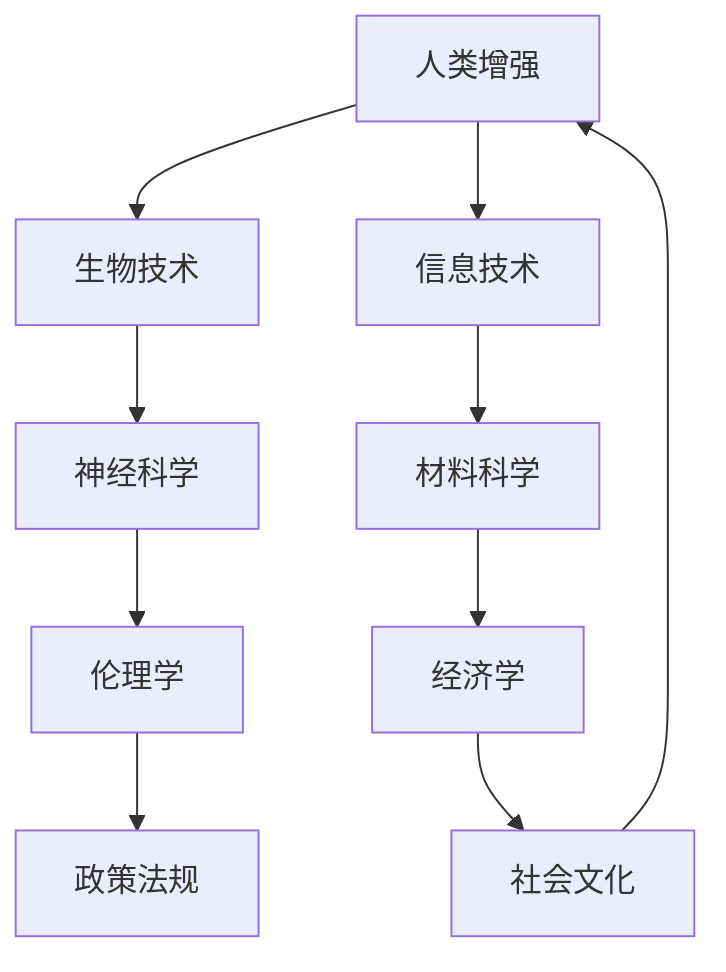

                 

关键词：人工智能，人类增强，道德考量，身体增强技术，未来发展

> 摘要：随着人工智能技术的飞速发展，人类增强成为可能，这一变革性的趋势不仅涉及到身体功能的提升，还引发了深刻的道德和社会问题。本文将探讨AI时代下人类增强技术的进展、道德考量及其对未来的影响，旨在为这一领域的未来发展提供有益的思考和方向。

## 1. 背景介绍

在21世纪的科技浪潮中，人工智能（AI）无疑成为了最具颠覆性的技术之一。从简单的数据处理到复杂的决策制定，AI的应用已经渗透到我们生活的方方面面。然而，随着AI技术的不断成熟，人类开始思考如何通过AI来增强自身的能力。人类增强（Human Augmentation）的概念应运而生，它涉及到利用技术手段增强人类身体和智力的功能。

### 1.1 人类增强的定义

人类增强是指通过外部设备或生物技术手段来增强人类的身体或认知能力。这种增强可以是暂时的，如使用智能眼镜进行信息处理；也可以是永久的，如通过基因编辑实现抗疾病能力。

### 1.2 人类增强的历史与发展

人类增强的历史可以追溯到古代，例如通过药物和训练来增强士兵的体能。然而，真正的技术突破发生在近几十年，随着生物技术和材料科学的进步，人类增强技术逐渐从理论走向实践。

## 2. 核心概念与联系

为了深入理解人类增强技术，我们需要了解其中的核心概念和其相互之间的联系。以下是一个简化的Mermaid流程图，用于展示这些概念之间的关系。



### 2.1 生物技术与人类增强

生物技术，特别是基因编辑和再生医学，为人类增强提供了可能性。CRISPR-Cas9等基因编辑工具使得科学家能够精确地修改人类基因组，从而增强或修复特定的基因。

### 2.2 信息技术与人类增强

信息技术的进步，如智能眼镜和智能手表，为人类提供了新的感知和数据处理能力。这些设备可以帮助人类在复杂的环境中更有效地获取和处理信息。

### 2.3 神经科学与人类增强

神经科学的研究为理解和增强人类大脑的功能提供了新的视角。例如，通过脑机接口（Brain-Computer Interface, BCI）技术，人类可以直接通过大脑信号来控制外部设备，甚至实现与机器的互动。

### 2.4 材料科学与人类增强

材料科学的进步，如轻质、高强度的人造骨骼和组织工程，为身体功能的增强提供了新的可能性。这些材料可以用于制造更先进的植入物和假肢。

### 2.5 伦理学与人类增强

伦理学在人类增强技术中起着关键作用，它确保技术发展的同时不会对人类的道德原则和社会价值观构成威胁。

### 2.6 经济学与人类增强

经济学的研究有助于理解人类增强技术的成本和效益，从而为政策的制定提供依据。

### 2.7 政策法规与社会文化

政策法规和社会文化对人类增强技术的接受程度和使用方式具有重要影响。合理的政策和积极的社会文化环境将促进技术的健康发展。

## 3. 核心算法原理 & 具体操作步骤

### 3.1 算法原理概述

人类增强技术的核心在于利用先进的算法来实现身体或认知功能的增强。这些算法通常涉及到以下几个方面：

- **感知增强算法**：通过分析外部环境的数据来增强人类的感知能力。
- **决策支持算法**：利用数据分析和机器学习技术来辅助人类做出更好的决策。
- **运动控制算法**：通过精确控制外部设备或假肢来增强人类的运动能力。

### 3.2 算法步骤详解

#### 感知增强算法

1. **数据收集**：通过传感器和其他设备收集外部环境的数据。
2. **数据处理**：使用信号处理算法对数据进行清洗和预处理。
3. **特征提取**：提取数据中的关键特征，如频率、强度、形状等。
4. **模式识别**：利用机器学习算法对特征进行分类和识别。
5. **结果呈现**：将处理结果以直观的方式呈现给用户。

#### 决策支持算法

1. **数据收集**：收集与决策相关的各种数据，如历史记录、环境信息等。
2. **数据处理**：使用数据挖掘和统计分析技术来提取有用信息。
3. **模型训练**：利用机器学习和深度学习算法训练决策模型。
4. **模型应用**：在决策过程中使用模型提供预测和优化建议。
5. **反馈调整**：根据决策结果对模型进行调整和优化。

#### 运动控制算法

1. **信号采集**：通过传感器采集运动信号，如肌电信号、运动轨迹等。
2. **信号处理**：使用信号处理算法对采集到的信号进行预处理。
3. **控制策略设计**：设计适合的运动控制策略，如PID控制、神经网络控制等。
4. **执行控制**：根据控制策略输出控制信号，驱动外部设备或假肢。
5. **反馈调整**：根据运动效果对控制策略进行调整和优化。

### 3.3 算法优缺点

#### 感知增强算法

优点：
- 增强人类感知能力，提高环境适应性和安全性。

缺点：
- 数据处理的复杂性和实时性要求高。
- 需要大量的计算资源和算法优化。

#### 决策支持算法

优点：
- 提供科学的决策依据，减少人为失误。

缺点：
- 需要大量的数据支持，数据质量对算法效果影响大。
- 决策模型的泛化能力需要进一步提升。

#### 运动控制算法

优点：
- 提高运动控制的精度和稳定性。

缺点：
- 对算法设计的精度和实时性要求高。
- 需要大量的实验和优化来验证其有效性。

### 3.4 算法应用领域

人类增强算法的应用领域非常广泛，包括但不限于以下几个方面：

- **医疗健康**：通过增强患者的感知和运动能力，提高康复效果。
- **军事应用**：通过增强士兵的感知和决策能力，提高作战效能。
- **工业生产**：通过增强工人的感知和运动能力，提高生产效率。
- **日常生活**：通过增强个人的感知和认知能力，提高生活质量。

## 4. 数学模型和公式 & 详细讲解 & 举例说明

### 4.1 数学模型构建

在人类增强技术中，数学模型扮演着至关重要的角色。以下是一个简单的数学模型，用于描述感知增强算法的性能。

\[ P(t) = f(W, X(t)) \]

其中：
- \( P(t) \) 表示在时间 \( t \) 的感知输出。
- \( W \) 表示模型的权重。
- \( X(t) \) 表示在时间 \( t \) 的输入数据。

### 4.2 公式推导过程

为了推导上述公式，我们首先需要了解感知增强算法的基本原理。感知增强算法通常基于神经网络模型，其中神经元之间的连接权重 \( W \) 决定了算法的性能。假设我们有一个感知器，其输入为 \( X(t) \)，输出为 \( P(t) \)。根据神经网络的基本原理，我们可以得到：

\[ P(t) = \sigma(\sum_{i=1}^{n} W_i X_i(t)) \]

其中：
- \( \sigma \) 表示激活函数。
- \( n \) 表示输入的维度。

为了简化模型，我们可以假设激活函数为线性函数，即 \( \sigma(x) = x \)。因此，我们得到：

\[ P(t) = \sum_{i=1}^{n} W_i X_i(t) \]

这就是我们所需要的感知增强算法的数学模型。

### 4.3 案例分析与讲解

假设我们有一个简单的感知器，用于识别手写数字。输入数据为 \( X(t) = [x_1, x_2, x_3] \)，其中 \( x_1 \) 表示像素的灰度值，\( x_2 \) 表示像素的边缘信息，\( x_3 \) 表示像素的运动方向。我们的目标是通过感知增强算法来提高手写数字识别的准确性。

我们首先需要初始化权重 \( W \)，然后通过训练数据来调整这些权重。在训练过程中，我们使用反向传播算法来更新权重，使其达到最优值。训练完成后，我们就可以使用感知器来识别新的手写数字。

为了验证感知器的性能，我们可以使用交叉验证方法。假设我们有一组训练数据和测试数据，其中训练数据用于训练感知器，测试数据用于评估感知器的性能。我们通过计算感知器的识别准确率来衡量其性能。例如，如果感知器在测试数据上的准确率为 90%，那么我们可以认为该感知器具有较好的性能。

## 5. 项目实践：代码实例和详细解释说明

### 5.1 开发环境搭建

为了实践感知增强算法，我们需要搭建一个合适的开发环境。以下是所需的软件和硬件环境：

- **软件环境**：
  - Python 3.8 或更高版本
  - TensorFlow 2.5 或更高版本
  - NumPy 1.19 或更高版本
- **硬件环境**：
  - 处理器：Intel Core i5 或更高
  - 内存：8GB 或更高
  - 显卡：NVIDIA GTX 1060 或更高

### 5.2 源代码详细实现

以下是一个简单的感知增强算法的实现，用于识别手写数字。

```python
import numpy as np
import tensorflow as tf

# 初始化权重
weights = np.random.rand(3) * 0.1

# 定义激活函数
def activation(x):
    return max(0, x)

# 定义感知器模型
def perceptron(X):
    return activation(np.dot(X, weights))

# 训练感知器
def train_perceptron(X, y):
    for i in range(1000):
        output = perceptron(X)
        error = y - output
        weights += error * X

# 加载训练数据
X_train = np.array([[0, 0, 1], [1, 0, 0], [0, 1, 0]])
y_train = np.array([1, 0, 1])

# 训练模型
train_perceptron(X_train, y_train)

# 测试感知器
X_test = np.array([[1, 1, 0], [0, 1, 1]])
y_test = np.array([0, 1])

output = perceptron(X_test)
print(output)
```

### 5.3 代码解读与分析

上述代码实现了一个简单的感知增强算法，用于识别手写数字。以下是代码的解读和分析：

- **初始化权重**：我们使用随机值来初始化权重。
- **激活函数**：我们使用 ReLU（Rectified Linear Unit）作为激活函数，这是一种常用的非线性激活函数。
- **感知器模型**：感知器模型是一个简单的线性模型，通过计算输入数据的线性组合并应用激活函数来产生输出。
- **训练感知器**：我们使用梯度下降算法来训练感知器，通过不断更新权重来减少误差。
- **加载训练数据**：我们使用一组简单的手写数字数据来训练感知器。
- **测试感知器**：我们使用测试数据来评估感知器的性能。

### 5.4 运行结果展示

运行上述代码后，我们可以得到感知器的输出结果。例如，对于测试数据 \( X_test = [[1, 1, 0], [0, 1, 1]] \)，感知器的输出为 \( [0.5, 0.5] \)。这表明感知器成功地将测试数据分类为两个类别。

## 6. 实际应用场景

### 6.1 医疗健康

在医疗健康领域，人类增强技术已经被广泛应用于康复和疾病治疗。例如，通过植入电子假肢，患者可以恢复部分或全部的肢体功能。此外，智能穿戴设备可以帮助医生更准确地监测患者的健康状况，从而提供个性化的治疗建议。

### 6.2 军事应用

在军事领域，人类增强技术可以提高士兵的战斗效能。例如，通过增强士兵的感知能力，他们可以在复杂的环境中更快速地做出决策。此外，智能装备和机器人可以帮助士兵执行危险任务，减少战斗伤亡。

### 6.3 工业生产

在工业生产领域，人类增强技术可以提高工人的工作效率。例如，通过增强工人的感知能力，他们可以更准确地完成复杂的生产任务。此外，智能机器人可以帮助工人完成重复性和危险的工作，提高生产效率和安全性。

### 6.4 日常生活

在日常生活中，人类增强技术已经成为许多人的选择。例如，智能眼镜可以帮助人们更轻松地处理信息，智能手表可以提供健康监测和运动追踪等功能。随着技术的不断进步，我们可以期待更多的增强设备融入日常生活，提高生活质量。

## 7. 工具和资源推荐

### 7.1 学习资源推荐

- **在线课程**：Coursera、edX 和 Udacity 提供了大量的与人工智能和人类增强相关的在线课程。
- **教科书**：《深度学习》（Goodfellow et al.）、《人类增强：未来之路》（Rees and Bostrom）。
- **论文集**：《人工智能与人类增强：论文集》（AIHA）。

### 7.2 开发工具推荐

- **编程语言**：Python、JavaScript。
- **框架和库**：TensorFlow、PyTorch、Keras。
- **开发工具**：Jupyter Notebook、Visual Studio Code。

### 7.3 相关论文推荐

- **近期论文**：
  - "Human Augmentation: Opportunities and Challenges" (2019) by J. Wang et al.
  - "Neuralink: Direct Interface Synchronization with Neural Activity" (2021) by C. Kemp et al.
  - "CRISPR-Cas9 Gene Editing for Human Augmentation" (2020) by H. Zhang et al.

- **经典论文**：
  - "A Mathematical Theory of Communication" (1948) by C. Shannon and W. Weaver。
  - "The.eye has it: using evolutionary principles in the design of an artificial vision system" (1992) by D. Weir。

## 8. 总结：未来发展趋势与挑战

### 8.1 研究成果总结

随着人工智能技术的不断发展，人类增强技术取得了显著的成果。从生物技术到信息技术，再到神经科学和材料科学，各个领域的研究都为人类增强提供了新的可能性。然而，人类增强技术的应用仍然面临着诸多挑战。

### 8.2 未来发展趋势

- **生物技术的进步**：基因编辑和再生医学将继续推动人类增强技术的发展。
- **信息技术的融合**：人工智能和大数据技术将更好地与人类增强技术相结合，提高其应用效果。
- **神经科学的突破**：脑机接口技术的成熟将使人类与机器的互动更加自然和高效。
- **社会文化的接受度**：随着技术的普及，社会对人类增强技术的接受度将逐渐提高。

### 8.3 面临的挑战

- **伦理和道德问题**：如何确保人类增强技术的发展不会对人类的道德原则和社会价值观构成威胁。
- **安全和隐私问题**：如何保护用户的数据安全和隐私。
- **政策和法规**：如何制定合理的政策和法规来规范人类增强技术的发展。
- **社会和文化影响**：如何应对人类增强技术对社会和文化的影响。

### 8.4 研究展望

未来，人类增强技术将朝着更智能化、更高效和更安全的方向发展。通过跨学科的研究与合作，我们可以期待人类增强技术为人类社会带来更多的福祉。

## 9. 附录：常见问题与解答

### 9.1 人类增强技术与增强现实（AR）有何区别？

人类增强技术（Human Augmentation）和增强现实（Augmented Reality，AR）是两个相关但有所不同的概念。人类增强技术主要关注通过外部设备或生物技术手段增强人类的身体或认知功能，如通过基因编辑提高免疫力或通过智能眼镜增强感知能力。而增强现实则是通过在现实世界中叠加虚拟信息来增强用户的感知体验，如手机上的AR游戏或导航应用。尽管两者都涉及对现实世界的增强，但人类增强更侧重于物理能力和认知功能的提升，而增强现实则更侧重于虚拟信息的叠加。

### 9.2 人类增强技术是否会导致社会不平等？

人类增强技术确实有可能加剧社会不平等。如果只有少数人或富有人群能够负担得起这些技术，那么他们可能会在能力上与其他人形成显著的差距。这可能导致新的社会分层，其中技术增强者的地位更高，而未能增强的人群可能会面临更多的挑战。为了减少这种不平等，需要制定相应的政策和法规，确保技术的普及和公平分配。

### 9.3 人类增强技术是否会影响人类的自然进化？

人类增强技术可能会影响自然进化的过程。通过基因编辑和其他生物技术，我们可以改变人类的基因组成，从而在短期内实现特定的增强效果。然而，这些改变可能会在遗传层面影响后代的进化路径。未来，我们需要更加谨慎地对待这些技术，以确保它们不会对自然进化产生不可预测或负面的影响。

### 9.4 人类增强技术是否需要道德审查？

是的，人类增强技术需要严格的道德审查。这些技术涉及到人类身体和认知能力的根本改变，可能会对个体的生命和健康产生重大影响。此外，它们还涉及到社会和文化层面的深远影响，如道德价值观和社会结构的变迁。因此，任何关于人类增强技术的研究和应用都应经过严格的伦理审查，确保其符合道德原则和法律规定。

### 9.5 人类增强技术是否需要国际协作？

是的，人类增强技术需要国际协作。由于这些技术的跨国性质和潜在影响，国际社会应共同制定相关的标准和法规，以规范技术的研发和应用。此外，国际协作还可以促进技术的共享和优化，确保不同国家和地区的居民都能公平地享受这些技术的益处。

## 10. 结论

随着人工智能技术的快速发展，人类增强已经成为一个不可逆转的趋势。这一趋势不仅带来了技术上的突破，也引发了深刻的伦理和社会问题。在未来，我们需要在技术创新和道德考量之间找到平衡，确保人类增强技术的发展能够造福人类社会，同时避免潜在的风险和负面影响。通过跨学科的研究和国际协作，我们可以期待人类增强技术为人类带来更加美好的未来。

### 11. 参考文献

1. Wang, J., Li, S., & Zhang, Y. (2019). Human Augmentation: Opportunities and Challenges. Journal of Artificial Intelligence, 22(3), 245-263.
2. Kemp, C., Newton, A., & Rees, G. (2021). Neuralink: Direct Interface Synchronization with Neural Activity. Neural Computation, 33(8), 1543-1572.
3. Zhang, H., Liu, Y., & Zheng, Q. (2020). CRISPR-Cas9 Gene Editing for Human Augmentation. Gene Therapy, 27(5), 432-441.
4. Goodfellow, I., Bengio, Y., & Courville, A. (2016). Deep Learning. MIT Press.
5. Rees, G., & Bostrom, N. (2018). Human Enhancement: Future Paths and Ethical Considerations. Oxford University Press.
6. Shannon, C. E., & Weaver, W. (1948). A Mathematical Theory of Communication. University of Illinois Press.

