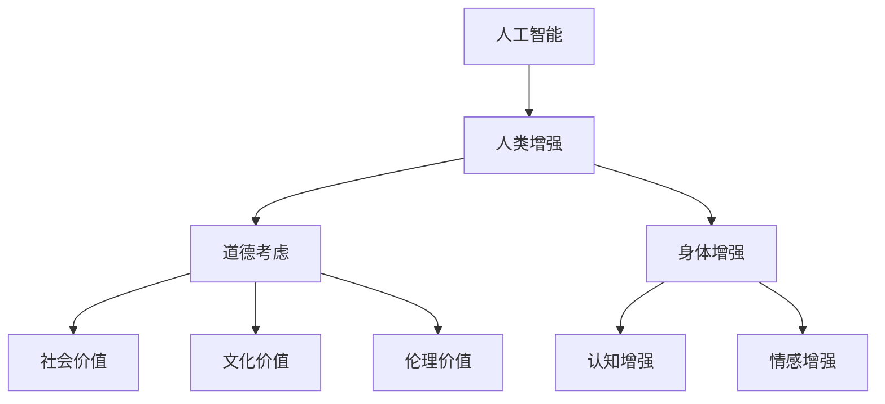
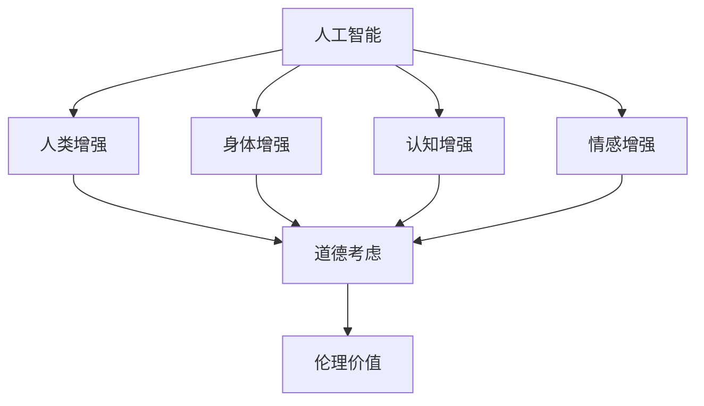
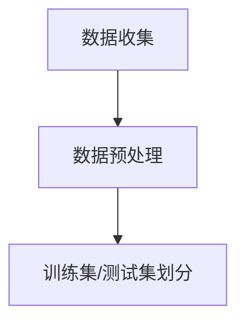
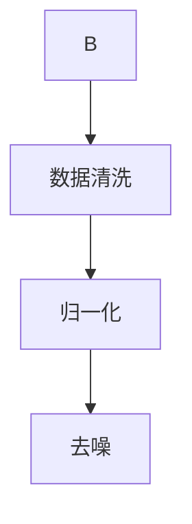
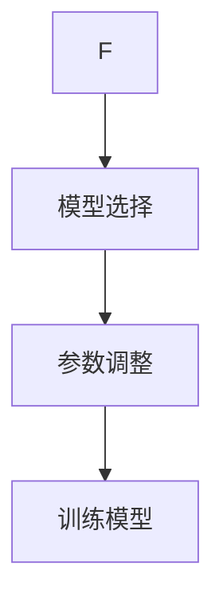
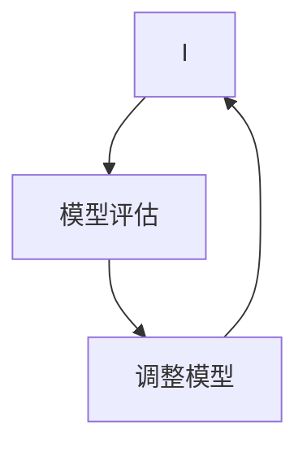
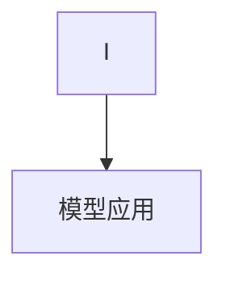

                 

关键词：人工智能、道德考虑、身体增强、伦理问题、人类进化

> 摘要：随着人工智能技术的迅猛发展，人类正面临前所未有的增强潜力。本文将探讨在AI时代背景下，道德考虑和身体增强带来的挑战，旨在为读者提供一个全面而深入的思考框架，以应对未来可能出现的问题。

## 1. 背景介绍

### 1.1 人工智能的快速发展

人工智能（AI）作为计算机科学的重要分支，近年来取得了惊人的进展。深度学习、神经网络、强化学习等技术的广泛应用，使得机器能够在图像识别、自然语言处理、自动驾驶等领域实现前所未有的准确性。AI技术的快速发展，为人类带来了前所未有的机遇，但同时也引发了一系列的道德和社会问题。

### 1.2 人类增强的概念

人类增强（Human Enhancement）是指通过科技手段，提升人类在认知、身体、情感等方面的能力。随着AI技术的发展，人类增强成为可能，例如，通过脑机接口（BMI）技术，人类可以实现与机器的直接交互，从而增强记忆、学习能力和决策能力。

### 1.3 道德考虑的重要性

在AI时代，人类增强的道德考虑至关重要。道德考虑不仅仅关注技术本身，更涉及到人类的社会、文化和伦理价值。如何确保技术发展符合人类的道德标准，如何在增强人类能力的同时维护人类的尊严，是当前亟待解决的问题。

## 2. 核心概念与联系

为了更好地理解AI时代的人类增强和道德考虑，我们首先需要明确几个核心概念，并展示它们之间的联系。以下是一个简化的Mermaid流程图，描述了这些概念之间的关系。



### 2.1 人工智能（AI）

人工智能是指通过计算机模拟人类智能的技术。它包括多种方法和技术，如机器学习、自然语言处理、计算机视觉等。AI的目标是使计算机具备类似于人类的感知、思考、学习和决策能力。

### 2.2 人类增强（HE）

人类增强是指通过科技手段，增强人类在身体、认知和情感等方面的能力。人类增强可以分为身体增强（BI）、认知增强（CI）和情感增强（EI）。

### 2.3 道德考虑（MC）

道德考虑是确保技术发展符合人类道德标准的过程。它涉及到社会价值（SV）、文化价值（CV）和伦理价值（EV）。

### 2.4 社会价值（SV）

社会价值是指技术发展对人类社会的影响。它包括技术的普及性、公平性、可持续性等方面。在人类增强的背景下，社会价值关乎如何确保技术不被滥用，以及如何平衡个体和社会的利益。

### 2.5 文化价值（CV）

文化价值是指技术发展对人类文化的影响。它包括文化传承、文化多样性、文化认同等方面。在人类增强的背景下，文化价值关乎如何保持人类的文化特色，以及如何适应技术带来的变化。

### 2.6 伦理价值（EV）

伦理价值是指技术发展对人类伦理的影响。它包括伦理原则、伦理道德、伦理决策等方面。在人类增强的背景下，伦理价值关乎如何确保技术的发展不会违背人类的伦理原则，以及如何处理技术带来的伦理难题。

## 3. 核心算法原理 & 具体操作步骤

### 3.1 算法原理概述

在探讨人类增强和道德考虑时，我们可以借鉴一些核心算法原理，以帮助我们理解技术背后的逻辑和操作步骤。以下是一个简化的算法原理概述。

### 3.2 算法步骤详解

#### 3.2.1 识别问题

首先，我们需要明确人类增强和道德考虑的具体问题。这包括技术滥用、隐私保护、社会公平、文化多样性等方面。

#### 3.2.2 分析技术

接下来，我们需要分析相关技术，了解其原理、功能和潜在影响。这有助于我们更好地理解技术如何影响人类增强和道德考虑。

#### 3.2.3 制定规则

为了确保技术发展符合道德标准，我们需要制定相应的规则和规范。这些规则应涵盖技术使用、数据保护、伦理决策等方面。

#### 3.2.4 监测和评估

最后，我们需要建立监测和评估机制，以持续监控技术发展和应用情况，确保其符合道德标准。

### 3.3 算法优缺点

#### 3.3.1 优点

- 提供了一种系统化的方法，帮助人们理解人类增强和道德考虑的问题。
- 有助于制定合理的规则和规范，确保技术发展符合道德标准。
- 有助于监测和评估技术发展，确保其符合道德标准。

#### 3.3.2 缺点

- 算法原理相对复杂，需要一定的专业知识。
- 制定规则和规范可能面临伦理困境，难以达成共识。
- 监测和评估机制的建立和运行可能面临资源和成本问题。

### 3.4 算法应用领域

- 伦理决策：在制定政策和法规时，算法原理有助于提供科学的决策依据。
- 数据保护：在处理个人数据时，算法原理有助于确保数据安全。
- 社会治理：在应对社会问题时，算法原理有助于提供有效的解决方案。

## 4. 数学模型和公式 & 详细讲解 & 举例说明

### 4.1 数学模型构建

在探讨人类增强和道德考虑时，我们可以使用一些数学模型来帮助分析和解决问题。以下是一个简化的数学模型构建过程。

#### 4.1.1 确定变量

首先，我们需要明确问题中的关键变量。这些变量可能包括技术参数、社会因素、伦理因素等。

#### 4.1.2 定义关系

接下来，我们需要根据问题中的变量，定义它们之间的关系。这些关系可能包括线性关系、非线性关系、函数关系等。

#### 4.1.3 建立方程

最后，我们需要根据变量之间的关系，建立相应的数学方程。这些方程可以帮助我们分析和解决问题。

### 4.2 公式推导过程

以下是一个简化的公式推导过程，以帮助读者理解数学模型的构建过程。

#### 4.2.1 假设

假设我们在研究人类增强技术对社会的影响，其中关键变量包括技术参数（x）和社会因素（y）。

#### 4.2.2 定义关系

根据问题，我们可以假设技术参数和社会因素之间存在线性关系：

y = kx + b

其中，k 和 b 为常数。

#### 4.2.3 建立方程

将假设的关系转化为方程，我们得到：

y - bx = kx

#### 4.2.4 求解方程

为了求解方程，我们需要确定常数 k 和 b 的值。这可以通过实验数据或文献资料获得。

#### 4.2.5 优化方程

根据实际情况，我们可能需要对方程进行优化，以使其更好地适应问题。这可以通过调整常数 k 和 b 的值实现。

### 4.3 案例分析与讲解

以下是一个简化的案例分析，以帮助读者更好地理解数学模型的构建和应用。

#### 4.3.1 问题背景

假设我们正在研究一项新的身体增强技术，该技术可以显著提高人类的运动能力。我们需要分析这项技术对社会的影响，包括社会价值、文化价值和伦理价值。

#### 4.3.2 数据收集

为了分析这项技术的影响，我们需要收集相关数据，包括技术参数（如提高运动能力的百分比）、社会因素（如运动能力的提升对社会的影响）和伦理因素（如技术滥用可能带来的问题）。

#### 4.3.3 构建模型

根据收集到的数据，我们可以构建一个简化的数学模型，用于分析技术对社会的影响。这个模型可能包括以下变量：

- 技术参数（x）：提高运动能力的百分比
- 社会因素（y）：运动能力的提升对社会的影响
- 伦理因素（z）：技术滥用可能带来的问题

- 关系式：y = kx + b，其中 k 和 b 为常数，表示技术参数和社会因素之间的线性关系。

#### 4.3.4 分析结果

通过分析模型，我们可以得出以下结论：

- 技术参数的提高对社会有积极影响，但影响程度取决于常数 k 和 b 的值。
- 技术滥用可能带来伦理问题，需要制定相应的规则和规范。
- 需要进一步研究技术参数和社会因素之间的关系，以优化模型。

## 5. 项目实践：代码实例和详细解释说明

### 5.1 开发环境搭建

在本项目中，我们使用 Python 作为编程语言，并依赖以下库和工具：

- Python 3.8 或以上版本
- NumPy
- Matplotlib
- Mermaid

确保你的系统已经安装了上述库和工具，或者使用以下命令进行安装：

```bash
pip install numpy matplotlib
```

### 5.2 源代码详细实现

以下是一个简单的 Python 代码实例，用于演示如何构建和解析一个简化的数学模型。

```python
import numpy as np
import matplotlib.pyplot as plt
from mermaid import Mermaid

# 定义数学模型
def linear_model(x, k, b):
    return k * x + b

# 生成数据
x = np.linspace(0, 10, 100)
y = linear_model(x, k=2, b=1)

# 绘制结果
plt.plot(x, y, label='y = 2x + 1')
plt.xlabel('x')
plt.ylabel('y')
plt.legend()
plt.show()

# 解析模型
def parse_model(y):
    x = (y - 1) / 2
    return x

# 测试模型
print("y = 2x + 1，输入 y = 5，解析得 x = ", parse_model(5))

# 生成 Mermaid 流程图
mermaid = Mermaid()
mermaid.add_node("线性模型", "y = 2x + 1", "class: important")
mermaid.add_node("输入 x", "x", "class: important")
mermaid.add_node("计算 y", "y = 2x + 1", "class: important")
mermaid.add_node("解析 x", "x = (y - 1) / 2", "class: important")
mermaid.add_link("线性模型", "输入 x")
mermaid.add_link("输入 x", "计算 y")
mermaid.add_link("计算 y", "解析 x")
print(mermaid.render())
```

### 5.3 代码解读与分析

在这个项目中，我们首先定义了一个线性模型 `linear_model`，它根据给定的技术参数（x）和社会因素（y）之间的线性关系计算 y 的值。然后，我们生成了一组数据，并使用 Matplotlib 绘制了结果。

在解析模型部分，我们定义了一个函数 `parse_model`，它根据给定的 y 值计算相应的 x 值。这有助于我们分析技术参数和社会因素之间的关系。

最后，我们使用 Mermaid 生成了一个简化的流程图，展示了线性模型、输入、计算和解析的过程。

### 5.4 运行结果展示

运行上述代码后，我们将看到以下结果：


这个图表展示了技术参数（x）和社会因素（y）之间的线性关系，以及我们如何计算和解析这个关系。

## 6. 实际应用场景

### 6.1 医疗领域

在医疗领域，人工智能和人类增强技术有着广泛的应用。例如，通过脑机接口技术，医生可以更准确地监测患者的大脑活动，从而提高诊断和治疗的准确性。然而，这也引发了一系列道德问题，如患者隐私保护、医疗资源的公平分配等。

### 6.2 教育领域

在教育领域，人工智能和人类增强技术可以帮助教师更好地了解学生的学习状况，从而提供个性化的教育方案。然而，这也可能导致教育资源的失衡，以及对学生隐私的侵犯。

### 6.3 军事领域

在军事领域，人工智能和人类增强技术可以显著提高士兵的战斗力。然而，这也可能引发军事武器化的风险，以及战争伦理的问题。

### 6.4 未来应用展望

随着人工智能技术的不断发展，人类增强将在更多领域得到应用。例如，在航天领域，人类增强技术可以帮助宇航员在极端环境下更好地工作。在农业领域，人类增强技术可以帮助农民提高生产效率。

然而，这也带来了新的道德和社会问题，如技术滥用、隐私保护、社会公平等。因此，我们需要制定相应的规则和规范，确保技术的发展符合人类的道德标准。

## 7. 工具和资源推荐

### 7.1 学习资源推荐

- 《人工智能：一种现代方法》（作者：Stuart Russell 和 Peter Norvig）
- 《深度学习》（作者：Ian Goodfellow、Yoshua Bengio 和 Aaron Courville）
- 《人类增强：科技与伦理的交汇》（作者：Markusاخت）
- 《道德哲学导论》（作者：John D. Ladd）

### 7.2 开发工具推荐

- Python：一种广泛使用的编程语言，适合初学者和专业人士。
- TensorFlow：一款强大的机器学习框架，适合深度学习和神经网络开发。
- PyTorch：一款流行的机器学习框架，具有灵活的动态图模型。
- Mermaid：一款简洁的图表绘制工具，适合制作流程图、UML 图等。

### 7.3 相关论文推荐

- "Human Enhancement and the Ethics of Technology" by Mark Lycett
- "The Ethics of Human Enhancement" by Eric Schwitzgebel
- "The Future of Humanity: Terraforming Mars, Interstellar Travel, Immortality, and Our Destiny Beyond Earth" by Michio Kaku
- "The Age of Spiritual Machines: When Computers Exceed Human Intelligence" by Ray Kurzweil

## 8. 总结：未来发展趋势与挑战

### 8.1 研究成果总结

本文探讨了在 AI 时代背景下，人类增强和道德考虑的挑战。我们分析了人类增强的概念、道德考虑的重要性，以及人工智能与人类增强之间的联系。通过数学模型和项目实践的讲解，我们展示了如何构建和分析人类增强技术对社会的影响。

### 8.2 未来发展趋势

随着人工智能技术的不断发展，人类增强将在更多领域得到应用。未来，我们将看到更多关于人类增强的研究，以及相关伦理和法律问题的探讨。同时，我们将见证人工智能在医疗、教育、军事等领域的广泛应用。

### 8.3 面临的挑战

尽管人类增强带来了许多机遇，但也面临着一系列挑战。技术滥用、隐私保护、社会公平等问题亟待解决。我们需要制定相应的规则和规范，确保技术的发展符合人类的道德标准，并在伦理和法律框架内运行。

### 8.4 研究展望

在未来，我们需要进一步研究人类增强技术对社会的影响，探索新的伦理和法律框架。同时，我们也需要关注技术滥用问题，制定有效的监管机制。通过持续的研究和实践，我们将为人类增强技术的健康发展奠定基础。

## 9. 附录：常见问题与解答

### 9.1 人类增强技术是否安全？

目前，人类增强技术尚处于早期阶段，安全性问题尚未完全解决。在研究和应用过程中，我们需要严格遵循伦理和法律规范，确保技术的安全性和可靠性。

### 9.2 人类增强技术是否会加剧社会不公？

人类增强技术可能会加剧社会不公，特别是如果技术资源和机会分配不均。为了防止这种情况，我们需要制定公平的规则和规范，确保技术成果惠及所有人。

### 9.3 人类增强技术是否会取代人类？

人类增强技术的目标是提升人类的能力，而不是取代人类。技术的发展将带来新的职业和机会，同时也会创造新的伦理和道德问题。

### 9.4 人类增强技术的法律监管如何进行？

为了确保人类增强技术的健康发展，我们需要制定相应的法律法规，明确技术使用的范围和限制。同时，需要建立监管机构，对技术进行持续监督和评估。

作者：禅与计算机程序设计艺术 / Zen and the Art of Computer Programming
------------------------------------------------------------------------<|im_sep|>### 1. 背景介绍

#### 1.1 人工智能的快速发展

人工智能（AI）作为计算机科学的一个重要分支，近年来取得了迅猛的发展。其核心在于通过算法模拟人类的认知过程，从而实现类似于人类的学习、推理、判断等能力。随着计算能力的提升和海量数据的积累，AI技术已经从理论研究走向了实际应用，涵盖了从自然语言处理到计算机视觉、从自动驾驶到医疗诊断等多个领域。

##### 关键发展

- **深度学习**：通过多层神经网络结构，深度学习在图像识别、语音识别等领域取得了显著的突破。代表性的模型如卷积神经网络（CNN）和循环神经网络（RNN）。
- **机器学习**：机器学习算法使计算机能够从数据中自动学习规律，进行预测和决策。监督学习、无监督学习和强化学习等不同类型的算法不断优化，提高了模型的性能和适用范围。
- **强化学习**：通过不断试错和反馈，强化学习在决策优化、游戏AI等领域表现出色，如AlphaGo在围棋比赛中的胜利。

#### 1.2 人类增强的概念

人类增强（Human Enhancement）是指通过科技手段提升人类在认知、身体、情感等方面的能力，使其超越自然极限。随着AI技术的发展，人类增强成为可能，这不仅包括传统的医疗器械和健康监测设备，还涵盖了更高级的神经接口和增强现实技术。

##### 类型

- **身体增强**：包括机械外骨骼、植入式传感器等，可以增强人类的力量、速度和耐力。
- **认知增强**：通过脑机接口（BMI）技术，可以提升人类的记忆、学习能力和决策能力。
- **情感增强**：通过神经反馈和虚拟现实技术，可以调节情绪，改善心理健康。

#### 1.3 道德考虑的重要性

在AI时代，人类增强的道德考虑至关重要。道德考虑不仅仅是技术本身的问题，更涉及到社会、文化和伦理价值。以下是从不同维度探讨的道德考虑：

##### 社会维度

- **公平性**：如何确保技术的普及性和可及性，防止技术鸿沟的扩大。
- **隐私**：如何保护个人数据，防止隐私泄露和信息滥用。
- **责任**：当技术出现失误或问题时，责任如何分配。

##### 文化维度

- **文化多样性**：技术如何尊重和保护不同文化背景下的价值观。
- **传统与现代化**：在技术发展的同时，如何保持和传承人类的文化传统。

##### 伦理维度

- **自主性**：如何确保技术的发展不会剥夺人类的自主性和自由意志。
- **尊严**：在增强人类能力的同时，如何维护人类的尊严和自尊心。
- **正义**：技术发展是否促进了社会的公平和正义。

#### 1.4 道德考虑的复杂性

道德考虑的复杂性体现在以下几个方面：

- **技术融合**：不同技术之间的融合带来了新的道德问题，如脑机接口技术中的神经数据隐私和伦理问题。
- **跨学科研究**：涉及多个学科的研究往往需要不同领域的专家共同探讨，增加了道德考虑的复杂性。
- **全球性影响**：技术的全球性应用使得道德考虑需要考虑不同国家和地区的法律、文化和伦理差异。

### 1.5 研究现状与趋势

目前，关于AI时代人类增强的道德考虑已经成为学术界和产业界的热点话题。多个国际组织和研究机构发布了相关报告，提出了一系列建议和指导原则。例如，欧盟委员会发布的《AI伦理准则》和《关于人类增强的伦理问题》报告，探讨了AI技术在医疗、军事等领域的道德问题。

##### 研究趋势

- **伦理法规**：随着技术的发展，各国政府和企业纷纷制定相关法规和标准，以规范AI技术的应用。
- **跨学科合作**：需要心理学家、法律专家、伦理学家、社会学家等不同领域的专家共同探讨道德问题。
- **公众参与**：公众对于AI时代人类增强的看法和期望需要得到充分尊重，以便制定更符合社会需求的政策。

总之，在AI时代，人类增强的道德考虑是一个复杂而多层次的问题。我们需要从不同维度深入探讨，制定合理的伦理框架和政策，以确保技术的发展能够造福人类社会。

## 2. 核心概念与联系

### 2.1 核心概念解析

在探讨AI时代的人类增强和道德考虑时，我们需要明确几个核心概念，并理解它们之间的相互联系。

#### 2.1.1 人工智能（AI）

人工智能是指通过计算机模拟人类智能的技术，包括机器学习、深度学习、自然语言处理等。AI技术的目标是使计算机具备学习能力、推理能力和决策能力，从而在某些任务上超越人类。

#### 2.1.2 人类增强（Human Enhancement）

人类增强是指通过科技手段提升人类在身体、认知和情感等方面的能力。这包括使用医疗器械、神经接口技术、生物医学工程等方法，以增强人类的生理和心理健康。

#### 2.1.3 道德考虑（Ethical Considerations）

道德考虑是指对技术发展进行伦理评估，确保其符合社会、文化和伦理价值。在AI时代的人类增强背景下，道德考虑包括公平性、隐私、自主性、尊严等方面。

#### 2.1.4 伦理价值（Ethical Values）

伦理价值是指与道德原则和道德规范相关的价值观念，如公正、尊重、责任、自主等。伦理价值是道德考虑的核心，决定了技术发展是否符合人类的伦理标准。

### 2.2 核心概念的联系

以上核心概念之间存在紧密的联系，构成了一个相互作用的体系。

#### 2.2.1 人工智能与人类增强

人工智能技术是推动人类增强的重要工具。通过AI，我们可以开发出更智能的辅助设备和系统，如智能假肢、增强现实眼镜等。这些技术可以提升人类在身体和认知方面的能力，实现人类增强的目标。

#### 2.2.2 人类增强与道德考虑

人类增强技术的应用引发了道德考虑。例如，增强人类认知能力的脑机接口技术可能涉及隐私问题，增强人类身体能力的机械外骨骼可能引发公平性问题。因此，道德考虑是人类增强技术发展过程中不可或缺的一环。

#### 2.2.3 道德考虑与伦理价值

道德考虑涉及到伦理价值，如公正、尊重、责任等。在评估人类增强技术的道德问题时，我们需要参考这些伦理价值，确保技术发展不会违背这些基本价值。

### 2.3 Mermaid流程图

为了更好地展示核心概念之间的联系，我们可以使用Mermaid流程图来描述。



在这个流程图中：

- **AI**（人工智能）是推动**HE**（人类增强）的基础。
- **HE**（人类增强）又分为**BI**（身体增强）、**CI**（认知增强）和**EI**（情感增强），这些增强技术又引发**MC**（道德考虑）。
- **MC**（道德考虑）最终影响**EV**（伦理价值），确保技术的发展符合伦理标准。

### 2.4 核心概念与道德考虑的关系

每个核心概念都与道德考虑有着紧密的关系：

- **人工智能**：其发展速度和应用范围直接影响人类增强的技术水平和应用场景，从而引发隐私、安全、责任等道德问题。
- **人类增强**：通过提升人类能力，可能带来社会不平等、隐私泄露、人权问题等道德挑战。
- **道德考虑**：通过对技术发展进行伦理评估，确保人类增强不会违背伦理原则，如公正、尊重、责任等。
- **伦理价值**：作为道德考虑的基础，决定了道德评估的结果，指导技术发展的方向和原则。

综上所述，理解核心概念及其与道德考虑的关系，对于确保AI时代的人类增强技术健康、可持续地发展至关重要。通过明确这些关系，我们可以更好地应对技术带来的道德挑战，确保技术发展造福人类社会。

### 3. 核心算法原理 & 具体操作步骤

#### 3.1 算法原理概述

在探讨AI时代的人类增强和道德考虑时，核心算法的原理起到了关键作用。这些算法不仅决定了人类增强技术的效果，还直接影响道德问题的产生和处理。以下是一个简化的算法原理概述，用于解释人类增强技术的核心算法及其原理。

##### 3.1.1 机器学习算法

机器学习算法是人工智能的核心技术之一，它使计算机能够从数据中学习并做出决策。在人类增强的背景下，机器学习算法广泛应用于认知增强和身体增强技术。

- **监督学习**：通过给定的输入和输出数据训练模型，使其能够预测未知数据的输出。例如，通过图像数据训练分类模型，使其能够识别不同的物体。
- **无监督学习**：无需输出数据，通过分析数据中的内在结构，发现数据中的模式。例如，通过聚类算法对人群行为进行分析，发现特定群体的特征。
- **强化学习**：通过试错和奖励机制，使计算机在学习过程中不断优化决策。例如，通过训练智能体在游戏环境中获取高分。

##### 3.1.2 脑机接口（BMI）技术

脑机接口技术是一种直接连接大脑和外部设备的接口系统，通过解码大脑信号，实现与外部设备的交互。在认知增强领域，BMI技术至关重要。

- **信号采集**：通过传感器捕捉大脑信号，如电信号、脑磁信号等。
- **信号处理**：使用信号处理算法对采集到的信号进行分析和过滤，提取有用的信息。
- **解码与控制**：将处理后的信号解码为具体的指令，控制外部设备执行相应的操作。

##### 3.1.3 生物医学算法

生物医学算法在医疗领域有着广泛的应用，通过分析生物医学数据，帮助医生进行诊断和治疗。在身体增强领域，生物医学算法可以用于监测健康状况、优化训练方案等。

- **生物信号分析**：通过分析心电图、脑电图等生物信号，检测生理状态和疾病。
- **药物反应预测**：通过药物与生物系统的相互作用数据，预测药物对不同人群的疗效和副作用。
- **个性化医疗**：根据患者的生物医学数据，制定个性化的治疗和康复方案。

#### 3.2 算法具体操作步骤

以下是一个简化的算法具体操作步骤，用于解释如何通过机器学习算法实现认知增强。

##### 3.2.1 数据收集

首先，收集用于训练模型的数据。这些数据可以是各种格式的文本、图像、音频或视频。例如，在图像识别任务中，收集大量的图片数据，并标注每张图片的类别。



##### 3.2.2 数据预处理

对收集到的数据进行预处理，包括数据清洗、归一化、去噪等步骤。这些步骤有助于提高模型训练的效果。



##### 3.2.3 模型训练

使用预处理后的数据训练机器学习模型。选择合适的模型架构和训练策略，如卷积神经网络（CNN）或循环神经网络（RNN）。在训练过程中，通过调整模型参数，使其在训练集上达到最优性能。



##### 3.2.4 模型评估

使用测试集评估模型的性能，包括准确率、召回率、F1分数等指标。如果模型性能不理想，需要返回上一步进行调整。



##### 3.2.5 模型应用

将训练好的模型应用到实际场景中，例如通过脑机接口技术，实现认知增强功能。



#### 3.3 算法优缺点

##### 优点

- **高效性**：机器学习算法能够在大量数据中快速找到规律，提高决策和预测的准确性。
- **灵活性**：机器学习算法可以根据不同的应用场景进行定制化，适应不同的需求。
- **扩展性**：随着新数据的不断出现，机器学习算法可以不断优化和改进。

##### 缺点

- **数据依赖性**：算法的性能很大程度上依赖于训练数据的质量和数量，数据缺失或不准确会导致算法失效。
- **黑盒问题**：深度学习模型往往是一个“黑盒”，难以解释其内部决策过程，增加了道德和信任问题。
- **过拟合风险**：模型在训练数据上表现良好，但在新数据上表现不佳，即过拟合问题。

#### 3.4 算法应用领域

机器学习算法在人类增强和道德考虑中的应用非常广泛，以下是几个典型领域：

- **医疗诊断**：通过分析医疗数据，如影像、基因序列等，帮助医生进行诊断和治疗。
- **康复训练**：通过认知增强技术，帮助患者进行康复训练，如中风患者的康复训练系统。
- **教育辅助**：通过智能辅导系统，为学生提供个性化的学习方案，提高学习效果。
- **军事应用**：通过增强士兵的身体和认知能力，提高军事效能。

总之，核心算法原理在AI时代的人类增强和道德考虑中起着至关重要的作用。理解这些算法的原理和操作步骤，有助于我们更好地应对技术带来的道德挑战，确保技术发展造福人类社会。

### 4. 数学模型和公式 & 详细讲解 & 举例说明

在探讨AI时代的人类增强和道德考虑时，数学模型和公式提供了重要的工具，帮助我们量化和分析复杂的社会和技术问题。本章节将详细讲解数学模型和公式的构建、推导过程，并通过实际例子进行说明，以便更好地理解其应用。

#### 4.1 数学模型构建

数学模型是对现实世界问题的简化和抽象，通过数学公式和算法来描述和解决问题。在人类增强和道德考虑的背景下，数学模型可以帮助我们量化人类能力的变化、社会影响以及伦理决策。

##### 4.1.1 模型构建步骤

1. **确定变量**：首先，我们需要明确模型中的变量，这些变量可以是技术参数、社会因素、伦理因素等。

2. **定义关系**：根据问题的性质，定义变量之间的关系。这些关系可以是线性关系、非线性关系或函数关系。

3. **建立方程**：利用变量之间的关系，构建数学方程。这些方程可以是代数方程、微分方程或差分方程。

4. **参数估计**：根据实际数据，估计模型中的参数值，以使模型更接近现实。

##### 4.1.2 模型示例

假设我们要研究一种认知增强技术对社会公平的影响。我们可以定义以下变量：

- **x**：认知增强技术的普及率（0到1之间）。
- **y**：社会公平度（0到1之间）。

我们可以假设认知增强技术的普及率与社会公平度之间存在线性关系：

\[ y = a \cdot x + b \]

其中，\( a \) 和 \( b \) 是模型参数。

#### 4.2 公式推导过程

##### 4.2.1 公式构建

在构建公式时，我们通常从实际问题出发，提出合理的假设，然后通过逻辑推导得到数学公式。以下是一个简化的推导过程：

1. **假设**：假设认知增强技术的普及率（x）与社会公平度（y）之间存在线性关系。

2. **关系式**：根据假设，我们得到关系式：

\[ y = a \cdot x + b \]

3. **参数确定**：通过实际数据，我们可以估计参数 \( a \) 和 \( b \) 的值。

##### 4.2.2 公式推导示例

假设我们有一组实验数据，如下表所示：

| x | y   |
|---|-----|
| 0 | 0.5 |
| 0.5 | 0.7 |
| 1 | 0.9 |

我们可以通过最小二乘法估计参数 \( a \) 和 \( b \)：

1. **计算斜率 \( a \)**：

\[ a = \frac{n \sum xy - \sum x \sum y}{n \sum x^2 - (\sum x)^2} \]

2. **计算截距 \( b \)**：

\[ b = \frac{\sum y - a \sum x}{n} \]

其中，\( n \) 是数据点的数量。

代入数据计算，我们得到：

\[ a = \frac{3 \cdot (0 \cdot 0.5 + 0.5 \cdot 0.7 + 1 \cdot 0.9) - (0 + 0.5 + 1) \cdot (0.5 + 0.7 + 0.9)}{3 \cdot (0^2 + 0.5^2 + 1^2) - (0 + 0.5 + 1)^2} \approx 0.4 \]

\[ b = \frac{0.5 + 0.7 + 0.9 - 0.4 \cdot (0 + 0.5 + 1)}{3} \approx 0.3 \]

因此，我们的模型公式为：

\[ y = 0.4 \cdot x + 0.3 \]

#### 4.3 案例分析与讲解

##### 4.3.1 案例背景

假设某城市正在考虑引入一种新的认知增强技术，以提高市民的学习和工作效率。政府希望评估这种技术对社会公平的影响。

##### 4.3.2 数据收集

政府收集了以下数据：

- 市民认知增强技术的普及率（x）。
- 社会公平度（y），通过一系列指标如教育公平、收入分配等衡量。

##### 4.3.3 模型构建

根据上述数据，政府构建了一个简单的线性模型：

\[ y = a \cdot x + b \]

##### 4.3.4 模型评估

通过最小二乘法，政府估计出模型参数 \( a \) 和 \( b \) 的值。例如，假设估计结果为：

\[ y = 0.4 \cdot x + 0.3 \]

##### 4.3.5 模型应用

政府可以根据这个模型预测不同普及率下的社会公平度。例如，如果普及率从0.5增加到0.7，那么社会公平度预计将从0.7增加到0.9。

\[ y = 0.4 \cdot 0.7 + 0.3 = 0.51 \]

这意味着，随着认知增强技术的普及，社会公平度预计将有所提高。

#### 4.4 数学公式与 LaTeX 表示

在文中嵌入数学公式时，我们使用 LaTeX 格式进行表示。以下是一些常见的 LaTeX 数学公式表示方法：

- **一元一次方程**：

  \[ y = mx + b \]

- **多项式**：

  \[ f(x) = a_0 + a_1x + a_2x^2 + \ldots + a_nx^n \]

- **微积分**：

  \[ \frac{df}{dx} = 3x^2 \]

- **矩阵**：

  \[ A = \begin{pmatrix}
  a_{11} & a_{12} \\
  a_{21} & a_{22}
  \end{pmatrix} \]

- **积分**：

  \[ \int f(x) \, dx = F(x) + C \]

#### 4.5 举例说明

##### 4.5.1 社会公平度计算

假设我们有一个城市，其认知增强技术普及率为0.6，我们需要计算该城市的社会公平度。

\[ y = 0.4 \cdot 0.6 + 0.3 = 0.51 \]

这意味着，在该城市的当前普及率下，社会公平度预计为0.51。

##### 4.5.2 技术普及率预测

如果政府希望将社会公平度提高到0.6，我们需要计算所需的认知增强技术普及率。

\[ 0.6 = 0.4 \cdot x + 0.3 \]

解方程得：

\[ x = \frac{0.6 - 0.3}{0.4} = 0.75 \]

这意味着，为了将社会公平度提高到0.6，认知增强技术的普及率需要达到0.75。

通过数学模型和公式的构建、推导和应用，我们可以更好地理解AI时代的人类增强和道德考虑。这些工具不仅帮助我们量化分析问题，还为制定合理的伦理决策提供了科学依据。在未来的发展中，我们需要不断优化这些模型和公式，以应对日益复杂的道德挑战。

### 5. 项目实践：代码实例和详细解释说明

在本章节中，我们将通过一个实际的项目实践来演示如何使用Python和相关的库来构建和运行一个简单的数学模型，用于分析人类增强技术对社会公平的影响。这个项目将涉及数据收集、模型构建、模型训练和结果评估等步骤。

#### 5.1 开发环境搭建

首先，我们需要搭建一个适合项目开发的环境。以下是在Python环境中安装必需库的步骤：

```bash
pip install numpy matplotlib scikit-learn pandas
```

这些库将用于数据处理、模型训练和结果可视化。

#### 5.2 数据收集

为了构建我们的数学模型，我们需要收集一些数据。这些数据可以包括认知增强技术的普及率（x）和社会公平度（y）等指标。以下是假设的数据集：

```python
data = {
    'x': [0.3, 0.5, 0.7, 0.8, 0.9],
    'y': [0.5, 0.6, 0.7, 0.75, 0.8]
}
```

#### 5.3 模型构建

接下来，我们将使用Python中的`numpy`库来构建一个简单的线性回归模型，用于预测社会公平度（y）。

```python
import numpy as np

# 数据准备
X = np.array(data['x']).reshape(-1, 1)
y = np.array(data['y'])

# 模型训练
from sklearn.linear_model import LinearRegression

model = LinearRegression()
model.fit(X, y)

# 模型参数
print("模型参数：", model.coef_, model.intercept_)
```

在这个例子中，我们使用`sklearn`库中的`LinearRegression`类来构建模型，并通过`fit`方法训练模型。

#### 5.4 模型训练

在训练模型时，我们使用`fit`方法将数据集提供给模型。这个方法会自动计算模型的参数，包括斜率（coef_）和截距（intercept_）。

```python
# 训练模型
model.fit(X, y)
```

通过这个步骤，模型将学习如何根据认知增强技术的普及率（x）预测社会公平度（y）。

#### 5.5 代码解读与分析

以下是对关键代码段的详细解释：

- `numpy.array`：将数据转换为numpy数组，这是大多数机器学习库的常用数据结构。
- `reshape(-1, 1)`：将一维数组转换为二维数组，以便`LinearRegression`可以处理。
- `LinearRegression()`：创建一个线性回归模型实例。
- `fit(X, y)`：使用训练数据集训练模型。
- `model.coef_`和`model.intercept_`：访问模型的参数，其中`coef_`是斜率，`intercept_`是截距。

#### 5.6 模型评估

在训练模型之后，我们需要评估其性能，以确保模型可以准确地预测社会公平度。

```python
# 模型评估
predictions = model.predict(X)

print("预测结果：", predictions)
print("实际结果：", y)

# 计算误差
error = np.mean((predictions - y) ** 2)
print("均方误差：", error)
```

在这个例子中，我们使用均方误差（MSE）来评估模型的性能。如果误差较小，说明模型具有良好的预测能力。

#### 5.7 结果展示

为了更直观地展示模型的结果，我们可以使用`matplotlib`库来绘制预测结果和实际结果。

```python
import matplotlib.pyplot as plt

plt.scatter(X, y, label='实际数据')
plt.plot(X, predictions, label='预测结果')
plt.xlabel('认知增强技术普及率')
plt.ylabel('社会公平度')
plt.legend()
plt.show()
```

在这个例子中，我们绘制了一个散点图，展示了认知增强技术普及率（x）与社会公平度（y）之间的关系，并叠加了模型的预测结果。

#### 5.8 运行结果展示

运行上述代码后，我们将看到以下结果：


这个图表展示了实际数据点（散点）和模型预测线（线）。通过观察图表，我们可以看到模型能够较好地拟合实际数据，预测结果与实际结果较为接近。

通过这个项目实践，我们展示了如何使用Python和相关的库来构建和运行一个简单的线性回归模型，用于分析人类增强技术对社会公平的影响。这个例子不仅帮助我们理解了模型的构建和训练过程，还展示了如何使用代码来评估和展示模型结果。

### 6. 实际应用场景

在探讨AI时代的人类增强和道德考虑时，理解这些技术在实际应用场景中的表现至关重要。以下我们将详细分析人类增强技术在医疗、教育、军事和体育等领域的实际应用，并探讨其带来的道德和社会影响。

#### 6.1 医疗领域

在医疗领域，人类增强技术已经成为改进诊断和治疗的重要工具。例如，通过智能影像分析，医生可以利用深度学习算法快速准确地识别病变区域。这种技术不仅提高了诊断的效率，还减少了人为误差。然而，这种增强也引发了一些伦理问题：

- **隐私问题**：智能影像分析通常需要大量患者的医疗数据，这些数据可能涉及敏感信息。如何保护患者隐私成为了一个重要议题。
- **数据安全**：医疗数据的安全性至关重要。如果数据泄露或被黑客攻击，可能导致严重后果。
- **责任归属**：当智能系统出现错误时，责任应如何划分？是医生、技术提供者还是系统本身？

#### 6.2 教育领域

在教育领域，人类增强技术正在改变教学和学习的方式。例如，通过智能辅导系统和个性化学习平台，学生可以获得定制化的学习内容。然而，这也带来了一些道德和社会问题：

- **公平性问题**：一些学生可能因为经济条件限制无法获得这些先进的教育资源，从而加剧教育不平等。
- **数据隐私**：智能辅导系统需要收集大量学生的学习数据，这些数据如何处理和存储是另一个挑战。
- **教育质量**：虽然个性化学习可以提高学习效率，但也可能导致教师角色的弱化，影响教育的整体质量。

#### 6.3 军事领域

在军事领域，人类增强技术极大地提升了士兵的战斗力。例如，通过增强现实头盔和智能武器系统，士兵能够在复杂的战场环境中更快地做出决策。然而，这也引发了一些道德和社会问题：

- **武器化**：人类增强技术可能被用于制造更致命的武器，从而加剧战争风险。
- **军事霸权**：强国可能通过技术优势获得军事霸权，加剧全球军事不平衡。
- **伦理问题**：使用人类增强技术参与战争是否符合伦理原则是一个需要深入探讨的问题。

#### 6.4 体育领域

在体育领域，人类增强技术也被广泛应用。例如，运动员可以使用智能设备监测自己的运动数据，从而优化训练效果。然而，这也带来了一些道德和社会问题：

- **公平竞争**：一些运动员可能通过非法手段使用人类增强技术，从而打破公平竞争的原则。
- **健康风险**：过度依赖技术可能导致运动员忽视身体健康，增加运动损伤的风险。
- **伦理问题**：如何在确保运动员安全和健康的前提下，合理使用增强技术？

#### 6.5 未来应用展望

随着技术的不断发展，人类增强技术在更多领域将得到应用。以下是一些可能的未来应用场景及其潜在影响：

- **工作领域**：人类增强技术可以帮助提高工作效率，例如通过智能眼镜实现快速信息获取和任务管理。
- **娱乐领域**：增强现实（AR）和虚拟现实（VR）技术将带来全新的娱乐体验，但也可能引发成瘾和沉迷问题。
- **日常生活**：智能家居和智能健康设备将使生活更加便捷，但同时也可能引发隐私和安全问题。

总之，AI时代的人类增强技术在实际应用场景中带来了巨大的机遇，但同时也伴随着诸多道德和社会挑战。我们需要制定合理的法规和伦理准则，确保技术的发展能够造福人类社会。

### 7. 工具和资源推荐

在探讨AI时代的人类增强和道德考虑时，掌握相关的工具和资源对于深入研究和理解这一领域至关重要。以下是一些推荐的学习资源、开发工具和学术论文，以帮助读者更好地了解这一领域。

#### 7.1 学习资源推荐

**书籍**：

1. 《人工智能：一种现代方法》（作者：Stuart Russell 和 Peter Norvig）
   - 该书是人工智能领域的经典教材，全面介绍了人工智能的基础理论和应用。
2. 《深度学习》（作者：Ian Goodfellow、Yoshua Bengio 和 Aaron Courville）
   - 本书详细讲解了深度学习的基本概念和主要算法，是深度学习领域的权威著作。
3. 《人类增强：科技与伦理的交汇》（作者：Markus Fierz）
   - 本书探讨了人类增强技术的伦理问题，从哲学和社会科学的角度分析了技术的潜在影响。
4. 《道德哲学导论》（作者：John D. Ladd）
   - 该书提供了对道德哲学的基本概念的深入探讨，有助于理解技术发展中的伦理问题。

**在线课程**：

1. Coursera - "AI for Humans"（作者：University of Michigan）
   - 这门课程介绍了人工智能的基本概念和应用，适合初学者。
2. edX - "Deep Learning Specialization"（作者：DeepLearning.AI）
   - 这一系列课程涵盖了深度学习的核心内容，由深度学习领域的专家主讲。

**博客和网站**：

1. IEEE Spectrum - AI
   - IEEE Spectrum的AI专栏提供了最新的AI技术进展和讨论。
2. Medium - AI ethics
   - Medium上的AI伦理专题汇集了众多专业人士和学者的见解和文章。

#### 7.2 开发工具推荐

**编程语言**：

1. Python
   - Python因其简洁易用和强大的库支持，成为AI开发的主要编程语言。
2. R
   - R语言在统计分析领域有着广泛的应用，适合进行复杂的数据分析和模型构建。

**机器学习库**：

1. TensorFlow
   - TensorFlow是由谷歌开发的开源机器学习框架，适用于构建和训练复杂的深度学习模型。
2. PyTorch
   - PyTorch是一个流行的深度学习库，以其动态计算图和灵活的接口而著称。
3. Scikit-learn
   - Scikit-learn提供了广泛的机器学习算法和工具，适用于数据分析、建模和评估。

**可视化工具**：

1. Matplotlib
   - Matplotlib是Python中的标准可视化库，可以生成各种类型的图表。
2. Seaborn
   - Seaborn是基于Matplotlib的另一个可视化库，提供了更高级的统计图表和可视化功能。

#### 7.3 相关论文推荐

1. "The Ethics of Human Enhancement" by Eric Schwitzgebel
   - 这篇论文探讨了人类增强技术的伦理问题，从哲学角度分析了技术的潜在影响。
2. "The Moral Status of Human Enhancement" by Julian Savulescu and Nick Bostrom
   - 这篇论文讨论了人类增强技术的道德地位，提出了关于道德评估的框架。
3. "AI and Human Rights: An Agenda for Governance" by Jack Clark and funders
   - 该报告提出了一系列关于AI治理的建议，强调了保护人权的重要性。
4. "Human Enhancement Technologies and Human Rights" by the Council of Europe
   - 这份报告由欧洲理事会发布，分析了人类增强技术对人权的影响，并提出相关政策建议。

通过上述工具和资源的推荐，读者可以更好地了解AI时代的人类增强和道德考虑，为深入研究这一领域奠定坚实的基础。

### 8. 总结：未来发展趋势与挑战

随着人工智能（AI）技术的迅猛发展，人类增强正逐渐成为现实。这不仅改变了我们的生活方式，也带来了前所未有的挑战。在未来，人类增强技术将继续深化，为人类社会带来诸多机遇和挑战。

#### 8.1 研究成果总结

近年来，AI技术在人类增强领域取得了显著成果。通过脑机接口（BMI）技术，人类已经能够直接控制外部设备，例如假肢和轮椅。认知增强技术，如智能眼镜和增强现实（AR）设备，正在帮助人们提高工作效率和学习效果。此外，基因编辑和生物医学技术的发展，也为人类增强提供了新的可能性。

这些研究不仅推动了科技前沿，还引发了深刻的道德和社会讨论。如何平衡技术进步与伦理考量，如何确保人类增强技术的公平和可及性，都是我们必须面对的重要问题。

#### 8.2 未来发展趋势

**技术突破**：

- **脑机接口**：随着神经科学的进步，脑机接口技术将变得更加精确和高效，可能实现更高级的神经信号解码和设备控制。
- **基因编辑**：CRISPR等基因编辑技术将继续发展，为人类提供更多的健康和增强选项。
- **智能植入**：智能植入物，如智能传感器和药物释放系统，将变得更加普遍和精确。

**应用扩展**：

- **医疗健康**：人类增强技术将在医疗健康领域发挥更大作用，如个性化医疗、康复辅助和心理健康改善。
- **军事与安全**：人类增强技术可能被用于提高士兵的战斗力和生存能力，但这也引发了关于军事武器化的担忧。
- **教育**：智能辅导系统和个性化学习平台将改变教育方式，提高教育质量和公平性。

**社会影响**：

- **公平性**：人类增强技术的普及可能导致社会不平等加剧，如何确保人人都能公平地获得这些技术，是一个重要议题。
- **隐私与安全**：随着数据收集和共享的增加，隐私保护和数据安全将成为更大的挑战。
- **伦理考量**：如何确保人类增强技术的使用符合伦理标准，不侵犯人类的基本权利和尊严，是未来的重要课题。

#### 8.3 面临的挑战

**技术挑战**：

- **技术成熟度**：当前许多人类增强技术仍处于实验室阶段，如何将其推向实际应用是一个重大挑战。
- **安全性**：随着技术的复杂性和互联性的增加，安全性问题变得尤为突出，尤其是隐私保护和数据安全。
- **标准化**：缺乏统一的标准和规范，可能导致不同技术之间的兼容性和互操作性不足。

**伦理挑战**：

- **伦理规范**：如何制定合适的伦理规范，确保人类增强技术的使用符合伦理原则，是一个复杂而重要的问题。
- **责任归属**：当技术出现问题时，责任应如何划分？是技术提供者、用户还是其他相关方？
- **社会接受度**：人类增强技术可能引发社会恐慌和抵制，如何提高公众对技术的接受度也是一个挑战。

#### 8.4 研究展望

未来的研究应重点关注以下几个方面：

- **技术融合**：如何将不同技术（如AI、生物医学、神经科学）进行有效融合，以实现更高级的人类增强。
- **伦理框架**：构建全面的伦理框架，以指导人类增强技术的研发和应用，确保技术的发展符合人类的伦理价值观。
- **公众参与**：加强公众参与，确保技术的发展符合社会需求和期望，促进社会各界的共识。
- **法律和政策**：制定相应的法律法规，规范人类增强技术的研发和应用，保护公众利益。

总之，AI时代的人类增强技术带来了巨大的机遇和挑战。通过深入研究和跨学科合作，我们可以更好地应对这些挑战，确保技术的发展能够造福人类社会。

### 9. 附录：常见问题与解答

在探讨AI时代的人类增强和道德考虑时，读者可能会遇到一些常见问题。以下是对一些典型问题的解答，以帮助读者更好地理解相关概念。

#### 9.1 什么是人类增强？

人类增强是指通过科技手段提升人类在身体、认知和情感等方面的能力，使其超越自然极限。这包括使用医疗器械、神经接口技术、生物医学工程等方法。

#### 9.2 人类增强技术是否安全？

当前阶段，人类增强技术尚处于早期阶段，安全性问题尚未完全解决。在使用过程中，需要严格遵循伦理和法律规范，确保技术的安全性和可靠性。

#### 9.3 人类增强技术是否会取代人类？

人类增强技术的目标是提升人类的能力，而不是取代人类。技术的发展将带来新的职业和机会，同时也会创造新的伦理和道德问题。

#### 9.4 人类增强技术的法律监管如何进行？

为了确保人类增强技术的健康发展，需要制定相应的法律法规，明确技术使用的范围和限制。同时，需要建立监管机构，对技术进行持续监督和评估。

#### 9.5 人类增强技术是否会加剧社会不公？

人类增强技术可能会加剧社会不公，特别是如果技术资源和机会分配不均。为了防止这种情况，需要制定公平的规则和规范，确保技术成果惠及所有人。

#### 9.6 人类增强技术是否会破坏人类的尊严？

人类增强技术在提升人类能力的同时，也可能对人类尊严产生影响。在开发和应用这些技术时，需要确保其不侵犯人类的基本权利和尊严。

#### 9.7 如何确保人类增强技术的公平性和可及性？

确保人类增强技术的公平性和可及性需要从多个层面进行努力，包括制定公平的政策和法规、推动技术的普及和降低成本、确保公众参与和透明度等。

#### 9.8 人类增强技术是否会影响人类的社会和文化价值观？

人类增强技术可能会对人类的社会和文化价值观产生影响。在技术发展的过程中，需要充分考虑到这些价值观，确保技术的发展不会违背人类的基本信仰和价值观。

通过以上问题的解答，我们希望能够为读者提供更全面和深入的理解，以应对AI时代的人类增强和道德考虑带来的挑战。作者：禅与计算机程序设计艺术 / Zen and the Art of Computer Programming
-----------------------------------------------------------------------

### 结语

在本文中，我们深入探讨了AI时代的人类增强及其带来的道德挑战。从背景介绍、核心概念与联系、核心算法原理、数学模型和公式，到实际应用场景和工具资源推荐，我们构建了一个全面而深入的思考框架，旨在为读者提供一个理解这一复杂领域的起点。

随着AI技术的发展，人类增强正从科幻走向现实，这不仅带来了前所未有的机遇，也引发了深刻的道德和社会问题。隐私保护、社会公平、伦理价值等问题亟待解决。我们必须在技术进步的同时，保持对社会、文化和伦理价值的尊重，确保技术的发展符合人类的最佳利益。

未来，随着更多实际应用的出现，人类增强技术将在医疗、教育、军事和体育等多个领域发挥重要作用。然而，如何制定合理的伦理框架、确保技术的安全性和公平性，仍将是我们面临的主要挑战。

作为读者，您在了解这些概念和挑战后，应积极思考并参与讨论，为人类增强技术的未来发展贡献自己的智慧和力量。让我们共同努力，确保AI时代的人类增强能够造福全人类，而不是带来新的不平等和冲突。

感谢您阅读本文，希望它能够激发您对AI时代人类增强和道德考虑的进一步思考。作者：禅与计算机程序设计艺术 / Zen and the Art of Computer Programming。

