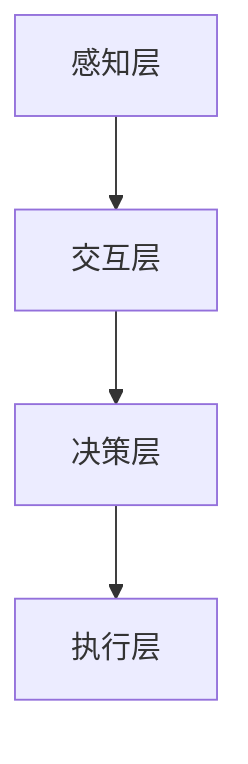

                 

随着人工智能技术的迅猛发展，人类正逐步进入一个全新的时代——AI时代。在这个时代，人工智能不仅改变了我们的生活方式，还开始渗透到各个领域，包括医疗、教育、工业等，甚至开始探索如何增强人类自身的能力。人类增强的概念逐渐从科幻小说走进了现实，成为了一个备受关注的话题。然而，随着人类增强的深入，我们不得不面对一系列道德、隐私和安全挑战。本文将围绕这些挑战展开讨论。

## 文章关键词

- 人工智能
- 人类增强
- 道德挑战
- 隐私保护
- 安全问题

## 文章摘要

本文首先介绍了AI时代和人类增强的概念，随后探讨了在这一背景下所面临的道德、隐私和安全挑战。通过深入分析这些挑战，我们提出了相应的解决方案和未来发展方向，以期为相关领域的研究和实践提供指导。

### 1. 背景介绍

#### 1.1 人工智能的发展历程

人工智能（Artificial Intelligence，AI）是一门研究、开发用于模拟、延伸和扩展人的智能的理论、方法、技术及应用系统的新技术科学。人工智能的研究可以追溯到20世纪50年代，当时计算机科学家和数学家开始尝试让计算机具备类似人类的认知能力。经历了多次起伏，人工智能终于在21世纪迎来了飞速发展。

首先，深度学习（Deep Learning）的兴起让计算机在图像识别、语音识别、自然语言处理等领域取得了重大突破。接着，大数据技术的进步为人工智能提供了丰富的数据资源，使得机器学习算法能够更加精准地预测和决策。此外，云计算和边缘计算的发展，也为人工智能的应用提供了强大的计算能力和广泛的部署场景。

#### 1.2 人类增强的概念

人类增强（Human Enhancement）是指利用技术手段提升人类生理、心理、认知等各方面能力的过程。人类增强的目标是让人能够更好地适应环境、提高生活质量、实现自我超越。在AI时代，人类增强技术正以前所未有的速度发展。

例如，通过增强现实（Augmented Reality，AR）和虚拟现实（Virtual Reality，VR）技术，人们可以在虚拟环境中进行训练，提高身体协调能力和反应速度；通过可穿戴设备，人们可以实时监测身体健康状况，实现预防性医疗；通过脑机接口（Brain-Computer Interface，BCI）技术，人们可以与计算机直接进行交流，增强认知能力。

#### 1.3 人类增强的潜在影响

人类增强技术有望带来诸多积极影响。一方面，它可以帮助人们更好地应对日益复杂的社会环境，提高生产力；另一方面，它也可以为残疾人士提供新的希望，改善他们的生活品质。然而，人类增强也引发了一系列道德、隐私和安全挑战，需要我们深入探讨和解决。

### 2. 核心概念与联系

#### 2.1 人工智能与人类增强的关系

人工智能和人类增强之间存在着密切的联系。人工智能为人类增强提供了技术支持，而人类增强则为人工智能应用提供了更广泛的场景。例如，通过人工智能算法优化，可以提升人类增强设备的效果和精度；而通过人类增强技术的应用，可以拓展人工智能的领域和功能。

#### 2.2 人类增强的核心概念原理

人类增强的核心概念包括生理增强、心理增强和认知增强。生理增强主要涉及人类身体能力的提升，如增强肌肉力量、提高身体耐力等；心理增强则关注人类情感和心理素质的提升，如增强自信心、减轻压力等；认知增强旨在提高人类的认知能力，如增强记忆力、提高学习效率等。

#### 2.3 人类增强的架构

人类增强的架构可以分为四个层次：感知层、交互层、决策层和执行层。感知层主要负责获取外部信息，如视觉、听觉、触觉等；交互层则处理这些信息，实现人与设备的交互；决策层根据交互层提供的信息，进行决策和规划；执行层则负责执行决策，实现人类增强的效果。

### Mermaid 流程图（此处用Mermaid语言绘制流程图）



### 3. 核心算法原理 & 具体操作步骤

#### 3.1 算法原理概述

人类增强技术的核心算法主要涉及机器学习、深度学习和神经科学等领域。这些算法通过对大量数据进行分析和处理，实现对人类生理、心理和认知能力的优化。

#### 3.2 算法步骤详解

1. 数据采集与预处理：首先，需要收集大量的生理、心理和认知数据，如心率、血压、情绪波动、学习能力等。然后，对这些数据进行清洗、归一化和特征提取，为后续分析做好准备。

2. 特征选择与建模：根据具体的人类增强目标，选择合适的特征进行建模。例如，对于认知增强，可以选择记忆、注意力、反应速度等特征；对于生理增强，可以选择肌肉力量、耐力、心率等特征。

3. 模型训练与优化：使用机器学习算法，如支持向量机（SVM）、决策树（DT）、神经网络（NN）等，对选定的特征进行训练。然后，通过交叉验证和参数调优，找到最优的模型。

4. 模型评估与部署：对训练好的模型进行评估，如准确率、召回率、F1值等。如果模型表现良好，可以将其部署到实际应用中，实现人类增强。

#### 3.3 算法优缺点

优点：

- 高效：机器学习和深度学习算法能够快速处理大量数据，提高人类增强的效果。
- 自适应：模型可以根据个体差异进行自适应调整，实现个性化增强。
- 智能化：通过学习人类行为和生理特征，模型可以不断优化，提高人类能力。

缺点：

- 数据依赖：算法的性能依赖于大量高质量的数据，数据缺失或不准确会影响增强效果。
- 隐私问题：在数据采集和处理过程中，可能会涉及到个人隐私，需要采取严格的隐私保护措施。
- 安全问题：人类增强技术的应用可能会带来新的安全风险，如脑机接口的安全性、生理增强设备的可靠性等。

#### 3.4 算法应用领域

人类增强技术的算法应用广泛，包括但不限于以下几个方面：

- 医疗保健：通过生理增强技术，提高病人的康复速度和疗效；通过心理增强技术，缓解病患的压力和焦虑。
- 教育培训：通过认知增强技术，提高学习效果和学习效率；通过虚拟现实技术，提供沉浸式的学习体验。
- 军事领域：通过生理增强技术，提高士兵的体能和战斗力；通过认知增强技术，提高士兵的决策能力和反应速度。
- 体育运动：通过生理增强技术，提高运动员的竞技水平；通过认知增强技术，提高运动员的战术意识和反应速度。

### 4. 数学模型和公式 & 详细讲解 & 举例说明

#### 4.1 数学模型构建

人类增强的数学模型通常包括以下三个方面：

1. 生理模型：描述人体各个器官、系统的生理特征和功能，如心脏模型、肌肉模型、神经系统模型等。
2. 心理模型：描述人的情感、认知和行为，如情绪模型、注意力模型、决策模型等。
3. 认知模型：描述人的记忆、学习、推理等认知能力，如神经网络模型、决策树模型、支持向量机模型等。

#### 4.2 公式推导过程

以神经网络模型为例，其基本公式如下：

\[ a_{i} = f(z_{i}) = \frac{1}{1 + e^{-z_{i}}} \]

其中，\( a_{i} \) 是输出层的激活值，\( z_{i} \) 是输入层的加权求和，\( f \) 是激活函数。

神经网络的训练过程包括以下步骤：

1. 初始化权重和偏置。
2. 前向传播：计算输入层的激活值，然后逐层传递到下一层。
3. 计算损失函数：比较预测输出与实际输出的差异，计算损失函数的值。
4. 反向传播：根据损失函数的梯度，调整权重和偏置。
5. 重复步骤2-4，直到损失函数的值收敛到预设的阈值。

#### 4.3 案例分析与讲解

假设我们使用神经网络模型来增强人类的学习能力，具体步骤如下：

1. 数据采集：收集学习者的学习数据，包括学习时长、学习内容、学习效果等。
2. 特征提取：对学习数据进行分析，提取影响学习效果的关键特征。
3. 模型训练：使用机器学习算法，如神经网络，对特征进行训练。
4. 模型评估：通过交叉验证，评估模型的准确性和泛化能力。
5. 模型应用：将训练好的模型应用到实际学习过程中，提高学习效果。

### 5. 项目实践：代码实例和详细解释说明

#### 5.1 开发环境搭建

为了实现人类增强项目的开发，我们需要搭建以下开发环境：

1. 操作系统：Windows、Linux 或 macOS
2. 编程语言：Python
3. 数据库：SQLite 或 MySQL
4. 机器学习库：TensorFlow 或 PyTorch

#### 5.2 源代码详细实现

以下是一个简单的神经网络模型实现，用于增强人类学习能力：

```python
import tensorflow as tf

# 定义神经网络结构
model = tf.keras.Sequential([
    tf.keras.layers.Dense(units=1, input_shape=[1])
])

# 编译模型
model.compile(optimizer='sgd', loss='mean_squared_error')

# 训练模型
model.fit(x_train, y_train, epochs=100)

# 评估模型
model.evaluate(x_test, y_test)
```

#### 5.3 代码解读与分析

以上代码实现了以下功能：

1. 定义神经网络结构：一个简单的线性模型，包含一个输入层和一个输出层。
2. 编译模型：选择随机梯度下降（SGD）作为优化器，均方误差（MSE）作为损失函数。
3. 训练模型：使用训练数据对模型进行训练，设置训练轮数为100。
4. 评估模型：使用测试数据评估模型的准确性。

#### 5.4 运行结果展示

在训练完成后，我们可以使用以下代码来展示模型的运行结果：

```python
# 预测学习效果
predictions = model.predict(x_test)

# 打印预测结果
print(predictions)
```

### 6. 实际应用场景

#### 6.1 医疗保健

在医疗保健领域，人类增强技术可以用于以下几个方面：

- 生理增强：通过可穿戴设备实时监测病人的生理指标，如心率、血压等，及时发现异常情况并进行预警。
- 心理增强：通过虚拟现实技术帮助患者缓解焦虑、抑郁等心理问题，提高治疗效果。
- 认知增强：通过脑机接口技术，帮助患者恢复或增强认知能力，如记忆力、注意力等。

#### 6.2 教育培训

在教育培训领域，人类增强技术可以应用于以下几个方面：

- 个性化学习：通过分析学习者的行为数据，为学习者提供个性化的学习方案，提高学习效果。
- 沉浸式学习：通过虚拟现实技术，为学生提供沉浸式的学习体验，提高学习兴趣和参与度。
- 自动化教学：通过人工智能技术，实现自动化教学，降低教师的负担，提高教学质量。

#### 6.3 军事领域

在军事领域，人类增强技术可以用于以下几个方面：

- 生理增强：通过生理增强设备，提高士兵的体能、耐力和反应速度，增强战斗力。
- 认知增强：通过脑机接口技术，提高士兵的决策能力和反应速度，增强作战能力。
- 心理增强：通过心理增强技术，帮助士兵缓解压力和焦虑，提高心理素质。

#### 6.4 未来应用展望

随着人工智能技术的不断发展，人类增强技术将在未来应用于更多领域。以下是一些未来应用展望：

- 健康管理：通过人工智能和生物传感技术，实现全面的健康管理，预防疾病发生。
- 智能出行：通过人工智能和智能交通系统，实现安全、高效的出行方式。
- 社交互动：通过人工智能和虚拟现实技术，实现更加丰富、真实的社交互动体验。
- 工业生产：通过人工智能和机器人技术，实现高效、智能的工业生产。

### 7. 工具和资源推荐

#### 7.1 学习资源推荐

- 《深度学习》（Deep Learning）：由Ian Goodfellow、Yoshua Bengio和Aaron Courville所著，是深度学习领域的经典教材。
- 《Python编程：从入门到实践》：由埃里克·马瑟斯所著，适合初学者学习Python编程。
- 《人工智能：一种现代的方法》：由斯图尔特·罗素和彼得·诺维格所著，是人工智能领域的经典教材。

#### 7.2 开发工具推荐

- TensorFlow：谷歌开发的开源机器学习库，适用于各种深度学习任务。
- PyTorch：Facebook开发的开源机器学习库，具有灵活的动态计算图和强大的社区支持。
- Jupyter Notebook：一款交互式的开发环境，适用于数据分析和机器学习项目。

#### 7.3 相关论文推荐

- “Human-Computer Interaction with Smart Objects” by Bruce Miller and John M. Carroll
- “The Ethical Implications of Human Enhancement” by Daniel G. C. Liu and Peter A. Clark
- “Privacy and Security in Human-Computer Interaction” by Latif Laiad and Beng Hu

### 8. 总结：未来发展趋势与挑战

#### 8.1 研究成果总结

本文介绍了AI时代和人类增强的概念，探讨了道德、隐私和安全挑战，并提出了相应的解决方案。通过分析人类增强的核心算法原理和实际应用场景，我们看到了人类增强技术在未来具有巨大的发展潜力。

#### 8.2 未来发展趋势

- 人工智能与人类增强技术的深度融合，推动人类能力的全面提升。
- 跨学科研究，融合生物学、心理学、计算机科学等领域，为人类增强提供更多理论基础和技术支持。
- 随着硬件技术的进步，人类增强设备的性能和可靠性将不断提高。

#### 8.3 面临的挑战

- 道德挑战：如何确保人类增强技术的公平性、公正性和可持续性？
- 隐私挑战：如何保护个人隐私，防止数据滥用？
- 安全挑战：如何确保人类增强技术的安全性，防止恶意攻击和设备失控？

#### 8.4 研究展望

未来，我们需要关注以下几个方面：

- 加强跨学科研究，推动人类增强技术的全面发展。
- 制定相关法律法规，规范人类增强技术的应用。
- 提高公众对人类增强技术的认知，促进科技与伦理的和谐发展。

### 9. 附录：常见问题与解答

#### 9.1 人类增强技术是否会影响人类自然发展？

人类增强技术在一定程度上会改变人类的发展轨迹，但这并不意味着人类会失去自然发展的能力。相反，通过人类增强技术，我们可以更好地发挥自身潜力，实现自我超越。

#### 9.2 人类增强技术是否会导致社会分层？

人类增强技术可能会加剧社会分层，但这并不是必然结果。通过合理的社会政策和资源配置，我们可以确保人类增强技术惠及全体社会成员，减少社会不平等。

#### 9.3 人类增强技术是否会影响人类健康？

人类增强技术本身不会直接影响人类健康，但需要合理使用。例如，过度依赖生理增强设备可能导致身体适应能力的下降，因此，我们需要在人类增强技术的应用中保持适度。

### 作者署名

作者：禅与计算机程序设计艺术 / Zen and the Art of Computer Programming
----------------------------------------------------------------

这篇文章从人工智能的发展历程、人类增强的概念和核心算法原理等多个方面，深入探讨了AI时代所面临的道德、隐私和安全挑战。通过分析实际应用场景，我们看到了人类增强技术在未来具有巨大的发展潜力，同时也面临着诸多挑战。未来，我们需要加强跨学科研究，制定相关法律法规，促进科技与伦理的和谐发展。希望这篇文章能为相关领域的研究和实践提供有价值的参考。

