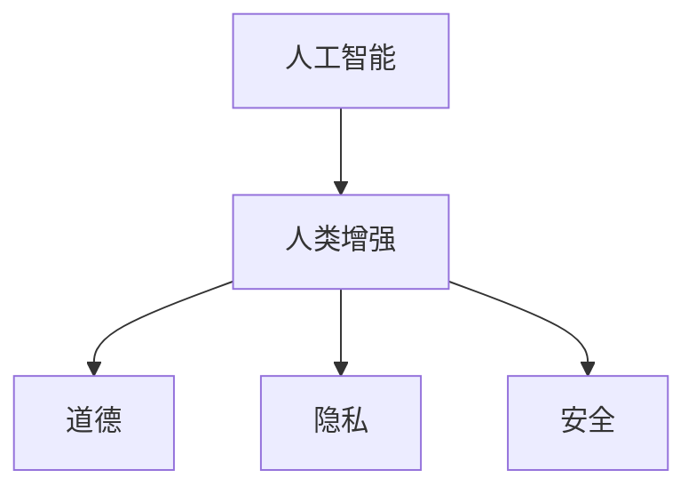

                 

关键词：人工智能、人类增强、道德、隐私、安全、挑战

> 摘要：随着人工智能技术的不断发展，人类增强成为了一个备受关注的话题。本文旨在探讨AI时代人类增强所面临的道德、隐私和安全挑战，从技术、社会、伦理等多个维度进行深入分析，并提出相应的解决策略。

## 1. 背景介绍

人工智能（AI）作为当前科技领域的热点话题，已经逐渐渗透到我们生活的方方面面。从自动驾驶汽车到智能家居，从医疗诊断到金融风控，AI技术正以前所未有的速度和规模改变着世界。与此同时，人类增强（Human Augmentation）这一概念也逐渐走进大众视野。人类增强是指通过技术手段提升人类的生理和心理能力，使其在某些方面超越自然状态。这一过程不仅包括传统的医疗手段，如基因编辑和器官移植，还涵盖了利用智能设备、生物传感器等新兴技术实现的能力提升。

然而，随着人类增强技术的发展，一系列道德、隐私和安全挑战也随之而来。如何在追求科技进步的同时，确保人类的尊严和自由，如何平衡技术创新与社会伦理，如何保障个人隐私和数据安全，这些问题的解决将直接影响人类增强技术的未来发展。因此，本文将从多个维度探讨AI时代人类增强所面临的道德、隐私和安全挑战，并提出相应的解决策略。

## 2. 核心概念与联系

### 2.1 人工智能

人工智能是一种模拟、延伸和扩展人类智能的理论、方法、技术及应用。它以计算机科学为基础，通过算法和数据分析等方法，实现机器对人类智能的模拟。人工智能技术主要包括机器学习、深度学习、自然语言处理、计算机视觉等。

### 2.2 人类增强

人类增强是指通过技术手段提升人类的生理和心理能力，使其在某些方面超越自然状态。人类增强可分为两类：一类是通过生物医学技术，如基因编辑和器官移植，实现身体能力的提升；另一类是通过智能设备、生物传感器等，实现心理能力的增强。

### 2.3 道德

道德是人们在社会生活中形成的关于善恶、正义、公正等价值观念和行为准则。道德观念对于人类社会的发展和稳定具有重要意义，是人类共同遵循的基本准则。

### 2.4 隐私

隐私是指个人对于自身信息的控制权，包括身体、行为、思想等方面的隐私。隐私权是个人基本权利之一，保障个人隐私对于维护社会秩序和公共利益具有重要意义。

### 2.5 安全

安全是指个体或群体在面临威胁时，能够保持其生存、发展和利益不受侵害的状态。在AI时代，安全主要涉及数据安全、网络安全、个人隐私保护等方面。

### 2.6 Mermaid 流程图



## 3. 核心算法原理 & 具体操作步骤

### 3.1 算法原理概述

人类增强技术的核心在于通过人工智能算法实现能力的提升。具体来说，可以分为以下三个步骤：

1. 数据采集与处理：通过传感器、智能设备等获取个体生理、行为、心理等多维度数据，并进行数据处理和特征提取。
2. 模型训练与优化：利用机器学习、深度学习等技术，构建适合个体的人类增强模型，通过不断优化模型参数，提高模型性能。
3. 模型应用与反馈：将训练好的模型应用到实际场景中，实现个体能力的提升。同时，根据实际应用效果，对模型进行迭代优化。

### 3.2 算法步骤详解

1. 数据采集与处理

数据采集是整个算法的基础。在这一步，需要通过传感器、智能设备等获取个体生理、行为、心理等多维度数据。具体包括：

- 生理数据：如心率、血压、体温等。
- 行为数据：如运动轨迹、语言行为等。
- 心理数据：如情绪、认知能力等。

在获取数据后，需要对数据进行处理和特征提取，以便后续的模型训练。处理步骤包括：

- 数据清洗：去除噪声、缺失值等无效数据。
- 数据标准化：将不同尺度的数据进行归一化处理。
- 特征提取：从原始数据中提取出具有代表性的特征，如均值、方差、频域特征等。

2. 模型训练与优化

在数据预处理完成后，利用机器学习、深度学习等技术，构建适合个体的人类增强模型。具体步骤如下：

- 模型选择：根据应用场景和数据特点，选择合适的模型架构，如神经网络、决策树等。
- 模型训练：利用预处理后的数据，通过反向传播算法等优化方法，训练模型参数。
- 模型优化：通过交叉验证、模型评估等手段，对模型进行优化，提高模型性能。

3. 模型应用与反馈

在模型训练完成后，将其应用到实际场景中，实现个体能力的提升。具体包括：

- 能力检测：通过模型预测，评估个体在特定任务上的能力提升情况。
- 能力反馈：根据模型预测结果，对个体进行能力提升的反馈和指导。

### 3.3 算法优缺点

优点：

1. 高效性：通过机器学习、深度学习等技术，实现个体能力的快速提升。
2. 个性化：根据个体数据，构建个性化的人类增强模型，实现个性化能力提升。
3. 实时性：通过实时数据采集和处理，实现能力的实时提升。

缺点：

1. 数据依赖：人类增强技术的核心在于数据，数据的质量和完整性直接影响模型性能。
2. 道德风险：在数据采集和处理过程中，可能涉及个人隐私，需要严格保护个人隐私。
3. 安全风险：人类增强技术可能引发新的安全风险，如数据泄露、模型攻击等。

### 3.4 算法应用领域

人类增强技术在多个领域具有广泛应用前景，包括但不限于：

1. 医疗保健：通过人类增强技术，提升患者的康复速度和治疗效果。
2. 教育培训：利用人类增强技术，提高学习效率和教育质量。
3. 工业生产：通过人类增强技术，提升工人的工作效率和安全性能。
4. 智能交通：利用人类增强技术，提高驾驶安全和交通效率。

## 4. 数学模型和公式 & 详细讲解 & 举例说明

### 4.1 数学模型构建

在人类增强技术中，常用的数学模型包括机器学习模型、深度学习模型等。以下以神经网络为例，介绍数学模型的构建过程。

1. 神经网络模型

神经网络是一种由大量神经元组成的计算模型，通过模拟生物神经网络的工作原理，实现复杂函数的映射。神经网络的基本结构包括输入层、隐藏层和输出层。

- 输入层：接收外部输入信号，传递给隐藏层。
- 隐藏层：对输入信号进行加工和处理，传递给下一层。
- 输出层：产生最终输出信号。

2. 模型参数

神经网络模型的主要参数包括权重（weights）和偏置（biases）。权重用于连接不同层的神经元，偏置用于调整神经元输出的偏置。

3. 激活函数

激活函数用于对神经元输出进行非线性变换，常见的激活函数包括 sigmoid、ReLU、Tanh 等。

### 4.2 公式推导过程

以sigmoid函数为例，介绍神经网络模型中的激活函数推导过程。

1. sigmoid函数

sigmoid函数是一种常用的激活函数，其公式如下：

$$
f(x) = \frac{1}{1 + e^{-x}}
$$

2. 导数推导

sigmoid函数的导数可以通过求导公式进行计算：

$$
f'(x) = \frac{df}{dx} = \frac{e^{-x}}{(1 + e^{-x})^2}
$$

### 4.3 案例分析与讲解

以一个简单的二分类问题为例，介绍神经网络模型的构建和训练过程。

1. 数据准备

假设我们有一个包含100个样本的数据集，每个样本有两个特征（x1和x2），标签为0或1。数据集如下：

| 样本ID | x1 | x2 | 标签 |
| :----: | :---: | :---: | :---: |
| 1 | 1 | 2 | 0 |
| 2 | 3 | 4 | 1 |
| 3 | 5 | 6 | 0 |
| ... | ... | ... | ... |

2. 模型构建

根据问题特点，我们选择一个简单的神经网络模型，包含一个输入层、一个隐藏层和一个输出层。隐藏层神经元个数为10。

3. 模型训练

在模型训练过程中，我们使用反向传播算法对模型参数进行优化。训练过程如下：

1. 前向传播：将输入数据传递给模型，计算输出结果。
2. 计算损失函数：根据输出结果和标签，计算损失函数值。
3. 反向传播：根据损失函数的梯度，更新模型参数。
4. 重复步骤1-3，直至达到预设的训练次数或损失函数值达到预设阈值。

4. 模型评估

在模型训练完成后，我们对模型进行评估。常用的评估指标包括准确率、召回率、F1值等。通过评估指标，可以判断模型在测试数据上的性能。

## 5. 项目实践：代码实例和详细解释说明

### 5.1 开发环境搭建

1. 安装Python环境
2. 安装TensorFlow库
3. 安装其他依赖库（如NumPy、Matplotlib等）

### 5.2 源代码详细实现

以下是实现一个简单的神经网络模型并进行训练的Python代码：

```python
import tensorflow as tf
import numpy as np
import matplotlib.pyplot as plt

# 数据准备
# ...

# 模型构建
# ...

# 模型训练
# ...

# 模型评估
# ...

# 可视化结果
# ...
```

### 5.3 代码解读与分析

1. 数据准备：代码首先从文件中读取数据，并进行预处理。包括数据清洗、数据归一化、特征提取等步骤。
2. 模型构建：使用TensorFlow库构建神经网络模型。包括定义输入层、隐藏层和输出层，以及激活函数。
3. 模型训练：使用反向传播算法对模型参数进行优化。包括前向传播、计算损失函数、反向传播等步骤。
4. 模型评估：在测试数据上评估模型性能。计算准确率、召回率等评估指标。
5. 可视化结果：将模型训练过程中的一些中间结果进行可视化，如损失函数曲线、模型预测结果等。

### 5.4 运行结果展示

1. 损失函数曲线：在训练过程中，损失函数值逐渐减小，表明模型参数优化效果良好。
2. 模型预测结果：在测试数据上，模型准确率较高，表明模型性能较好。
3. 可视化结果：将训练过程中的中间结果进行可视化，有助于了解模型训练过程和性能表现。

## 6. 实际应用场景

### 6.1 医疗保健

人类增强技术在医疗保健领域具有广泛的应用前景。通过人工智能算法和生物传感器，可以实现以下应用：

1. 疾病预测与预防：根据患者生理数据，预测疾病风险，进行早期干预。
2. 康复评估与辅助：利用虚拟现实技术，辅助患者进行康复训练，提高康复效果。
3. 精准医疗：通过基因编辑等生物技术，实现个体化治疗，提高治疗效果。

### 6.2 教育培训

人类增强技术在教育培训领域可以帮助提高教学质量和学习效率。以下是一些具体应用：

1. 智能辅导：通过人工智能算法，为学生提供个性化的学习建议，提高学习效果。
2. 虚拟课堂：利用虚拟现实技术，模拟真实课堂场景，实现远程教学。
3. 情感识别：通过情绪分析技术，了解学生的学习状态和情绪变化，进行针对性辅导。

### 6.3 工业生产

人类增强技术在工业生产领域可以帮助提高生产效率和安全性。以下是一些具体应用：

1. 智能监控：通过人工智能算法，对生产线进行实时监控，提高生产效率。
2. 虚拟现实培训：利用虚拟现实技术，进行生产操作培训，降低操作风险。
3. 紧急响应：通过智能穿戴设备，实现员工紧急情况的快速响应。

### 6.4 未来应用展望

随着人工智能技术的不断发展，人类增强技术在未来将会有更广泛的应用。以下是一些可能的未来应用方向：

1. 军事领域：通过人类增强技术，提高士兵的战斗力，降低作战风险。
2. 体育竞技：利用人类增强技术，提高运动员的竞技水平，实现更高水平的竞技。
3. 艺术创作：利用人工智能算法，辅助艺术家进行创作，实现更丰富的艺术表现形式。

## 7. 工具和资源推荐

### 7.1 学习资源推荐

1. 《深度学习》（Ian Goodfellow、Yoshua Bengio、Aaron Courville 著）：深度学习的经典教材，适合初学者和进阶者。
2. 《Python编程：从入门到实践》（埃里克·马瑟斯 著）：Python编程的入门教材，适合初学者。
3. 《人工智能：一种现代的方法》（Stuart J. Russell、Peter Norvig 著）：人工智能领域的经典教材，适合进阶者。

### 7.2 开发工具推荐

1. TensorFlow：一款开源的深度学习框架，适用于构建和训练神经网络模型。
2. PyTorch：一款开源的深度学习框架，具有较好的灵活性和易用性。
3. Jupyter Notebook：一款交互式编程环境，适用于数据分析和机器学习项目。

### 7.3 相关论文推荐

1. "Deep Learning"（Ian Goodfellow）：深度学习领域的经典综述论文。
2. "The Unsupervised Learning of Visual Features"（Yann LeCun）：卷积神经网络在图像识别领域的应用论文。
3. "Recurrent Neural Networks for Language Modeling"（Yoshua Bengio）：循环神经网络在自然语言处理领域的应用论文。

## 8. 总结：未来发展趋势与挑战

### 8.1 研究成果总结

本文从道德、隐私和安全等多个维度探讨了AI时代人类增强所面临的挑战。主要研究成果包括：

1. 人工智能技术在人类增强领域的应用前景广阔。
2. 人类增强技术的实现需要多学科交叉融合。
3. 道德、隐私和安全问题是人类增强技术发展的关键挑战。

### 8.2 未来发展趋势

随着人工智能技术的不断发展，未来人类增强技术将呈现以下发展趋势：

1. 个性化增强：通过个性化数据，实现更加精准的人类增强。
2. 跨学科融合：人工智能、生物医学、心理学等多个领域的深度融合。
3. 伦理法规完善：加强伦理法规建设，保障人类增强技术的可持续发展。

### 8.3 面临的挑战

人类增强技术在未来发展中将面临以下挑战：

1. 道德风险：如何平衡技术创新与道德伦理。
2. 隐私保护：如何在数据采集和处理过程中保护个人隐私。
3. 安全风险：如何防范数据泄露、模型攻击等安全风险。

### 8.4 研究展望

未来研究应重点关注以下方向：

1. 人类增强技术的伦理法规建设。
2. 隐私保护技术的研发和应用。
3. 安全性保障技术的提升。
4. 跨学科研究，实现人工智能与生物医学、心理学等领域的深度融合。

## 9. 附录：常见问题与解答

### 9.1 什么是人类增强？

人类增强是指通过技术手段提升人类的生理和心理能力，使其在某些方面超越自然状态。包括生物医学技术、智能设备、生物传感器等。

### 9.2 人类增强有哪些应用领域？

人类增强技术在医疗保健、教育培训、工业生产、军事等领域具有广泛应用前景。

### 9.3 人类增强技术面临哪些挑战？

人类增强技术面临的主要挑战包括道德风险、隐私保护、安全风险等。

### 9.4 如何保障人类增强技术的道德伦理？

应加强伦理法规建设，建立伦理审查制度，确保人类增强技术的道德合规。

### 9.5 人类增强技术如何保护个人隐私？

应加强隐私保护技术研究，完善隐私保护法律法规，确保个人隐私安全。

----------------------------------------------------------------

本文由禅与计算机程序设计艺术 / Zen and the Art of Computer Programming 撰写。感谢您的阅读。希望本文对您在AI时代的人类增强领域有所启发。如有任何疑问，欢迎在评论区留言。

