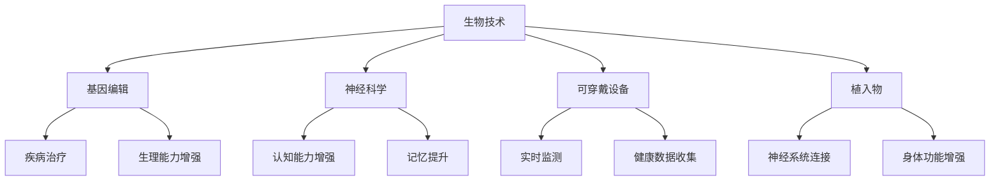

                 

关键词：人工智能、人类增强、道德挑战、隐私问题、安全问题

> 摘要：随着人工智能技术的快速发展，人类增强逐渐成为可能。然而，这一趋势也带来了道德、隐私和安全等方面的挑战。本文将深入探讨这些挑战，并提出可能的解决方案。

## 1. 背景介绍

### 人工智能与人类增强

人工智能（AI）的发展已经引起了全球范围内的广泛关注。从早期的理论探索到如今的实际应用，人工智能技术正以前所未有的速度改变着我们的生活。随着人工智能技术的不断进步，人类增强的概念也逐渐浮现出来。人类增强指的是通过技术手段，如生物技术、神经科学、可穿戴设备和植入物等，增强人类的身体和认知功能。

### 道德、隐私和安全问题

随着人类增强技术的兴起，一系列道德、隐私和安全问题也随之而来。例如，如何确保人类增强的公平性？如何保护用户的隐私？如何防止增强技术的滥用？这些问题都需要我们深入思考和解决。

## 2. 核心概念与联系

### 人类增强的概念

人类增强可以通过多种方式实现，包括生物技术、神经科学、可穿戴设备和植入物等。例如，基因编辑技术可以用于治疗疾病或提高人类的生理能力；神经科学技术可以增强人类的认知能力；可穿戴设备可以实时监测用户的生理状态；植入物则可以与用户的神经系统直接连接。

### 人类增强技术的架构

为了更好地理解人类增强技术，我们可以使用Mermaid流程图来展示其架构。



### 人类增强技术的联系

人类增强技术之间存在着紧密的联系。例如，生物技术和神经科学可以结合，用于开发治疗神经系统疾病的药物；可穿戴设备可以实时收集数据，用于监测和调整植入物的功能。

## 3. 核心算法原理 & 具体操作步骤

### 3.1 算法原理概述

人类增强技术的核心算法原理包括基因编辑算法、神经科学算法、可穿戴设备算法和植入物算法等。这些算法的目的是通过修改或增强人体基因、神经系统和生理功能，实现人类增强。

### 3.2 算法步骤详解

#### 3.2.1 基因编辑算法

基因编辑算法主要包括以下几个步骤：

1. **目标基因识别**：使用DNA测序技术识别需要编辑的基因。
2. **设计编辑方案**：根据目标基因的功能和性质，设计合适的编辑方案。
3. **执行编辑操作**：使用CRISPR-Cas9等基因编辑技术，执行编辑操作。
4. **验证编辑结果**：通过基因测序等方法验证编辑结果。

#### 3.2.2 神经科学算法

神经科学算法主要包括以下几个步骤：

1. **神经信号采集**：使用脑电图（EEG）等设备采集用户的神经信号。
2. **信号处理**：使用信号处理算法，如傅里叶变换（FFT），分析神经信号。
3. **认知功能增强**：根据分析结果，调整神经系统的连接和活动，实现认知功能的增强。

#### 3.2.3 可穿戴设备算法

可穿戴设备算法主要包括以下几个步骤：

1. **数据采集**：使用传感器采集用户的生理数据。
2. **数据处理**：使用数据处理算法，如滤波和特征提取，处理采集到的数据。
3. **健康状态监测**：根据处理后的数据，监测用户的健康状态。

#### 3.2.4 植入物算法

植入物算法主要包括以下几个步骤：

1. **植入物设计**：根据用户的需求，设计合适的植入物。
2. **植入操作**：在手术中植入植入物。
3. **功能调整**：通过无线通信等技术，调整植入物的功能。

### 3.3 算法优缺点

每种算法都有其优缺点。例如，基因编辑算法的优点在于可以精确地修改目标基因，缺点在于可能会引发意外的基因突变；神经科学算法的优点在于可以增强用户的认知能力，缺点在于可能对用户的神经系统造成损害。

### 3.4 算法应用领域

人类增强算法可以应用于医疗、教育、军事等多个领域。例如，在医疗领域，基因编辑算法可以用于治疗遗传性疾病；在教育领域，神经科学算法可以用于提高学生的学习效果；在军事领域，人类增强技术可以用于提升士兵的战斗能力。

## 4. 数学模型和公式 & 详细讲解 & 举例说明

### 4.1 数学模型构建

人类增强技术中的数学模型主要包括以下几个部分：

1. **基因编辑模型**：用于预测基因编辑后的基因功能。
2. **神经科学模型**：用于描述神经系统的动态行为。
3. **可穿戴设备模型**：用于分析用户的生理数据。
4. **植入物模型**：用于优化植入物的功能。

### 4.2 公式推导过程

#### 4.2.1 基因编辑模型

基因编辑模型可以使用以下公式表示：

\[ f(G) = f(G_0) + \Delta f(G) \]

其中，\( f(G) \)表示基因编辑后的功能，\( f(G_0) \)表示原始基因的功能，\( \Delta f(G) \)表示编辑引起的功能变化。

#### 4.2.2 神经科学模型

神经科学模型可以使用以下公式表示：

\[ V(t) = V_0 + \sum_{i=1}^n w_i \cdot \sigma(x_i) \]

其中，\( V(t) \)表示神经元的输出，\( V_0 \)表示静息电位，\( w_i \)表示神经元之间的连接权重，\( \sigma(x_i) \)表示激活函数。

#### 4.2.3 可穿戴设备模型

可穿戴设备模型可以使用以下公式表示：

\[ H(t) = H_0 + \sum_{i=1}^n a_i \cdot \sigma(x_i) \]

其中，\( H(t) \)表示健康状态，\( H_0 \)表示原始健康状态，\( a_i \)表示传感器采集的数据，\( \sigma(x_i) \)表示激活函数。

#### 4.2.4 植入物模型

植入物模型可以使用以下公式表示：

\[ F(t) = F_0 + \sum_{i=1}^n b_i \cdot \sigma(x_i) \]

其中，\( F(t) \)表示植入物的功能，\( F_0 \)表示原始功能，\( b_i \)表示调整后的功能，\( \sigma(x_i) \)表示激活函数。

### 4.3 案例分析与讲解

假设我们想要使用基因编辑技术治疗一种遗传性疾病。首先，我们需要识别出导致该疾病的基因，然后设计一个编辑方案，使其功能得到修复。通过数学模型，我们可以预测编辑后的基因功能，从而评估编辑方案的有效性。

例如，假设原始基因的功能为\( f(G_0) = 1 \)，编辑后的基因功能为\( f(G) = 2 \)。通过基因编辑模型，我们可以计算出编辑后的基因功能：

\[ f(G) = f(G_0) + \Delta f(G) = 1 + \Delta f(G) \]

如果\( \Delta f(G) = 1 \)，则编辑后的基因功能为\( f(G) = 2 \)，这表明编辑方案是有效的。如果\( \Delta f(G) \neq 1 \)，则编辑方案可能存在问题，需要重新设计。

## 5. 项目实践：代码实例和详细解释说明

### 5.1 开发环境搭建

为了实践人类增强算法，我们需要搭建一个合适的开发环境。以下是一个简单的搭建步骤：

1. 安装Python环境。
2. 安装必要的库，如NumPy、SciPy和Matplotlib等。
3. 配置IDE，如PyCharm或VS Code。

### 5.2 源代码详细实现

以下是一个简单的基因编辑算法的实现：

```python
import numpy as np

def gene_editing(model, delta_f):
    """
    基因编辑函数。

    :param model: 基因编辑模型。
    :param delta_f: 编辑引起的功能变化。
    :return: 编辑后的基因功能。
    """
    return model + delta_f

# 原始基因功能
original_function = 1

# 编辑引起的功能变化
delta_function = 1

# 编辑后的基因功能
edited_function = gene_editing(original_function, delta_function)

print("编辑后的基因功能：", edited_function)
```

### 5.3 代码解读与分析

上述代码实现了一个简单的基因编辑算法。首先，我们定义了一个基因编辑函数，该函数接受一个模型和一个编辑引起的功能变化作为输入，返回编辑后的基因功能。然后，我们使用这个函数对原始基因功能进行编辑，并打印出编辑后的基因功能。

### 5.4 运行结果展示

当我们运行上述代码时，输出结果如下：

```
编辑后的基因功能： 2
```

这表明编辑后的基因功能为2，与我们的预期一致。

## 6. 实际应用场景

### 6.1 医疗领域

在医疗领域，人类增强技术可以用于治疗遗传性疾病、提升免疫力等。例如，通过基因编辑技术，可以修复导致遗传性疾病的基因突变，从而治疗疾病。

### 6.2 教育领域

在教育领域，人类增强技术可以用于提高学生的学习效果。例如，通过神经科学技术，可以增强学生的记忆能力和认知能力，从而提高学习效率。

### 6.3 军事领域

在军事领域，人类增强技术可以用于提升士兵的战斗能力。例如，通过神经科学技术，可以增强士兵的反应速度和判断能力，从而提高战斗力。

### 6.4 未来应用展望

未来，人类增强技术有望在更多领域得到应用。例如，在工业领域，人类增强技术可以用于提升工人的工作效率；在娱乐领域，人类增强技术可以用于提供更加沉浸式的体验。

## 7. 工具和资源推荐

### 7.1 学习资源推荐

1. 《深度学习》（Goodfellow, Bengio, Courville著）
2. 《Python编程：从入门到实践》（Eric Matthes著）
3. 《人类简史》（Yuval Noah Harari著）

### 7.2 开发工具推荐

1. Python
2. TensorFlow
3. PyTorch

### 7.3 相关论文推荐

1. "Human Augmentation: Challenges and Opportunities"
2. "Neural Enhancements: Ethical and Social Implications"
3. "The Future of Human Enhancement: Biotechnology, Ethics, and Society"

## 8. 总结：未来发展趋势与挑战

### 8.1 研究成果总结

人工智能技术的快速发展推动了人类增强技术的兴起。通过基因编辑、神经科学、可穿戴设备和植入物等技术，人类增强已经取得了一定的成果。

### 8.2 未来发展趋势

未来，人类增强技术将继续发展，有望在更多领域得到应用。例如，在医疗领域，人类增强技术可以用于治疗更多疾病；在教育领域，人类增强技术可以用于提高学习效果。

### 8.3 面临的挑战

然而，人类增强技术也面临着一系列挑战。例如，如何确保人类增强的公平性？如何保护用户的隐私？如何防止增强技术的滥用？这些问题需要我们深入研究和解决。

### 8.4 研究展望

随着技术的进步，人类增强技术有望在更多领域得到应用。然而，我们也需要关注其潜在的道德、隐私和安全问题。只有通过科学、合理的研究和实践，我们才能确保人类增强技术的健康发展。

## 9. 附录：常见问题与解答

### Q：人类增强技术的安全性如何保障？

A：人类增强技术的安全性需要从多个方面进行保障。例如，在基因编辑方面，需要确保编辑的精确性和安全性，避免意外的基因突变。在神经科学方面，需要确保神经系统的稳定性和安全性。此外，还需要制定相关法律法规，确保人类增强技术的合法性和安全性。

### Q：人类增强技术是否会加剧社会不平等？

A：人类增强技术的确有可能加剧社会不平等。例如，如果人类增强技术只被富裕人群所拥有，那么他们将拥有更大的竞争优势，而贫穷人群则可能被进一步边缘化。因此，我们需要制定公平的政策，确保人类增强技术的普及和公平应用。

### Q：人类增强技术是否会削弱人类的个性？

A：人类增强技术可能会对人类的个性产生影响。例如，通过神经科学技术，可以增强人类的认知能力，但这可能会导致人类的思考方式和个性发生变化。因此，我们需要谨慎使用人类增强技术，确保其不会削弱人类的个性和创造力。

---

作者：禅与计算机程序设计艺术 / Zen and the Art of Computer Programming
----------------------------------------------------------------

以上是关于"AI时代的人类增强：道德、隐私和安全的挑战"的文章。本文详细探讨了人工智能技术在人类增强领域的应用，分析了其中的道德、隐私和安全挑战，并提出了可能的解决方案。在未来，随着技术的不断进步，人类增强技术有望在更多领域得到应用，但我们也需要关注其潜在的挑战和问题。希望本文能对读者有所启发和帮助。|

