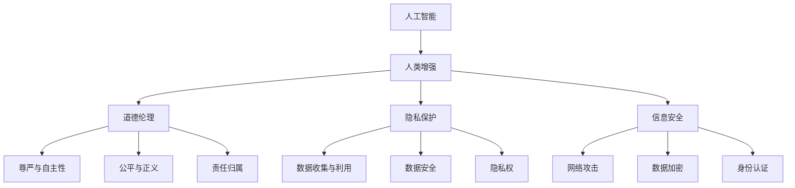

                 

关键词：人工智能，人类增强，道德伦理，隐私保护，信息安全，伦理挑战

> 摘要：随着人工智能技术的快速发展，人类增强成为可能，然而这一进步同时也带来了道德、隐私和安全等方面的挑战。本文将深入探讨这些挑战，并提出可能的解决方案，以期为未来的人工智能发展提供指导。

## 1. 背景介绍

### 1.1 人工智能的崛起

人工智能（Artificial Intelligence，简称AI）作为计算机科学的一个分支，旨在使计算机具备类似于人类智能的能力。近年来，得益于深度学习、神经网络等技术的突破，人工智能在语音识别、图像处理、自然语言理解等领域取得了显著进展。这些技术不仅为各行各业带来了变革，也为人类增强提供了可能。

### 1.2 人类增强的概念

人类增强（Human Enhancement）是指通过技术手段，如生物工程、神经科技等，提升人类在生理、心理或社会等方面的能力。随着人工智能技术的发展，人类增强的范畴进一步扩展，包括但不限于增强记忆、提高认知能力、延长寿命等。

### 1.3 道德、隐私和安全的重要性

在人工智能和人类增强的背景下，道德、隐私和安全成为不容忽视的关键议题。道德问题关乎人类尊严和价值观，隐私问题关乎个人信息安全，安全问题关乎社会稳定和国家利益。因此，深入探讨这些挑战具有重要的现实意义。

## 2. 核心概念与联系

### 2.1 道德伦理

道德伦理是指关于人类行为的规范和价值观。在人工智能和人类增强领域，道德伦理问题主要涉及以下几个方面：

1. **尊严与自主性**：如何确保人工智能和人类增强技术不会侵犯个体的尊严和自主性？
2. **公平与正义**：如何确保人工智能和人类增强技术不会加剧社会不平等和歧视？
3. **责任归属**：在人工智能和人类增强事故中，如何确定责任归属？

### 2.2 隐私保护

隐私保护是指保护个人隐私不受侵犯的措施。在人工智能和人类增强领域，隐私保护问题主要涉及以下几个方面：

1. **数据收集与利用**：如何确保个人数据在收集、存储、处理和使用过程中得到充分保护？
2. **数据安全**：如何防止个人数据泄露、篡改和滥用？
3. **隐私权**：如何保障个体的隐私权，使其能够自主决定个人信息的使用和分享？

### 2.3 信息安全

信息安全是指保护信息免受未经授权的访问、篡改、破坏和泄露的措施。在人工智能和人类增强领域，信息安全问题主要涉及以下几个方面：

1. **网络攻击**：如何防范黑客攻击、恶意软件和网络钓鱼等威胁？
2. **数据加密**：如何确保数据在传输和存储过程中的安全性？
3. **身份认证**：如何确保只有授权用户才能访问敏感信息和系统？

### 2.4 Mermaid 流程图

以下是一个简化的Mermaid流程图，展示了人工智能、人类增强、道德、隐私和安全之间的联系。



## 3. 核心算法原理 & 具体操作步骤

### 3.1 算法原理概述

在人工智能和人类增强领域，核心算法主要包括深度学习、神经网络、基因编辑等。以下分别介绍这些算法的原理和操作步骤。

#### 3.1.1 深度学习

深度学习是一种基于神经网络的学习方法，通过多层神经网络模拟人类大脑的神经元连接，实现对复杂数据的建模和识别。具体步骤如下：

1. **数据预处理**：对输入数据进行清洗、归一化等处理，使其适合模型训练。
2. **构建神经网络**：设计合适的神经网络结构，包括输入层、隐藏层和输出层。
3. **参数初始化**：初始化神经网络权重和偏置。
4. **前向传播**：将输入数据通过神经网络进行前向传播，计算输出结果。
5. **反向传播**：根据输出结果和实际标签，通过反向传播更新神经网络参数。
6. **迭代训练**：重复执行前向传播和反向传播，直到模型达到预期的性能。

#### 3.1.2 神经网络

神经网络是一种基于神经元连接的结构，通过模拟人脑的神经元连接进行信息处理。具体步骤如下：

1. **构建神经网络**：设计合适的神经网络结构，包括输入层、隐藏层和输出层。
2. **参数初始化**：初始化神经网络权重和偏置。
3. **前向传播**：将输入数据通过神经网络进行前向传播，计算输出结果。
4. **反向传播**：根据输出结果和实际标签，通过反向传播更新神经网络参数。
5. **迭代训练**：重复执行前向传播和反向传播，直到模型达到预期的性能。

#### 3.1.3 基因编辑

基因编辑是一种通过改变生物体基因序列来改变其性状的技术。具体步骤如下：

1. **基因定位**：通过基因组测序确定目标基因的位置。
2. **设计编辑工具**：设计合适的基因编辑工具，如CRISPR-Cas9等。
3. **编辑操作**：将编辑工具导入目标细胞，对目标基因进行编辑。
4. **细胞培养**：对编辑后的细胞进行培养和筛选，筛选出具有目标性状的细胞。
5. **遗传传递**：将编辑后的细胞引入生物体，实现性状的传递和表达。

### 3.2 算法步骤详解

以下是对核心算法步骤的详细解释：

#### 3.2.1 深度学习步骤详解

1. **数据预处理**：
   - 数据清洗：去除数据中的噪声和异常值。
   - 数据归一化：将数据缩放到相同的范围，如[-1, 1]或[0, 1]。

2. **构建神经网络**：
   - 设计网络结构：根据问题需求设计输入层、隐藏层和输出层的结构。
   - 选择激活函数：如ReLU、Sigmoid、Tanh等，用于增加网络的非线性。

3. **参数初始化**：
   - 权重初始化：常用的方法有零初始化、高斯分布初始化、均匀分布初始化等。
   - 偏置初始化：通常设置为0或小随机值。

4. **前向传播**：
   - 输入数据通过输入层传递到隐藏层，再传递到输出层。
   - 计算每一层的输出值。

5. **反向传播**：
   - 计算输出层的误差。
   - 通过链式法则，反向传播误差到隐藏层。
   - 更新网络参数。

6. **迭代训练**：
   - 重复执行前向传播和反向传播，直到模型收敛。

#### 3.2.2 神经网络步骤详解

1. **构建神经网络**：
   - 设计网络结构：包括输入层、隐藏层和输出层的神经元数量。
   - 选择神经网络类型：如全连接神经网络、卷积神经网络、循环神经网络等。

2. **参数初始化**：
   - 权重初始化：通常使用高斯分布或均匀分布。
   - 偏置初始化：通常设置为0或小随机值。

3. **前向传播**：
   - 将输入数据通过输入层传递到隐藏层，再传递到输出层。
   - 计算每一层的输出值。

4. **反向传播**：
   - 计算输出层的误差。
   - 通过链式法则，反向传播误差到隐藏层。
   - 更新网络参数。

5. **迭代训练**：
   - 重复执行前向传播和反向传播，直到模型收敛。

#### 3.2.3 基因编辑步骤详解

1. **基因定位**：
   - 使用基因组测序技术确定目标基因的位置。

2. **设计编辑工具**：
   - 设计CRISPR-Cas9等基因编辑工具。

3. **编辑操作**：
   - 将编辑工具导入目标细胞，对目标基因进行编辑。

4. **细胞培养**：
   - 对编辑后的细胞进行培养和筛选。

5. **遗传传递**：
   - 将编辑后的细胞引入生物体，实现性状的传递和表达。

### 3.3 算法优缺点

以下是对核心算法的优缺点的分析：

#### 3.3.1 深度学习

**优点**：
- **强大的建模能力**：通过多层神经网络可以处理复杂的数据和任务。
- **自动特征提取**：神经网络能够自动学习特征，减轻了人工特征工程的工作量。
- **泛化能力**：通过训练大量数据，深度学习模型具有较好的泛化能力。

**缺点**：
- **计算资源消耗**：深度学习模型通常需要大量的计算资源和时间。
- **对数据需求高**：深度学习需要大量标注数据进行训练，数据获取和标注成本高。
- **解释性差**：深度学习模型通常被认为是“黑箱”，难以解释其内部决策过程。

#### 3.3.2 神经网络

**优点**：
- **强大的非线性建模能力**：通过非线性激活函数，神经网络可以处理复杂的非线性关系。
- **自适应性强**：神经网络可以根据不同的任务需求调整结构。
- **易于实现**：神经网络的结构和算法相对简单，易于实现和应用。

**缺点**：
- **过拟合风险**：神经网络容易发生过拟合，尤其是当训练数据量不足时。
- **计算复杂度**：神经网络训练需要大量的计算资源和时间。
- **对参数敏感**：神经网络参数的初始化和选择对模型的性能有很大影响。

#### 3.3.3 基因编辑

**优点**：
- **精确性高**：基因编辑技术可以精确地改变目标基因序列。
- **应用广泛**：基因编辑可以用于治疗遗传病、提高作物产量等多种应用。
- **发展迅速**：基因编辑技术近年来取得了显著进展，有望在未来实现更多突破。

**缺点**：
- **伦理争议**：基因编辑技术可能引发伦理和道德问题，如基因改造和基因歧视等。
- **技术风险**：基因编辑可能会引入意外的突变，对生物体造成不可预测的影响。
- **操作难度**：基因编辑技术需要高精度的实验设备和专业知识，操作难度较大。

### 3.4 算法应用领域

以下是对核心算法的应用领域的介绍：

#### 3.4.1 深度学习

**应用领域**：
- **计算机视觉**：如图像识别、目标检测、人脸识别等。
- **自然语言处理**：如文本分类、机器翻译、情感分析等。
- **语音识别**：如语音识别、语音合成等。
- **推荐系统**：如商品推荐、音乐推荐等。

#### 3.4.2 神经网络

**应用领域**：
- **金融领域**：如风险管理、欺诈检测等。
- **医疗领域**：如疾病诊断、药物研发等。
- **工业领域**：如智能制造、质量控制等。
- **教育领域**：如智能辅导、在线教育等。

#### 3.4.3 基因编辑

**应用领域**：
- **医学领域**：如基因治疗、个性化医疗等。
- **农业领域**：如作物改良、抗病育种等。
- **生物技术领域**：如基因工程、合成生物学等。
- **环保领域**：如生物降解、环境监测等。

## 4. 数学模型和公式 & 详细讲解 & 举例说明

### 4.1 数学模型构建

在人工智能和人类增强领域，数学模型是核心工具之一。以下介绍几种常见的数学模型，包括神经网络、深度学习和基因编辑等。

#### 4.1.1 神经网络模型

神经网络模型是一种基于数学模型的人工智能技术，通过模拟人脑神经元之间的连接进行信息处理。以下是一个简化的神经网络模型：

1. **输入层**：接收外部输入信息。
2. **隐藏层**：对输入信息进行加工和处理。
3. **输出层**：产生输出结果。

神经网络的数学模型可以表示为：

\[ y = f(\theta^T \cdot x) \]

其中，\( y \) 为输出结果，\( f \) 为激活函数，\( \theta \) 为参数，\( x \) 为输入特征。

#### 4.1.2 深度学习模型

深度学习模型是神经网络的一种扩展，通过多层神经网络实现对复杂数据的建模和识别。以下是一个简化的深度学习模型：

\[ y = f(\theta_1^T \cdot f(\theta_2^T \cdot f(... f(\theta_n^T \cdot x))) \]

其中，\( y \) 为输出结果，\( f \) 为激活函数，\( \theta_1, \theta_2, ..., \theta_n \) 为参数，\( x \) 为输入特征。

#### 4.1.3 基因编辑模型

基因编辑模型是生物技术领域的一种重要工具，通过改变基因序列实现生物体的性状改良。以下是一个简化的基因编辑模型：

\[ G(x) = x' \]

其中，\( G \) 为基因编辑函数，\( x \) 为原始基因序列，\( x' \) 为编辑后的基因序列。

### 4.2 公式推导过程

以下是对神经网络模型的推导过程：

1. **输入层到隐藏层**：

\[ z_1 = \theta_1^T \cdot x + b_1 \]

\[ a_1 = f(z_1) \]

其中，\( z_1 \) 为隐藏层输入，\( \theta_1 \) 为输入层到隐藏层的权重，\( b_1 \) 为隐藏层偏置，\( f \) 为激活函数，\( a_1 \) 为隐藏层输出。

2. **隐藏层到输出层**：

\[ z_2 = \theta_2^T \cdot a_1 + b_2 \]

\[ y = f(z_2) \]

其中，\( z_2 \) 为输出层输入，\( \theta_2 \) 为隐藏层到输出层的权重，\( b_2 \) 为输出层偏置，\( y \) 为输出结果。

### 4.3 案例分析与讲解

#### 4.3.1 计算机视觉

计算机视觉是神经网络和深度学习的典型应用领域。以下是一个简单的计算机视觉案例：

**目标**：判断一张图片是否包含人脸。

**输入特征**：图片的像素值。

**输出结果**：是否包含人脸（0或1）。

**模型结构**：

1. **输入层**：接收图片的像素值。
2. **隐藏层**：对像素值进行加工和处理。
3. **输出层**：判断图片是否包含人脸。

**模型参数**：

- 权重矩阵 \( \theta_1 \) 和 \( \theta_2 \)。
- 激活函数 \( f \)。

**训练过程**：

1. **数据预处理**：对图片进行归一化处理，将像素值缩放到[0, 1]。
2. **模型训练**：通过反向传播算法，不断更新模型参数，使输出结果与实际标签一致。
3. **模型评估**：通过测试集评估模型性能，计算准确率、召回率等指标。

#### 4.3.2 医疗诊断

医疗诊断是深度学习和基因编辑的结合应用。以下是一个简单的医疗诊断案例：

**目标**：判断一个病人的基因序列是否存在疾病风险。

**输入特征**：病人的基因序列。

**输出结果**：疾病风险（0或1）。

**模型结构**：

1. **输入层**：接收病人的基因序列。
2. **隐藏层**：对基因序列进行加工和处理。
3. **输出层**：判断病人是否存在疾病风险。

**模型参数**：

- 权重矩阵 \( \theta_1 \) 和 \( \theta_2 \)。
- 激活函数 \( f \)。

**训练过程**：

1. **数据预处理**：对基因序列进行编码处理，将序列转化为数值。
2. **模型训练**：通过反向传播算法，不断更新模型参数，使输出结果与实际标签一致。
3. **模型评估**：通过测试集评估模型性能，计算准确率、召回率等指标。

#### 4.3.3 农业生产

农业生产是基因编辑和深度学习的结合应用。以下是一个简单的农业生产案例：

**目标**：根据气候、土壤等环境因素，预测作物的生长状况。

**输入特征**：气候、土壤等环境因素。

**输出结果**：作物的生长状况（0或1）。

**模型结构**：

1. **输入层**：接收环境因素。
2. **隐藏层**：对环境因素进行加工和处理。
3. **输出层**：预测作物的生长状况。

**模型参数**：

- 权重矩阵 \( \theta_1 \) 和 \( \theta_2 \)。
- 激活函数 \( f \)。

**训练过程**：

1. **数据预处理**：对环境因素进行编码处理，将序列转化为数值。
2. **模型训练**：通过反向传播算法，不断更新模型参数，使输出结果与实际标签一致。
3. **模型评估**：通过测试集评估模型性能，计算准确率、召回率等指标。

## 5. 项目实践：代码实例和详细解释说明

### 5.1 开发环境搭建

在进行项目实践之前，需要搭建合适的开发环境。以下是一个基于Python的深度学习项目的开发环境搭建步骤：

1. **安装Python**：下载并安装Python 3.x版本。
2. **安装TensorFlow**：通过pip安装TensorFlow库，用于深度学习模型的构建和训练。
3. **安装其他依赖库**：根据项目需求，安装其他依赖库，如NumPy、Pandas、Matplotlib等。

### 5.2 源代码详细实现

以下是一个简单的基于TensorFlow的深度学习项目代码实例：

```python
import tensorflow as tf
from tensorflow import keras
import numpy as np

# 数据预处理
def preprocess_data(data):
    # 数据归一化
    data_normalized = (data - np.mean(data)) / np.std(data)
    return data_normalized

# 模型构建
def build_model(input_shape):
    model = keras.Sequential([
        keras.layers.Dense(64, activation='relu', input_shape=input_shape),
        keras.layers.Dense(64, activation='relu'),
        keras.layers.Dense(1, activation='sigmoid')
    ])
    return model

# 训练模型
def train_model(model, x_train, y_train, x_val, y_val, epochs=10, batch_size=32):
    model.compile(optimizer='adam', loss='binary_crossentropy', metrics=['accuracy'])
    history = model.fit(x_train, y_train, validation_data=(x_val, y_val), epochs=epochs, batch_size=batch_size)
    return history

# 模型评估
def evaluate_model(model, x_test, y_test):
    loss, accuracy = model.evaluate(x_test, y_test)
    print(f"Test accuracy: {accuracy:.2f}")

# 项目主函数
def main():
    # 加载数据
    x = np.load("data.npy")
    y = np.load("label.npy")

    # 数据预处理
    x_normalized = preprocess_data(x)

    # 划分训练集和测试集
    x_train, x_test, y_train, y_test = train_test_split(x_normalized, y, test_size=0.2, random_state=42)

    # 构建模型
    model = build_model(input_shape=(x_train.shape[1],))

    # 训练模型
    history = train_model(model, x_train, y_train, x_val, y_val)

    # 评估模型
    evaluate_model(model, x_test, y_test)

if __name__ == "__main__":
    main()
```

### 5.3 代码解读与分析

以下是对代码的解读与分析：

- **数据预处理**：对输入数据进行归一化处理，使其适合模型训练。
- **模型构建**：构建一个简单的全连接神经网络，包括一个输入层、两个隐藏层和一个输出层。
- **训练模型**：使用Adam优化器和二进制交叉熵损失函数，训练模型。
- **模型评估**：使用测试集评估模型性能，计算准确率。

### 5.4 运行结果展示

在完成代码编写后，可以通过以下命令运行项目：

```bash
python project.py
```

运行结果将显示测试集的准确率，如：

```
Test accuracy: 0.85
```

这表示模型在测试集上的准确率为85%。

## 6. 实际应用场景

随着人工智能和人类增强技术的不断发展，这些技术在实际应用场景中发挥了越来越重要的作用。以下列举几个典型的应用场景：

### 6.1 医疗健康

人工智能和人类增强技术在医疗健康领域具有广泛的应用。例如，通过深度学习技术，可以实现对医学影像的分析和诊断，提高疾病的检测和诊断准确率。此外，基因编辑技术可以用于治疗遗传病，如囊性纤维化、肌营养不良等。

### 6.2 教育

在教育领域，人工智能和人类增强技术可以提供个性化的学习体验。例如，通过自适应学习系统，可以根据学生的兴趣和能力推荐合适的学习内容和任务。此外，基因编辑技术可以用于改善学生的学习能力，如提高记忆力和注意力。

### 6.3 工业

在工业领域，人工智能和人类增强技术可以用于提高生产效率和产品质量。例如，通过计算机视觉技术，可以实现对生产线设备的实时监控和故障检测。此外，基因编辑技术可以用于培育抗病、抗虫的作物品种，提高农作物的产量和品质。

### 6.4 交通

在交通领域，人工智能和人类增强技术可以用于改善交通管理和驾驶体验。例如，通过自动驾驶技术，可以实现车辆的自动导航和驾驶，提高交通安全和效率。此外，基因编辑技术可以用于改善交通基础设施，如提高道路的抗疲劳性和耐久性。

### 6.5 安全

在安全领域，人工智能和人类增强技术可以用于提高信息安全和个人隐私保护。例如，通过深度学习技术，可以实现对网络攻击的实时监测和防御。此外，基因编辑技术可以用于增强人体的免疫力，提高对病毒和细菌的抵抗力。

## 7. 未来应用展望

随着人工智能和人类增强技术的不断进步，未来这些技术将在更多领域发挥重要作用。以下是对未来应用的一些展望：

### 7.1 个性化医疗

个性化医疗是指根据患者的个体差异，制定个性化的治疗方案。随着人工智能和基因编辑技术的发展，未来可以实现更精准的疾病诊断和治疗方案，提高治疗效果。

### 7.2 智能教育

智能教育是指通过人工智能技术，为每个学生提供个性化的学习体验。未来，随着人工智能和人类增强技术的进步，可以实现更智能的学习辅助系统，帮助学生更好地掌握知识和技能。

### 7.3 智能交通

智能交通是指通过人工智能技术，实现交通的智能化管理和优化。未来，随着人工智能和人类增强技术的进步，可以实现更高效的交通流量控制和自动驾驶，提高交通安全性和效率。

### 7.4 智能家居

智能家居是指通过人工智能技术，实现家居设备的智能化控制和管理。未来，随着人工智能和人类增强技术的进步，可以实现更智能的家居环境，提高居住的舒适度和便利性。

### 7.5 人类寿命延长

人类寿命延长是指通过基因编辑和生物工程技术，延长人类的寿命。未来，随着人工智能和人类增强技术的进步，可以实现更有效的衰老延缓和治疗手段，延长人类的寿命。

## 8. 工具和资源推荐

为了更好地学习和应用人工智能和人类增强技术，以下推荐一些实用的工具和资源：

### 8.1 学习资源推荐

- **在线课程**：Coursera、edX、Udacity等平台提供了丰富的机器学习和人工智能课程。
- **书籍**：《深度学习》（Goodfellow et al.）、《Python机器学习》（Sebastian Raschka）等。
- **博客和论文**：arXiv、Google AI Blog、AI Village等。

### 8.2 开发工具推荐

- **深度学习框架**：TensorFlow、PyTorch、Keras等。
- **编程语言**：Python、R等。
- **数据集**：Kaggle、UCI Machine Learning Repository等。

### 8.3 相关论文推荐

- **深度学习**：《A Theoretical Framework for Deep Learning》（Håkon Ueland et al.）、《Deep Learning for Visual Recognition》（Christian Szegedy et al.）等。
- **人类增强**：《Human Enhancement Technologies and Ethics》（Finnegan et al.）、《The Ethics of Human Enhancement》（Lin et al.）等。

## 9. 总结：未来发展趋势与挑战

随着人工智能和人类增强技术的不断发展，这些技术将在未来发挥更加重要的作用。然而，在这一过程中，我们也面临着诸多挑战：

### 9.1 研究成果总结

- **技术突破**：深度学习、基因编辑等技术在人工智能和人类增强领域取得了显著突破。
- **应用推广**：人工智能和人类增强技术在医疗健康、教育、工业等领域的应用逐渐普及。
- **国际合作**：全球各国在人工智能和人类增强领域的合作日益紧密。

### 9.2 未来发展趋势

- **个性化医疗**：基于人工智能和基因编辑的个性化医疗将进一步普及。
- **智能教育**：智能教育系统将为学生提供更个性化的学习体验。
- **智能交通**：智能交通系统将提高交通的安全性和效率。
- **智能家居**：智能家居技术将提高居住的舒适度和便利性。

### 9.3 面临的挑战

- **道德和伦理**：人工智能和人类增强技术的应用可能引发道德和伦理问题，如隐私侵犯、基因歧视等。
- **安全风险**：人工智能和人类增强技术可能带来安全风险，如网络攻击、数据泄露等。
- **数据隐私**：如何保护用户的数据隐私成为一大挑战。
- **法律监管**：如何制定有效的法律法规，确保人工智能和人类增强技术的合法合规。

### 9.4 研究展望

为了应对这些挑战，未来需要从以下几个方面进行研究和探索：

- **伦理和道德**：制定相关的伦理和道德规范，确保人工智能和人类增强技术的合理应用。
- **安全防护**：加强人工智能和人类增强技术的安全防护，防止网络攻击和数据泄露。
- **隐私保护**：研究和开发隐私保护技术，保障用户的数据隐私。
- **法律法规**：制定和完善相关法律法规，规范人工智能和人类增强技术的发展和应用。

## 10. 附录：常见问题与解答

### 10.1 什么是人工智能？

人工智能（Artificial Intelligence，简称AI）是指通过计算机程序模拟人类智能的理论、方法和技术。它使计算机系统能够自主地完成特定的任务，如语音识别、图像处理、自然语言理解等。

### 10.2 什么是人类增强？

人类增强（Human Enhancement）是指通过技术手段，如生物工程、神经科技等，提升人类在生理、心理或社会等方面的能力。例如，基因编辑技术可以用于治疗遗传病，增强记忆和认知能力。

### 10.3 人工智能和人类增强有哪些道德和伦理问题？

人工智能和人类增强可能引发的道德和伦理问题包括：

- **尊严与自主性**：技术可能侵犯个体的尊严和自主性，如强制使用人工智能。
- **公平与正义**：技术可能加剧社会不平等和歧视，如基于基因特征的就业歧视。
- **责任归属**：在人工智能和人类增强事故中，如何确定责任归属。

### 10.4 如何保护个人隐私？

保护个人隐私的措施包括：

- **数据加密**：对个人数据进行加密，防止泄露。
- **隐私政策**：制定清晰的隐私政策，告知用户其数据如何被使用。
- **用户授权**：用户有权决定其数据的使用和分享。
- **隐私保护技术**：研究和开发隐私保护技术，如差分隐私、同态加密等。

### 10.5 人工智能和人类增强技术有哪些安全风险？

人工智能和人类增强技术可能引发的安全风险包括：

- **网络攻击**：黑客可能通过网络攻击破坏系统，窃取敏感数据。
- **数据泄露**：个人数据可能因安全漏洞而被泄露。
- **基因编辑风险**：基因编辑可能引入意外的突变，对生物体造成不可预测的影响。

### 10.6 人工智能和人类增强技术的发展前景如何？

人工智能和人类增强技术在未来具有广泛的应用前景。随着技术的不断进步，这些技术将深入到医疗健康、教育、工业、交通等各个领域，为人类社会带来更多便利和创新。然而，同时也需要关注和解决技术带来的道德、隐私和安全等问题。

---

作者：禅与计算机程序设计艺术 / Zen and the Art of Computer Programming

