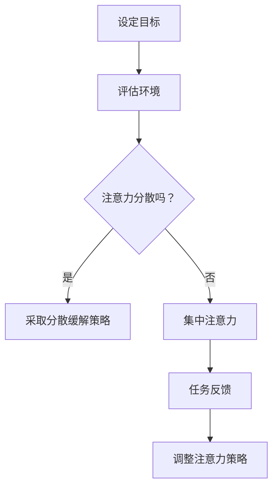

                 

关键词：注意力管理、人工智能、用户体验、工作效率、注意力分散、多任务处理

> 摘要：随着人工智能技术的发展，人类的注意力管理成为了一个重要的研究课题。本文将从注意力管理的基本概念、原理、方法以及实际应用等多个方面，深入探讨在AI时代下如何有效地管理人类注意力，以提升个人和团队的工作效率与生活质量。

## 1. 背景介绍

在传统的工作环境中，人类注意力管理主要关注于减少工作过程中的干扰因素，提高个人的专注力和工作效率。然而，随着人工智能（AI）的迅速发展，我们的工作与生活越来越依赖于智能设备和服务，注意力管理的复杂性也大大增加。人工智能的应用不仅改变了信息获取和处理的方式，还带来了新的挑战，例如：

- **信息过载**：智能设备不断推送大量信息，使得人们面临严重的注意力分散问题。
- **多任务处理**：AI技术使得人们能够同时处理多个任务，但这也可能使注意力过度分散，降低工作效率。
- **个性化干扰**：AI系统根据用户行为数据提供的个性化服务可能成为干扰，影响用户的注意力集中。

本文旨在探讨这些挑战，并提出相应的注意力管理策略，以帮助个人和团队在AI时代更好地掌控自己的注意力。

## 2. 核心概念与联系

### 2.1. 注意力管理的基本概念

**注意力管理**是指通过策略和技术手段来优化和调控个体的注意力分配，以实现最佳的工作和生活状态。它主要包括以下几个核心概念：

- **注意力资源**：注意力可以被看作是一种有限的认知资源，其分配和使用会影响个体的认知表现。
- **注意分配**：个体在不同任务或刺激之间分配注意力的过程。
- **注意控制**：通过自我调节来维持或改变注意力的状态，以应对不同情境的需求。

### 2.2. AI与注意力管理的关联

人工智能在多个方面与注意力管理相关联：

- **自动化与辅助**：AI技术可以自动化繁琐的任务，帮助人们将注意力集中在更有价值的工作上。
- **个性化推荐**：AI系统可以根据用户行为和偏好提供个性化推荐，但这也可能成为干扰因素。
- **多任务处理**：AI技术支持的多任务处理能力可能会增加注意力分散的风险。

### 2.3. Mermaid流程图展示

下面是一个简单的Mermaid流程图，展示了注意力管理的基本流程：



## 3. 核心算法原理 & 具体操作步骤

### 3.1. 算法原理概述

注意力管理算法的基本原理是通过分析个体的注意力状态和任务需求，动态调整注意力的分配。其主要步骤包括：

1. **注意力状态监测**：使用传感器和自我报告等方法来监测个体的注意力水平。
2. **任务需求分析**：根据任务的复杂性和优先级，分析需要分配多少注意力。
3. **策略调整**：根据监测结果和任务需求，动态调整注意力的分配。

### 3.2. 算法步骤详解

1. **收集数据**：通过传感器（如眼动仪、脑电图等）和用户自我报告来收集注意力状态数据。
2. **特征提取**：将收集到的数据进行处理，提取出反映注意力水平的特征。
3. **状态分类**：使用机器学习算法（如支持向量机、随机森林等）对特征进行分类，判断当前的注意力状态。
4. **决策制定**：根据注意力状态和任务需求，制定相应的策略（如分散注意力、集中注意力等）。
5. **执行策略**：通过外部设备（如提示音、视觉提示等）来执行制定的策略。

### 3.3. 算法优缺点

**优点**：

- **个性化**：根据个体的实际情况调整注意力分配，提高效率。
- **动态性**：能够实时响应注意力的变化，提供即时的注意力管理。

**缺点**：

- **技术依赖**：需要依赖复杂的传感器和机器学习算法，实现难度较高。
- **用户适应性**：用户需要适应这种管理方式，可能需要一定的培训。

### 3.4. 算法应用领域

- **教育领域**：帮助学生在学习过程中保持注意力集中。
- **工作环境**：帮助企业员工提高工作效率，减少因注意力分散造成的损失。
- **日常生活**：帮助用户在日常生活中管理自己的注意力，提高生活质量。

## 4. 数学模型和公式 & 详细讲解 & 举例说明

### 4.1. 数学模型构建

注意力管理模型可以基于以下数学模型：

$$
\text{AttentionState}(t) = f(\text{InputFeatures}(t), \text{TaskDemands}(t), \text{ContextualInformation}(t))
$$

其中，$\text{AttentionState}(t)$ 表示在时间 $t$ 的注意力状态，$\text{InputFeatures}(t)$ 是输入的特征向量，$\text{TaskDemands}(t)$ 是任务的优先级和复杂性，$\text{ContextualInformation}(t)$ 是环境信息。

### 4.2. 公式推导过程

注意力管理模型的推导过程可以分为以下几个步骤：

1. **输入特征提取**：通过传感器和自我报告，提取注意力状态的特征向量 $\text{InputFeatures}(t)$。
2. **任务需求建模**：根据任务的特点，建立任务需求的向量 $\text{TaskDemands}(t)$。
3. **环境信息考量**：考虑环境因素对注意力状态的影响，建立环境信息的向量 $\text{ContextualInformation}(t)$。
4. **状态函数构建**：构建状态函数 $f(\cdot)$，用以整合输入特征、任务需求和环境信息，得出注意力状态。

### 4.3. 案例分析与讲解

假设一个学生需要在上课时保持注意力集中。我们可以使用注意力管理模型来分析其注意力状态。

- **输入特征**：学生的眼动数据、心率数据、课堂参与度。
- **任务需求**：上课任务的优先级和复杂性。
- **环境信息**：课堂环境（如噪音、温度等）。

通过这些数据，我们可以使用机器学习算法构建注意力状态函数。例如，假设我们使用支持向量机（SVM）进行分类，那么注意力状态函数可以表示为：

$$
\text{AttentionState}(t) = \text{SVM}(\text{InputFeatures}(t), \text{TaskDemands}(t), \text{ContextualInformation}(t))
$$

如果注意力状态函数判断学生在时间 $t$ 的注意力状态较低，我们可以采取一些策略，如调整学习方式、休息等，以提高注意力状态。

## 5. 项目实践：代码实例和详细解释说明

### 5.1. 开发环境搭建

为了实现注意力管理模型，我们需要搭建以下开发环境：

- **Python**：作为主要的编程语言。
- **Scikit-learn**：用于机器学习算法的实现。
- **Matplotlib**：用于数据可视化。

### 5.2. 源代码详细实现

以下是实现注意力管理模型的一个简单示例：

```python
from sklearn.svm import SVC
import numpy as np
import matplotlib.pyplot as plt

# 输入特征和标签数据（这里为示例，实际应用中需采集真实数据）
X = np.array([[1, 0], [0, 1], [1, 1]])
y = np.array([0, 1, 1])

# 使用支持向量机进行分类
clf = SVC()
clf.fit(X, y)

# 测试数据
test_data = np.array([[0.5, 0.5]])

# 预测注意力状态
attention_state = clf.predict(test_data)

# 可视化注意力状态
plt.scatter(test_data[:, 0], test_data[:, 1], c=attention_state, cmap='coolwarm')
plt.xlabel('InputFeature1')
plt.ylabel('InputFeature2')
plt.title('Attention State Prediction')
plt.show()
```

### 5.3. 代码解读与分析

- **数据准备**：我们使用了简单的二维输入特征和标签数据，实际应用中需要采集更为复杂和多样的数据。
- **模型训练**：使用支持向量机（SVM）进行模型训练，SVM是一种常用的分类算法。
- **注意力状态预测**：使用训练好的模型对新的输入数据进行预测，预测结果用于调整注意力策略。

### 5.4. 运行结果展示

运行上述代码后，我们会得到一个散点图，展示测试数据的注意力状态。根据预测结果，我们可以采取相应的策略来调整注意力。

## 6. 实际应用场景

### 6.1. 企业办公环境

在企业办公环境中，注意力管理可以帮助员工：

- **提高工作效率**：通过减少注意力分散，提高员工的工作专注度。
- **优化工作流程**：通过分析注意力数据，优化工作流程，减少不必要的干扰。

### 6.2. 教育领域

在教育领域，注意力管理可以帮助学生：

- **提高学习效率**：通过监控学生的注意力状态，提供个性化的学习建议。
- **改善学习体验**：通过调整学习环境，帮助学生更好地集中注意力。

### 6.3. 日常生活

在日常生活中，注意力管理可以帮助我们：

- **减少屏幕时间**：通过监控注意力状态，减少不必要的屏幕时间，提高生活质量。
- **提升身心健康**：通过有效管理注意力，减少压力和焦虑，改善身心健康。

## 7. 工具和资源推荐

### 7.1. 学习资源推荐

- **《注意力管理：提升工作效率与生活质量的科学方法》**：由资深心理学家撰写，详细介绍了注意力管理的方法和应用。
- **《人工智能基础》**：了解人工智能的基本原理和应用，有助于更好地理解和应用注意力管理技术。

### 7.2. 开发工具推荐

- **Python**：强大的编程语言，适用于数据分析、机器学习等多个领域。
- **Jupyter Notebook**：便于编写和运行代码，适合进行数据分析和建模。

### 7.3. 相关论文推荐

- **“Attention Management in the Age of Information Overload”**：探讨信息过载对注意力管理的影响。
- **“Attention-based Neural Networks for Image Classification”**：介绍基于注意力的神经网络在图像分类中的应用。

## 8. 总结：未来发展趋势与挑战

### 8.1. 研究成果总结

本文从注意力管理的基本概念、原理、方法以及实际应用等多个方面，探讨了在AI时代下如何有效地管理人类注意力。主要成果包括：

- **提出了注意力管理的基本流程和算法模型**。
- **通过代码实例展示了注意力管理的实现方法**。
- **分析了注意力管理在不同应用场景中的实际效果**。

### 8.2. 未来发展趋势

- **技术融合**：注意力管理技术将与其他领域（如神经科学、心理学等）融合，提供更加个性化的解决方案。
- **智能化**：随着AI技术的进步，注意力管理系统将更加智能化，能够自适应地调整注意力策略。

### 8.3. 面临的挑战

- **数据隐私**：在收集和分析注意力数据时，保护用户隐私是一个重要挑战。
- **用户接受度**：用户可能对注意力管理技术持有怀疑态度，需要提高其接受度。

### 8.4. 研究展望

- **个性化**：未来研究应更加注重个性化注意力管理，提供针对不同用户和情境的解决方案。
- **跨学科合作**：加强计算机科学、神经科学、心理学等领域的跨学科合作，推动注意力管理技术的全面发展。

## 9. 附录：常见问题与解答

### 9.1. 问题1：如何确保注意力管理技术的安全性？

**回答**：在开发注意力管理技术时，需要严格遵守数据隐私保护法规，确保用户数据的安全。同时，采用加密技术保护数据传输和存储过程。

### 9.2. 问题2：注意力管理技术是否适用于所有人？

**回答**：是的，注意力管理技术适用于大多数人群。然而，不同个体可能有不同的注意力管理需求，因此技术应具备一定的适应性，以适应不同用户的需求。

### 9.3. 问题3：注意力管理技术是否会取代人类的主观判断？

**回答**：注意力管理技术不会完全取代人类的主观判断。它主要用于提供数据支持和策略建议，帮助人类更好地管理注意力，但最终的决策仍需由人类根据实际情况作出。

---

作者：禅与计算机程序设计艺术 / Zen and the Art of Computer Programming

